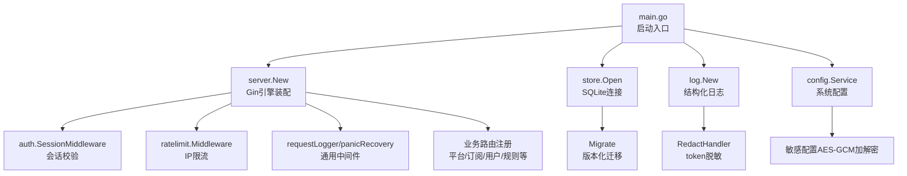
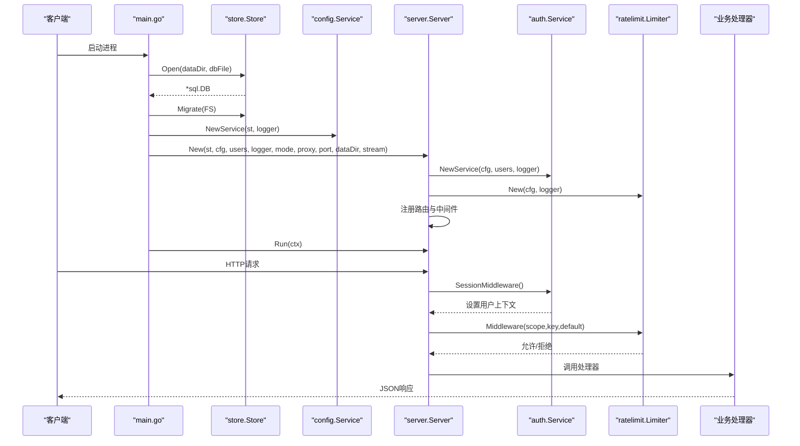
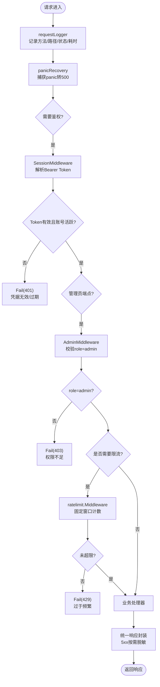
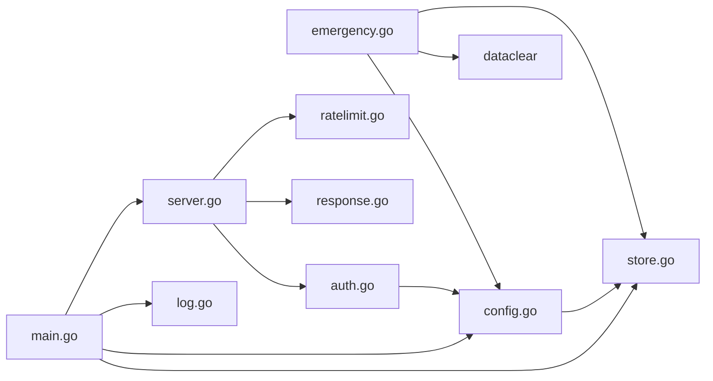

# HTTP服务架构

<cite>
**本文引用的文件**
- [backend/cmd/server/main.go](file://backend/cmd/server/main.go)
- [backend/internal/server/server.go](file://backend/internal/server/server.go)
- [backend/internal/config/config.go](file://backend/internal/config/config.go)
- [backend/internal/log/log.go](file://backend/internal/log/log.go)
- [backend/internal/store/store.go](file://backend/internal/store/store.go)
- [backend/internal/auth/auth.go](file://backend/internal/auth/auth.go)
- [backend/internal/ratelimit/ratelimit.go](file://backend/internal/ratelimit/ratelimit.go)
- [backend/internal/emergency/emergency.go](file://backend/internal/emergency/emergency.go)
- [backend/internal/response/response.go](file://backend/internal/response/response.go)
</cite>

## 目录
1. [简介](#简介)
2. [项目结构](#项目结构)
3. [核心组件](#核心组件)
4. [架构总览](#架构总览)
5. [详细组件分析](#详细组件分析)
6. [依赖关系分析](#依赖关系分析)
7. [性能与监控](#性能与监控)
8. [故障排查指南](#故障排查指南)
9. [结论](#结论)

## 简介
本文件面向Go后端HTTP服务的架构设计，聚焦于Gin框架的初始化配置、路由注册机制、中间件链设计与请求处理流程。文档覆盖服务器启动流程（环境变量解析、日志系统初始化、数据库连接建立、服务依赖注入）、优雅退出机制、信号处理、错误处理策略，以及HTTP请求从接收到响应返回的完整流程图。同时给出服务器配置选项、性能调优参数与监控指标收集的实现细节。

## 项目结构
后端采用分层与模块化组织：
- 入口程序负责环境解析、日志初始化、数据库迁移、应急模式检测、服务装配与优雅退出。
- 服务层按业务域拆分（认证、用户、订阅、平台、规则等），通过构造函数注入依赖，避免全局状态。
- 基础设施层提供存储（SQLite封装）、配置（系统配置表+敏感字段加密）、日志（结构化日志+脱敏）、限流（内存固定窗口）等能力。
- 接入层以Gin引擎为核心，统一中间件链、健康检查、静态资源与API路由注册。

图表来源
- [backend/cmd/server/main.go:24-98](file://backend/cmd/server/main.go#L24-L98)
- [backend/internal/server/server.go:63-157](file://backend/internal/server/server.go#L63-L157)
- [backend/internal/store/store.go:32-52](file://backend/internal/store/store.go#L32-L52)
- [backend/internal/log/log.go:43-57](file://backend/internal/log/log.go#L43-L57)
- [backend/internal/config/config.go:220-280](file://backend/internal/config/config.go#L220-L280)

章节来源
- [backend/cmd/server/main.go:24-98](file://backend/cmd/server/main.go#L24-L98)
- [backend/internal/server/server.go:63-157](file://backend/internal/server/server.go#L63-L157)

## 核心组件
- 启动器（main）：解析环境变量、初始化日志、打开数据库并执行迁移、检测应急模式、装配HTTP服务、启动并监听信号实现优雅退出。
- Gin服务（server）：构造gin.Engine，应用信任代理策略、注册通用中间件（请求日志、panic恢复）、按域注册路由与中间件组合（会话、管理员权限、限流）。
- 存储（store）：SQLite封装，WAL模式、外键启用、单写者模型、版本化迁移、事务助手（BEGIN IMMEDIATE）。
- 配置（config）：基于system_config表的配置服务，支持类型化读取、JSON数组解析、敏感配置AES-256-GCM加解密、签名密钥管理。
- 日志（log）：结构化日志，console/json双格式，运行时级别切换，token查询参数脱敏，环形缓冲用于实时日志流。
- 认证（auth）：JWT签发与校验、会话中间件、管理员角色中间件、密码哈希与复杂度校验、邮箱规范化。
- 限流（ratelimit）：按IP固定窗口计数，分钟级桶，可配置阈值，支持一键重置。
- 应急（emergency）：启动时自动/手动触发判定，能力分级（仅读/可重置密码/全清），一次性操作码防护，进程退出由编排层重启。
- 响应（response）：统一响应体结构，5xx错误对外脱敏，调试模式可输出详情。

章节来源
- [backend/cmd/server/main.go:24-98](file://backend/cmd/server/main.go#L24-L98)
- [backend/internal/server/server.go:63-157](file://backend/internal/server/server.go#L63-L157)
- [backend/internal/store/store.go:32-128](file://backend/internal/store/store.go#L32-L128)
- [backend/internal/config/config.go:24-111](file://backend/internal/config/config.go#L24-L111)
- [backend/internal/log/log.go:43-57](file://backend/internal/log/log.go#L43-L57)
- [backend/internal/auth/auth.go:98-180](file://backend/internal/auth/auth.go#L98-L180)
- [backend/internal/ratelimit/ratelimit.go:27-89](file://backend/internal/ratelimit/ratelimit.go#L27-L89)
- [backend/internal/emergency/emergency.go:50-86](file://backend/internal/emergency/emergency.go#L50-L86)
- [backend/internal/response/response.go:14-50](file://backend/internal/response/response.go#L14-L50)

## 架构总览
整体架构围绕“启动器→服务装配→中间件链→业务处理器”展开。启动阶段完成环境、日志、数据库、配置的初始化；服务装配阶段将各业务服务通过构造函数注入到Gin引擎，并按域注册路由；请求进入后经过通用中间件（请求日志、panic恢复）、安全中间件（会话校验、管理员权限）、限流中间件，最终到达具体处理器；响应阶段统一封装为Response结构，并在5xx时根据调试模式决定是否暴露详情。

图表来源
- [backend/cmd/server/main.go:24-98](file://backend/cmd/server/main.go#L24-L98)
- [backend/internal/server/server.go:63-157](file://backend/internal/server/server.go#L63-L157)
- [backend/internal/auth/auth.go:145-180](file://backend/internal/auth/auth.go#L145-L180)
- [backend/internal/ratelimit/ratelimit.go:40-59](file://backend/internal/ratelimit/ratelimit.go#L40-L59)

## 详细组件分析

### 启动流程与环境变量解析
- 环境变量：APP_MODE（dev|prod）、LOG_LEVEL、LOG_FORMAT、PORT、TRUST_PROXY、DATA_DIR、RESET_ADMIN_PASSWORD。
- 日志初始化：创建环形缓冲与logger，设置默认logger，构建StreamService用于实时日志流。
- 数据库打开与迁移：按模式选择db文件，Open后执行Migrate；失败则进入应急模式。
- 配置服务：写入运行模式，检测应急触发条件（手动或自动）。
- 服务装配：组装各业务服务与路由，启动访问日志清理定时任务。
- 优雅退出：使用signal.NotifyContext监听中断信号，Run中非阻塞启动HTTP服务，收到信号后在超时内关闭。

章节来源
- [backend/cmd/server/main.go:24-98](file://backend/cmd/server/main.go#L24-L98)

### Gin框架初始化与中间件链设计
- 引擎构造：使用gin.New避免默认中间件绕过脱敏与统一响应。
- 信任代理：applyTrustProxy支持auto/on/off三种模式，控制是否信任X-Forwarded-*头。
- 通用中间件：
  - requestLogger：记录method、path、status、latency_ms，路径中的token值经日志脱敏。
  - panicRecovery：捕获panic并返回500，内部错误入日志。
- 安全中间件：
  - auth.SessionMiddleware：解析Authorization头，验签JWT，实时查库比对credential_version与账号状态。
  - auth.AdminMiddleware：叠加在会话之后，校验role=admin。
- 限流中间件：
  - ratelimit.Middleware：按scope+IP+分钟槽计数，超过阈值返回429并附带Retry-After。
- 业务路由：按域注册（平台、订阅、用户、规则、分享、自定义、审批、设置、日志查看等），均组合会话与管理员中间件。

图表来源
- [backend/internal/server/server.go:211-237](file://backend/internal/server/server.go#L211-L237)
- [backend/internal/auth/auth.go:145-191](file://backend/internal/auth/auth.go#L145-L191)
- [backend/internal/ratelimit/ratelimit.go:40-59](file://backend/internal/ratelimit/ratelimit.go#L40-L59)
- [backend/internal/response/response.go:40-50](file://backend/internal/response/response.go#L40-L50)

章节来源
- [backend/internal/server/server.go:63-157](file://backend/internal/server/server.go#L63-L157)
- [backend/internal/auth/auth.go:145-191](file://backend/internal/auth/auth.go#L145-L191)
- [backend/internal/ratelimit/ratelimit.go:40-59](file://backend/internal/ratelimit/ratelimit.go#L40-L59)

### 数据库连接与迁移
- 连接参数：WAL模式、外键开启、busy_timeout=5000、单写者模型（MaxOpenConns=1）。
- 迁移框架：嵌入SQL文件，按版本号升序执行未应用项；每条迁移与其版本记录在同一事务内写入；数据库版本高于代码支持版本时拒绝启动。
- 事务助手：TxImmediate使用BEGIN IMMEDIATE，适用于先读后写的串行化场景。

章节来源
- [backend/internal/store/store.go:32-52](file://backend/internal/store/store.go#L32-L52)
- [backend/internal/store/store.go:62-128](file://backend/internal/store/store.go#L62-L128)
- [backend/internal/store/store.go:147-164](file://backend/internal/store/store.go#L147-L164)

### 配置系统与敏感数据保护
- 配置键：包含系统开关、登录策略、前端URL、回调URL等；布尔/整数/JSON数组类型化读取。
- 敏感配置：登记后以AES-256-GCM密文落库，使用HKDF派生密钥，base64url编码nonce+密文。
- 签名密钥：明文落库，缺失时生成；用于JWT签名与敏感配置加解密。

章节来源
- [backend/internal/config/config.go:24-111](file://backend/internal/config/config.go#L24-L111)
- [backend/internal/config/config.go:220-280](file://backend/internal/config/config.go#L220-L280)
- [backend/internal/config/config.go:282-360](file://backend/internal/config/config.go#L282-L360)

### 日志系统与实时监控
- 结构化日志：console/json双格式，运行时级别切换立即生效。
- token脱敏：正则替换?token=xxx与&token=xxx的值，确保不泄露。
- 实时日志流：环形缓冲+SSE（由StreamService提供），支持访问日志查询与清空。

章节来源
- [backend/internal/log/log.go:43-57](file://backend/internal/log/log.go#L43-L57)
- [backend/internal/log/log.go:62-69](file://backend/internal/log/log.go#L62-L69)

### 认证与会话管理
- JWT签发：HS256算法，载荷仅含user_id与credential_version，过期时间区分记住我与否。
- 会话中间件：解析Authorization头，验签后实时查库获取用户快照，比对credential_version与账号状态。
- 管理员中间件：叠加在会话之后，校验role=admin。

章节来源
- [backend/internal/auth/auth.go:98-135](file://backend/internal/auth/auth.go#L98-L135)
- [backend/internal/auth/auth.go:145-191](file://backend/internal/auth/auth.go#L145-L191)

### 限流策略
- 固定窗口：按IP与分钟槽计数，key为scope|ip|slot。
- 动态阈值：从配置读取，修改立即生效。
- 内存复位：一键清空时调用Reset，同步限流计数。

章节来源
- [backend/internal/ratelimit/ratelimit.go:27-89](file://backend/internal/ratelimit/ratelimit.go#L27-L89)

### 应急模式与优雅退出
- 触发判定：环境变量手动触发或自动探测（数据库损坏/关键配置缺失）。
- 能力分级：仅当数据库可读且手动触发时提供重置管理员密码；不可读时降级为删除重建。
- 优雅退出：Run中使用context监听信号，Shutdown等待在途请求收尾（超时10秒）。

章节来源
- [backend/internal/emergency/emergency.go:50-86](file://backend/internal/emergency/emergency.go#L50-L86)
- [backend/internal/emergency/emergency.go:118-213](file://backend/internal/emergency/emergency.go#L118-L213)
- [backend/internal/server/server.go:239-258](file://backend/internal/server/server.go#L239-L258)

## 依赖关系分析
- main依赖store、config、log、server、user、version、migrations等包，负责装配与生命周期管理。
- server依赖auth、setup、oidc、captcha、ratelimit、platform、subscription、group、custom、share、rule、user、version、mail、backup、dataclear、log等，集中注册路由与中间件。
- config依赖store进行配置读写，并提供敏感配置加解密。
- log被多处引用，提供结构化日志与脱敏能力。
- store依赖sqlite驱动，提供迁移与事务能力。
- auth依赖config与user接口，提供会话与权限中间件。
- ratelimit依赖config与response，提供限流逻辑。
- emergency依赖store、config、dataclear、auth，提供应急恢复能力。
- response被server与auth等引用，提供统一响应封装。

图表来源
- [backend/cmd/server/main.go:24-98](file://backend/cmd/server/main.go#L24-L98)
- [backend/internal/server/server.go:63-157](file://backend/internal/server/server.go#L63-L157)
- [backend/internal/config/config.go:24-111](file://backend/internal/config/config.go#L24-L111)
- [backend/internal/emergency/emergency.go:50-86](file://backend/internal/emergency/emergency.go#L50-L86)

章节来源
- [backend/cmd/server/main.go:24-98](file://backend/cmd/server/main.go#L24-L98)
- [backend/internal/server/server.go:63-157](file://backend/internal/server/server.go#L63-L157)

## 性能与监控
- 数据库性能：WAL模式提升并发读性能；单写者模型避免写冲突；busy_timeout降低忙锁失败概率。
- 日志性能：结构化日志输出stdout，可选json格式便于采集；token脱敏在记录前完成，避免重复处理。
- 限流性能：内存固定窗口计数，定期gc清理过期桶；支持一键Reset减少内存占用。
- 监控指标：
  - 请求指标：method、path、status、latency_ms由requestLogger记录。
  - 错误指标：5xx错误经response.Fail记录内部错误信息（生产脱敏）。
  - 实时日志：环形缓冲+SSE提供访问日志与系统日志流。
- 配置调优：
  - TRUST_PROXY：auto/on/off控制信任代理策略。
  - PORT：监听端口。
  - LOG_LEVEL/LOG_FORMAT：日志级别与格式。
  - DATA_DIR：数据目录。
  - APP_MODE：开发/生产模式影响数据库文件名。
  - 限流阈值：ratelimit_login/register/forgot/download可从配置动态调整。

章节来源
- [backend/internal/store/store.go:32-52](file://backend/internal/store/store.go#L32-L52)
- [backend/internal/server/server.go:211-223](file://backend/internal/server/server.go#L211-L223)
- [backend/internal/ratelimit/ratelimit.go:40-59](file://backend/internal/ratelimit/ratelimit.go#L40-L59)
- [backend/internal/response/response.go:40-50](file://backend/internal/response/response.go#L40-L50)

## 故障排查指南
- 数据库无法打开或迁移失败：自动进入应急模式，提供系统状态/站点信息/应急端点/静态资源；业务API返回503。
- 关键配置损坏：configured=true但签名密钥缺失时进入应急模式，提供重置管理员密码能力（需数据库可读且手动触发）。
- 会话失效：检查JWT签名密钥是否存在、credential_version是否匹配、账号状态是否为active。
- 限流触发：检查对应scope的阈值配置与当前分钟槽计数；关注Retry-After头。
- 5xx错误：生产环境对外脱敏，可在调试模式下返回详情；查看日志中的内部错误信息。
- 优雅退出：确认信号已正确传递至Run，Shutdown超时内完成在途请求收尾。

章节来源
- [backend/cmd/server/main.go:40-75](file://backend/cmd/server/main.go#L40-L75)
- [backend/internal/emergency/emergency.go:50-86](file://backend/internal/emergency/emergency.go#L50-L86)
- [backend/internal/auth/auth.go:145-180](file://backend/internal/auth/auth.go#L145-L180)
- [backend/internal/ratelimit/ratelimit.go:40-59](file://backend/internal/ratelimit/ratelimit.go#L40-L59)
- [backend/internal/response/response.go:40-50](file://backend/internal/response/response.go#L40-L50)
- [backend/internal/server/server.go:239-258](file://backend/internal/server/server.go#L239-L258)

## 结论
该HTTP服务以Gin为核心，结合结构化日志、SQLite存储、配置加密、JWT认证与限流中间件，构建了高可用、易维护的后端架构。启动流程清晰，依赖注入明确，中间件链职责单一，请求处理流程标准化。应急模式提供了灾难恢复能力，优雅退出保障了服务平滑下线。通过合理的配置与监控指标，可实现性能调优与问题快速定位。