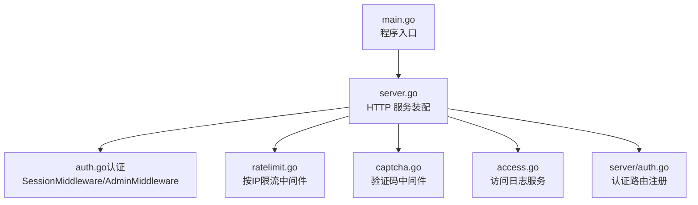
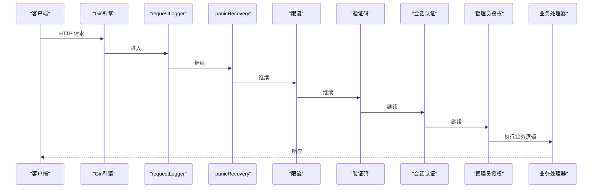
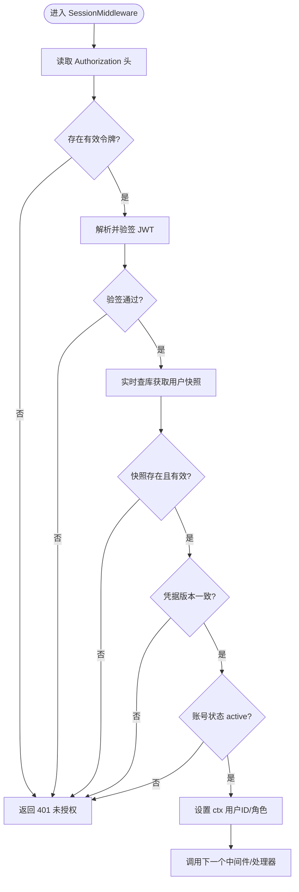
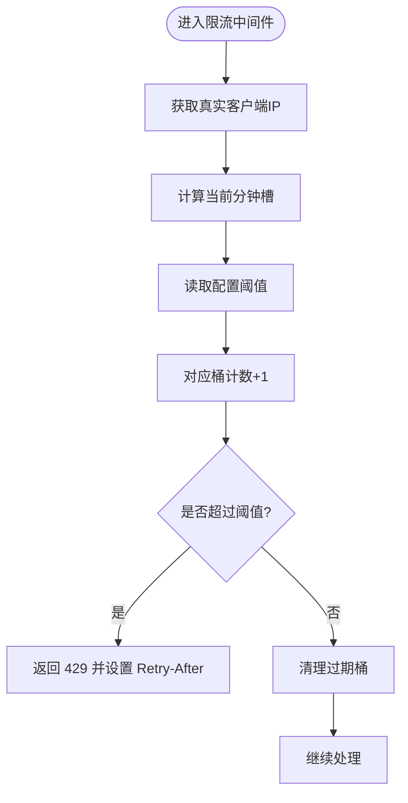
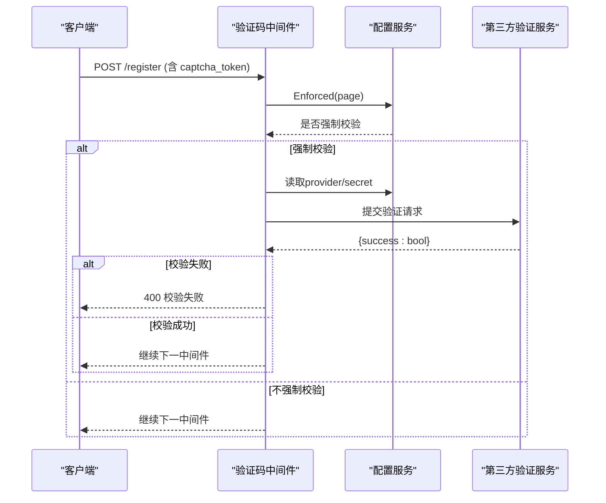
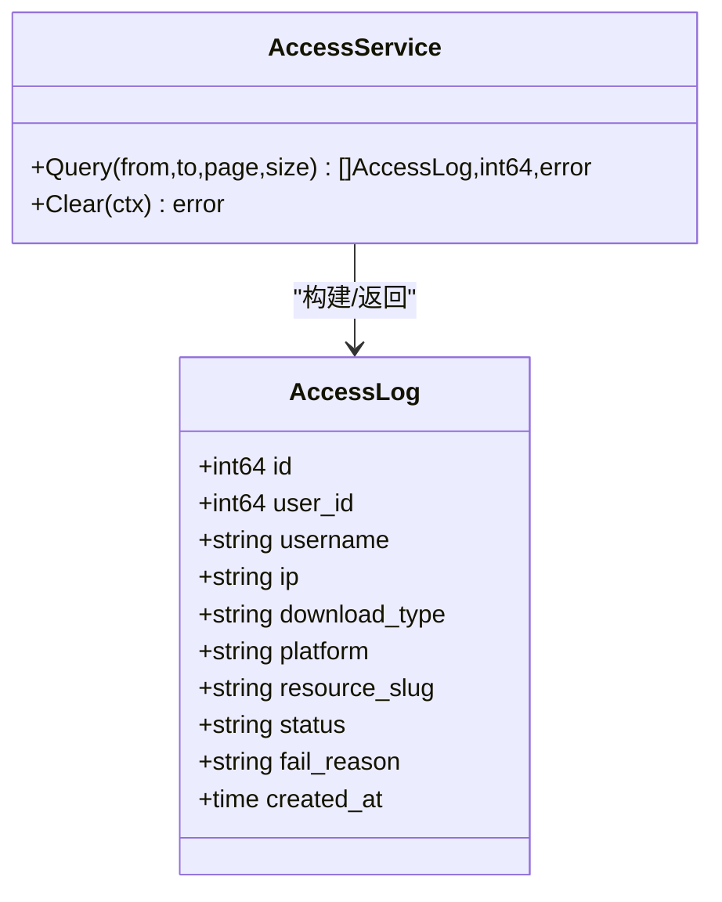
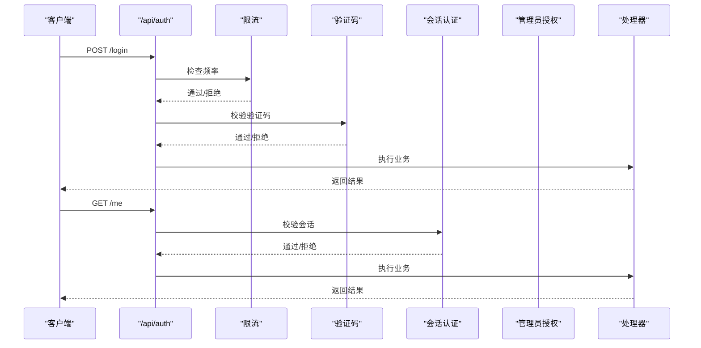
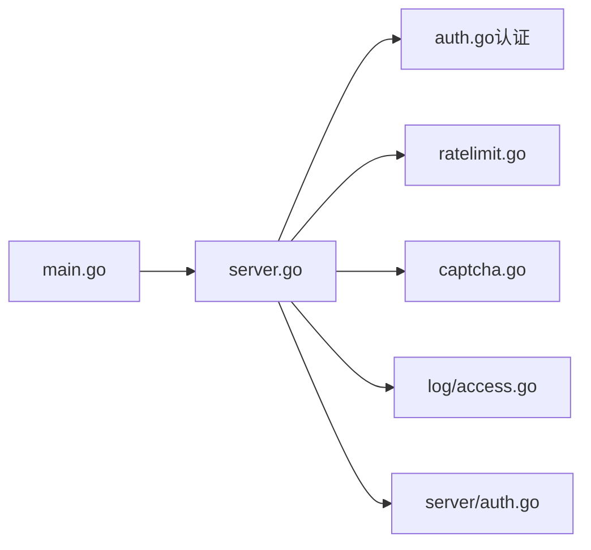

# 中间件系统

<cite>
**本文引用的文件**
- [main.go](file://backend/cmd/server/main.go)
- [server.go](file://backend/internal/server/server.go)
- [auth.go（认证）](file://backend/internal/auth/auth.go)
- [auth.go（路由注册）](file://backend/internal/server/auth.go)
- [ratelimit.go](file://backend/internal/ratelimit/ratelimit.go)
- [captcha.go](file://backend/internal/captcha/captcha.go)
- [access.go](file://backend/internal/log/access.go)
</cite>

## 目录
1. [简介](#简介)
2. [项目结构](#项目结构)
3. [核心组件](#核心组件)
4. [架构总览](#架构总览)
5. [详细组件分析](#详细组件分析)
6. [依赖关系分析](#依赖关系分析)
7. [性能考量](#性能考量)
8. [故障排查指南](#故障排查指南)
9. [结论](#结论)
10. [附录](#附录)

## 简介
本文件系统性说明本项目的 HTTP 中间件体系：设计模式、执行顺序、上下文传递、错误处理机制；已实现的中间件包括会话认证与角色授权、按 IP 的速率限制、验证码校验、访问日志记录等；并给出自定义中间件的规范与最佳实践，解释如何通过中间件实现横切关注点统一管理，以及调试测试方法与性能影响分析。

## 项目结构
后端基于 Gin 框架，采用“服务装配 + 路由分组”的方式组织中间件链。入口 main 负责初始化配置、存储、日志、定时任务，并创建 Server 实例；Server 在构造时统一注入各业务服务，并按域注册路由与中间件链。关键文件职责：
- 入口与启动流程：[main.go](file://backend/cmd/server/main.go)
- HTTP 服务装配与全局中间件：[server.go](file://backend/internal/server/server.go)
- 认证与授权中间件：[auth.go（认证）](file://backend/internal/auth/auth.go)
- 认证相关路由与中间件组合：[auth.go（路由注册）](file://backend/internal/server/auth.go)
- 速率限制中间件：[ratelimit.go](file://backend/internal/ratelimit/ratelimit.go)
- 验证码中间件：[captcha.go](file://backend/internal/captcha/captcha.go)
- 访问日志服务：[access.go](file://backend/internal/log/access.go)

**图表来源**
- [main.go:24-98](file://backend/cmd/server/main.go#L24-L98)
- [server.go:62-157](file://backend/internal/server/server.go#L62-L157)

**章节来源**
- [main.go:24-98](file://backend/cmd/server/main.go#L24-L98)
- [server.go:62-157](file://backend/internal/server/server.go#L62-L157)

## 核心组件
- 会话认证与授权中间件
  - 会话校验：解析 Authorization 头中的 JWT，验签后实时查库比对用户快照（含凭据版本与状态），将用户 ID 与角色写入 gin.Context，供后续处理器使用。
  - 管理员授权：在会话校验之后叠加，仅允许 admin 角色访问管理端点。
- 速率限制中间件
  - 按 IP 固定窗口计数（分钟槽），支持不同作用域的独立阈值（登录/注册/找回密码/下载）。
  - 超限返回 429，并在响应头中附带 Retry-After。
- 验证码中间件
  - 支持 reCAPTCHA/Turnstile，按页面开关与密钥配置决定是否强制校验。
  - 通过 ShouldBindBodyWithJSON 安全读取请求体，避免与处理器重复绑定冲突。
- 访问日志中间件
  - 记录方法、路径、状态码、耗时；敏感参数由日志层脱敏。
  - 提供访问日志查询与清空能力，配合后台定时清理。

**章节来源**
- [auth.go（认证）:144-192](file://backend/internal/auth/auth.go#L144-L192)
- [ratelimit.go:27-60](file://backend/internal/ratelimit/ratelimit.go#L27-L60)
- [captcha.go:41-127](file://backend/internal/captcha/captcha.go#L41-L127)
- [server.go:211-223](file://backend/internal/server/server.go#L211-L223)
- [access.go:16-101](file://backend/internal/log/access.go#L16-L101)

## 架构总览
中间件以“可组合、可复用”的方式挂载到 Gin Engine 或路由组上，形成从请求进入至处理器执行的流水线。全局中间件用于横切关注点（日志、恢复），业务中间件按需挂载到具体路由组。

**图表来源**
- [server.go:62-70](file://backend/internal/server/server.go#L62-L70)
- [server.go:211-237](file://backend/internal/server/server.go#L211-L237)
- [auth.go（认证）:144-192](file://backend/internal/auth/auth.go#L144-L192)
- [ratelimit.go:40-60](file://backend/internal/ratelimit/ratelimit.go#L40-L60)
- [captcha.go:108-127](file://backend/internal/captcha/captcha.go#L108-L127)

## 详细组件分析

### 会话认证与授权中间件
- 执行时机：在需要鉴权的路由前挂载，如 /api/auth/me、/api/auth/logout 及各类管理端点。
- 上下文传递：成功校验后将用户 ID 与角色写入 gin.Context，键名分别为 auth_user_id 与 auth_user_role，供后续处理器读取。
- 错误处理：缺失凭据、验签失败、凭据过期、用户不存在、凭据版本不一致、账号非激活均返回 401；权限不足返回 403。
- 设计要点：凭据载荷仅包含最小必要信息，角色与权限每次请求实时查库，避免缓存导致权限漂移。

**图表来源**
- [auth.go（认证）:144-179](file://backend/internal/auth/auth.go#L144-L179)

**章节来源**
- [auth.go（认证）:66-85](file://backend/internal/auth/auth.go#L66-L85)
- [auth.go（认证）:144-192](file://backend/internal/auth/auth.go#L144-L192)

### 速率限制中间件
- 作用范围：登录、注册、找回密码、下载等易被滥用接口。
- 算法：固定窗口（每分钟槽），按 scope|ip|slot 作为 key 计数，超过阈值返回 429 并设置 Retry-After。
- 动态配置：阈值来自配置服务，修改即时生效；内存桶定期清理防止泄漏。
- 重置能力：一键清空运行时状态时同步重置限流计数。

**图表来源**
- [ratelimit.go:40-60](file://backend/internal/ratelimit/ratelimit.go#L40-L60)
- [ratelimit.go:62-81](file://backend/internal/ratelimit/ratelimit.go#L62-L81)

**章节来源**
- [ratelimit.go:17-37](file://backend/internal/ratelimit/ratelimit.go#L17-L37)
- [ratelimit.go:40-89](file://backend/internal/ratelimit/ratelimit.go#L40-L89)

### 验证码中间件
- 策略：根据配置决定某页面是否强制校验；若提供商为 off 或未配置密钥则跳过校验并记录告警。
- 请求体读取：使用 ShouldBindBodyWithJSON 安全读取，避免与处理器重复绑定冲突。
- 验证流程：根据 provider 选择对应服务端验证地址，发送 secret 与前端 token，解析 success 字段。
- 错误处理：网络异常、解析失败、校验失败均返回 400。

**图表来源**
- [captcha.go:41-58](file://backend/internal/captcha/captcha.go#L41-L58)
- [captcha.go:60-106](file://backend/internal/captcha/captcha.go#L60-L106)
- [captcha.go:108-127](file://backend/internal/captcha/captcha.go#L108-L127)

**章节来源**
- [captcha.go:23-39](file://backend/internal/captcha/captcha.go#L23-L39)
- [captcha.go:41-127](file://backend/internal/captcha/captcha.go#L41-L127)

### 访问日志中间件与服务
- 中间件：记录方法、路径、状态码、耗时；路径中的敏感参数由日志层统一脱敏。
- 服务：提供按日期范围分页查询与清空访问日志的能力；配合定时任务进行数据清理。
- 集成：在服务器启动时注册，所有请求均会经过该中间件。

**图表来源**
- [access.go:16-39](file://backend/internal/log/access.go#L16-L39)
- [access.go:41-101](file://backend/internal/log/access.go#L41-L101)

**章节来源**
- [server.go:211-223](file://backend/internal/server/server.go#L211-L223)
- [access.go:16-123](file://backend/internal/log/access.go#L16-L123)

### 路由与中间件组合示例
- 认证路由：注册时先限流，再验证码，最后处理器；受保护端点追加会话认证中间件。
- 管理端点：在会话认证基础上叠加管理员授权中间件。

**图表来源**
- [server/auth.go:24-34](file://backend/internal/server/auth.go#L24-L34)
- [auth.go（认证）:144-192](file://backend/internal/auth/auth.go#L144-L192)

**章节来源**
- [server/auth.go:24-34](file://backend/internal/server/auth.go#L24-L34)

## 依赖关系分析
- 服务装配：Server 构造函数集中注入各服务，避免包级全局变量，提升可测试性与可维护性。
- 中间件耦合：中间件之间通过 gin.Context 传递上下文，低耦合、高内聚；错误处理统一通过 response 封装。
- 外部依赖：JWT 验签、bcrypt 密码哈希、第三方验证码服务、数据库访问等均在各自服务中隔离。

**图表来源**
- [main.go:24-98](file://backend/cmd/server/main.go#L24-L98)
- [server.go:62-157](file://backend/internal/server/server.go#L62-L157)

**章节来源**
- [server.go:62-157](file://backend/internal/server/server.go#L62-L157)

## 性能考量
- 限流内存占用：按分钟槽分桶，定期清理过期桶，避免无限增长；在高并发场景下注意锁粒度与 GC 压力。
- 验证码外部调用：超时与重试策略需合理配置，避免阻塞主流程；失败时快速失败并返回明确错误。
- 会话校验：每次请求实时查库，确保权限一致性；可通过热点用户缓存优化（需谨慎处理失效策略）。
- 日志写入：统一日志层脱敏与缓冲，避免频繁 IO；建议在生产环境使用异步落盘或远端收集。

[本节为通用指导，无需特定文件引用]

## 故障排查指南
- 401 未授权
  - 检查 Authorization 头格式与令牌有效性；确认会话中间件是否正确挂载。
  - 核对用户快照与凭据版本是否一致；确认账号状态是否为 active。
- 403 权限不足
  - 确认管理员授权中间件是否叠加在会话认证之后。
- 429 频率限制
  - 查看 Retry-After 头部；检查配置阈值与当前时间槽；必要时重置运行时状态。
- 验证码失败
  - 检查 provider 与密钥配置；确认第三方服务可达；查看日志中的警告与错误。
- 访问日志缺失
  - 确认 requestLogger 中间件是否启用；检查日志级别与输出目标；确认定时清理任务是否误删。

**章节来源**
- [auth.go（认证）:144-192](file://backend/internal/auth/auth.go#L144-L192)
- [ratelimit.go:40-60](file://backend/internal/ratelimit/ratelimit.go#L40-L60)
- [captcha.go:41-127](file://backend/internal/captcha/captcha.go#L41-L127)
- [server.go:211-237](file://backend/internal/server/server.go#L211-L237)

## 结论
本项目通过 Gin 中间件实现了横切关注点的统一管理：认证授权、速率限制、验证码校验、访问日志等均以可组合的方式挂载到路由链上。中间件之间低耦合、高内聚，错误处理统一，便于扩展与维护。通过合理的执行顺序与上下文传递，既保证了安全性，又提升了系统的可观测性与稳定性。

[本节为总结性内容，无需特定文件引用]

## 附录

### 自定义中间件开发规范与最佳实践
- 函数签名：遵循 gin.HandlerFunc，接收 *gin.Context 并调用 c.Next() 继续链路。
- 上下文传递：使用 c.Set/c.Get 传递跨中间件共享数据，键名保持唯一且语义清晰。
- 错误处理：统一通过 response 封装返回，避免直接写 JSON；必要时设置合适的 HTTP 状态码。
- 性能与安全：避免阻塞操作；对输入进行严格校验；对敏感信息进行脱敏。
- 可配置性：关键参数通过配置服务读取，支持运行时调整；提供默认值保证健壮性。
- 可测试性：将依赖注入到服务或中间件中，便于单元测试与集成测试。

[本节为通用指导，无需特定文件引用]

### 中间件调试与测试方法
- 本地调试：开启 debug_mode 以便在 5xx 响应中包含更多详情；观察 requestLogger 输出的方法、路径、状态码与耗时。
- 压测限流：模拟高频请求验证 429 行为与 Retry-After 头部；检查内存占用与 GC 情况。
- 验证码联调：切换 provider 与密钥，验证成功与失败分支；检查第三方服务超时与错误处理。
- 端到端测试：覆盖认证、授权、限流、验证码的组合场景；验证上下文传递与错误传播。

[本节为通用指导，无需特定文件引用]