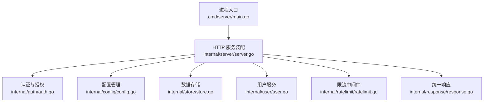
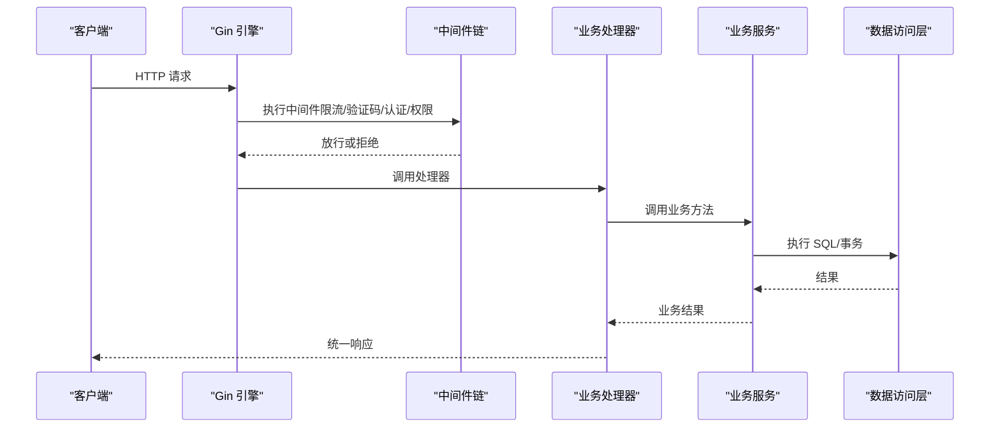
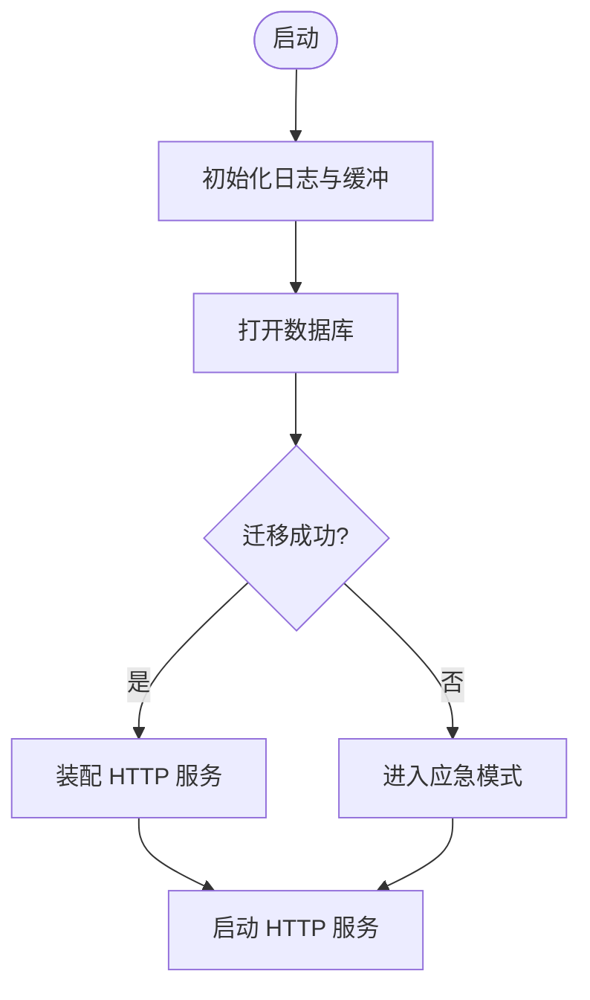
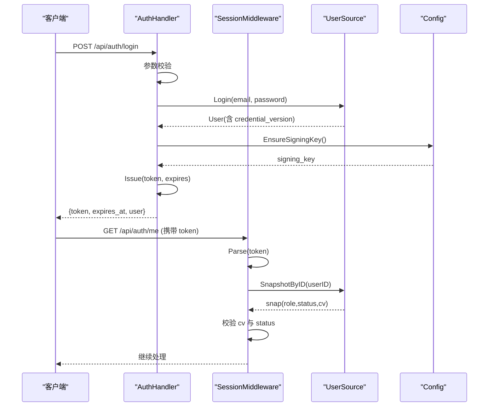
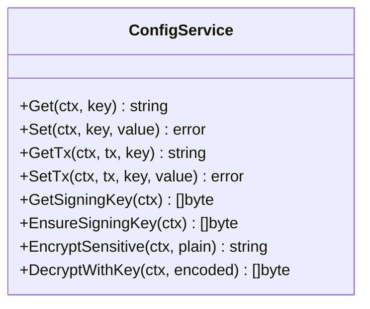
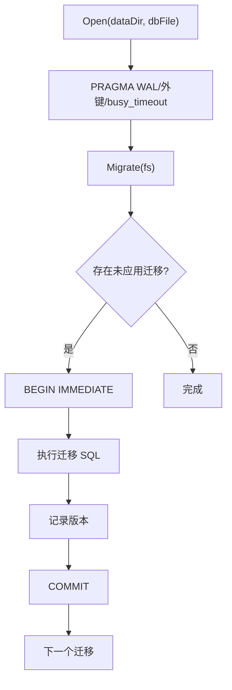
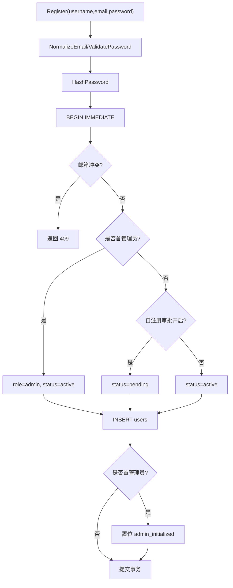
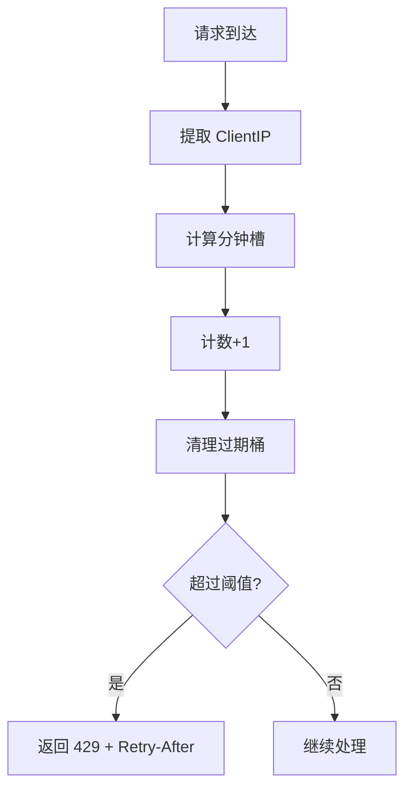
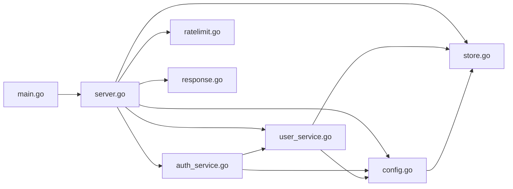

# 后端架构设计

<cite>
**本文引用的文件**
- [main.go](file://backend/cmd/server/main.go)
- [server.go](file://backend/internal/server/server.go)
- [auth.go](file://backend/internal/server/auth.go)
- [config.go](file://backend/internal/config/config.go)
- [store.go](file://backend/internal/store/store.go)
- [auth_service.go](file://backend/internal/auth/auth.go)
- [user_service.go](file://backend/internal/user/user.go)
- [response.go](file://backend/internal/response/response.go)
- [ratelimit.go](file://backend/internal/ratelimit/ratelimit.go)
</cite>

## 目录
1. [简介](#简介)
2. [项目结构](#项目结构)
3. [核心组件](#核心组件)
4. [架构总览](#架构总览)
5. [详细组件分析](#详细组件分析)
6. [依赖关系分析](#依赖关系分析)
7. [性能考量](#性能考量)
8. [故障排查指南](#故障排查指南)
9. [结论](#结论)

## 简介
本文件面向 Go 后端服务的整体架构，聚焦于 HTTP 服务器装配、中间件链设计、模块化服务架构与分层职责划分。系统采用 Gin 作为 Web 框架，SQLite（modernc.org/sqlite）作为数据存储，结合版本化迁移、统一响应、限流、验证码、认证授权、配置管理、业务服务等模块，形成表现层（HTTP 处理器）、业务逻辑层（Service）、数据访问层（Store）清晰的分层架构。同时提供应急模式以在数据库损坏或迁移失败时维持最小可用能力。

## 项目结构
后端代码位于 backend 目录，入口为 cmd/server/main.go，负责环境变量解析、日志初始化、数据库打开与迁移、服务装配、优雅退出与应急模式切换。internal 下按领域/横切关注点组织：
- internal/server：HTTP 服务装配与路由注册
- internal/auth：认证与授权（JWT、中间件）
- internal/config：系统配置读写与敏感值加密
- internal/store：SQLite 连接、迁移、事务封装
- internal/user：用户业务（注册、登录、快照）
- internal/ratelimit：IP 级固定窗口限流
- internal/response：统一响应结构
- 其他业务域：approval、backup、captcha、custom、download、emergency、group、log、mail、oidc、platform、rule、setup、share、subscription、token、version 等

图表来源
- [main.go:24-98](file://backend/cmd/server/main.go#L24-L98)
- [server.go:62-157](file://backend/internal/server/server.go#L62-L157)

章节来源
- [main.go:24-98](file://backend/cmd/server/main.go#L24-L98)
- [server.go:62-157](file://backend/internal/server/server.go#L62-L157)

## 核心组件
- HTTP 服务器与路由装配：集中式 New 函数注入所有依赖，按域注册路由并挂载中间件链；支持正常模式与应急模式两种装配路径。
- 认证授权：基于 HS256 的 JWT 会话凭据，中间件校验 token、实时查库比对 credential_version 与账号状态；管理员角色校验中间件可叠加。
- 配置管理：system_config 表存储键值对，敏感值 AES-256-GCM 加密，HKDF 派生密钥；提供 Get/Set/类型化读取与事务内操作。
- 数据存储：WAL 模式、外键启用、单写者模型；版本化迁移确保 schema 演进一致性；TxImmediate 用于先读后写的串行化场景。
- 用户服务：注册（首管理员机制）、登录、快照查询；邮箱规范化与密码复杂度校验；欢迎邮件钩子。
- 限流：按 IP 固定窗口计数，阈值从配置动态读取；支持一键清空内存态。
- 统一响应：OK/Fail 封装，5xx 默认对外脱敏，调试模式可返回详情。

章节来源
- [server.go:62-157](file://backend/internal/server/server.go#L62-L157)
- [auth_service.go:98-192](file://backend/internal/auth/auth.go#L98-L192)
- [config.go:57-168](file://backend/internal/config/config.go#L57-L168)
- [store.go:31-164](file://backend/internal/store/store.go#L31-L164)
- [user_service.go:82-201](file://backend/internal/user/user.go#L82-L201)
- [ratelimit.go:27-88](file://backend/internal/ratelimit/ratelimit.go#L27-L88)
- [response.go:14-50](file://backend/internal/response/response.go#L14-L50)

## 架构总览
系统采用分层与模块化设计：
- 表现层：Gin 引擎 + 各域 Handler（如 AuthHandler），通过 RegisterXxxRoutes 挂载路由，组合限流、验证码、认证、管理员权限等中间件。
- 业务层：各 Service（auth、user、config、subscription、platform 等）封装领域逻辑，依赖 store 与 config。
- 数据层：store 封装 SQLite 连接、迁移、事务；上层不直接感知底层细节。

图表来源
- [server.go:62-157](file://backend/internal/server/server.go#L62-L157)
- [auth_service.go:144-192](file://backend/internal/auth/auth.go#L144-L192)
- [store.go:147-164](file://backend/internal/store/store.go#L147-L164)

## 详细组件分析

### HTTP 服务器装配与中间件链
- 启动流程：main 初始化日志、打开数据库、执行迁移、检测应急模式、构建服务并运行。
- 服务装配：New 中创建 Gin 引擎，应用信任代理策略、请求日志、panic 恢复；依次注入各服务并注册路由。
- 中间件链：按“限流 → 验证码 → 认证 → 管理员权限”顺序组合，保证安全与体验。
- 应急模式：NewEmergency 仅注册健康检查、站点信息、应急端点与静态资源，业务 API 由 emergencyGate 拦截返回 503。

图表来源
- [main.go:24-98](file://backend/cmd/server/main.go#L24-L98)
- [server.go:160-193](file://backend/internal/server/server.go#L160-L193)

章节来源
- [main.go:24-98](file://backend/cmd/server/main.go#L24-L98)
- [server.go:62-157](file://backend/internal/server/server.go#L62-L157)
- [server.go:160-193](file://backend/internal/server/server.go#L160-L193)

### 认证与授权
- 会话凭据：HS256 签名，载荷包含用户 ID 与凭据版本号；过期时间区分记住我（7 天）与普通（24 小时）。
- 中间件：SessionMiddleware 解析 Authorization 头，验签后实时查库获取用户快照，校验 credential_version 与账号状态；AdminMiddleware 校验角色为 admin。
- 处理器：AuthHandler 实现注册、登录、忘记密码、重置、当前用户信息与登出；参数绑定使用 ShouldBindBodyWithJSON 避免重复读取 body。

图表来源
- [auth_service.go:98-192](file://backend/internal/auth/auth.go#L98-L192)
- [auth.go:99-134](file://backend/internal/server/auth.go#L99-L134)
- [user_service.go:170-201](file://backend/internal/user/user.go#L170-L201)
- [config.go:294-313](file://backend/internal/config/config.go#L294-L313)

章节来源
- [auth_service.go:98-192](file://backend/internal/auth/auth.go#L98-L192)
- [auth.go:99-134](file://backend/internal/server/auth.go#L99-L134)
- [user_service.go:170-201](file://backend/internal/user/user.go#L170-L201)
- [config.go:294-313](file://backend/internal/config/config.go#L294-L313)

### 配置管理
- 存储：system_config 表，键值对形式；敏感键集合登记后自动加密落库。
- 加解密：AES-256-GCM，密钥由 signing_key 经 HKDF-SHA256 派生；Get/Set 透明处理敏感键。
- 事务支持：GetTx/SetTx/EncryptWithTx/EnsureSigningKeyTx 用于 Setup/OIDC 等事务内原子写入。
- 类型化读取：GetBool/GetInt/GetJSONStringSlice，解析失败记录 warn 并使用默认值。

图表来源
- [config.go:57-168](file://backend/internal/config/config.go#L57-L168)
- [config.go:220-360](file://backend/internal/config/config.go#L220-L360)

章节来源
- [config.go:57-168](file://backend/internal/config/config.go#L57-L168)
- [config.go:220-360](file://backend/internal/config/config.go#L220-L360)

### 数据存储与迁移
- 连接：WAL 模式、外键开启、busy_timeout 设置；单写者模型规避并发写冲突。
- 迁移：按 NNNN_name.sql 命名，升序执行未应用项；每条迁移与版本记录在同一事务内；数据库版本高于代码支持版本拒绝启动。
- 事务：TxImmediate 以 BEGIN IMMEDIATE 开启，适用于先读后写场景，全程串行化。

图表来源
- [store.go:31-52](file://backend/internal/store/store.go#L31-L52)
- [store.go:62-128](file://backend/internal/store/store.go#L62-L128)
- [store.go:147-164](file://backend/internal/store/store.go#L147-L164)

章节来源
- [store.go:31-52](file://backend/internal/store/store.go#L31-L52)
- [store.go:62-128](file://backend/internal/store/store.go#L62-L128)
- [store.go:147-164](file://backend/internal/store/store.go#L147-L164)

### 用户服务
- 注册：邮箱唯一预查、空表判定（首管理员）、默认组分配、审批开关控制；首管理员免审批且直接激活。
- 登录：邮箱规范化、密码校验、状态检查；错误提示统一防枚举。
- 快照：SnapshotByID 供认证中间件实时查库，避免缓存导致权限不一致。

图表来源
- [user_service.go:82-154](file://backend/internal/user/user.go#L82-L154)
- [user_service.go:156-168](file://backend/internal/user/user.go#L156-L168)

章节来源
- [user_service.go:82-154](file://backend/internal/user/user.go#L82-L154)
- [user_service.go:156-168](file://backend/internal/user/user.go#L156-L168)

### 限流与验证码
- 限流：按 IP 固定窗口计数，阈值来自配置键（登录/注册/找回密码/下载），支持 Reset 清空内存态。
- 验证码：在注册/登录/找回密码端点叠加验证码中间件，防止自动化滥用。

图表来源
- [ratelimit.go:27-88](file://backend/internal/ratelimit/ratelimit.go#L27-L88)

章节来源
- [ratelimit.go:27-88](file://backend/internal/ratelimit/ratelimit.go#L27-L88)

### 统一响应
- OK：返回 code=0 与 data。
- Fail：httpStatus 与业务码同步；5xx 默认对外脱敏为“服务器内部错误”，调试模式开启时可返回真实错误详情。

章节来源
- [response.go:14-50](file://backend/internal/response/response.go#L14-L50)

## 依赖关系分析
- main 依赖 store、config、user、server、cron、emergency、dataclear、log、version 等模块，负责生命周期与装配。
- server 依赖 auth、setup、oidc、captcha、ratelimit、platform、subscription、group、token、download、custom、share、rule、user、version、mail、approval、config、log 等，集中注册路由与中间件。
- auth 依赖 config、user（通过接口解耦）、response。
- user 依赖 store、config、auth。
- config 依赖 store。
- store 依赖 log。

图表来源
- [main.go:24-98](file://backend/cmd/server/main.go#L24-L98)
- [server.go:62-157](file://backend/internal/server/server.go#L62-L157)
- [auth_service.go:87-96](file://backend/internal/auth/auth.go#L87-L96)
- [user_service.go:25-36](file://backend/internal/user/user.go#L25-L36)
- [config.go:48-55](file://backend/internal/config/config.go#L48-L55)
- [store.go:24-30](file://backend/internal/store/store.go#L24-L30)

章节来源
- [main.go:24-98](file://backend/cmd/server/main.go#L24-L98)
- [server.go:62-157](file://backend/internal/server/server.go#L62-L157)

## 性能考量
- 数据库：WAL 模式提升并发读性能；单写者模型配合 busy_timeout 降低写冲突；TxImmediate 保障先读后写的一致性。
- 迁移：按版本串行执行，失败即拒绝启动，避免半迁移状态。
- 限流：内存固定窗口计数，GC 清理过期桶，避免内存泄漏。
- 响应：统一响应减少重复逻辑；5xx 脱敏降低敏感信息泄露风险。
- 中间件：请求日志记录耗时与状态，便于性能分析与问题定位。

## 故障排查指南
- 数据库损坏/迁移失败：main 自动进入应急模式，仅暴露健康检查、站点信息、应急端点与静态资源；可通过应急端点进行数据清理或重新初始化。
- 认证失败：检查 Authorization 头格式、token 是否过期、credential_version 是否与用户快照一致、账号状态是否为 active。
- 限流触发：查看对应作用域的阈值配置（登录/注册/找回密码/下载），必要时调整或等待下一分钟槽。
- 配置异常：检查 system_config 表中敏感键是否正确加密；调试模式开启可查看 5xx 详情。
- 日志：通过访问日志与实时日志流（SSE）观察请求轨迹与错误堆栈。

章节来源
- [main.go:108-126](file://backend/cmd/server/main.go#L108-L126)
- [auth_service.go:144-192](file://backend/internal/auth/auth.go#L144-L192)
- [ratelimit.go:40-59](file://backend/internal/ratelimit/ratelimit.go#L40-L59)
- [response.go:40-50](file://backend/internal/response/response.go#L40-L50)

## 结论
该后端服务采用清晰的三层架构与模块化设计，通过 Gin 中间件链实现横切关注点的统一治理，结合 SQLite 的版本化迁移与事务封装保障数据一致性。认证授权基于无状态 JWT，配合实时快照校验确保权限一致性；配置管理支持敏感值加密与动态读取；限流与验证码增强安全性；应急模式提供高可用兜底。整体架构兼顾可扩展性、可维护性与生产可用性。