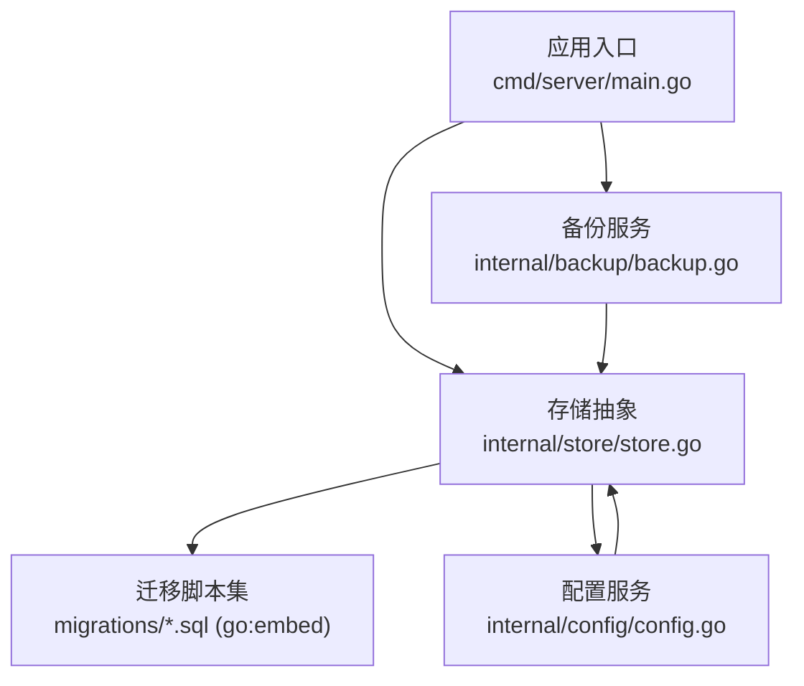
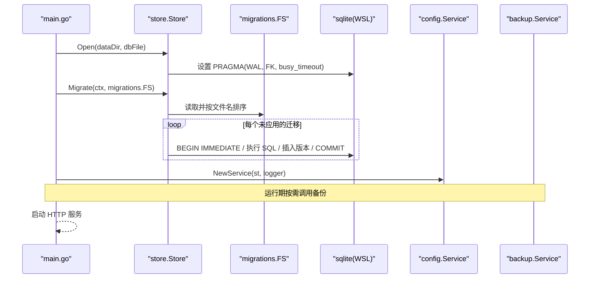
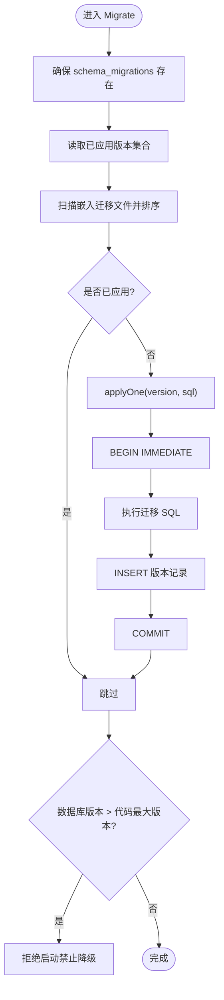
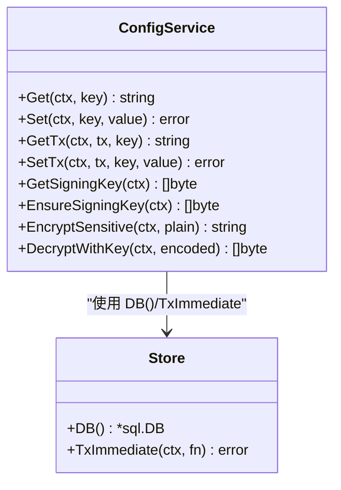
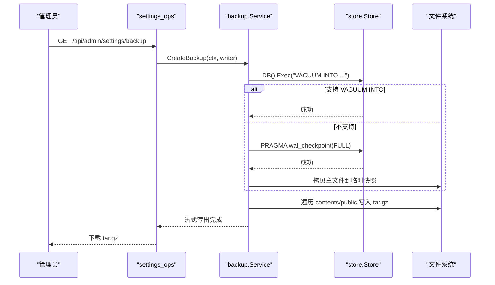
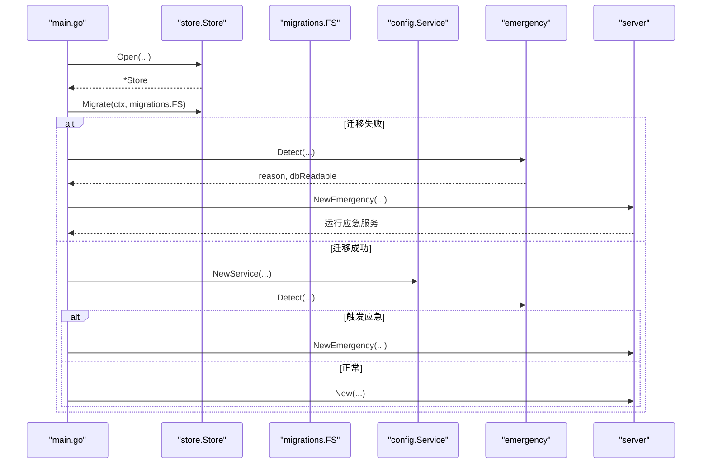
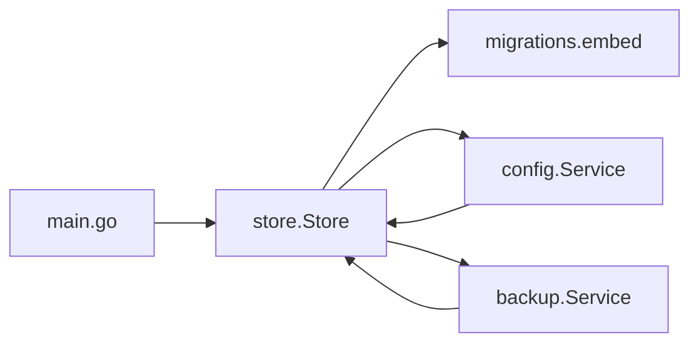

# 数据访问层

<cite>
**本文引用的文件**
- [store.go](file://backend/internal/store/store.go)
- [embed.go](file://backend/migrations/embed.go)
- [main.go](file://backend/cmd/server/main.go)
- [0001_init.sql](file://backend/migrations/0001_init.sql)
- [config.go](file://backend/internal/config/config.go)
- [backup.go](file://backend/internal/backup/backup.go)
</cite>

## 目录
1. [简介](#简介)
2. [项目结构](#项目结构)
3. [核心组件](#核心组件)
4. [架构总览](#架构总览)
5. [详细组件分析](#详细组件分析)
6. [依赖关系分析](#依赖关系分析)
7. [性能与优化](#性能与优化)
8. [故障恢复与应急](#故障恢复与应急)
9. [结论](#结论)
10. [附录：最佳实践清单](#附录最佳实践清单)

## 简介
本章节面向“数据访问层”的设计与实现，聚焦数据存储抽象、SQLite 集成、迁移机制、事务模型、备份恢复与运维能力。该层以 store.Store 为核心，封装数据库连接管理、版本化迁移、事务辅助（含 BEGIN IMMEDIATE 语义）、以及对外暴露的 sql.DB 句柄；配合 migrations 嵌入的 SQL 脚本完成零 CGO 的 SQLite 部署与演进；并通过 backup 服务提供一致性快照与归档下载。同时，配置服务 config.Service 在系统配置表上提供加解密与事务内读写能力，形成稳定的数据访问基座。

## 项目结构
数据访问相关代码主要分布在以下位置：
- backend/internal/store：存储抽象与 SQLite 初始化、迁移、事务辅助
- backend/migrations：SQL 迁移脚本与 go:embed 注入
- backend/cmd/server：启动流程中打开数据库、执行迁移、装配服务
- backend/internal/config：基于 system_config 表的配置服务（含敏感字段加密）
- backend/internal/backup：备份服务（一致性快照 + tar.gz 打包）

图表来源
- [main.go:24-60](file://backend/cmd/server/main.go#L24-L60)
- [store.go:24-52](file://backend/internal/store/store.go#L24-L52)
- [embed.go:1-8](file://backend/migrations/embed.go#L1-L8)
- [config.go:48-111](file://backend/internal/config/config.go#L48-L111)
- [backup.go:19-65](file://backend/internal/backup/backup.go#L19-L65)

章节来源
- [main.go:24-60](file://backend/cmd/server/main.go#L24-L60)
- [store.go:24-52](file://backend/internal/store/store.go#L24-L52)
- [embed.go:1-8](file://backend/migrations/embed.go#L1-L8)

## 核心组件
- Store：封装 sqlite 驱动、WAL 模式、外键约束、busy_timeout、单写者模型（MaxOpenConns=1），并提供 Migrate/TxImmediate/DB() 等能力。
- migrations：通过 go:embed 将 SQL 迁移脚本嵌入二进制，按 NNNN_name.sql 命名升序执行，记录 schema_migrations 表。
- Config Service：在 system_config 表上提供 Get/Set/GetTx/SetTx 等接口，并对敏感键进行 AES-256-GCM 加密/解密。
- Backup Service：使用 VACUUM INTO 或 WAL checkpoint + 拷贝主文件生成一致性快照，并打包 contents/public 为 tar.gz 供下载。

章节来源
- [store.go:24-164](file://backend/internal/store/store.go#L24-L164)
- [embed.go:1-8](file://backend/migrations/embed.go#L1-L8)
- [config.go:57-168](file://backend/internal/config/config.go#L57-L168)
- [backup.go:30-79](file://backend/internal/backup/backup.go#L30-L79)

## 架构总览
数据访问层采用“薄抽象 + 强约束”的设计：
- 连接与并发：sqlite 单写者模型（MaxOpenConns=1）+ busy_timeout，避免并发写冲突。
- 迁移：版本化、幂等、原子写入（迁移 SQL 与版本记录在同一事务）。
- 事务：提供 TxImmediate 用于「先读后写」场景，保证串行化与一致性。
- 配置：system_config 承载全部系统配置，敏感值加密落库，支持事务内读取签名密钥解密。
- 备份：一致性快照 + 资源打包，不阻断正常服务。

图表来源
- [main.go:40-60](file://backend/cmd/server/main.go#L40-L60)
- [store.go:32-52](file://backend/internal/store/store.go#L32-L52)
- [store.go:66-127](file://backend/internal/store/store.go#L66-L127)
- [embed.go:1-8](file://backend/migrations/embed.go#L1-L8)
- [config.go:48-111](file://backend/internal/config/config.go#L48-L111)
- [backup.go:30-65](file://backend/internal/backup/backup.go#L30-L65)

## 详细组件分析

### Store 抽象与 SQLite 集成
- 连接管理
  - 使用 modernc.org/sqlite（纯 Go，零 CGO）驱动。
  - 开启 WAL 模式、外键约束、busy_timeout=5000ms。
  - MaxOpenConns=1，确保单写者模型，规避并发写 busy。
  - DSN 追加 _txlock=immediate，使 BeginTx 直接发送 BEGIN IMMEDIATE。
- 迁移框架
  - 自建 schema_migrations 表记录已应用版本。
  - 扫描 embed.FS 中的 *.sql，按文件名前缀数字升序执行未应用项。
  - 每条迁移与其版本记录在同一事务内写入，失败即回滚，拒绝启动。
  - 启动时校验数据库版本不得高于代码支持的最大版本，防止降级运行。
- 事务辅助
  - TxImmediate：用于「先读后写」场景，开启即持有写锁，闭包返回非 nil 自动回滚。
  - IsNoRows：统一判断无记录错误，便于业务层复用。

图表来源
- [store.go:66-127](file://backend/internal/store/store.go#L66-L127)
- [store.go:130-145](file://backend/internal/store/store.go#L130-L145)
- [store.go:147-164](file://backend/internal/store/store.go#L147-L164)

章节来源
- [store.go:32-52](file://backend/internal/store/store.go#L32-L52)
- [store.go:66-164](file://backend/internal/store/store.go#L66-L164)

### 配置服务（Config Service）
- 数据模型：system_config 表承载全部系统配置（key/value）。
- 读写接口：
  - Get/Set：普通读写，敏感键自动加密/解密。
  - GetTx/SetTx：事务内读写，避免事务内二次取连接导致死锁。
  - GetSigningKey/EnsureSigningKey：获取或生成签名密钥（明文落库），用于派生配置加密密钥。
- 安全：
  - 敏感键使用 AES-256-GCM 加密，密钥由签名密钥经 HKDF-SHA256 派生。
  - 密文解码失败或 GCM 校验失败均返回明确错误，防篡改。

图表来源
- [config.go:48-168](file://backend/internal/config/config.go#L48-L168)
- [store.go:147-164](file://backend/internal/store/store.go#L147-L164)

章节来源
- [config.go:57-168](file://backend/internal/config/config.go#L57-L168)
- [config.go:220-361](file://backend/internal/config/config.go#L220-L361)

### 备份服务（Backup Service）
- 一致性快照：优先使用 VACUUM INTO 生成一致性快照；若不支持则降级为 PRAGMA wal_checkpoint(FULL) 后拷贝主文件。
- 归档内容：快照 + contents（版本文件，保留符号链接）+ public（站点资源/安装包）。
- 输出：流式写出 tar.gz，不阻断正常服务。

图表来源
- [backup.go:30-79](file://backend/internal/backup/backup.go#L30-L79)
- [backup.go:81-138](file://backend/internal/backup/backup.go#L81-L138)

章节来源
- [backup.go:19-65](file://backend/internal/backup/backup.go#L19-L65)
- [backup.go:67-79](file://backend/internal/backup/backup.go#L67-L79)

### 启动流程与迁移执行
- main 负责解析环境变量、初始化日志、打开数据库、执行迁移、检测应急模式、装配服务并启动 HTTP。
- 迁移失败或数据库损坏时进入应急模式，仅暴露状态/站点信息/应急端点/静态资源，业务 API 返回 503。

图表来源
- [main.go:24-60](file://backend/cmd/server/main.go#L24-L60)
- [store.go:66-127](file://backend/internal/store/store.go#L66-L127)

章节来源
- [main.go:24-60](file://backend/cmd/server/main.go#L24-L60)

## 依赖关系分析
- store.Store 依赖 sqlite 驱动与 embed.FS（migrations），对外暴露 DB()/Migrate()/TxImmediate()。
- config.Service 依赖 store.Store 提供的 DB() 与 TxImmediate，实现配置读写与敏感数据加解密。
- backup.Service 依赖 store.Store 的 DB() 与 DBPath()，结合文件系统完成快照与打包。
- main 作为装配器，串联 store、migrations、config、backup、server 等模块。

图表来源
- [main.go:24-60](file://backend/cmd/server/main.go#L24-L60)
- [store.go:24-52](file://backend/internal/store/store.go#L24-L52)
- [embed.go:1-8](file://backend/migrations/embed.go#L1-L8)
- [config.go:48-111](file://backend/internal/config/config.go#L48-L111)
- [backup.go:19-65](file://backend/internal/backup/backup.go#L19-L65)

章节来源
- [store.go:24-52](file://backend/internal/store/store.go#L24-L52)
- [config.go:48-111](file://backend/internal/config/config.go#L48-L111)
- [backup.go:19-65](file://backend/internal/backup/backup.go#L19-L65)
- [main.go:24-60](file://backend/cmd/server/main.go#L24-L60)

## 性能与优化
- 连接池与并发控制
  - 单写者模型：MaxOpenConns=1，避免 SQLite 并发写冲突。
  - busy_timeout=5000ms：降低忙等待导致的失败率。
  - WAL 模式：提升读性能与并发读能力，减少锁争用。
- 事务策略
  - TxImmediate：适用于「先读后写」场景，开启即持写锁，保证串行化。
  - 迁移原子性：每条迁移与版本记录在同一事务内，失败即回滚。
- 查询优化建议
  - 使用参数化查询与索引（业务层需根据实际表结构添加必要索引）。
  - 分页与范围查询：避免全表扫描与大结果集传输。
  - 批量操作：尽量合并 INSERT/UPDATE，减少往返次数。
- 缓存策略设计
  - 对热点配置可考虑进程级缓存（注意失效策略与一致性）。
  - 对于只读且变化频率低的字典数据，可在内存中维护短生命周期缓存。
- 慢查询分析与监控
  - 建议在接入层增加请求耗时统计与关键 SQL 耗时埋点。
  - 结合日志与指标系统（如 Prometheus）收集慢查询与错误率。
  - 定期导出慢查询日志进行分析与优化。

[本节为通用指导，不直接分析具体文件]

## 故障恢复与应急
- 迁移失败与数据库损坏
  - 启动阶段迁移失败或数据库无法打开时，自动进入应急模式，仅暴露状态/站点信息/应急端点/静态资源，业务 API 返回 503。
  - 应急模式提供重置管理员密码（条件受限）与重新初始化（全清）能力。
- 备份与恢复
  - 备份服务提供一致性快照与归档下载，支持符号链接保留。
  - 恢复时需手动解包，并在启动时以数据库为准重建指针（如版本当前指针）。
- 回滚策略
  - 迁移不可逆：数据库版本不得高于代码支持版本，禁止降级运行。
  - 如需回滚，应通过备份恢复至历史一致快照。

章节来源
- [main.go:40-60](file://backend/cmd/server/main.go#L40-L60)
- [store.go:66-127](file://backend/internal/store/store.go#L66-L127)
- [backup.go:30-79](file://backend/internal/backup/backup.go#L30-L79)

## 结论
数据访问层以 store.Store 为核心，围绕 SQLite 提供了简洁而稳健的连接管理、版本化迁移、事务辅助与备份能力。配合 config.Service 的配置加密与 backup.Service 的一致性快照，形成了从日常访问到灾难恢复的完整闭环。通过单写者模型、WAL、busy_timeout 与 TxImmediate，系统在可用性与一致性之间取得平衡；通过迁移框架与回滚边界检查，确保版本演进的可靠性。

[本节为总结，不直接分析具体文件]

## 附录：最佳实践清单
- 数据访问模式
  - 避免 N+1 查询：使用 JOIN 或批量查询，减少往返次数。
  - 批量操作：合并多次写入，使用事务包裹，提高吞吐与一致性。
  - 缓存策略：对热点只读数据使用内存缓存，注意失效与一致性。
- 事务与并发
  - 先读后写场景使用 TxImmediate，避免脏读与竞态。
  - 严格控制事务粒度，避免长事务阻塞写锁。
- 迁移与版本
  - 严格遵循 NNNN_name.sql 命名与升序执行。
  - 迁移必须幂等，失败即回滚，禁止半迁移状态。
  - 禁止降级运行，数据库版本不得高于代码支持版本。
- 备份与恢复
  - 定期执行一致性快照与归档下载。
  - 恢复后验证完整性，必要时重建指针与缓存。
- 监控与排障
  - 记录慢查询与错误日志，建立告警与复盘机制。
  - 结合指标系统观察连接池、事务耗时、错误率等关键指标。

[本节为通用指导，不直接分析具体文件]