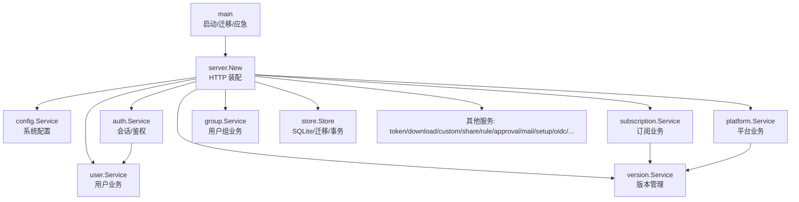
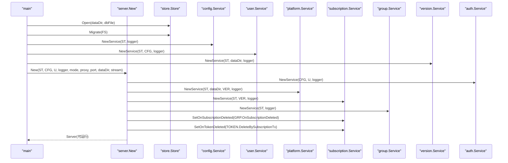
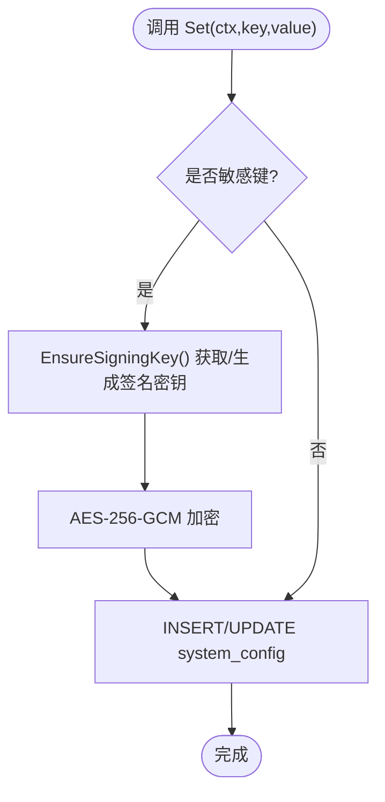
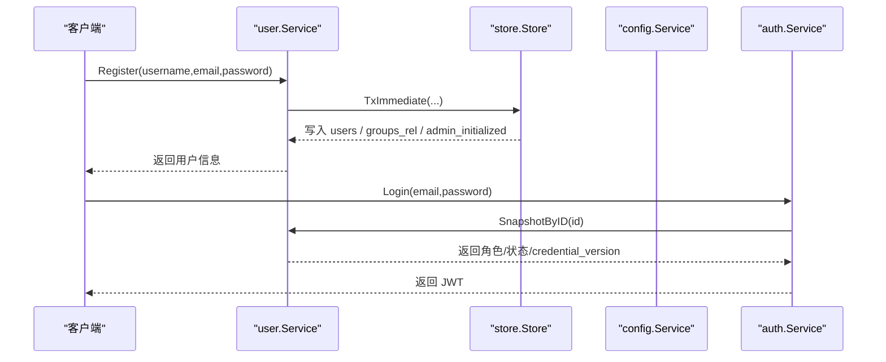
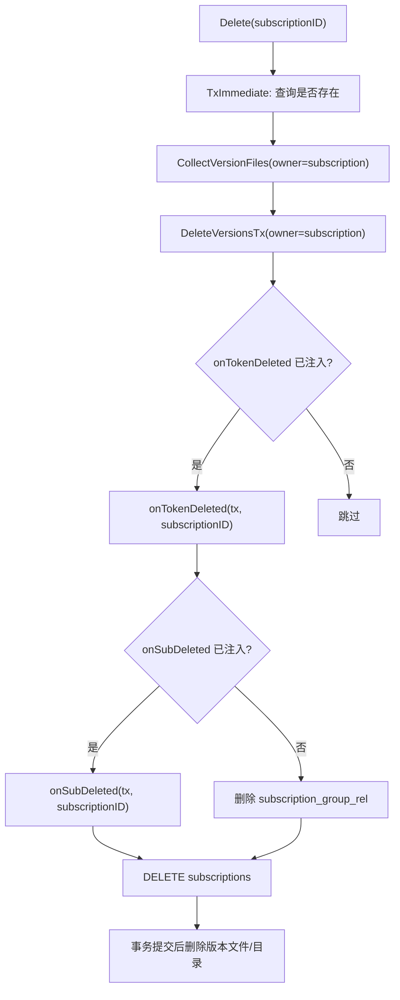
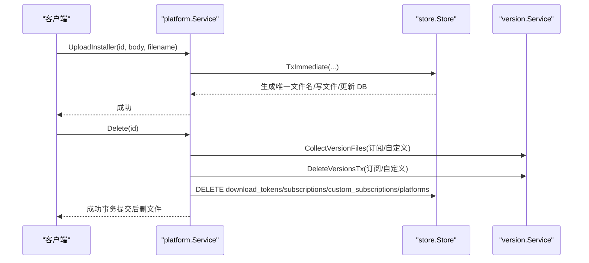
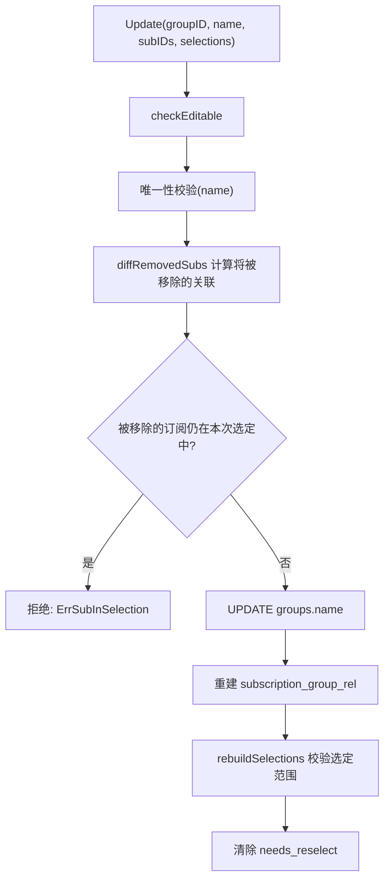
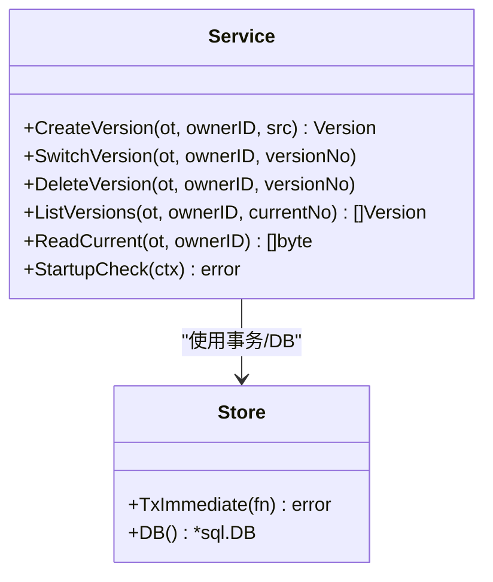
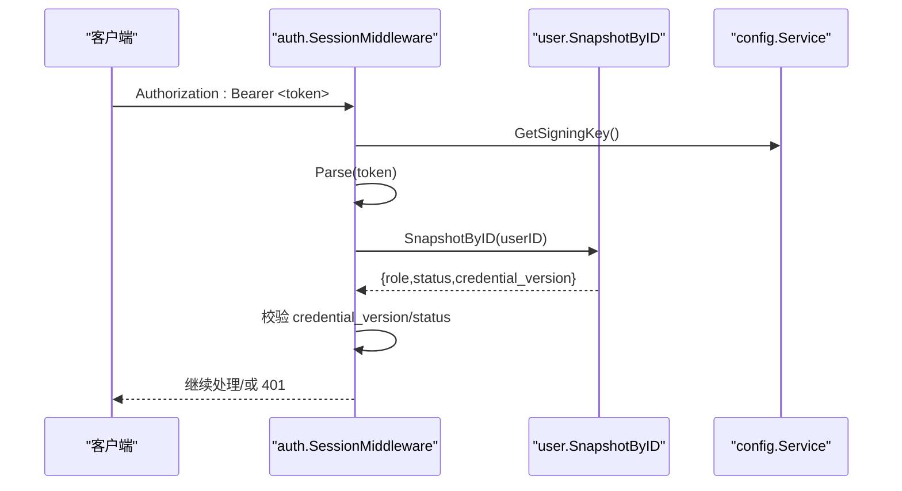
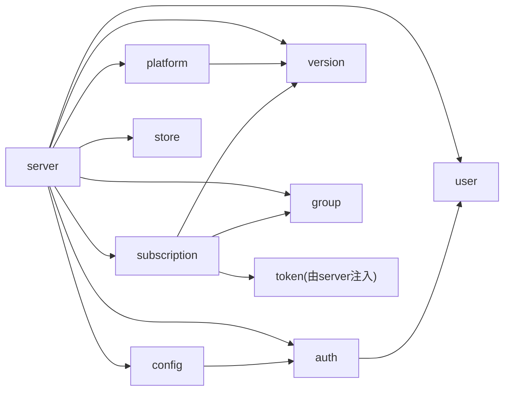

# 模块化服务设计

<cite>
**本文引用的文件**
- [backend/cmd/server/main.go](file://backend/cmd/server/main.go)
- [backend/internal/server/server.go](file://backend/internal/server/server.go)
- [backend/internal/store/store.go](file://backend/internal/store/store.go)
- [backend/internal/config/config.go](file://backend/internal/config/config.go)
- [backend/internal/auth/auth.go](file://backend/internal/auth/auth.go)
- [backend/internal/user/user.go](file://backend/internal/user/user.go)
- [backend/internal/subscription/subscription.go](file://backend/internal/subscription/subscription.go)
- [backend/internal/platform/platform.go](file://backend/internal/platform/platform.go)
- [backend/internal/group/group.go](file://backend/internal/group/group.go)
- [backend/internal/version/version.go](file://backend/internal/version/version.go)
</cite>

## 目录
1. [简介](#简介)
2. [项目结构](#项目结构)
3. [核心组件](#核心组件)
4. [架构总览](#架构总览)
5. [详细组件分析](#详细组件分析)
6. [依赖关系分析](#依赖关系分析)
7. [性能与并发特性](#性能与并发特性)
8. [故障排查指南](#故障排查指南)
9. [结论](#结论)
10. [附录：模块开发规范与接口设计原则](#附录模块开发规范与接口设计原则)

## 简介
本设计文档面向后端服务的模块化架构，聚焦配置管理、用户管理、订阅管理、平台管理等核心业务模块的职责划分、依赖关系与通信方式。文档基于代码级实现，给出服务装配顺序、依赖注入机制、事务与一致性保障、错误处理策略、以及扩展点与复用模式，并配套架构图与流程图帮助理解数据流向与控制流。

## 项目结构
后端采用“按领域分包 + 统一接入层”的模块化组织：
- 入口与生命周期：main 负责环境解析、日志初始化、数据库迁移、应急模式检测、服务装配与优雅退出。
- 接入层（server）：统一 HTTP 路由注册、中间件（请求日志、恢复、限流、认证）、健康检查、静态资源、应急模式网关。
- 领域服务：config、user、subscription、platform、group、version、auth、token、download、custom、share、rule、approval、mail、setup、oidc、backup、dataclear、log、captcha、ratelimit、response、slug 等。
- 数据层（store）：SQLite 封装、WAL/外键/单写者模型、版本化迁移、BEGIN IMMEDIATE 事务助手。

图表来源
- [backend/cmd/server/main.go:24-99](file://backend/cmd/server/main.go#L24-L99)
- [backend/internal/server/server.go:62-158](file://backend/internal/server/server.go#L62-L158)
- [backend/internal/store/store.go:31-52](file://backend/internal/store/store.go#L31-L52)

章节来源
- [backend/cmd/server/main.go:24-99](file://backend/cmd/server/main.go#L24-L99)
- [backend/internal/server/server.go:62-158](file://backend/internal/server/server.go#L62-L158)

## 核心组件
- 配置服务（config）：集中管理 system_config 表，支持敏感字段加密存储与解密读取、类型化读取、事务内读写、签名密钥生成与派生。
- 用户服务（user）：注册（含首管理员机制）、登录、快照查询、重置目标查找；与 auth 协作完成凭据校验与会话签发。
- 订阅服务（subscription）：CRUD、跨四类资源全局唯一 slug 校验、关联组、级联删除（版本、Token、选定）。
- 平台服务（platform）：CRUD、scheme/附加头校验、安装包流式上传与覆盖、级联删除（订阅/自定义/Token/版本文件）。
- 用户组服务（group）：组 CRUD、每平台选定分发、关联约束、删组迁入默认组、订阅删除时受影响组标记重选。
- 版本服务（version）：四类资源共用版本管理，创建/切换/删除/列表/预览/当前内容读取，启动自检重建 symlink。
- 认证服务（auth）：密码哈希/校验、邮箱规范化、JWT 签发/解析、会话中间件、管理员权限中间件。
- 数据层（store）：WAL、外键、单写者模型、迁移框架、BEGIN IMMEDIATE 事务封装。

章节来源
- [backend/internal/config/config.go:24-111](file://backend/internal/config/config.go#L24-L111)
- [backend/internal/user/user.go:82-154](file://backend/internal/user/user.go#L82-L154)
- [backend/internal/subscription/subscription.go:165-231](file://backend/internal/subscription/subscription.go#L165-L231)
- [backend/internal/platform/platform.go:68-119](file://backend/internal/platform/platform.go#L68-L119)
- [backend/internal/group/group.go:51-141](file://backend/internal/group/group.go#L51-L141)
- [backend/internal/version/version.go:125-180](file://backend/internal/version/version.go#L125-L180)
- [backend/internal/auth/auth.go:22-96](file://backend/internal/auth/auth.go#L22-L96)
- [backend/internal/store/store.go:31-66](file://backend/internal/store/store.go#L31-L66)

## 架构总览
系统以“入口装配 + 依赖注入 + 中间件链”为核心：
- main 负责启动流程：环境变量、日志、DB 打开与迁移、应急模式检测、服务装配、定时任务、信号驱动优雅退出。
- server.New 组装所有业务服务与路由，通过构造函数注入依赖，避免包级全局状态。
- 中间件链：请求日志 → 恢复 → 限流 → 会话校验 → 管理员校验 → 业务 Handler。
- 数据一致性：关键写路径使用 store.TxImmediate（BEGIN IMMEDIATE），保证读后写串行化与原子性。
- 应急模式：当 DB 损坏或迁移失败时，降级为仅暴露健康/站点信息/应急端点，业务 API 返回 503。

图表来源
- [backend/cmd/server/main.go:24-99](file://backend/cmd/server/main.go#L24-L99)
- [backend/internal/server/server.go:62-158](file://backend/internal/server/server.go#L62-L158)

章节来源
- [backend/cmd/server/main.go:24-99](file://backend/cmd/server/main.go#L24-L99)
- [backend/internal/server/server.go:62-158](file://backend/internal/server/server.go#L62-L158)

## 详细组件分析

### 配置管理服务（config）
- 职责：集中存取系统配置，敏感字段 AES-256-GCM 加密存储，HKDF 派生密钥；提供类型化读取与事务内读写；确保签名密钥存在。
- 关键点：
  - 敏感键集合登记机制，Set 自动加密，Get 自动解密。
  - 事务内 GetSigningKeyTx/EncryptWithTx，避免连接池死锁。
  - EnsureSigningKey 在 Setup 前兜底生成，防止无密钥导致验签失败。
- 扩展点：新增敏感键只需 RegisterSensitive(key)。

图表来源
- [backend/internal/config/config.go:94-111](file://backend/internal/config/config.go#L94-L111)
- [backend/internal/config/config.go:220-361](file://backend/internal/config/config.go#L220-L361)

章节来源
- [backend/internal/config/config.go:24-111](file://backend/internal/config/config.go#L24-L111)
- [backend/internal/config/config.go:220-361](file://backend/internal/config/config.go#L220-L361)

### 用户管理服务（user）
- 职责：注册（首管理员免审批直接激活）、登录、快照查询、重置目标查找；与 auth 协作进行凭据校验与会话签发。
- 关键点：
  - 注册事务内完成邮箱唯一性检查、空表判定、默认组分配、首管理员标记设置。
  - 登录统一错误提示防枚举；仅 active 账号可登录。
  - SnapshotByID 供 auth 中间件实时查库校验 credential_version。
- 扩展点：欢迎邮件发送通过回调注入，SMTP 未配置不阻断主流程。

图表来源
- [backend/internal/user/user.go:82-154](file://backend/internal/user/user.go#L82-L154)
- [backend/internal/auth/auth.go:144-180](file://backend/internal/auth/auth.go#L144-L180)

章节来源
- [backend/internal/user/user.go:82-154](file://backend/internal/user/user.go#L82-L154)
- [backend/internal/auth/auth.go:144-180](file://backend/internal/auth/auth.go#L144-L180)

### 订阅管理服务（subscription）
- 职责：订阅 CRUD、跨四类资源全局唯一 slug 校验、关联组、级联删除（版本文件、下载 Token、组选定）。
- 关键点：
  - Create 支持首版本内容可选，失败回滚订阅创建。
  - Delete 在事务内收集版本文件路径，提交后统一删除，失败仅记日志。
  - 通过回调注入与 group/token 服务解耦，避免循环依赖。
- 扩展点：新增资源类型需扩展 CheckSlugAvailable 与 GenerateSlugTx 的冲突检查范围。

图表来源
- [backend/internal/subscription/subscription.go:276-332](file://backend/internal/subscription/subscription.go#L276-L332)
- [backend/internal/server/server.go:93-100](file://backend/internal/server/server.go#L93-L100)

章节来源
- [backend/internal/subscription/subscription.go:165-231](file://backend/internal/subscription/subscription.go#L165-L231)
- [backend/internal/subscription/subscription.go:276-332](file://backend/internal/subscription/subscription.go#L276-L332)
- [backend/internal/server/server.go:93-100](file://backend/internal/server/server.go#L93-L100)

### 平台管理服务（platform）
- 职责：平台 CRUD、scheme/附加头校验、安装包流式上传与覆盖、级联删除（订阅/自定义/Token/版本文件）。
- 关键点：
  - UploadInstaller 流式落盘、大小限制、O_EXCL 防并发同名、事务内更新 DB 后提交再删旧文件。
  - Delete 级联清理：下载 Token、订阅/自定义版本、订阅/自定义记录、平台记录。
  - 删除预览统计在表未建立时安全降级为 0。
- 扩展点：新增资源类型需在 cascadeCounts 中增加计数逻辑。

图表来源
- [backend/internal/platform/platform.go:266-334](file://backend/internal/platform/platform.go#L266-L334)
- [backend/internal/platform/platform.go:382-474](file://backend/internal/platform/platform.go#L382-L474)

章节来源
- [backend/internal/platform/platform.go:68-119](file://backend/internal/platform/platform.go#L68-L119)
- [backend/internal/platform/platform.go:266-334](file://backend/internal/platform/platform.go#L266-L334)
- [backend/internal/platform/platform.go:382-474](file://backend/internal/platform/platform.go#L382-L474)

### 用户组管理服务（group）
- 职责：组 CRUD、每平台选定分发、关联约束、删组迁入默认组、订阅删除时受影响组标记重选。
- 关键点：
  - Update 时校验取消关联的订阅是否仍被本次选定引用，防止悬空选定。
  - rebuildSelections 确保选定必须来自关联订阅范围。
  - OnSubscriptionDeleted 清选定与关联，并对受影响组置 needs_reselect。
- 扩展点：新增平台时需同步更新 Selections 与相关校验逻辑。

图表来源
- [backend/internal/group/group.go:82-141](file://backend/internal/group/group.go#L82-L141)
- [backend/internal/group/group.go:328-364](file://backend/internal/group/group.go#L328-L364)

章节来源
- [backend/internal/group/group.go:51-141](file://backend/internal/group/group.go#L51-L141)
- [backend/internal/group/group.go:328-364](file://backend/internal/group/group.go#L328-L364)

### 版本管理服务（version）
- 职责：四类资源共用版本管理，创建/切换/删除/列表/预览/当前内容读取，启动自检重建 symlink。
- 关键点：
  - CreateVersion 在 BEGIN IMMEDIATE 事务内计算版本号、写文件、写记录、切换当前指针、驱逐最旧版本。
  - SwitchVersion 原子切换：临时 symlink + rename，同时更新 DB current_version 与更新时间戳。
  - StartupCheck 启动时以 DB 为准重建 symlink，保证一致。
- 扩展点：新增资源类型需扩展 OwnerType 与 ownerTable 映射。

图表来源
- [backend/internal/version/version.go:125-180](file://backend/internal/version/version.go#L125-L180)
- [backend/internal/version/version.go:218-245](file://backend/internal/version/version.go#L218-L245)
- [backend/internal/version/version.go:438-484](file://backend/internal/version/version.go#L438-L484)

章节来源
- [backend/internal/version/version.go:125-180](file://backend/internal/version/version.go#L125-L180)
- [backend/internal/version/version.go:218-245](file://backend/internal/version/version.go#L218-L245)
- [backend/internal/version/version.go:438-484](file://backend/internal/version/version.go#L438-L484)

### 认证与授权（auth）
- 职责：密码哈希/校验、邮箱规范化、JWT 签发/解析、会话中间件、管理员权限中间件。
- 关键点：
  - SessionMiddleware 解析 JWT → 实时查库取用户快照 → 比对 credential_version → 校验 status=active。
  - AdminMiddleware 叠加在会话中间件之后，仅允许 admin 角色。
  - Issue/Parse 使用 config 的签名密钥，确保 Setup 前可用。
- 扩展点：新增认证源可通过 UserSource 接口注入。

图表来源
- [backend/internal/auth/auth.go:144-180](file://backend/internal/auth/auth.go#L144-L180)
- [backend/internal/config/config.go:282-313](file://backend/internal/config/config.go#L282-L313)

章节来源
- [backend/internal/auth/auth.go:22-96](file://backend/internal/auth/auth.go#L22-L96)
- [backend/internal/auth/auth.go:144-180](file://backend/internal/auth/auth.go#L144-L180)
- [backend/internal/config/config.go:282-313](file://backend/internal/config/config.go#L282-L313)

## 依赖关系分析
- 装配顺序决定依赖方向：main 先构造 store/config/user/version，再构造 server；server 内部按序构造各服务并通过构造函数注入依赖。
- 回调注入解耦：subscription 通过 SetOnSubscriptionDeleted/SetOnTokenDeleted 注入 group/token 的级联逻辑，避免包级循环依赖。
- 中间件组合：SessionMiddleware + AdminMiddleware 形成“会话 + 角色”双重保护；限流器 ratelimit 作为通用中间件。
- 数据层抽象：所有业务服务通过 store.Store 访问 SQLite，统一迁移与事务语义。

图表来源
- [backend/internal/server/server.go:62-158](file://backend/internal/server/server.go#L62-L158)
- [backend/internal/subscription/subscription.go:43-51](file://backend/internal/subscription/subscription.go#L43-L51)

章节来源
- [backend/internal/server/server.go:62-158](file://backend/internal/server/server.go#L62-L158)
- [backend/internal/subscription/subscription.go:43-51](file://backend/internal/subscription/subscription.go#L43-L51)

## 性能与并发特性
- 单写者模型：store.Open 设置 MaxOpenConns=1，配合 busy_timeout 降低 SQLite 并发写冲突。
- 事务串行化：关键写路径使用 TxImmediate（BEGIN IMMEDIATE），读后写全程串行化，避免竞态。
- 流式处理：平台安装包上传使用 io.LimitReader 流式落盘，避免内存溢出。
- 版本上限：每资源最多 5 个版本，超出自动驱逐最旧版本，控制磁盘增长。
- 优雅退出：server.Run 监听信号，超时关闭，保证在途请求收尾。

章节来源
- [backend/internal/store/store.go:31-52](file://backend/internal/store/store.go#L31-L52)
- [backend/internal/store/store.go:147-164](file://backend/internal/store/store.go#L147-L164)
- [backend/internal/platform/platform.go:266-334](file://backend/internal/platform/platform.go#L266-L334)
- [backend/internal/version/version.go:25-38](file://backend/internal/version/version.go#L25-L38)
- [backend/internal/server/server.go:239-258](file://backend/internal/server/server.go#L239-L258)

## 故障排查指南
- 数据库损坏/迁移失败：main 自动进入应急模式，仅暴露健康/站点信息/应急端点，业务 API 返回 503。
- 配置读取失败：config.GetBool/GetInt 解析失败会记录 warn 并使用默认值，不影响主流程。
- 安装包上传失败：超过大小限制或写入失败会清理临时文件并返回错误；旧文件删除失败仅记日志。
- 版本切换失败：SwitchVersion 会校验版本存在性与当前指针，失败返回明确错误。
- 会话失效：auth 中间件校验 credential_version 与 status，不一致或禁用则返回 401。

章节来源
- [backend/cmd/server/main.go:108-127](file://backend/cmd/server/main.go#L108-L127)
- [backend/internal/config/config.go:170-204](file://backend/internal/config/config.go#L170-L204)
- [backend/internal/platform/platform.go:266-334](file://backend/internal/platform/platform.go#L266-L334)
- [backend/internal/version/version.go:218-245](file://backend/internal/version/version.go#L218-L245)
- [backend/internal/auth/auth.go:144-180](file://backend/internal/auth/auth.go#L144-L180)

## 结论
本模块化服务设计通过清晰的职责划分、严格的依赖注入与中间件链、统一的 SQLite 数据层与事务语义，实现了高内聚低耦合的可扩展架构。配置加密、版本管理、级联删除、应急模式等关键能力均具备健壮的错误处理与降级策略。未来扩展新资源类型或认证源时，可遵循现有模式通过接口注入与回调扩展，保持系统稳定与可维护性。

## 附录：模块开发规范与接口设计原则
- 依赖注入优先：所有服务通过构造函数注入依赖，禁止包级全局变量持有服务实例。
- 事务边界清晰：涉及“读后写”的关键路径使用 TxImmediate，确保串行化与原子性。
- 错误语义明确：业务错误定义于包级，接入层映射 HTTP 状态码，避免泄露内部细节。
- 回调解耦：跨模块级联操作通过回调注入（如 subscription 对 group/token 的级联），避免循环依赖。
- 安全校验前置：邮箱规范化、scheme/附加头校验、文件大小限制、slug 格式校验等在业务入口处完成。
- 可扩展点预留：ContentProvider 抽象、UserSource 接口、敏感键登记机制，便于新增功能而不改动核心。
- 日志与可观测性：统一日志输出，请求日志包含方法/路径/状态/耗时；敏感参数脱敏。
- 优雅退出与降级：信号驱动退出，应急模式保障基本可用性。

章节来源
- [backend/internal/server/server.go:62-158](file://backend/internal/server/server.go#L62-L158)
- [backend/internal/store/store.go:147-164](file://backend/internal/store/store.go#L147-L164)
- [backend/internal/subscription/subscription.go:43-51](file://backend/internal/subscription/subscription.go#L43-L51)
- [backend/internal/platform/platform.go:219-245](file://backend/internal/platform/platform.go#L219-L245)
- [backend/internal/version/version.go:71-109](file://backend/internal/version/version.go#L71-L109)
- [backend/internal/auth/auth.go:52-64](file://backend/internal/auth/auth.go#L52-L64)
- [backend/internal/server/server.go:211-237](file://backend/internal/server/server.go#L211-L237)