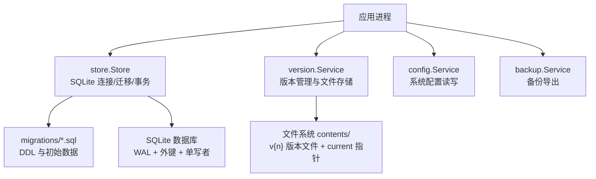
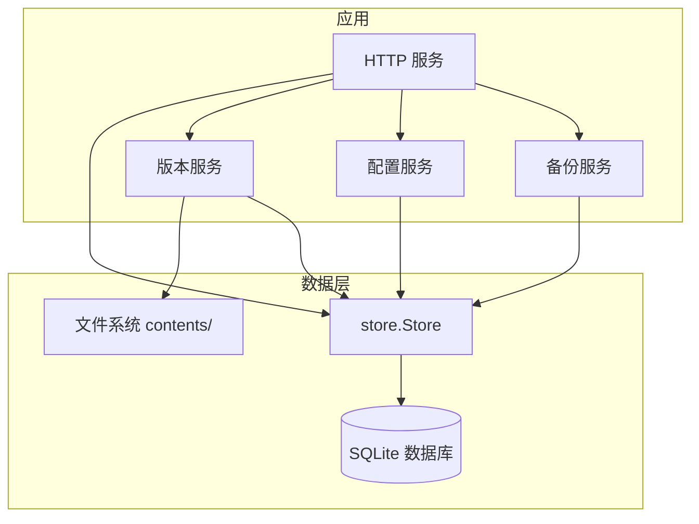
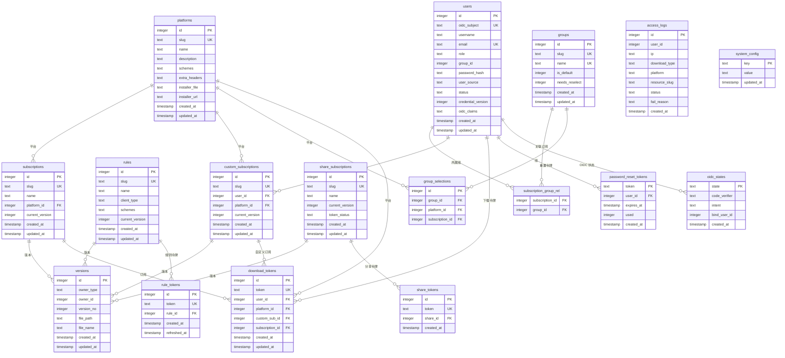
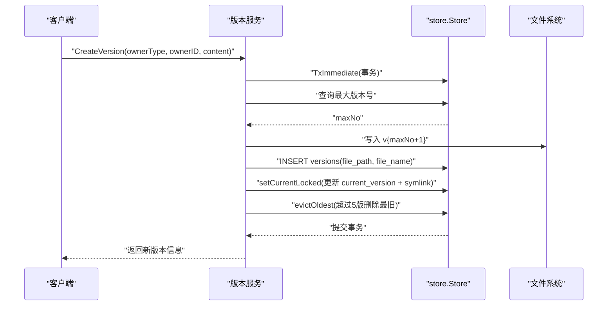
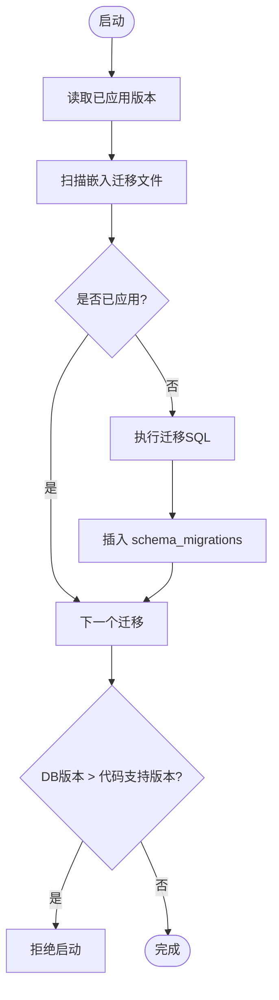
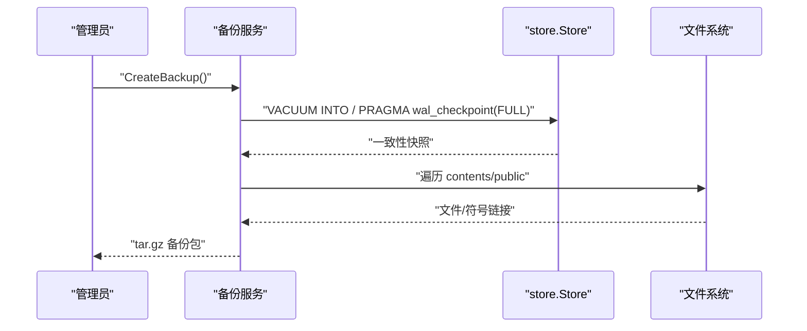
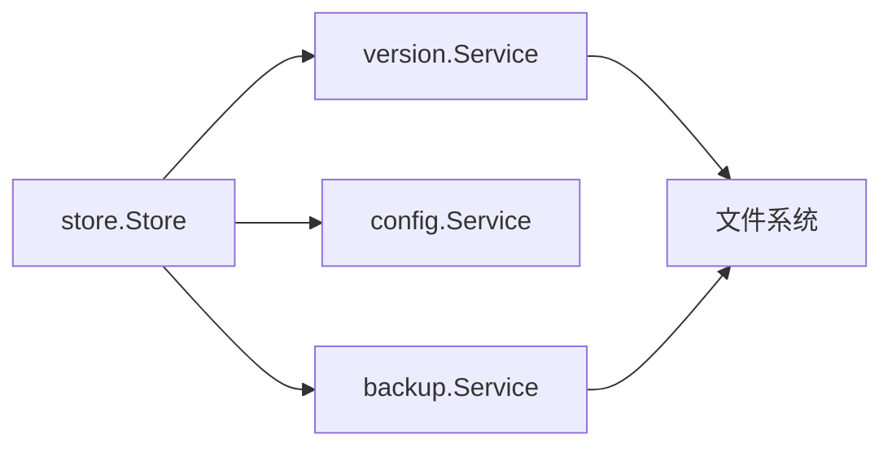

# 数据架构设计

<cite>
**本文引用的文件**
- [backend/internal/store/store.go](file://backend/internal/store/store.go)
- [backend/migrations/0001_init.sql](file://backend/migrations/0001_init.sql)
- [backend/migrations/0002_users.sql](file://backend/migrations/0002_users.sql)
- [backend/migrations/0003_groups_platforms.sql](file://backend/migrations/0003_groups_platforms.sql)
- [backend/migrations/0004_oidc.sql](file://backend/migrations/0004_oidc.sql)
- [backend/migrations/0005_reset_tokens.sql](file://backend/migrations/0005_reset_tokens.sql)
- [backend/migrations/1001_platforms.sql](file://backend/migrations/1001_platforms.sql)
- [backend/migrations/1002_subscriptions_versions.sql](file://backend/migrations/1002_subscriptions_versions.sql)
- [backend/migrations/1003_groups.sql](file://backend/migrations/1003_groups.sql)
- [backend/migrations/1004_tokens.sql](file://backend/migrations/1004_tokens.sql)
- [backend/migrations/1005_custom_share.sql](file://backend/migrations/1005_custom_share.sql)
- [backend/migrations/1006_rules.sql](file://backend/migrations/1006_rules.sql)
- [backend/migrations/1007_versions_filename.sql](file://backend/migrations/1007_versions_filename.sql)
- [backend/internal/version/version.go](file://backend/internal/version/version.go)
- [backend/internal/config/config.go](file://backend/internal/config/config.go)
- [backend/internal/backup/backup.go](file://backend/internal/backup/backup.go)
</cite>

## 目录
1. [简介](#简介)
2. [项目结构](#项目结构)
3. [核心组件](#核心组件)
4. [架构总览](#架构总览)
5. [详细组件分析](#详细组件分析)
6. [依赖关系分析](#依赖关系分析)
7. [性能考虑](#性能考虑)
8. [故障排查指南](#故障排查指南)
9. [结论](#结论)
10. [附录](#附录)

## 简介
本数据架构设计文档聚焦于系统的数据存储与管理方案，涵盖 SQLite 数据库设计、表结构与关系、索引优化策略；版本控制系统的数据模型与文件存储策略；数据迁移机制；数据一致性保证；备份恢复方案；以及性能优化措施。文档同时提供数据库 ER 图、数据流图和存储架构图，帮助读者从整体到细节理解系统的数据层设计与实现。

## 项目结构
后端数据层由以下关键部分组成：
- 数据库连接与迁移框架：封装 SQLite 连接参数、WAL 模式、外键约束、事务隔离级别，并提供版本化迁移执行器。
- 业务数据模型：用户、组、平台、订阅、规则、自定义订阅、分享订阅、下载/分享/规则 Token、访问日志等。
- 版本管理：统一的四资源（订阅/规则/自定义/分享）版本表与文件存储策略，包含当前指针切换与版本驱逐。
- 配置管理：基于 system_config 表的键值配置，支持敏感字段加密存储与读取。
- 备份服务：一致性快照 + 版本文件 + 静态资源的打包导出。

**图表来源**
- [backend/internal/store/store.go:31-52](file://backend/internal/store/store.go#L31-L52)
- [backend/internal/version/version.go:110-123](file://backend/internal/version/version.go#L110-L123)
- [backend/internal/config/config.go:48-55](file://backend/internal/config/config.go#L48-L55)
- [backend/internal/backup/backup.go:19-28](file://backend/internal/backup/backup.go#L19-L28)

**章节来源**
- [backend/internal/store/store.go:31-52](file://backend/internal/store/store.go#L31-L52)
- [backend/migrations/0001_init.sql:1-13](file://backend/migrations/0001_init.sql#L1-L13)

## 核心组件
- 数据存储与迁移
  - SQLite 连接：启用 WAL、外键、busy_timeout，单写者模型避免并发写冲突。
  - 迁移框架：按文件名版本号升序执行未应用的 SQL，迁移与版本记录在同一事务内写入，启动时校验数据库版本不高于代码支持版本。
- 版本管理
  - 统一 versions 表承载四类资源版本；每个 owner 的 current_version 指向激活版本；通过 symlink current 指向 v{n} 作为快速分发入口。
  - 创建版本在 BEGIN IMMEDIATE 事务中完成：计算新编号、写文件、写版本记录、切换当前指针、驱逐最旧版本（最多保留 5 个）。
  - 切换版本原子更新 DB 与 symlink；启动自检重建 symlink 以 DB 为准。
- 配置管理
  - system_config 表存储键值对；敏感配置使用 AES-256-GCM 加密存储，密钥由签名密钥经 HKDF 派生。
  - 提供 Get/Set/GetTx/SetTx 等接口，支持类型化读取与 JSON 数组解析。
- 备份服务
  - 使用 VACUUM INTO 或 WAL checkpoint + 主文件拷贝生成一致性快照；打包 contents/public 目录（含符号链接）为 tar.gz。

**章节来源**
- [backend/internal/store/store.go:62-128](file://backend/internal/store/store.go#L62-L128)
- [backend/internal/version/version.go:125-180](file://backend/internal/version/version.go#L125-L180)
- [backend/internal/config/config.go:57-111](file://backend/internal/config/config.go#L57-L111)
- [backend/internal/backup/backup.go:30-79](file://backend/internal/backup/backup.go#L30-L79)

## 架构总览
下图展示数据层总体架构：应用通过 store 访问 SQLite，版本管理将内容落盘并维护 DB 指针，配置服务读写 system_config，备份服务输出一致性快照与文件集合。

**图表来源**
- [backend/internal/store/store.go:31-52](file://backend/internal/store/store.go#L31-L52)
- [backend/internal/version/version.go:110-123](file://backend/internal/version/version.go#L110-L123)
- [backend/internal/config/config.go:48-55](file://backend/internal/config/config.go#L48-L55)
- [backend/internal/backup/backup.go:19-28](file://backend/internal/backup/backup.go#L19-L28)

## 详细组件分析

### 数据库 ER 图

**图表来源**
- [backend/migrations/0002_users.sql:1-17](file://backend/migrations/0002_users.sql#L1-L17)
- [backend/migrations/0003_groups_platforms.sql:1-23](file://backend/migrations/0003_groups_platforms.sql#L1-L23)
- [backend/migrations/1002_subscriptions_versions.sql:1-34](file://backend/migrations/1002_subscriptions_versions.sql#L1-L34)
- [backend/migrations/1003_groups.sql:1-16](file://backend/migrations/1003_groups.sql#L1-L16)
- [backend/migrations/1004_tokens.sql:1-47](file://backend/migrations/1004_tokens.sql#L1-L47)
- [backend/migrations/1005_custom_share.sql:1-27](file://backend/migrations/1005_custom_share.sql#L1-L27)
- [backend/migrations/1006_rules.sql:1-14](file://backend/migrations/1006_rules.sql#L1-L14)
- [backend/migrations/1007_versions_filename.sql:1-3](file://backend/migrations/1007_versions_filename.sql#L1-L3)
- [backend/migrations/0004_oidc.sql:1-9](file://backend/migrations/0004_oidc.sql#L1-L9)
- [backend/migrations/0005_reset_tokens.sql:1-9](file://backend/migrations/0005_reset_tokens.sql#L1-L9)
- [backend/migrations/0001_init.sql:1-13](file://backend/migrations/0001_init.sql#L1-L13)

### 版本控制数据模型与文件存储策略
- 数据模型
  - versions 表：owner_type、owner_id、version_no、file_path、file_name；唯一约束 (owner_type, owner_id, version_no)。
  - 各 owner 表（subscriptions/rules/custom_subscriptions/share_subscriptions）含 current_version 字段指向激活版本。
- 文件存储
  - 路径约定：contents/{ownerType}/{ownerID}/v{n}；current 为符号链接指向 v{n}。
  - 创建版本：在 BEGIN IMMEDIATE 事务中计算新编号、写文件、写版本记录、切换当前指针、驱逐最旧版本（最多 5 个）。
  - 切换版本：原子更新 DB 与 symlink（临时指针 + rename）。
  - 启动自检：以 DB 为准重建 symlink，确保一致。

**图表来源**
- [backend/internal/version/version.go:125-180](file://backend/internal/version/version.go#L125-L180)
- [backend/internal/version/version.go:218-245](file://backend/internal/version/version.go#L218-L245)
- [backend/internal/version/version.go:182-216](file://backend/internal/version/version.go#L182-L216)

**章节来源**
- [backend/migrations/1002_subscriptions_versions.sql:14-25](file://backend/migrations/1002_subscriptions_versions.sql#L14-L25)
- [backend/migrations/1007_versions_filename.sql:1-3](file://backend/migrations/1007_versions_filename.sql#L1-L3)
- [backend/internal/version/version.go:110-123](file://backend/internal/version/version.go#L110-L123)
- [backend/internal/version/version.go:125-180](file://backend/internal/version/version.go#L125-L180)
- [backend/internal/version/version.go:218-245](file://backend/internal/version/version.go#L218-L245)
- [backend/internal/version/version.go:438-484](file://backend/internal/version/version.go#L438-L484)

### 数据迁移机制
- 迁移文件命名：NNNN_name.sql，按版本号升序执行。
- 幂等性：schema_migrations 表与 CREATE TABLE IF NOT EXISTS 共存，避免重复建表。
- 事务性：每条迁移与其版本记录在同一事务内写入，失败即拒绝启动，防止半迁移状态。
- 回滚边界：数据库版本高于代码支持版本时拒绝启动，禁止降级运行。

**图表来源**
- [backend/internal/store/store.go:62-128](file://backend/internal/store/store.go#L62-L128)
- [backend/migrations/0001_init.sql:1-13](file://backend/migrations/0001_init.sql#L1-L13)

**章节来源**
- [backend/internal/store/store.go:62-128](file://backend/internal/store/store.go#L62-L128)

### 数据一致性保证
- 事务隔离：使用 BEGIN IMMEDIATE 事务，先读后写场景全程串行化，避免竞态条件。
- 外键约束：PRAGMA foreign_keys=ON，确保引用完整性。
- 单写者模型：MaxOpenConns=1，规避 SQLite 并发写 busy。
- 版本指针一致性：DB current_version 与 symlink current 保持一致，启动自检重建。

**章节来源**
- [backend/internal/store/store.go:31-52](file://backend/internal/store/store.go#L31-L52)
- [backend/internal/store/store.go:147-164](file://backend/internal/store/store.go#L147-L164)
- [backend/internal/version/version.go:218-245](file://backend/internal/version/version.go#L218-L245)
- [backend/internal/version/version.go:438-484](file://backend/internal/version/version.go#L438-L484)

### 备份恢复方案
- 一致性快照：VACUUM INTO 或 WAL checkpoint + 主文件拷贝。
- 打包范围：app.db + contents/ + public/，保留符号链接。
- 恢复流程：解压后启动自检重建 symlink，以 DB 为准。

**图表来源**
- [backend/internal/backup/backup.go:30-79](file://backend/internal/backup/backup.go#L30-L79)
- [backend/internal/backup/backup.go:90-119](file://backend/internal/backup/backup.go#L90-L119)

**章节来源**
- [backend/internal/backup/backup.go:30-79](file://backend/internal/backup/backup.go#L30-L79)

### 性能优化措施
- 索引策略
  - users.group_id、access_logs.created_at、download_tokens.user_id+platform_id、subscription_group_rel.group_id 等索引提升查询效率。
  - versions 表复合索引 (owner_type, owner_id, version_no) 加速版本列表与切换。
- 存储优化
  - WAL 模式减少锁竞争，提高并发读性能。
  - 单写者模型避免写冲突。
  - 版本文件限制大小（≤50MB），防止大文件影响性能。
- 事务优化
  - BEGIN IMMEDIATE 事务减少锁等待，确保“读→判定→写”原子性。

**章节来源**
- [backend/migrations/0002_users.sql:16-17](file://backend/migrations/0002_users.sql#L16-L17)
- [backend/migrations/1002_subscriptions_versions.sql:12-25](file://backend/migrations/1002_subscriptions_versions.sql#L12-L25)
- [backend/migrations/1003_groups.sql:14-15](file://backend/migrations/1003_groups.sql#L14-L15)
- [backend/migrations/1004_tokens.sql:14-15](file://backend/migrations/1004_tokens.sql#L14-L15)
- [backend/migrations/1004_tokens.sql:46-47](file://backend/migrations/1004_tokens.sql#L46-L47)
- [backend/internal/store/store.go:31-52](file://backend/internal/store/store.go#L31-L52)
- [backend/internal/version/version.go:25-30](file://backend/internal/version/version.go#L25-L30)

## 依赖关系分析
- store.Store 被 version、config、backup 模块依赖，提供数据库连接、迁移、事务能力。
- version.Service 依赖 store.Store 与文件系统，管理版本生命周期。
- config.Service 依赖 store.Store，读写 system_config。
- backup.Service 依赖 store.Store 与文件系统，生成备份包。

**图表来源**
- [backend/internal/store/store.go:24-29](file://backend/internal/store/store.go#L24-L29)
- [backend/internal/version/version.go:50-59](file://backend/internal/version/version.go#L50-L59)
- [backend/internal/config/config.go:48-55](file://backend/internal/config/config.go#L48-L55)
- [backend/internal/backup/backup.go:19-28](file://backend/internal/backup/backup.go#L19-L28)

**章节来源**
- [backend/internal/store/store.go:24-29](file://backend/internal/store/store.go#L24-L29)
- [backend/internal/version/version.go:50-59](file://backend/internal/version/version.go#L50-L59)
- [backend/internal/config/config.go:48-55](file://backend/internal/config/config.go#L48-L55)
- [backend/internal/backup/backup.go:19-28](file://backend/internal/backup/backup.go#L19-L28)

## 性能考虑
- 数据库层面
  - WAL 模式与外键约束提升一致性与并发读性能。
  - 单写者模型避免写冲突，配合 busy_timeout 降低锁等待。
- 索引层面
  - 针对高频查询列建立索引，如 users.group_id、access_logs.created_at、versions 复合索引。
- 版本管理
  - 版本文件大小限制（≤50MB）与最多 5 个版本，控制存储与检索开销。
  - 原子切换 current 指针，减少分发时的不一致窗口。
- 备份
  - VACUUM INTO 或 WAL checkpoint 生成一致性快照，避免长时间锁定。

[本节为通用性能指导，无需特定文件来源]

## 故障排查指南
- 迁移失败
  - 检查迁移文件命名是否符合 NNNN_name.sql 格式。
  - 查看错误日志确认具体迁移失败原因。
- 版本不一致
  - 启动自检会重建 symlink，若仍异常，检查 DB current_version 与 versions 记录是否匹配。
- 配置解密失败
  - 确认签名密钥存在且未损坏，敏感配置密文格式正确。
- 备份失败
  - 检查 VACUUM INTO 是否受驱动支持，降级路径 WAL checkpoint 是否成功。

**章节来源**
- [backend/internal/store/store.go:96-113](file://backend/internal/store/store.go#L96-L113)
- [backend/internal/version/version.go:438-484](file://backend/internal/version/version.go#L438-L484)
- [backend/internal/config/config.go:253-280](file://backend/internal/config/config.go#L253-L280)
- [backend/internal/backup/backup.go:67-79](file://backend/internal/backup/backup.go#L67-L79)

## 结论
本数据架构设计通过 SQLite 的 WAL 模式、外键约束与单写者模型保障数据一致性与稳定性；版本管理系统以统一 versions 表与文件存储策略实现四资源版本控制；迁移框架确保数据库演进的安全性与可追溯性；备份服务提供一致性快照与完整数据导出。整体设计兼顾性能、可靠性与可维护性，适用于 VPN 订阅管理系统的生产环境。

[本节为总结性内容，无需特定文件来源]

## 附录
- 数据流图：展示版本创建、切换、下载的端到端流程。
- 存储架构图：展示 SQLite、文件系统、备份包的交互关系。

[本节为概念性内容，无需特定文件来源]