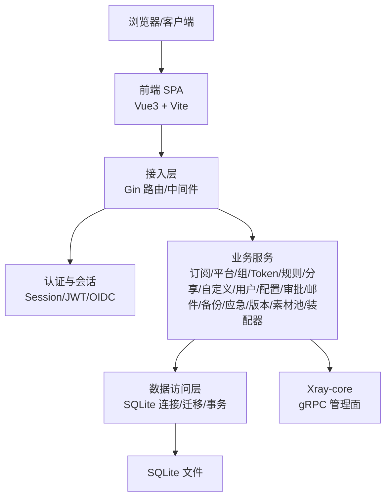
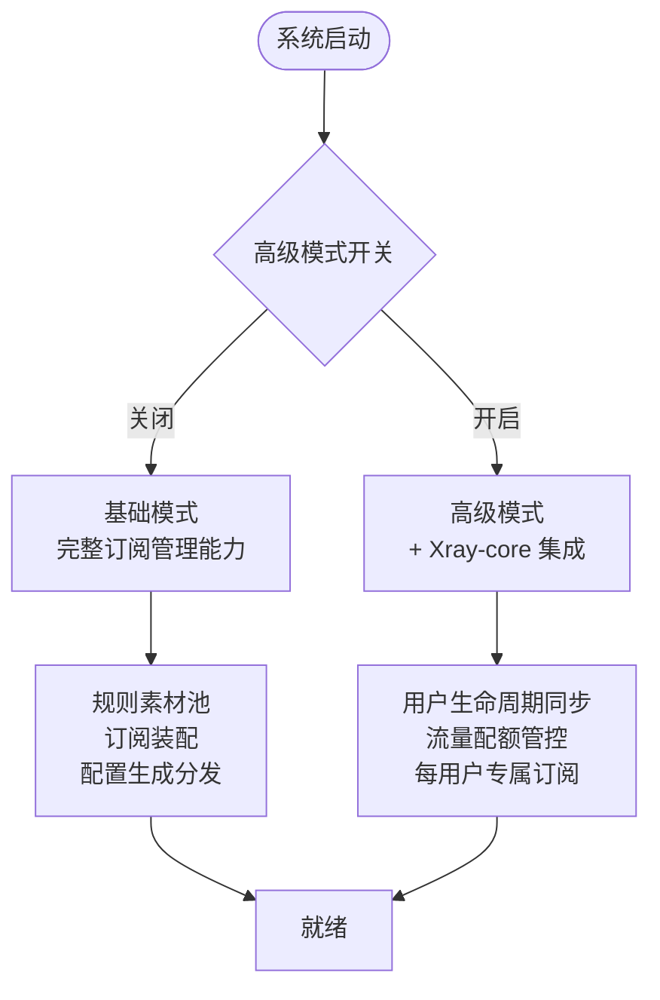
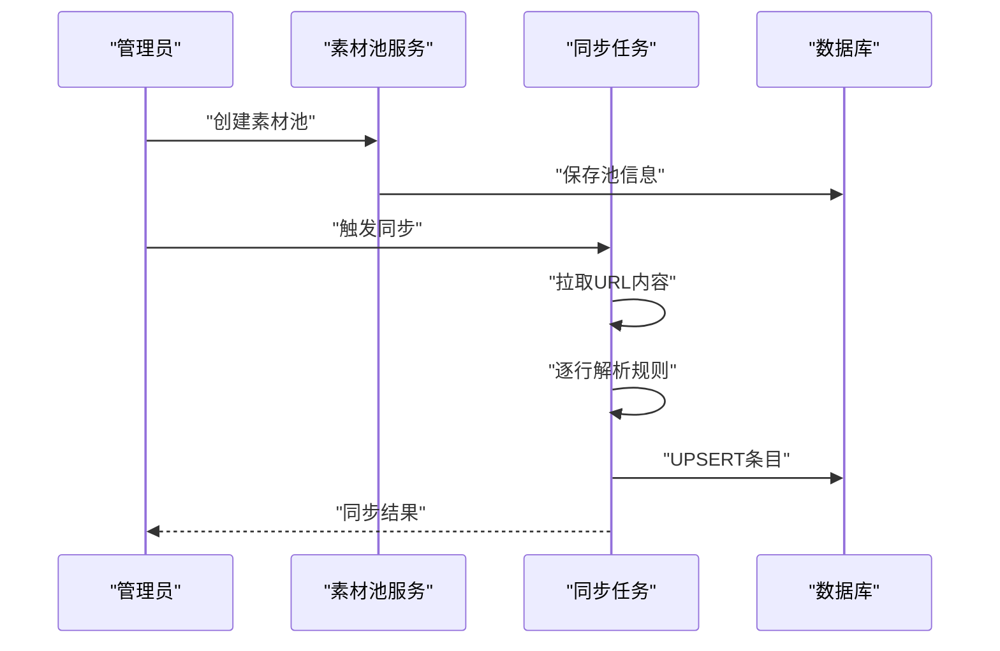
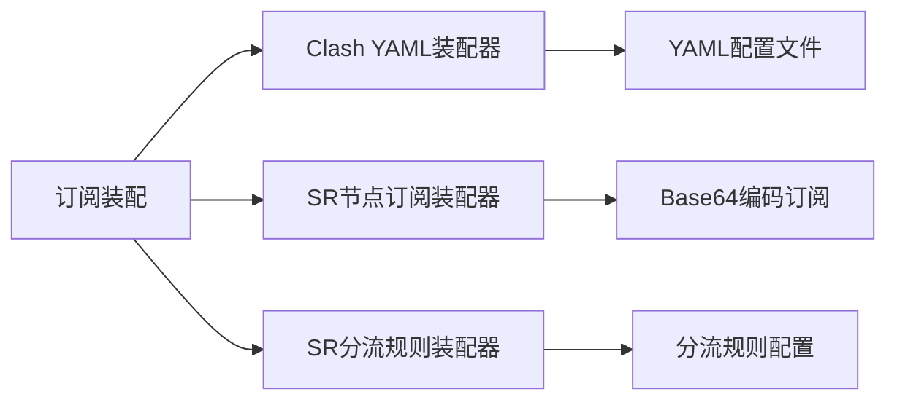
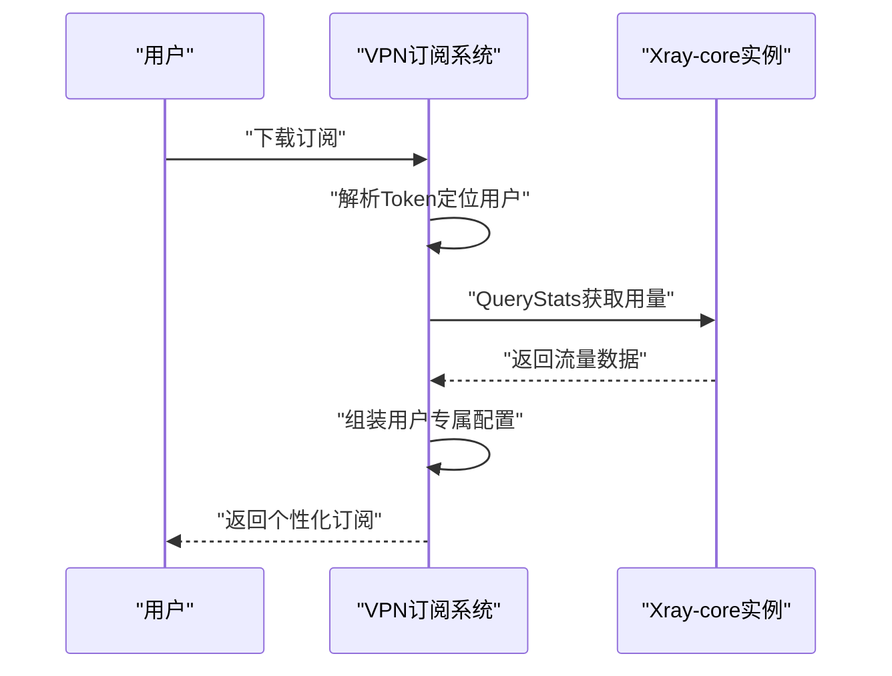
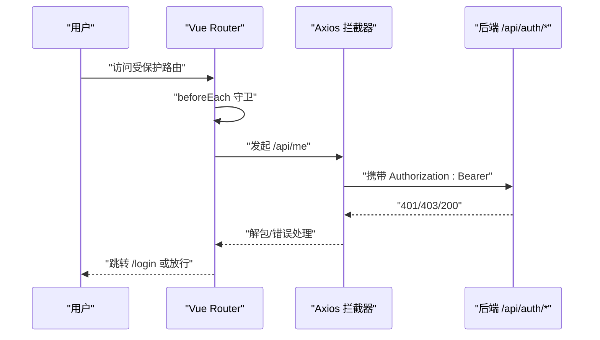
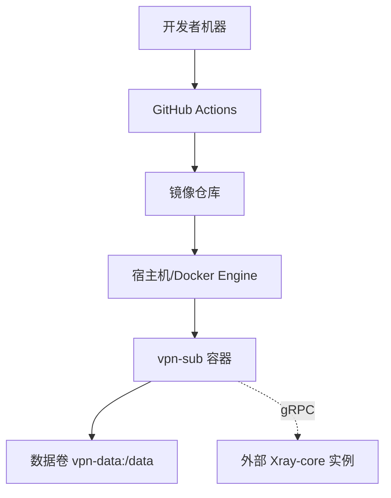
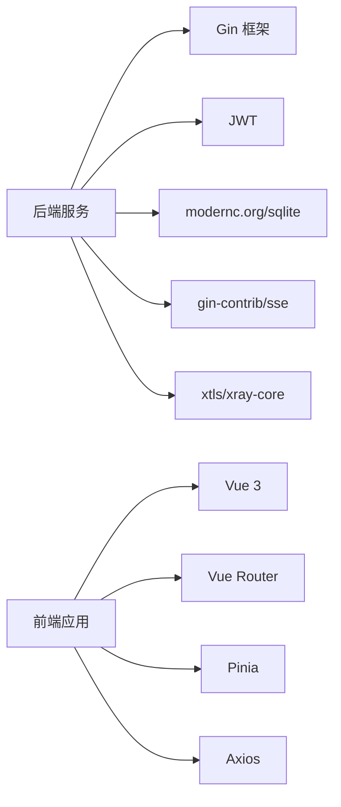
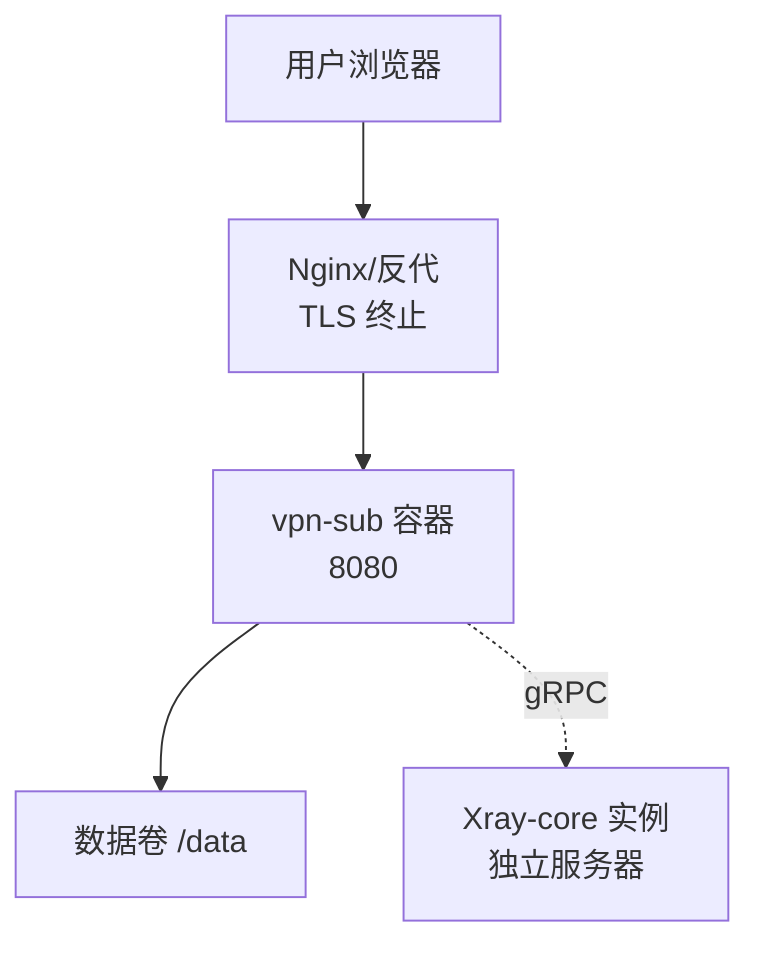

# 架构设计

<cite>
**本文引用的文件列表**
- [backend/cmd/server/main.go](file://backend/cmd/server/main.go)
- [backend/internal/server/server.go](file://backend/internal/server/server.go)
- [backend/internal/store/store.go](file://backend/internal/store/store.go)
- [backend/internal/subscription/subscription.go](file://backend/internal/subscription/subscription.go)
- [backend/migrations/0001_init.sql](file://backend/migrations/0001_init.sql)
- [backend/migrations/1008_platform_installers_multi.sql](file://backend/migrations/1008_platform_installers_multi.sql)
- [frontend/src/main.ts](file://frontend/src/main.ts)
- [frontend/src/router/index.ts](file://frontend/src/router/index.ts)
- [frontend/src/api/request.ts](file://frontend/src/api/request.ts)
- [frontend/src/views/admin/AssemblyView.vue](file://frontend/src/views/admin/AssemblyView.vue)
- [Design2.md](file://Design2.md)
- [Dockerfile](file://Dockerfile)
- [docker-compose.yml](file://docker-compose.yml)
- [README.md](file://README.md)
</cite>

## 更新摘要
**变更内容**
- 新增双模式架构（基础模式与高级模式）设计说明
- 扩展订阅装配能力，支持规则素材池、Shadowrocket双装配器
- 集成Xray-core对接，实现多用户VPN服务管理
- 更新数据模型，新增节点表、组分配、流量配额等核心组件
- 完善前后端交互机制，支持动态节点注入与用户专属订阅

## 目录
1. [引言](#引言)
2. [项目结构](#项目结构)
3. [核心组件](#核心组件)
4. [架构总览](#架构总览)
5. [详细组件分析](#详细组件分析)
6. [依赖关系分析](#依赖关系分析)
7. [性能与可扩展性](#性能与可扩展性)
8. [故障排查指南](#故障排查指南)
9. [结论](#结论)
10. [附录](#附录)

## 引言
本系统为"VPN订阅管理系统"，采用前后端分离、单容器部署的轻量自托管方案。系统现已演进为**双模式架构**：基础模式提供完整的订阅管理与装配能力，高级模式通过Xray-core集成实现多用户VPN服务管理。后端使用 Go + Gin，前端使用 Vue 3 + Vite，数据层基于嵌入式 SQLite（纯 Go 驱动，零 CGO），通过 Docker 多阶段构建将前端静态资源嵌入到后端二进制中，以单一进程对外提供 API 与 Web 页面。

系统核心能力包括：规则素材池管理、订阅装配拼接（Clash YAML / Shadowrocket .conf）、Xray-core对接、用户生命周期同步、流量配额管控、每用户专属订阅生成等。支持本地账号与 OIDC 双认证、用户组分发、版本化订阅管理、分享链接、审批中心、面板配置与备份导出等能力，并提供应急模式保障在数据库损坏或关键配置异常时的可恢复性。

## 项目结构
- **后端（Go）**：按功能域划分 internal 包（auth、user、subscription、platform、group、token、rule、share、custom、config、setup、oidc、mail、log、backup、emergency、version、store、xray、pool、assembly等），HTTP 路由装配集中在 server 包，入口在 cmd/server/main.go。
- **前端（Vue）**：src 下包含 api、components、layouts、router、stores、views 等；通过 Vite 构建产物由后端静态服务提供。
- **数据层**：SQLite 文件存储，迁移脚本位于 migrations，启动时自动执行版本化迁移。
- **部署**：Dockerfile 多阶段构建，docker-compose.yml 编排单容器运行，数据卷持久化 /data。

```mermaid
graph TB
subgraph "客户端"
Browser["浏览器"]
end
subgraph "容器内"
FE["前端静态资源<br/>Vite 构建产物"]
BE["后端 HTTP 服务<br/>Gin + 业务模块"]
DB["SQLite 文件<br/>/data/app-prod.db"]
XRAY["Xray-core 实例<br/>高级模式可选"]
end
Browser --> |HTTPS(可选)/HTTP| FE
Browser --> |/api/*| BE
BE --> DB
BE --> XRAY
```

**图表来源**
- [Dockerfile:1-31](file://Dockerfile#L1-L31)
- [docker-compose.yml:1-28](file://docker-compose.yml#L1-L28)
- [backend/cmd/server/main.go:24-98](file://backend/cmd/server/main.go#L24-L98)
- [Design2.md:218-229](file://Design2.md#L218-L229)

**章节来源**
- [backend/cmd/server/main.go:24-98](file://backend/cmd/server/main.go#L24-L98)
- [frontend/src/main.ts:1-11](file://frontend/src/main.ts#L1-L11)
- [Design2.md:16-30](file://Design2.md#L16-L30)
- [Dockerfile:1-31](file://Dockerfile#L1-L31)
- [docker-compose.yml:1-28](file://docker-compose.yml#L1-L28)

## 核心组件
- **应用入口与生命周期**：main.go 负责环境变量解析、日志初始化、数据库打开与迁移、应急模式检测、服务装配与优雅退出。
- **HTTP 服务装配**：server.New 集中注册各业务域路由与中间件（认证、限流、管理员校验、SSE 日志流等）。
- **数据访问层**：store.Store 封装 SQLite 连接、WAL 模式、外键约束、迁移框架与事务工具（TxImmediate）。
- **业务域服务**：subscription、platform、group、token、rule、share、custom、user、config、setup、oidc、mail、approval、backup、emergency、version、xray、pool、assembly 等。
- **前端应用**：Vue 3 应用，Pinia 状态管理，Vue Router 路由守卫，Axios 统一请求封装与错误处理。
- **部署与运维**：Docker 多阶段构建、健康检查、数据卷持久化、环境变量配置。

**章节来源**
- [backend/cmd/server/main.go:24-98](file://backend/cmd/server/main.go#L24-L98)
- [backend/internal/server/server.go:62-157](file://backend/internal/server/server.go#L62-L157)
- [backend/internal/store/store.go:31-164](file://backend/internal/store/store.go#L31-L164)
- [frontend/src/router/index.ts:96-128](file://frontend/src/router/index.ts#L96-L128)
- [frontend/src/api/request.ts:1-89](file://frontend/src/api/request.ts#L1-L89)

## 架构总览
系统采用分层与模块化结合的设计，支持双模式运行：

### 基础模式（默认）
- 表现层：前端 SPA（Vue 3 + Vite），通过 Axios 调用后端 RESTful API
- 接入层：Gin HTTP 服务，统一响应格式、日志、恢复、限流、会话、管理员鉴权等横切关注点
- 业务逻辑层：按领域划分的 Service（订阅、平台、组、Token、规则、分享、自定义、用户、配置、审批、邮件、备份、应急、版本、规则素材池、装配器等）
- 数据访问层：store.Store 提供 SQLite 连接、迁移、事务与基础查询封装

### 高级模式（可选）
- 新增 Xray-core 集成，实现多用户 VPN 服务管理
- 用户生命周期自动同步、流量配额管控、每用户专属订阅生成
- gRPC 通信协议，独立 Xray 实例管理



**图表来源**
- [backend/internal/server/server.go:62-157](file://backend/internal/server/server.go#L62-L157)
- [backend/internal/store/store.go:31-164](file://backend/internal/store/store.go#L31-L164)
- [Design2.md:218-229](file://Design2.md#L218-L229)
- [frontend/src/router/index.ts:96-128](file://frontend/src/router/index.ts#L96-L128)
- [frontend/src/api/request.ts:1-89](file://frontend/src/api/request.ts#L1-L89)

## 详细组件分析

### 双模式架构设计
系统采用基础模式与高级模式的双模式架构：

**基础模式**（默认，零配置启动）= Design1.md 现有功能 + 规则素材池、装配拼接、配置生成与分发能力
**高级模式**（需显式开关解锁）= Xray-core 对接、多用户组管理、流量配额管控、每用户专属订阅



**图表来源**
- [Design2.md:16-30](file://Design2.md#L16-L30)

**章节来源**
- [Design2.md:16-30](file://Design2.md#L16-L30)

### 规则素材池管理
规则素材池是基础模式的核心组件，提供规则条目的集中管理与同步：

- **素材池模型**：名称、挂接 URL 列表、上次同步时间、同步状态、可选定时同步开关
- **条目来源**：URL 同步（差量更新）与手工维护（manual 来源永不受影响）
- **解析规则**：支持 full:域名、裸域名、标准规则行等多种形态
- **白名单校验**：入库前进行规则类型白名单校验，防止恶意内容注入



**图表来源**
- [Design2.md:33-75](file://Design2.md#L33-L75)

**章节来源**
- [Design2.md:33-75](file://Design2.md#L33-L75)

### 订阅装配拼接
订阅装配是系统的核心能力，支持 Clash YAML 与 Shadowrocket 双语法：

**Shadowrocket 双装配器**：
- **节点订阅装配器**：勾选节点 + 填写头部 → 产出 subs 内容（base64编码）
- **分流规则装配器**：填写表单 + 勾选素材池 + 选择兜底方向 → 产出 .conf 文件

**Clash YAML 装配器**：
- 勾选节点 + 配置代理组 + 勾选规则素材池 → 产出完整 YAML 配置



**图表来源**
- [Design2.md:77-117](file://Design2.md#L77-L117)

**章节来源**
- [Design2.md:77-117](file://Design2.md#L77-L117)

### Xray-core 集成（高级模式）
高级模式通过 gRPC 协议与独立 Xray-core 实例通信，实现多用户 VPN 服务管理：

**核心能力**：
- 用户生命周期自动同步（注册/审批/禁用/删除）
- 流量配额管控（自然月累计，超限移除账号）
- 每用户专属订阅（模板 + 组分配节点 + 用户凭据动态注入）
- 流量统计采集（QueryStats 串行采集，差值落库）

**架构选型**：路径 A - 独立实例 + gRPC 远程管理
- Xray 在另一台服务器运行（1-5 台实例范围）
- 安全边界由部署者 IP 白名单控制
- 并发保守串行化（官方文档提示约 10 并发后丢弃请求）



**图表来源**
- [Design2.md:218-229](file://Design2.md#L218-L229)
- [Design2.md:305-332](file://Design2.md#L305-L332)

**章节来源**
- [Design2.md:189-229](file://Design2.md#L189-L229)
- [Design2.md:305-332](file://Design2.md#L305-L332)

### 数据访问层与迁移机制
数据访问层保持原有设计，同时扩展支持新模式的数据结构：

- **连接与并发**：WAL 模式、外键开启、busy_timeout 设置、最大连接数 1（单写者模型）
- **迁移框架**：按文件名 NNNN_name.sql 顺序执行未应用迁移，每条迁移与其版本记录在同一事务写入
- **事务工具**：TxImmediate 以 BEGIN IMMEDIATE 开启事务，适用于先读后写的场景

**新增数据模型**：
- `rule_pools` / `pool_entries`：规则素材池与条目
- `nodes`：统一节点表（manual/xray 双来源）
- `proxy_groups`：Clash 代理组定义
- `group_nodes`：组与节点分配关系
- `xray_instances` / `xray_users` / `traffic_records`：Xray 相关数据


**图表来源**
- [backend/internal/store/store.go:31-164](file://backend/internal/store/store.go#L31-L164)
- [backend/migrations/0001_init.sql:1-13](file://backend/migrations/0001_init.sql#L1-L13)
- [backend/migrations/1008_platform_installers_multi.sql:1-14](file://backend/migrations/1008_platform_installers_multi.sql#L1-L14)

**章节来源**
- [backend/internal/store/store.go:31-164](file://backend/internal/store/store.go#L31-L164)
- [backend/migrations/0001_init.sql:1-13](file://backend/migrations/0001_init.sql#L1-L13)
- [backend/migrations/1008_platform_installers_multi.sql:1-14](file://backend/migrations/1008_platform_installers_multi.sql#L1-L14)

### 前端路由与认证流程
前端保持原有设计，新增装配视图占位页：

- **路由守卫**：按顺序判断 emergency → configured → 登录态 → 管理员角色
- **请求封装**：Axios 实例统一 baseURL=/api，自动注入 Bearer token，拦截 401 跳转登录
- **状态管理**：Pinia stores（auth、system）管理登录态与系统状态
- **装配视图**：当前为占位页，待后续实现完整装配功能



**图表来源**
- [frontend/src/router/index.ts:96-128](file://frontend/src/router/index.ts#L96-L128)
- [frontend/src/api/request.ts:1-89](file://frontend/src/api/request.ts#L1-L89)
- [frontend/src/views/admin/AssemblyView.vue:1-16](file://frontend/src/views/admin/AssemblyView.vue#L1-L16)

**章节来源**
- [frontend/src/router/index.ts:1-132](file://frontend/src/router/index.ts#L1-L132)
- [frontend/src/api/request.ts:1-89](file://frontend/src/api/request.ts#L1-L89)
- [frontend/src/views/admin/AssemblyView.vue:1-16](file://frontend/src/views/admin/AssemblyView.vue#L1-L16)

### 部署拓扑与环境
部署保持原有设计，支持高级模式下的 Xray-core 集成：

- **多阶段构建**：Node 构建前端，Go 编译后端并将前端 dist 嵌入，最终最小镜像运行非 root 用户
- **数据持久化**：/data 卷承载数据库与内容文件；端口 8080 暴露；健康检查探测 /health
- **环境变量**：APP_MODE、LOG_LEVEL、LOG_FORMAT、PORT、TRUST_PROXY、RESET_ADMIN_PASSWORD 等
- **高级模式扩展**：支持外部 Xray-core 实例连接配置



**图表来源**
- [Dockerfile:1-31](file://Dockerfile#L1-L31)
- [docker-compose.yml:1-28](file://docker-compose.yml#L1-L28)
- [README.md:221-227](file://README.md#L221-L227)
- [Design2.md:218-229](file://Design2.md#L218-L229)

**章节来源**
- [Dockerfile:1-31](file://Dockerfile#L1-L31)
- [docker-compose.yml:1-28](file://docker-compose.yml#L1-L28)
- [README.md:221-227](file://README.md#L221-L227)

## 依赖关系分析
依赖关系在原有基础上扩展支持高级模式：

**后端依赖**：
- 原有：Gin（HTTP 框架）、golang-jwt（JWT）、modernc.org/sqlite（纯 Go SQLite 驱动）、gin-contrib/sse（SSE 日志流）
- 新增：github.com/xtls/xray-core（gRPC 客户端，仅用于 command 包）

**前端依赖**：
- 保持原有：Vue 3、Vue Router、Pinia、Ant Design Vue、Tailwind CSS、Vite、Axios

**耦合与内聚**：
- 高内聚：每个 internal 包职责清晰，Service 通过构造函数注入依赖
- 低耦合：回调注入避免循环依赖；Store 抽象数据访问
- 外部依赖：SQLite 单写者模型限制并发写；Xray-core 通过 gRPC 隔离



**图表来源**
- [backend/go.mod:1-49](file://backend/go.mod#L1-L49)
- [frontend/package.json:1-37](file://frontend/package.json#L1-L37)
- [Design2.md:228-229](file://Design2.md#L228-L229)

**章节来源**
- [backend/go.mod:1-49](file://backend/go.mod#L1-L49)
- [frontend/package.json:1-37](file://frontend/package.json#L1-L37)
- [Design2.md:228-229](file://Design2.md#L228-L229)

## 性能与可扩展性
性能设计在原有基础上增强支持高级模式：

**数据库性能**：
- WAL 模式提升读性能，单写者模型避免写竞争
- busy_timeout 降低忙等待失败概率
- 新增索引优化：UNIQUE(pool_id, rule_type, match_value) 等

**缓存与限流**：
- 内置 ratelimit 限流器，可按需扩展 Redis 等外部缓存
- SSE 日志流限制连接数与短期 Token，避免资源滥用
- Xray-core 调用串行化，避免并发压力

**构建优化**：
- CGO_ENABLED=0 静态编译，减小镜像体积
- 前端按需懒加载路由，减少首屏体积
- 仅引入 xray-core command 包，避免运行时依赖

**可扩展方向**：
- 数据层：抽象 Store 接口，便于替换为 PostgreSQL/MySQL
- 认证：OIDC 已支持，可对接更多 IdP
- 消息与任务：引入队列处理耗时任务（批量导入、邮件发送重试）
- Xray 集群：支持多实例负载均衡与故障转移

## 故障排查指南
故障排查在原有基础上增加高级模式相关内容：

**启动失败**：
- 数据库损坏或迁移失败：自动进入应急模式，提供系统状态与应急端点
- 高级模式启动失败：检查 Xray-core 连接配置与网络可达性

**认证问题**：
- 401 自动跳转登录：检查 token 是否过期或丢失
- OIDC 回调失败：确认公网 HTTPS 域名与回调地址配置

**订阅无法导入**：
- 检查平台与用户组分配
- 确认订阅版本有效且未被删除
- 高级模式检查 Xray 节点可用性

**高级模式特定问题**：
- Xray 连接失败：检查 IP 白名单配置与防火墙规则
- 流量统计为空：确认 Xray 配置中 policy.statsUserUplink/Downlink 已启用
- 用户推送失败：检查 xray_users 同步状态与 last_error 字段

**备份与恢复**：
- 使用面板"备份下载"获取 tar.gz 快照
- 升级不影响数据卷
- 高级模式配置包含 Xray 实例连接信息

**应急恢复**：
- 设置 RESET_ADMIN_PASSWORD 并重启容器，按日志中的操作码重置管理员密码

**章节来源**
- [backend/cmd/server/main.go:40-75](file://backend/cmd/server/main.go#L40-L75)
- [backend/internal/server/server.go:160-193](file://backend/internal/server/server.go#L160-L193)
- [docker-compose.yml:19-24](file://docker-compose.yml#L19-L24)
- [README.md:205-218](file://README.md#L205-L218)
- [Design2.md:204-214](file://Design2.md#L204-L214)

## 结论
本系统以"单容器、前后端一体、SQLite 嵌入式"为核心设计理念，现已演进为支持双模式运行的现代化 VPN 订阅管理平台。通过分层与模块化设计，业务域清晰、依赖注入明确、迁移与事务可控；前端路由守卫与统一请求封装提升了用户体验与健壮性。

**基础模式**提供完整的订阅管理能力，包括规则素材池、订阅装配拼接、配置生成分发等核心功能。**高级模式**通过 Xray-core 集成实现多用户 VPN 服务管理，支持用户生命周期同步、流量配额管控与每用户专属订阅生成。

Docker 多阶段构建与非 root 运行保障了安全与便携。未来可根据规模需求演进数据层与缓存层，同时保持现有 API 稳定。系统设计充分考虑了向后兼容性与渐进式升级路径，确保从基础模式到高级模式的平滑过渡。

## 附录
**技术栈选择理由与权衡**：
- **Go 后端**：高性能、静态编译、生态成熟；Gin 简洁高效；JWT 与 OIDC 支持完善
- **Vue 前端**：生态丰富、开发体验好；Vite 构建快；Ant Design Vue 提供企业级 UI
- **SQLite**：零依赖、易部署、适合中小规模；WAL 与单写者模型平衡读写性能
- **Docker**：一键部署、环境隔离、数据卷持久化；多阶段构建优化镜像大小
- **Xray-core**：成熟的开源 VPN 解决方案；gRPC 接口支持程序化管理；社区活跃生态完善

**部署拓扑图（含反向代理与高级模式）**：



**图表来源**
- [README.md:167-192](file://README.md#L167-L192)
- [docker-compose.yml:5-17](file://docker-compose.yml#L5-L17)
- [Design2.md:218-229](file://Design2.md#L218-L229)

**章节来源**
- [README.md:167-227](file://README.md#L167-L227)
- [docker-compose.yml:5-17](file://docker-compose.yml#L5-L17)
- [Design2.md:218-229](file://Design2.md#L218-L229)