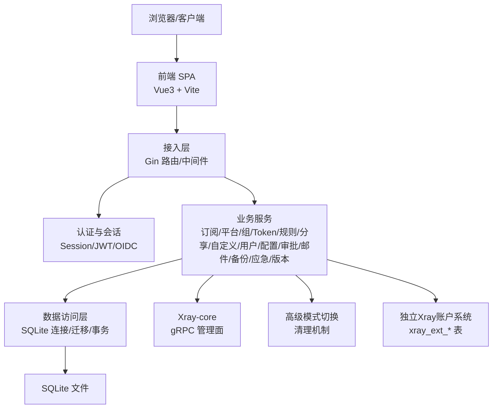
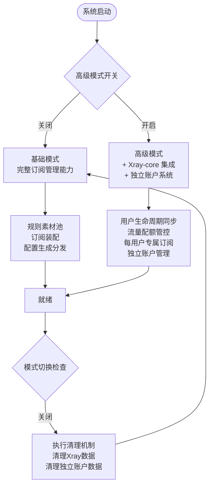
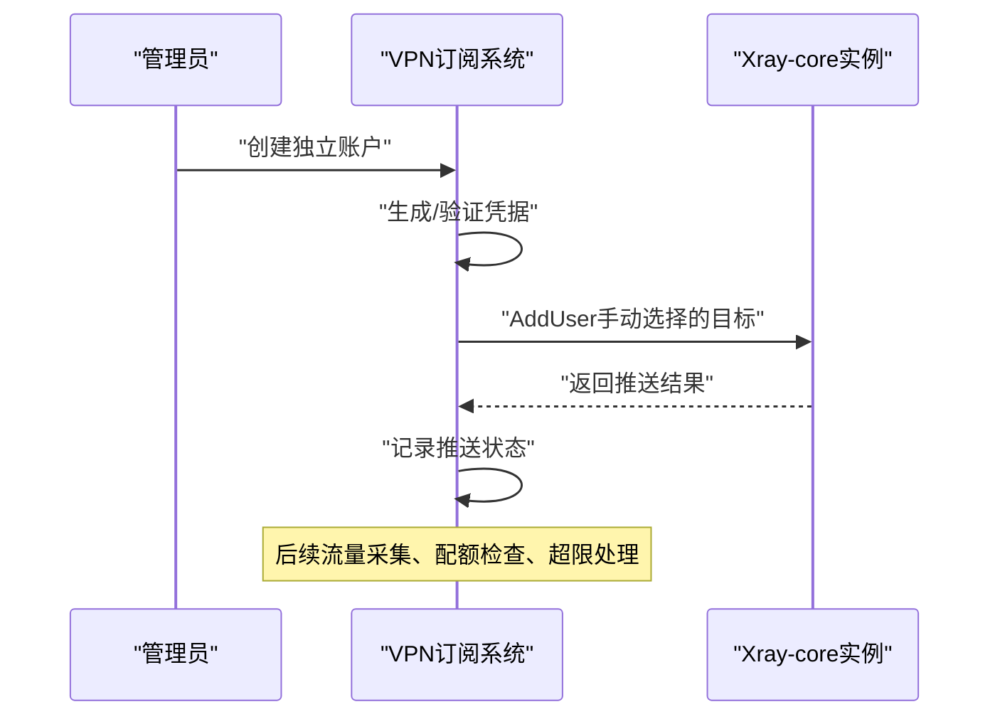
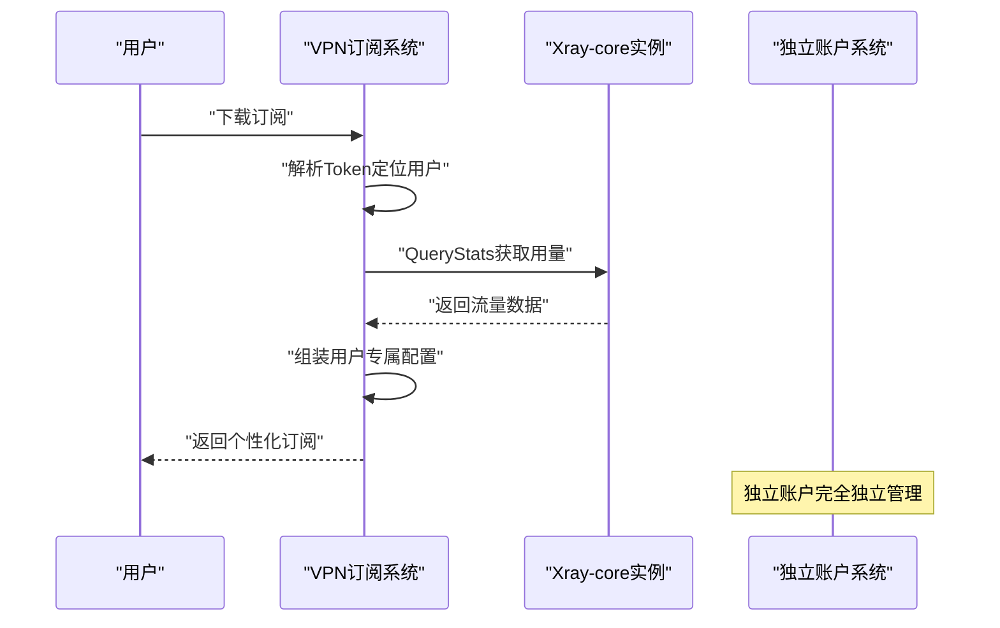
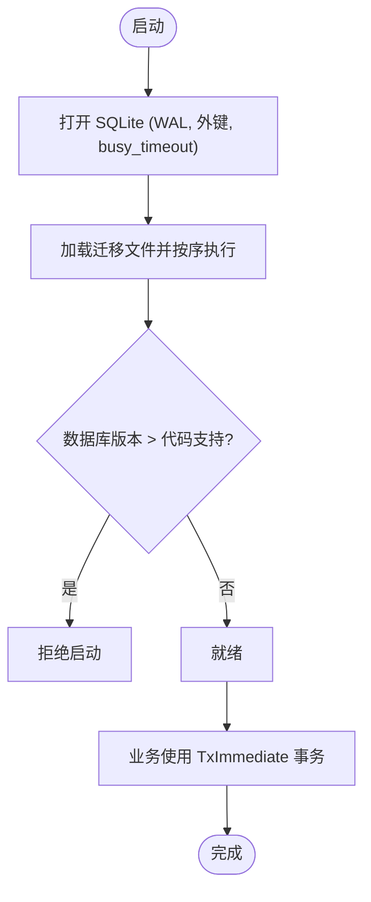
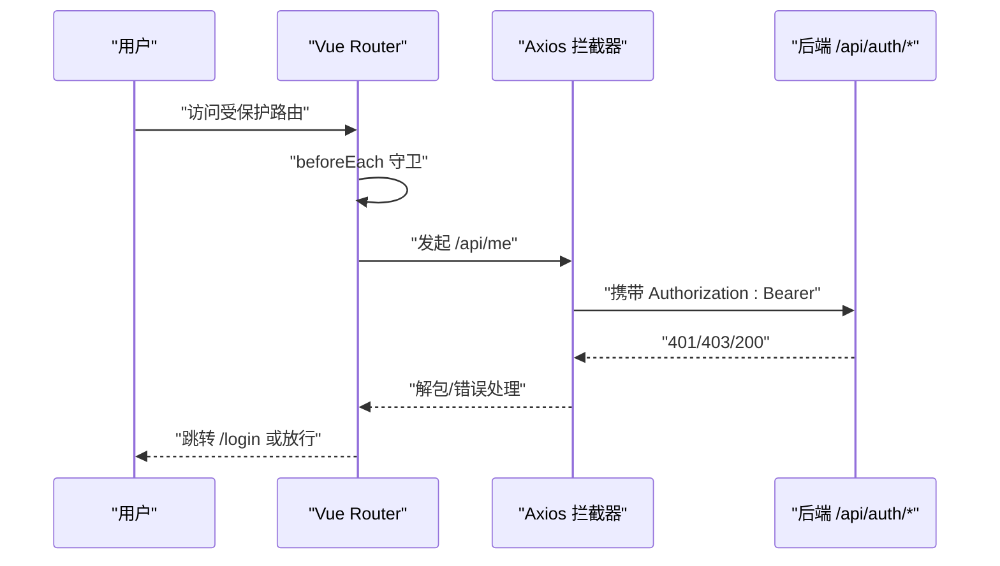
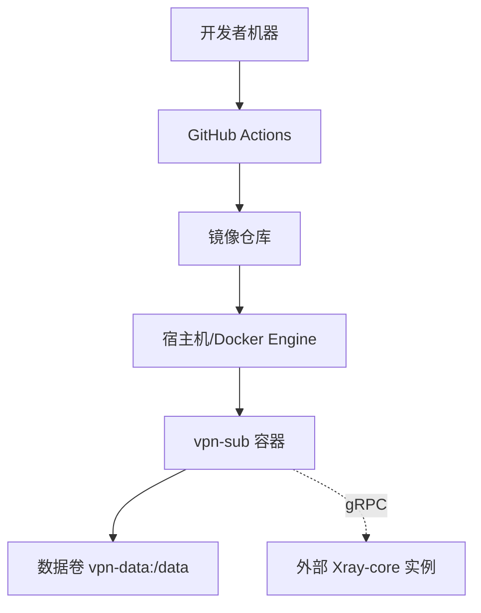
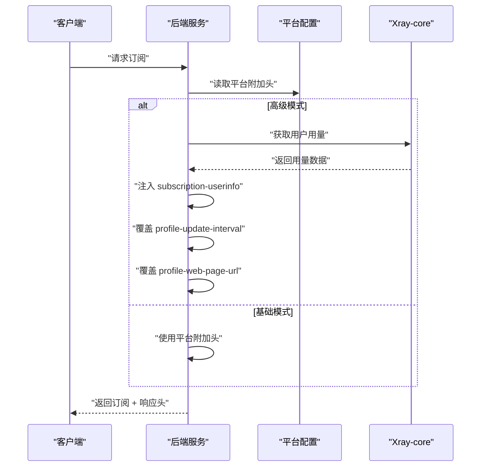
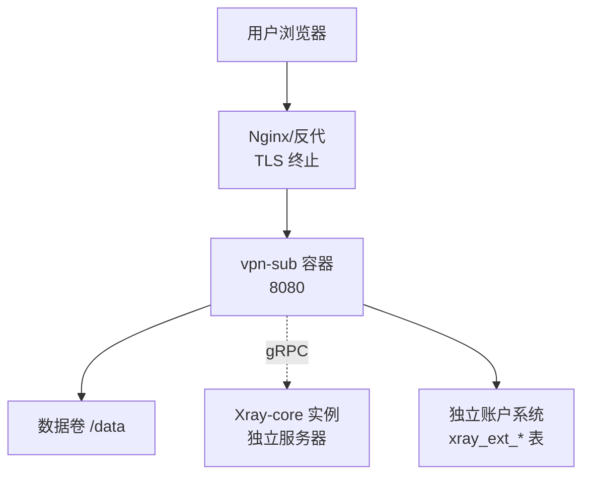

# 架构设计

<cite>
**本文引用的文件列表**
- [backend/cmd/server/main.go](file://backend/cmd/server/main.go)
- [backend/internal/store/store.go](file://backend/internal/store/store.go)
- [backend/internal/dataclear/dataclear.go](file://backend/internal/dataclear/dataclear.go)
- [backend/internal/download/download.go](file://backend/internal/download/download.go)
- [backend/internal/server/download.go](file://backend/internal/server/download.go)
- [backend/internal/setup/setup.go](file://backend/internal/setup/setup.go)
- [Design2.md](file://Design2.md)
- [Design2-UI.md](file://Design2-UI.md)
- [frontend/src/main.ts](file://frontend/src/main.ts)
- [frontend/src/router/index.ts](file://frontend/src/router/index.ts)
- [frontend/src/api/request.ts](file://frontend/src/api/request.ts)
- [Dockerfile](file://Dockerfile)
- [docker-compose.yml](file://docker-compose.yml)
- [README.md](file://README.md)
- [docs/Reference/Xray-Core-API.md](file://docs/Reference/Xray-Core-API.md)
</cite>

## 更新摘要
**变更内容**
- 新增独立Xray账户系统架构设计（§5.11），包含完整的生命周期管理、配额控制和推送目标选择机制
- 增强了高级模式切换的清理机制，使用更精确的清理流程语言描述
- 改进了AddUser gRPC调用的并发处理，通过立即补偿RemoveUser确保数据一致性
- 完善了同步失败处理，增加了对零条目响应的显式保护
- 更新了订阅响应头在不同模式下的行为说明
- 扩展了数据模型以支持独立账户系统的三张新表结构

## 目录
1. [引言](#引言)
2. [项目结构](#项目结构)
3. [核心组件](#核心组件)
4. [架构总览](#架构总览)
5. [详细组件分析](#详细组件分析)
6. [依赖关系分析](#依赖关系分析)
7. [性能与可扩展性](#性能与可扩展性)
8. [故障排查指南](#故障排查指南)
9. [结论](#结论)
10. [附录](#附录)

## 引言
本系统为"VPN订阅管理系统"，采用前后端分离、单容器部署的轻量自托管方案。系统现已演进为**双模式架构**：基础模式提供完整的订阅管理与装配能力，高级模式通过Xray-core集成实现多用户VPN服务管理。**本次重大更新新增了独立Xray账户系统**，该系统完全独立于面板用户体系，支持管理员手动添加少量Xray账户，具备单独的生命周期管理、配额控制和推送目标选择功能。

后端使用 Go + Gin，前端使用 Vue 3 + Vite，数据层基于嵌入式 SQLite（纯 Go 驱动，零 CGO），通过 Docker 多阶段构建将前端静态资源嵌入到后端二进制中，以单一进程对外提供 API 与 Web 页面。

系统核心能力包括：规则素材池管理、订阅装配拼接（Clash YAML / Shadowrocket .conf）、Xray-core对接、用户生命周期同步、流量配额管控、每用户专属订阅生成等。支持本地账号与 OIDC 双认证、用户组分发、版本化订阅管理、分享链接、审批中心、面板配置与备份导出等能力，并提供应急模式保障在数据库损坏或关键配置异常时的可恢复性。

**新增独立Xray账户系统特性**：
- 完全独立于面板用户体系的账户管理
- 支持面板生成或手填接管两种凭据来源
- 独立的配额管理和流量采集
- 手动选择的推送目标集合
- 对账防护机制防止误清理

## 项目结构
- **后端（Go）**：按功能域划分 internal 包（auth、user、subscription、platform、group、token、rule、share、custom、config、setup、oidc、mail、log、backup、emergency、version、store等），HTTP 路由装配集中在 server 包，入口在 cmd/server/main.go。
- **前端（Vue）**：src 下包含 api、components、layouts、router、stores、views 等；通过 Vite 构建产物由后端静态服务提供。
- **数据层**：SQLite 文件存储，迁移脚本位于 migrations，启动时自动执行版本化迁移。
- **部署**：Dockerfile 多阶段构建，docker-compose.yml 编排单容器运行，数据卷持久化 /data。

```mermaid
graph TB
subgraph "客户端"
Browser["浏览器"]
end
subgraph "容器内"
FE["前端静态资源<br/>Vite 构建产物"]
BE["后端 HTTP 服务<br/>Gin + 业务模块"]
DB["SQLite 文件<br/>/data/app-prod.db"]
XRAY["Xray-core 实例<br/>高级模式可选"]
EXT_ACCOUNTS["独立Xray账户系统<br/>xray_ext_accounts/users/traffic"]
end
Browser --> |HTTPS(可选)/HTTP| FE
Browser --> |/api/*| BE
BE --> DB
BE --> XRAY
BE --> EXT_ACCOUNTS
```

**图表来源**
- [Dockerfile:1-31](file://Dockerfile#L1-L31)
- [docker-compose.yml:1-28](file://docker-compose.yml#L1-L28)
- [backend/cmd/server/main.go:24-98](file://backend/cmd/server/main.go#L24-L98)
- [Design2.md:218-229](file://Design2.md#L218-L229)

**章节来源**
- [backend/cmd/server/main.go:24-98](file://backend/cmd/server/main.go#L24-L98)
- [frontend/src/main.ts:1-11](file://frontend/src/main.ts#L1-L11)
- [Design2.md:16-30](file://Design2.md#L16-L30)
- [Dockerfile:1-31](file://Dockerfile#L1-L31)
- [docker-compose.yml:1-28](file://docker-compose.yml#L1-L28)

## 核心组件
- **应用入口与生命周期**：main.go 负责环境变量解析、日志初始化、数据库打开与迁移、应急模式检测、服务装配与优雅退出。
- **HTTP 服务装配**：server.New 集中注册各业务域路由与中间件（认证、限流、管理员校验、SSE 日志流等）。
- **数据访问层**：store.Store 封装 SQLite 连接、WAL 模式、外键约束、迁移框架与事务工具（TxImmediate）。
- **业务域服务**：subscription、platform、group、token、rule、share、custom、user、config、setup、oidc、mail、approval、backup、emergency、version 等。
- **独立Xray账户系统**：全新的账户管理体系，完全独立于面板用户，支持手动管理和配额控制。
- **前端应用**：Vue 3 应用，Pinia 状态管理，Vue Router 路由守卫，Axios 统一请求封装与错误处理。
- **部署与运维**：Docker 多阶段构建、健康检查、数据卷持久化、环境变量配置。

**更新** 简化后的高级模式切换清理机制，确保在关闭高级模式时能够正确清理所有Xray相关数据并执行Xray侧账号清理操作，包括独立账户的清理。

**章节来源**
- [backend/cmd/server/main.go:24-98](file://backend/cmd/server/main.go#L24-L98)
- [backend/internal/store/store.go:31-164](file://backend/internal/store/store.go#L31-L164)
- [frontend/src/router/index.ts:96-128](file://frontend/src/router/index.ts#L96-L128)
- [frontend/src/api/request.ts:1-89](file://frontend/src/api/request.ts#L1-L89)

## 架构总览
系统采用分层与模块化结合的设计，支持双模式运行：

### 基础模式（默认）
- 表现层：前端 SPA（Vue 3 + Vite），通过 Axios 调用后端 RESTful API
- 接入层：Gin HTTP 服务，统一响应格式、日志、恢复、限流、会话、管理员鉴权等横切关注点
- 业务逻辑层：按领域划分的 Service（订阅、平台、组、Token、规则、分享、自定义、用户、配置、审批、邮件、备份、应急、版本等）
- 数据访问层：store.Store 提供 SQLite 连接、迁移、事务与基础查询封装

### 高级模式（可选）
- 新增 Xray-core 集成，实现多用户 VPN 服务管理
- 用户生命周期自动同步、流量配额管控、每用户专属订阅生成
- gRPC 通信协议，独立 Xray 实例管理
- **新增独立Xray账户系统**：完全独立的账户管理体系

**更新** 简化后的高级模式包含更清晰的切换清理机制，确保在模式切换时数据一致性和完整性，同时支持独立账户的完整生命周期管理。



**图表来源**
- [backend/internal/store/store.go:31-164](file://backend/internal/store/store.go#L31-L164)
- [Design2.md:218-229](file://Design2.md#L218-L229)
- [frontend/src/router/index.ts:96-128](file://frontend/src/router/index.ts#L96-L128)
- [frontend/src/api/request.ts:1-89](file://frontend/src/api/request.ts#L1-L89)

## 详细组件分析

### 双模式架构设计
系统采用基础模式与高级模式的双模式架构：

**基础模式**（默认，零配置启动）= Design1.md 现有功能 + 规则素材池、装配拼接、配置生成与分发能力
**高级模式**（需显式开关解锁）= Xray-core 集成、多用户组管理、流量配额管控、每用户专属订阅 + **独立Xray账户系统**

**更新** 简化后的高级模式包含更清晰的切换清理机制，确保在关闭高级模式时能够：
- 清理所有Xray实例数据
- 移除source=xray的节点数据
- 清理组节点分配、Xray用户推送记录、流量记录
- **清理独立Xray账户及其推送记录和流量记录**
- 清除用户UUID和代理密码
- 执行Xray侧账号清理（best-effort RemoveUser）
- 停止携带用量响应头



**图表来源**
- [Design2.md:16-30](file://Design2.md#L16-30)

**章节来源**
- [Design2.md:16-30](file://Design2.md#L16-30)

### 独立Xray账户系统架构（新增）
**新增** 独立Xray账户系统是高级模式的重要扩展，提供完全独立于面板用户体系的账户管理能力：

#### 核心特性
- **完全独立性**：独立于面板用户体系，不参与下载渲染与响应头机制
- **双轨凭据来源**：支持面板生成（UUID v4 + 高熵随机密码）和手填接管（既有凭据）
- **独立配额管理**：每个账户有独立的配额设置（NULL/0 = 不限流量）
- **手动推送目标**：创建/编辑时手动勾选实例/inbound，不参与组分配、公共节点与装配候选集口径
- **独立流量采集**：单独的流量统计表 xray_ext_traffic，与自然月累计机制一致

#### 数据模型
- `xray_ext_accounts`：独立账户主表，包含备注名、系统分配email（ext-{id}@vpn.local）、加密凭据、配额、超限标记
- `xray_ext_users`：推送记录表，结构与 xray_users 镜像，记录账户到节点的推送状态
- `xray_ext_traffic`：流量统计表，按 ext_account_id + ym 聚合自然月流量

#### 生命周期管理
- **创建**：管理员手动创建，可选择面板生成或手填接管凭据
- **推送**：手动选择推送目标（仅限四协议、allocatable=1、enabled节点）
- **配额控制**：独立配额检查，超限自动从全部已推inbound移除
- **删除**：级联清理推送记录和流量记录



**图表来源**
- [Design2.md:401-411](file://Design2.md#L401-L411)
- [Design2.md:358-360](file://Design2.md#L358-L360)

**章节来源**
- [Design2.md:401-411](file://Design2.md#L401-L411)
- [Design2.md:358-360](file://Design2.md#L358-L360)

### 高级模式切换清理机制
**更新** 简化后的高级模式切换清理机制确保在关闭高级模式时系统的完整性和一致性：

**清理流程**：
1. **事务提交前收集**：收集所有xray_users记录与各实例连接信息
2. **清空数据库**：删除所有Xray相关数据表记录，**包括独立账户相关表**
3. **Xray侧清理**：逐实例执行best-effort RemoveUser操作
4. **不可达处理**：实例不可达时跳过并记录警告日志

**保护机制**：
- 二次确认弹窗，区分xray/manual节点和独立账户
- 不可达实例需手动清理的明确提示
- 保留proxy_groups、groups行与用户组归属
- 装配快照保留不清理，复用悬空引用容错机制

**章节来源**
- [Design2.md:18-25](file://Design2.md#L18-L25)

### 用户生命周期同步增强
**更新** 简化后的用户生命周期同步机制包含以下增强功能：

**凭据并发首建守卫**：
- UUID与代理密码首建参照Token首建模式
- BEGIN IMMEDIATE事务内条件更新
- 防止ON批量初始化与注册/审批钩子并发命中同一用户

**超限前置拦截**：
- 所有AddUser类钩子执行前统一检查quota_exceeded
- 超限用户不推送，xray_users记录保持但推送跳过
- UI提示先重置配额，防止绕过配额管控

**推送集合口径**：
- 全部AddUser/RemoveUser类触发器的目标节点 = 「所属组分配的全部xray节点 ∪ 公共xray节点」
- 仍受候选集与enabled=1过滤

**改进的并发处理**：
- AddUser gRPC调用完成后复查高级模式标记
- 如检测到高级模式已关闭，立即补偿执行RemoveUser
- 防止OFF清空后Xray侧出现孤儿账号

**同步失败保护**：
- 对零条目响应进行显式保护
- 完善错误处理和重试机制
- 记录详细的同步状态和错误信息

**章节来源**
- [Design2.md:260-290](file://Design2.md#L260-L290)

### 订阅模板架构改进
简化后的订阅模板架构支持每平台一份订阅模板的新模型：

**新模型特点**：
- subscriptions表增加UNIQUE(platform_id)约束
- product_type字段标识模板类型（yaml/subs）
- 同平台需要两种格式时创建两个平台
- 首次激活按订阅行current_version=0判定

**装配蓝图机制**：
- assembly_blueprints表存储装配生成参数快照
- version_id 1:1关联versions表
- 支持重新编辑和版本历史管理
- SR分流规则的快照随规则版本存储

**章节来源**
- [Design2.md:357-374](file://Design2.md#L357-L374)

### Xray-core集成架构
高级模式通过gRPC协议与独立Xray-core实例通信，实现多用户VPN服务管理：

**核心能力**：
- 用户生命周期自动同步（注册/审批/禁用/删除）
- 流量配额管控（自然月累计，超限移除账号）
- 每用户专属订阅（模板 + 组分配节点 + 用户凭据动态注入）
- 流量统计采集（QueryStats串行采集，差值落库）
- **独立账户管理**（完全独立的账户生命周期）

**架构选型**：路径A - 独立实例 + gRPC远程管理
- Xray在另一台服务器运行（1-5台实例范围）
- 安全边界由部署者IP白名单控制
- 并发保守串行化（官方文档提示约10并发后丢弃请求）

**更新** 简化后的架构支持完整的实例管理和对账功能，包括实例级账号对账和一键执行补推，以及对独立账户的对账防护。



**图表来源**
- [Design2.md:218-229](file://Design2.md#L218-L229)
- [Design2.md:305-332](file://Design2.md#L305-L332)

**章节来源**
- [Design2.md:189-229](file://Design2.md#L189-L229)
- [Design2.md:305-332](file://Design2.md#L305-L332)

### 数据访问层与迁移机制
数据访问层保持原有设计，同时扩展支持新模式的数据结构：

- **连接与并发**：WAL模式、外键开启、busy_timeout设置、最大连接数1（单写者模型）
- **迁移框架**：按文件名NNNN_name.sql顺序执行未应用迁移，每条迁移与其版本记录在同一事务写入
- **事务工具**：TxImmediate以BEGIN IMMEDIATE开启事务，适用于先读后写的场景

**新增数据模型**：
- rule_pools/pool_entries：规则素材池与条目
- nodes：统一节点表（manual/xray双来源）
- proxy_groups：Clash代理组定义
- group_nodes：组与节点分配关系
- xray_instances/xray_users/traffic_records：Xray相关数据
- **xray_ext_accounts/xray_ext_users/xray_ext_traffic：独立账户数据**
- assembly_blueprints：装配蓝图快照

dataclear服务已扩展支持12张增量新表的清理，确保一键清空功能的完整性，包括独立账户相关表。



**图表来源**
- [backend/internal/store/store.go:31-164](file://backend/internal/store/store.go#L31-L164)
- [backend/migrations/0001_init.sql:1-13](file://backend/migrations/0001_init.sql#L1-L13)
- [backend/migrations/1008_platform_installers_multi.sql:1-14](file://backend/migrations/1008_platform_installers_multi.sql#L1-L14)

**章节来源**
- [backend/internal/store/store.go:31-164](file://backend/internal/store/store.go#L31-L164)
- [backend/migrations/0001_init.sql:1-13](file://backend/migrations/0001_init.sql#L1-L13)
- [backend/migrations/1008_platform_installers_multi.sql:1-14](file://backend/migrations/1008_platform_installers_multi.sql#L1-L14)

### 前端路由与认证流程
前端保持原有设计，新增装配视图占位页：

- **路由守卫**：按顺序判断emergency → configured → 登录态 → 管理员角色
- **请求封装**：Axios实例统一baseURL=/api，自动注入Bearer token，拦截401跳转登录
- **状态管理**：Pinia stores（auth、system）管理登录态与系统状态
- **装配视图**：当前为占位页，待后续实现完整装配功能

前端现在支持高级模式下的Xray实例管理和用户组管理界面，以及独立账户管理的UI组件。



**图表来源**
- [frontend/src/router/index.ts:96-128](file://frontend/src/router/index.ts#L96-L128)
- [frontend/src/api/request.ts:1-89](file://frontend/src/api/request.ts#L1-L89)
- [frontend/src/views/admin/AssemblyView.vue:1-16](file://frontend/src/views/admin/AssemblyView.vue#L1-L16)

**章节来源**
- [frontend/src/router/index.ts:1-132](file://frontend/src/router/index.ts#L1-L132)
- [frontend/src/api/request.ts:1-89](file://frontend/src/api/request.ts#L1-L89)
- [frontend/src/views/admin/AssemblyView.vue:1-16](file://frontend/src/views/admin/AssemblyView.vue#L1-L16)

### 部署拓扑与环境
部署保持原有设计，支持高级模式下的Xray-core集成：

- **多阶段构建**：Node构建前端，Go编译后端并将前端dist嵌入，最终最小镜像运行非root用户
- **数据持久化**：/data卷承载数据库与内容文件；端口8080暴露；健康检查探测/health
- **环境变量**：APP_MODE、LOG_LEVEL、LOG_FORMAT、PORT、TRUST_PROXY、RESET_ADMIN_PASSWORD等
- **高级模式扩展**：支持外部Xray-core实例连接配置

配置导入导出功能现在支持Xray实例配置的导入导出，format_version升级为2，**包含独立账户数据的导入导出**。



**图表来源**
- [Dockerfile:1-31](file://Dockerfile#L1-L31)
- [docker-compose.yml:1-28](file://docker-compose.yml#L1-L28)
- [README.md:221-227](file://README.md#L221-L227)
- [Design2.md:218-229](file://Design2.md#L218-L229)

**章节来源**
- [Dockerfile:1-31](file://Dockerfile#L1-L31)
- [docker-compose.yml:1-28](file://docker-compose.yml#L1-L28)
- [README.md:221-227](file://README.md#L221-L227)

### 订阅响应头增强机制

**更新** 增强了订阅响应头功能，包括 profile-update-interval 和 profile-web-page-url 的精确控制，改进了不同模式下的响应头行为。

#### 基础模式响应头
在基础模式下，系统使用平台附加头机制：
- **profile-update-interval**：从平台配置中读取，默认为6小时（Clash Verge预置）
- **profile-web-page-url**：从平台配置中读取，支持{frontend_url}占位符替换
- **Content-Disposition**：从平台配置中读取，支持UTF-8编码的文件名

#### 高级模式响应头
在高级模式（开启Xray-core集成）下，系统注入额外的响应头：
- **subscription-userinfo**：包含用户用量信息（upload/download/total/expire）
- **profile-update-interval**：覆盖平台配置，固定为6小时
- **profile-web-page-url**：覆盖平台配置，使用站点URL

#### 响应头注入流程


**图表来源**
- [backend/internal/download/download.go:119-146](file://backend/internal/download/download.go#L119-L146)
- [backend/internal/server/download.go:38-69](file://backend/internal/server/download.go#L38-L69)
- [backend/internal/setup/setup.go:144-158](file://backend/internal/setup/setup.go#L144-L158)

**章节来源**
- [backend/internal/download/download.go:119-146](file://backend/internal/download/download.go#L119-L146)
- [backend/internal/server/download.go:38-69](file://backend/internal/server/download.go#L38-L69)
- [backend/internal/setup/setup.go:144-158](file://backend/internal/setup/setup.go#L144-L158)
- [Design2.md:232-314](file://Design2.md#L232-L314)

## 依赖关系分析
依赖关系在原有基础上扩展支持高级模式：

**后端依赖**：
- 原有：Gin（HTTP框架）、golang-jwt（JWT）、modernc.org/sqlite（纯Go SQLite驱动）、gin-contrib/sse（SSE日志流）
- 新增：github.com/xtls/xray-core（gRPC客户端，仅用于command包）

**前端依赖**：
- 保持原有：Vue 3、Vue Router、Pinia、Ant Design Vue、Tailwind CSS、Vite、Axios

**耦合与内聚**：
- 高内聚：每个internal包职责清晰，Service通过构造函数注入依赖
- 低耦合：回调注入避免循环依赖；Store抽象数据访问
- 外部依赖：SQLite单写者模型限制并发写；Xray-core通过gRPC隔离

**新增依赖**：
- 独立账户系统增加了三张新表的依赖关系
- 对账机制增加了ext-前缀账户的特殊处理逻辑
- 配置导入导出增加了独立账户数据的序列化和反序列化

**章节来源**
- [backend/go.mod:1-49](file://backend/go.mod#L1-L49)
- [frontend/package.json:1-37](file://frontend/package.json#L1-L37)
- [backend/internal/config/export.go:1-253](file://backend/internal/config/export.go#L1-L253)
- [backend/internal/dataclear/dataclear.go:1-83](file://backend/internal/dataclear/dataclear.go#L1-L83)
- [Design2.md:228-229](file://Design2.md#L228-L229)

## 性能与可扩展性
性能设计在原有基础上增强支持高级模式：

**数据库性能**：
- WAL模式提升读性能，单写者模型避免写竞争
- busy_timeout降低忙等待失败概率
- 新增索引优化：UNIQUE(pool_id, rule_type, match_value)等

**缓存与限流**：
- 内置ratelimit限流器，可按需扩展Redis等外部缓存
- SSE日志流限制连接数与短期Token，避免资源滥用
- Xray-core调用串行化，避免并发压力

**构建优化**：
- CGO_ENABLED=0静态编译，减小镜像体积
- 前端按需懒加载路由，减少首屏体积
- 仅引入xray-core command包，避免运行时依赖

**可扩展方向**：
- 数据层：抽象Store接口，便于替换为PostgreSQL/MySQL
- 认证：OIDC已支持，可对接更多IdP
- 消息与任务：引入队列处理耗时任务（批量导入、邮件发送重试）
- Xray集群：支持多实例负载均衡与故障转移
- **独立账户系统扩展**：支持更多账户管理功能和自动化流程

**更新** 简化后的高级模式切换清理机制确保在大规模数据清理时的性能和一致性，包括独立账户数据的清理优化。

## 故障排查指南
故障排查在原有基础上增加高级模式相关内容：

**启动失败**：
- 数据库损坏或迁移失败：自动进入应急模式，提供系统状态与应急端点
- 高级模式启动失败：检查Xray-core连接配置与网络可达性

**认证问题**：
- 401自动跳转登录：检查token是否过期或丢失
- OIDC回调失败：确认公网HTTPS域名与回调地址配置

**订阅无法导入**：
- 检查平台与用户组分配
- 确认订阅版本有效且未被删除
- 高级模式检查Xray节点可用性

**高级模式特定问题**：
- Xray连接失败：检查IP白名单配置与防火墙规则
- 流量统计为空：确认Xray配置中policy.statsUserUplink/Downlink已启用
- 用户推送失败：检查xray_users同步状态与last_error字段
- **独立账户推送失败**：检查xray_ext_users同步状态与last_error字段
- 高级模式切换失败：检查清理机制执行日志和Xray侧账号清理状态

**响应头相关问题**：
- 响应头缺失：检查平台配置是否正确设置
- profile-update-interval不正确：确认高级模式开关状态
- profile-web-page-url错误：检查前端URL配置
- subscription-userinfo异常：检查高级模式是否启用及Xray连接状态

**同步失败处理**：
- 零条目响应保护：检查Xray实例状态和网络连接
- AddUser/RemoveUser失败：查看同步状态记录和错误日志
- 并发冲突：检查高级模式切换时机和清理机制执行情况

**备份与恢复**：
- 使用面板"备份下载"获取tar.gz快照
- 升级不影响数据卷
- 高级模式配置包含Xray实例连接配置，**包含独立账户数据**

**应急恢复**：
- 设置RESET_ADMIN_PASSWORD并重启容器，按日志中的操作码重置管理员密码

**更新** 简化后的高级模式切换相关的故障排查指导，包括清理机制执行状态检查和Xray侧账号清理验证，以及独立账户系统的专门故障排查。

**章节来源**
- [backend/cmd/server/main.go:40-75](file://backend/cmd/server/main.go#L40-L75)
- [docker-compose.yml:19-24](file://docker-compose.yml#L19-L24)
- [README.md:205-218](file://README.md#L205-218)
- [Design2.md:204-214](file://Design2.md#L204-214)

## 结论
本系统以"单容器、前后端一体、SQLite嵌入式"为核心设计理念，现已演进为支持双模式运行的现代化VPN订阅管理平台。通过分层与模块化设计，业务域清晰、依赖注入明确、迁移与事务可控；前端路由守卫与统一请求封装提升了用户体验与健壮性。

**基础模式**提供完整的订阅管理能力，包括规则素材池、订阅装配拼接、配置生成分发等核心功能。**高级模式**通过Xray-core集成实现多用户VPN服务管理，支持用户生命周期同步、流量配额管控与每用户专属订阅生成。**本次重大更新新增的独立Xray账户系统**为系统提供了完全独立的账户管理能力，满足特殊场景下的账户管理需求。

**更新** 本次更新重点增强了高级模式切换的清理机制，改进了用户生命周期同步的并发处理，完善了同步失败处理逻辑，并新增了完整的独立Xray账户系统。具体改进包括：

1. **独立Xray账户系统**：完全独立的账户管理体系，支持面板生成和手填接管两种凭据来源，具备独立的配额控制和流量采集
2. **增强的清理机制**：使用更精确的清理流程语言描述，确保在关闭高级模式时能够正确清理所有Xray相关数据，包括独立账户数据
3. **改进的并发处理**：通过立即补偿RemoveUser机制，确保AddUser gRPC调用的数据一致性
4. **完善的失败处理**：增加了对零条目响应的显式保护，提升了系统的健壮性
5. **优化的响应头行为**：改进了不同模式下的响应头处理逻辑，确保基础模式和高级模式下的行为一致性

这些改进确保了系统在高级模式下能够正确管理Xray实例和用户数据的一致性，同时大幅提升了文档的可读性和维护性。Docker多阶段构建与非root运行保障了安全与便携。未来可根据规模需求演进数据层与缓存层，同时保持现有API稳定。系统设计充分考虑了向后兼容性与渐进式升级路径，确保从基础模式到高级模式的平滑过渡。

## 附录
**技术栈选择理由与权衡**：
- **Go后端**：高性能、静态编译、生态成熟；Gin简洁高效；JWT与OIDC支持完善
- **Vue前端**：生态丰富、开发体验好；Vite构建快；Ant Design Vue提供企业级UI
- **SQLite**：零依赖、易部署、适合中小规模；WAL与单写者模型平衡读写性能
- **Docker**：一键部署、环境隔离、数据卷持久化；多阶段构建优化镜像大小
- **Xray-core**：成熟的开源VPN解决方案；gRPC接口支持程序化管理；社区活跃生态完善

**部署拓扑图（含反向代理与高级模式）**：



**图表来源**
- [README.md:167-192](file://README.md#L167-192)
- [docker-compose.yml:5-17](file://docker-compose.yml#L5-L17)
- [Design2.md:218-229](file://Design2.md#L218-L229)

**章节来源**
- [README.md:167-227](file://README.md#L167-227)
- [docker-compose.yml:5-17](file://docker-compose.yml#L5-L17)
- [Design2.md:218-229](file://Design2.md#L218-L229)