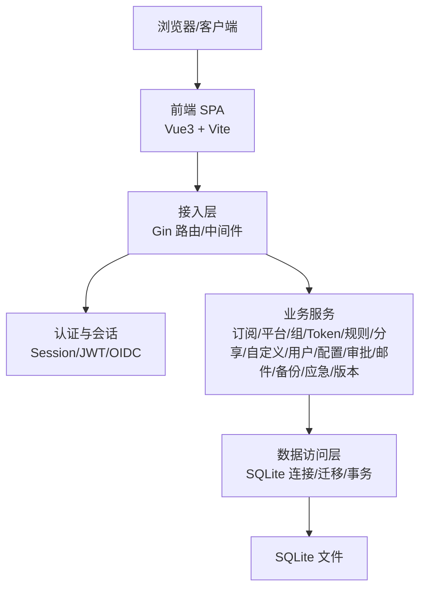
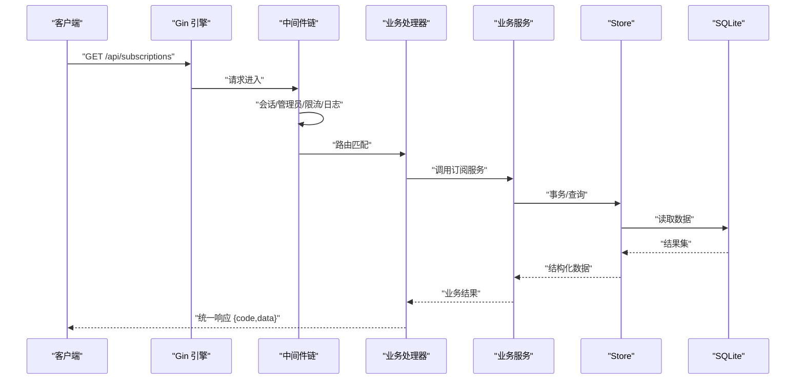
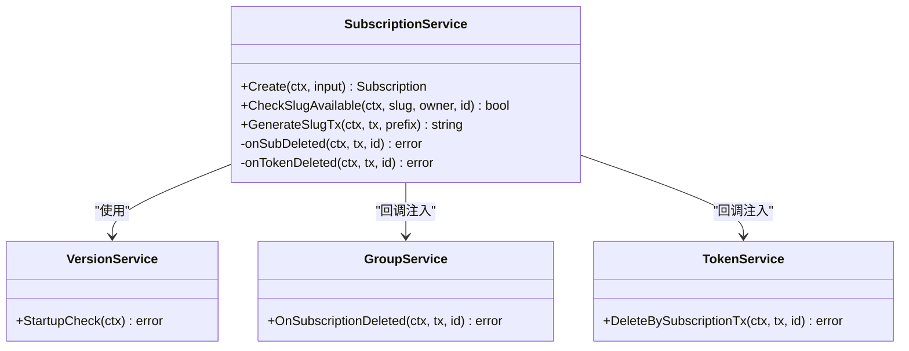
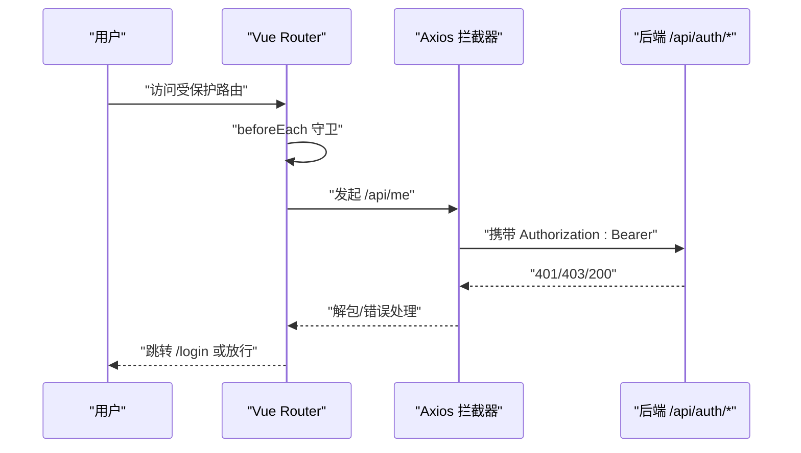
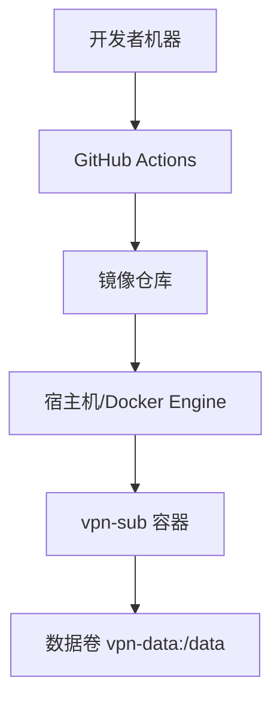
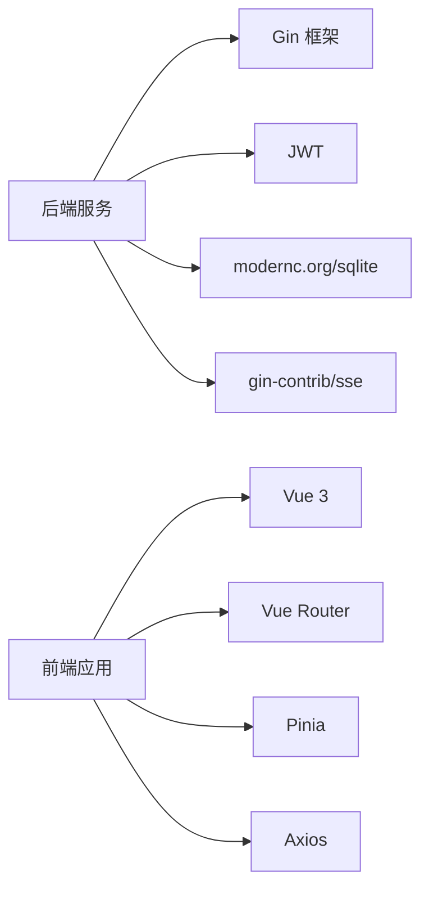
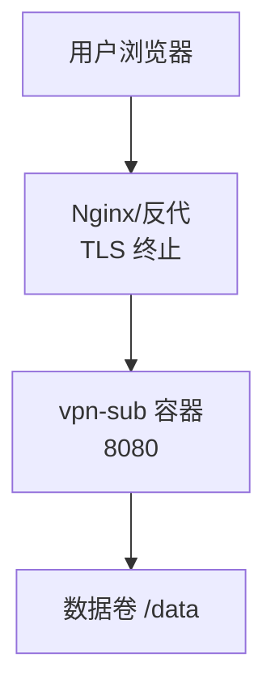

# 架构设计

<cite>
**本文引用的文件列表**
- [backend/cmd/server/main.go](file://backend/cmd/server/main.go)
- [backend/internal/server/server.go](file://backend/internal/server/server.go)
- [backend/internal/store/store.go](file://backend/internal/store/store.go)
- [backend/internal/subscription/subscription.go](file://backend/internal/subscription/subscription.go)
- [backend/migrations/0001_init.sql](file://backend/migrations/0001_init.sql)
- [frontend/src/main.ts](file://frontend/src/main.ts)
- [frontend/src/router/index.ts](file://frontend/src/router/index.ts)
- [frontend/src/api/request.ts](file://frontend/src/api/request.ts)
- [Dockerfile](file://Dockerfile)
- [docker-compose.yml](file://docker-compose.yml)
- [README.md](file://README.md)
</cite>

## 目录
1. [引言](#引言)
2. [项目结构](#项目结构)
3. [核心组件](#核心组件)
4. [架构总览](#架构总览)
5. [详细组件分析](#详细组件分析)
6. [依赖关系分析](#依赖关系分析)
7. [性能与可扩展性](#性能与可扩展性)
8. [故障排查指南](#故障排查指南)
9. [结论](#结论)
10. [附录](#附录)

## 引言
本系统为“VPN订阅管理系统”，采用前后端分离、单容器部署的轻量自托管方案。后端使用 Go + Gin，前端使用 Vue 3 + Vite，数据层基于嵌入式 SQLite（纯 Go 驱动，零 CGO），通过 Docker 多阶段构建将前端静态资源嵌入到后端二进制中，以单一进程对外提供 API 与 Web 页面。系统支持本地账号与 OIDC 双认证、用户组分发、版本化订阅管理、分享链接、规则配置、审批中心、面板配置与备份导出等能力，并提供应急模式保障在数据库损坏或关键配置异常时的可恢复性。

## 项目结构
- 后端（Go）：按功能域划分 internal 包（auth、user、subscription、platform、group、token、rule、share、custom、config、setup、oidc、mail、log、backup、emergency、version、store 等），HTTP 路由装配集中在 server 包，入口在 cmd/server/main.go。
- 前端（Vue）：src 下包含 api、components、layouts、router、stores、views 等；通过 Vite 构建产物由后端静态服务提供。
- 数据层：SQLite 文件存储，迁移脚本位于 migrations，启动时自动执行版本化迁移。
- 部署：Dockerfile 多阶段构建，docker-compose.yml 编排单容器运行，数据卷持久化 /data。

```mermaid
graph TB
subgraph "客户端"
Browser["浏览器"]
end
subgraph "容器内"
FE["前端静态资源<br/>Vite 构建产物"]
BE["后端 HTTP 服务<br/>Gin + 业务模块"]
DB["SQLite 文件<br/>/data/app-prod.db"]
end
Browser --> |HTTPS(可选)/HTTP| FE
Browser --> |/api/*| BE
BE --> DB
```

**图表来源**
- [Dockerfile:1-31](file://Dockerfile#L1-L31)
- [docker-compose.yml:1-28](file://docker-compose.yml#L1-L28)
- [backend/cmd/server/main.go:24-98](file://backend/cmd/server/main.go#L24-L98)

**章节来源**
- [backend/cmd/server/main.go:24-98](file://backend/cmd/server/main.go#L24-L98)
- [frontend/src/main.ts:1-11](file://frontend/src/main.ts#L1-L11)
- [Dockerfile:1-31](file://Dockerfile#L1-L31)
- [docker-compose.yml:1-28](file://docker-compose.yml#L1-L28)

## 核心组件
- 应用入口与生命周期：main.go 负责环境变量解析、日志初始化、数据库打开与迁移、应急模式检测、服务装配与优雅退出。
- HTTP 服务装配：server.New 集中注册各业务域路由与中间件（认证、限流、管理员校验、SSE 日志流等）。
- 数据访问层：store.Store 封装 SQLite 连接、WAL 模式、外键约束、迁移框架与事务工具（TxImmediate）。
- 业务域服务：subscription、platform、group、token、rule、share、custom、user、config、setup、oidc、mail、approval、backup、emergency、version 等。
- 前端应用：Vue 3 应用，Pinia 状态管理，Vue Router 路由守卫，Axios 统一请求封装与错误处理。
- 部署与运维：Docker 多阶段构建、健康检查、数据卷持久化、环境变量配置。

**章节来源**
- [backend/cmd/server/main.go:24-98](file://backend/cmd/server/main.go#L24-L98)
- [backend/internal/server/server.go:62-157](file://backend/internal/server/server.go#L62-L157)
- [backend/internal/store/store.go:31-164](file://backend/internal/store/store.go#L31-L164)
- [frontend/src/router/index.ts:96-128](file://frontend/src/router/index.ts#L96-L128)
- [frontend/src/api/request.ts:1-89](file://frontend/src/api/request.ts#L1-L89)

## 架构总览
系统采用分层与模块化结合的设计：
- 表现层：前端 SPA（Vue 3 + Vite），通过 Axios 调用后端 RESTful API；路由守卫实现登录态与管理员权限控制。
- 接入层：Gin HTTP 服务，统一响应格式、日志、恢复、限流、会话、管理员鉴权等横切关注点。
- 业务逻辑层：按领域划分的 Service（如 subscription、platform、group、token、rule、share、custom、user、config、setup、oidc、mail、approval、backup、emergency、version），通过构造函数注入依赖，避免全局状态。
- 数据访问层：store.Store 提供 SQLite 连接、迁移、事务与基础查询封装；migrations 目录维护版本化 SQL 变更。



**图表来源**
- [backend/internal/server/server.go:62-157](file://backend/internal/server/server.go#L62-L157)
- [backend/internal/store/store.go:31-164](file://backend/internal/store/store.go#L31-L164)
- [frontend/src/router/index.ts:96-128](file://frontend/src/router/index.ts#L96-L128)
- [frontend/src/api/request.ts:1-89](file://frontend/src/api/request.ts#L1-L89)

## 详细组件分析

### 后端服务装配与路由组织
- 服务构造：server.New 组装 Gin Engine，注册健康检查、请求日志、panic 恢复、信任代理策略，并依次装配认证、Setup、OIDC、平台、订阅、用户组、Token、下载、首页、自定义、分享、规则、个人中心、用户管理、审批、配置、运维操作、日志查看等路由。
- 中间件与横切：会话中间件、管理员中间件、限流器、验证码、SSE 实时日志流、紧急模式门控等。
- 回调注入：订阅删除级联回调（清选定、置 needs_reselect）、Token 删除级联清理，避免循环依赖。
- 应急模式：NewEmergency 仅注册系统状态、站点信息、应急端点与静态资源，业务 API 与下载返回 503，/health 返回 503。



**图表来源**
- [backend/internal/server/server.go:62-157](file://backend/internal/server/server.go#L62-L157)
- [backend/internal/store/store.go:147-164](file://backend/internal/store/store.go#L147-L164)

**章节来源**
- [backend/internal/server/server.go:62-157](file://backend/internal/server/server.go#L62-L157)
- [backend/internal/server/server.go:160-193](file://backend/internal/server/server.go#L160-L193)

### 数据访问层与迁移机制
- 连接与并发：WAL 模式、外键开启、busy_timeout 设置、最大连接数 1（单写者模型），避免 SQLite 并发写冲突。
- 迁移框架：按文件名 NNNN_name.sql 顺序执行未应用迁移，每条迁移与其版本记录在同一事务写入，失败即拒绝启动；数据库版本高于代码支持版本时拒绝启动，防止降级风险。
- 事务工具：TxImmediate 以 BEGIN IMMEDIATE 开启事务，适用于先读后写的场景，保证串行化。


**图表来源**
- [backend/internal/store/store.go:31-164](file://backend/internal/store/store.go#L31-L164)
- [backend/migrations/0001_init.sql:1-13](file://backend/migrations/0001_init.sql#L1-L13)

**章节来源**
- [backend/internal/store/store.go:31-164](file://backend/internal/store/store.go#L31-L164)
- [backend/migrations/0001_init.sql:1-13](file://backend/migrations/0001_init.sql#L1-L13)

### 订阅管理与版本化
- 订阅池服务：提供 CRUD、四类资源全局唯一标识校验与自动生成、级联删除回调（与 group、token 协作）。
- 版本化：每份订阅保留历史版本，支持预览、切换、回滚；版本指针启动自检确保 symlink 与 DB 一致。
- 数据一致性：创建/更新/删除均在事务中进行，跨表查重与生成短码在事务内完成。



**图表来源**
- [backend/internal/subscription/subscription.go:28-51](file://backend/internal/subscription/subscription.go#L28-L51)
- [backend/internal/subscription/subscription.go:86-163](file://backend/internal/subscription/subscription.go#L86-L163)

**章节来源**
- [backend/internal/subscription/subscription.go:28-200](file://backend/internal/subscription/subscription.go#L28-L200)

### 前端路由与认证流程
- 路由守卫：按顺序判断 emergency → configured → 登录态 → 管理员角色；公共路由白名单、懒加载与进度条。
- 请求封装：Axios 实例统一 baseURL=/api，自动注入 Bearer token，拦截 401 跳转登录，统一错误映射与提示。
- 状态管理：Pinia stores（auth、system）管理登录态与系统状态。



**图表来源**
- [frontend/src/router/index.ts:96-128](file://frontend/src/router/index.ts#L96-L128)
- [frontend/src/api/request.ts:1-89](file://frontend/src/api/request.ts#L1-L89)

**章节来源**
- [frontend/src/router/index.ts:1-132](file://frontend/src/router/index.ts#L1-L132)
- [frontend/src/api/request.ts:1-89](file://frontend/src/api/request.ts#L1-L89)

### 部署拓扑与环境
- 多阶段构建：Node 构建前端，Go 编译后端并将前端 dist 嵌入，最终最小镜像运行非 root 用户。
- 数据持久化：/data 卷承载数据库与内容文件；端口 8080 暴露；健康检查探测 /health。
- 环境变量：APP_MODE、LOG_LEVEL、LOG_FORMAT、PORT、TRUST_PROXY、RESET_ADMIN_PASSWORD 等。



**图表来源**
- [Dockerfile:1-31](file://Dockerfile#L1-L31)
- [docker-compose.yml:1-28](file://docker-compose.yml#L1-L28)
- [README.md:221-227](file://README.md#L221-L227)

**章节来源**
- [Dockerfile:1-31](file://Dockerfile#L1-L31)
- [docker-compose.yml:1-28](file://docker-compose.yml#L1-L28)
- [README.md:221-227](file://README.md#L221-L227)

## 依赖关系分析
- 后端依赖：Gin（HTTP 框架）、golang-jwt（JWT）、modernc.org/sqlite（纯 Go SQLite 驱动）、gin-contrib/sse（SSE 日志流）等。
- 前端依赖：Vue 3、Vue Router、Pinia、Ant Design Vue、Tailwind CSS、Vite、Axios。
- 耦合与内聚：
  - 高内聚：每个 internal 包职责清晰，Service 通过构造函数注入依赖，避免全局变量。
  - 低耦合：回调注入（订阅删除级联）避免循环依赖；Store 抽象数据访问，便于替换或扩展。
  - 外部依赖：SQLite 单写者模型限制并发写，适合轻量场景；如需更高并发可考虑迁移至独立数据库（需评估迁移成本与一致性）。



**图表来源**
- [backend/go.mod:1-50](file://backend/go.mod#L1-L50)
- [frontend/package.json:1-37](file://frontend/package.json#L1-L37)

**章节来源**
- [backend/go.mod:1-50](file://backend/go.mod#L1-L50)
- [frontend/package.json:1-37](file://frontend/package.json#L1-L37)

## 性能与可扩展性
- 数据库性能：WAL 模式提升读性能，单写者模型避免写竞争；busy_timeout 降低忙等待失败概率。对于高并发写场景，建议评估引入独立数据库或读写分离。
- 缓存与限流：内置 ratelimit 限流器，可按需扩展 Redis 等外部缓存；SSE 日志流限制连接数与短期 Token，避免资源滥用。
- 构建优化：CGO_ENABLED=0 静态编译，减小镜像体积；前端按需懒加载路由，减少首屏体积。
- 可扩展方向：
  - 数据层：抽象 Store 接口，便于替换为 PostgreSQL/MySQL。
  - 认证：OIDC 已支持，可对接更多 IdP。
  - 消息与任务：引入队列处理耗时任务（如批量导入、邮件发送重试）。

[本节为通用指导，不直接分析具体文件]

## 故障排查指南
- 启动失败：
  - 数据库损坏或迁移失败：自动进入应急模式，提供系统状态与应急端点；查看日志定位原因。
  - 环境变量错误：检查 APP_MODE、PORT、TRUST_PROXY 等。
- 认证问题：
  - 401 自动跳转登录：检查 token 是否过期或丢失；确认后端会话与前端拦截器配置。
  - OIDC 回调失败：确认公网 HTTPS 域名与回调地址配置。
- 订阅无法导入：
  - 检查平台与用户组分配；确认订阅版本有效且未被删除。
- 备份与恢复：
  - 使用面板“备份下载”获取 tar.gz 快照；升级不影响数据卷。
- 应急恢复：
  - 设置 RESET_ADMIN_PASSWORD 并重启容器，按日志中的操作码重置管理员密码。

**章节来源**
- [backend/cmd/server/main.go:40-75](file://backend/cmd/server/main.go#L40-L75)
- [backend/internal/server/server.go:160-193](file://backend/internal/server/server.go#L160-L193)
- [docker-compose.yml:19-24](file://docker-compose.yml#L19-L24)
- [README.md:205-218](file://README.md#L205-L218)

## 结论
本系统以“单容器、前后端一体、SQLite 嵌入式”为核心设计理念，兼顾易用性与可维护性。通过分层与模块化设计，业务域清晰、依赖注入明确、迁移与事务可控；前端路由守卫与统一请求封装提升了用户体验与健壮性。Docker 多阶段构建与非 root 运行保障了安全与便携。未来可根据规模需求演进数据层与缓存层，同时保持现有 API 稳定。

[本节为总结，不直接分析具体文件]

## 附录
- 技术栈选择理由与权衡：
  - Go 后端：高性能、静态编译、生态成熟；Gin 简洁高效；JWT 与 OIDC 支持完善。
  - Vue 前端：生态丰富、开发体验好；Vite 构建快；Ant Design Vue 提供企业级 UI。
  - SQLite：零依赖、易部署、适合中小规模；WAL 与单写者模型平衡读写性能。
  - Docker：一键部署、环境隔离、数据卷持久化；多阶段构建优化镜像大小。
- 部署拓扑图（含反向代理）：



**图表来源**
- [README.md:167-192](file://README.md#L167-L192)
- [docker-compose.yml:5-17](file://docker-compose.yml#L5-L17)

**章节来源**
- [README.md:167-227](file://README.md#L167-L227)
- [docker-compose.yml:5-17](file://docker-compose.yml#L5-L17)