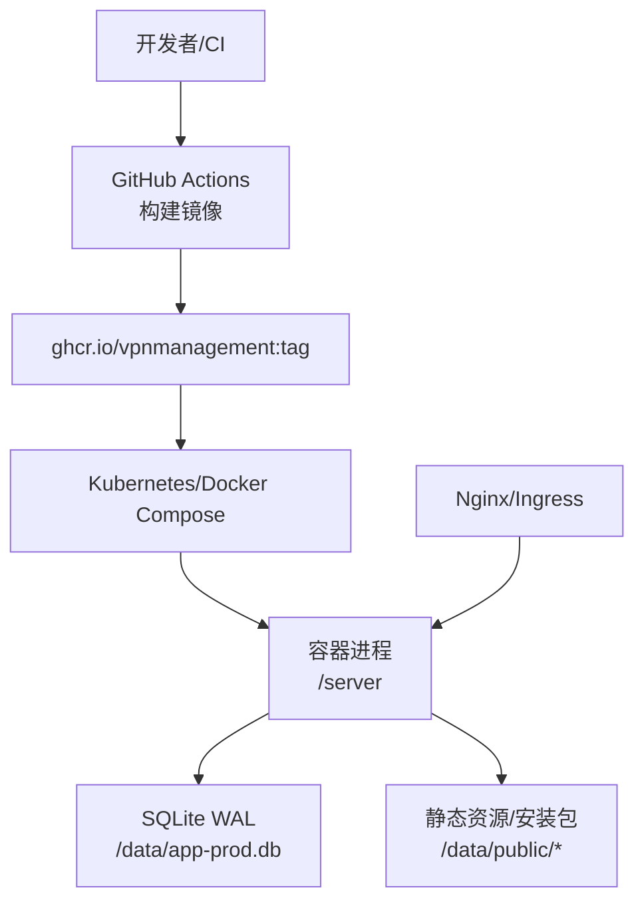
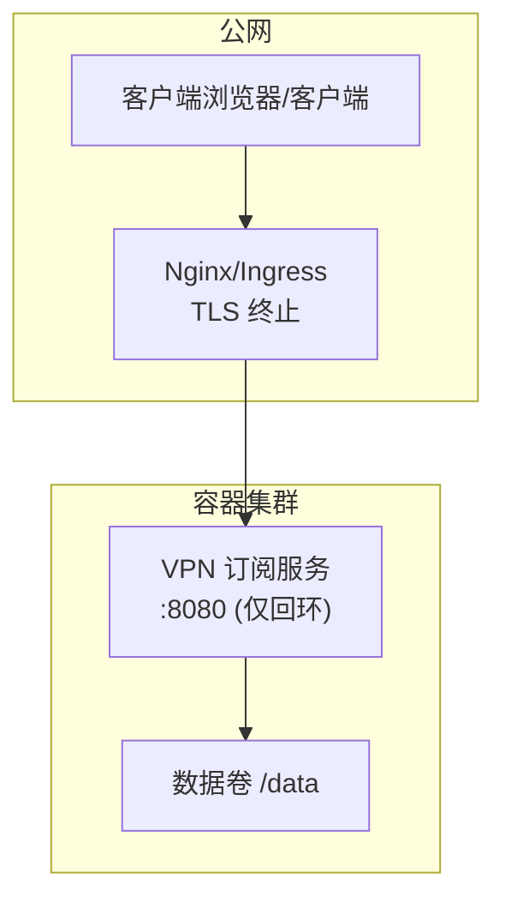
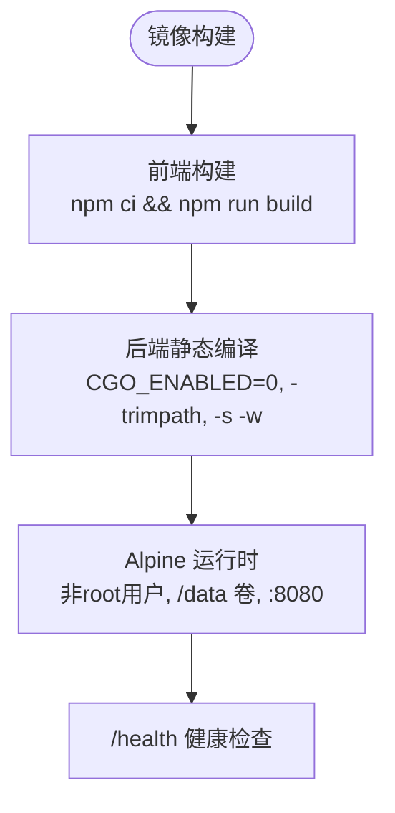
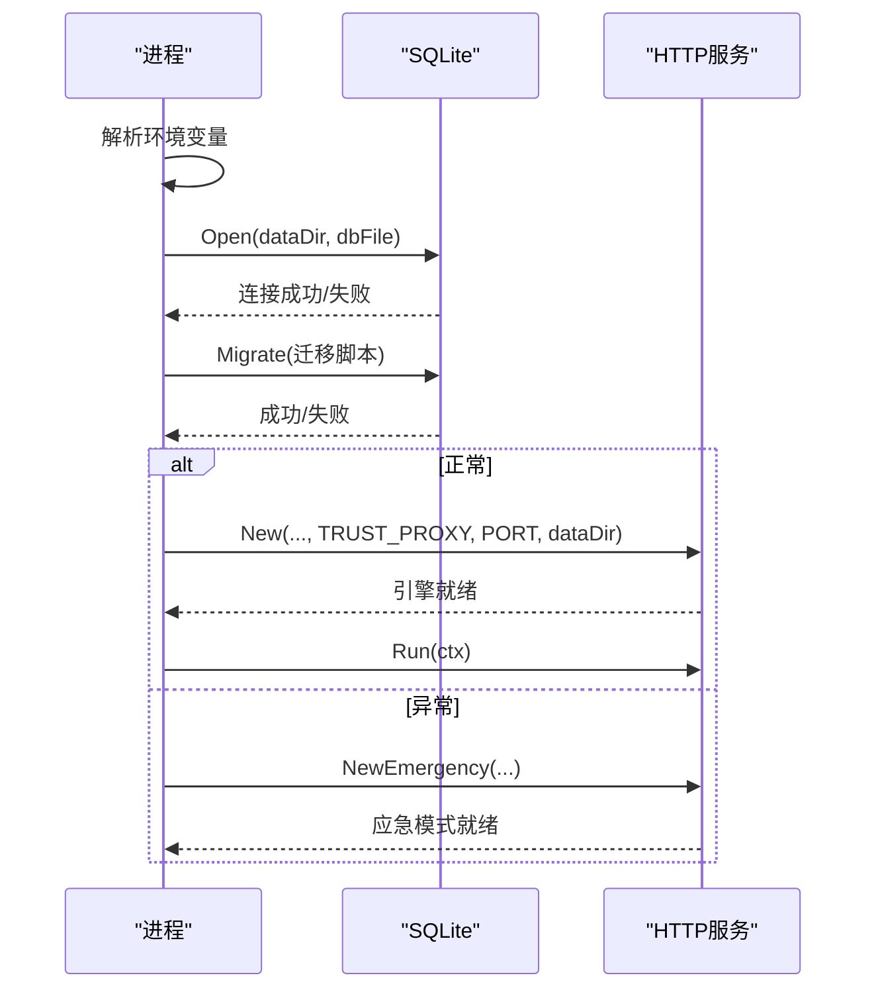
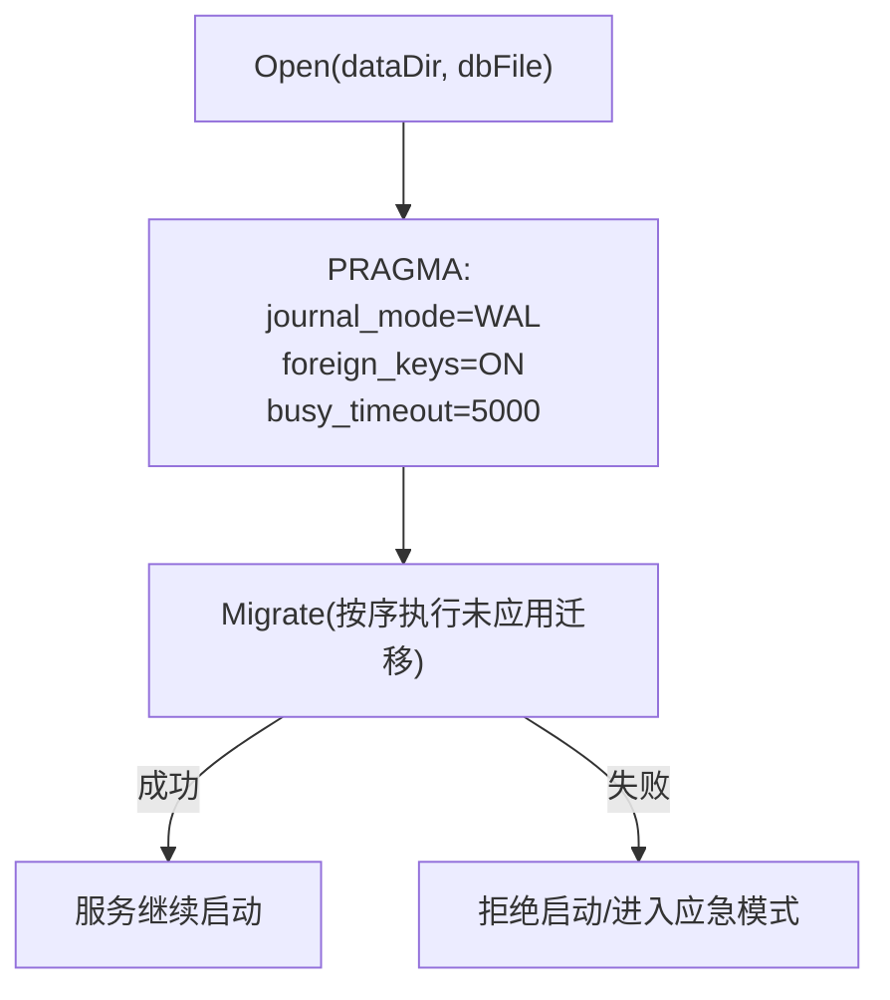
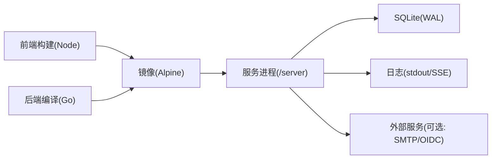

# 部署架构设计

<cite>
**本文引用的文件**
- [Dockerfile](file://Dockerfile)
- [docker-compose.yml](file://docker-compose.yml)
- [docker-compose.yml.example](file://docker-compose.yml.example)
- [.github/workflows/docker-build.yml](file://.github/workflows/docker-build.yml)
- [backend/cmd/server/main.go](file://backend/cmd/server/main.go)
- [backend/internal/server/server.go](file://backend/internal/server/server.go)
- [backend/internal/store/store.go](file://backend/internal/store/store.go)
- [backend/internal/config/config.go](file://backend/internal/config/config.go)
- [README.md](file://README.md)
</cite>

## 目录
1. [简介](#简介)
2. [项目结构](#项目结构)
3. [核心组件](#核心组件)
4. [架构总览](#架构总览)
5. [详细组件分析](#详细组件分析)
6. [依赖关系分析](#依赖关系分析)
7. [性能与容量规划](#性能与容量规划)
8. [监控与告警方案](#监控与告警方案)
9. [日志收集策略](#日志收集策略)
10. [弹性扩展与高可用](#弹性扩展与高可用)
11. [灾难恢复与备份](#灾难恢复与备份)
12. [故障排查指南](#故障排查指南)
13. [结论](#结论)

## 简介
本部署架构设计文档面向生产环境，围绕容器化镜像构建、编排配置、环境变量治理、数据持久化、网络拓扑、监控告警、日志采集、弹性扩展、高可用与灾难恢复等主题，给出可落地的实施方案与最佳实践。系统采用单二进制（Go）+ 嵌入式前端资源，通过多阶段 Docker 构建产物最小运行时镜像；数据库为 SQLite（WAL 模式），所有数据统一持久化到单一数据卷；支持外部反向代理承载 TLS 与域名接入；提供健康检查端点与应急恢复能力。

## 项目结构
- 容器镜像：基于 Alpine 的最小运行时，非 root 用户运行，暴露 8080 端口，数据卷挂载至 /data。
- 编排：提供开发用 docker-compose.yml 与生产模板 docker-compose.yml.example，支持两种接入方式（回环绑定 + 反代，或内网直连）。
- CI/CD：GitHub Actions 在打 v* 标签时自动构建并推送 ghcr.io 镜像，支持 latest 与 sha 标签。
- 应用入口：main.go 负责环境变量解析、日志初始化、数据库迁移、路由装配、优雅退出与应急模式切换。

图表来源
- [Dockerfile:1-31](file://Dockerfile#L1-L31)
- [docker-compose.yml:1-28](file://docker-compose.yml#L1-L28)
- [docker-compose.yml.example:1-41](file://docker-compose.yml.example#L1-L41)
- [.github/workflows/docker-build.yml:1-53](file://.github/workflows/docker-build.yml#L1-L53)
- [backend/cmd/server/main.go:24-98](file://backend/cmd/server/main.go#L24-L98)

章节来源
- [Dockerfile:1-31](file://Dockerfile#L1-L31)
- [docker-compose.yml:1-28](file://docker-compose.yml#L1-L28)
- [docker-compose.yml.example:1-41](file://docker-compose.yml.example#L1-L41)
- [.github/workflows/docker-build.yml:1-53](file://.github/workflows/docker-build.yml#L1-L53)
- [backend/cmd/server/main.go:24-98](file://backend/cmd/server/main.go#L24-L98)

## 核心组件
- 镜像构建：Node 前端构建 → Go 后端静态编译（CGO_ENABLED=0）→ Alpine 最小运行时。
- 服务装配：Gin HTTP 服务，注册健康检查、业务路由、静态资源、限流、SSE 日志流等。
- 数据存储：SQLite 单写者模型，WAL 模式，外键开启，busy_timeout 防阻塞；版本化迁移框架保证启动一致性。
- 配置管理：system_config 表承载全部配置，敏感字段 AES-256-GCM 加密存储，签名密钥由 Setup 生成。
- 运维能力：访问日志保留 90 天自动清理；实时日志 SSE；一键清空/导入导出/备份下载；应急恢复模式。

章节来源
- [backend/internal/server/server.go:63-157](file://backend/internal/server/server.go#L63-L157)
- [backend/internal/store/store.go:31-128](file://backend/internal/store/store.go#L31-L128)
- [backend/internal/config/config.go:24-111](file://backend/internal/config/config.go#L24-L111)
- [backend/cmd/server/main.go:24-98](file://backend/cmd/server/main.go#L24-L98)

## 架构总览
生产部署推荐“外部反代 + 容器”的拓扑：Nginx/Ingress 处理 TLS 终止与域名路由，将流量转发至容器的 8080 端口；容器内部仅监听回环地址，避免直接暴露明文服务。数据与内容统一持久化到 /data 卷，便于备份与迁移。

图表来源
- [docker-compose.yml.example:11-18](file://docker-compose.yml.example#L11-L18)
- [backend/internal/server/server.go:197-209](file://backend/internal/server/server.go#L197-L209)

## 详细组件分析

### 容器镜像与运行时
- 多阶段构建：前端使用 Node 构建静态资源；后端使用 Go 静态编译，嵌入前端产物；最终镜像仅包含二进制与必要运行时库。
- 安全基线：非 root 用户运行，最小攻击面；VOLUME 声明 /data；EXPOSE 8080。
- 健康检查：/health 返回状态，用于编排层存活探测。

图表来源
- [Dockerfile:1-31](file://Dockerfile#L1-L31)
- [docker-compose.yml:19-24](file://docker-compose.yml#L19-L24)

章节来源
- [Dockerfile:1-31](file://Dockerfile#L1-L31)
- [docker-compose.yml:19-24](file://docker-compose.yml#L19-L24)

### 服务启动与生命周期
- 环境变量：APP_MODE、LOG_LEVEL、LOG_FORMAT、PORT、TRUST_PROXY、DATA_DIR、RESET_ADMIN_PASSWORD。
- 启动流程：解析环境变量 → 初始化日志 → 打开数据库 → 执行迁移 → 检测应急条件 → 装配路由 → 启动 HTTP 服务 → 信号驱动优雅退出。
- 应急模式：当数据库损坏或迁移失败时，进入应急模式，仅开放系统状态、站点信息、应急端点与静态资源，业务 API 返回 503。

图表来源
- [backend/cmd/server/main.go:24-98](file://backend/cmd/server/main.go#L24-L98)
- [backend/internal/server/server.go:160-193](file://backend/internal/server/server.go#L160-L193)

章节来源
- [backend/cmd/server/main.go:24-98](file://backend/cmd/server/main.go#L24-L98)
- [backend/internal/server/server.go:160-193](file://backend/internal/server/server.go#L160-L193)

### 数据存储与迁移
- 单写者模型：SetMaxOpenConns(1)，配合 busy_timeout 降低并发写冲突。
- WAL 模式：提升读性能与并发读取稳定性。
- 迁移框架：按版本号顺序执行未应用的 SQL，任一失败拒绝启动；数据库版本高于代码支持版本时拒绝启动，防止降级风险。

图表来源
- [backend/internal/store/store.go:31-52](file://backend/internal/store/store.go#L31-L52)
- [backend/internal/store/store.go:62-128](file://backend/internal/store/store.go#L62-L128)

章节来源
- [backend/internal/store/store.go:31-128](file://backend/internal/store/store.go#L31-L128)

### 配置与安全
- 配置存储：system_config 表承载全部配置；敏感字段以 AES-256-GCM 加密存储，密钥由签名密钥派生。
- 签名密钥：Setup 时生成并明文落库，用于派生配置加密密钥。
- 可信代理：TRUST_PROXY=auto/on/off 控制 X-Forwarded-* 信任策略，生产建议 auto 或 on（经反代场景）。

章节来源
- [backend/internal/config/config.go:24-111](file://backend/internal/config/config.go#L24-L111)
- [backend/internal/server/server.go:197-209](file://backend/internal/server/server.go#L197-L209)

### 网络与接入
- 公网部署：容器端口仅绑定 127.0.0.1:8080，由 Nginx/Ingress 承担 TLS 与域名接入，设置 Host/X-Forwarded-For/X-Forwarded-Proto。
- 内网直连：可直接暴露 8080，但注意 HTTP 明文风险，仅限可信内网。

章节来源
- [docker-compose.yml.example:11-18](file://docker-compose.yml.example#L11-L18)
- [README.md:167-192](file://README.md#L167-L192)

## 依赖关系分析
- 容器镜像依赖：Node（前端）、Go（后端）、Alpine（运行时）。
- 服务依赖：Gin（HTTP）、SQLite（纯 Go 驱动）、log/slog（结构化日志）。
- 编排依赖：Docker Compose/Kubernetes 提供进程管理、健康检查、数据卷挂载。
- 外部依赖：可选 Nginx/Ingress（TLS 终止）、SMTP（邮件）、OIDC 提供方（认证）。

图表来源
- [Dockerfile:1-31](file://Dockerfile#L1-L31)
- [backend/cmd/server/main.go:24-98](file://backend/cmd/server/main.go#L24-L98)

章节来源
- [Dockerfile:1-31](file://Dockerfile#L1-L31)
- [backend/cmd/server/main.go:24-98](file://backend/cmd/server/main.go#L24-L98)

## 性能与容量规划
- 数据库：SQLite 单写者模型适合中小规模；WAL 提升读性能；busy_timeout 降低锁竞争。
- 内存/CPU：Go 静态编译二进制内存占用低；前端静态资源已嵌入，减少 I/O。
- 磁盘：/data 卷承载数据库与内容文件；安装包与版本文件需预留足够空间。
- 网络：建议通过反代进行 TLS 卸载与缓存；合理设置请求体大小限制与超时。

[本节为通用指导，不直接分析具体文件]

## 监控与告警方案
- 健康检查：/health 端点用于编排层存活探测；应急模式下返回 503。
- 指标采集：可在 Nginx/Ingress 层采集 QPS、延迟、错误率；应用层可通过自定义指标端点扩展（当前未内置 Prometheus 指标）。
- 告警策略：基于编排层健康检查失败、反代错误率阈值、日志关键字（如 panic、数据库错误）触发告警。

章节来源
- [docker-compose.yml:19-24](file://docker-compose.yml#L19-L24)
- [backend/internal/server/server.go:160-193](file://backend/internal/server/server.go#L160-L193)

## 日志收集策略
- 输出格式：LOG_FORMAT=console/json；生产建议 json，便于集中采集。
- 日志级别：LOG_LEVEL 支持 debug/info/warn/error；面板可运行时切换并持久化。
- 访问日志：记录方法、路径、状态码、耗时；路径中 token 参数脱敏。
- 实时日志：SSE 流式输出最近 500 条日志，支持短期 Token 与连接上限保护。
- 采集方案：stdout 管道至 journald/Fluent Bit/Filebeat 等，再汇聚至 ELK/Loki。

章节来源
- [backend/cmd/server/main.go:24-37](file://backend/cmd/server/main.go#L24-L37)
- [backend/internal/server/server.go:211-223](file://backend/internal/server/server.go#L211-L223)
- [docker-compose.yml.example:19-27](file://docker-compose.yml.example#L19-L27)

## 弹性扩展与高可用
- 水平扩展：由于 SQLite 单写者模型，不建议多实例共享同一数据库文件；可采用多实例 + 独立数据卷 + 负载均衡分发不同租户或区域。
- 会话与凭据：JWT 会话与凭据版本机制确保登出/重置后失效；无状态服务利于横向扩展。
- 高可用：结合编排层的滚动更新、健康检查、重启策略（restart: unless-stopped）保障可用性；外部反代提供故障转移。

章节来源
- [backend/internal/store/store.go:31-52](file://backend/internal/store/store.go#L31-L52)
- [docker-compose.yml:12-18](file://docker-compose.yml#L12-L18)

## 灾难恢复与备份
- 数据备份：面板提供“备份下载”，包含数据库一致性快照与全部文件；也可对 /data 卷进行定期快照。
- 恢复流程：停止服务 → 替换 /data 卷 → 启动服务 → 验证迁移与健康检查。
- 应急恢复：支持 RESET_ADMIN_PASSWORD 环境变量进入应急模式，重置管理员密码；操作完成后移除变量并重启恢复正常服务。

章节来源
- [README.md:133-146](file://README.md#L133-L146)
- [README.md:205-213](file://README.md#L205-L213)
- [docker-compose.yml.example:28-30](file://docker-compose.yml.example#L28-L30)

## 故障排查指南
- 启动失败：检查数据库迁移日志与错误；确认 /data 权限与空间。
- 健康检查失败：查看 /health 响应；应急模式下预期返回 503。
- 登录/认证问题：检查 TRUST_PROXY 配置与反代头设置；确认 OIDC 回调 URL 与 HTTPS 域名。
- 日志问题：确认 LOG_FORMAT 与采集链路；使用面板“日志查看”定位问题。

章节来源
- [backend/cmd/server/main.go:40-59](file://backend/cmd/server/main.go#L40-L59)
- [backend/internal/server/server.go:160-193](file://backend/internal/server/server.go#L160-L193)
- [README.md:194-213](file://README.md#L194-L213)

## 结论
本部署架构以“单容器 + 外部反代”为核心，结合 SQLite WAL 与版本化迁移，提供稳定、可移植的生产部署方案。通过环境变量治理、数据卷持久化、健康检查与应急恢复，满足中小规模团队的高效运维需求。生产环境建议采用 Nginx/Ingress 承载 TLS，启用 JSON 日志与集中采集，并结合编排层实现滚动更新与故障自愈。对于更高可用与水平扩展需求，可考虑多实例隔离数据卷与区域化部署。