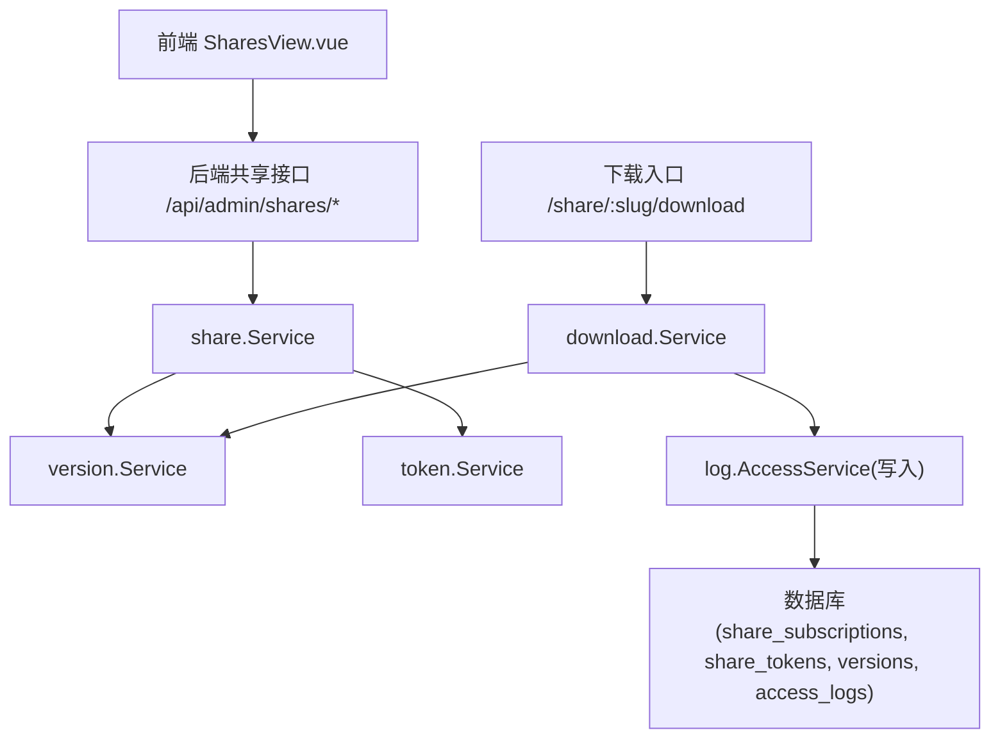
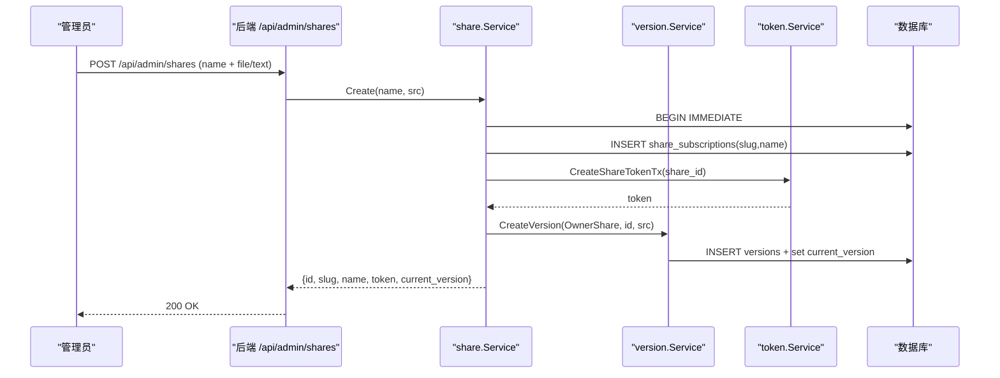
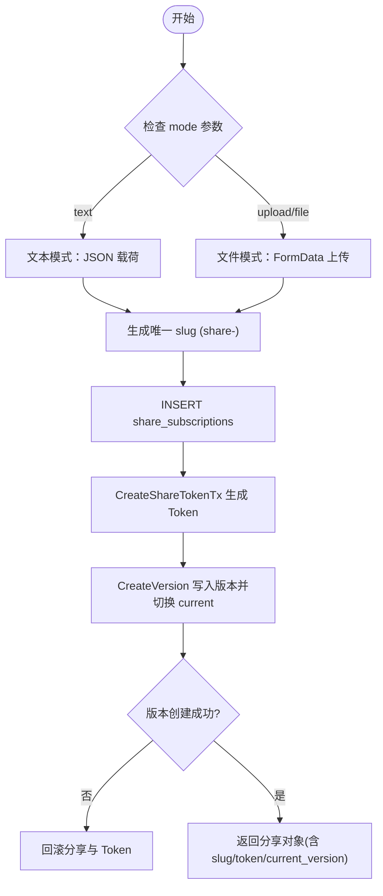
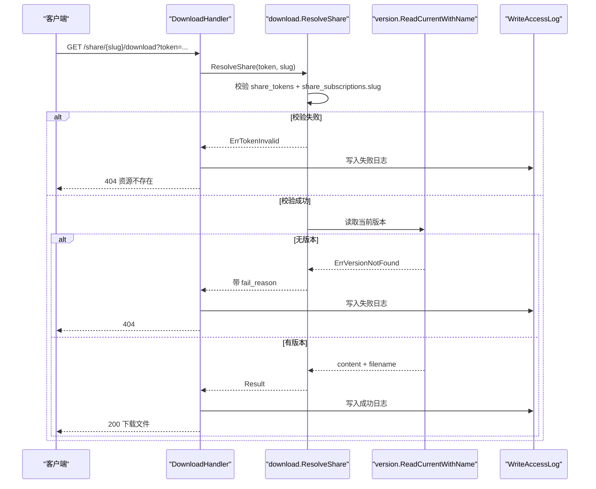
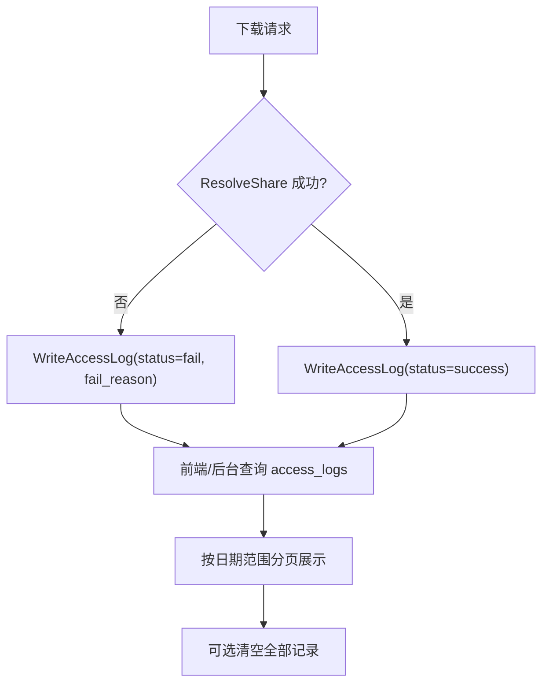
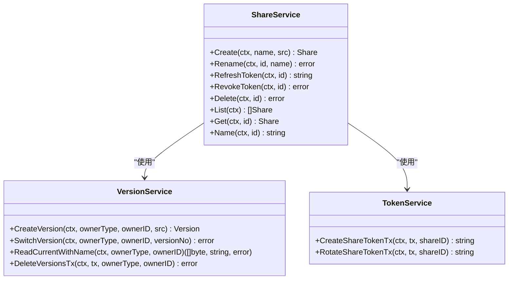
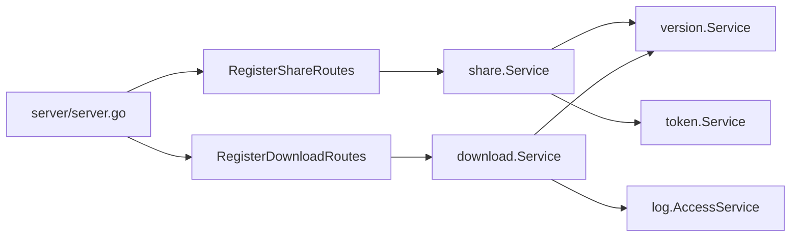

# 分享系统

<cite>
**本文引用的文件**
- [backend/internal/share/share.go](file://backend/internal/share/share.go)
- [backend/internal/server/share.go](file://backend/internal/server/share.go)
- [backend/internal/download/download.go](file://backend/internal/download/download.go)
- [backend/internal/server/download.go](file://backend/internal/server/download.go)
- [backend/internal/token/token.go](file://backend/internal/token/token.go)
- [backend/internal/version/version.go](file://backend/internal/version/version.go)
- [backend/migrations/1005_custom_share.sql](file://backend/migrations/1005_custom_share.sql)
- [backend/migrations/1004_tokens.sql](file://backend/migrations/1004_tokens.sql)
- [frontend/src/api/share.ts](file://frontend/src/api/share.ts)
- [frontend/src/views/admin/SharesView.vue](file://frontend/src/views/admin/SharesView.vue)
- [backend/internal/log/access.go](file://backend/internal/log/access.go)
- [backend/internal/server/server.go](file://backend/internal/server/server.go)
</cite>

## 更新摘要
**所做更改**
- 更新了分享链接生成机制部分，增加了双模式创建支持的详细说明
- 新增了智能载荷检测和文本模式创建的完整实现说明
- 更新了API调用示例，包含文本模式的创建方法
- 改进了前端交互流程的文档说明
- 增强了用户体验和错误处理的描述

## 目录
1. [简介](#简介)
2. [项目结构](#项目结构)
3. [核心组件](#核心组件)
4. [架构总览](#架构总览)
5. [详细组件分析](#详细组件分析)
6. [依赖关系分析](#依赖关系分析)
7. [性能与扩展性](#性能与扩展性)
8. [故障排查指南](#故障排查指南)
9. [结论](#结论)
10. [附录：API 调用示例](#附录api-调用示例)

## 简介
本文件系统聚焦"分享订阅"能力，覆盖以下目标：
- 分享链接生成机制：如何创建分享、生成唯一 slug 与 Token、首版本上传或文本内容。
- 权限控制原理：Token 校验、slug 绑定、吊销与刷新策略、下载时的资源归属验证。
- 访问统计收集与分析：下载成功/失败记录、资源标识口径、按日期分页查询与清空。
- 生命周期管理：创建、改名、版本切换、删除、Token 刷新/吊销、过期处理（通过吊销实现）。
- API 使用示例：前端与管理端如何创建分享、设置权限、查看访问统计。
- 安全策略与防滥用：Token 强度、并发安全、大小限制、表缺失降级、文件名清洗等。

**新增功能**：系统现已支持双模式创建，包括智能载荷检测和文本模式创建功能。前端通过 `?mode=text` 查询参数智能区分文件上传和文本创建工作流，显著改善了用户体验并防止后端错误。

## 项目结构
分享系统由后端服务层、接入层、存储迁移、前端页面与日志模块组成：
- 业务层：share.Service 负责分享的创建、改名、删除、Token 刷新/吊销、列表与详情。
- 接入层：server/share.go 注册 /api/admin/shares/* 路由；server/download.go 提供公开下载入口 /share/{slug}/download?token=。
- 数据层：migrations 定义 share_subscriptions、share_tokens 等表；version.Service 管理版本文件与当前指针。
- 下载解析：download.ResolveShare 完成 Token 校验、资源读取与访问日志写入。
- 前端：SharesView.vue 提供创建、复制链接、版本管理、Token 操作；share.ts 封装 API。
- 日志：access.go 提供访问日志查询与清空；download.WriteAccessLog 统一写入。

**图表来源**
- [backend/internal/server/share.go:20-36](file://backend/internal/server/share.go#L20-L36)
- [backend/internal/server/download.go:71-98](file://backend/internal/server/download.go#L71-L98)
- [backend/internal/share/share.go:47-83](file://backend/internal/share/share.go#L47-L83)
- [backend/internal/download/download.go:198-225](file://backend/internal/download/download.go#L198-L225)
- [backend/internal/log/access.go:41-92](file://backend/internal/log/access.go#L41-L92)

**章节来源**
- [backend/internal/server/share.go:20-36](file://backend/internal/server/share.go#L20-L36)
- [backend/internal/server/download.go:71-98](file://backend/internal/server/download.go#L71-L98)
- [backend/internal/share/share.go:47-83](file://backend/internal/share/share.go#L47-L83)
- [backend/internal/download/download.go:198-225](file://backend/internal/download/download.go#L198-L225)
- [backend/internal/log/access.go:41-92](file://backend/internal/log/access.go#L41-L92)

## 核心组件
- 分享服务 share.Service
  - 创建分享：生成唯一 slug（share-前缀），插入 share_subscriptions，事务内创建 share_tokens，并创建首个版本。
  - 改名：仅更新名称，不改变 slug。
  - 删除：级联删除 Token、版本记录与文件目录。
  - Token 刷新：物理轮替旧 Token 为新值，同时恢复 active 状态。
  - Token 吊销：物理删除 Token 记录并将状态置为 revoked，链接立即失效。
  - 列表/详情：active 时返回 token，revoked 时隐藏 token。
- 版本服务 version.Service
  - 版本创建：在事务中写文件、写版本记录、切换 current_version、驱逐最旧版本（上限 5）。
  - 切换版本：原子替换 symlink 并更新 DB。
  - 读取当前版本：以 DB 为准，读取对应版本文件与原始文件名。
- 下载服务 download.Service
  - ResolveShare：校验 token + slug 一致性，读取当前版本，构造下载结果与访问日志条目。
  - WriteAccessLog：统一写入访问日志，记录类型、平台、资源标识、状态与失败原因。
- Token 服务 token.Service
  - CreateShareTokenTx/RotateShareTokenTx：在事务中创建或轮替分享 Token。
- 日志服务 log.AccessService
  - Query/Clear：按日期范围分页查询访问日志，支持清空。

**章节来源**
- [backend/internal/share/share.go:47-233](file://backend/internal/share/share.go#L47-L233)
- [backend/internal/version/version.go:125-245](file://backend/internal/version/version.go#L125-L245)
- [backend/internal/download/download.go:198-302](file://backend/internal/download/download.go#L198-L302)
- [backend/internal/token/token.go:176-195](file://backend/internal/token/token.go#L176-L195)
- [backend/internal/log/access.go:41-100](file://backend/internal/log/access.go#L41-L100)

## 架构总览
分享系统的请求流分为两类：
- 管理端 API：用于创建、管理分享与版本，受会话+管理员中间件保护。
- 公开下载：/share/{slug}/download?token=，无需登录，但需有效 Token 且 slug 匹配。

**图表来源**
- [backend/internal/server/share.go:47-91](file://backend/internal/server/share.go#L47-L91)
- [backend/internal/share/share.go:47-83](file://backend/internal/share/share.go#L47-L83)
- [backend/internal/version/version.go:125-180](file://backend/internal/version/version.go#L125-L180)
- [backend/internal/token/token.go:176-187](file://backend/internal/token/token.go#L176-L187)

**章节来源**
- [backend/internal/server/share.go:47-91](file://backend/internal/server/share.go#L47-L91)
- [backend/internal/share/share.go:47-83](file://backend/internal/share/share.go#L47-L83)
- [backend/internal/version/version.go:125-180](file://backend/internal/version/version.go#L125-L180)
- [backend/internal/token/token.go:176-187](file://backend/internal/token/token.go#L176-L187)

## 详细组件分析

### 分享链接生成机制
- 唯一标识 slug：通过 slug.Generate 生成 share- 前缀的短码，并在多表范围内去重。
- Token 生成：在创建分享的事务中调用 token.CreateShareTokenTx，生成 ≥128 位随机 Token 并持久化到 share_tokens。
- 首版本：CreateVersion 在事务中写入版本文件、记录版本信息、切换 current_version，若失败则回滚分享与 Token。
- 前端展示：成功后返回 slug 与 token，前端可拼接分享链接 /share/{slug}/download?token={token}。

**更新**：系统现已支持双模式创建，包括智能载荷检测和文本模式创建功能。

**图表来源**
- [backend/internal/server/share.go:47-91](file://backend/internal/server/share.go#L47-L91)
- [backend/internal/share/share.go:47-83](file://backend/internal/share/share.go#L47-L83)
- [backend/internal/version/version.go:125-180](file://backend/internal/version/version.go#L125-L180)
- [backend/internal/token/token.go:176-187](file://backend/internal/token/token.go#L176-L187)

**章节来源**
- [backend/internal/share/share.go:47-83](file://backend/internal/share/share.go#L47-L83)
- [backend/internal/version/version.go:125-180](file://backend/internal/version/version.go#L125-L180)
- [backend/internal/token/token.go:176-187](file://backend/internal/token/token.go#L176-L187)

### 权限控制实现原理
- 下载入口：/share/{slug}/download?token=，公开访问但需 Token。
- 校验流程：download.ResolveShare 根据 token 查 share_tokens，关联 share_subscriptions 校验 slug 一致；不一致视为无效 Token。
- 状态检查：若分享被吊销（token_status=revoked），Token 已被物理删除，无法通过校验。
- 版本存在性：若无当前版本，返回 404 并记录 fail_reason=version_missing。
- 响应头与文件名：附加平台扩展头（如适用），Content-Disposition 使用资源名与原始扩展名组合。

**图表来源**
- [backend/internal/server/download.go:71-98](file://backend/internal/server/download.go#L71-L98)
- [backend/internal/download/download.go:198-225](file://backend/internal/download/download.go#L198-L225)
- [backend/internal/version/version.go:394-426](file://backend/internal/version/version.go#L394-L426)
- [backend/internal/download/download.go:275-302](file://backend/internal/download/download.go#L275-L302)

**章节来源**
- [backend/internal/server/download.go:71-98](file://backend/internal/server/download.go#L71-L98)
- [backend/internal/download/download.go:198-225](file://backend/internal/download/download.go#L198-L225)
- [backend/internal/version/version.go:394-426](file://backend/internal/version/version.go#L394-L426)
- [backend/internal/download/download.go:275-302](file://backend/internal/download/download.go#L275-L302)

### 访问统计功能的收集与分析
- 收集点：每次下载（成功/失败）均调用 WriteAccessLog 写入 access_logs，包含用户ID（可为空）、IP、下载类型、平台、资源标识、状态、失败原因。
- 资源标识口径：
  - 显式/自定义 Token 下载：记录订阅标识。
  - 无标识 Token 解析：记录解析出的订阅标识。
  - 解析失败（unassigned）：记录平台标识。
- 查询与清空：log.AccessService.Query 支持 from/to 日期范围与分页；Clear 清空全部记录。
- 定时清理：90 天自动清理（由 cron 任务负责，此处确认接入）。

**图表来源**
- [backend/internal/download/download.go:275-302](file://backend/internal/download/download.go#L275-L302)
- [backend/internal/log/access.go:41-100](file://backend/internal/log/access.go#L41-L100)

**章节来源**
- [backend/internal/download/download.go:275-302](file://backend/internal/download/download.go#L275-L302)
- [backend/internal/log/access.go:41-100](file://backend/internal/log/access.go#L41-L100)

### 分享的生命周期管理
- 创建：POST /api/admin/shares，支持文件上传或文本编辑；自动生成 slug 与 Token，创建首个版本。
- 改名：PUT /api/admin/shares/:id，仅更新名称。
- 版本管理：GET/POST/PUT/DELETE /api/admin/shares/:id/versions/*，复用通用版本组件。
- 删除：DELETE /api/admin/shares/:id，级联删除 Token、版本记录与文件目录。
- Token 刷新：POST /api/admin/shares/:id/token/refresh，物理轮替 Token 并恢复 active。
- Token 吊销：POST /api/admin/shares/:id/token/revoke，物理删除 Token 并置 revoked，链接立即失效。
- 过期处理：通过吊销实现"过期即失效"，无独立 TTL 字段；如需时间过期可扩展为软标记或定时清理。

**图表来源**
- [backend/internal/share/share.go:47-233](file://backend/internal/share/share.go#L47-L233)
- [backend/internal/version/version.go:125-245](file://backend/internal/version/version.go#L125-L245)
- [backend/internal/token/token.go:176-195](file://backend/internal/token/token.go#L176-L195)

**章节来源**
- [backend/internal/share/share.go:47-233](file://backend/internal/share/share.go#L47-L233)
- [backend/internal/version/version.go:125-245](file://backend/internal/version/version.go#L125-L245)
- [backend/internal/token/token.go:176-195](file://backend/internal/token/token.go#L176-L195)

### 具体 API 调用示例
- 创建分享（文件模式）
  - 方法：POST /api/admin/shares
  - 参数：FormData(name, file)
  - 返回：{id, slug, name, token, current_version, created_at}
  - 参考路径：[backend/internal/server/share.go:47-91](file://backend/internal/server/share.go#L47-L91), [frontend/src/views/admin/SharesView.vue:82-100](file://frontend/src/views/admin/SharesView.vue#L82-L100)
- 创建分享（文本模式）
  - 方法：POST /api/admin/shares?mode=text
  - 参数：JSON{name, text}
  - 返回：同上
  - 参考路径：[backend/internal/server/share.go:47-91](file://backend/internal/server/share.go#L47-L91), [frontend/src/views/admin/SharesView.vue:54-81](file://frontend/src/views/admin/SharesView.vue#L54-L81)
- 改名
  - 方法：PUT /api/admin/shares/:id
  - 参数：JSON{name}
  - 参考路径：[backend/internal/server/share.go:93-115](file://backend/internal/server/share.go#L93-L115)
- 删除
  - 方法：DELETE /api/admin/shares/:id
  - 参考路径：[backend/internal/server/share.go:117-132](file://backend/internal/server/share.go#L117-L132)
- 刷新 Token（含吊销恢复）
  - 方法：POST /api/admin/shares/:id/token/refresh
  - 返回：{token}
  - 参考路径：[backend/internal/server/share.go:134-150](file://backend/internal/server/share.go#L134-L150)
- 吊销 Token
  - 方法：POST /api/admin/shares/:id/token/revoke
  - 参考路径：[backend/internal/server/share.go:152-168](file://backend/internal/server/share.go#L152-L168)
- 查看访问统计
  - 方法：GET /api/admin/logs/access?from=&to=&page=&size=
  - 返回：{list, total}
  - 参考路径：[backend/internal/log/access.go:41-92](file://backend/internal/log/access.go#L41-L92), [frontend/src/api/log.ts:24-28](file://frontend/src/api/log.ts#L24-L28)

**章节来源**
- [backend/internal/server/share.go:47-168](file://backend/internal/server/share.go#L47-L168)
- [frontend/src/views/admin/SharesView.vue:54-100](file://frontend/src/views/admin/SharesView.vue#L54-L100)
- [backend/internal/log/access.go:41-92](file://backend/internal/log/access.go#L41-L92)
- [frontend/src/api/log.ts:24-28](file://frontend/src/api/log.ts#L24-L28)

### 分享安全策略与防滥用机制
- Token 强度：≥128 位加密安全随机值（32 字节 base64url），降低碰撞风险。
- 并发安全：创建 Token 与分享记录在同一事务内，避免竞态；轮替/吊销同事务原子操作。
- 大小限制：版本内容 ≤50MB，前后端双重校验，防止大文件滥用。
- 表缺失降级：若 share_subscriptions/share_tokens 未建立，下载视为无效 Token，避免异常泄露。
- 文件名清洗：下载文件名去除控制字符与引号，避免另存退化。
- 访问日志：所有下载行为记录，便于审计与异常检测。
- 吊销即时生效：物理删除 Token 并置 revoked，链接立即失效。

**章节来源**
- [backend/internal/token/token.go:29-36](file://backend/internal/token/token.go#L29-L36)
- [backend/internal/version/version.go:25-38](file://backend/internal/version/version.go#L25-L38)
- [backend/internal/download/download.go:198-225](file://backend/internal/download/download.go#L198-L225)
- [backend/internal/download/download.go:325-341](file://backend/internal/download/download.go#L325-L341)
- [backend/internal/download/download.go:275-302](file://backend/internal/download/download.go#L275-L302)

## 依赖关系分析
- 路由注册：server/server.go 将 share 与 download 路由挂载，并注入 sessionMW 与 adminMW。
- 服务装配：share.NewService 依赖 store.Store、version.Service、token.Service。
- 下载解析：download.ResolveShare 依赖 version.Service 读取当前版本，并通过 log 写入访问日志。
- 数据模型：migrations 定义 share_subscriptions、share_tokens、versions、access_logs 等表结构。

**图表来源**
- [backend/internal/server/server.go:98-113](file://backend/internal/server/server.go#L98-L113)
- [backend/internal/server/share.go:20-36](file://backend/internal/server/share.go#L20-L36)
- [backend/internal/server/download.go:71-98](file://backend/internal/server/download.go#L71-L98)

**章节来源**
- [backend/internal/server/server.go:98-113](file://backend/internal/server/server.go#L98-L113)
- [backend/internal/server/share.go:20-36](file://backend/internal/server/share.go#L20-L36)
- [backend/internal/server/download.go:71-98](file://backend/internal/server/download.go#L71-L98)

## 性能与扩展性
- 事务粒度：关键操作（创建分享、版本切换、Token 轮替/吊销）均在 BEGIN IMMEDIATE 事务内执行，保证一致性与并发安全。
- 版本上限：每份资源最多 5 个版本，超出自动驱逐最旧版本，控制存储增长。
- 下载性能：直接读取当前版本文件，避免额外缓存；附加头按需解析与替换。
- 日志写入：异步不影响主流程，写入失败仅记 warn 日志，不阻断下载响应。
- 扩展建议：
  - 增加 Token TTL：可在 share_tokens 添加 expires_at，配合定时任务清理过期 Token。
  - 访问统计增强：增加 IP 频率限制、地域分布、设备指纹等维度。
  - 下载限流：对同一 IP/Token 的下载频率进行限流，防止滥用。

## 故障排查指南
- 分享创建失败
  - 现象：返回错误提示或 500。
  - 排查：检查版本内容是否超过 50MB；确认 slug 生成与数据库写入是否成功；查看版本创建失败的回滚逻辑。
  - 参考路径：[backend/internal/share/share.go:47-83](file://backend/internal/share/share.go#L47-L83), [backend/internal/version/version.go:125-180](file://backend/internal/version/version.go#L125-L180)
- 下载 404
  - 现象：分享链接访问返回 404。
  - 排查：确认 Token 是否有效、slug 是否匹配；检查分享是否被吊销；确认是否存在当前版本。
  - 参考路径：[backend/internal/download/download.go:198-225](file://backend/internal/download/download.go#L198-L225), [backend/internal/server/download.go:71-98](file://backend/internal/server/download.go#L71-L98)
- 访问日志为空
  - 现象：查询不到访问记录。
  - 排查：确认下载是否经过 WriteAccessLog；检查日期范围是否正确；确认数据库表是否存在。
  - 参考路径：[backend/internal/download/download.go:275-302](file://backend/internal/download/download.go#L275-L302), [backend/internal/log/access.go:41-92](file://backend/internal/log/access.go#L41-L92)
- 版本切换后下载内容未更新
  - 现象：切换版本后下载仍为旧内容。
  - 排查：确认 SwitchVersion 是否成功；检查 current_version 是否更新；symlink 重建是否完成。
  - 参考路径：[backend/internal/version/version.go:218-245](file://backend/internal/version/version.go#L218-L245)
- **新增**：文本模式创建失败
  - 现象：使用 ?mode=text 创建分享时报错。
  - 排查：确认请求头 Content-Type 为 application/json；检查 JSON 格式是否正确；验证 name 和 text 字段是否必填。
  - 参考路径：[backend/internal/server/share.go:52-62](file://backend/internal/server/share.go#L52-L62)

**章节来源**
- [backend/internal/share/share.go:47-83](file://backend/internal/share/share.go#L47-L83)
- [backend/internal/download/download.go:198-225](file://backend/internal/download/download.go#L198-L225)
- [backend/internal/server/download.go:71-98](file://backend/internal/server/download.go#L71-L98)
- [backend/internal/log/access.go:41-92](file://backend/internal/log/access.go#L41-L92)
- [backend/internal/version/version.go:218-245](file://backend/internal/version/version.go#L218-L245)

## 结论
本分享系统通过清晰的分层设计与严格的事务控制，实现了安全的分享链接生成、权限控制与访问统计。其核心优势包括：
- 高安全性：强随机 Token、slug 绑定、吊销即时生效。
- 高一致性：关键操作在事务内完成，版本切换原子化。
- 可观测性：完整的访问日志记录与查询能力。
- 易扩展：版本管理与 Token 体系解耦，便于新增功能（如 TTL、限流）。
- **新增**：双模式创建支持，提供更好的用户体验和更灵活的分享创建方式。

## 附录：API 调用示例
- 创建分享（文件）
  - curl -X POST http://localhost:8080/api/admin/shares -F "name=测试分享" -F "file=@subscription.yaml"
  - 参考路径：[backend/internal/server/share.go:47-91](file://backend/internal/server/share.go#L47-L91)
- 创建分享（文本）
  - curl -X POST "http://localhost:8080/api/admin/shares?mode=text" -H "Content-Type: application/json" -d '{"name":"测试分享","text":"..."}'
  - 参考路径：[backend/internal/server/share.go:47-91](file://backend/internal/server/share.go#L47-L91)
- 复制链接
  - 前端生成：/share/{slug}/download?token={token}
  - 参考路径：[frontend/src/views/admin/SharesView.vue:35-45](file://frontend/src/views/admin/SharesView.vue#L35-L45)
- 吊销与刷新
  - 吊销：curl -X POST http://localhost:8080/api/admin/shares/:id/token/revoke
  - 刷新：curl -X POST http://localhost:8080/api/admin/shares/:id/token/refresh
  - 参考路径：[backend/internal/server/share.go:134-168](file://backend/internal/server/share.go#L134-L168)
- 查看访问统计
  - curl "http://localhost:8080/api/admin/logs/access?from=2024-01-01&to=2024-01-31&page=1&size=20"
  - 参考路径：[backend/internal/log/access.go:41-92](file://backend/internal/log/access.go#L41-L92)

**章节来源**
- [backend/internal/server/share.go:47-168](file://backend/internal/server/share.go#L47-L168)
- [frontend/src/views/admin/SharesView.vue:35-45](file://frontend/src/views/admin/SharesView.vue#L35-L45)
- [backend/internal/log/access.go:41-92](file://backend/internal/log/access.go#L41-L92)