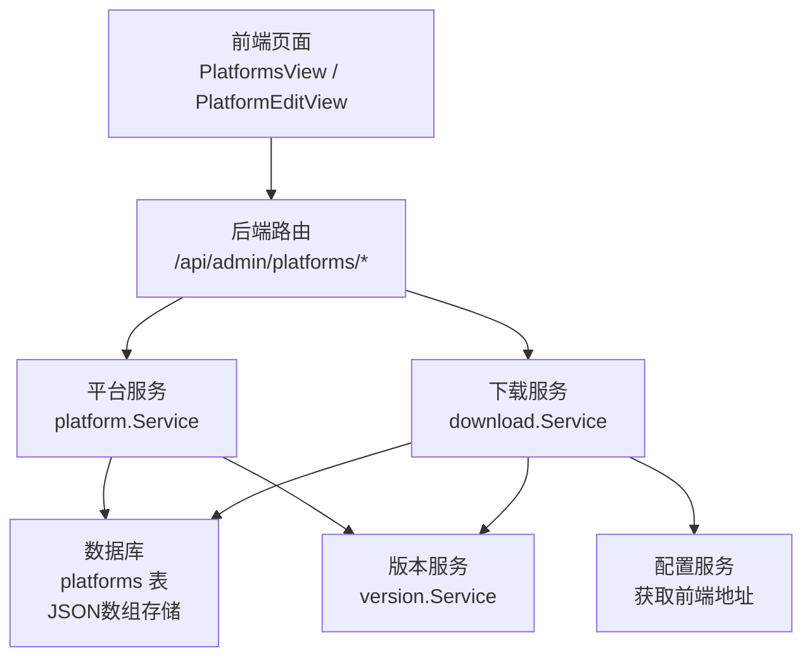
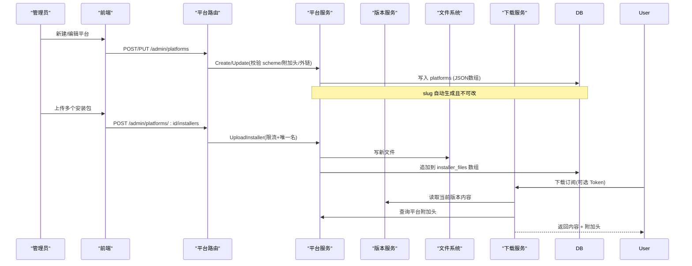
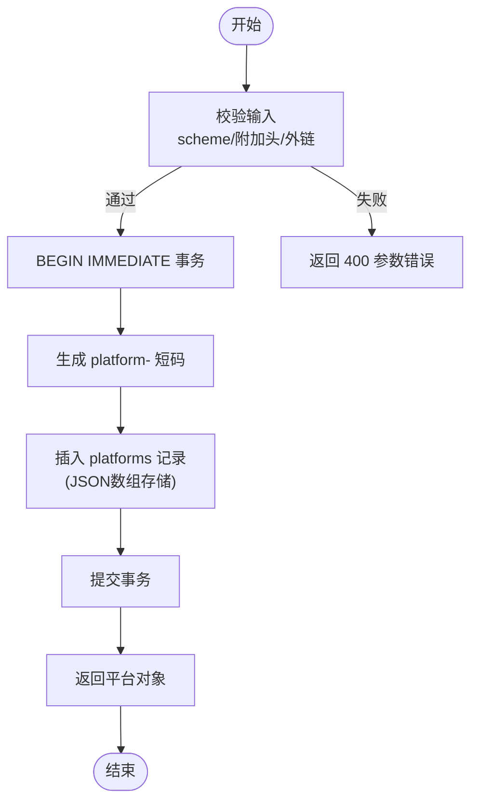
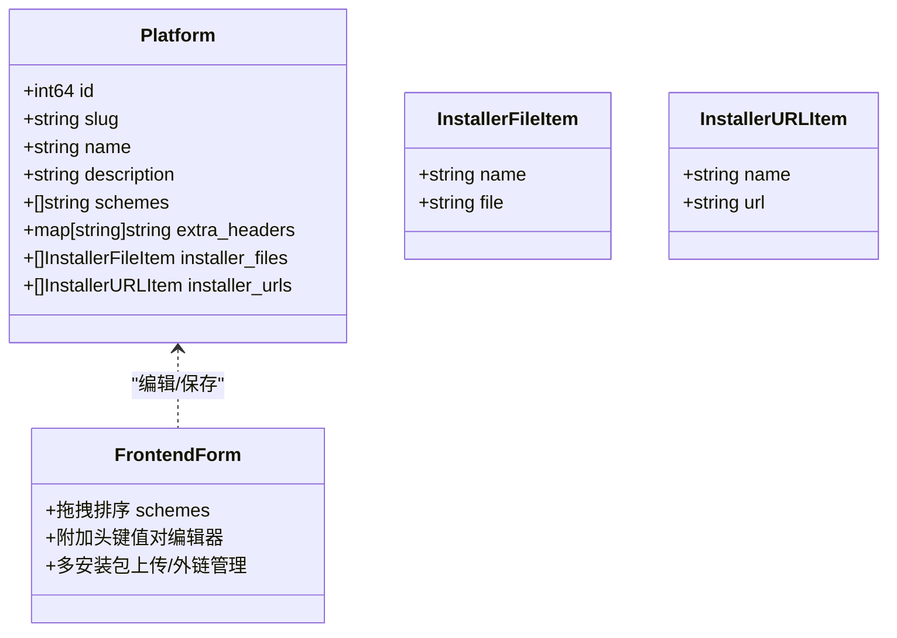
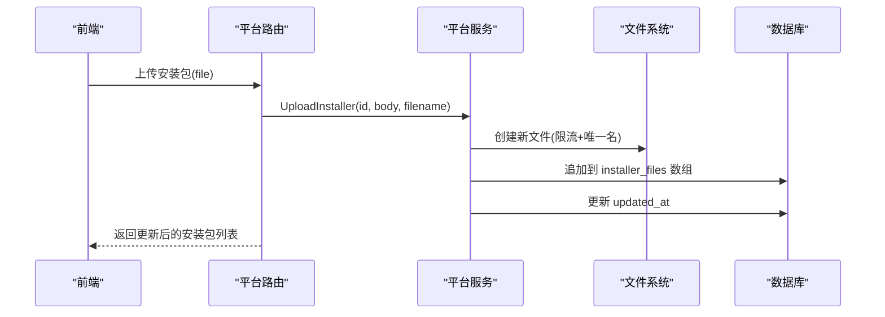
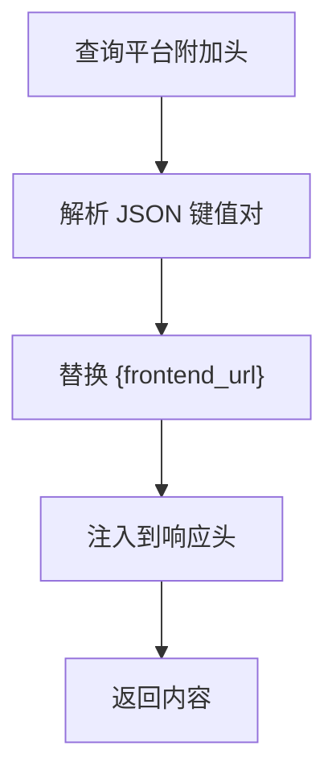
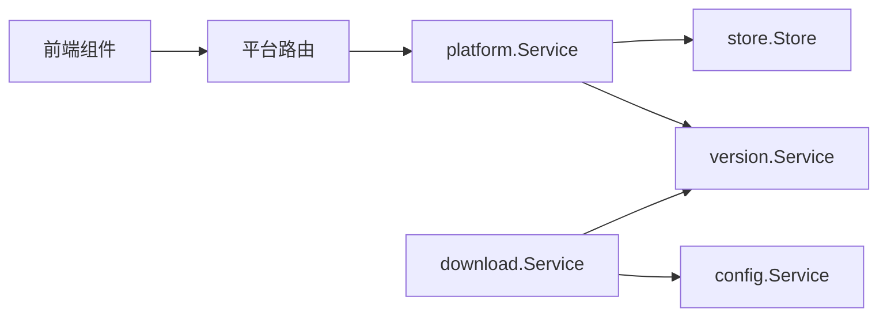

# 平台管理

<cite>
**本文引用的文件**
- [backend/internal/platform/platform.go](file://backend/internal/platform/platform.go)
- [backend/internal/server/platform.go](file://backend/internal/server/platform.go)
- [frontend/src/api/platform.ts](file://frontend/src/api/platform.ts)
- [frontend/src/views/admin/PlatformsView.vue](file://frontend/src/views/admin/PlatformsView.vue)
- [frontend/src/views/admin/PlatformEditView.vue](file://frontend/src/views/admin/PlatformEditView.vue)
- [backend/internal/download/download.go](file://backend/internal/download/download.go)
- [backend/internal/version/version.go](file://backend/internal/version/version.go)
- [backend/migrations/1001_platforms.sql](file://backend/migrations/1001_platforms.sql)
- [backend/migrations/1008_platform_installers_multi.sql](file://backend/migrations/1008_platform_installers_multi.sql)
- [Design1.md](file://Design1.md)
</cite>

## 更新摘要
**变更内容**
- 安装器系统从单文件支持升级为多文件支持，支持多个本地安装包和外部下载链接
- 新增JSON数组存储结构（installer_files, installer_urls）替代原有的单值字段
- 实现外部下载链接的完整验证机制，仅允许http/https协议
- 前端界面增强，支持多个安装器的上传、管理和删除操作
- **平台标识符显示简化：移除了点击复制功能，改为只读显示，简化界面并减少不必要的复杂性**
- 数据库迁移脚本处理存量数据从单值到数组格式的转换

## 目录
1. [简介](#简介)
2. [项目结构](#项目结构)
3. [核心组件](#核心组件)
4. [架构总览](#架构总览)
5. [详细组件分析](#详细组件分析)
6. [依赖关系分析](#依赖关系分析)
7. [性能与扩展性](#性能与扩展性)
8. [故障排查指南](#故障排查指南)
9. [结论](#结论)
10. [附录：配置示例与平台集成指南](#附录配置示例与平台集成指南)

## 简介
本文件面向"平台管理"能力，系统性说明以下目标：
- 平台配置的创建、编辑、删除流程与约束
- 客户端支持的扩展机制（scheme 列表与一键导入）
- **增强的安装器分发策略**：支持多个本地安装包和外部下载链接并存
- 附加响应头的配置管理与注入时机
- 不同 VPN 客户端平台的适配方式与平台特定选项
- 如何为新平台添加支持（含前端与后端步骤）
- 具体配置示例与平台集成指引

## 项目结构
平台管理能力由前后端协同实现：
- 后端提供平台资源服务（CRUD）、**多安装包上传/删除**、级联删除、下载时附加头注入等
- 前端提供平台列表、新建/编辑表单、**多安装包上传进度**、删除确认等交互
- 版本服务负责订阅/规则/自定义/分享的内容版本化与当前版本指针
- 下载服务在用户请求时按 Token/组/自定义优先级解析内容并注入平台附加头

**图表来源**
- [backend/internal/server/platform.go:19-30](file://backend/internal/server/platform.go#L19-L30)
- [backend/internal/platform/platform.go:36-46](file://backend/internal/platform/platform.go#L36-L46)
- [backend/internal/download/download.go:25-35](file://backend/internal/download/download.go#L25-L35)
- [backend/internal/version/version.go:50-59](file://backend/internal/version/version.go#L50-L59)

**章节来源**
- [backend/internal/server/platform.go:19-30](file://backend/internal/server/platform.go#L19-L30)
- [backend/internal/platform/platform.go:36-46](file://backend/internal/platform/platform.go#L36-L46)
- [backend/internal/download/download.go:25-35](file://backend/internal/download/download.go#L25-L35)
- [backend/internal/version/version.go:50-59](file://backend/internal/version/version.go#L50-L59)

## 核心组件
- 平台服务（platform.Service）：平台 CRUD、scheme/附加头校验、**多安装包流式上传与覆盖**、单独删除安装包、级联删除（含订阅/自定义/Token/版本文件）
- 平台路由处理器（server.PlatformHandler）：鉴权中间件、参数校验、错误映射、**多安装包上传入口**
- 下载服务（download.Service）：三态解析（自定义/显式/组选定）、附加响应头注入、访问日志
- 版本服务（version.Service）：版本创建/切换/驱逐、当前版本指针、启动自检、级联清理
- 前端平台模块：列表展示、新建/编辑表单、拖拽排序 scheme、附加头键值对编辑器、**多安装包上传进度**、删除确认

**章节来源**
- [backend/internal/platform/platform.go:68-119](file://backend/internal/platform/platform.go#L68-L119)
- [backend/internal/server/platform.go:42-118](file://backend/internal/server/platform.go#L42-L118)
- [backend/internal/download/download.go:53-146](file://backend/internal/download/download.go#L53-L146)
- [backend/internal/version/version.go:125-180](file://backend/internal/version/version.go#L125-L180)
- [frontend/src/views/admin/PlatformsView.vue:18-84](file://frontend/src/views/admin/PlatformsView.vue#L18-L84)
- [frontend/src/views/admin/PlatformEditView.vue:18-130](file://frontend/src/views/admin/PlatformEditView.vue#L18-L130)

## 架构总览
平台管理的端到端流程包括：
- 管理员通过前端创建/编辑平台，设置名称、描述、scheme 列表、附加响应头、**多个安装包来源**
- **多安装包通过流式上传到服务器磁盘**，文件名带时间戳以突破 CDN 缓存；事务内更新数据库并幂等删除旧文件
- 用户通过 Token 或无标识链接下载订阅时，下载服务根据优先级解析内容，并注入平台附加头（替换 {frontend_url}）
- 删除平台会级联删除该平台的订阅、自定义订阅、下载 Token、版本文件与**所有本地安装包**

**图表来源**
- [backend/internal/server/platform.go:76-118](file://backend/internal/server/platform.go#L76-L118)
- [backend/internal/platform/platform.go:68-119](file://backend/internal/platform/platform.go#L68-L119)
- [backend/internal/platform/platform.go:266-334](file://backend/internal/platform/platform.go#L266-L334)
- [backend/internal/download/download.go:53-146](file://backend/internal/download/download.go#L53-L146)
- [backend/internal/version/version.go:394-426](file://backend/internal/version/version.go#L394-L426)

## 详细组件分析

### 平台配置：创建、编辑、删除
- 创建平台
  - 生成唯一 slug（platform- 前缀），名称不强制唯一
  - 校验 scheme 列表（有序数组，禁止空项与控制字符）
  - 校验附加响应头（键符合 HTTP 头名规范，键值均禁止控制字符）
  - **校验外部下载链接列表（仅允许 http/https 协议）**
  - 写入数据库，返回平台信息
- 编辑平台
  - 仅允许修改 name/description/schemes/extra_headers/installer_urls
  - slug 只读，不允许修改
- 删除平台
  - 级联删除：平台下全部订阅（含版本文件）、下载 Token、自定义订阅（含版本文件）、组在该平台的关联与选定、**所有本地安装包文件**
  - 删除预览统计：显示将影响的订阅数、Token 数、自定义订阅数

**图表来源**
- [backend/internal/platform/platform.go:68-99](file://backend/internal/platform/platform.go#L68-L99)
- [backend/internal/platform/platform.go:219-245](file://backend/internal/platform/platform.go#L219-L245)

**章节来源**
- [backend/internal/platform/platform.go:68-119](file://backend/internal/platform/platform.go#L68-L119)
- [backend/internal/platform/platform.go:219-245](file://backend/internal/platform/platform.go#L219-L245)
- [backend/internal/platform/platform.go:382-474](file://backend/internal/platform/platform.go#L382-L474)
- [backend/internal/server/platform.go:76-135](file://backend/internal/server/platform.go#L76-L135)

### 客户端支持的扩展机制（Scheme 与一键导入）
- Scheme 列表为有序数组，首项作为"一键导入"默认唤起方式
- 支持 {url} 占位符，系统在对下载 URL 做 URL 编码后替换
- 前端支持拖拽排序 scheme，便于调整默认唤起顺序
- 若平台未配置任何 scheme，首页该平台卡片隐藏"一键导入"按钮（复制链接/刷新链接不受影响）

**图表来源**
- [backend/internal/platform/platform.go:48-59](file://backend/internal/platform/platform.go#L48-L59)
- [frontend/src/views/admin/PlatformEditView.vue:45-63](file://frontend/src/views/admin/PlatformEditView.vue#L45-63)
- [frontend/src/views/admin/PlatformEditView.vue:153-176](file://frontend/src/views/admin/PlatformEditView.vue#L153-L176)

**章节来源**
- [frontend/src/views/admin/PlatformEditView.vue:45-63](file://frontend/src/views/admin/PlatformEditView.vue#L45-63)
- [frontend/src/views/admin/PlatformEditView.vue:153-176](file://frontend/src/views/admin/PlatformEditView.vue#L153-L176)
- [Design1.md:312-318](file://Design1.md#L312-L318)

### 增强的安装器分发策略
**更新** 安装器系统现已支持多种分发方式并存：

- **多本地安装包**：≤300MB 流式落盘，文件名带时间戳，事务内追加到 JSON 数组，支持逐个删除
- **多外部下载链接**：填写下载地址（仅 http/https），与本地安装包并存显示
- **公开下载路径**：由静态服务承载（无需鉴权、可缓存）
- **前端增强**：提供上传进度条、多安装包列表管理、单个安装包删除操作

**图表来源**
- [backend/internal/server/platform.go:137-163](file://backend/internal/server/platform.go#L137-L163)
- [backend/internal/platform/platform.go:266-334](file://backend/internal/platform/platform.go#L266-L334)

**章节来源**
- [backend/internal/platform/platform.go:256-334](file://backend/internal/platform/platform.go#L256-334)
- [backend/internal/server/platform.go:137-163](file://backend/internal/server/platform.go#L137-L163)
- [frontend/src/views/admin/PlatformEditView.vue:64-99](file://frontend/src/views/admin/PlatformEditView.vue#L64-L99)

### 外部下载链接验证机制
**新增** 外部下载链接的安全验证：

- **协议限制**：仅允许 http/https 协议，防止 javascript: 等伪协议注入
- **控制字符检测**：禁止 URL 和展示名中包含控制字符
- **长度限制**：展示名最大 200 字符，防止超长列
- **URL 格式验证**：确保 URL 格式正确且包含有效主机名

**章节来源**
- [backend/internal/platform/platform.go:270-291](file://backend/internal/platform/platform.go#L270-L291)

### 平台标识符显示优化
**更新** 平台标识符显示已简化：

- **移除点击复制功能**：平台列表中的标识符现在仅以只读形式显示，不再提供点击复制按钮
- **简化界面交互**：减少了不必要的复杂性，保持核心功能的完整性
- **统一显示样式**：使用 TypographyText 组件以代码样式展示 slug，提升可读性
- **移动端适配**：在移动设备上同样采用简洁的只读显示方式

**章节来源**
- [frontend/src/views/admin/PlatformsView.vue:94-98](file://frontend/src/views/admin/PlatformsView.vue#L94-L98)
- [frontend/src/views/admin/PlatformsView.vue:121-124](file://frontend/src/views/admin/PlatformsView.vue#L121-L124)

### 附加响应头的配置管理
- 平台附加头为键值对，键必须符合 HTTP 头名规范，键值均禁止控制字符
- 值支持 {frontend_url} 占位符，下载时替换为当前前端地址
- 下载服务在返回内容前注入这些头，确保客户端行为一致

**图表来源**
- [backend/internal/download/download.go:119-146](file://backend/internal/download/download.go#L119-L146)
- [backend/internal/platform/platform.go:232-245](file://backend/internal/platform/platform.go#L232-L245)

**章节来源**
- [backend/internal/download/download.go:119-146](file://backend/internal/download/download.go#L119-L146)
- [backend/internal/platform/platform.go:232-245](file://backend/internal/platform/platform.go#L232-L245)

### 不同 VPN 客户端平台的适配方式
- 通过 scheme 列表适配不同客户端的导入协议（如 clash://install-config?url={url}）
- 通过附加响应头适配客户端对跨域/缓存/安全策略的要求
- **通过多安装包来源（本地/外链）适配不同平台的分发渠道**

**章节来源**
- [Design1.md:312-318](file://Design1.md#L312-L318)
- [frontend/src/views/admin/PlatformEditView.vue:153-176](file://frontend/src/views/admin/PlatformEditView.vue#L153-L176)

### 平台特定的配置选项
- 名称/描述：用于管理识别
- Scheme 列表：定义客户端导入协议及顺序
- 附加响应头：定制下载时的额外头字段
- **安装包：多个本地上传文件或外部下载链接**

**章节来源**
- [backend/internal/platform/platform.go:48-59](file://backend/internal/platform/platform.go#L48-L59)
- [backend/migrations/1001_platforms.sql:1-10](file://backend/migrations/1001_platforms.sql#L1-L10)

### 如何添加新的平台支持
- 后端
  - 新增平台记录（slug 自动生成），配置 scheme 列表与附加响应头
  - **配置多个安装包来源（本地上传或外部链接）**
  - 如需新的分发策略，可在平台服务中扩展（例如增加新的安装包来源类型）
- 前端
  - 在平台编辑页新增 scheme 条目，调整顺序以设定默认一键导入
  - 在附加响应头中添加键值对，必要时使用 {frontend_url} 占位符
  - **添加多个安装包和外部下载链接**
- 测试
  - 使用客户端一键导入验证 scheme 是否生效
  - 检查下载响应头是否符合预期
  - **验证所有安装包下载是否正常**

**章节来源**
- [backend/internal/platform/platform.go:68-119](file://backend/internal/platform/platform.go#L68-L119)
- [frontend/src/views/admin/PlatformEditView.vue:153-176](file://frontend/src/views/admin/PlatformEditView.vue#L153-L176)

## 依赖关系分析
- 平台服务依赖：
  - store.Store：数据库连接与事务
  - version.Service：版本文件的收集与删除（级联场景）
  - slog.Logger：日志记录
- 下载服务依赖：
  - version.Service：读取当前版本内容
  - config.Service：获取前端地址以替换 {frontend_url}
- 前端依赖：
  - api/platform.ts：调用后端平台接口
  - 视图组件：PlatformsView.vue、PlatformEditView.vue

**图表来源**
- [backend/internal/platform/platform.go:36-46](file://backend/internal/platform/platform.go#L36-L46)
- [backend/internal/download/download.go:25-35](file://backend/internal/download/download.go#L25-L35)
- [backend/internal/server/platform.go:14-30](file://backend/internal/server/platform.go#L14-L30)

**章节来源**
- [backend/internal/platform/platform.go:36-46](file://backend/internal/platform/platform.go#L36-L46)
- [backend/internal/download/download.go:25-35](file://backend/internal/download/download.go#L25-L35)
- [backend/internal/server/platform.go:14-30](file://backend/internal/server/platform.go#L14-L30)

## 性能与扩展性
- **多安装包上传采用流式写入与大小限制**，避免内存溢出
- 文件名带时间戳，突破 CDN 缓存，提升分发效率
- 版本服务限制每份资源最多 5 个版本，自动驱逐最旧版本，控制存储增长
- 附加响应头注入轻量，仅在下载时查询并替换占位符
- **JSON数组存储设计支持未来扩展更多安装包类型**
- **简化的平台标识符显示减少前端交互复杂度，提升用户体验**

**章节来源**
- [backend/internal/platform/platform.go:266-334](file://backend/internal/platform/platform.go#L266-L334)
- [backend/internal/version/version.go:25-38](file://backend/internal/version/version.go#L25-L38)
- [backend/internal/download/download.go:119-146](file://backend/internal/download/download.go#L119-L146)

## 故障排查指南
- 参数错误（400）
  - scheme 为空或包含控制字符
  - 附加头键不符合 HTTP 头名规范或包含控制字符
  - **外部下载链接仅支持 http/https 协议**
  - 安装包超过 300MB
- 平台不存在（404）
  - 编辑/删除/上传安装包时 ID 无效
  - Token 无效或平台标识不一致
- 未分配（200 注释块）
  - 用户所属组在该平台未选定订阅
- 版本缺失（访问日志记录）
  - 订阅/自定义/分享/规则无当前版本

**章节来源**
- [backend/internal/platform/platform.go:219-245](file://backend/internal/platform/platform.go#L219-L245)
- [backend/internal/platform/platform.go:266-334](file://backend/internal/platform/platform.go#L266-L334)
- [backend/internal/download/download.go:53-117](file://backend/internal/download/download.go#L53-L117)
- [backend/internal/server/platform.go:76-135](file://backend/internal/server/platform.go#L76-L135)

## 结论
平台管理提供了完整的平台生命周期管理能力，涵盖配置、**增强的分发策略**、下载增强与级联清理。通过 scheme 与附加响应头，系统可灵活适配多种 VPN 客户端。**多安装包分发策略**兼顾本地与外链，满足多样化部署需求。**简化的平台标识符显示**提升了用户体验，减少了不必要的交互复杂性。版本服务确保内容可追溯与回滚。整体设计在保证安全性的同时，具备良好的可扩展性与可维护性。

## 附录：配置示例与平台集成指南

### 平台配置示例（概念性说明）
- 名称：Clash Verge
- 描述：适用于 Clash Verge 客户端的平台
- Scheme 列表：
  - clash://install-config?url={url}
- 附加响应头：
  - X-Custom-Header: {frontend_url}/custom
- **安装包**：
  - **多个本地安装包**：clash-verge-setup.exe, clash-verge-portable.zip
  - **或多个外部下载链接**：https://example.com/clash-verge-setup.exe, https://github.com/.../release

**章节来源**
- [backend/internal/platform/platform.go:48-59](file://backend/internal/platform/platform.go#L48-L59)
- [backend/internal/download/download.go:119-146](file://backend/internal/download/download.go#L119-L146)
- [frontend/src/views/admin/PlatformEditView.vue:153-191](file://frontend/src/views/admin/PlatformEditView.vue#L153-L191)

### 为新 VPN 客户端添加平台支持（步骤清单）
- 创建平台
  - 设置名称、描述
  - 添加 scheme 条目（含 {url} 占位符）
  - 配置附加响应头（必要时使用 {frontend_url}）
  - **配置多个安装包来源（本地上传或外部链接）**
- 配置订阅
  - 为该平台创建订阅并上传内容
  - 为用户组选定该平台的订阅
- 测试验证
  - 使用客户端一键导入验证 scheme
  - 检查下载响应头是否正确
  - **验证所有安装包下载是否正常**

**章节来源**
- [backend/internal/platform/platform.go:68-119](file://backend/internal/platform/platform.go#L68-L119)
- [backend/internal/download/download.go:53-146](file://backend/internal/download/download.go#L53-L146)
- [frontend/src/views/admin/PlatformEditView.vue:18-130](file://frontend/src/views/admin/PlatformEditView.vue#L18-L130)