# 核心功能模块

<cite>
**本文引用的文件**
- [backend/cmd/server/main.go](file://backend/cmd/server/main.go)
- [backend/internal/server/server.go](file://backend/internal/server/server.go)
- [backend/internal/subscription/subscription.go](file://backend/internal/subscription/subscription.go)
- [backend/internal/version/version.go](file://backend/internal/version/version.go)
- [backend/internal/auth/auth.go](file://backend/internal/auth/auth.go)
- [backend/internal/user/user.go](file://backend/internal/user/user.go)
- [backend/internal/oidc/oidc.go](file://backend/internal/oidc/oidc.go)
- [backend/internal/group/group.go](file://backend/internal/group/group.go)
- [backend/internal/platform/platform.go](file://backend/internal/platform/platform.go)
- [backend/internal/rule/rule.go](file://backend/internal/rule/rule.go)
- [backend/internal/share/share.go](file://backend/internal/share/share.go)
- [backend/internal/token/token.go](file://backend/internal/token/token.go)
- [backend/internal/config/config.go](file://backend/internal/config/config.go)
- [backend/internal/slug/slug.go](file://backend/internal/slug/slug.go)
- [backend/migrations/1006_rules.sql](file://backend/migrations/1006_rules.sql)
- [Design2.md](file://Design2.md)
- [README.md](file://README.md)
</cite>

## 更新摘要
**变更内容**
- 规则素材池同步功能得到改进：异步任务执行模型和轮询模式更加清晰，支持手动触发与定时自动同步（每日凌晨低峰执行），采用差量更新语义并隔离 URL 来源与 manual 来源
- 节点管理章节更新了协议支持矩阵、命名约定和分配规则：manual 节点支持 ClashOfficial 全量代理协议（ssr 除外），xray 来源支持 vless/vmess/trojan/shadowsocks 四协议，新增 allocatable 标记机制限制不可分配节点
- 增强了规则引擎的自动标识生成、事务一致性保证和失败回滚机制，确保数据完整性和全局唯一性校验

## 目录
1. [简介](#简介)
2. [项目结构](#项目结构)
3. [核心组件](#核心组件)
4. [架构总览](#架构总览)
5. [详细组件分析](#详细组件分析)
6. [依赖关系分析](#依赖关系分析)
7. [性能与可靠性](#性能与可靠性)
8. [故障排查指南](#故障排查指南)
9. [结论](#结论)
10. [附录：API 调用示例](#附录api-调用示例)

## 简介
本系统是一个自托管的 VPN 订阅分发面板，支持集中管理订阅、按平台与用户组分发、版本控制、本地账号与 OIDC 单点登录、规则引擎（分流规则）、分享订阅、安装包分发等。后端采用 Go + Gin + SQLite，前端为 Vue 3；通过 Docker 单容器部署，数据持久化到卷中。

**更新** 系统现已支持规则素材池管理、Shadowrocket 双输出格式、增强配置组装和 Xray-core 高级模式集成，提供更强大的订阅管理和配置生成能力。**特别重要的是**，规则素材池同步功能得到了显著改进，采用异步任务 + 轮询模式实现高效的数据同步，同时节点管理章节更新了协议支持矩阵和分配规则，提升了系统的灵活性和可扩展性。

## 项目结构
- 入口与启动流程：main.go 负责环境变量解析、日志初始化、数据库迁移、应急模式检测、服务装配与优雅退出。
- HTTP 服务装配：server.go 统一组装各业务域路由、中间件与服务依赖注入。
- 业务域：
  - 订阅管理：subscription.go + version.go
  - 认证授权：auth.go + user.go + oidc.go
  - 用户组：group.go
  - 平台管理：platform.go
  - 规则引擎：rule.go + 规则素材池 + 全局唯一性校验
  - 分享系统：share.go
  - Token 与下载：token.go
  - 配置中心：config.go
  - 装配系统：配置组装与多格式输出
  - 标识管理：slug.go 提供统一的标识生成与验证

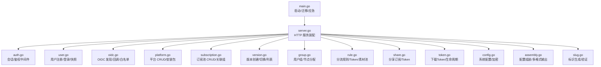

图表来源
- [backend/cmd/server/main.go:24-99](file://backend/cmd/server/main.go#L24-L99)
- [backend/internal/server/server.go:63-157](file://backend/internal/server/server.go#L63-L157)

章节来源
- [backend/cmd/server/main.go:24-99](file://backend/cmd/server/main.go#L24-L99)
- [backend/internal/server/server.go:63-157](file://backend/internal/server/server.go#L63-L157)
- [README.md:32-62](file://README.md#L32-L62)

## 核心组件
- 订阅管理：提供订阅池 CRUD、与用户组关联、版本创建与切换、级联删除（含版本文件与 Token）。
- 认证与授权：本地账号（邮箱+密码）与 OIDC 单点登录；JWT 会话校验、角色权限中间件、凭据版本失效机制。
- 用户组管理：组 CRUD、节点分配、配额管理、Xray 节点授权。
- 平台管理：平台资源 CRUD、scheme/附加头校验、安装包流式上传与覆盖、级联删除。
- 规则引擎：分流规则 CRUD、全局共享 Token、版本管理、刷新、**规则素材池管理**、**自动标识生成**、**事务一致性保证**。
- 分享系统：分享订阅 CRUD、Token 轮替与吊销、版本管理、**失败回滚机制**。
- 版本管理：跨四类资源（订阅/规则/自定义/分享）的统一版本组件，保证当前指针以 DB 为准，symlink 原子替换。
- Token 管理：用户下载 Token 三态复用键、分享/规则 Token 创建与轮替、生命周期联动。
- 配置中心：系统配置读写、敏感字段 AES-GCM 加密、签名密钥生成与派生。
- **装配系统**：**配置组装与多格式输出**，支持 Clash YAML、Shadowrocket subs/conf 三种格式。
- **标识管理**：**统一的slug生成与验证**，支持跨四类资源的全局唯一性校验。

章节来源
- [backend/internal/subscription/subscription.go:1-435](file://backend/internal/subscription/subscription.go#L1-L435)
- [backend/internal/version/version.go:1-577](file://backend/internal/version/version.go#L1-L577)
- [backend/internal/auth/auth.go:1-193](file://backend/internal/auth/auth.go#L1-L193)
- [backend/internal/user/user.go:1-275](file://backend/internal/user/user.go#L1-L275)
- [backend/internal/oidc/oidc.go:1-239](file://backend/internal/oidc/oidc.go#L1-L239)
- [backend/internal/group/group.go:1-373](file://backend/internal/group/group.go#L1-L373)
- [backend/internal/platform/platform.go:1-519](file://backend/internal/platform/platform.go#L1-L519)
- [backend/internal/rule/rule.go:1-236](file://backend/internal/rule/rule.go#L1-L236)
- [backend/internal/share/share.go:1-233](file://backend/internal/share/share.go#L1-L233)
- [backend/internal/token/token.go:1-244](file://backend/internal/token/token.go#L1-L244)
- [backend/internal/config/config.go:1-361](file://backend/internal/config/config.go#L1-L361)
- [backend/internal/slug/slug.go:1-93](file://backend/internal/slug/slug.go#L1-L93)

## 架构总览
系统采用分层架构：
- 接入层（Gin 路由 + 中间件）：请求日志、恢复、信任代理、会话校验、管理员权限校验、限流、验证码。
- 业务层（Service）：各模块 Service 封装领域逻辑与事务边界。
- 基础设施层：store（SQLite）、version（版本与文件）、token（下载令牌）、config（配置与加密）、log（访问日志与实时流）。

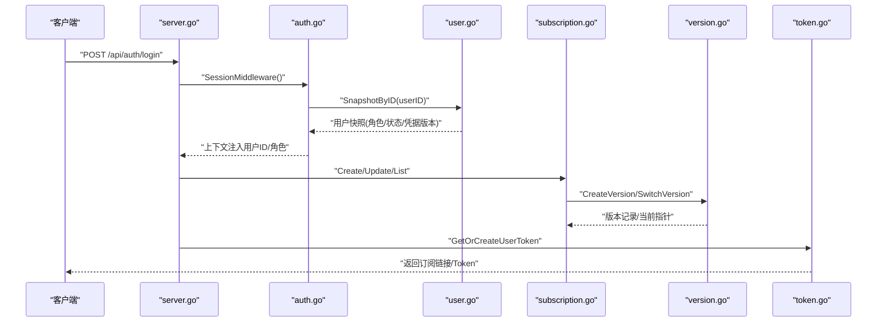

图表来源
- [backend/internal/server/server.go:63-157](file://backend/internal/server/server.go#L63-L157)
- [backend/internal/auth/auth.go:144-180](file://backend/internal/auth/auth.go#L144-L180)
- [backend/internal/user/user.go:189-202](file://backend/internal/user/user.go#L189-L202)
- [backend/internal/subscription/subscription.go:166-231](file://backend/internal/subscription/subscription.go#L166-L231)
- [backend/internal/version/version.go:127-180](file://backend/internal/version/version.go#L127-L180)
- [backend/internal/token/token.go:48-88](file://backend/internal/token/token.go#L48-88)

## 详细组件分析

### 订阅管理（创建、编辑、版本控制）
- 职责：订阅池 CRUD、与用户组关联、首版本创建、版本切换与列表、标识全局唯一性校验、级联删除（版本文件、Token、组关联）。
- 实现要点：
  - 标识 slug 全局唯一（跨订阅/规则/自定义/分享四表），自动生成带前缀短码。
  - 创建订阅时可选首版本内容；失败回滚订阅与关联。
  - 更新仅允许改名与关联组；平台只读。
  - 删除订阅：收集版本文件→删除版本记录→删除指向它的 Token→清理组关联与选定→删除订阅行→提交后删文件与目录。
  - 列表按平台分组，附带关联组与被选定数量。
- 配置选项：最大保留版本数（5）、内容大小限制（50MB）。
- 使用方法：
  - 创建：选择平台、名称、slug（可空自动）、关联组、首版本内容（文件/文本）。
  - 编辑：修改名称与关联组。
  - 版本管理：查看版本列表、切换当前版本、删除非当前版本。
  - 删除：确认级联影响（版本文件、Token、组关联）。

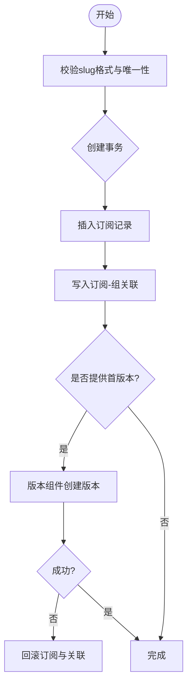

图表来源
- [backend/internal/subscription/subscription.go:166-231](file://backend/internal/subscription/subscription.go#L166-L231)
- [backend/internal/version/version.go:127-180](file://backend/internal/version/version.go#L127-L180)

章节来源
- [backend/internal/subscription/subscription.go:1-435](file://backend/internal/subscription/subscription.go#L1-L435)
- [backend/internal/version/version.go:127-180](file://backend/internal/version/version.go#L127-L180)

### 用户认证与授权（本地账号、OIDC）
- 职责：本地账号注册/登录、OIDC 单点登录、JWT 会话签发与校验、凭据版本失效、管理员权限校验。
- 实现要点：
  - 本地账号：邮箱规范化、密码复杂度校验、bcrypt 哈希、统一错误提示防枚举。
  - OIDC：发现文档缓存、PKCE 流程、白名单匹配激活、参数加密存储。
  - JWT：HS256 签名，载荷仅含 userID 与 credential_version；每次请求实时查库比对状态与凭据版本。
  - 中间件：SessionMiddleware 校验会话，AdminMiddleware 校验管理员角色。
- 配置选项：允许本地登录、允许自注册、自注册审批开关、OIDC 提供商类型与参数、回调地址。
- 使用方法：
  - 本地登录：输入邮箱与密码，成功后获得会话令牌。
  - OIDC：配置提供商参数后，跳转至授权端点，回调完成登录。
  - 会话校验：所有受保护接口需携带 Authorization: Bearer <token>。

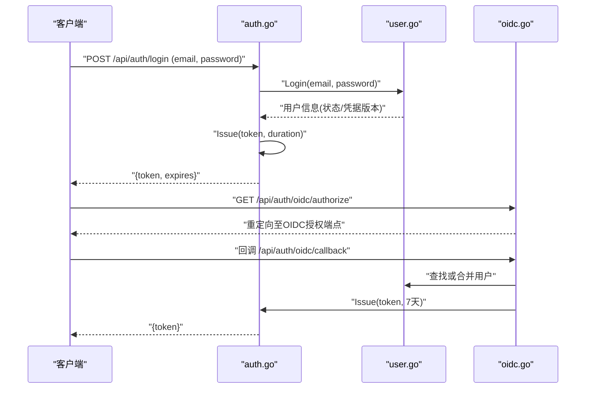

图表来源
- [backend/internal/auth/auth.go:98-135](file://backend/internal/auth/auth.go#L98-L135)
- [backend/internal/user/user.go:84-154](file://backend/internal/user/user.go#L84-L154)
- [backend/internal/oidc/oidc.go:151-205](file://backend/internal/oidc/oidc.go#L151-L205)

章节来源
- [backend/internal/auth/auth.go:1-193](file://backend/internal/auth/auth.go#L1-L193)
- [backend/internal/user/user.go:1-275](file://backend/internal/user/user.go#L1-L275)
- [backend/internal/oidc/oidc.go:1-239](file://backend/internal/oidc/oidc.go#L1-L239)

### 用户组管理（增强版）
- 职责：用户组 CRUD、**节点分配**、配额管理、**Xray 节点授权**。
- 实现要点：
  - 名称全局唯一，slug 自动生成。
  - **新增节点分配机制**：替代原有的 group_selections，使用 group_nodes 表管理组与节点的关联。
  - **配额管理**：支持默认月度配额和每用户配额覆盖。
  - **Xray 集成**：仅 xray 来源节点可分配到组，manual 节点用于静态渲染。
  - 重建 group_nodes，确保分配必须在关联范围内。
  - 删除组：默认组不可删；成员迁入默认组；关联与选定由外键 CASCADE 清理。
- 配置选项：无额外配置；行为受数据库外键与约束控制。
- 使用方法：
  - 创建组：输入名称、设置默认配额。
  - 编辑组：改名、分配节点（xray 来源）、调整节点顺序。
  - 删除组：确认成员迁移与影响。

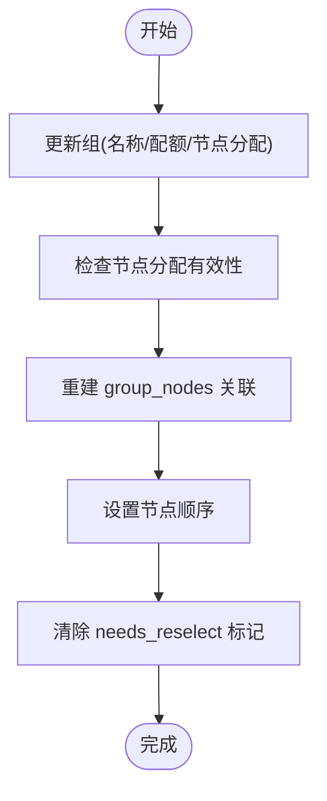

图表来源
- [backend/internal/group/group.go:84-141](file://backend/internal/group/group.go#L84-L141)
- [backend/internal/group/group.go:179-220](file://backend/internal/group/group.go#L179-L220)

章节来源
- [backend/internal/group/group.go:1-373](file://backend/internal/group/group.go#L1-L373)

### 平台管理
- 职责：平台资源 CRUD、scheme/附加头校验、安装包流式上传与覆盖、级联删除。
- 实现要点：
  - scheme 有序数组，含 {url} 占位符；附加头键值校验防响应头注入。
  - 安装包上传：≤300MB 流式落盘，文件名带时间戳突破 CDN 缓存；事务内读旧名→生成唯一新名(O_EXCL)→写新文件→更新DB→提交后删旧文件。
  - 删除平台：级联删除安装包、全部订阅（含版本文件）、下载 Token、自定义订阅（含版本与 Token）、组在该平台的关联与选定（外键 CASCADE）。
- 配置选项：安装包大小上限（300MB）。
- 使用方法：
  - 创建平台：名称、描述、scheme、附加头。
  - 上传安装包：选择文件，自动覆盖旧包。
  - 删除平台：确认级联影响统计。

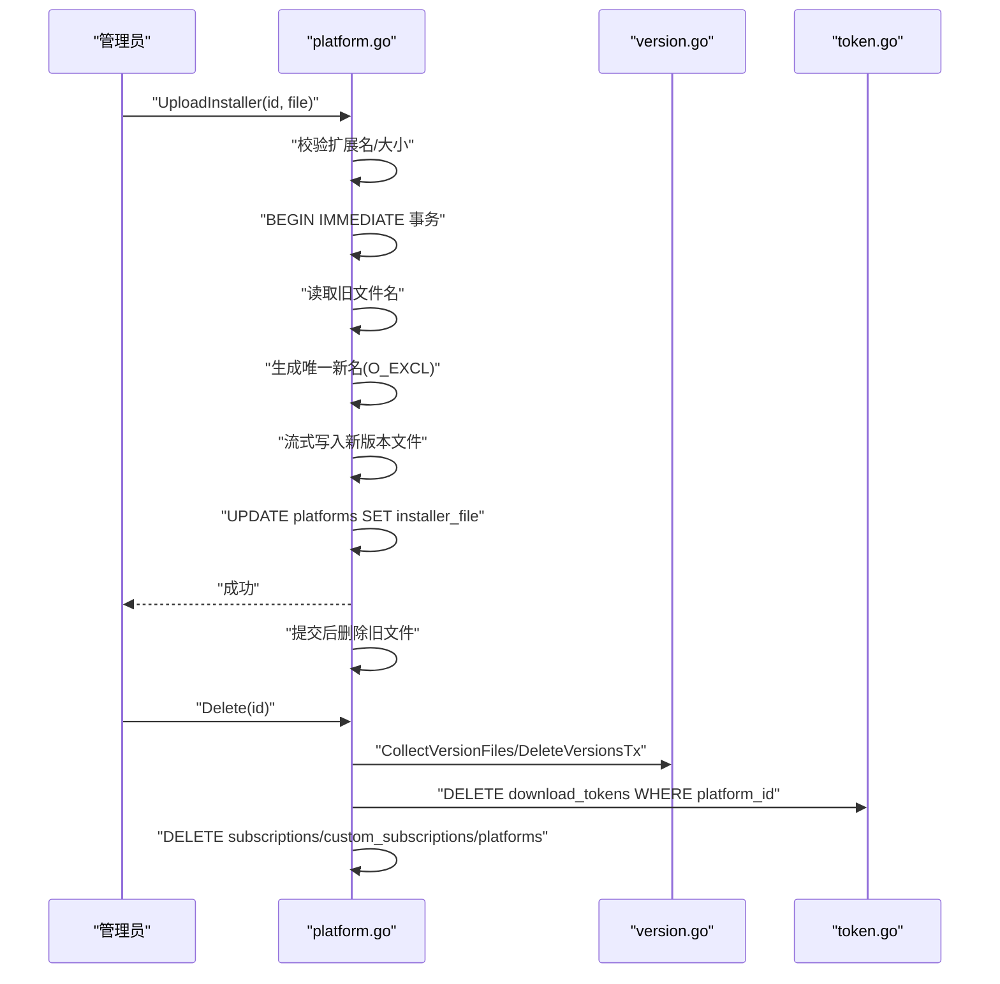

图表来源
- [backend/internal/platform/platform.go:269-334](file://backend/internal/platform/platform.go#L269-334)
- [backend/internal/platform/platform.go:382-474](file://backend/internal/platform/platform.go#L382-474)

章节来源
- [backend/internal/platform/platform.go:1-519](file://backend/internal/platform/platform.go#L1-L519)

### 规则引擎（增强版 - 含素材池与全局唯一性校验）
- 职责：分流规则 CRUD、全局共享 Token、版本管理、刷新、**规则素材池管理**、**自动标识生成**、**事务一致性保证**。
- 实现要点：
  - 名称必填，客户端类型当前仅支持 shadowrocket。
  - 标识 slug 全局唯一（跨四类资源），自动生成 rule- 前缀，支持冲突自动重试。
  - 创建时自动生成规则 Token；删除时级联删除 Token 与版本文件。
  - 列表包含 Token 与刷新时间（无 Token 时为 null）。
  - **新增规则素材池**：支持 URL 同步和手动添加，池级勾选管理。
  - **Shadowrocket 双输出**：支持节点订阅（subs）和分流规则（conf）两种格式。
  - **事务一致性保证**：使用 `rollbackRecord` 机制确保首版本创建失败时的数据完整性。
  - **跨资源全局唯一性校验**：通过 `CheckSlugAvailable` 方法在四个表（subscriptions/rules/custom_subscriptions/share_subscriptions）中进行查重。
- 配置选项：无额外配置；行为受数据库约束控制。
- 使用方法：
  - 创建规则：名称、客户端类型、scheme、首版本内容。
  - 管理素材池：添加 URL 或手动条目，设置同步策略。
  - 刷新 Token：物理轮替旧 Token。
  - 删除规则：确认级联影响。

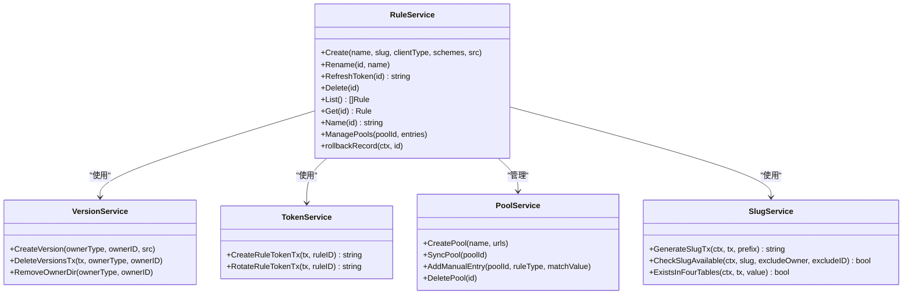

图表来源
- [backend/internal/rule/rule.go:52-102](file://backend/internal/rule/rule.go#L52-L102)
- [backend/internal/version/version.go:127-180](file://backend/internal/version/version.go#L127-L180)
- [backend/internal/token/token.go:197-224](file://backend/internal/token/token.go#L197-L224)
- [backend/internal/slug/slug.go:15-33](file://backend/internal/slug/slug.go#L15-L33)

章节来源
- [backend/internal/rule/rule.go:1-236](file://backend/internal/rule/rule.go#L1-L236)

### 分享系统（含失败回滚机制）
- 职责：分享订阅 CRUD、Token 轮替与吊销、版本管理、**失败回滚机制**。
- 实现要点：
  - 名称必填，slug 自动生成 share- 前缀。
  - 创建时自动生成分享 Token；删除时级联删除 Token 与版本文件。
  - 刷新 Token：物理轮替并清除 revoked 标记。
  - 吊销 Token：物理删除 Token 记录并置 token_status=revoked，链接立即失效。
  - **失败回滚机制**：使用 `rollbackRecord` 方法确保首版本创建失败时清理已创建的分享记录和 Token。
- 配置选项：无额外配置；行为受数据库约束控制。
- 使用方法：
  - 创建分享：名称、首版本内容。
  - 刷新/吊销 Token：根据需求操作。
  - 删除分享：确认级联影响。

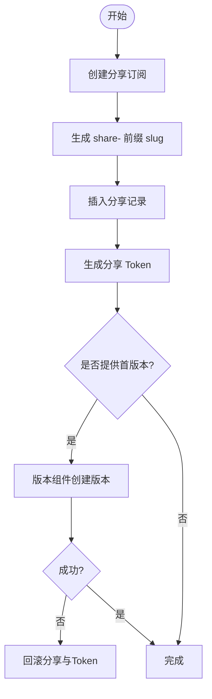

图表来源
- [backend/internal/share/share.go:48-83](file://backend/internal/share/share.go#L48-L83)
- [backend/internal/version/version.go:127-180](file://backend/internal/version/version.go#L127-L180)

章节来源
- [backend/internal/share/share.go:1-233](file://backend/internal/share/share.go#L1-L233)

### 版本管理（跨资源通用）
- 职责：为订阅/规则/自定义/分享提供统一的版本创建、切换、列表、预览、删除能力。
- 实现要点：
  - 版本号 = 已有最大编号 + 1，不复用已删除编号。
  - 当前指针以 DB 记录为准，symlink 仅作文件组织，启动时自检重建。
  - 最多保留 5 个版本，超出自动驱逐最旧（不含当前激活）。
  - 切换版本：原子替换 symlink（临时指针 + rename），同时更新 DB current_version 与版本 updated_at。
  - 删除版本：不可删除最后一个；不可删除当前激活版本（须先切换）。
- 配置选项：最大版本数（5）、内容大小限制（50MB）。
- 使用方法：
  - 创建版本：上传文件或粘贴文本。
  - 切换版本：选择目标版本作为当前。
  - 删除版本：仅非当前且非最后一个。
  - 预览版本：读取指定版本内容。

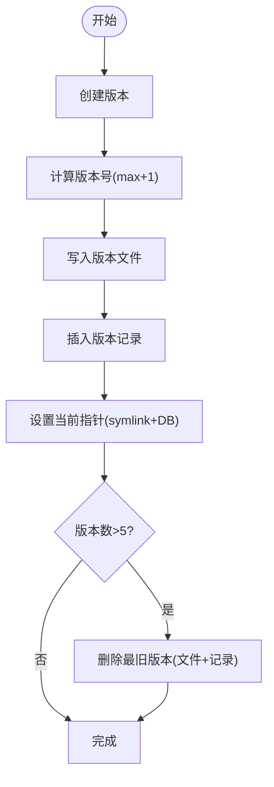

图表来源
- [backend/internal/version/version.go:127-180](file://backend/internal/version/version.go#L127-L180)
- [backend/internal/version/version.go:182-216](file://backend/internal/version/version.go#L182-L216)
- [backend/internal/version/version.go:218-245](file://backend/internal/version/version.go#L218-L245)

章节来源
- [backend/internal/version/version.go:1-577](file://backend/internal/version/version.go#L1-L577)

### Token 管理（下载令牌）
- 职责：用户下载 Token 三态复用键、分享/规则 Token 创建与轮替、生命周期联动。
- 实现要点：
  - 用户 Token：复用键为 user+platform+(custom_sub_id|subscription_id)，并发首建先查后建。
  - 生命周期：订阅/自定义删除时级联删除 Token；用户禁用/降级时清理显式 Token。
  - 分享/规则 Token：创建时自动生成；刷新=物理轮替；吊销=物理删除。
- 配置选项：无额外配置；行为受数据库约束控制。
- 使用方法：
  - 获取 Token：首次访问时自动创建，后续复用。
  - 刷新 Token：轮替旧 Token。
  - 吊销 Token：立即失效链接。

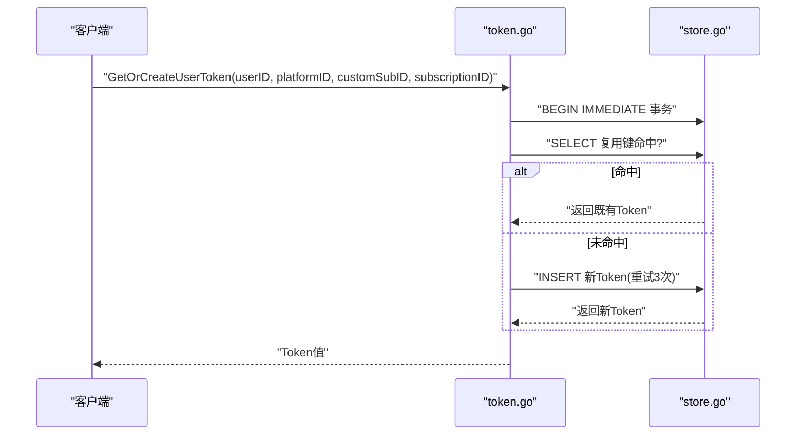

图表来源
- [backend/internal/token/token.go:48-88](file://backend/internal/token/token.go#L48-88)

章节来源
- [backend/internal/token/token.go:1-244](file://backend/internal/token/token.go#L1-L244)

### 配置中心
- 职责：系统配置读写、敏感字段加密、签名密钥生成与派生。
- 实现要点：
  - 配置键：configured、signing_key、log_level、app_mode、allow_local_login、allow_selfreg、selfreg_approval、admin_initialized、frontend_url、callback_url。
  - 敏感字段：AES-256-GCM 加密，密钥由签名密钥经 HKDF-SHA256 派生。
  - 签名密钥：缺失时自动生成 32 字节随机值；事务内确保存在。
- 配置选项：无额外配置；行为由代码常量与数据库约束控制。
- 使用方法：
  - 读取配置：Get/GetBool/GetInt/GetJSONStringSlice。
  - 写入配置：Set/SetTx（敏感字段自动加密）。
  - 导出/导入：备份与迁移配置。

章节来源
- [backend/internal/config/config.go:1-361](file://backend/internal/config/config.go#L1-L361)

### 装配系统（新增）
- 职责：**配置组装与多格式输出**，支持 Clash YAML、Shadowrocket subs/conf 三种格式。
- 实现要点：
  - **规则素材池管理**：rule_pools 和 pool_entries 表，支持 URL 同步和手动添加。
  - **Shadowrocket 双输出**：节点订阅（subs）和分流规则（conf）独立生成。
  - **Xray-core 集成**：高级模式支持动态节点注入和用户凭据管理。
  - **装配蓝图**：assembly_blueprints 表保存装配参数快照。
  - **代理组管理**：proxy_groups 和 group_nodes 表管理 Clash 代理组。
- 配置选项：支持多种协议、模板配置、节点注入策略。
- 使用方法：
  - 创建素材池：添加 URL 或手动规则条目。
  - 配置组装：选择模板、节点、代理组，生成目标格式。
  - 管理 Xray 实例：配置连接信息，同步节点。
  - 发布配置：生成并分发最终配置文件。

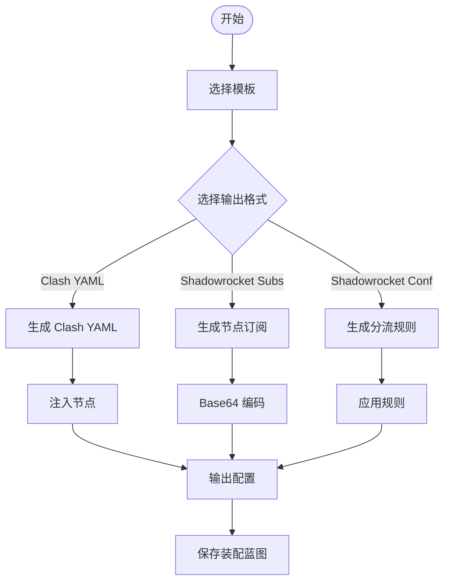

图表来源
- [Design2.md:77-116](file://Design2.md#L77-L116)
- [Design2.md:175-184](file://Design2.md#L175-L184)
- [Design2.md:352-368](file://Design2.md#L352-L368)

章节来源
- [Design2.md:77-116](file://Design2.md#L77-L116)
- [Design2.md:175-184](file://Design2.md#L175-L184)
- [Design2.md:352-368](file://Design2.md#L352-L368)

### 标识管理系统（新增）
- 职责：**统一的slug生成与验证**，支持跨四类资源的全局唯一性校验。
- 实现要点：
  - **自动标识生成**：使用 `GenerateSlugTx` 方法生成带前缀的唯一标识，支持冲突自动重试。
  - **跨资源全局唯一性校验**：通过 `CheckSlugAvailable` 方法在四个表（subscriptions/rules/custom_subscriptions/share_subscriptions）中进行查重。
  - **安全字符集**：使用加密安全的随机字符集，避免易混淆字符。
  - **事务内操作**：所有标识生成和验证都在事务中进行，确保数据一致性。
- 配置选项：无额外配置；行为由代码常量控制。
- 使用方法：
  - 自动生成：在创建资源时调用 `GenerateSlugTx` 方法。
  - 手动校验：在用户输入时调用 `CheckSlugAvailable` 方法进行实时校验。
  - 跨表查重：使用 `ExistsInFourTables` 方法进行全局唯一性检查。

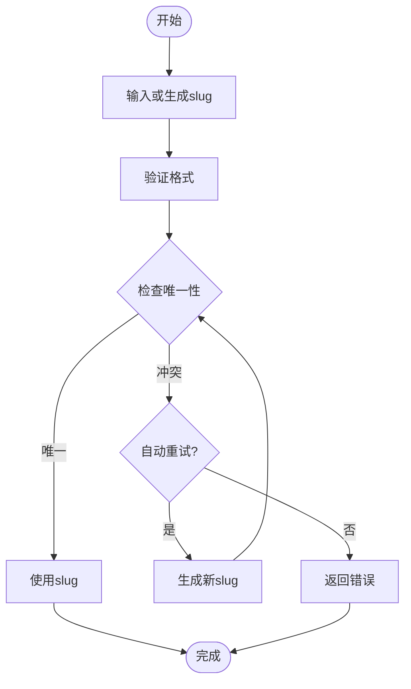

图表来源
- [backend/internal/slug/slug.go:15-33](file://backend/internal/slug/slug.go#L15-L33)
- [backend/internal/subscription/subscription.go:86-115](file://backend/internal/subscription/subscription.go#L86-L115)

章节来源
- [backend/internal/slug/slug.go:1-93](file://backend/internal/slug/slug.go#L1-L93)
- [backend/internal/subscription/subscription.go:86-115](file://backend/internal/subscription/subscription.go#L86-L115)

### 规则素材池同步系统（新增）
- 职责：**规则素材池的异步同步管理**，支持 URL 同步和手动添加，提供差量更新和来源隔离机制。
- 实现要点：
  - **异步任务 + 轮询模式**：提交同步任务后前端轮询状态查询端点，避免同步耗时超过前端请求超时。
  - **定时自动同步**：每个池可选开启定时自动同步，每日凌晨 04:00 低峰执行（UTC），停机错过不补偿。
  - **差量更新语义**：URL 同步仅对 url 来源条目做差量更新，既有条目 sort_order 不被改写，新增条目追加至 url 段末尾。
  - **来源隔离**：manual 来源条目永不受同步影响，确保手动编辑的内容不会被自动同步覆盖。
  - **批量处理**：支持数万行规模，使用去重索引 UNIQUE(pool_id, rule_type, match_value) 和事务批量 UPSERT。
  - **失败处理**：单个 URL 拉取/解析失败时保留旧数据，记录同步状态与原因，不影响池内其他 URL。
- 配置选项：同步超时（1分钟）、内容大小上限（50MB）、定时执行时刻（默认 UTC 04:00）。
- 使用方法：
  - 创建素材池：添加 URL 列表或手动规则条目。
  - 触发同步：手动点击「同步」按钮或等待定时任务执行。
  - 监控状态：通过轮询查询同步任务的执行状态和结果。
  - 管理条目：分页展示池内条目，支持排序和筛选。

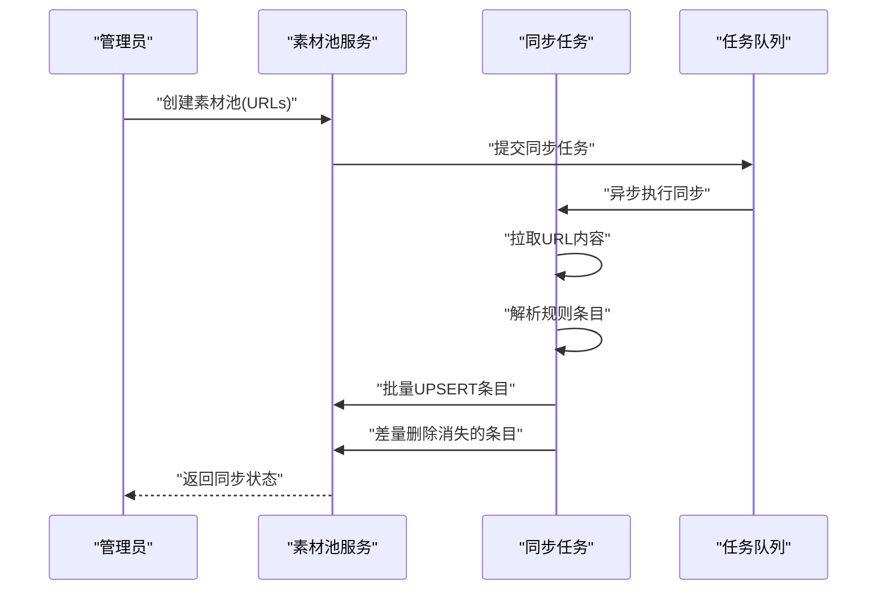

图表来源
- [Design2.md:54-61](file://Design2.md#L54-L61)

章节来源
- [Design2.md:54-61](file://Design2.md#L54-L61)

### 节点管理系统（增强版）
- 职责：**节点统一管理**，支持 manual 和 xray 两种来源，提供协议支持矩阵和智能分配规则。
- 实现要点：
  - **协议支持矩阵**：manual 节点支持 ClashOfficial 全量代理协议（ss 除外），xray 节点支持 vless/vmess/trojan/shadowsocks 四协议。
  - **命名约定**：Xray 节点采用 `{实例slug}-{入站tag}` 命名规范，如 `tokyo-a-vless`。
  - **分配规则**：allocatable=0 的节点禁止组分配、禁止 is_public、排除在推送与下载注入之外。
  - **协议可扩展注册**：维护协议注册表，支持表单 schema + SR 链接映射 + 敏感字段清单。
  - **凭据加密**：敏感字段（uuid/password/private-key 等）采用 AES-256-GCM 加密存储。
  - **动态检测**：Xray 节点通过 ListInbounds 检测入库，支持增量更新和缺失标记。
- 配置选项：协议注册表配置、加密密钥管理、Xray API 连接参数。
- 使用方法：
  - 手动添加节点：选择协议类型，填写节点参数。
  - 配置 Xray 实例：设置连接信息，触发节点检测。
  - 分配节点：将可用节点分配到用户组，设置优先级。
  - 管理凭据：编辑节点时仅修改需要更新的凭据字段。

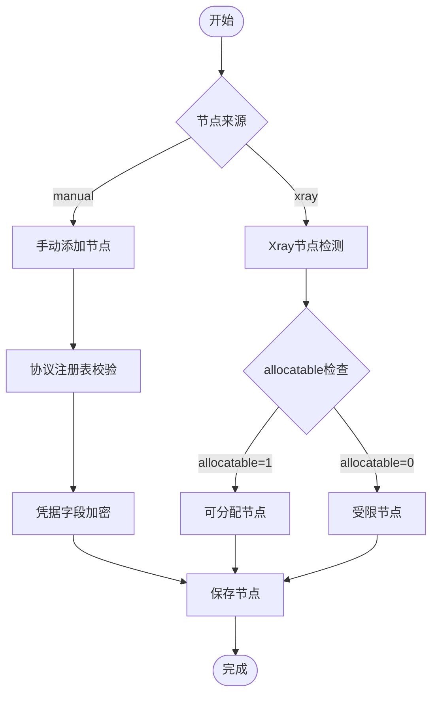

图表来源
- [Design2.md:75-87](file://Design2.md#L75-L87)

章节来源
- [Design2.md:75-87](file://Design2.md#L75-L87)

## 依赖关系分析
- server.go 作为装配中心，注入各 Service 并注册路由。
- subscription.go 依赖 version.go 进行版本管理，依赖 group.go 进行级联回调。
- rule.go 与 share.go 依赖 token.go 进行 Token 管理。
- auth.go 依赖 user.go 获取用户快照，依赖 config.go 获取签名密钥。
- platform.go 依赖 version.go 进行级联删除。
- oidc.go 依赖 config.go 存储参数，依赖 user.go 合并用户。
- **新增**：装配系统依赖规则素材池、Xray 实例管理、代理组管理。
- **新增**：所有资源创建都依赖 slug.go 进行标识生成和验证。

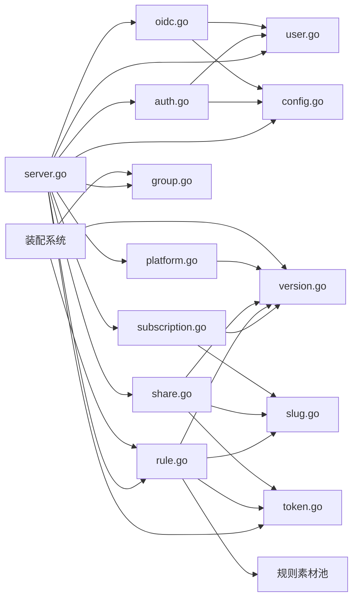

图表来源
- [backend/internal/server/server.go:63-157](file://backend/internal/server/server.go#L63-L157)

章节来源
- [backend/internal/server/server.go:63-157](file://backend/internal/server/server.go#L63-L157)

## 性能与可靠性
- 事务边界：关键操作使用 BEGIN IMMEDIATE 事务，确保一致性（如订阅创建、版本创建、Token 创建）。
- 文件操作：版本文件与安装包采用流式写入，限制大小，避免内存溢出。
- 并发安全：Token 创建冲突重试，安装包文件名 O_EXCL 防并发同名。
- 启动自检：版本 symlink 与 DB current_version 不一致时重建，保证一致性。
- 优雅退出：HTTP 服务支持信号驱动优雅退出，等待在途请求收尾。
- 应急模式：数据库损坏或迁移失败时进入应急模式，提供最小可用端点。
- **新增**：规则素材池批量同步、Xray API 调用限流、装配过程缓存优化。
- **新增**：标识生成冲突自动重试机制，最多重试3次。
- **新增**：失败回滚机制确保数据完整性，防止部分成功导致的脏数据。
- **新增**：异步任务 + 轮询模式提升长耗时操作的响应性。

章节来源
- [backend/internal/version/version.go:127-180](file://backend/internal/version/version.go#L127-L180)
- [backend/internal/platform/platform.go:269-334](file://backend/internal/platform/platform.go#L269-334)
- [backend/internal/token/token.go:48-88](file://backend/internal/token/token.go#L48-88)
- [backend/cmd/server/main.go:24-99](file://backend/cmd/server/main.go#L24-L99)
- [backend/internal/slug/slug.go:15-33](file://backend/internal/slug/slug.go#L15-L33)
- [Design2.md:54-61](file://Design2.md#L54-L61)

## 故障排查指南
- 数据库损坏：检查 main.go 应急模式分支，查看日志中的触发原因。
- 迁移失败：检查 migrations 目录，确认 SQL 文件完整性。
- 版本不一致：检查 version.go StartupCheck，确认 symlink 重建。
- Token 冲突：检查 token.go GetOrCreateUserToken 重试逻辑。
- 安装包上传失败：检查 platform.go UploadInstaller 文件大小限制与文件权限。
- 认证失败：检查 auth.go SessionMiddleware 凭据版本与用户状态。
- **新增**：规则素材池同步失败、Xray 连接超时、装配生成错误。
- **新增**：标识冲突问题：检查 slug.go 的冲突重试机制和日志输出。
- **新增**：数据一致性问题：检查 rollbackRecord 方法的执行情况和错误日志。
- **新增**：异步任务问题：检查任务队列状态和轮询端点响应。
- **新增**：节点分配问题：检查 allocatable 标记和协议支持矩阵。

章节来源
- [backend/cmd/server/main.go:108-127](file://backend/cmd/server/main.go#L108-L127)
- [backend/internal/version/version.go:438-484](file://backend/internal/version/version.go#L438-L484)
- [backend/internal/token/token.go:48-88](file://backend/internal/token/token.go#L48-88)
- [backend/internal/platform/platform.go:269-334](file://backend/internal/platform/platform.go#L269-334)
- [backend/internal/auth/auth.go:144-180](file://backend/internal/auth/auth.go#L144-L180)
- [backend/internal/slug/slug.go:15-33](file://backend/internal/slug/slug.go#L15-L33)
- [Design2.md:54-61](file://Design2.md#L54-L61)

## 结论
本系统通过清晰的分层架构与模块化设计，实现了订阅管理、认证授权、用户组、平台、规则、分享等核心功能。版本管理组件为多类资源提供一致的能力，Token 管理确保下载安全与生命周期可控。配置中心提供灵活的运行时配置与敏感数据保护。

**更新** 新增的规则素材池系统、Shadowrocket 双输出格式、增强配置组装和 Xray-core 高级模式集成，大幅提升了系统的功能完整性和用户体验。**特别重要的是**，规则素材池同步功能得到了显著改进，采用异步任务 + 轮询模式实现高效的数据同步，同时节点管理章节更新了协议支持矩阵和分配规则，提升了系统的灵活性和可扩展性。规则引擎功能的增强包括自动标识生成、事务一致性保证、失败回滚机制（rollbackRecord）确保数据完整性，以及跨四类资源的全局唯一性校验，这些改进显著提高了系统的可靠性和数据一致性。整体设计注重事务一致性、文件操作安全与系统可靠性，适合团队自托管部署与日常运维。

## 附录：API 调用示例
以下为常见 API 调用示例（基于后端路由与 Service 方法）：

- 本地登录
  - POST /api/auth/login
  - 请求体：{ "email": "user@example.com", "password": "yourpassword" }
  - 响应：{ "token": "...", "expires": "..." }
  - 参考：[backend/internal/auth/auth.go:98-135](file://backend/internal/auth/auth.go#L98-L135), [backend/internal/user/user.go:170-187](file://backend/internal/user/user.go#L170-L187)

- 创建订阅
  - POST /api/admin/subscriptions
  - 请求体：{ "platform_id": 1, "name": "My Subscription", "slug": "my-sub", "group_ids": [1], "content": "..." }
  - 响应：{ "id": 1, "slug": "my-sub", "current_version": 1 }
  - 参考：[backend/internal/subscription/subscription.go:166-231](file://backend/internal/subscription/subscription.go#L166-L231), [backend/internal/version/version.go:127-180](file://backend/internal/version/version.go#L127-L180)

- 切换版本
  - PUT /api/admin/subscriptions/:id/versions/:versionNo
  - 响应：{ "message": "success" }
  - 参考：[backend/internal/version/version.go:218-245](file://backend/internal/version/version.go#L218-L245)

- 获取用户下载 Token
  - GET /api/home/token?platform_id=1&custom_sub_id=0&subscription_id=0
  - 响应：{ "token": "...", "user_id": 1, "platform_id": 1 }
  - 参考：[backend/internal/token/token.go:48-88](file://backend/internal/token/token.go#L48-88)

- 创建分享订阅
  - POST /api/admin/shares
  - 请求体：{ "name": "Public Share", "content": "..." }
  - 响应：{ "id": 1, "slug": "share-abc123", "token": "...", "current_version": 1 }
  - 参考：[backend/internal/share/share.go:48-83](file://backend/internal/share/share.go#L48-L83)

- 刷新规则 Token
  - PUT /api/admin/rules/:id/token
  - 响应：{ "token": "..." }
  - 参考：[backend/internal/rule/rule.go:131-134](file://backend/internal/rule/rule.go#L131-L134), [backend/internal/token/token.go:210-224](file://backend/internal/token/token.go#L210-L224)

- 平台安装包上传
  - POST /api/admin/platforms/:id/installer
  - 表单字段：file
  - 响应：{ "message": "success" }
  - 参考：[backend/internal/platform/platform.go:269-334](file://backend/internal/platform/platform.go#L269-334)

- **新增**：创建规则素材池
  - POST /api/admin/rule-pools
  - 请求体：{ "name": "Apple Domains", "urls": ["https://example.com/rules.txt"] }
  - 响应：{ "id": 1, "name": "Apple Domains", "sync_status": "pending" }

- **新增**：同步规则素材池
  - POST /api/admin/rule-pools/:id/sync
  - 响应：{ "synced_count": 150, "status": "success" }

- **新增**：查询同步任务状态
  - GET /api/admin/rule-pools/:id/sync/status
  - 响应：{ "task_id": "abc123", "status": "running", "progress": 0.5 }

- **新增**：生成 Shadowrocket 订阅
  - POST /api/admin/assemble/sr-subs
  - 请求体：{ "template_id": 1, "node_ids": [1,2,3], "headers": {"STATUS": "OK", "REMARKS": "Custom"} }
  - 响应：{ "content": "base64_encoded_content", "format": "sr-subs" }

- **新增**：标识可用性检查
  - GET /api/admin/slug/check?slug=my-rule&type=rules&id=0
  - 响应：{ "available": true }
  - 参考：[backend/internal/subscription/subscription.go:86-115](file://backend/internal/subscription/subscription.go#L86-L115)

- **新增**：节点分配管理
  - POST /api/admin/groups/:id/nodes
  - 请求体：{ "node_ids": [1,2,3], "order": [1,2,3] }
  - 响应：{ "message": "节点分配成功" }

章节来源
- [backend/internal/auth/auth.go:98-135](file://backend/internal/auth/auth.go#L98-L135)
- [backend/internal/user/user.go:170-187](file://backend/internal/user/user.go#L170-L187)
- [backend/internal/subscription/subscription.go:166-231](file://backend/internal/subscription/subscription.go#L166-L231)
- [backend/internal/version/version.go:218-245](file://backend/internal/version/version.go#L218-L245)
- [backend/internal/token/token.go:48-88](file://backend/internal/token/token.go#L48-88)
- [backend/internal/share/share.go:48-83](file://backend/internal/share/share.go#L48-L83)
- [backend/internal/rule/rule.go:131-134](file://backend/internal/rule/rule.go#L131-L134)
- [backend/internal/token/token.go:210-224](file://backend/internal/token/token.go#L210-L224)
- [backend/internal/platform/platform.go:269-334](file://backend/internal/platform/platform.go#L269-334)
- [backend/internal/subscription/subscription.go:86-115](file://backend/internal/subscription/subscription.go#L86-L115)
- [Design2.md:54-61](file://Design2.md#L54-L61)