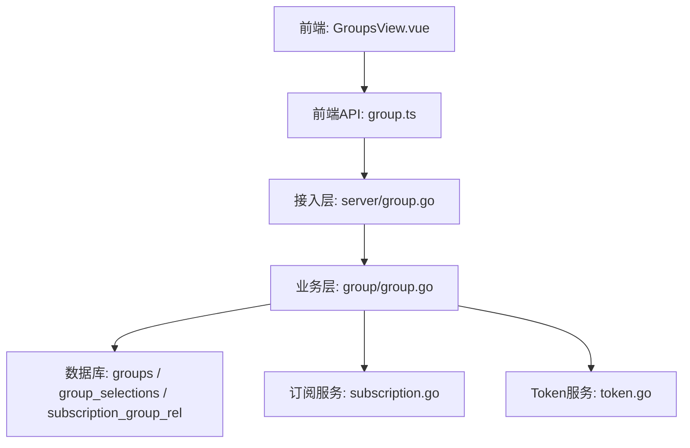
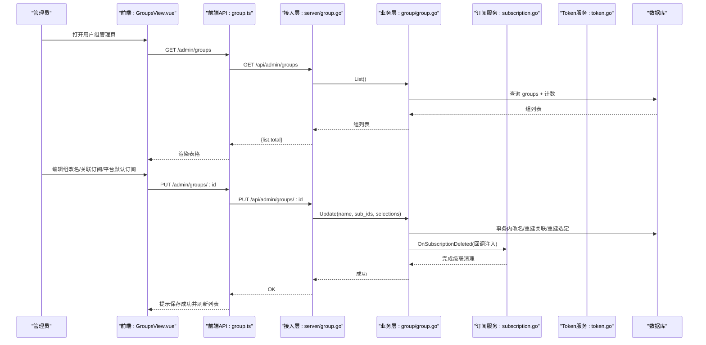
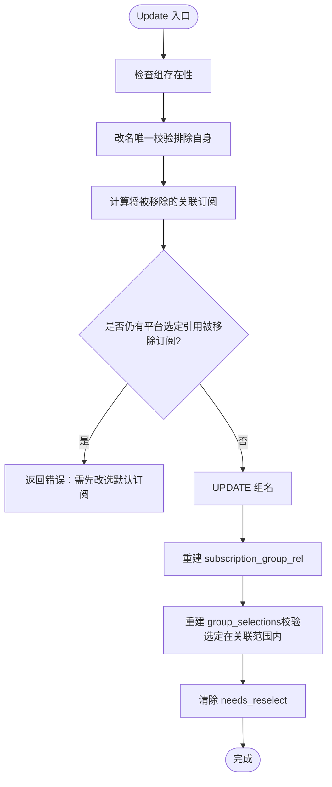
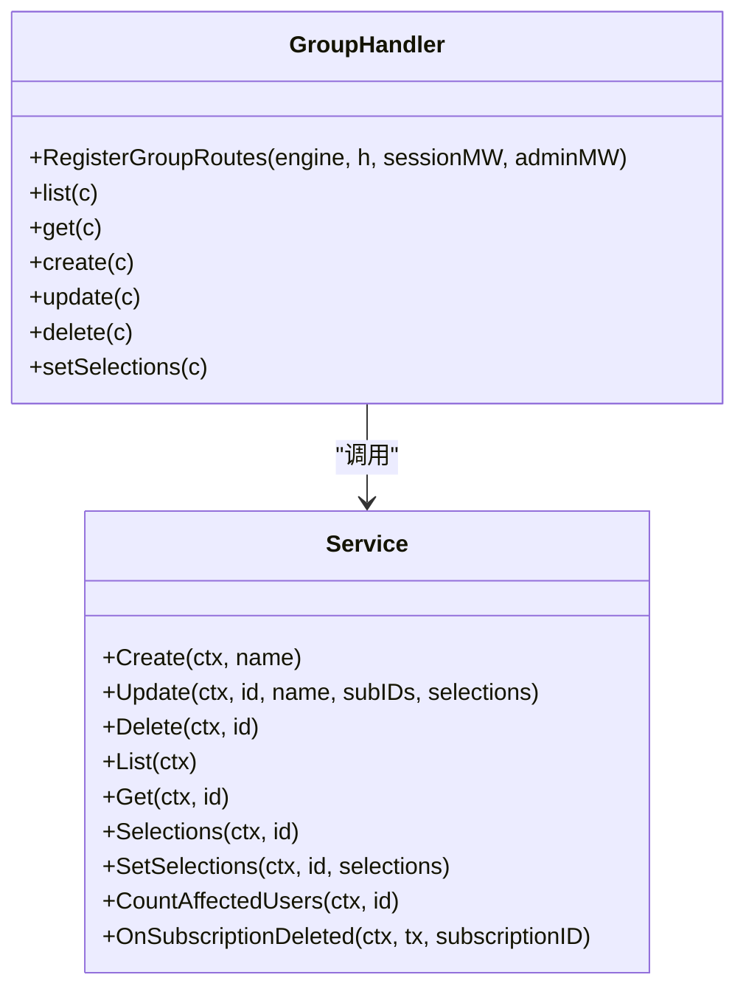
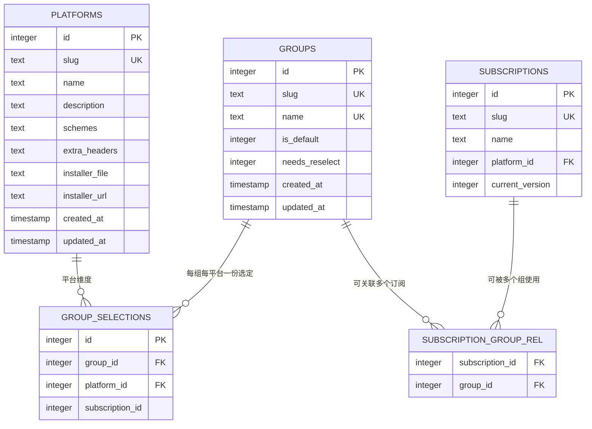
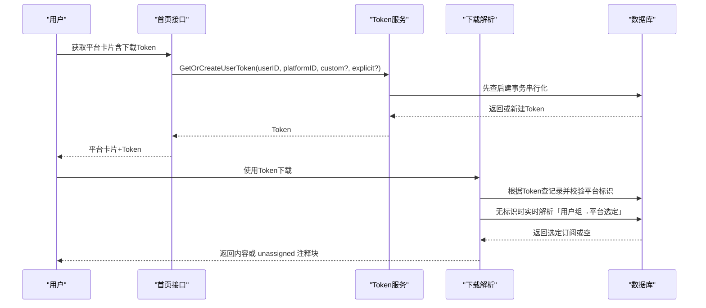
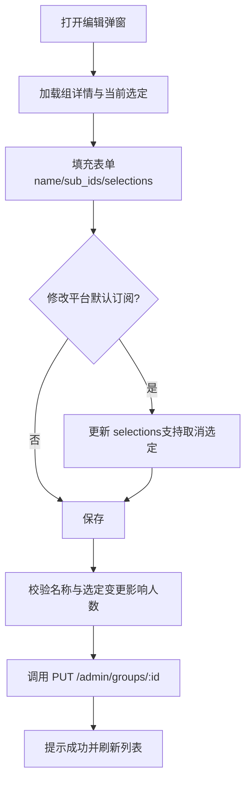
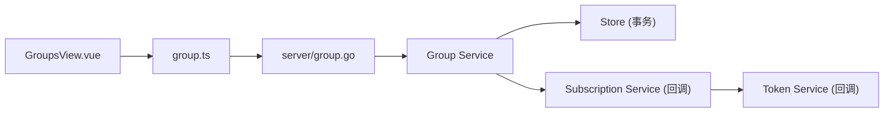

# 用户组管理

<cite>
**本文引用的文件**
- [backend/internal/group/group.go](file://backend/internal/group/group.go)
- [backend/internal/server/group.go](file://backend/internal/server/group.go)
- [backend/internal/subscription/subscription.go](file://backend/internal/subscription/subscription.go)
- [backend/internal/token/token.go](file://backend/internal/token/token.go)
- [backend/migrations/0003_groups_platforms.sql](file://backend/migrations/0003_groups_platforms.sql)
- [backend/migrations/1003_groups.sql](file://backend/migrations/1003_groups.sql)
- [frontend/src/api/group.ts](file://frontend/src/api/group.ts)
- [frontend/src/views/admin/GroupsView.vue](file://frontend/src/views/admin/GroupsView.vue)
</cite>

## 目录
1. [简介](#简介)
2. [项目结构](#项目结构)
3. [核心组件](#核心组件)
4. [架构总览](#架构总览)
5. [详细组件分析](#详细组件分析)
6. [依赖关系分析](#依赖关系分析)
7. [性能与一致性](#性能与一致性)
8. [故障排查指南](#故障排查指南)
9. [结论](#结论)
10. [附录：API 调用示例](#附录api-调用示例)

## 简介
本系统提供“用户组”管理能力，用于按平台维度为不同用户组分配订阅内容。管理员可创建、编辑、删除用户组；为每个组在每个平台设置“默认订阅”（即该组的平台级访问控制）；当订阅被删除或不再可用时，系统会提示需要重新选择。用户通过所属组继承平台的订阅访问权限，下载 Token 在解析时实时读取当前组选定结果，无需刷新 Token。

## 项目结构
围绕用户组管理的代码主要分布在后端服务层、接入层、数据库迁移以及前端管理界面中：
- 业务层：用户组服务负责组 CRUD、每平台选定、关联约束与级联清理。
- 接入层：HTTP 路由将请求映射到业务方法，并统一错误码映射。
- 数据层：groups、group_selections、subscription_group_rel 等表定义与索引。
- 前端：管理页面提供新建、编辑（改名/关联范围/平台默认订阅）、删除等操作。

图表来源
- [backend/internal/server/group.go:18-27](file://backend/internal/server/group.go#L18-L27)
- [backend/internal/group/group.go:24-32](file://backend/internal/group/group.go#L24-L32)
- [backend/migrations/0003_groups_platforms.sql:1-23](file://backend/migrations/0003_groups_platforms.sql#L1-L23)
- [backend/migrations/1003_groups.sql:6-16](file://backend/migrations/1003_groups.sql#L6-L16)
- [frontend/src/views/admin/GroupsView.vue:1-30](file://frontend/src/views/admin/GroupsView.vue#L1-L30)
- [frontend/src/api/group.ts:23-35](file://frontend/src/api/group.ts#L23-L35)

章节来源
- [backend/internal/server/group.go:18-27](file://backend/internal/server/group.go#L18-L27)
- [backend/internal/group/group.go:24-32](file://backend/internal/group/group.go#L24-L32)
- [backend/migrations/0003_groups_platforms.sql:1-23](file://backend/migrations/0003_groups_platforms.sql#L1-L23)
- [backend/migrations/1003_groups.sql:6-16](file://backend/migrations/1003_groups.sql#L6-L16)
- [frontend/src/views/admin/GroupsView.vue:1-30](file://frontend/src/views/admin/GroupsView.vue#L1-L30)
- [frontend/src/api/group.ts:23-35](file://frontend/src/api/group.ts#L23-L35)

## 核心组件
- 用户组服务（Service）：实现组的创建、更新（改名+关联订阅多选+每平台选定）、删除（迁入默认组）、列表查询、详情回显、每平台选定管理、受影响用户数统计、订阅删除时的级联处理。
- 接入层处理器（Handler）：注册 REST 路由，参数校验、错误映射、返回统一格式。
- 订阅服务：维护订阅与组的关联，支持删除订阅时触发组选定清理与 needs_reselect 标记。
- Token 服务：三态复用键的生成、轮替与生命周期联动；无标识 Token 在下载时实时解析「用户所属组 → 平台选定订阅」。
- 数据库模型：groups、platforms、group_selections、subscription_group_rel 等表及约束、索引。

章节来源
- [backend/internal/group/group.go:24-32](file://backend/internal/group/group.go#L24-L32)
- [backend/internal/server/group.go:18-27](file://backend/internal/server/group.go#L18-L27)
- [backend/internal/subscription/subscription.go:28-41](file://backend/internal/subscription/subscription.go#L28-L41)
- [backend/internal/token/token.go:19-46](file://backend/internal/token/token.go#L19-L46)
- [backend/migrations/0003_groups_platforms.sql:1-23](file://backend/migrations/0003_groups_platforms.sql#L1-L23)
- [backend/migrations/1003_groups.sql:6-16](file://backend/migrations/1003_groups.sql#L6-L16)

## 架构总览
下图展示了从前端到后端的完整调用链，包括组管理、订阅关联、平台选定与下载解析的关键路径。

图表来源
- [backend/internal/server/group.go:18-27](file://backend/internal/server/group.go#L18-L27)
- [backend/internal/group/group.go:82-141](file://backend/internal/group/group.go#L82-L141)
- [backend/internal/subscription/subscription.go:276-332](file://backend/internal/subscription/subscription.go#L276-L332)
- [backend/internal/token/token.go:48-88](file://backend/internal/token/token.go#L48-L88)

## 详细组件分析

### 用户组服务（Group Service）
职责与关键点：
- 创建：名称全局唯一校验，自动生成 slug（group-前缀），写入 groups 表。
- 更新：改名唯一校验；重建 subscription_group_rel（组与订阅的多对多关联）；重建 group_selections（每组每平台至多一份选定，subscription_id=0 表示取消选定）；完成后清除 needs_reselect。
- 删除：默认组不可删；非默认组删除时，组内用户自动迁入默认组；关联与选定由外键 CASCADE 清理。
- 列表/详情：返回基础信息、needs_reselect、关联订阅数、组内用户数；详情包含当前每平台选定。
- 每平台选定：SetSelections 批量设置，校验选定必须在关联范围内；完成后清除 needs_reselect。
- 订阅删除级联：OnSubscriptionDeleted 清理选定与关联，并对受影响组置 needs_reselect。

图表来源
- [backend/internal/group/group.go:82-141](file://backend/internal/group/group.go#L82-L141)
- [backend/internal/group/group.go:155-203](file://backend/internal/group/group.go#L155-L203)

章节来源
- [backend/internal/group/group.go:51-80](file://backend/internal/group/group.go#L51-L80)
- [backend/internal/group/group.go:82-141](file://backend/internal/group/group.go#L82-L141)
- [backend/internal/group/group.go:179-220](file://backend/internal/group/group.go#L179-L220)
- [backend/internal/group/group.go:222-248](file://backend/internal/group/group.go#L222-L248)
- [backend/internal/group/group.go:250-326](file://backend/internal/group/group.go#L250-L326)
- [backend/internal/group/group.go:328-364](file://backend/internal/group/group.go#L328-L364)

### 接入层（Group Handler）
- 路由注册：所有端点叠加会话与管理员中间件，确保仅管理员可操作。
- 列表/详情：GET /api/admin/groups 与 GET /api/admin/groups/:id，后者返回组信息与当前每平台选定。
- 创建/更新/删除：POST/PUT/DELETE 对应组 CRUD，参数校验与错误映射。
- 每平台选定：PUT /api/admin/groups/:id/selections，入参为 [{platform_id, subscription_id}]。

图表来源
- [backend/internal/server/group.go:18-27](file://backend/internal/server/group.go#L18-L27)
- [backend/internal/server/group.go:29-168](file://backend/internal/server/group.go#L29-L168)
- [backend/internal/group/group.go:24-32](file://backend/internal/group/group.go#L24-L32)

章节来源
- [backend/internal/server/group.go:18-27](file://backend/internal/server/group.go#L18-L27)
- [backend/internal/server/group.go:29-168](file://backend/internal/server/group.go#L29-L168)

### 订阅服务与组关联
- 订阅与组的多对多关联：subscription_group_rel 表维护订阅可被哪些组使用。
- 订阅删除级联：删除订阅时，清理关联与选定，并将受影响组标记 needs_reselect。
- 列表增强：订阅列表包含关联组与被多少组选定中的数量。

图表来源
- [backend/migrations/0003_groups_platforms.sql:1-23](file://backend/migrations/0003_groups_platforms.sql#L1-L23)
- [backend/migrations/1003_groups.sql:6-16](file://backend/migrations/1003_groups.sql#L6-L16)
- [backend/internal/subscription/subscription.go:353-429](file://backend/internal/subscription/subscription.go#L353-L429)

章节来源
- [backend/internal/subscription/subscription.go:165-231](file://backend/internal/subscription/subscription.go#L165-L231)
- [backend/internal/subscription/subscription.go:276-332](file://backend/internal/subscription/subscription.go#L276-L332)
- [backend/internal/subscription/subscription.go:353-429](file://backend/internal/subscription/subscription.go#L353-L429)

### Token 服务与权限继承
- 三态复用键：无标识（user+platform，下载时实时解析「用户所属组 → 平台选定」）、自定义（user+platform+custom_sub_id）、显式（user+platform+subscription_id）。
- 并发安全：BEGIN IMMEDIATE 事务内先查后建，冲突重试。
- 生命周期联动：上传/覆盖自定义订阅时删除该用户该平台无标识 Token；删除订阅时级联删除指向它的 Token；角色降级清显式 Token；禁用用户同事务递增 credential_version 并物理删除全部 Token。
- 下载解析：URL 平台标识必须与 Token 绑定一致；未分配返回 HTTP 200 + 纯文本注释块；无效 Token 返回 404。

图表来源
- [backend/internal/token/token.go:48-88](file://backend/internal/token/token.go#L48-L88)
- [backend/internal/token/token.go:90-156](file://backend/internal/token/token.go#L90-L156)
- [backend/internal/token/token.go:158-244](file://backend/internal/token/token.go#L158-L244)

章节来源
- [backend/internal/token/token.go:19-46](file://backend/internal/token/token.go#L19-L46)
- [backend/internal/token/token.go:48-88](file://backend/internal/token/token.go#L48-L88)
- [backend/internal/token/token.go:90-156](file://backend/internal/token/token.go#L90-L156)
- [backend/internal/token/token.go:158-244](file://backend/internal/token/token.go#L158-L244)

### 前端管理界面
- 列表展示：显示组名、是否默认组、是否需要重新设置、关联订阅数、组内用户数。
- 编辑弹窗：支持改名、选择关联订阅（多选）、为每个平台设置默认订阅（subscription_id=0 表示不选定）。
- 新建/删除：新建组时校验名称；删除组时提示成员将迁入默认组。

图表来源
- [frontend/src/views/admin/GroupsView.vue:44-121](file://frontend/src/views/admin/GroupsView.vue#L44-L121)
- [frontend/src/views/admin/GroupsView.vue:123-165](file://frontend/src/views/admin/GroupsView.vue#L123-L165)
- [frontend/src/api/group.ts:23-35](file://frontend/src/api/group.ts#L23-L35)

章节来源
- [frontend/src/views/admin/GroupsView.vue:1-30](file://frontend/src/views/admin/GroupsView.vue#L1-L30)
- [frontend/src/views/admin/GroupsView.vue:44-121](file://frontend/src/views/admin/GroupsView.vue#L44-L121)
- [frontend/src/views/admin/GroupsView.vue:123-165](file://frontend/src/views/admin/GroupsView.vue#L123-L165)
- [frontend/src/api/group.ts:23-35](file://frontend/src/api/group.ts#L23-L35)

## 依赖关系分析
- 耦合与内聚：
  - Group Service 与 Store/Logger 解耦，通过依赖注入；与 Subscription Service 通过回调避免包级循环依赖。
  - Token Service 与 Download 解析逻辑分离，保证下载端点只负责协议与限流。
- 直接/间接依赖：
  - Group Service 依赖 Store 的事务能力；Subscription Service 通过回调触发 Group Service 的 OnSubscriptionDeleted。
  - 前端通过 group.ts 封装 API，GroupsView.vue 调用这些函数进行 UI 交互。
- 外部集成点：
  - 数据库迁移定义表结构与约束；Token 服务依赖加密随机值生成；下载端点依赖限流与访问日志。

图表来源
- [backend/internal/group/group.go:24-32](file://backend/internal/group/group.go#L24-L32)
- [backend/internal/subscription/subscription.go:28-41](file://backend/internal/subscription/subscription.go#L28-L41)
- [backend/internal/token/token.go:19-46](file://backend/internal/token/token.go#L19-L46)
- [frontend/src/views/admin/GroupsView.vue:1-30](file://frontend/src/views/admin/GroupsView.vue#L1-L30)
- [frontend/src/api/group.ts:23-35](file://frontend/src/api/group.ts#L23-L35)
- [backend/internal/server/group.go:18-27](file://backend/internal/server/group.go#L18-L27)

章节来源
- [backend/internal/group/group.go:24-32](file://backend/internal/group/group.go#L24-L32)
- [backend/internal/subscription/subscription.go:28-41](file://backend/internal/subscription/subscription.go#L28-L41)
- [backend/internal/token/token.go:19-46](file://backend/internal/token/token.go#L19-L46)
- [frontend/src/views/admin/GroupsView.vue:1-30](file://frontend/src/views/admin/GroupsView.vue#L1-L30)
- [frontend/src/api/group.ts:23-35](file://frontend/src/api/group.ts#L23-L35)
- [backend/internal/server/group.go:18-27](file://backend/internal/server/group.go#L18-L27)

## 性能与一致性
- 事务一致性：组更新、订阅删除级联、Token 创建均使用 BEGIN IMMEDIATE 事务，保证并发安全与原子性。
- 查询优化：group_selections 建立 platform_id 与 subscription_id 索引，提升按平台与订阅的查询效率。
- 批量操作：更新组时一次性重建关联与选定，减少多次往返；前端批量设置平台默认订阅。
- 下载解析：无标识 Token 实时解析，避免缓存不一致；未分配返回轻量注释块，降低带宽。

章节来源
- [backend/internal/group/group.go:82-141](file://backend/internal/group/group.go#L82-L141)
- [backend/internal/subscription/subscription.go:276-332](file://backend/internal/subscription/subscription.go#L276-L332)
- [backend/internal/token/token.go:48-88](file://backend/internal/token/token.go#L48-L88)
- [backend/migrations/1003_groups.sql:6-16](file://backend/migrations/1003_groups.sql#L6-L16)

## 故障排查指南
- 组名冲突：创建或更新组时若名称重复，返回 409；请更换名称。
- 订阅仍在选定中：尝试取消关联订阅但仍有平台选定引用该订阅，需先在平台默认订阅区改选或删除。
- 选定不在关联范围：设置平台默认订阅时，所选订阅必须属于该组关联范围，否则拒绝。
- 默认组不可删除：预置默认组禁止删除；如需调整，请先创建新默认组并迁移用户。
- 订阅删除导致 needs_reselect：订阅被删除后，相关组的 needs_reselect 会被置位，需在编辑弹窗中重新设置平台默认订阅。
- Token 无效或未分配：下载时若 URL 平台标识与 Token 不一致或 Token 无效，返回 404；若组未选定该平台订阅，返回 200 + 注释块。

章节来源
- [backend/internal/server/group.go:62-117](file://backend/internal/server/group.go#L62-L117)
- [backend/internal/server/group.go:119-168](file://backend/internal/server/group.go#L119-L168)
- [backend/internal/group/group.go:51-80](file://backend/internal/group/group.go#L51-L80)
- [backend/internal/group/group.go:82-141](file://backend/internal/group/group.go#L82-L141)
- [backend/internal/group/group.go:222-248](file://backend/internal/group/group.go#L222-L248)
- [backend/internal/group/group.go:328-364](file://backend/internal/group/group.go#L328-L364)

## 结论
用户组管理系统通过清晰的三层架构（接入层、业务层、数据层）实现了组级别的订阅访问控制与权限继承。管理员可灵活地为每个组在每个平台设置默认订阅，系统在订阅变更时自动维护一致性并提示重新选择。Token 机制确保下载链接稳定且具备实时解析能力，无需频繁刷新。整体设计兼顾了易用性、一致性与可扩展性。

## 附录：API 调用示例
以下示例基于后端路由与前端封装，展示常用操作的请求与响应结构。

- 列出用户组
  - 方法：GET
  - 路径：/api/admin/groups
  - 说明：返回组列表，包含组名、是否默认组、是否需要重新设置、关联订阅数、组内用户数。
  - 参考：[backend/internal/server/group.go:29-36](file://backend/internal/server/group.go#L29-L36)

- 获取用户组详情（编辑回显）
  - 方法：GET
  - 路径：/api/admin/groups/:id
  - 说明：返回组基础信息与当前每平台选定。
  - 参考：[backend/internal/server/group.go:38-60](file://backend/internal/server/group.go#L38-L60)

- 创建用户组
  - 方法：POST
  - 路径：/api/admin/groups
  - 请求体：{ name }
  - 说明：名称全局唯一，成功后返回创建的组。
  - 参考：[backend/internal/server/group.go:62-80](file://backend/internal/server/group.go#L62-L80)

- 更新用户组（改名 + 关联订阅 + 每平台选定）
  - 方法：PUT
  - 路径：/api/admin/groups/:id
  - 请求体：{ name, sub_ids, selections }
  - 说明：sub_ids 为可选关联订阅；selections 为 [{ platform_id, subscription_id }]，subscription_id=0 表示取消选定。
  - 参考：[backend/internal/server/group.go:82-117](file://backend/internal/server/group.go#L82-L117)

- 设置每平台选定
  - 方法：PUT
  - 路径：/api/admin/groups/:id/selections
  - 请求体：{ selections }
  - 说明：批量设置平台默认订阅，完成后清除 needs_reselect。
  - 参考：[backend/internal/server/group.go:140-168](file://backend/internal/server/group.go#L140-L168)

- 删除用户组
  - 方法：DELETE
  - 路径：/api/admin/groups/:id
  - 说明：默认组不可删；非默认组删除时，组内用户自动迁入默认组。
  - 参考：[backend/internal/server/group.go:119-138](file://backend/internal/server/group.go#L119-L138)

- 前端调用封装
  - 列表：listGroups()
  - 详情：getGroup(id)
  - 创建：createGroup(name)
  - 更新：updateGroup(id, { name, sub_ids, selections })
  - 删除：deleteGroup(id)
  - 设定选定：setSelections(id, selections)
  - 参考：[frontend/src/api/group.ts:23-35](file://frontend/src/api/group.ts#L23-L35)

章节来源
- [backend/internal/server/group.go:29-168](file://backend/internal/server/group.go#L29-L168)
- [frontend/src/api/group.ts:23-35](file://frontend/src/api/group.ts#L23-L35)