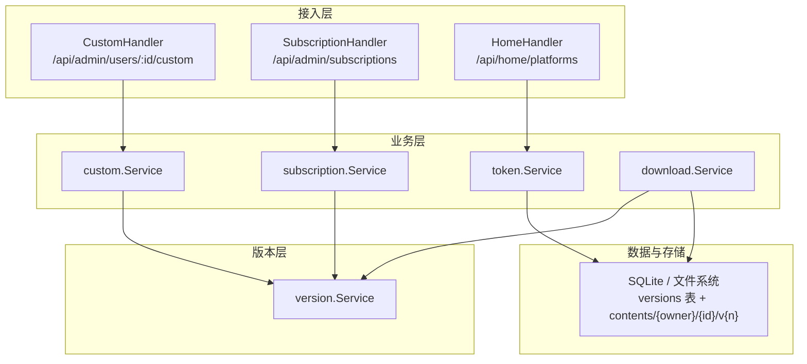
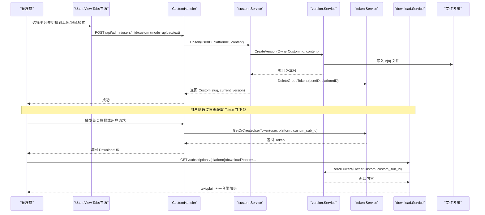
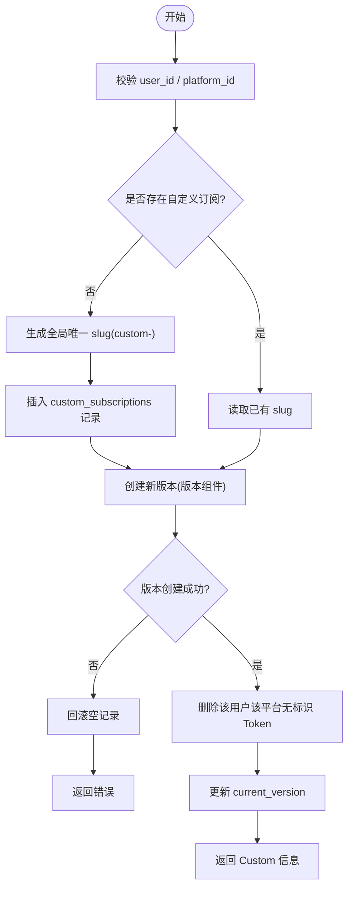
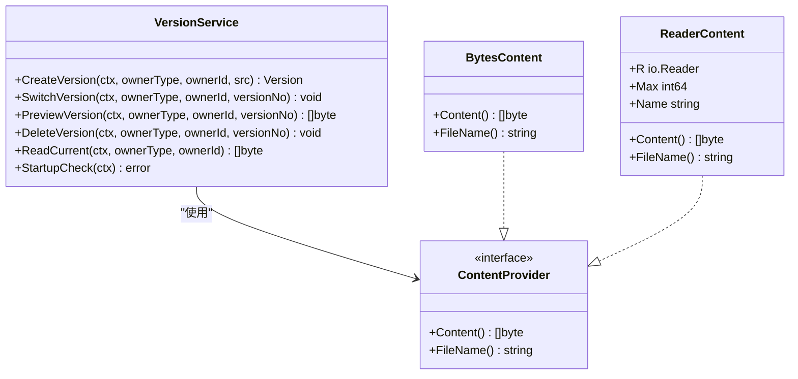
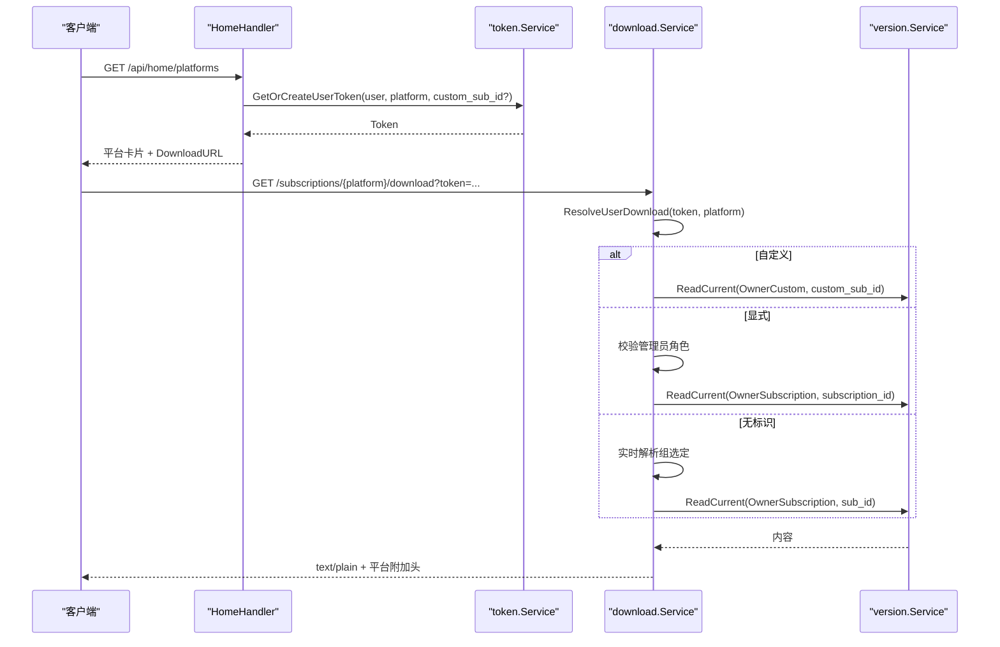
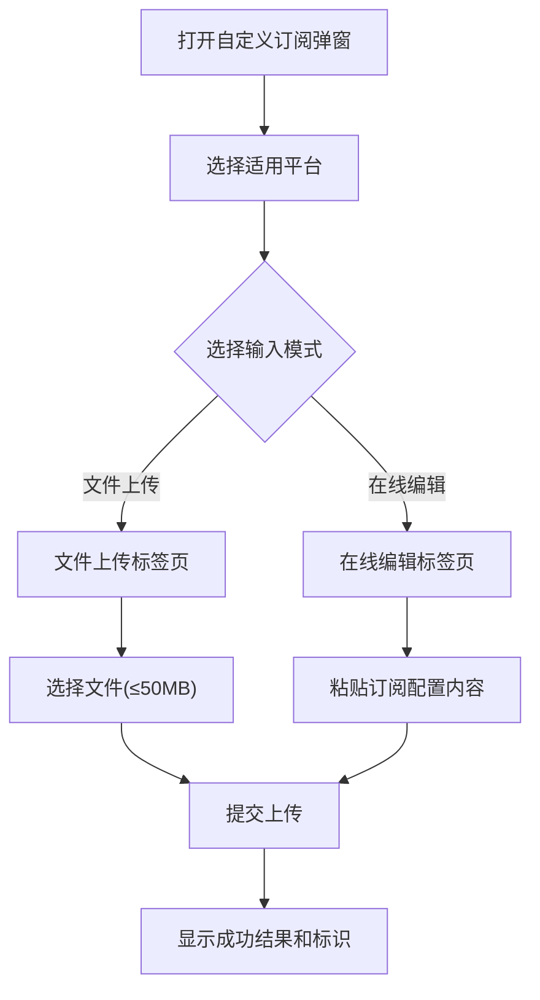
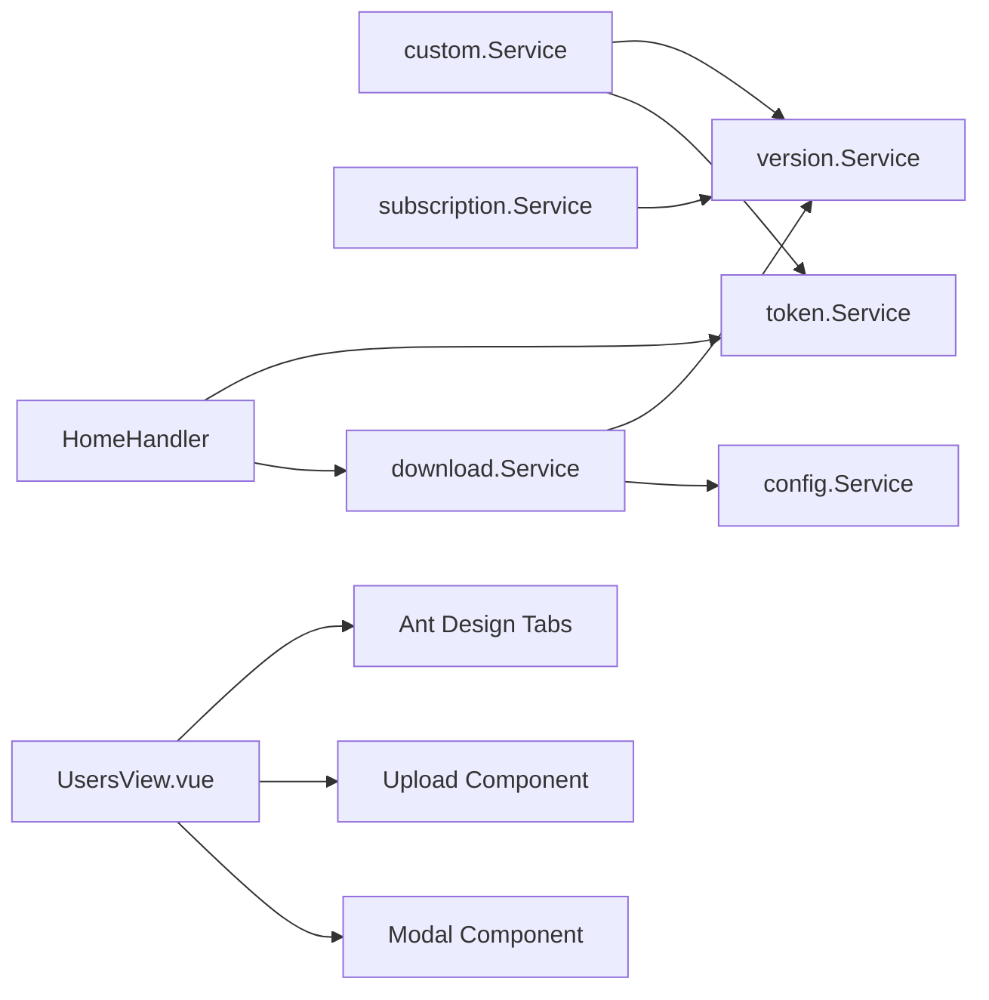
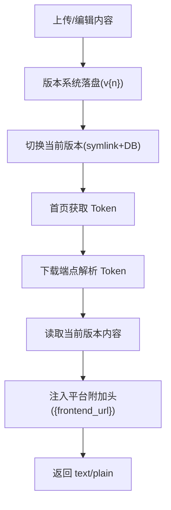

# 自定义订阅

<cite>
**本文引用的文件**
- [backend/internal/custom/custom.go](file://backend/internal/custom/custom.go)
- [backend/internal/server/custom.go](file://backend/internal/server/custom.go)
- [backend/internal/subscription/subscription.go](file://backend/internal/subscription/subscription.go)
- [backend/internal/server/subscription.go](file://backend/internal/server/subscription.go)
- [backend/internal/version/version.go](file://backend/internal/version/version.go)
- [backend/internal/token/token.go](file://backend/internal/token/token.go)
- [backend/internal/download/download.go](file://backend/internal/download/download.go)
- [backend/internal/server/home.go](file://backend/internal/server/home.go)
- [frontend/src/api/custom.ts](file://frontend/src/api/custom.ts)
- [frontend/src/views/admin/UsersView.vue](file://frontend/src/views/admin/UsersView.vue)
- [frontend/src/views/admin/VersionManageView.vue](file://frontend/src/views/admin/VersionManageView.vue)
- [Design1.md](file://Design1.md)
- [Build2.md](file://Build2.md)
</cite>

## 更新摘要
**变更内容**
- 更新了自定义订阅创建界面的UI组件说明，从Radio.Group迁移到Ant Design Vue Tabs组件
- 增强了用户界面一致性相关的文档描述
- 添加了新的UI交互流程说明
- 更新了前端组件架构图表

## 目录
1. [简介](#简介)
2. [项目结构](#项目结构)
3. [核心组件](#核心组件)
4. [架构总览](#架构总览)
5. [详细组件分析](#详细组件分析)
6. [依赖关系分析](#依赖关系分析)
7. [性能与容量](#性能与容量)
8. [故障排查指南](#故障排查指南)
9. [结论](#结论)
10. [附录：模板与变量、调试与最佳实践](#附录模板与变量调试与最佳实践)

## 简介
本文件面向"自定义订阅"能力，系统性说明其创建机制、与普通订阅的区别、版本管理与下载分发流程，以及模板与变量的工作方式。重点覆盖：
- 自定义订阅的创建、覆盖、删除与版本管理
- 自定义订阅与普通订阅在 Token 解析、优先级、生命周期上的差异
- 内容存储、当前版本切换、预览与下载链路
- 模板变量与渲染：平台级附加响应头中的占位符替换
- 模板调试与测试方法、设计最佳实践与性能优化建议

**最新更新**：自定义订阅创建界面已进行UI一致性改进，将 Radio.Group 组件重构为 Ant Design Vue 的 Tabs 组件，提供了更直观的标签式界面来切换文件上传和在线编辑模式，显著提升了用户体验的一致性。

## 项目结构
后端围绕"资源—版本—Token—下载"四层组织：
- 资源层：custom（自定义订阅）、subscription（普通订阅）
- 版本层：version（统一版本管理，含文件落盘、当前指针、驱逐策略）
- Token 层：token（三态复用键、刷新、生命周期联动）
- 下载层：download（按 Token 解析目标内容、注入平台级响应头、访问日志）
- 接入层：server/*（HTTP 路由、鉴权中间件、参数校验、错误映射）
- 前端：api/custom.ts 提供上传/文本模式/删除等接口封装，UsersView.vue 提供统一的标签式创建界面

图表来源
- [backend/internal/server/custom.go:21-32](file://backend/internal/server/custom.go#L21-L32)
- [backend/internal/server/subscription.go:21-38](file://backend/internal/server/subscription.go#L21-L38)
- [backend/internal/server/home.go:37-43](file://backend/internal/server/home.go#L37-L43)
- [backend/internal/custom/custom.go:23-33](file://backend/internal/custom/custom.go#L23-L33)
- [backend/internal/subscription/subscription.go:28-41](file://backend/internal/subscription/subscription.go#L28-L41)
- [backend/internal/token/token.go:19-27](file://backend/internal/token/token.go#L19-L27)
- [backend/internal/download/download.go:25-35](file://backend/internal/download/download.go#L25-L35)
- [backend/internal/version/version.go:50-59](file://backend/internal/version/version.go#L50-L59)

章节来源
- [backend/internal/server/custom.go:21-32](file://backend/internal/server/custom.go#L21-L32)
- [backend/internal/server/subscription.go:21-38](file://backend/internal/server/subscription.go#L21-L38)
- [backend/internal/server/home.go:37-43](file://backend/internal/server/home.go#L37-L43)

## 核心组件
- custom.Service：负责"每用户每平台最多一份"的自定义订阅创建/覆盖、删除、列表查询；覆盖时复用记录与标识，仅创建新版本，并清理该用户该平台原有的无标识 Token。
- subscription.Service：普通订阅池的 CRUD、跨四类资源的标识唯一性校验、关联组、版本首建与级联删除。
- version.Service：四类资源共享的版本管理，包含最大版本数限制、原子切换、启动自检、预览、读取当前版本、驱逐最旧版本等。
- token.Service：用户下载 Token 的三态模型（无标识/自定义/显式），并发安全的首建（先查后建）、刷新轮替、生命周期联动（删订阅/删自定义/角色降级/禁用用户）。
- download.Service：按 Token 解析目标内容（优先自定义→显式→组选定），注入平台级附加响应头（含 {frontend_url} 占位符替换），写访问日志。
- server/*：HTTP 路由与参数校验、错误码映射、管理员与会话中间件叠加。
- **前端UI组件**：UsersView.vue 提供统一的标签式自定义订阅创建界面，支持文件上传和在线编辑两种模式的无缝切换。

章节来源
- [backend/internal/custom/custom.go:23-33](file://backend/internal/custom/custom.go#L23-L33)
- [backend/internal/subscription/subscription.go:28-41](file://backend/internal/subscription/subscription.go#L28-L41)
- [backend/internal/version/version.go:50-59](file://backend/internal/version/version.go#L50-L59)
- [backend/internal/token/token.go:19-27](file://backend/internal/token/token.go#L19-L27)
- [backend/internal/download/download.go:25-35](file://backend/internal/download/download.go#L25-L35)

## 架构总览
自定义订阅的生命周期从"上传/覆盖"开始，经由版本系统持久化，再通过 Token 体系下发给用户。

图表来源
- [backend/internal/server/custom.go:34-82](file://backend/internal/server/custom.go#L34-L82)
- [backend/internal/custom/custom.go:45-103](file://backend/internal/custom/custom.go#L45-L103)
- [backend/internal/version/version.go:125-179](file://backend/internal/version/version.go#L125-L179)
- [backend/internal/token/token.go:48-88](file://backend/internal/token/token.go#L48-88)
- [backend/internal/download/download.go:53-117](file://backend/internal/download/download.go#L53-117)
- [frontend/src/views/admin/UsersView.vue:571-584](file://frontend/src/views/admin/UsersView.vue#L571-L584)

## 详细组件分析

### 自定义订阅创建与覆盖（Upsert）
- 约束：每用户每平台最多一份；再次上传即覆盖，复用原记录与 slug，仅创建新版本。
- 事务与回滚：首次创建记录在独立事务中完成；版本创建失败会回滚空记录。
- 版本管理：调用版本服务创建新版本，成功后更新 current_version。
- 链接失效：覆盖后删除该用户在该平台的无标识 Token，使旧组解析链接立即失效。

图表来源
- [backend/internal/custom/custom.go:45-103](file://backend/internal/custom/custom.go#L45-103)
- [backend/internal/custom/custom.go:106-114](file://backend/internal/custom/custom.go#L106-L114)

章节来源
- [backend/internal/custom/custom.go:45-103](file://backend/internal/custom/custom.go#L45-103)
- [backend/internal/custom/custom.go:106-114](file://backend/internal/custom/custom.go#L106-L114)

### 版本管理（创建/切换/预览/删除）
- 创建：单事务内计算版本号（max+1）、写文件、写记录、切换当前指针、驱逐最旧版本（上限 5）。
- 切换：原子切换 symlink + DB 更新 + 更新时间戳。
- 预览：读取指定版本内容，text/plain + no-store。
- 删除：不可删除最后一个或当前激活版本；删除记录与文件。

图表来源
- [backend/internal/version/version.go:71-109](file://backend/internal/version/version.go#L71-L109)
- [backend/internal/version/version.go:125-179](file://backend/internal/version/version.go#L125-L179)
- [backend/internal/version/version.go:218-245](file://backend/internal/version/version.go#L218-L245)
- [backend/internal/version/version.go:303-338](file://backend/internal/version/version.go#L303-L338)
- [backend/internal/version/version.go:371-382](file://backend/internal/version/version.go#L371-L382)
- [backend/internal/version/version.go:394-426](file://backend/internal/version/version.go#L394-L426)
- [backend/internal/version/version.go:438-484](file://backend/internal/version/version.go#L438-L484)

章节来源
- [backend/internal/version/version.go:125-179](file://backend/internal/version/version.go#L125-L179)
- [backend/internal/version/version.go:218-245](file://backend/internal/version/version.go#L218-L245)
- [backend/internal/version/version.go:303-338](file://backend/internal/version/version.go#L303-L338)
- [backend/internal/version/version.go:371-382](file://backend/internal/version/version.go#L371-L382)
- [backend/internal/version/version.go:394-426](file://backend/internal/version/version.go#L394-L426)
- [backend/internal/version/version.go:438-484](file://backend/internal/version/version.go#L438-L484)

### 下载分发与三态 Token
- 三态模型：
  - 无标识：user+platform → 实时解析「用户所属组 → 组在该平台选定 → 返回内容」
  - 自定义：user+platform+custom_sub_id → 直接返回自定义内容
  - 显式：user+platform+subscription_id → 实时校验持有人仍为管理员
- 复用键先查后建：并发安全，BEGIN IMMEDIATE 事务串行化，冲突重试兜底。
- 优先级：自定义 > 显式（管理员预览）> 组选定；未分配返回 HTTP 200 + "# error: unassigned"。
- 平台级附加头：extra_headers JSON 中支持 {frontend_url} 占位符替换。

图表来源
- [backend/internal/server/home.go:69-164](file://backend/internal/server/home.go#L69-L164)
- [backend/internal/token/token.go:48-88](file://backend/internal/token/token.go#L48-88)
- [backend/internal/download/download.go:53-117](file://backend/internal/download/download.go#L53-117)
- [backend/internal/version/version.go:394-426](file://backend/internal/version/version.go#L394-L426)

章节来源
- [backend/internal/server/home.go:69-164](file://backend/internal/server/home.go#L69-L164)
- [backend/internal/token/token.go:48-88](file://backend/internal/token/token.go#L48-88)
- [backend/internal/download/download.go:53-117](file://backend/internal/download/download.go#L53-117)

### 自定义订阅 vs 普通订阅
- 归属与优先级：
  - 自定义订阅：绑定用户+平台，优先级最高；覆盖时删除同用户同平台的无标识 Token，旧链接立即失效。
  - 普通订阅：属于订阅池，可被组选定；无标识 Token 实时解析组选定内容。
- 标识与命名空间：
  - 自定义订阅使用"custom-"前缀的全局唯一 slug；普通订阅使用"subscription-"前缀。
- 版本与下载：
  - 两者均通过版本系统管理，下载端点统一由 download 服务解析；自定义订阅下载路径与 Token 绑定 custom_sub_id。
- 生命周期联动：
  - 删除自定义订阅会级联删除指向它的 Token 与版本文件；删除普通订阅会级联删除 Token、版本文件及组关联。

章节来源
- [backend/internal/custom/custom.go:45-103](file://backend/internal/custom/custom.go#L45-103)
- [backend/internal/subscription/subscription.go:165-230](file://backend/internal/subscription/subscription.go#L165-L230)
- [backend/internal/download/download.go:53-117](file://backend/internal/download/download.go#L53-117)
- [Design1.md:107-116](file://Design1.md#L107-L116)

### 前端UI组件改进：标签式创建界面

**新增功能**：自定义订阅创建界面已进行重大UI改进，采用Ant Design Vue的Tabs组件替代传统的Radio.Group组件，提供更直观的用户体验。

#### 标签式界面特性
- **双模式切换**：通过清晰的标签页在"文件上传"和"在线编辑"之间无缝切换
- **一致性设计**：与版本管理、分享订阅等其他模块保持统一的UI风格
- **响应式布局**：适配不同屏幕尺寸，确保移动端和桌面端的最佳体验
- **即时反馈**：切换时立即显示对应模式的输入界面，无需页面刷新

#### 实现细节

图表来源
- [frontend/src/views/admin/UsersView.vue:571-584](file://frontend/src/views/admin/UsersView.vue#L571-L584)

章节来源
- [frontend/src/views/admin/UsersView.vue:571-584](file://frontend/src/views/admin/UsersView.vue#L571-L584)

## 依赖关系分析
- custom 依赖 version 与 token；覆盖时删除无标识 Token，保证优先级生效。
- subscription 依赖 version；删除时通过回调级联清理 Token 与组关联。
- download 依赖 version 与 config；解析结果附带平台级附加头。
- home 依赖 token 与 download；为用户返回平台卡片与下载 URL。
- **前端组件**：UsersView.vue 依赖 ant-design-vue 的 Tabs、Upload、Modal 等组件，提供统一的标签式界面。

图表来源
- [backend/internal/custom/custom.go:23-33](file://backend/internal/custom/custom.go#L23-L33)
- [backend/internal/subscription/subscription.go:28-41](file://backend/internal/subscription/subscription.go#L28-L41)
- [backend/internal/download/download.go:25-35](file://backend/internal/download/download.go#L25-L35)
- [backend/internal/server/home.go:22-28](file://backend/internal/server/home.go#L22-L28)
- [frontend/src/views/admin/UsersView.vue:571-584](file://frontend/src/views/admin/UsersView.vue#L571-L584)

章节来源
- [backend/internal/custom/custom.go:23-33](file://backend/internal/custom/custom.go#L23-L33)
- [backend/internal/subscription/subscription.go:28-41](file://backend/internal/subscription/subscription.go#L28-L41)
- [backend/internal/download/download.go:25-35](file://backend/internal/download/download.go#L25-L35)
- [backend/internal/server/home.go:22-28](file://backend/internal/server/home.go#L22-L28)

## 性能与容量
- 版本上限：每份资源最多 5 个版本，超出自动驱逐最旧版本（不含当前激活）。
- 内容大小：单次上传/编辑内容 ≤ 50MB，超限拒绝。
- 并发安全：Token 首建采用 BEGIN IMMEDIATE 事务串行化，避免重复创建；版本切换使用临时指针 + rename 原子替换。
- 下载限流：下载端点默认按 IP 限流（20/min），防止滥用。
- 访问日志：成功/失败均记录，便于审计与排障。
- **前端性能**：标签式界面减少DOM操作，提升交互响应速度；文件上传支持前端预校验，减少无效请求。

章节来源
- [backend/internal/version/version.go:25-38](file://backend/internal/version/version.go#L25-L38)
- [backend/internal/version/version.go:125-179](file://backend/internal/version/version.go#L125-L179)
- [backend/internal/token/token.go:48-88](file://backend/internal/token/token.go#L48-88)
- [Build2.md:1299-1337](file://Build2.md#L1299-L1337)

## 故障排查指南
- 上传失败：
  - 检查 mode=text 时 JSON 字段是否完整；mode=upload 时 multipart file 是否接收成功。
  - 若版本创建失败，系统会自动回滚空记录。
- 覆盖后旧链接仍有效：
  - 确认已调用删除无标识 Token；否则旧组解析链接可能仍返回组内容。
- 下载返回 404：
  - 无效 Token、URL 平台标识与 Token 不一致、或资源不存在均返回 404，不泄露差异。
- 下载返回 200 注释块：
  - 无标识且未分配（unassigned）时返回纯文本注释块，需检查组选定状态。
- YAML 警告：
  - 文本编辑保存时会进行启发式 YAML 检测，非 YAML 静默跳过；YAML 语法问题仅提示不阻断。
- **UI相关问题**：
  - 标签切换异常：检查Tabs组件的activeKey绑定是否正确
  - 文件上传失败：确认文件大小不超过50MB限制，文件格式支持.yaml/.yml/.txt/.conf
  - 在线编辑内容丢失：检查文本框的v-model绑定和数据状态管理

章节来源
- [backend/internal/server/custom.go:34-82](file://backend/internal/server/custom.go#L34-L82)
- [backend/internal/custom/custom.go:92-103](file://backend/internal/custom/custom.go#L92-L103)
- [backend/internal/download/download.go:53-117](file://backend/internal/download/download.go#L53-117)
- [backend/internal/version/version.go:517-531](file://backend/internal/version/version.go#L517-L531)
- [frontend/src/views/admin/UsersView.vue:302-308](file://frontend/src/views/admin/UsersView.vue#L302-L308)

## 结论
自定义订阅以"用户+平台"为单位提供强覆盖能力，通过版本系统与三态 Token 实现安全、可控的内容分发。与普通订阅相比，自定义订阅具有更高优先级与独立的 Token 绑定，覆盖时即时失效旧链接，确保行为可预期。版本系统提供原子切换与启动自检，下载服务统一解析与附加平台级响应头，形成稳定可靠的订阅分发闭环。

**最新改进**：前端UI的标签式设计显著提升了用户体验，通过直观的标签切换界面，管理员可以更便捷地在文件上传和在线编辑模式间切换，同时保持了与其他管理模块的界面一致性。

## 附录：模板与变量、调试与最佳实践

### 模板系统与变量替换
- 模板载体：平台级附加响应头 extra_headers（JSON），可在其中定义响应头键值对。
- 变量占位符：支持 {frontend_url} 占位符，下载时会被替换为当前前端地址。
- 渲染时机：在下载解析阶段注入，随响应头一并返回客户端。
- 扩展点：如需更多变量，可在 withPlatformHeaders 中扩展替换逻辑（读配置、动态计算）。

章节来源
- [backend/internal/download/download.go:119-146](file://backend/internal/download/download.go#L119-L146)

### 内容渲染流程
- 管理员上传/编辑内容 → 版本系统落盘 → 切换当前版本 → 用户通过首页获取 Token → 下载端点按 Token 解析 → 读取当前版本内容 → 注入平台附加头 → 返回 text/plain。

图表来源
- [backend/internal/version/version.go:125-179](file://backend/internal/version/version.go#L125-L179)
- [backend/internal/server/home.go:69-164](file://backend/internal/server/home.go#L69-L164)
- [backend/internal/download/download.go:53-117](file://backend/internal/download/download.go#L53-117)

### 模板示例与复杂内容
- 简单示例：在 extra_headers 中添加一个响应头，值为包含 {frontend_url} 的字符串，下载时将自动替换。
- 复杂内容：结合版本系统的多版本管理，可为不同平台或场景维护多套模板，并通过切换当前版本快速发布。
- 文件名与扩展名：文本模式默认扩展名为 .yaml；分享/规则下载会根据资源名与原始扩展名拼接下载文件名。

章节来源
- [backend/internal/version/version.go:384-392](file://backend/internal/version/version.go#L384-L392)
- [backend/internal/download/download.go:136-145](file://backend/internal/download/download.go#L136-L145)

### 模板调试与测试方法
- 预览版本：通过版本预览端点获取 text/plain 内容，验证模板输出是否符合预期。
- 下载测试：使用首页返回的 DownloadURL 或手动构造下载链接，观察响应头与内容。
- YAML 警告：文本编辑保存时若检测到 YAML 语法问题，将返回警告标记，前端可展示提示。
- 访问日志：查看 access_logs 表，确认下载成功/失败原因（如 token_invalid、unassigned、version_missing）。
- **UI测试**：测试标签切换功能，验证文件上传和在线编辑两种模式都能正常工作。

章节来源
- [backend/internal/server/subscription.go:262-283](file://backend/internal/server/subscription.go#L262-L283)
- [backend/internal/version/version.go:517-531](file://backend/internal/version/version.go#L517-L531)
- [backend/internal/download/download.go:275-302](file://backend/internal/download/download.go#L275-L302)

### 最佳实践
- 模板设计：
  - 尽量保持模板简洁，避免过大内容（≤50MB）。
  - 使用版本管理迭代模板，保留历史以便回滚。
  - 合理设置平台附加头，减少不必要的头部数量。
- 性能优化：
  - 控制版本数量（≤5），避免频繁切换导致磁盘 IO 压力。
  - 利用下载限流与访问日志监控异常流量。
  - 合理使用缓存策略（下载端点禁缓存，避免客户端缓存过期问题）。
- 安全与一致性：
  - 自定义订阅覆盖后立即失效旧链接，确保行为一致。
  - 管理员预览需校验角色，防止越权访问。
  - 下载端点统一 404 语义，不泄露资源存在性。
- **UI设计最佳实践**：
  - 使用标签式界面提供清晰的功能分区，提升用户体验。
  - 保持一致的交互模式，降低用户学习成本。
  - 提供实时的操作反馈，增强用户信心。
  - 支持响应式设计，确保在不同设备上都有良好的使用体验。

章节来源
- [backend/internal/version/version.go:25-38](file://backend/internal/version/version.go#L25-L38)
- [backend/internal/download/download.go:53-117](file://backend/internal/download/download.go#L53-117)
- [Build2.md:1299-1337](file://Build2.md#L1299-L1337)
- [frontend/src/views/admin/UsersView.vue:571-584](file://frontend/src/views/admin/UsersView.vue#L571-L584)