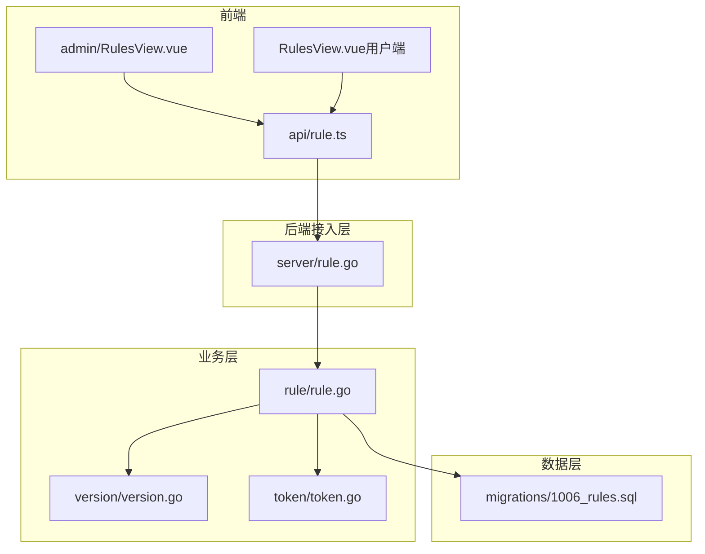
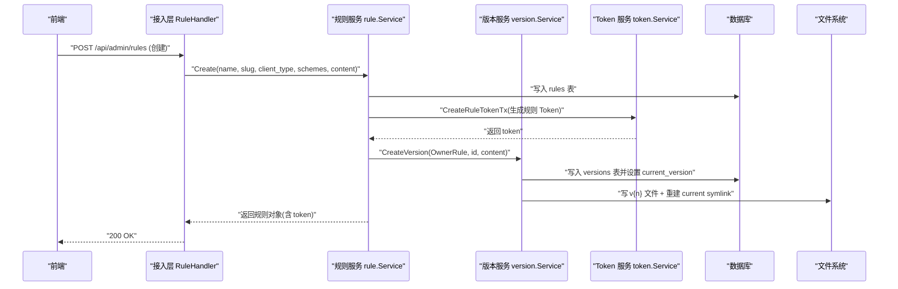
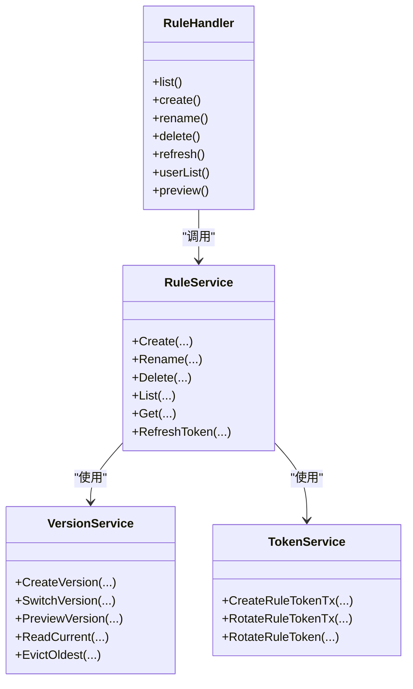
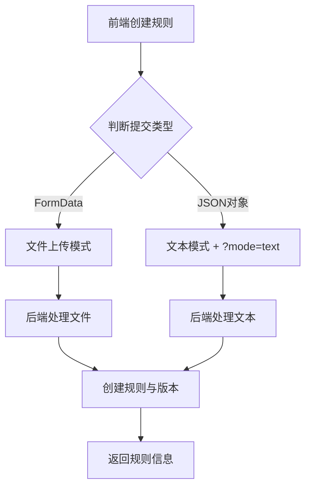

# 规则引擎

<cite>
**本文引用的文件**
- [backend/internal/rule/rule.go](file://backend/internal/rule/rule.go)
- [backend/internal/server/rule.go](file://backend/internal/server/rule.go)
- [backend/internal/version/version.go](file://backend/internal/version/version.go)
- [backend/internal/token/token.go](file://backend/internal/token/token.go)
- [backend/migrations/1006_rules.sql](file://backend/migrations/1006_rules.sql)
- [frontend/src/api/rule.ts](file://frontend/src/api/rule.ts)
- [frontend/src/views/admin/RulesView.vue](file://frontend/src/views/admin/RulesView.vue)
- [frontend/src/views/RulesView.vue](file://frontend/src/views/RulesView.vue)
</cite>

## 更新摘要
**变更内容**
- 增强了规则创建功能，现在支持文本模式和文件上传双模式
- createRule函数已改进为自动检测提交类型，当传递普通对象时会自动添加?mode=text查询参数
- 解决了在线编辑器创建规则时的'未接收到文件'错误问题
- 更新了前端API封装和后端处理逻辑以支持双模式创建

## 目录
1. [简介](#简介)
2. [项目结构](#项目结构)
3. [核心组件](#核心组件)
4. [架构总览](#架构总览)
5. [详细组件分析](#详细组件分析)
6. [依赖关系分析](#依赖关系分析)
7. [性能考量](#性能考量)
8. [故障排查指南](#故障排查指南)
9. [结论](#结论)
10. [附录](#附录)

## 简介
本文件面向"分流规则"的完整生命周期与运行机制，覆盖以下主题：
- 规则管理：创建、改名、删除、版本管理与预览
- 规则语法与动态生成：支持文本编辑与文件上传两种模式；YAML 启发式校验提示
- 优先级与匹配逻辑：当前实现以"规则集合 + 客户端类型 + scheme 模板"为主，未内置复杂匹配引擎
- 规则与订阅的关联：通过"全局标识 slug 跨四类资源唯一"进行命名空间隔离；规则本身不直接绑定订阅
- 测试与调试：预览接口、前端弹窗、错误码映射
- 性能优化建议与最佳实践

## 项目结构
规则引擎由后端服务层、HTTP 接入层、版本与 Token 子系统、数据库迁移以及前后端交互组成。

**图表来源**
- [backend/internal/server/rule.go:22-40](file://backend/internal/server/rule.go#L22-L40)
- [backend/internal/rule/rule.go:25-36](file://backend/internal/rule/rule.go#L25-L36)
- [backend/internal/version/version.go:125-180](file://backend/internal/version/version.go#L125-L180)
- [backend/internal/token/token.go:197-235](file://backend/internal/token/token.go#L197-L235)
- [backend/migrations/1006_rules.sql:1-14](file://backend/migrations/1006_rules.sql#L1-L14)

**章节来源**
- [backend/internal/server/rule.go:22-40](file://backend/internal/server/rule.go#L22-L40)
- [backend/internal/rule/rule.go:25-36](file://backend/internal/rule/rule.go#L25-L36)

## 核心组件
- 规则服务 rule.Service：负责规则的 CRUD、Token 轮替、列表查询等
- 版本服务 version.Service：负责规则内容版本化、切换、预览、驱逐最旧版本、启动自检
- Token 服务 token.Service：负责规则下载 Token 的生成、轮替、刷新时间维护
- HTTP 接入层 server.RuleHandler：暴露管理端与用户端 API，统一错误映射
- 前端：管理端 RulesView 与用户端 RulesView，封装 API 调用与交互

**章节来源**
- [backend/internal/rule/rule.go:25-36](file://backend/internal/rule/rule.go#L25-L36)
- [backend/internal/version/version.go:50-69](file://backend/internal/version/version.go#L50-L69)
- [backend/internal/token/token.go:19-27](file://backend/internal/token/token.go#L19-L27)
- [backend/internal/server/rule.go:16-40](file://backend/internal/server/rule.go#L16-L40)
- [frontend/src/api/rule.ts:4-27](file://frontend/src/api/rule.ts#L4-L27)

## 架构总览
规则引擎采用分层架构：前端通过 RESTful API 与后端交互；接入层做参数校验与错误映射；业务层组合版本与 Token 能力；数据持久化使用 SQLite，版本文件落盘并以 symlink 指向当前版本。

**图表来源**
- [backend/internal/server/rule.go:51-105](file://backend/internal/server/rule.go#L51-L105)
- [backend/internal/rule/rule.go:51-102](file://backend/internal/rule/rule.go#L51-L102)
- [backend/internal/version/version.go:125-180](file://backend/internal/version/version.go#L125-L180)
- [backend/internal/token/token.go:197-208](file://backend/internal/token/token.go#L197-L208)

## 详细组件分析

### 规则服务（rule.Service）
- 职责
  - 创建规则：名称必填、客户端类型限制为 shadowrocket；可选 slug 为空时自动生成（rule- 前缀），并在事务内完成跨四类资源的唯一性检查
  - 首版本创建：在规则创建后立刻建立首个版本，失败则回滚规则与 Token
  - 改名：仅允许修改名称，client_type 与 schemes 创建后不可改
  - 列表/详情：返回规则基本信息、当前版本号、全局 Token 与刷新时间
  - 删除：级联删除 Token、版本记录与文件目录
  - Token 轮替：物理替换旧 Token，更新 refreshed_at

- 关键数据结构
  - Rule：包含 ID、slug、name、client_type、schemes、token、current_version、created_at、refreshed_at

- 事务与一致性
  - 创建流程使用 BEGIN IMMEDIATE 事务保证原子性
  - 首版本创建失败时执行回滚，清理已创建的规则与 Token

**章节来源**
- [backend/internal/rule/rule.go:38-102](file://backend/internal/rule/rule.go#L38-L102)
- [backend/internal/rule/rule.go:115-164](file://backend/internal/rule/rule.go#L115-L164)
- [backend/internal/rule/rule.go:166-209](file://backend/internal/rule/rule.go#L166-L209)
- [backend/internal/rule/rule.go:221-235](file://backend/internal/rule/rule.go#L221-L235)

### 版本服务（version.Service）
- 职责
  - 版本创建：读取内容（文本或文件流）、大小限制（≤50MB）、写入文件、写入版本记录、切换当前版本、驱逐最旧版本（最多保留 5 个）
  - 版本切换：原子切换 symlink 并更新 DB current_version
  - 版本删除：禁止删除最后一个版本与当前激活版本
  - 当前版本读取：先查 DB current_version，再读对应文件
  - YAML 启发式检测：对文本编辑内容进行 YAML 语法探测，非 YAML（如 base64 或协议前缀）静默跳过

- 关键约束
  - 版本号计算与列表更新在单个事务内完成
  - 当前指针以 DB 为准，symlink 仅作文件组织，启动时自检重建

**章节来源**
- [backend/internal/version/version.go:25-38](file://backend/internal/version/version.go#L25-L38)
- [backend/internal/version/version.go:125-180](file://backend/internal/version/version.go#L125-L180)
- [backend/internal/version/version.go:218-245](file://backend/internal/version/version.go#L218-L245)
- [backend/internal/version/version.go:303-338](file://backend/internal/version/version.go#L303-L338)
- [backend/internal/version/version.go:394-426](file://backend/internal/version/version.go#L394-L426)
- [backend/internal/version/version.go:517-577](file://backend/internal/version/version.go#L517-L577)

### Token 服务（token.Service）
- 职责
  - 规则 Token 生成：创建规则时自动生成安全随机 Token
  - 规则 Token 轮替：物理替换旧 Token，并更新 refreshed_at
  - 生命周期联动：删除规则时同步删除 Token

- 安全性
  - 使用加密安全随机数生成 Token（≥128 位）
  - 轮替在同一事务中完成，确保旧链接立即失效

**章节来源**
- [backend/internal/token/token.go:29-36](file://backend/internal/token/token.go#L29-L36)
- [backend/internal/token/token.go:197-235](file://backend/internal/token/token.go#L197-L235)

### HTTP 接入层（server.RuleHandler）
- 管理端路由
  - GET /api/admin/rules：规则列表（含 Token 与刷新时间）
  - POST /api/admin/rules：创建规则（mode=text 或文件上传）
  - PUT /api/admin/rules/:id：改名
  - DELETE /api/admin/rules/:id：删除
  - POST /api/admin/rules/:id/token/refresh：刷新 Token
  - 版本相关：list/create/switch/preview/delete

- 用户端路由
  - GET /api/rules：规则卡片列表（登录用户可见，含全局 Token）
  - GET /api/rules/:id/preview：会话凭据预览当前版本（text/plain，no-store）

- 错误处理
  - 将业务错误映射为 HTTP 状态码（如 400、404、409、500）

**章节来源**
- [backend/internal/server/rule.go:22-40](file://backend/internal/server/rule.go#L22-L40)
- [backend/internal/server/rule.go:51-105](file://backend/internal/server/rule.go#L51-L105)
- [backend/internal/server/rule.go:107-159](file://backend/internal/server/rule.go#L107-L159)
- [backend/internal/server/rule.go:161-184](file://backend/internal/server/rule.go#L161-L184)
- [backend/internal/server/rule.go:186-206](file://backend/internal/server/rule.go#L186-L206)

### 前端交互
- 管理端 RulesView.vue
  - 创建规则：支持文件上传与在线文本编辑；自动填充 client_type=shadowrocket；schemes 数组可动态增删
  - 操作：改名、复制链接（拼接 slug+token）、刷新 Token、删除
  - 列表展示：名称、标识、客户端类型、当前版本、Token 刷新时间

- 用户端 RulesView.vue
  - 规则卡片网格：名称、客户端类型、当前版本
  - 复制链接：生成下载链接（公开内容，谨慎分发）
  - 预览弹窗：获取当前版本内容（纯文本）

- API 封装 rule.ts
  - 定义 RuleItem 类型（含 token、refreshed_at 等字段）
  - 提供 listAdminRules、createRule、renameRule、deleteRule、refreshRuleToken、userRules、previewRule

**章节来源**
- [frontend/src/views/admin/RulesView.vue:32-78](file://frontend/src/views/admin/RulesView.vue#L32-L78)
- [frontend/src/views/admin/RulesView.vue:107-151](file://frontend/src/views/admin/RulesView.vue#L107-L151)
- [frontend/src/views/RulesView.vue:26-50](file://frontend/src/views/RulesView.vue#L26-L50)
- [frontend/src/api/rule.ts:4-27](file://frontend/src/api/rule.ts#L4-L27)

## 依赖关系分析
- 规则服务依赖
  - store.Store：数据库访问
  - version.Service：版本创建、切换、预览、驱逐
  - token.Service：规则 Token 生成与轮替
  - subscription.Service：复用 CheckSlugAvailable 进行跨四类资源标识唯一性校验

- 版本服务依赖
  - store.Store：数据库访问
  - 文件系统：版本文件存储与 symlink 管理

- Token 服务依赖
  - store.Store：数据库访问

- 接入层依赖
  - rule.Service、version.Service：业务调用
  - 中间件：sessionMW、adminMW（管理端）

**图表来源**
- [backend/internal/rule/rule.go:25-36](file://backend/internal/rule/rule.go#L25-L36)
- [backend/internal/version/version.go:50-69](file://backend/internal/version/version.go#L50-L69)
- [backend/internal/token/token.go:19-27](file://backend/internal/token/token.go#L19-L27)
- [backend/internal/server/rule.go:16-40](file://backend/internal/server/rule.go#L16-L40)

**章节来源**
- [backend/internal/rule/rule.go:25-36](file://backend/internal/rule/rule.go#L25-L36)
- [backend/internal/version/version.go:50-69](file://backend/internal/version/version.go#L50-L69)
- [backend/internal/token/token.go:19-27](file://backend/internal/token/token.go#L19-L27)
- [backend/internal/server/rule.go:16-40](file://backend/internal/server/rule.go#L16-L40)

## 性能考量
- 版本上限与驱逐
  - 每份资源最多保留 5 个版本，超出时自动驱逐最旧版本（不含当前激活），避免无限增长
- 文件大小限制
  - 上传内容与文本编辑均受 ≤50MB 限制，防止内存与磁盘压力
- 事务与锁
  - 版本创建与切换使用 BEGIN IMMEDIATE 事务与库级写锁，保证并发安全
- 启动自检
  - 启动时重建 symlink，确保 DB current_version 与文件指针一致
- 缓存控制
  - 预览接口设置 no-store，避免敏感内容被缓存

## 故障排查指南
- 常见错误与定位
  - 参数错误（400）：名称为空、客户端类型不支持、schemes 格式错误、内容过大
  - 冲突（409）：slug 已被其他三类资源占用
  - 不存在（404）：规则或版本不存在
  - 内部错误（500）：数据库或文件系统异常

- 调试方法
  - 使用预览接口查看当前版本内容（会话凭据，text/plain）
  - 检查 Token 刷新时间，确认轮替是否生效
  - 前端弹窗显示错误消息，结合后端日志定位问题

**章节来源**
- [backend/internal/server/rule.go:51-105](file://backend/internal/server/rule.go#L51-L105)
- [backend/internal/server/rule.go:107-159](file://backend/internal/server/rule.go#L107-L159)
- [backend/internal/version/version.go:303-338](file://backend/internal/version/version.go#L303-L338)

## 结论
本规则引擎实现了分流规则的完整生命周期管理，包括创建、版本化、预览、Token 轮替与删除。当前实现聚焦于 Shadowrocket 客户端与 scheme 模板机制，未内置复杂匹配引擎。通过版本服务与 Token 服务的协作，确保了内容的一致性与安全性。前端提供了直观的管理与用户界面，便于日常运维与分发。

## 附录

### 规则语法与示例
- 客户端类型：当前仅支持 shadowrocket
- Scheme 模板：支持 {url} 占位符，用于注入下载链接
- 动态生成：支持文本编辑与文件上传两种方式；文本编辑会进行 YAML 启发式检测并给出警告（不阻断保存）

**章节来源**
- [backend/internal/rule/rule.go:51-102](file://backend/internal/rule/rule.go#L51-L102)
- [backend/internal/version/version.go:517-577](file://backend/internal/version/version.go#L517-L577)
- [frontend/src/views/admin/RulesView.vue:217-243](file://frontend/src/views/admin/RulesView.vue#L217-L243)

### 规则与订阅的关联关系
- 命名空间隔离：规则与订阅共享同一 slug 命名空间，需保持全局唯一
- 无直接绑定：规则本身不直接绑定订阅，但可通过 scheme 模板中的 {url} 指向订阅下载链接
- 标识生成：规则 slug 为空时自动生成（rule- 前缀），并在事务内进行跨四类资源唯一性检查

**章节来源**
- [backend/internal/rule/rule.go:51-102](file://backend/internal/rule/rule.go#L51-L102)
- [backend/internal/subscription/subscription.go:86-163](file://backend/internal/subscription/subscription.go#L86-L163)

### 优先级与匹配逻辑
- 当前实现：以规则集合形式存在，未内置复杂匹配引擎
- 扩展点：可通过 scheme 模板与外部客户端逻辑实现差异化匹配
- 建议：如需复杂匹配，可在客户端侧实现基于域名、IP、协议的规则解析

### 规则测试与调试
- 预览接口：GET /api/rules/:id/preview，返回当前版本内容（text/plain）
- 前端弹窗：用户端与管理端均可预览规则内容
- 错误映射：后端将业务错误映射为 HTTP 状态码，前端弹窗显示错误信息

**章节来源**
- [backend/internal/server/rule.go:171-184](file://backend/internal/server/rule.go#L171-L184)
- [frontend/src/views/RulesView.vue:38-50](file://frontend/src/views/RulesView.vue#L38-L50)

### 最佳实践
- 合理命名：使用有意义的 slug，便于识别与管理
- 版本控制：频繁变更时使用新版本，避免覆盖导致历史无法回溯
- Token 管理：定期刷新 Token，避免泄露风险
- 内容大小：控制规则文件大小，避免超过 50MB 限制
- 客户端兼容：确保规则格式与目标客户端（Shadowrocket）兼容

### 规则创建双模式增强

**新增功能**：规则创建现在支持文本模式和文件上传双模式，解决了在线编辑器创建规则时的'未接收到文件'错误问题。

**技术实现**：
- 前端 API 封装自动检测提交类型：当传递普通对象时自动添加 `?mode=text` 查询参数
- 后端处理逻辑根据查询参数区分处理方式：
  - `mode=text`：接收 JSON 格式的文本内容
  - 默认模式：接收 multipart/form-data 文件上传

**工作流程**：

**前端实现细节**：
- `createRule` 函数智能检测 payload 类型
- 文本模式：传递 `{ name, client_type, schemes, text }` 对象
- 文件模式：传递 FormData 对象包含文件数据
- 自动附加查询参数：`isText ? '?mode=text' : ''`

**后端处理逻辑**：
- 检查 `c.Query("mode") == "text"` 决定处理分支
- 文本模式：解析 JSON 请求体，验证必需字段
- 文件模式：解析表单数据，提取文件流
- 统一的 ContentProvider 接口处理两种输入源

**章节来源**
- [frontend/src/api/rule.ts:18-22](file://frontend/src/api/rule.ts#L18-L22)
- [backend/internal/server/rule.go:51-86](file://backend/internal/server/rule.go#L51-L86)
- [frontend/src/views/admin/RulesView.vue:46-78](file://frontend/src/views/admin/RulesView.vue#L46-L78)