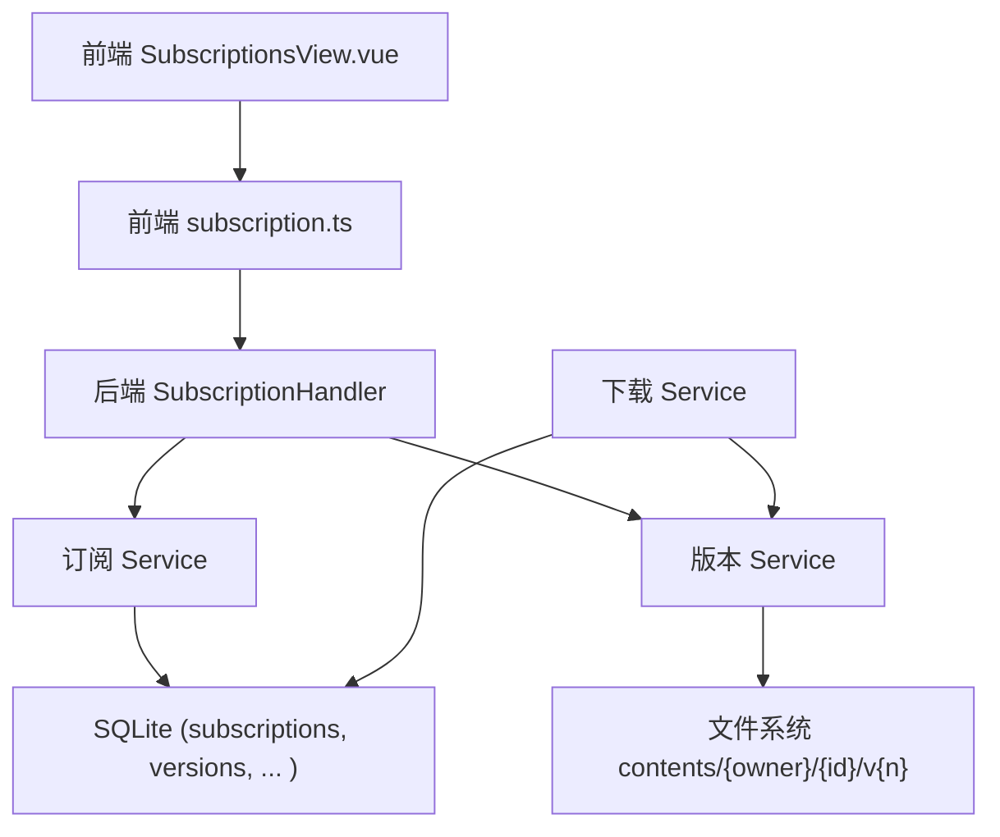
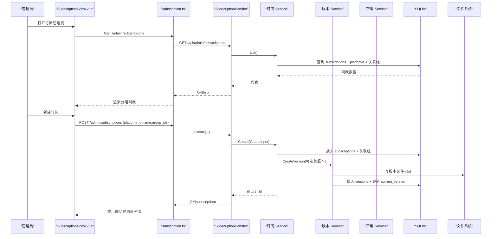
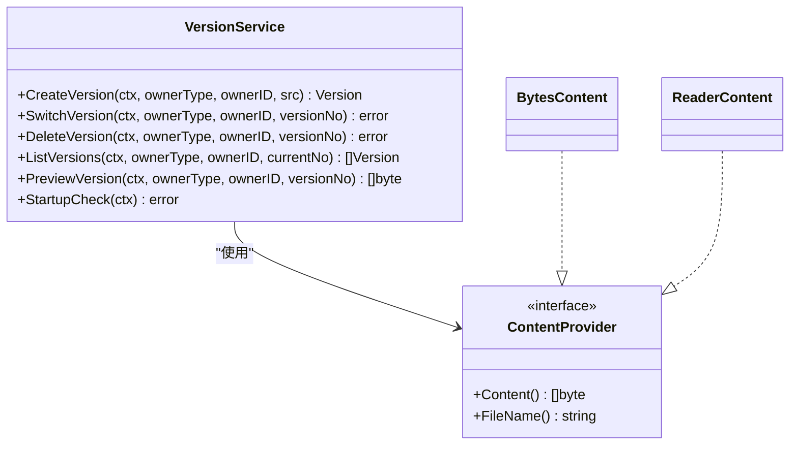
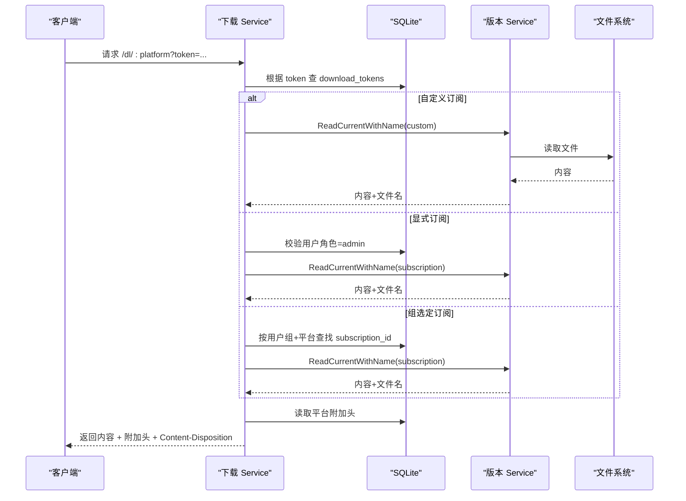
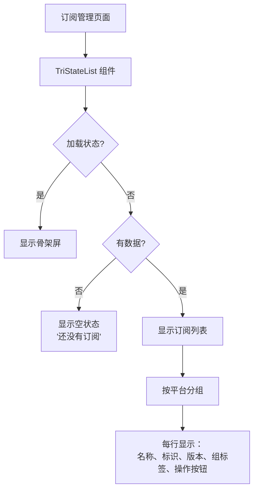
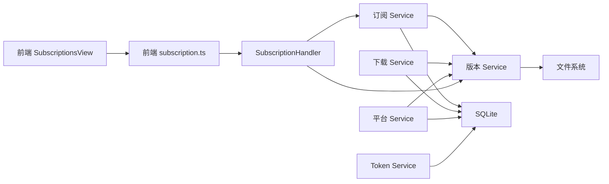

# 订阅管理系统

<cite>
**本文引用的文件**
- [backend/internal/subscription/subscription.go](file://backend/internal/subscription/subscription.go)
- [backend/internal/server/subscription.go](file://backend/internal/server/subscription.go)
- [backend/internal/version/version.go](file://backend/internal/version/version.go)
- [backend/internal/download/download.go](file://backend/internal/download/download.go)
- [backend/internal/platform/platform.go](file://backend/internal/platform/platform.go)
- [backend/internal/token/token.go](file://backend/internal/token/token.go)
- [frontend/src/api/subscription.ts](file://frontend/src/api/subscription.ts)
- [frontend/src/views/admin/SubscriptionsView.vue](file://frontend/src/views/admin/SubscriptionsView.vue)
- [frontend/src/components/TriStateList.vue](file://frontend/src/components/TriStateList.vue)
- [frontend/src/views/HomeView.vue](file://frontend/src/views/HomeView.vue)
- [backend/migrations/1002_subscriptions_versions.sql](file://backend/migrations/1002_subscriptions_versions.sql)
</cite>

## 更新摘要
**所做更改**
- 更新了订阅管理界面布局描述，从可折叠列表改为扁平化布局
- 改进了用户交互体验，优化了操作按钮的放置位置
- 增强了空状态处理机制
- 更新了前端组件架构说明

## 目录
1. [简介](#简介)
2. [项目结构](#项目结构)
3. [核心组件](#核心组件)
4. [架构总览](#架构总览)
5. [详细组件分析](#详细组件分析)
6. [依赖关系分析](#依赖关系分析)
7. [性能与一致性](#性能与一致性)
8. [故障排查指南](#故障排查指南)
9. [结论](#结论)
10. [附录：API 与使用示例](#附录api-与使用示例)

## 简介
本系统提供订阅的完整生命周期管理，涵盖创建、编辑、删除、版本控制、文件上传与文本编辑器集成、平台关联、版本历史管理策略以及下载 Token 的生成与管理。后端采用分层架构（接入层 → 业务服务 → 数据访问），前端通过 Vue + Ant Design 实现管理界面；版本内容以文件落盘存储，并通过数据库记录当前激活版本与版本历史。下载端点基于 Token 解析，支持三态分发（自定义、显式订阅、组选定订阅）。

**最新更新**：订阅管理界面已重新设计，从传统的可折叠列表布局改为扁平化布局，提供更直接的订阅可见性和改进的用户体验。

## 项目结构
- 后端
  - 接入层：Gin 路由与处理器，负责参数校验、错误映射与响应封装
  - 业务层：订阅、版本、下载、平台、Token 等服务，封装事务与领域规则
  - 数据层：SQLite 迁移脚本与通用 Store
- 前端
  - API 封装：对订阅相关接口进行类型化调用
  - 视图：订阅管理页面，支持按平台分组展示、新建/编辑/删除、跳转版本管理
  - 组件：TriStateList 组件提供加载/空/列表三态显示

**图表来源**
- [backend/internal/server/subscription.go:22-38](file://backend/internal/server/subscription.go#L22-L38)
- [backend/internal/subscription/subscription.go:28-41](file://backend/internal/subscription/subscription.go#L28-L41)
- [backend/internal/version/version.go:50-59](file://backend/internal/version/version.go#L50-L59)
- [backend/internal/download/download.go:25-35](file://backend/internal/download/download.go#L25-L35)

**章节来源**
- [backend/internal/server/subscription.go:22-38](file://backend/internal/server/subscription.go#L22-L38)
- [frontend/src/views/admin/SubscriptionsView.vue:1-188](file://frontend/src/views/admin/SubscriptionsView.vue#L1-L188)
- [frontend/src/api/subscription.ts:1-35](file://frontend/src/api/subscription.ts#L1-L35)

## 核心组件
- 订阅服务：提供订阅 CRUD、标识唯一性校验、与用户组的关联管理、级联删除
- 版本服务：统一处理四类资源的版本创建、切换、预览、删除、驱逐最旧版本、启动自检重建 symlink
- 下载服务：基于 Token 的三态解析（自定义/显式/组选定）、附加响应头注入、访问日志
- 平台服务：平台 CRUD、安装包上传/删除、级联删除（含订阅与 Token）
- Token 服务：下载 Token 的生成、复用键先查后建、轮替与生命周期联动清理
- **TriStateList 组件**：提供统一的加载、空状态和列表显示逻辑，支持自定义空状态文案

**章节来源**
- [backend/internal/subscription/subscription.go:28-41](file://backend/internal/subscription/subscription.go#L28-L41)
- [backend/internal/version/version.go:50-59](file://backend/internal/version/version.go#L50-59)
- [backend/internal/download/download.go:25-35](file://backend/internal/download/download.go#L25-L35)
- [backend/internal/platform/platform.go:36-46](file://backend/internal/platform/platform.go#L36-L46)
- [backend/internal/token/token.go:19-27](file://backend/internal/token/token.go#L19-L27)
- [frontend/src/components/TriStateList.vue:1-22](file://frontend/src/components/TriStateList.vue#L1-L22)

## 架构总览
订阅管理的请求流从前端发起，经 Gin 接入层路由到订阅处理器，再委派给订阅服务与版本服务完成业务逻辑；版本内容落盘并维护当前指针；下载端点通过下载服务解析 Token 并读取当前版本内容返回。

**图表来源**
- [backend/internal/server/subscription.go:22-38](file://backend/internal/server/subscription.go#L22-L38)
- [backend/internal/subscription/subscription.go:165-231](file://backend/internal/subscription/subscription.go#L165-L231)
- [backend/internal/version/version.go:125-180](file://backend/internal/version/version.go#L125-L180)

## 详细组件分析

### 订阅服务（CRUD、平台关联、组关联、标识唯一性）
- 创建：校验平台存在、名称必填、标识格式与全局唯一；自动生成 slug（若为空）；写入订阅与关联组；可选首版本
- 更新：仅允许修改名称与关联组；平台只读；重建关联
- 删除：级联删除版本文件、指向它的下载 Token、订阅-组关联、订阅行；失败仅记日志不阻断
- 列表：按平台分组，附带关联组与被选定的组数量
- 标识校验：跨四类资源（订阅/规则/自定义/分享）全局唯一命名空间

**图表来源**
- [backend/internal/subscription/subscription.go:165-231](file://backend/internal/subscription/subscription.go#L165-L231)
- [backend/internal/subscription/subscription.go:244-274](file://backend/internal/subscription/subscription.go#L244-L274)
- [backend/internal/subscription/subscription.go:276-332](file://backend/internal/subscription/subscription.go#L276-L332)

**章节来源**
- [backend/internal/subscription/subscription.go:86-115](file://backend/internal/subscription/subscription.go#L86-L115)
- [backend/internal/subscription/subscription.go:165-231](file://backend/internal/subscription/subscription.go#L165-L231)
- [backend/internal/subscription/subscription.go:244-332](file://backend/internal/subscription/subscription.go#L244-L332)

### 版本服务（版本历史、切换、预览、驱逐策略）
- 版本创建：在 BEGIN IMMEDIATE 事务内计算版本号（最大编号+1）、写文件、写记录、切换当前指针、驱逐最旧版本（最多保留5个）
- 版本切换：原子切换 symlink 与 DB 当前版本，并更新时间戳
- 版本删除：不可删最后一个或当前激活版本；删除时同步移除文件
- 启动自检：以 DB 为权威源重建 symlink，保证一致
- 预览：读取指定版本内容，text/plain 且禁缓存

**图表来源**
- [backend/internal/version/version.go:50-59](file://backend/internal/version/version.go#L50-L59)
- [backend/internal/version/version.go:71-109](file://backend/internal/version/version.go#L71-L109)
- [backend/internal/version/version.go:125-180](file://backend/internal/version/version.go#L125-L180)
- [backend/internal/version/version.go:218-264](file://backend/internal/version/version.go#L218-L264)
- [backend/internal/version/version.go:303-338](file://backend/internal/version/version.go#L303-L338)
- [backend/internal/version/version.go:371-382](file://backend/internal/version/version.go#L371-L382)
- [backend/internal/version/version.go:438-484](file://backend/internal/version/version.go#L438-L484)

**章节来源**
- [backend/internal/version/version.go:25-38](file://backend/internal/version/version.go#L25-L38)
- [backend/internal/version/version.go:125-180](file://backend/internal/version/version.go#L125-L180)
- [backend/internal/version/version.go:218-264](file://backend/internal/version/version.go#L218-L264)
- [backend/internal/version/version.go:303-338](file://backend/internal/version/version.go#L303-L338)
- [backend/internal/version/version.go:371-382](file://backend/internal/version/version.go#L371-L382)
- [backend/internal/version/version.go:438-484](file://backend/internal/version/version.go#L438-L484)

### 下载服务（Token 解析、三态分发、附加头、访问日志）
- 三态解析：优先自定义订阅，其次显式订阅（需管理员角色），最后根据用户所属组在该平台的选定获取订阅
- 附加响应头：从平台配置读取 JSON 附加头，替换占位符（如 {frontend_url}）
- 访问日志：记录成功/失败原因（token_invalid/unassigned/version_missing 等）
- 文件名：资源名 + 原始扩展名（保留上传格式）

**图表来源**
- [backend/internal/download/download.go:53-117](file://backend/internal/download/download.go#L53-L117)
- [backend/internal/download/download.go:119-146](file://backend/internal/download/download.go#L119-L146)
- [backend/internal/download/download.go:275-302](file://backend/internal/download/download.go#L275-L302)

**章节来源**
- [backend/internal/download/download.go:19-23](file://backend/internal/download/download.go#L19-L23)
- [backend/internal/download/download.go:53-117](file://backend/internal/download/download.go#L53-L117)
- [backend/internal/download/download.go:119-146](file://backend/internal/download/download.go#L119-L146)
- [backend/internal/download/download.go:275-302](file://backend/internal/download/download.go#L275-L302)

### 平台服务（平台 CRUD、安装包、级联删除）
- 平台创建/更新：校验 scheme 与附加头；自动生成 slug；持久化 JSON 字段
- 安装包上传：流式写入、限大小、事务内原子替换旧文件、并发安全（O_EXCL）
- 级联删除：删除安装包、全部订阅及其版本文件、指向它们的下载 Token、自定义订阅及版本、组在该平台的关联与选定

**章节来源**
- [backend/internal/platform/platform.go:68-99](file://backend/internal/platform/platform.go#L68-L99)
- [backend/internal/platform/platform.go:256-334](file://backend/internal/platform/platform.go#L256-L334)
- [backend/internal/platform/platform.go:382-474](file://backend/internal/platform/platform.go#L382-L474)

### Token 服务（生成、复用键、轮替、生命周期联动）
- 生成：≥128 位加密安全随机值（base64url）
- 复用键：无标识 user+platform；自定义 user+platform+custom_sub_id；显式 user+platform+subscription_id
- 轮替：同事务删旧建新，保持复用键不变
- 生命周期联动：删除订阅/自定义/用户时级联清理 Token

**章节来源**
- [backend/internal/token/token.go:29-36](file://backend/internal/token/token.go#L29-L36)
- [backend/internal/token/token.go:48-88](file://backend/internal/token/token.go#L48-L88)
- [backend/internal/token/token.go:92-123](file://backend/internal/token/token.go#L92-L123)
- [backend/internal/token/token.go:125-156](file://backend/internal/token/token.go#L125-L156)

### 前端界面组件（扁平化布局与用户体验优化）

**最新更新**：订阅管理界面已重新设计，采用扁平化布局替代传统的可折叠列表，提供更好的用户体验。

#### TriStateList 组件
TriStateList 组件提供了统一的三态显示逻辑：
- 加载状态：显示骨架屏
- 空状态：显示自定义空消息和引导文案
- 列表状态：渲染实际的订阅列表内容

#### 订阅管理界面特性
- **扁平化布局**：所有订阅直接可见，无需展开折叠面板
- **改进的操作按钮**：每个订阅行都有独立的版本管理、编辑、删除按钮
- **增强的空状态处理**：当没有订阅时显示友好的引导信息
- **平台分组展示**：仍然按平台分组，但采用更直观的卡片式布局
- **响应式设计**：适配不同屏幕尺寸，移动端友好

**图表来源**
- [frontend/src/views/admin/SubscriptionsView.vue:123-144](file://frontend/src/views/admin/SubscriptionsView.vue#L123-L144)
- [frontend/src/components/TriStateList.vue:14-21](file://frontend/src/components/TriStateList.vue#L14-L21)

**章节来源**
- [frontend/src/views/admin/SubscriptionsView.vue:123-144](file://frontend/src/views/admin/SubscriptionsView.vue#L123-L144)
- [frontend/src/components/TriStateList.vue:1-22](file://frontend/src/components/TriStateList.vue#L1-L22)

## 依赖关系分析
- 订阅服务依赖版本服务进行首版本创建与级联删除；通过回调注入避免循环依赖
- 版本服务依赖 Store 与文件系统；以 DB 为权威源，symlink 仅作组织
- 下载服务依赖版本服务读取当前版本内容，依赖平台配置注入附加头
- 平台服务在删除时级联清理订阅、Token、自定义订阅与版本文件
- 前端通过 API 模块调用后端路由，订阅管理页面聚合平台、组、订阅数据

**图表来源**
- [backend/internal/subscription/subscription.go:28-41](file://backend/internal/subscription/subscription.go#L28-L41)
- [backend/internal/version/version.go:50-59](file://backend/internal/version/version.go#L50-L59)
- [backend/internal/download/download.go:25-35](file://backend/internal/download/download.go#L25-L35)
- [backend/internal/platform/platform.go:36-46](file://backend/internal/platform/platform.go#L36-L46)
- [backend/internal/token/token.go:19-27](file://backend/internal/token/token.go#L19-L27)
- [frontend/src/api/subscription.ts:25-35](file://frontend/src/api/subscription.ts#L25-L35)
- [backend/internal/server/subscription.go:22-38](file://backend/internal/server/subscription.go#L22-L38)

**章节来源**
- [backend/internal/subscription/subscription.go:28-41](file://backend/internal/subscription/subscription.go#L28-L41)
- [backend/internal/version/version.go:50-59](file://backend/internal/version/version.go#L50-L59)
- [backend/internal/download/download.go:25-35](file://backend/internal/download/download.go#L25-L35)
- [backend/internal/platform/platform.go:36-46](file://backend/internal/platform/platform.go#L36-L46)
- [backend/internal/token/token.go:19-27](file://backend/internal/token/token.go#L19-L27)
- [frontend/src/api/subscription.ts:25-35](file://frontend/src/api/subscription.ts#L25-L35)
- [backend/internal/server/subscription.go:22-38](file://backend/internal/server/subscription.go#L22-L38)

## 性能与一致性
- 版本操作使用 BEGIN IMMEDIATE 事务与库级写锁，确保并发安全与一致性
- 版本数上限为 5，超出自动驱逐最旧版本，避免无限增长
- 文件写入限制大小（≤50MB），防止内存溢出
- 下载解析路径短、直接读取当前版本文件，减少 IO 开销
- 启动自检保证 DB 与 symlink 一致，降低不一致风险

**章节来源**
- [backend/internal/version/version.go:25-38](file://backend/internal/version/version.go#L25-L38)
- [backend/internal/version/version.go:125-180](file://backend/internal/version/version.go#L125-L180)
- [backend/internal/version/version.go:438-484](file://backend/internal/version/version.go#L438-L484)

## 故障排查指南
- 标识冲突：创建订阅时若手填 slug 与其他三类资源冲突，将返回冲突错误；可使用后端提供的检查接口即时反馈
- 版本不存在：切换或删除版本时报错，需确认版本号有效且非当前激活版本
- 下载失败：
  - token_invalid：Token 无效或与平台标识不一致
  - unassigned：用户未分配订阅（无自定义、无显式、组未选定）
  - version_missing：目标资源无当前版本
- 平台删除影响：删除平台会级联删除其下订阅、Token、自定义订阅与版本文件，请谨慎操作

**章节来源**
- [backend/internal/subscription/subscription.go:86-115](file://backend/internal/subscription/subscription.go#L86-L115)
- [backend/internal/version/version.go:303-338](file://backend/internal/version/version.go#L303-L338)
- [backend/internal/download/download.go:19-23](file://backend/internal/download/download.go#L19-L23)
- [backend/internal/platform/platform.go:382-474](file://backend/internal/platform/platform.go#L382-L474)

## 结论
本订阅管理系统实现了订阅的全生命周期管理与版本控制，结合平台关联与下载 Token 机制，提供了灵活的分发能力。通过事务与文件系统的协同，保证了数据一致性与高可用；前端界面经过重新设计，采用扁平化布局和优化的用户体验，便于管理员高效管理。未来可进一步扩展更多资源类型与更细粒度的权限控制。

## 附录：API 与使用示例

### 订阅 CRUD（后端路由）
- 列表：GET /api/admin/subscriptions
- 创建：POST /api/admin/subscriptions
- 更新：PUT /api/admin/subscriptions/:id
- 删除：DELETE /api/admin/subscriptions/:id
- 标识检查：GET /api/admin/slug/check?slug=&type=&id=

**章节来源**
- [backend/internal/server/subscription.go:22-38](file://backend/internal/server/subscription.go#L22-L38)
- [backend/internal/server/subscription.go:65-148](file://backend/internal/server/subscription.go#L65-L148)

### 版本管理（后端路由）
- 列表：GET /api/admin/subscriptions/:id/versions
- 创建：POST /api/admin/subscriptions/:id/versions?mode=upload|text
- 切换：PUT /api/admin/subscriptions/:id/versions/current
- 预览：GET /api/admin/subscriptions/:id/versions/:ver/preview
- 删除：DELETE /api/admin/subscriptions/:id/versions/:ver

**章节来源**
- [backend/internal/server/subscription.go:29-38](file://backend/internal/server/subscription.go#L29-L38)
- [backend/internal/server/subscription.go:150-170](file://backend/internal/server/subscription.go#L150-L170)
- [backend/internal/server/subscription.go:194-235](file://backend/internal/server/subscription.go#L194-L235)
- [backend/internal/server/subscription.go:237-283](file://backend/internal/server/subscription.go#L237-L283)
- [backend/internal/server/subscription.go:285-309](file://backend/internal/server/subscription.go#L285-L309)

### 前端调用示例（TypeScript）
- 列出订阅：listSubscriptions()
- 获取单个订阅：getSubscription(id)
- 创建订阅：createSubscription({ platform_id, name, group_ids })
- 更新订阅：updateSubscription(id, { name, group_ids })
- 删除订阅：deleteSubscription(id)
- 标识检查：checkSlug(slug, type?, id?)

**章节来源**
- [frontend/src/api/subscription.ts:25-35](file://frontend/src/api/subscription.ts#L25-L35)

### 数据库模型（关键表）
- subscriptions：订阅主表（slug、name、platform_id、current_version）
- versions：版本表（owner_type、owner_id、version_no、file_path）
- subscription_group_rel：订阅与组的多对多关联

**章节来源**
- [backend/migrations/1002_subscriptions_versions.sql:1-34](file://backend/migrations/1002_subscriptions_versions.sql#L1-L34)