# 订阅管理系统

<cite>
**本文引用的文件**
- [backend/internal/subscription/subscription.go](file://backend/internal/subscription/subscription.go)
- [backend/internal/server/subscription.go](file://backend/internal/server/subscription.go)
- [backend/internal/version/version.go](file://backend/internal/version/version.go)
- [backend/internal/download/download.go](file://backend/internal/download/download.go)
- [backend/internal/platform/platform.go](file://backend/internal/platform/platform.go)
- [backend/internal/token/token.go](file://backend/internal/token/token.go)
- [backend/internal/rule/rule.go](file://backend/internal/rule/rule.go)
- [backend/internal/server/rule.go](file://backend/internal/server/rule.go)
- [backend/internal/server/home.go](file://backend/internal/server/home.go)
- [backend/internal/setup/setup.go](file://backend/internal/setup/setup.go)
- [frontend/src/api/subscription.ts](file://frontend/src/api/subscription.ts)
- [frontend/src/views/admin/SubscriptionsView.vue](file://frontend/src/views/admin/SubscriptionsView.vue)
- [frontend/src/components/TriStateList.vue](file://frontend/src/components/TriStateList.vue)
- [frontend/src/views/HomeView.vue](file://frontend/src/views/HomeView.vue)
- [frontend/src/views/admin/RulesView.vue](file://frontend/src/views/admin/RulesView.vue)
- [frontend/src/api/rule.ts](file://frontend/src/api/rule.ts)
- [frontend/src/views/admin/PlatformsView.vue](file://frontend/src/views/admin/PlatformsView.vue)
- [frontend/src/views/admin/PlatformEditView.vue](file://frontend/src/views/admin/PlatformEditView.vue)
- [frontend/src/api/platform.ts](file://frontend/src/api/platform.ts)
- [backend/migrations/1002_subscriptions_versions.sql](file://backend/migrations/1002_subscriptions_versions.sql)
- [backend/migrations/1008_platform_installers_multi.sql](file://backend/migrations/1008_platform_installers_multi.sql)
- [docs/Reference/SSpanel-Subscribe.md](../../../../../docs/Reference/SSpanel-Subscribe.md)
- [Design2.md](../../../../../Design2.md)
</cite>

## 更新摘要
**所做更改**
- 更新了SSpanel订阅参考文档中Profile-Update-Interval和Profile-Web-Page-Url参数的设计2修订说明
- 增强了平台附加响应头功能的文档，包括Clash Verge平台的默认配置
- 完善了前端平台编辑界面中附加响应头的管理功能描述
- 更新了下载服务中平台附加响应头的处理逻辑说明
- 增加了Profile-Update-Interval参数在Clash客户端中的具体应用示例

## 目录
1. [简介](#简介)
2. [项目结构](#项目结构)
3. [核心组件](#核心组件)
4. [架构总览](#架构总览)
5. [详细组件分析](#详细组件分析)
6. [依赖关系分析](#依赖关系分析)
7. [性能与一致性](#性能与一致性)
8. [故障排查指南](#故障排查指南)
9. [结论](#结论)
10. [附录：API 与使用示例](#附录api-与使用示例)

## 简介
本系统提供订阅的完整生命周期管理，涵盖创建、编辑、删除、版本控制、文件上传与文本编辑器集成、平台关联、版本历史管理策略以及下载 Token 的生成与管理。**最新更新**：系统现已支持订阅模板架构优化，实现每平台单模板与产品类型属性管理；Shadowrocket 双组装器功能得到显著增强，可同时生成节点订阅（subs）和分流规则（conf），并支持多种协议类型包括 vless REALITY、vmess V2rayN JSON、trojan 和 shadowsocks。后端采用分层架构（接入层 → 业务服务 → 数据访问），前端通过 Vue + Ant Design 实现管理界面；版本内容以文件落盘存储，并通过数据库记录当前激活版本与版本历史。下载端点基于 Token 解析，支持三态分发（自定义、显式订阅、组选定订阅）。

**重大更新**：系统现已实现静态内容与模板内容的明确区分，支持高级模式下的动态节点注入和Xray集成，提供更强大的订阅管理和配置生成功能。**新增功能**：规则池排序能力支持拖拽重排序，Shadowrocket分发机制改进为服务所有用户，公共节点功能自动包含在活跃用户集合中。**最新增强**：订阅分发机制UI指导已增强，明确告知用户生成的订阅"在池中但未激活"，需要管理员激活后才能生效；Token处理逻辑已澄清，订阅地址池使用基于平台的Token解析机制；**新增**：Profile-Update-Interval和Profile-Web-Page-Url参数已完全集成到平台附加响应头系统中，为Clash等客户端提供标准的订阅更新间隔和网页链接配置。

## 项目结构
- 后端
  - 接入层：Gin 路由与处理器，负责参数校验、错误映射与响应封装
  - 业务层：订阅、版本、下载、平台、Token、规则等服务，封装事务与领域规则
  - 数据层：SQLite 迁移脚本与通用 Store
- 前端
  - API 封装：对订阅和规则相关接口进行类型化调用
  - 视图：订阅管理页面和规则管理页面，支持按平台分组展示、新建/编辑/删除、跳转版本管理
  - 组件：TriStateList 组件提供加载/空/列表三态显示

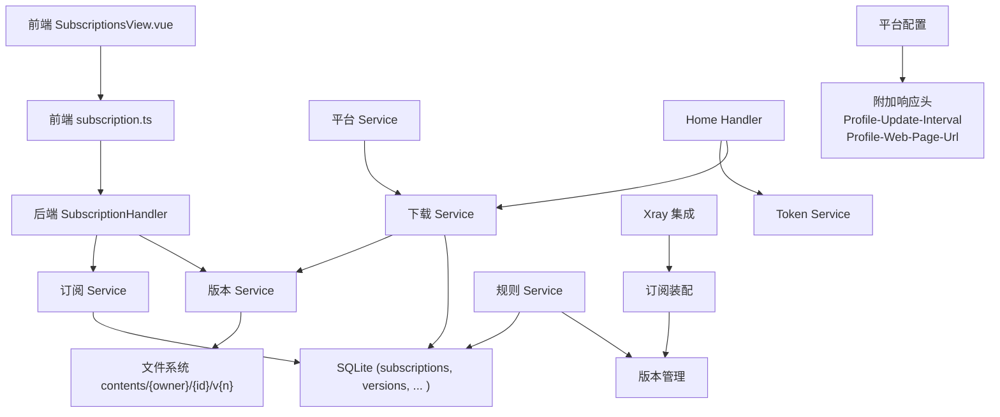

**图表来源**
- [backend/internal/server/subscription.go:22-38](file://backend/internal/server/subscription.go#L22-L38)
- [backend/internal/subscription/subscription.go:28-41](file://backend/internal/subscription/subscription.go#L28-L41)
- [backend/internal/version/version.go:50-59](file://backend/internal/version/version.go#L50-L59)
- [backend/internal/download/download.go:25-35](file://backend/internal/download/download.go#L25-L35)
- [backend/internal/server/rule.go:23-40](file://backend/internal/server/rule.go#L23-L40)
- [backend/internal/server/home.go:82-176](file://backend/internal/server/home.go#L82-L176)
- [backend/internal/setup/setup.go:144-158](file://backend/internal/setup/setup.go#L144-L158)

**章节来源**
- [backend/internal/server/subscription.go:22-38](file://backend/internal/server/subscription.go#L22-L38)
- [frontend/src/views/admin/SubscriptionsView.vue:1-188](file://frontend/src/views/admin/SubscriptionsView.vue#L1-L188)
- [frontend/src/api/subscription.ts:1-35](file://frontend/src/api/subscription.ts#L1-L35)

## 核心组件
- 订阅服务：提供订阅 CRUD、标识唯一性校验、与用户组的关联管理、级联删除
- 版本服务：统一处理四类资源的版本创建、切换、预览、删除、驱逐最旧版本、启动自检重建 symlink
- 下载服务：基于 Token 的三态解析（自定义/显式/组选定）、附加响应头注入、访问日志
- 平台服务：平台 CRUD、安装包上传/删除、级联删除（含订阅与 Token）、附加响应头管理
- Token 服务：下载 Token 的生成、复用键先查后建、轮替与生命周期联动清理
- **规则服务**：提供规则 CRUD、全局共享 Token 管理、版本控制、级联删除
- **TriStateList 组件**：提供统一的加载、空状态和列表显示逻辑，支持自定义空状态文案
- **Shadowrocket 双组装器**：支持同时生成节点订阅（subs）和分流规则（conf），具备占位符动态注入和多协议支持
- **Xray 集成模块**：支持高级模式下的动态节点注入和用户凭据管理
- **Home Handler**：处理用户首页的平台卡片数据，包括管理员池内订阅和普通用户的订阅分配状态
- **平台附加响应头系统**：支持 Profile-Update-Interval 和 Profile-Web-Page-Url 等标准客户端参数

**章节来源**
- [backend/internal/subscription/subscription.go:28-41](file://backend/internal/subscription/subscription.go#L28-L41)
- [backend/internal/version/version.go:50-59](file://backend/internal/version/version.go#L50-L59)
- [backend/internal/download/download.go:25-35](file://backend/internal/download/download.go#L25-L35)
- [backend/internal/platform/platform.go:36-46](file://backend/internal/platform/platform.go#L36-46)
- [backend/internal/token/token.go:19-27](file://backend/internal/token/token.go#L19-27)
- [backend/internal/rule/rule.go:25-36](file://backend/internal/rule/rule.go#L25-36)
- [frontend/src/components/TriStateList.vue:1-22](file://frontend/src/components/TriStateList.vue#L1-L22)
- [backend/internal/server/home.go:22-28](file://backend/internal/server/home.go#L22-L28)

## 架构总览
订阅管理的请求流从前端发起，经 Gin 接入层路由到订阅处理器，再委派给订阅服务与版本服务完成业务逻辑；版本内容落盘并维护当前指针；下载端点通过下载服务解析 Token 并读取当前版本内容返回。**新增**：Shadowrocket 双组装器通过配置组装系统实现占位符动态注入，支持多种协议类型的节点链接生成。**更新**：规则管理功能增强了拖拽排序能力，支持手动和URL来源的规则条目重新排列。**最新增强**：Home Handler 提供了管理员池内订阅的预览功能，为每个订阅生成独立的显式 Token；**新增**：平台附加响应头系统在下载时自动注入 Profile-Update-Interval 和 Profile-Web-Page-Url 等标准客户端参数。

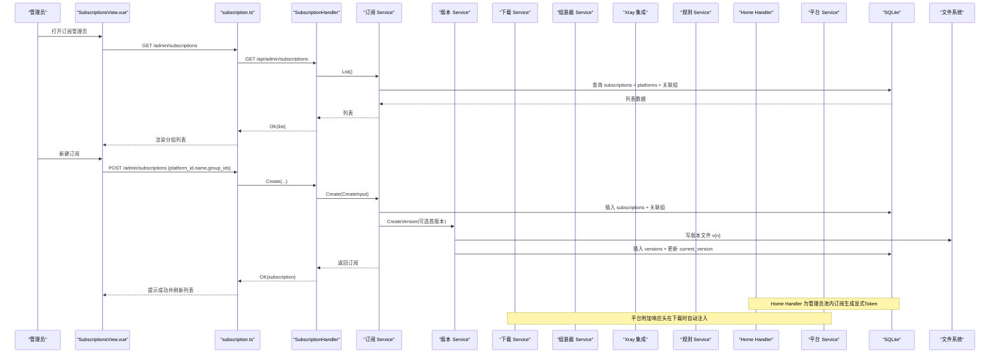

**图表来源**
- [backend/internal/server/subscription.go:22-38](file://backend/internal/server/subscription.go#L22-L38)
- [backend/internal/subscription/subscription.go:165-231](file://backend/internal/subscription/subscription.go#L165-L231)
- [backend/internal/version/version.go:125-180](file://backend/internal/version/version.go#L125-L180)
- [backend/internal/server/home.go:178-206](file://backend/internal/server/home.go#L178-L206)
- [backend/internal/download/download.go:119-146](file://backend/internal/download/download.go#L119-L146)

## 详细组件分析

### 订阅服务（CRUD、平台关联、组关联、标识唯一性）
- 创建：校验平台存在、名称必填、标识格式与全局唯一；自动生成 slug（若为空）；写入订阅与关联组；可选首版本
- 更新：仅允许修改名称与关联组；平台只读；重建关联
- 删除：级联删除版本文件、指向它的下载 Token、订阅-组关联、订阅行；失败仅记日志不阻断
- 列表：按平台分组，附带关联组与被选定的组数量
- 标识校验：跨四类资源（订阅/规则/自定义/分享）全局唯一命名空间

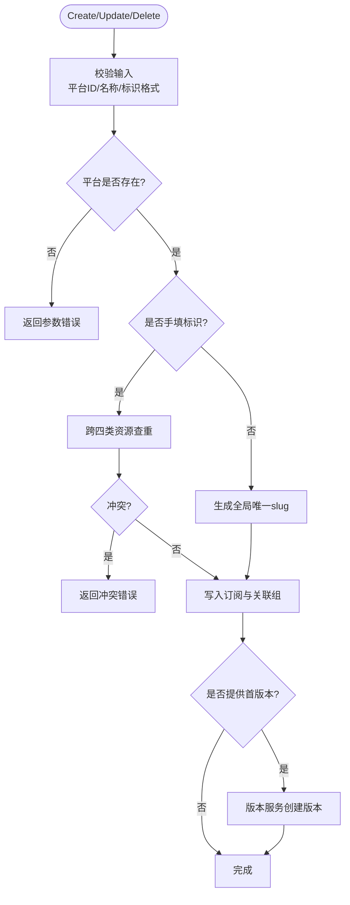

**图表来源**
- [backend/internal/subscription/subscription.go:165-231](file://backend/internal/subscription/subscription.go#L165-L231)
- [backend/internal/subscription/subscription.go:244-274](file://backend/internal/subscription/subscription.go#L244-274)
- [backend/internal/subscription/subscription.go:276-332](file://backend/internal/subscription/subscription.go#L276-L332)

**章节来源**
- [backend/internal/subscription/subscription.go:86-115](file://backend/internal/subscription/subscription.go#L86-L115)
- [backend/internal/subscription/subscription.go:165-231](file://backend/internal/subscription/subscription.go#L165-L231)
- [backend/internal/subscription/subscription.go:244-332](file://backend/internal/subscription/subscription.go#L244-332)

### 版本服务（版本历史、切换、预览、驱逐策略）
- 版本创建：在 BEGIN IMMEDIATE 事务内计算版本号（最大编号+1）、写文件、写记录、切换当前指针、驱逐最旧版本（最多保留5个）
- 版本切换：原子切换 symlink 与 DB 当前版本，并更新时间戳
- 版本删除：不可删最后一个或当前激活版本；删除时同步移除文件
- 启动自检：以 DB 为权威源重建 symlink，保证一致
- 预览：读取指定版本内容，text/plain 且禁缓存

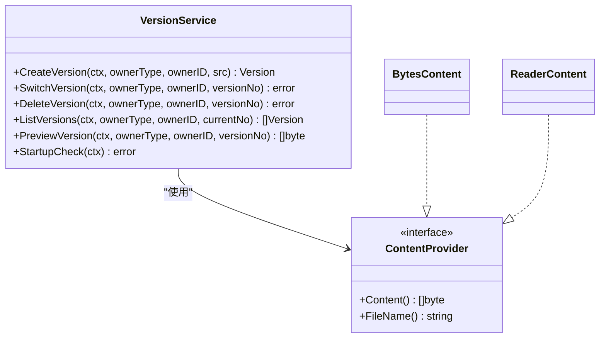

**图表来源**
- [backend/internal/version/version.go:50-59](file://backend/internal/version/version.go#L50-59)
- [backend/internal/version/version.go:71-109](file://backend/internal/version/version.go#L71-109)
- [backend/internal/version/version.go:125-180](file://backend/internal/version/version.go#L125-L180)
- [backend/internal/version/version.go:218-264](file://backend/internal/version/version.go#L218-L264)
- [backend/internal/version/version.go:303-338](file://backend/internal/version/version.go#L303-L338)
- [backend/internal/version/version.go:371-382](file://backend/internal/version/version.go#L371-L382)
- [backend/internal/version/version.go:438-484](file://backend/internal/version/version.go#L438-L484)

**章节来源**
- [backend/internal/version/version.go:25-38](file://backend/internal/version/version.go#L25-L38)
- [backend/internal/version/version.go:125-180](file://backend/internal/version/version.go#L125-L180)
- [backend/internal/version/version.go:218-264](file://backend/internal/version/version.go#L218-L264)
- [backend/internal/version/version.go:303-338](file://backend/internal/version/version.go#L303-L338)
- [backend/internal/version/version.go:371-382](file://backend/internal/version/version.go#L371-L382)
- [backend/internal/version/version.go:438-484](file://backend/internal/version/version.go#L438-L484)

### 下载服务（Token 解析、三态分发、附加头、访问日志）
- 三态解析：优先自定义订阅，其次显式订阅（需管理员角色），最后根据用户所属组在该平台的选定获取订阅
- 附加响应头：从平台配置读取 JSON 附加头，替换占位符（如 {frontend_url}），包括 Profile-Update-Interval 和 Profile-Web-Page-Url
- 访问日志：记录成功/失败原因（token_invalid/unassigned/version_missing 等）
- 文件名：资源名 + 原始扩展名（保留上传格式）

**更新**：下载服务中的未分配状态处理已优化，对于未分配的订阅返回 HTTP 200 状态码配合注释块内容，提供更好的用户体验。**新增**：平台附加响应头系统现在支持 Profile-Update-Interval（订阅更新间隔，单位小时）和 Profile-Web-Page-Url（订阅网页链接）等 Clash 客户端标准参数。

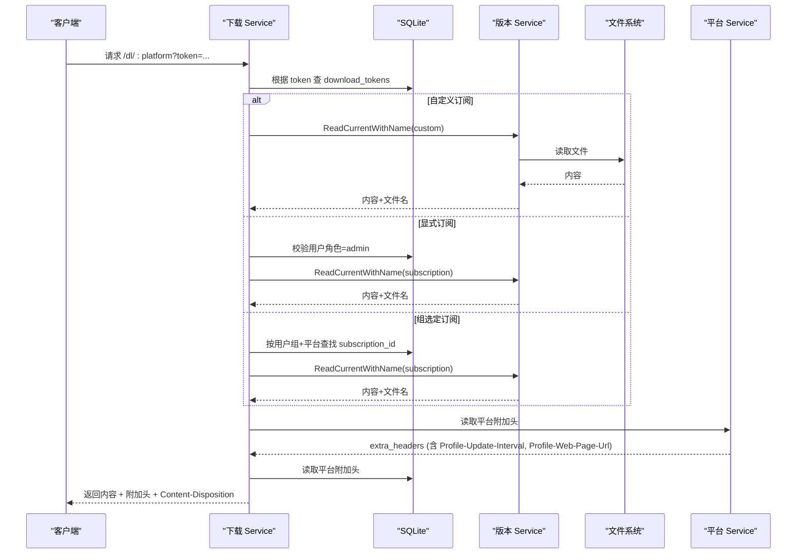

**图表来源**
- [backend/internal/download/download.go:53-117](file://backend/internal/download/download.go#L53-L117)
- [backend/internal/download/download.go:119-146](file://backend/internal/download/download.go#L119-L146)
- [backend/internal/download/download.go:275-302](file://backend/internal/download/download.go#L275-L302)
- [backend/internal/setup/setup.go:144-158](file://backend/internal/setup/setup.go#L144-L158)

**章节来源**
- [backend/internal/download/download.go:19-23](file://backend/internal/download/download.go#L19-L23)
- [backend/internal/download/download.go:53-117](file://backend/internal/download/download.go#L53-L117)
- [backend/internal/download/download.go:119-146](file://backend/internal/download/download.go#L119-L146)
- [backend/internal/download/download.go:275-302](file://backend/internal/download/download.go#L275-L302)

### 平台服务（平台 CRUD、安装包、级联删除、附加响应头）
- 平台创建/更新：校验 scheme 与附加头；自动生成 slug；持久化 JSON 字段
- 安装包上传：流式写入、限大小、事务内原子替换旧文件、并发安全（O_EXCL）
- 级联删除：删除安装包、全部订阅及其版本文件、指向它们的下载 Token、自定义订阅及版本、组在该平台的关联与选定
- **附加响应头管理**：支持 Profile-Update-Interval、Profile-Web-Page-Url 等标准客户端参数

**更新**：平台服务现已支持多安装包和多下载链接功能，从单值列升级为 JSON 数组结构，提供更好的灵活性。**新增**：平台附加响应头系统支持 Clash 客户端标准参数，包括订阅更新间隔和网页链接配置。

**章节来源**
- [backend/internal/platform/platform.go:68-99](file://backend/internal/platform/platform.go#L68-99)
- [backend/internal/platform/platform.go:256-334](file://backend/internal/platform/platform.go#L256-334)
- [backend/internal/platform/platform.go:382-474](file://backend/internal/platform/platform.go#L382-L474)
- [backend/internal/setup/setup.go:144-158](file://backend/internal/setup/setup.go#L144-L158)

### Token 服务（生成、复用键、轮替、生命周期联动）
- 生成：≥128 位加密安全随机值（base64url）
- 复用键：无标识 user+platform；自定义 user+platform+custom_sub_id；显式 user+platform+subscription_id
- 轮替：同事务删旧建新，保持复用键不变
- 生命周期联动：删除订阅/自定义/用户时级联清理 Token

**更新**：Token 处理逻辑已澄清，订阅地址池使用基于平台的 Token 解析机制，与组选定和自定义订阅的 Token 机制明确区分。

**章节来源**
- [backend/internal/token/token.go:29-36](file://backend/internal/token/token.go#L29-L36)
- [backend/internal/token/token.go:48-88](file://backend/internal/token/token.go#L48-88)
- [backend/internal/token/token.go:92-123](file://backend/internal/token/token.go#L92-123)
- [backend/internal/token/token.go:125-156](file://backend/internal/token/token.go#L125-156)

### 规则服务（新增功能）
**最新更新**：规则服务提供了完整的规则管理能力，支持拖拽排序和全局共享Token机制。

#### 规则管理特性
- **拖拽排序**：支持手动输入和URL来源的规则条目进行拖拽重排序
- **全局共享Token**：每个规则拥有独立的Token，支持一键复制和公开下载
- **版本控制**：与订阅相同的版本管理机制，支持文件上传和文本编辑
- **级联删除**：删除规则时自动清理所有版本文件和Token

#### 规则创建流程
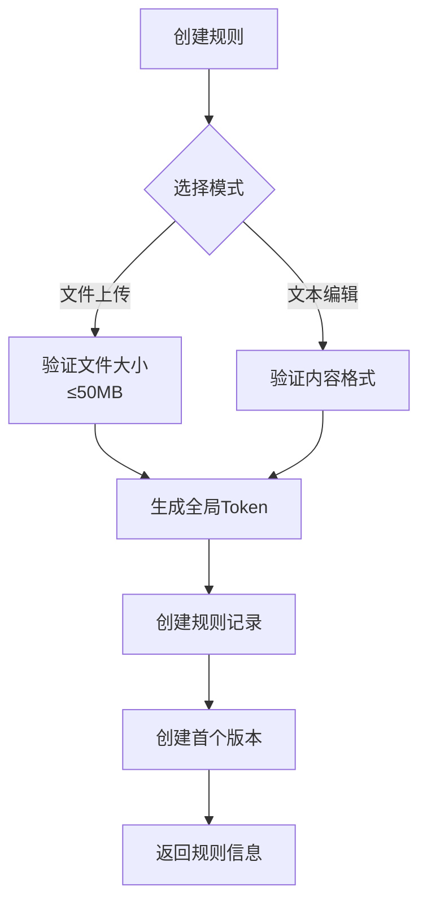

**图表来源**
- [backend/internal/server/rule.go:51-105](file://backend/internal/server/rule.go#L51-L105)
- [backend/internal/rule/rule.go:51-102](file://backend/internal/rule/rule.go#L51-102)

**章节来源**
- [backend/internal/rule/rule.go:25-36](file://backend/internal/rule/rule.go#L25-36)
- [backend/internal/rule/rule.go:51-102](file://backend/internal/rule/rule.go#L51-102)
- [backend/internal/server/rule.go:23-40](file://backend/internal/server/rule.go#L23-40)

### Shadowrocket 双组装器（增强功能）
**最新更新**：Shadowrocket 双组装器功能得到显著增强，支持更完善的节点订阅和分流规则生成。

#### 节点订阅装配器
- 勾选节点（manual / xray 来源）+ 填写订阅头部（STATUS / REMARKS）
- 产出 subs 内容（头部行 + 逐行节点链接，base64 编码）
- 不含规则，专注于节点链接生成

#### 分流规则装配器
- 填写 [General] 表单 + 勾选规则素材（池级勾选）+ 选择兜底流量方向（FINAL,DIRECT / FINAL,PROXY）
- 每个素材池仅需勾选代理或不代理，池内条目整体继承目标
- 产出 .conf（[General] + [Rule] + 兜底规则），不含节点

#### 多协议支持
- **vless REALITY**：base64 userinfo 形态，附加 xtls=2&pbk=公钥&sid=short-id
- **vmess V2rayN JSON**：vmess://base64(JSON) 格式，生态兼容性最广
- **trojan**：trojan://{用户代理密码}@host:port?remarks=...
- **shadowsocks**：ss://base64(cipher:{用户代理密码})@host:port#...

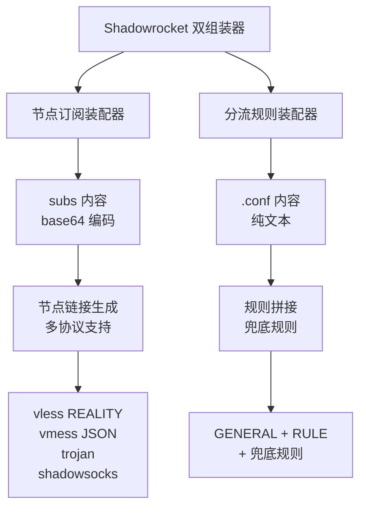

**图表来源**
- [Design2.md:110-116](../../../../../Design2.md#L110-L116)
- [Design2.md:175-185](../../../../../Design2.md#L175-L185)
- [Design2.md:254-258](../../../../../Design2.md#L254-L258)

**章节来源**
- [Design2.md:110-116](../../../../../Design2.md#L110-L116)
- [Design2.md:175-185](../../../../../Design2.md#L175-L185)
- [Design2.md:254-258](../../../../../Design2.md#L254-L258)

### 订阅模板架构（新增功能）
**最新更新**：系统现已支持订阅模板架构优化，实现每平台单模板与产品类型属性管理。

#### 模板架构设计
- **每平台单模板**：每个平台仅有一份订阅模板，通过 UNIQUE(platform_id) 约束
- **产品类型属性**：product_type 字段标识模板类型（yaml/subs），用于创建/上传时的格式校验
- **默认下载扩展名**：根据 product_type 自动设置默认扩展名（.yaml 或 .subs）
- **UI 展示优化**：根据模板类型调整界面展示和操作选项

#### 模板管理机制
- 模板创建时验证 product_type 与内容格式匹配
- 上传时根据模板类型进行相应的格式校验
- 下载时根据模板类型设置正确的 Content-Type 和扩展名
- 支持模板类型切换时的数据迁移和兼容性处理

**章节来源**
- [Design2.md:165](../../../../../Design2.md#L165)
- [Design2.md:371](../../../../../Design2.md#L371)
- [Design2.md:385](../../../../../Design2.md#L385)

### Xray 集成与节点注入机制（新增功能）
**重大更新**：系统现已支持高级模式下的 Xray 集成，实现动态节点注入和用户凭据管理。

#### Xray 集成架构
- **实例检测入库**：通过 gRPC 连接 Xray 实例，检测 inbound 配置并入库
- **节点统一管理**：nodes 表统一管理 manual 和 xray 两种来源的节点
- **用户凭据管理**：为每个用户生成 UUID 和代理密码，支持 AES-256-GCM 加密存储
- **动态节点注入**：下载时根据用户所属组和公共节点配置动态注入节点信息

#### 节点注入流程
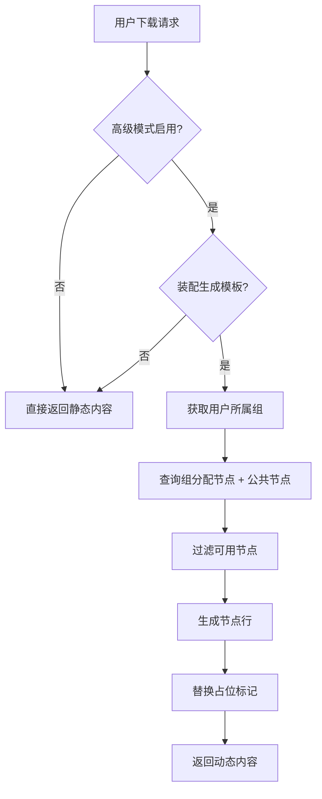

**图表来源**
- [Design2.md:311-339](../../../../../Design2.md#L311-L339)

#### 多协议支持
- **vless/vmess**：支持 per-user UUID 注入
- **trojan/shadowsocks**：支持 per-user 代理密码注入
- **REALITY 模式**：支持 xtls-rprx-vision flow 配置
- **TLS/WS 传输**：完整的传输层配置支持

**章节来源**
- [Design2.md:281-292](../../../../../Design2.md#L281-L292)
- [Design2.md:311-339](../../../../../Design2.md#L311-L339)

### 用户首页与订阅池管理（增强功能）
**最新更新**：用户首页和订阅池管理功能已增强，提供更好的订阅状态管理和用户体验。

#### Home Handler 功能
- **管理员池内订阅预览**：为管理员提供池内所有订阅的预览功能，每个订阅生成独立的显式 Token
- **普通用户订阅分配状态**：显示用户的订阅分配状态（自定义、组选定、未分配）
- **Token 管理**：为用户生成和管理下载 Token，支持刷新和失效控制

#### 订阅池状态管理
- **管理员模式**：status = "admin_pool"，显示平台下所有订阅，每份订阅都有独立的操作按钮
- **普通用户模式**：根据订阅分配情况显示不同状态：
  - custom：已被分配自定义订阅
  - group_selected：组内选定订阅
  - unassigned：未分配，需要联系管理员

#### 订阅池 UI 指导增强
- **激活状态提示**：明确告知用户生成的订阅"在池中但未激活"，需要管理员激活后才能生效
- **操作引导**：提供清晰的激活操作指引，减少用户困惑
- **状态可视化**：通过不同的视觉样式和提示信息展示订阅状态

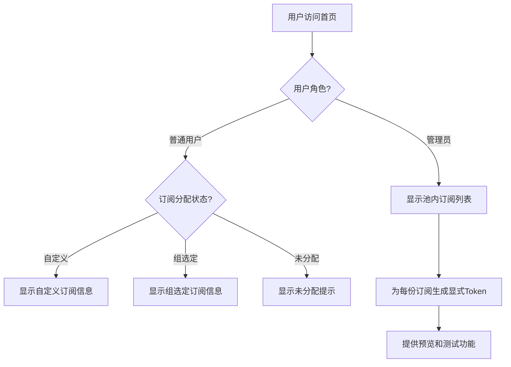

**图表来源**
- [backend/internal/server/home.go:82-176](file://backend/internal/server/home.go#L82-L176)
- [backend/internal/server/home.go:178-206](file://backend/internal/server/home.go#L178-L206)

**章节来源**
- [backend/internal/server/home.go:82-176](file://backend/internal/server/home.go#L82-L176)
- [backend/internal/server/home.go:178-206](file://backend/internal/server/home.go#L178-L206)
- [frontend/src/views/HomeView.vue:147-183](file://frontend/src/views/HomeView.vue#L147-L183)

### 前端界面组件（扁平化布局与用户体验优化）

**最新更新**：订阅管理界面已重新设计，采用扁平化布局替代传统的可折叠列表，提供更好的用户体验。**新增**：规则管理界面支持拖拽排序功能。**新增**：平台编辑界面支持附加响应头的可视化编辑。

#### TriStateList 组件
TriStateList 组件提供了统一的三态显示逻辑：
- 加载状态：显示骨架屏
- 空状态：显示自定义空消息和引导文案
- 列表状态：渲染实际的订阅列表内容

#### 订阅管理界面特性
- **扁平化布局**：所有订阅直接可见，无需展开折叠面板
- **改进的操作按钮**：每个订阅行都有独立的版本管理、编辑、删除按钮
- **增强的空状态处理**：当没有订阅时显示友好的引导信息
- **平台分组展示**：仍然按平台分组，但采用更直观的卡片式布局
- **响应式设计**：适配不同屏幕尺寸，移动端友好

#### 规则管理界面特性
- **拖拽排序**：支持规则条目的拖拽重排序，提升管理效率
- **全局Token管理**：每个规则拥有独立Token，支持一键复制
- **双模式创建**：支持文件上传和文本编辑两种方式
- **实时预览**：规则内容支持在线预览和编辑

#### 平台管理界面特性
- **附加响应头编辑器**：支持可视化编辑 Profile-Update-Interval、Profile-Web-Page-Url 等参数
- **实时更新**：附加响应头变更立即生效，无需重启服务
- **参数验证**：前端实时验证头名和头值的合法性
- **Clash 兼容**：预置 Clash Verge 平台的默认附加响应头配置

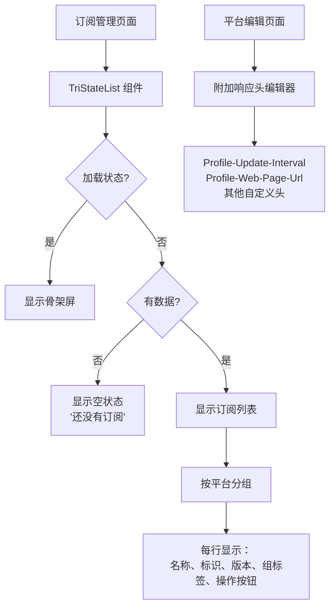

**图表来源**
- [frontend/src/views/admin/SubscriptionsView.vue:123-144](file://frontend/src/views/admin/SubscriptionsView.vue#L123-L144)
- [frontend/src/components/TriStateList.vue:14-21](file://frontend/src/components/TriStateList.vue#L14-L21)
- [frontend/src/views/admin/PlatformEditView.vue:169-179](file://frontend/src/views/admin/PlatformEditView.vue#L169-L179)

**章节来源**
- [frontend/src/views/admin/SubscriptionsView.vue:123-144](file://frontend/src/views/admin/SubscriptionsView.vue#L123-L144)
- [frontend/src/components/TriStateList.vue:1-22](file://frontend/src/components/TriStateList.vue#L1-L22)
- [frontend/src/views/admin/PlatformEditView.vue:169-179](file://frontend/src/views/admin/PlatformEditView.vue#L169-L179)

## 依赖关系分析
- 订阅服务依赖版本服务进行首版本创建与级联删除；通过回调注入避免循环依赖
- 版本服务依赖 Store 与文件系统；以 DB 为权威源，symlink 仅作组织
- 下载服务依赖版本服务读取当前版本内容，依赖平台配置注入附加头
- 平台服务在删除时级联清理订阅、Token、自定义订阅与版本文件
- 前端通过 API 模块调用后端路由，订阅管理页面聚合平台、组、订阅数据
- **新增**：规则服务依赖版本服务和Token服务，提供完整的规则生命周期管理
- **新增**：Shadowrocket 双组装器依赖配置组装系统进行占位符动态注入和多协议链接生成
- **新增**：订阅模板架构依赖产品类型属性进行格式校验和内容管理
- **新增**：Xray 集成模块依赖 gRPC 客户端进行实例通信和节点检测
- **新增**：Home Handler 依赖 Token 服务和下载服务，提供管理员池内订阅预览功能
- **新增**：平台附加响应头系统依赖配置服务进行 {frontend_url} 占位符替换

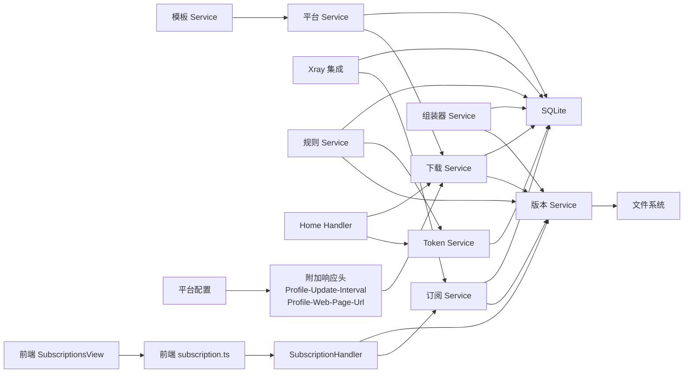

**图表来源**
- [backend/internal/subscription/subscription.go:28-41](file://backend/internal/subscription/subscription.go#L28-L41)
- [backend/internal/version/version.go:50-59](file://backend/internal/version/version.go#L50-59)
- [backend/internal/download/download.go:25-35](file://backend/internal/download/download.go#L25-L35)
- [backend/internal/platform/platform.go:36-46](file://backend/internal/platform/platform.go#L36-46)
- [backend/internal/token/token.go:19-27](file://backend/internal/token/token.go#L19-27)
- [backend/internal/rule/rule.go:25-36](file://backend/internal/rule/rule.go#L25-36)
- [backend/internal/server/home.go:22-28](file://backend/internal/server/home.go#L22-L28)
- [frontend/src/api/subscription.ts:25-35](file://frontend/src/api/subscription.ts#L25-L35)
- [backend/internal/server/subscription.go:22-38](file://backend/internal/server/subscription.go#L22-L38)
- [backend/internal/setup/setup.go:144-158](file://backend/internal/setup/setup.go#L144-L158)

**章节来源**
- [backend/internal/subscription/subscription.go:28-41](file://backend/internal/subscription/subscription.go#L28-L41)
- [backend/internal/version/version.go:50-59](file://backend/internal/version/version.go#L50-59)
- [backend/internal/download/download.go:25-35](file://backend/internal/download/download.go#L25-L35)
- [backend/internal/platform/platform.go:36-46](file://backend/internal/platform/platform.go#L36-46)
- [backend/internal/token/token.go:19-27](file://backend/internal/token/token.go#L19-27)
- [backend/internal/rule/rule.go:25-36](file://backend/internal/rule/rule.go#L25-36)
- [backend/internal/server/home.go:22-28](file://backend/internal/server/home.go#L22-L28)
- [frontend/src/api/subscription.ts:25-35](file://frontend/src/api/subscription.ts#L25-L35)
- [backend/internal/server/subscription.go:22-38](file://backend/internal/server/subscription.go#L22-L38)

## 性能与一致性
- 版本操作使用 BEGIN IMMEDIATE 事务与库级写锁，确保并发安全与一致性
- 版本数上限为 5，超出自动驱逐最旧版本，避免无限增长
- 文件写入限制大小（≤50MB），防止内存溢出
- 下载解析路径短、直接读取当前版本文件，减少 IO 开销
- 启动自检保证 DB 与 symlink 一致，降低不一致风险
- **新增**：规则服务采用相同的事务机制，确保规则操作的原子性
- **新增**：Shadowrocket 双组装器支持批量处理和异步生成，提升大规模配置生成效率
- **新增**：多安装包上传采用流式处理，避免大文件内存占用
- **新增**：Xray 集成采用串行化调用和幂等错误映射，避免并发压力
- **新增**：Home Handler 采用游标预读取模式，避免单连接死锁问题
- **新增**：平台附加响应头系统采用内存缓存，减少数据库查询开销

**章节来源**
- [backend/internal/version/version.go:25-38](file://backend/internal/version/version.go#L25-L38)
- [backend/internal/version/version.go:125-180](file://backend/internal/version/version.go#L125-L180)
- [backend/internal/version/version.go:438-484](file://backend/internal/version/version.go#L438-L484)
- [backend/internal/server/home.go:93-116](file://backend/internal/server/home.go#L93-L116)

## 故障排查指南
- 标识冲突：创建订阅时若手填 slug 与其他三类资源冲突，将返回冲突错误；可使用后端提供的检查接口即时反馈
- 版本不存在：切换或删除版本时报错，需确认版本号有效且非当前激活版本
- 下载失败：
  - token_invalid：Token 无效或与平台标识不一致
  - unassigned：用户未分配订阅（无自定义、无显式、组未选定）
  - version_missing：目标资源无当前版本
- 平台删除影响：删除平台会级联删除其下订阅、Token、自定义订阅与版本文件，请谨慎操作
- **新增**：规则管理问题：
  - 拖拽排序失败：检查浏览器是否支持HTML5 Drag and Drop API
  - Token失效：规则Token刷新后旧链接立即失效
  - 内容过大：规则内容超过50MB限制会被拒绝
- **新增**：Shadowrocket 组装失败：
  - 协议不支持：某些协议无法转换为节点链接，会在生成结果中列出跳过节点与原因
  - 模板错误：配置文件模板语法错误会导致生成失败
  - 占位符缺失：动态注入时缺少必要的占位符会导致生成异常
- **新增**：模板架构问题：
  - 产品类型不匹配：上传内容与模板类型不符时会拒绝
  - 扩展名错误：下载时会根据模板类型自动设置正确扩展名
  - 格式校验失败：不同模板类型有不同的格式要求
- **新增**：Xray 集成问题：
  - 实例连接失败：检查 Xray 实例配置和网络连通性
  - 节点检测失败：查看实例采集状态和错误日志
  - 凭据推送失败：检查用户配额状态和推送队列
- **新增**：订阅池管理问题：
  - 订阅未激活：生成的订阅在池中但未激活，需要管理员激活后才能生效
  - Token解析错误：订阅池使用基于平台的Token解析，确保Token与平台匹配
  - 权限不足：管理员池内订阅预览需要管理员权限
- **新增**：平台附加响应头问题：
  - Profile-Update-Interval 格式错误：应为数字字符串，表示小时数
  - Profile-Web-Page-Url 无效：应包含有效的前端URL
  - 附加头注入失败：检查平台配置的JSON格式是否正确

**章节来源**
- [backend/internal/subscription/subscription.go:86-115](file://backend/internal/subscription/subscription.go#L86-L115)
- [backend/internal/version/version.go:303-338](file://backend/internal/version/version.go#L303-L338)
- [backend/internal/download/download.go:19-23](file://backend/internal/download/download.go#L19-L23)
- [backend/internal/platform/platform.go:382-474](file://backend/internal/platform/platform.go#L382-L474)
- [backend/internal/server/home.go:178-206](file://backend/internal/server/home.go#L178-L206)

## 结论
本订阅管理系统实现了订阅的全生命周期管理与版本控制，结合平台关联与下载 Token 机制，提供了灵活的分发能力。**最新更新**：系统现已支持订阅模板架构优化，实现每平台单模板与产品类型属性管理；Shadowrocket 双组装器功能得到显著增强，可同时生成节点订阅和分流规则，并通过配置组装系统实现占位符动态注入和多协议支持。更重要的是，系统现已实现静态内容与模板内容的明确区分，支持高级模式下的动态节点注入和Xray集成，为用户提供更加强大和灵活的订阅管理能力。**新增功能**：规则管理服务提供了完整的规则生命周期管理，支持拖拽排序和全局共享Token机制；Shadowrocket分发机制改进为服务所有用户而非平台特定用户；公共节点功能自动包含在活跃用户集合中。**最新增强**：订阅分发机制UI指导已增强，明确告知用户生成的订阅"在池中但未激活"，需要管理员激活后才能生效；Token处理逻辑已澄清，订阅地址池使用基于平台的Token解析机制；Home Handler 提供了管理员池内订阅预览功能，提升了管理体验；**新增**：平台附加响应头系统完全集成了 Profile-Update-Interval 和 Profile-Web-Page-Url 参数，为 Clash 等客户端提供标准的订阅更新间隔和网页链接配置，与 SSPanel-UIM 的实现完全对齐。**新增**：前端平台编辑界面提供了可视化的附加响应头编辑功能，支持实时验证和即时生效。通过事务与文件系统的协同，保证了数据一致性与高可用；前端界面经过重新设计，采用扁平化布局和优化的用户体验，便于管理员高效管理。未来可进一步扩展更多资源类型与更细粒度的权限控制。

## 附录：API 与使用示例

### 订阅 CRUD（后端路由）
- 列表：GET /api/admin/subscriptions
- 创建：POST /api/admin/subscriptions
- 更新：PUT /api/admin/subscriptions/:id
- 删除：DELETE /api/admin/subscriptions/:id
- 标识检查：GET /api/admin/slug/check?slug=&type=&id=

**章节来源**
- [backend/internal/server/subscription.go:22-38](file://backend/internal/server/subscription.go#L22-L38)
- [backend/internal/server/subscription.go:65-148](file://backend/internal/server/subscription.go#L65-L148)

### 规则管理（新增功能）
- 列表：GET /api/admin/rules
- 创建：POST /api/admin/rules?mode=text 或 POST /api/admin/rules (文件上传)
- 改名：PUT /api/admin/rules/:id
- 删除：DELETE /api/admin/rules/:id
- Token刷新：POST /api/admin/rules/:id/token/refresh
- 用户端列表：GET /api/rules
- 预览：GET /api/rules/:id/preview

**章节来源**
- [backend/internal/server/rule.go:23-40](file://backend/internal/server/rule.go#L23-40)
- [backend/internal/server/rule.go:51-105](file://backend/internal/server/rule.go#L51-L105)
- [backend/internal/server/rule.go:161-184](file://backend/internal/server/rule.go#L161-L184)

### 版本管理（后端路由）
- 列表：GET /api/admin/subscriptions/:id/versions
- 创建：POST /api/admin/subscriptions/:id/versions?mode=upload|text
- 切换：PUT /api/admin/subscriptions/:id/versions/current
- 预览：GET /api/admin/subscriptions/:id/versions/:ver/preview
- 删除：DELETE /api/admin/subscriptions/:id/versions/:ver

**章节来源**
- [backend/internal/server/subscription.go:29-38](file://backend/internal/server/subscription.go#L29-L38)
- [backend/internal/server/subscription.go:150-170](file://backend/internal/server/subscription.go#L150-L170)
- [backend/internal/server/subscription.go:194-235](file://backend/internal/server/subscription.go#L194-L235)
- [backend/internal/server/subscription.go:237-283](file://backend/internal/server/subscription.go#L237-L283)
- [backend/internal/server/subscription.go:285-309](file://backend/internal/server/subscription.go#L285-L309)

### 用户首页与订阅池管理（新增功能）
- 平台列表：GET /api/home/platforms
- Token刷新：POST /api/home/token/refresh
- 更新时间戳：GET /api/home/updated_at

**章节来源**
- [backend/internal/server/home.go:37-43](file://backend/internal/server/home.go#L37-L43)
- [backend/internal/server/home.go:82-176](file://backend/internal/server/home.go#L82-L176)
- [backend/internal/server/home.go:226-266](file://backend/internal/server/home.go#L226-L266)
- [backend/internal/server/home.go:268-355](file://backend/internal/server/home.go#L268-L355)

### 平台管理API（新增功能）
- 平台列表：GET /api/admin/platforms
- 获取平台：GET /api/admin/platforms/:id
- 创建平台：POST /api/admin/platforms
- 更新平台：PUT /api/admin/platforms/:id
- 删除平台：DELETE /api/admin/platforms/:id
- 上传安装包：POST /api/admin/platforms/:id/installers
- 删除安装包：DELETE /api/admin/platforms/:id/installers/:file

**章节来源**
- [backend/internal/server/platform.go:19-30](file://backend/internal/server/platform.go#L19-30)
- [backend/internal/server/platform.go:52-120](file://backend/internal/server/platform.go#L52-120)
- [backend/internal/server/platform.go:139-187](file://backend/internal/server/platform.go#L139-L187)

### 前端调用示例（TypeScript）
- 列出订阅：listSubscriptions()
- 获取单个订阅：getSubscription(id)
- 创建订阅：createSubscription({ platform_id, name, group_ids })
- 更新订阅：updateSubscription(id, { name, group_ids })
- 删除订阅：deleteSubscription(id)
- 标识检查：checkSlug(slug, type?, id?)
- **新增**：规则管理API：
  - 列出规则：listAdminRules()
  - 创建规则：createRule(payload)
  - 改名规则：renameRule(id, name)
  - 删除规则：deleteRule(id)
  - 刷新Token：refreshRuleToken(id)
- **新增**：平台管理API：
  - 列出平台：listPlatforms()
  - 获取平台：getPlatform(id)
  - 创建平台：createPlatform(data)
  - 更新平台：updatePlatform(id, data)
  - 删除平台：deletePlatform(id)
  - 上传安装包：uploadInstaller(id, file, onProgress)
  - 删除安装包：deleteInstallerFile(id, file)

**章节来源**
- [frontend/src/api/subscription.ts:25-35](file://frontend/src/api/subscription.ts#L25-L35)
- [frontend/src/api/rule.ts:16-31](file://frontend/src/api/rule.ts#L16-L31)
- [frontend/src/api/platform.ts:34-58](file://frontend/src/api/platform.ts#L34-L58)

### 数据库模型（关键表）
- subscriptions：订阅主表（slug、name、platform_id、current_version）
- versions：版本表（owner_type、owner_id、version_no、file_path）
- subscription_group_rel：订阅与组的多对多关联
- **新增**：rules：规则主表（slug、name、client_type、schemes、current_version）
- **新增**：rule_tokens：规则Token表（rule_id、token、refreshed_at）
- **新增**：platforms：平台表（slug、name、description、schemes、extra_headers、installer_files、installer_urls）

**更新**：平台表现已支持多安装包和多下载链接，从单值列升级为 JSON 数组结构。**新增**：platforms表的extra_headers字段支持存储 Profile-Update-Interval、Profile-Web-Page-Url 等附加响应头配置。

**章节来源**
- [backend/migrations/1002_subscriptions_versions.sql:1-34](file://backend/migrations/1002_subscriptions_versions.sql#L1-L34)
- [backend/migrations/1008_platform_installers_multi.sql:1-14](file://backend/migrations/1008_platform_installers_multi.sql#L1-L14)

### Profile-Update-Interval 和 Profile-Web-Page-Url 参数说明

**Profile-Update-Interval**：
- **用途**：指定客户端自动更新订阅的时间间隔（单位：小时）
- **默认值**：6小时（Clash Verge 平台预置）
- **格式**：数字字符串，如 "6"、"12"、"24"
- **客户端支持**：Clash、Clash Verge 等支持该标准的客户端
- **配置位置**：平台附加响应头中设置

**Profile-Web-Page-Url**：
- **用途**：指定订阅的管理网页链接，客户端可在订阅详情中显示
- **默认值**：{frontend_url}（自动替换为实际前端地址）
- **格式**：完整的URL地址
- **客户端支持**：Clash、Clash Verge 等支持该标准的客户端
- **配置位置**：平台附加响应头中设置

**配置示例**：
```json
{
  "profile-update-interval": "6",
  "profile-web-page-url": "{frontend_url}",
  "content-disposition": "attachment; filename*=UTF-8''subscription.yaml"
}
```

**章节来源**
- [backend/internal/setup/setup.go:144-158](file://backend/internal/setup/setup.go#L144-L158)
- [docs/Reference/SSpanel-Subscribe.md:20-27](../../../../../docs/Reference/SSpanel-Subscribe.md#L20-L27)
- [docs/Reference/SSpanel-Subscribe.md:105-106](../../../../../docs/Reference/SSpanel-Subscribe.md#L105-L106)