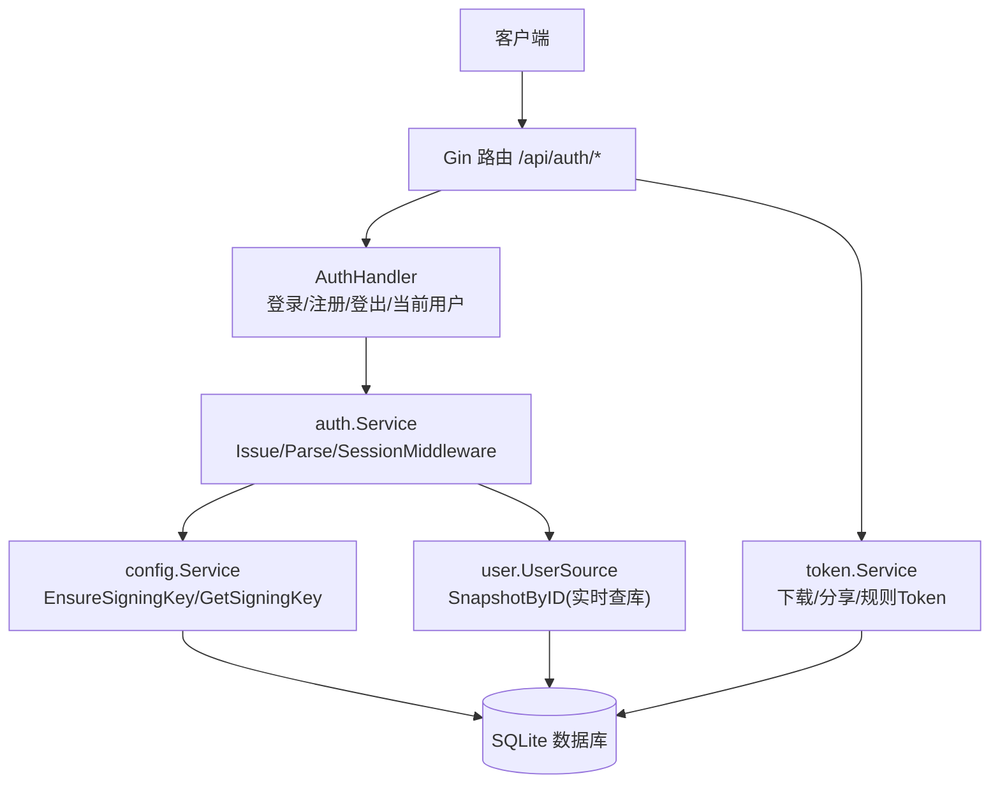
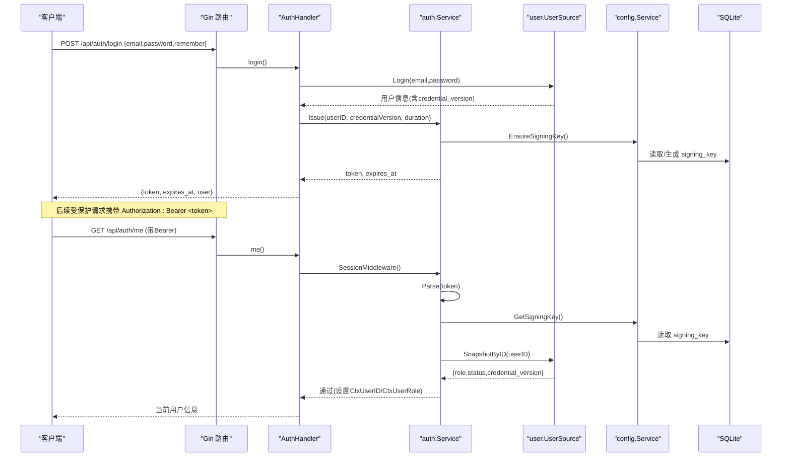
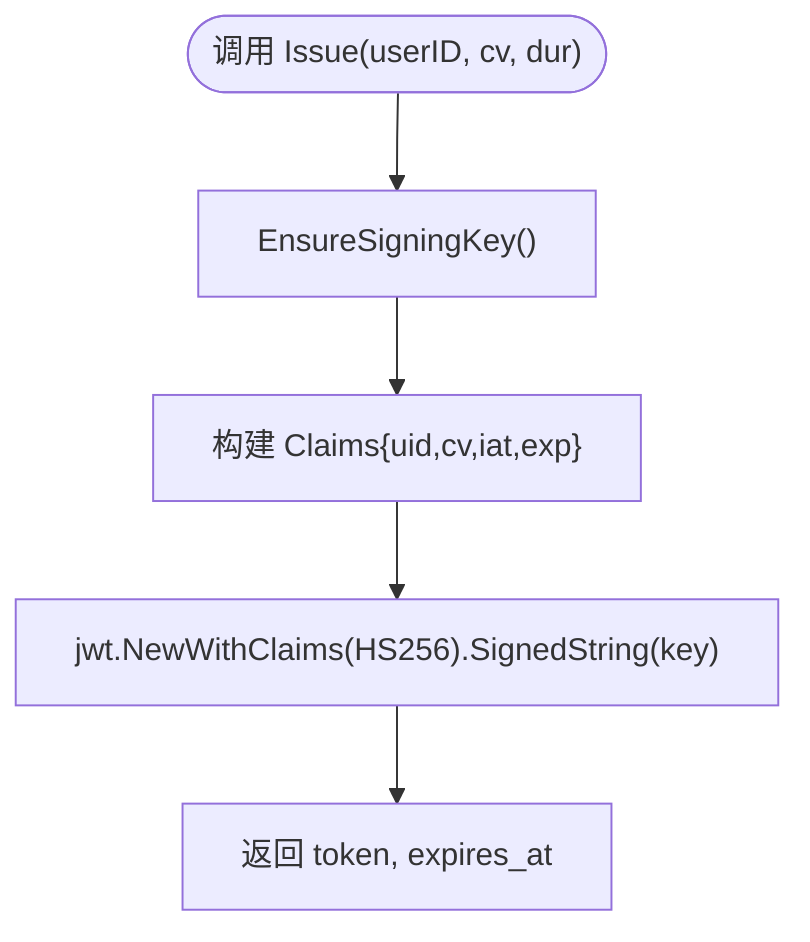
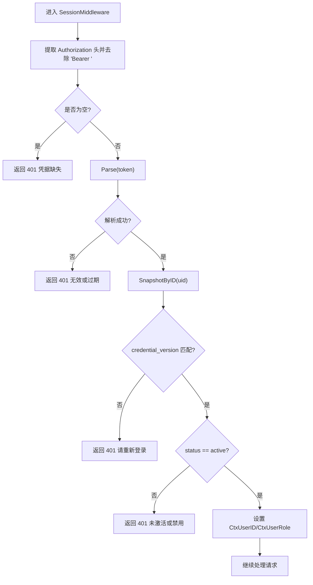
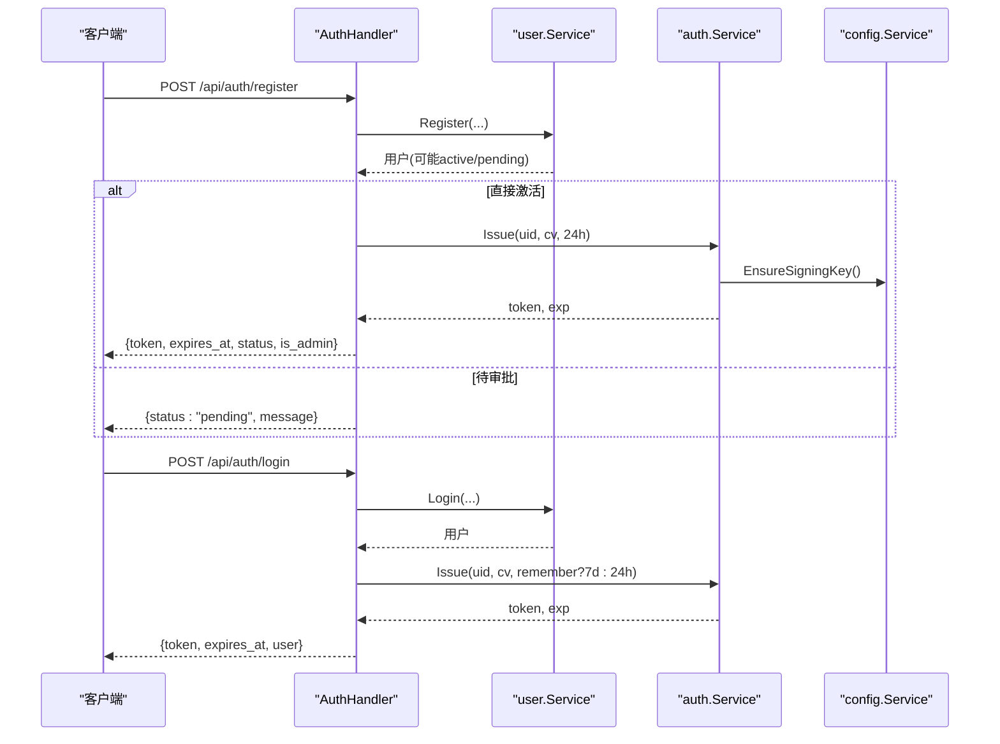
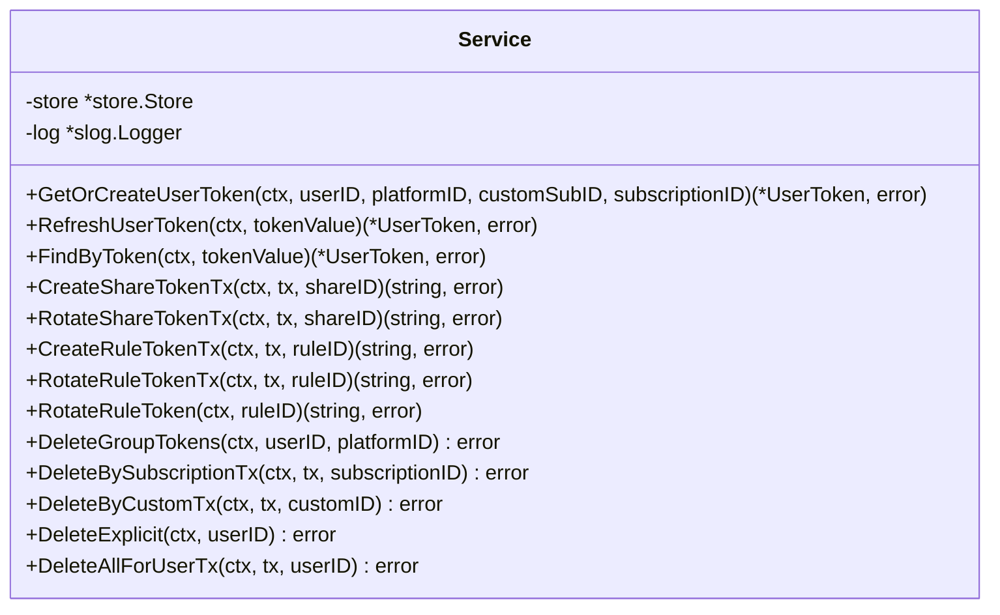
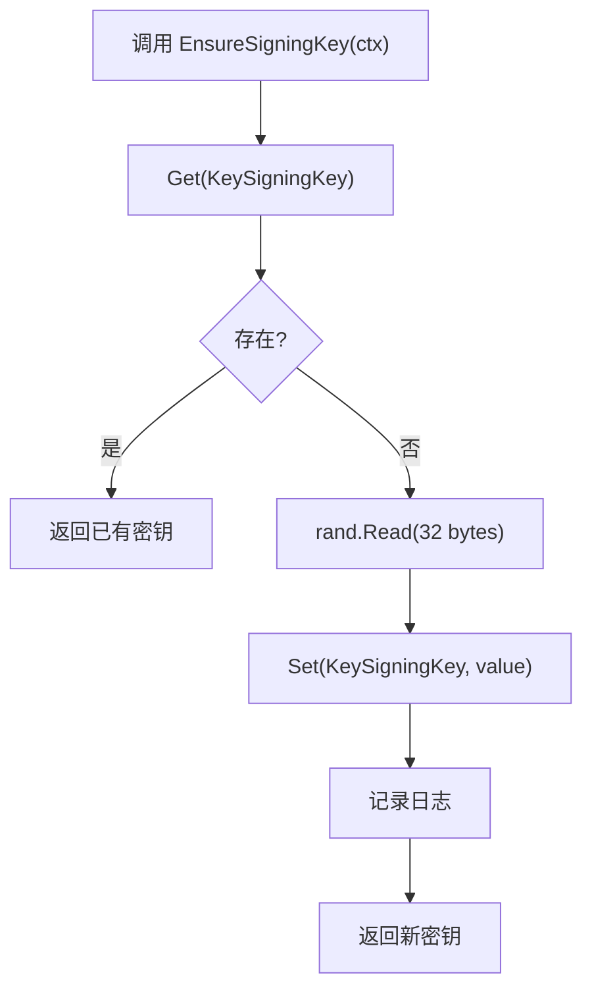
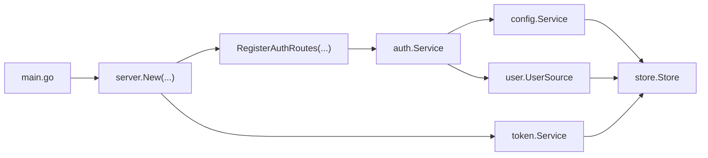

# JWT令牌管理

<cite>
**本文引用的文件**
- [backend/internal/auth/auth.go](file://backend/internal/auth/auth.go)
- [backend/internal/config/config.go](file://backend/internal/config/config.go)
- [backend/internal/server/auth.go](file://backend/internal/server/auth.go)
- [backend/cmd/server/main.go](file://backend/cmd/server/main.go)
- [backend/migrations/1004_tokens.sql](file://backend/migrations/1004_tokens.sql)
- [backend/internal/token/token.go](file://backend/internal/token/token.go)
</cite>

## 目录
1. [简介](#简介)
2. [项目结构](#项目结构)
3. [核心组件](#核心组件)
4. [架构总览](#架构总览)
5. [详细组件分析](#详细组件分析)
6. [依赖关系分析](#依赖关系分析)
7. [性能考虑](#性能考虑)
8. [故障排查指南](#故障排查指南)
9. [结论](#结论)
10. [附录：API与数据模型](#附录api与数据模型)

## 简介
本文件围绕JWT令牌管理系统，系统性说明令牌的签发、解析、验证流程，签名密钥管理、令牌载荷设计（用户ID、凭证版本等）、有效期与刷新机制；并解释会话中间件如何从请求头提取Bearer令牌、校验有效性并注入用户上下文。同时给出安全与性能建议，以及常见问题的定位方法。

## 项目结构
后端采用分层架构：
- 接入层（server）：注册路由、参数校验、统一响应
- 业务层（auth、config、token、user等）：认证、配置、令牌生命周期
- 数据层（store + migrations）：SQLite持久化、迁移、事务

图表来源
- [backend/internal/server/auth.go:24-34](file://backend/internal/server/auth.go#L24-L34)
- [backend/internal/auth/auth.go:87-135](file://backend/internal/auth/auth.go#L87-L135)
- [backend/internal/config/config.go:282-313](file://backend/internal/config/config.go#L282-L313)
- [backend/internal/token/token.go:19-88](file://backend/internal/token/token.go#L19-L88)

章节来源
- [backend/cmd/server/main.go:24-98](file://backend/cmd/server/main.go#L24-L98)
- [backend/internal/server/auth.go:24-34](file://backend/internal/server/auth.go#L24-L34)

## 核心组件
- 认证服务（auth.Service）
  - Issue：使用HS256签发JWT，载荷包含用户ID和凭证版本，附带标准iat/exp
  - Parse：验签并解析载荷，强制算法为HMAC
  - SessionMiddleware：从Authorization头提取Bearer令牌，解析后实时查库比对credential_version与状态，注入用户上下文
- 配置服务（config.Service）
  - EnsureSigningKey/GetSigningKey：确保并读取签名密钥（system_config.signing_key），缺失时自动生成32字节随机密钥
  - 敏感配置加解密：基于签名密钥派生AES-GCM密钥
- 令牌服务（token.Service）
  - 下载/分享/规则三类Token的创建、轮替、吊销与生命周期联动
- 服务器路由（server.AuthHandler）
  - 注册/登录/登出/当前用户端点，叠加限流与验证码中间件

章节来源
- [backend/internal/auth/auth.go:22-135](file://backend/internal/auth/auth.go#L22-L135)
- [backend/internal/config/config.go:24-313](file://backend/internal/config/config.go#L24-L313)
- [backend/internal/token/token.go:19-235](file://backend/internal/token/token.go#L19-L235)
- [backend/internal/server/auth.go:16-157](file://backend/internal/server/auth.go#L16-L157)

## 架构总览
JWT令牌在系统中的位置与流转如下：

图表来源
- [backend/internal/server/auth.go:99-134](file://backend/internal/server/auth.go#L99-L134)
- [backend/internal/auth/auth.go:98-135](file://backend/internal/auth/auth.go#L98-L135)
- [backend/internal/config/config.go:282-313](file://backend/internal/config/config.go#L282-L313)

## 详细组件分析

### JWT签发与解析（auth.Service）
- 签发（Issue）
  - 获取或生成签名密钥（EnsureSigningKey）
  - 构造Claims：uid、cv（credential_version）、iat、exp
  - 使用HS256签名生成JWT
- 解析（Parse）
  - 获取签名密钥（GetSigningKey）
  - 强制要求算法为HMAC，否则拒绝
  - 返回Claims供后续校验

图表来源
- [backend/internal/auth/auth.go:98-116](file://backend/internal/auth/auth.go#L98-L116)
- [backend/internal/config/config.go:294-313](file://backend/internal/config/config.go#L294-L313)

章节来源
- [backend/internal/auth/auth.go:66-135](file://backend/internal/auth/auth.go#L66-L135)
- [backend/internal/config/config.go:282-313](file://backend/internal/config/config.go#L282-L313)

### 会话中间件（SessionMiddleware）
- 从Authorization头提取Bearer令牌
- 解析并验签
- 实时查库取用户快照，比对credential_version与status
- 将用户ID与角色注入到上下文（CtxUserID、CtxUserRole）

图表来源
- [backend/internal/auth/auth.go:144-179](file://backend/internal/auth/auth.go#L144-L179)

章节来源
- [backend/internal/auth/auth.go:137-179](file://backend/internal/auth/auth.go#L137-L179)

### 登录/注册流程（server.AuthHandler）
- 注册：校验参数与开关，创建用户（首管理员逻辑由user包实现），若直接激活则签发会话
- 登录：校验邮箱密码，根据remember选择时长（7天/24小时），签发会话
- 当前用户：经SessionMiddleware鉴权后返回用户信息
- 登出：客户端语义，服务端无状态

图表来源
- [backend/internal/server/auth.go:44-134](file://backend/internal/server/auth.go#L44-L134)
- [backend/internal/auth/auth.go:98-116](file://backend/internal/auth/auth.go#L98-L116)
- [backend/internal/config/config.go:294-313](file://backend/internal/config/config.go#L294-L313)

章节来源
- [backend/internal/server/auth.go:44-157](file://backend/internal/server/auth.go#L44-L157)

### 令牌服务（token.Service）
- 下载Token：三态复用键（user+platform±custom_sub_id/subscription_id），并发安全先查后建，冲突重试
- 分享/规则Token：创建、轮替（旧删新写）、记录刷新时间
- 生命周期联动：删除订阅/自定义/显式Token，批量清理用户Token

图表来源
- [backend/internal/token/token.go:19-235](file://backend/internal/token/token.go#L19-L235)

章节来源
- [backend/internal/token/token.go:19-235](file://backend/internal/token/token.go#L19-L235)

### 签名密钥管理（config.Service）
- 存储位置：system_config表 key=signing_key
- 生成策略：首次EnsureSigningKey时生成32字节加密安全随机值并落库
- 读取策略：GetSigningKey仅读取不生成，缺失返回错误（用于验签）
- 事务内版本：EnsureSigningKeyTx/GetSigningKeyTx保证事务原子性

图表来源
- [backend/internal/config/config.go:294-313](file://backend/internal/config/config.go#L294-L313)

章节来源
- [backend/internal/config/config.go:24-313](file://backend/internal/config/config.go#L24-L313)

## 依赖关系分析
- auth.Service依赖config.Service获取签名密钥，依赖user.UserSource进行实时用户快照查询
- server.AuthHandler组合auth.Service与user.Service，提供HTTP端点
- token.Service依赖store.Store进行数据库操作，独立于JWT体系但共享同一数据库
- main负责装配各服务并启动HTTP服务

图表来源
- [backend/cmd/server/main.go:77-84](file://backend/cmd/server/main.go#L77-L84)
- [backend/internal/server/auth.go:24-34](file://backend/internal/server/auth.go#L24-L34)

章节来源
- [backend/cmd/server/main.go:77-84](file://backend/cmd/server/main.go#L77-L84)
- [backend/internal/server/auth.go:24-34](file://backend/internal/server/auth.go#L24-L34)

## 性能考虑
- 会话校验每次请求实时查库，避免缓存权限信息导致越权
- SQLite单写者模型（MaxOpenConns=1）配合BEGIN IMMEDIATE事务，降低并发写冲突
- 下载Token采用“先查后建”并发安全模式，减少重复写入
- 访问日志按created_at索引，支持定期清理

[本节为通用指导，无需特定文件引用]

## 故障排查指南
- 401 凭据缺失：检查Authorization头是否包含Bearer前缀
- 401 解析失败：确认签名密钥已配置且一致；算法必须为HMAC
- 401 凭据失效：检查credential_version是否变更（如重置密码、禁用账号）
- 401 账号未激活/禁用：检查用户status字段
- 下载Token不存在：确认复用键是否正确，或Token是否已被轮替/删除

章节来源
- [backend/internal/auth/auth.go:144-179](file://backend/internal/auth/auth.go#L144-L179)
- [backend/internal/token/token.go:125-172](file://backend/internal/token/token.go#L125-L172)

## 结论
本系统采用无状态JWT会话机制，结合凭证版本号实现细粒度失效控制；签名密钥集中管理，支持自动初始化与事务内一致性；会话中间件严格校验用户状态与权限，保障接口安全。下载/分享/规则Token提供灵活的资源访问控制，并通过数据库事务保证并发安全。整体设计兼顾安全性、可维护性与性能。

[本节为总结，无需特定文件引用]

## 附录：API与数据模型

### 认证相关API
- POST /api/auth/register：注册并可能签发会话
- POST /api/auth/login：登录并签发会话
- GET /api/auth/me：获取当前用户信息（需鉴权）
- POST /api/auth/logout：客户端登出（服务端无状态）

章节来源
- [backend/internal/server/auth.go:24-34](file://backend/internal/server/auth.go#L24-L34)
- [backend/internal/server/auth.go:44-157](file://backend/internal/server/auth.go#L44-L157)

### 数据模型（节选）
- users：用户基本信息、角色、状态、凭证版本
- system_config：系统配置（含signing_key）
- download_tokens/share_tokens/rule_tokens：各类资源访问Token

章节来源
- [backend/migrations/1004_tokens.sql:1-47](file://backend/migrations/1004_tokens.sql#L1-L47)