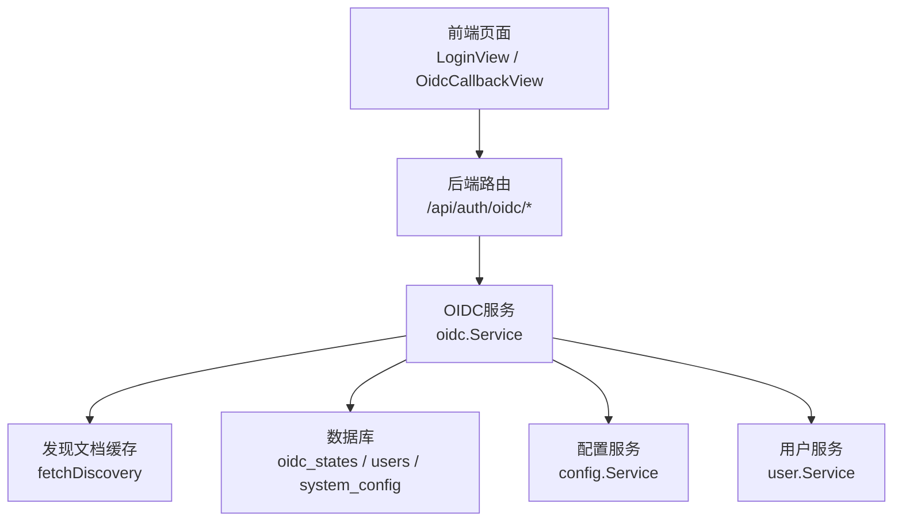
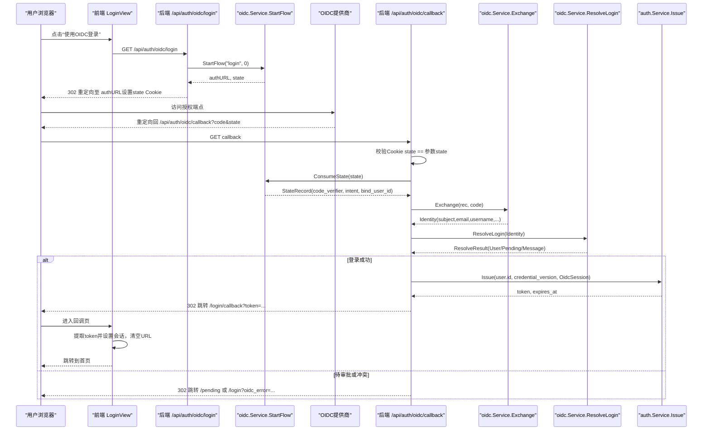
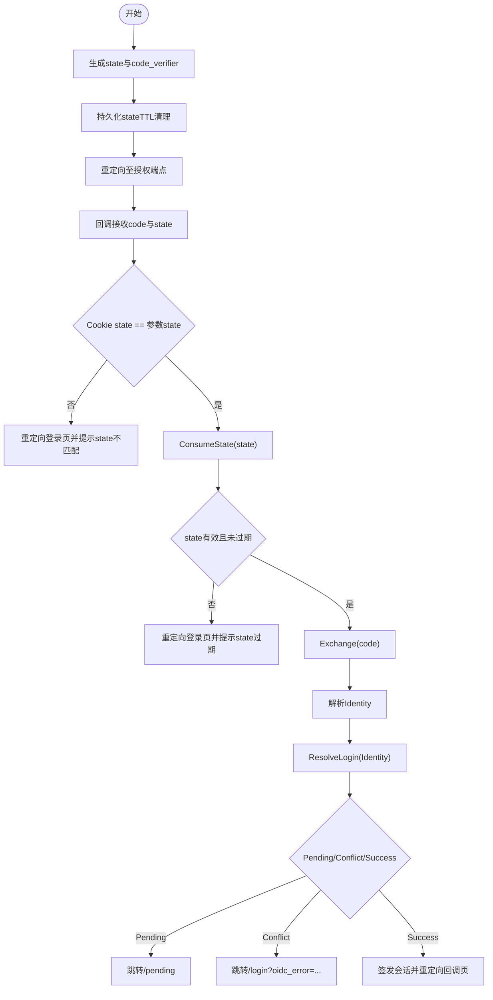
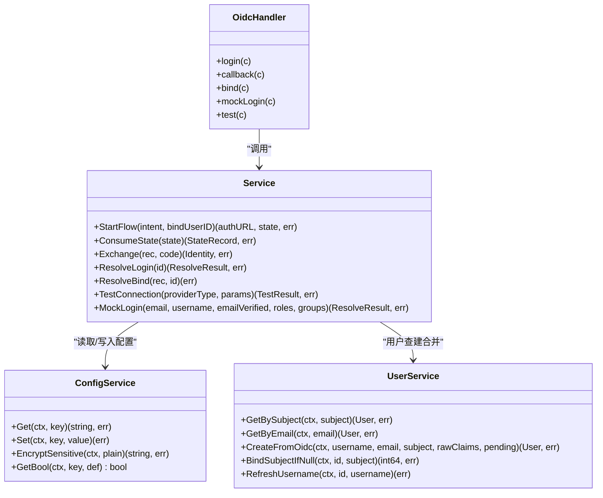

# OIDC单点登录集成

<cite>
**本文引用的文件**
- [backend/internal/oidc/oidc.go](file://backend/internal/oidc/oidc.go)
- [backend/internal/oidc/flow.go](file://backend/internal/oidc/flow.go)
- [backend/internal/oidc/helpers.go](file://backend/internal/oidc/helpers.go)
- [backend/internal/oidc/mock.go](file://backend/internal/oidc/mock.go)
- [backend/internal/oidc/resolve.go](file://backend/internal/oidc/resolve.go)
- [backend/internal/server/oidc.go](file://backend/internal/server/oidc.go)
- [backend/internal/user/oidc.go](file://backend/internal/user/oidc.go)
- [backend/internal/config/config.go](file://backend/internal/config/config.go)
- [backend/migrations/0004_oidc.sql](file://backend/migrations/0004_oidc.sql)
- [frontend/src/views/LoginView.vue](file://frontend/src/views/LoginView.vue)
- [frontend/src/views/OidcCallbackView.vue](file://frontend/src/views/OidcCallbackView.vue)
- [frontend/src/api/oidc.ts](file://frontend/src/api/oidc.ts)
</cite>

## 目录
1. [简介](#简介)
2. [项目结构](#项目结构)
3. [核心组件](#核心组件)
4. [架构总览](#架构总览)
5. [详细组件分析](#详细组件分析)
6. [依赖关系分析](#依赖关系分析)
7. [性能与安全性考虑](#性能与安全性考虑)
8. [故障排除指南](#故障排除指南)
9. [结论](#结论)
10. [附录：配置与使用示例](#附录配置与使用示例)

## 简介
本文件面向需要在系统中启用 OpenID Connect（OIDC）单点登录的读者，系统性说明授权码流程、回调处理、用户信息获取与映射、状态管理、白名单审批、以及常见提供商（Google、GitHub、企业SSO等）的配置要点。文档基于代码仓库中的后端实现与前端交互进行解读，并提供可操作的步骤指引和常见问题排查方法。

## 项目结构
后端采用分层设计：
- 接入层（server）：注册并处理 /api/auth/oidc/* 路由，负责发起授权、回调、绑定、测试连接等HTTP端点。
- 业务层（oidc）：实现OIDC发现、PKCE授权码流程、state持久化与校验、token交换、身份解析、用户查建合并、白名单匹配、模拟登录与连接测试。
- 数据层（user/store/config）：用户表操作、系统配置读写（含敏感字段加密）、数据库迁移。
- 前端（frontend）：登录页触发OIDC登录、回调中转页提取会话令牌、API封装调用后端OIDC接口。

图表来源
- [backend/internal/server/oidc.go:19-27](file://backend/internal/server/oidc.go#L19-L27)
- [backend/internal/oidc/oidc.go:53-73](file://backend/internal/oidc/oidc.go#L53-L73)
- [backend/internal/oidc/flow.go:27-62](file://backend/internal/oidc/flow.go#L27-L62)
- [backend/internal/config/config.go:48-55](file://backend/internal/config/config.go#L48-L55)

章节来源
- [backend/internal/server/oidc.go:19-27](file://backend/internal/server/oidc.go#L19-L27)
- [backend/internal/oidc/oidc.go:53-73](file://backend/internal/oidc/oidc.go#L53-L73)
- [backend/internal/config/config.go:48-55](file://backend/internal/config/config.go#L48-L55)

## 核心组件
- OIDC服务（oidc.Service）：封装发现文档获取、PKCE授权码流程、state存储与消费、token交换、身份解析、用户查建合并、白名单匹配、模拟登录、连接测试。
- 服务器路由（server.OidcHandler）：提供/login、/callback、/bind、/mock/login、/test等端点，串联OIDC流程与认证会话签发。
- 用户服务（user.Service）：按subject或邮箱查询用户、创建OIDC新用户、条件绑定subject、刷新用户名。
- 配置服务（config.Service）：读取/写入系统配置，支持敏感值AES-GCM加密；提供布尔/整数/JSON数组等类型化读取。
- 前端视图与API：登录页触发OIDC登录，回调页提取token并设置会话；API封装测试、设置、模拟登录、绑定等接口。

章节来源
- [backend/internal/oidc/oidc.go:53-73](file://backend/internal/oidc/oidc.go#L53-L73)
- [backend/internal/server/oidc.go:19-27](file://backend/internal/server/oidc.go#L19-L27)
- [backend/internal/user/oidc.go:13-27](file://backend/internal/user/oidc.go#L13-L27)
- [backend/internal/config/config.go:57-79](file://backend/internal/config/config.go#L57-L79)
- [frontend/src/views/LoginView.vue:60-63](file://frontend/src/views/LoginView.vue#L60-L63)
- [frontend/src/views/OidcCallbackView.vue:11-18](file://frontend/src/views/OidcCallbackView.vue#L11-L18)
- [frontend/src/api/oidc.ts:4-10](file://frontend/src/api/oidc.ts#L4-L10)

## 架构总览
下图展示OIDC授权码流程从前端到后端的完整时序，包括state生成、重定向至提供商、回调校验、token交换、用户解析与会话签发。

图表来源
- [backend/internal/server/oidc.go:31-89](file://backend/internal/server/oidc.go#L31-L89)
- [backend/internal/oidc/flow.go:27-62](file://backend/internal/oidc/flow.go#L27-L62)
- [backend/internal/oidc/flow.go:95-119](file://backend/internal/oidc/flow.go#L95-L119)
- [backend/internal/oidc/flow.go:132-227](file://backend/internal/oidc/flow.go#L132-L227)
- [backend/internal/oidc/resolve.go:17-83](file://backend/internal/oidc/resolve.go#L17-L83)
- [frontend/src/views/OidcCallbackView.vue:11-18](file://frontend/src/views/OidcCallbackView.vue#L11-L18)

## 详细组件分析

### 授权码流程与状态管理
- 启动流程：生成安全随机state与code_verifier，持久化到oidc_states表（带TTL清理），返回授权URL。
- 回调处理：三重校验（Cookie state == 回调参数state == 存储记录存在且未过期），用后即删防重放。
- Token交换：根据提供商类型走真实或模拟路径，POST token_endpoint换取id_token，解析payload提取身份信息。
- 用户解析：按subject命中直接登录；若邮箱命中则尝试合并；否则创建新用户（首管理员机制生效）。

图表来源
- [backend/internal/oidc/flow.go:27-62](file://backend/internal/oidc/flow.go#L27-L62)
- [backend/internal/oidc/flow.go:95-119](file://backend/internal/oidc/flow.go#L95-L119)
- [backend/internal/oidc/flow.go:132-227](file://backend/internal/oidc/flow.go#L132-L227)
- [backend/internal/oidc/resolve.go:17-83](file://backend/internal/oidc/resolve.go#L17-L83)
- [backend/internal/server/oidc.go:42-89](file://backend/internal/server/oidc.go#L42-L89)

章节来源
- [backend/internal/oidc/flow.go:27-62](file://backend/internal/oidc/flow.go#L27-L62)
- [backend/internal/oidc/flow.go:95-119](file://backend/internal/oidc/flow.go#L95-L119)
- [backend/internal/oidc/flow.go:132-227](file://backend/internal/oidc/flow.go#L132-L227)
- [backend/internal/oidc/resolve.go:17-83](file://backend/internal/oidc/resolve.go#L17-L83)
- [backend/internal/server/oidc.go:42-89](file://backend/internal/server/oidc.go#L42-L89)

### 用户信息获取与映射
- 身份字段：sub、email、email_verified、preferred_username/name、role/group claims。
- 用户名策略：优先preferred_username，其次name，再退化为邮箱前缀。
- 角色与组：从realm_access.roles或groups提取，用于白名单匹配与后续权限控制。
- 首次登录：首管理员免审批自动激活；其他用户受审批开关与白名单影响。

章节来源
- [backend/internal/oidc/flow.go:189-225](file://backend/internal/oidc/flow.go#L189-L225)
- [backend/internal/oidc/resolve.go:17-83](file://backend/internal/oidc/resolve.go#L17-L83)
- [backend/internal/user/oidc.go:68-119](file://backend/internal/user/oidc.go#L68-L119)

### 白名单与审批逻辑
- 白名单配置：通过系统配置键存储JSON，包含role_claim_path、role_values、group_claim_path、group_values。
- 匹配规则：解析claims按点分路径取值，任一命中即视为白名单通过，跳过审批直接激活。
- 审批开关：默认关闭；开启时未命中白名单的新用户进入pending状态，保存原始claims快照。

章节来源
- [backend/internal/oidc/oidc.go:214-238](file://backend/internal/oidc/oidc.go#L214-L238)
- [backend/internal/oidc/helpers.go:40-88](file://backend/internal/oidc/helpers.go#L40-L88)
- [backend/internal/oidc/resolve.go:71-83](file://backend/internal/oidc/resolve.go#L71-L83)

### 绑定流程（将OIDC身份绑定到现有账号）
- 入口：/api/auth/oidc/bind，需已登录会话。
- 流程：StartFlow("bind", userID) → 重定向至授权 → 回调ResolveBind校验subject未绑定其他账号 → 条件更新防止并发覆盖。
- 结果：绑定成功后返回/profile?oidc_bound=1，不签发会话。

章节来源
- [backend/internal/server/oidc.go:127-139](file://backend/internal/server/oidc.go#L127-L139)
- [backend/internal/oidc/resolve.go:85-102](file://backend/internal/oidc/resolve.go#L85-L102)

### 模拟登录与测试连接
- 模拟登录：Dev模式+provider=mock时可用，构造Identity并走ResolveLogin，便于复现合并/冲突场景。
- 测试连接：验证发现文档可达性与配置完整性；可选client_credentials验证Client ID/Secret，不支持时降级为警告。

章节来源
- [backend/internal/oidc/mock.go:17-53](file://backend/internal/oidc/mock.go#L17-L53)
- [backend/internal/oidc/mock.go:72-107](file://backend/internal/oidc/mock.go#L72-L107)
- [backend/internal/server/oidc.go:92-125](file://backend/internal/server/oidc.go#L92-L125)
- [backend/internal/server/oidc.go:141-162](file://backend/internal/server/oidc.go#L141-L162)

## 依赖关系分析
- oidc.Service依赖：
  - config.Service：读取/写入系统配置（提供商类型、参数、审批开关、白名单、前端URL等）。
  - user.Service：用户查建合并、绑定subject、刷新用户名。
  - store：事务与oidc_states表操作。
  - http.Client：请求发现文档与token端点。
- server.OidcHandler依赖：
  - oidc.Service：流程编排。
  - auth.Service：会话签发。
- 前端依赖：
  - LoginView：触发OIDC登录与显示错误。
  - OidcCallbackView：提取token并设置会话。
  - api/oidc.ts：封装测试、设置、模拟登录、绑定等接口。

图表来源
- [backend/internal/oidc/oidc.go:53-73](file://backend/internal/oidc/oidc.go#L53-L73)
- [backend/internal/server/oidc.go:13-27](file://backend/internal/server/oidc.go#L13-L27)
- [backend/internal/config/config.go:48-55](file://backend/internal/config/config.go#L48-L55)
- [backend/internal/user/oidc.go:13-27](file://backend/internal/user/oidc.go#L13-L27)

章节来源
- [backend/internal/oidc/oidc.go:53-73](file://backend/internal/oidc/oidc.go#L53-L73)
- [backend/internal/server/oidc.go:13-27](file://backend/internal/server/oidc.go#L13-L27)
- [backend/internal/config/config.go:48-55](file://backend/internal/config/config.go#L48-L55)
- [backend/internal/user/oidc.go:13-27](file://backend/internal/user/oidc.go#L13-L27)

## 性能与安全性考虑
- 发现文档缓存：按base_url+realm缓存，减少重复网络请求。
- State TTL：oidc_states记录10分钟过期，插入时清理过期行，避免无限增长。
- PKCE S256：使用code_challenge与code_verifier增强授权码流程安全性。
- 敏感配置加密：OIDC Client Secret以AES-GCM密文落库，读取时解密。
- 会话固定防护：state一次性使用，回调后立即删除；Cookie设置HttpOnly与SameSite。
- 并发安全：绑定subject使用条件更新（WHERE oidc_subject IS NULL）防止覆盖。

章节来源
- [backend/internal/oidc/oidc.go:157-212](file://backend/internal/oidc/oidc.go#L157-L212)
- [backend/internal/oidc/flow.go:27-85](file://backend/internal/oidc/flow.go#L27-L85)
- [backend/internal/oidc/flow.go:95-119](file://backend/internal/oidc/flow.go#L95-L119)
- [backend/internal/config/config.go:220-280](file://backend/internal/config/config.go#L220-L280)
- [backend/internal/user/oidc.go:52-66](file://backend/internal/user/oidc.go#L52-L66)

## 故障排除指南
- state不匹配：检查Cookie是否被拦截或跨域问题；确保回调URL与提供商配置一致。
- state过期：授权流程耗时过长导致state失效；建议缩短用户操作时间或调整TTL。
- token交换失败：确认client_id/secret正确；检查token_endpoint可达性；查看响应体错误信息。
- 用户冲突：目标账号已绑定其他OIDC身份或禁用；需管理员解绑或启用账号。
- 邮箱未验证：无法自动合并；需用户在提供商侧完成邮箱验证。
- 发现文档不可达：检查base_url/realm是否正确；网络连通性与防火墙策略。
- 模拟登录不可用：仅在Dev模式且provider=mock时可用；确认应用模式与提供商类型。

章节来源
- [backend/internal/server/oidc.go:42-89](file://backend/internal/server/oidc.go#L42-L89)
- [backend/internal/oidc/flow.go:95-119](file://backend/internal/oidc/flow.go#L95-L119)
- [backend/internal/oidc/flow.go:132-227](file://backend/internal/oidc/flow.go#L132-L227)
- [backend/internal/oidc/resolve.go:17-83](file://backend/internal/oidc/resolve.go#L17-L83)
- [backend/internal/oidc/mock.go:17-53](file://backend/internal/oidc/mock.go#L17-L53)

## 结论
本实现提供了完整的OIDC授权码流程，涵盖状态管理、PKCE、用户查建合并、白名单审批、绑定与测试连接等功能。通过配置服务统一管理提供商参数与敏感信息，结合前端简洁的登录与回调体验，满足多类OIDC提供商的集成需求。生产环境建议启用严格的安全策略（如HTTPS、合理TTL、白名单审批）并进行充分测试。

## 附录：配置与使用示例

### 启用OIDC登录
- 在登录页点击“使用OIDC登录”，前端跳转后端/login发起授权。
- 后端生成state与code_verifier，重定向至提供商授权端点。
- 回调后校验state，交换token并解析身份，签发会话并重定向至回调页。

章节来源
- [frontend/src/views/LoginView.vue:60-63](file://frontend/src/views/LoginView.vue#L60-L63)
- [backend/internal/server/oidc.go:31-89](file://backend/internal/server/oidc.go#L31-L89)
- [frontend/src/views/OidcCallbackView.vue:11-18](file://frontend/src/views/OidcCallbackView.vue#L11-L18)

### 配置OIDC提供商（通用步骤）
- 在提供商处创建客户端，记录client_id与client_secret，设置回调地址为前端URL + /api/auth/oidc/callback。
- 在后端配置中设置provider_type、base_url、realm（如Keycloak）、client_id、client_secret。
- 使用测试连接端点验证发现文档可达性与凭据有效性。

章节来源
- [backend/internal/oidc/oidc.go:25-33](file://backend/internal/oidc/oidc.go#L25-L33)
- [backend/internal/oidc/mock.go:72-107](file://backend/internal/oidc/mock.go#L72-L107)
- [backend/internal/server/oidc.go:141-162](file://backend/internal/server/oidc.go#L141-L162)

### 处理用户同步与审批
- 首次登录：首管理员免审批自动激活；其他用户受审批开关与白名单影响。
- 白名单：配置role/group claim路径与允许值，命中即跳过审批。
- 待审批：用户进入pending状态，保存原始claims快照，等待管理员审批。

章节来源
- [backend/internal/oidc/resolve.go:71-83](file://backend/internal/oidc/resolve.go#L71-L83)
- [backend/internal/oidc/oidc.go:214-238](file://backend/internal/oidc/oidc.go#L214-L238)
- [backend/internal/user/oidc.go:68-119](file://backend/internal/user/oidc.go#L68-L119)

### 常见提供商配置要点
- Google/GitHub：通常为标准OIDC提供者，配置base_url与client_id/secret即可；注意回调地址一致性。
- Keycloak：设置base_url与realm，使用realms/{realm}/.well-known/openid-configuration。
- 企业SSO：确认支持OIDC授权码流程与必要claims（sub、email、roles/groups）；必要时配置白名单。

章节来源
- [backend/internal/oidc/oidc.go:157-205](file://backend/internal/oidc/oidc.go#L157-L205)
- [backend/internal/oidc/helpers.go:40-88](file://backend/internal/oidc/helpers.go#L40-L88)

### 数据库与迁移
- oidc_states表：存储state、code_verifier、intent、bind_user_id、created_at，用于状态管理与TTL清理。

章节来源
- [backend/migrations/0004_oidc.sql:1-9](file://backend/migrations/0004_oidc.sql#L1-L9)