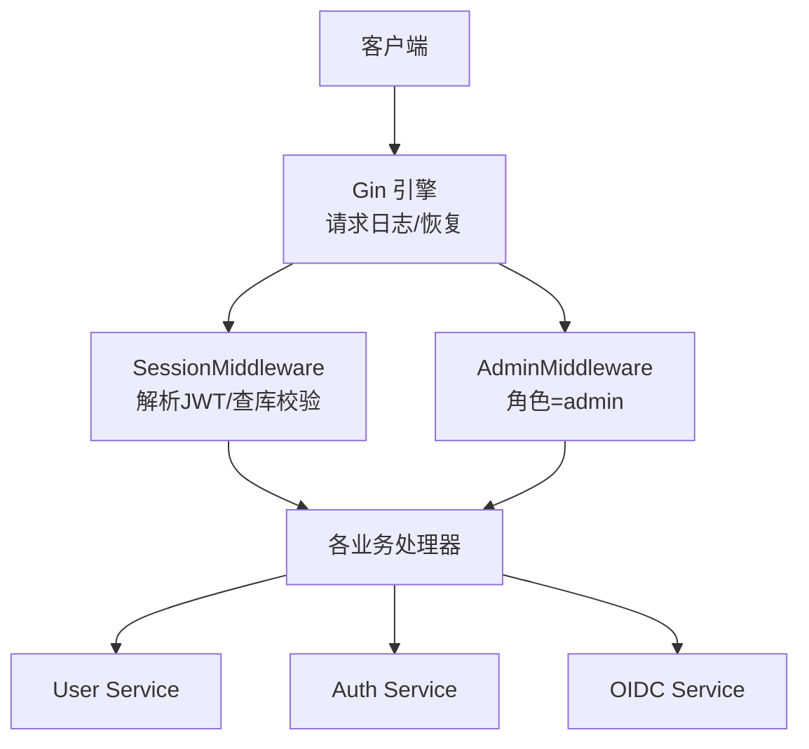
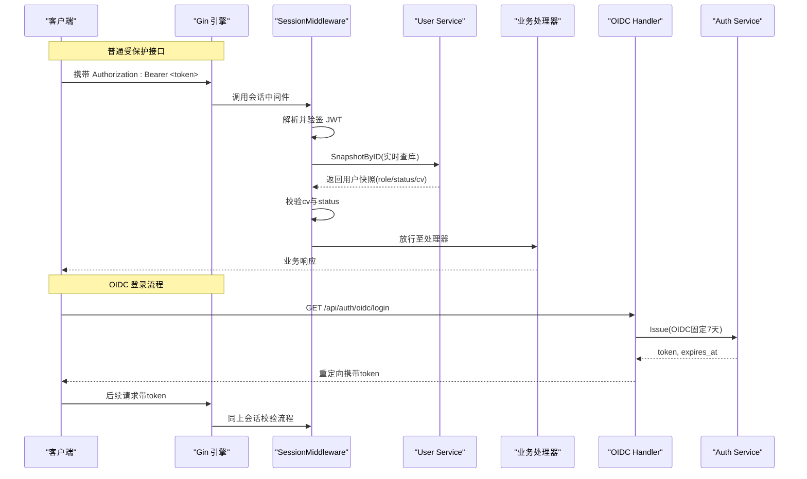
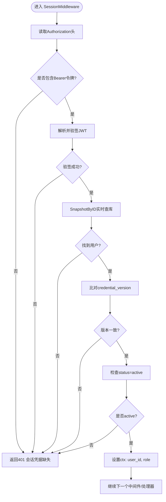
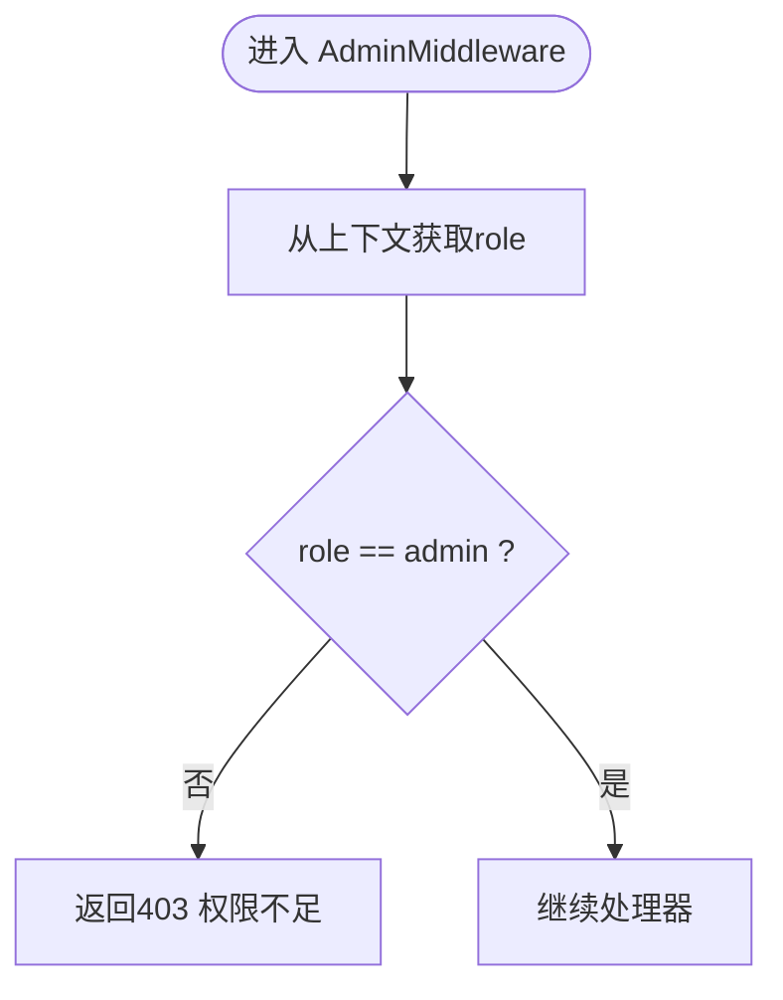
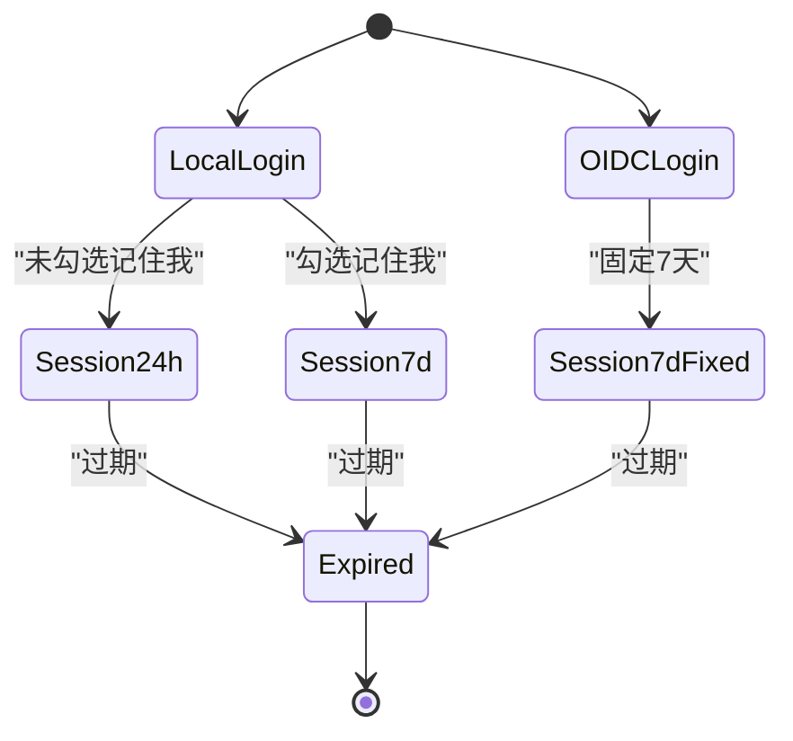
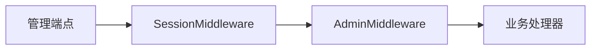
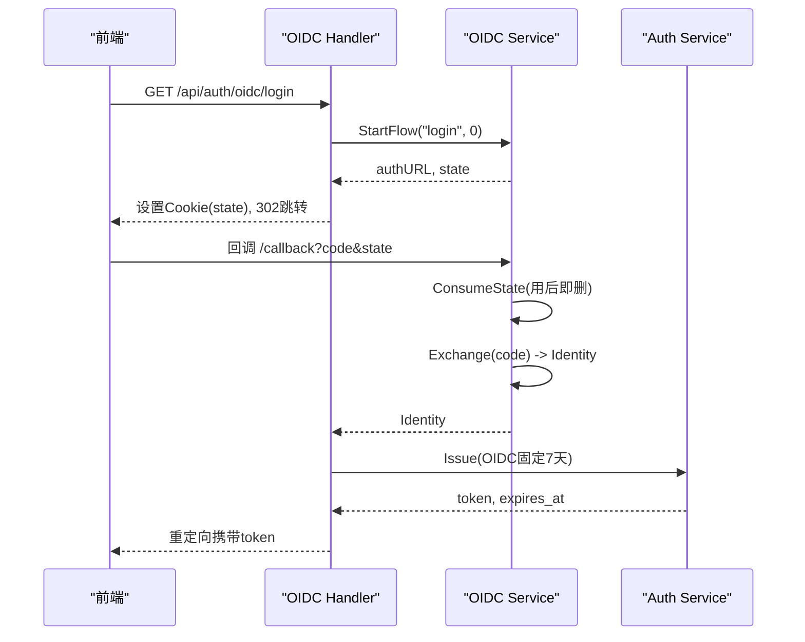
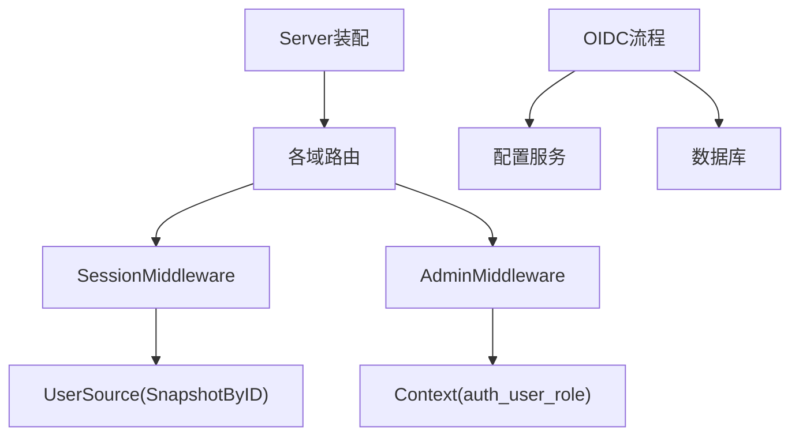

# 会话控制与权限验证

<cite>
**本文引用的文件**
- [backend/internal/auth/auth.go](file://backend/internal/auth/auth.go)
- [backend/internal/server/auth.go](file://backend/internal/server/auth.go)
- [backend/internal/server/server.go](file://backend/internal/server/server.go)
- [backend/internal/user/user.go](file://backend/internal/user/user.go)
- [backend/internal/oidc/flow.go](file://backend/internal/oidc/flow.go)
- [backend/internal/server/oidc.go](file://backend/internal/server/oidc.go)
- [backend/cmd/server/main.go](file://backend/cmd/server/main.go)
</cite>

## 目录
1. [简介](#简介)
2. [项目结构](#项目结构)
3. [核心组件](#核心组件)
4. [架构总览](#架构总览)
5. [详细组件分析](#详细组件分析)
6. [依赖关系分析](#依赖关系分析)
7. [性能考量](#性能考量)
8. [故障排查指南](#故障排查指南)
9. [结论](#结论)
10. [附录：中间件使用示例与最佳实践](#附录中间件使用示例与最佳实践)

## 简介
本文件聚焦于后端会话控制与权限验证系统，围绕 Gin 中间件的实现机制展开，重点解释 SessionMiddleware 与 AdminMiddleware 的工作流程、会话生命周期管理（记住我 7 天、普通会话 24 小时、OIDC 固定 7 天）、基于角色的访问控制（RBAC）策略与执行时机，并提供在路由中应用认证与权限控制的示例、安全最佳实践与常见问题解决方案。

## 项目结构
本项目采用分层架构：
- 接入层（server）：负责 HTTP 路由装配、中间件链组合、统一响应封装。
- 业务层（auth、user、oidc 等）：提供认证、用户管理、OIDC 流程等业务能力。
- 基础设施（store、config、log 等）：数据库、配置、日志等支撑能力。

图表来源
- [backend/internal/server/server.go:63-157](file://backend/internal/server/server.go#L63-L157)
- [backend/internal/auth/auth.go:144-192](file://backend/internal/auth/auth.go#L144-L192)

章节来源
- [backend/internal/server/server.go:63-157](file://backend/internal/server/server.go#L63-L157)
- [backend/cmd/server/main.go:24-98](file://backend/cmd/server/main.go#L24-L98)

## 核心组件
- 认证服务（auth.Service）：负责 JWT 签发/解析、会话中间件、管理员中间件。
- 用户服务（user.Service）：注册、登录、快照查询（供中间件实时查库）。
- OIDC 服务（oidc.Service）：授权流、回调处理、身份解析、白名单匹配。
- 服务器装配（server.New）：集中注册路由并组合中间件链。

关键设计要点：
- 凭据仅包含最小必要信息（用户ID、凭证版本），角色/组等权限信息每次请求实时查库，避免缓存过期问题。
- 会话时长策略：本地登录支持“记住我”7天与普通24小时；OIDC 固定7天。
- RBAC 通过 AdminMiddleware 强制要求 role="admin"，所有管理端点叠加该中间件。

章节来源
- [backend/internal/auth/auth.go:22-28](file://backend/internal/auth/auth.go#L22-L28)
- [backend/internal/auth/auth.go:66-85](file://backend/internal/auth/auth.go#L66-L85)
- [backend/internal/auth/auth.go:98-135](file://backend/internal/auth/auth.go#L98-L135)
- [backend/internal/auth/auth.go:144-192](file://backend/internal/auth/auth.go#L144-L192)
- [backend/internal/user/user.go:189-202](file://backend/internal/user/user.go#L189-L202)
- [backend/internal/server/server.go:80-157](file://backend/internal/server/server.go#L80-L157)

## 架构总览
下图展示了从请求进入 Gin 到最终执行业务处理的完整链路，包括鉴权、权限检查、以及 OIDC 登录流程的会话签发。

图表来源
- [backend/internal/server/server.go:80-157](file://backend/internal/server/server.go#L80-L157)
- [backend/internal/auth/auth.go:144-192](file://backend/internal/auth/auth.go#L144-L192)
- [backend/internal/server/oidc.go:31-89](file://backend/internal/server/oidc.go#L31-L89)
- [backend/internal/oidc/flow.go:27-62](file://backend/internal/oidc/flow.go#L27-L62)

## 详细组件分析

### 会话中间件（SessionMiddleware）
- 职责：从请求头提取 Bearer Token，解析并验签，实时查库获取用户快照，比对 credential_version 与 status，将用户ID与角色写入上下文后放行。
- 关键点：
  - 每次请求都查库，确保状态变更即时生效。
  - 若凭证版本不一致或账号非 active，直接拒绝。
  - 将 auth_user_id 与 auth_user_role 注入上下文，供后续处理器或中间件使用。

图表来源
- [backend/internal/auth/auth.go:144-192](file://backend/internal/auth/auth.go#L144-L192)
- [backend/internal/user/user.go:189-202](file://backend/internal/user/user.go#L189-L202)

章节来源
- [backend/internal/auth/auth.go:144-192](file://backend/internal/auth/auth.go#L144-L192)
- [backend/internal/user/user.go:189-202](file://backend/internal/user/user.go#L189-L202)

### 管理员中间件（AdminMiddleware）
- 职责：在会话校验之后叠加角色检查，仅允许 role="admin" 的管理员访问。
- 执行时机：通常与 SessionMiddleware 组合使用，如平台、订阅、规则、用户管理等管理端点。

图表来源
- [backend/internal/auth/auth.go:182-192](file://backend/internal/auth/auth.go#L182-L192)

章节来源
- [backend/internal/auth/auth.go:182-192](file://backend/internal/auth/auth.go#L182-L192)

### 会话生命周期管理
- 本地登录：
  - 不勾选“记住我”：会话有效期为 24 小时。
  - 勾选“记住我”：会话有效期为 7 天。
- OIDC 登录：
  - 固定 7 天会话，无“记住我”选项。
- 凭证版本（credential_version）：
  - 密码重置、禁用等操作会递增该版本，导致现有会话立即失效。

图表来源
- [backend/internal/auth/auth.go:22-28](file://backend/internal/auth/auth.go#L22-L28)
- [backend/internal/server/auth.go:124-133](file://backend/internal/server/auth.go#L124-L133)
- [backend/internal/server/oidc.go:82-88](file://backend/internal/server/oidc.go#L82-L88)

章节来源
- [backend/internal/auth/auth.go:22-28](file://backend/internal/auth/auth.go#L22-L28)
- [backend/internal/server/auth.go:99-133](file://backend/internal/server/auth.go#L99-L133)
- [backend/internal/server/oidc.go:68-88](file://backend/internal/server/oidc.go#L68-L88)

### 基于角色的访问控制（RBAC）
- 角色来源：每次请求通过 SessionMiddleware 实时查库获取当前用户的 role。
- 权限检查时机：在需要管理员权限的路由上叠加 AdminMiddleware，确保只有 admin 可访问。
- 典型场景：平台、订阅、规则、用户管理、设置、日志查看等管理端点均叠加双中间件。

图表来源
- [backend/internal/server/server.go:86-157](file://backend/internal/server/server.go#L86-L157)
- [backend/internal/auth/auth.go:182-192](file://backend/internal/auth/auth.go#L182-L192)

章节来源
- [backend/internal/server/server.go:86-157](file://backend/internal/server/server.go#L86-L157)
- [backend/internal/auth/auth.go:182-192](file://backend/internal/auth/auth.go#L182-L192)

### OIDC 会话与绑定流程
- 授权开始：生成 state 与 code_verifier，持久化 state，返回授权页 URL。
- 回调处理：三重校验（Cookie state == 回调参数 state == 存储记录存在），用后即删防重放。
- 身份解析：根据提供商类型（mock/真实）交换 token，解析 id_token 获取身份信息。
- 会话签发：OIDC 登录固定 7 天会话；绑定流程不签发会话。

图表来源
- [backend/internal/oidc/flow.go:27-62](file://backend/internal/oidc/flow.go#L27-L62)
- [backend/internal/oidc/flow.go:95-119](file://backend/internal/oidc/flow.go#L95-L119)
- [backend/internal/oidc/flow.go:132-227](file://backend/internal/oidc/flow.go#L132-L227)
- [backend/internal/server/oidc.go:31-89](file://backend/internal/server/oidc.go#L31-L89)

章节来源
- [backend/internal/oidc/flow.go:27-62](file://backend/internal/oidc/flow.go#L27-L62)
- [backend/internal/oidc/flow.go:95-119](file://backend/internal/oidc/flow.go#L95-L119)
- [backend/internal/oidc/flow.go:132-227](file://backend/internal/oidc/flow.go#L132-L227)
- [backend/internal/server/oidc.go:31-89](file://backend/internal/server/oidc.go#L31-L89)

## 依赖关系分析
- 中间件依赖：
  - SessionMiddleware 依赖 user.UserSource 接口以实时查库。
  - AdminMiddleware 依赖上下文中的角色信息。
- 路由装配：
  - server.New 集中注册各域路由，并按需组合 SessionMiddleware 与 AdminMiddleware。
- OIDC 依赖：
  - OIDC 流程依赖 config 与 store，发现文档缓存提升性能。

图表来源
- [backend/internal/auth/auth.go:82-85](file://backend/internal/auth/auth.go#L82-L85)
- [backend/internal/server/server.go:80-157](file://backend/internal/server/server.go#L80-L157)
- [backend/internal/oidc/oidc.go:53-73](file://backend/internal/oidc/oidc.go#L53-L73)

章节来源
- [backend/internal/auth/auth.go:82-85](file://backend/internal/auth/auth.go#L82-L85)
- [backend/internal/server/server.go:80-157](file://backend/internal/server/server.go#L80-L157)
- [backend/internal/oidc/oidc.go:53-73](file://backend/internal/oidc/oidc.go#L53-L73)

## 性能考量
- 实时查库：SessionMiddleware 每次请求查库，确保状态一致性，但增加数据库压力。建议在高并发场景下评估连接池与索引优化。
- 发现文档缓存：OIDC 的发现文档按 base_url + realm 缓存，减少重复网络请求。
- 限流与验证码：注册、登录、忘记密码入口叠加限流与验证码中间件，防止暴力破解。

[本节为通用指导，无需特定文件引用]

## 故障排查指南
- 401 未授权：
  - 检查 Authorization 头是否正确携带 Bearer Token。
  - 确认 Token 未过期且签名算法匹配。
  - 确认用户状态为 active 且 credential_version 与数据库一致。
- 403 权限不足：
  - 确认当前用户 role 是否为 admin。
  - 检查路由是否正确叠加 AdminMiddleware。
- OIDC 回调失败：
  - 检查 state Cookie 与回调参数 state 是否一致。
  - 确认 state 记录未被消费或已过期。
  - 检查 token 交换是否成功，id_token 是否包含必要字段。

章节来源
- [backend/internal/auth/auth.go:144-192](file://backend/internal/auth/auth.go#L144-L192)
- [backend/internal/server/oidc.go:42-89](file://backend/internal/server/oidc.go#L42-L89)

## 结论
本系统通过 Gin 中间件实现了健壮的会话控制与权限验证机制。SessionMiddleware 保证每次请求的会话有效性，AdminMiddleware 提供细粒度的管理员权限控制。会话生命周期策略清晰区分本地登录与 OIDC 登录，并通过 credential_version 实现会话的即时失效。OIDC 流程采用 PKCE 与三重校验保障安全性。建议在部署时结合限流、验证码与监控手段进一步提升安全性与稳定性。

[本节为总结性内容，无需特定文件引用]

## 附录：中间件使用示例与最佳实践

### 在路由中应用认证与权限控制
- 受保护的普通接口：
  - 组合 SessionMiddleware，用于获取当前用户信息与数据。
- 管理端点：
  - 同时组合 SessionMiddleware 与 AdminMiddleware，确保仅管理员可访问。
- 示例参考：
  - 平台、订阅、规则、用户管理、设置、日志查看等路由均在 server.New 中按序注册并组合中间件。

章节来源
- [backend/internal/server/server.go:86-157](file://backend/internal/server/server.go#L86-L157)

### 会话安全最佳实践
- 始终使用 HTTPS，确保 Token 传输安全。
- 合理设置 Cookie 属性（HttpOnly、Secure、SameSite）以增强安全性。
- 定期轮换签名密钥，避免长期密钥泄露风险。
- 对敏感操作（密码重置、禁用用户）递增 credential_version，使现有会话立即失效。
- 启用限流与验证码，防止暴力破解与自动化攻击。

章节来源
- [backend/internal/server/oidc.go:37-39](file://backend/internal/server/oidc.go#L37-L39)
- [backend/internal/auth/auth.go:98-135](file://backend/internal/auth/auth.go#L98-L135)
- [backend/internal/user/admin.go:316-351](file://backend/internal/user/admin.go#L316-L351)
- [backend/internal/user/admin.go:409-454](file://backend/internal/user/admin.go#L409-L454)

### 常见问题解决方案
- 登录后仍提示未授权：
  - 检查前端是否正确传递 Authorization 头。
  - 确认服务端未发生 credential_version 变更。
- OIDC 登录失败：
  - 检查提供商配置是否正确，发现文档是否可达。
  - 确认 state 与 code_verifier 生成与校验逻辑正常。
- 管理员无法访问管理端点：
  - 确认用户 role 为 admin 且路由正确叠加 AdminMiddleware。

章节来源
- [backend/internal/server/auth.go:99-133](file://backend/internal/server/auth.go#L99-L133)
- [backend/internal/server/oidc.go:42-89](file://backend/internal/server/oidc.go#L42-L89)
- [backend/internal/auth/auth.go:182-192](file://backend/internal/auth/auth.go#L182-L192)