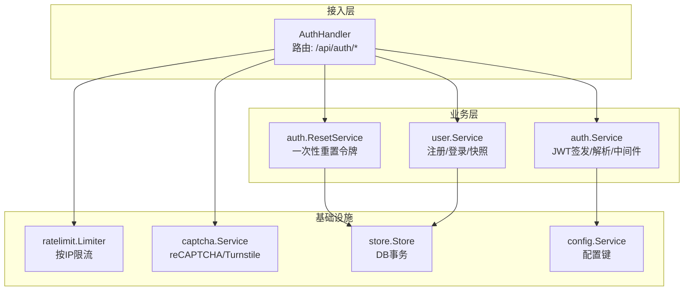
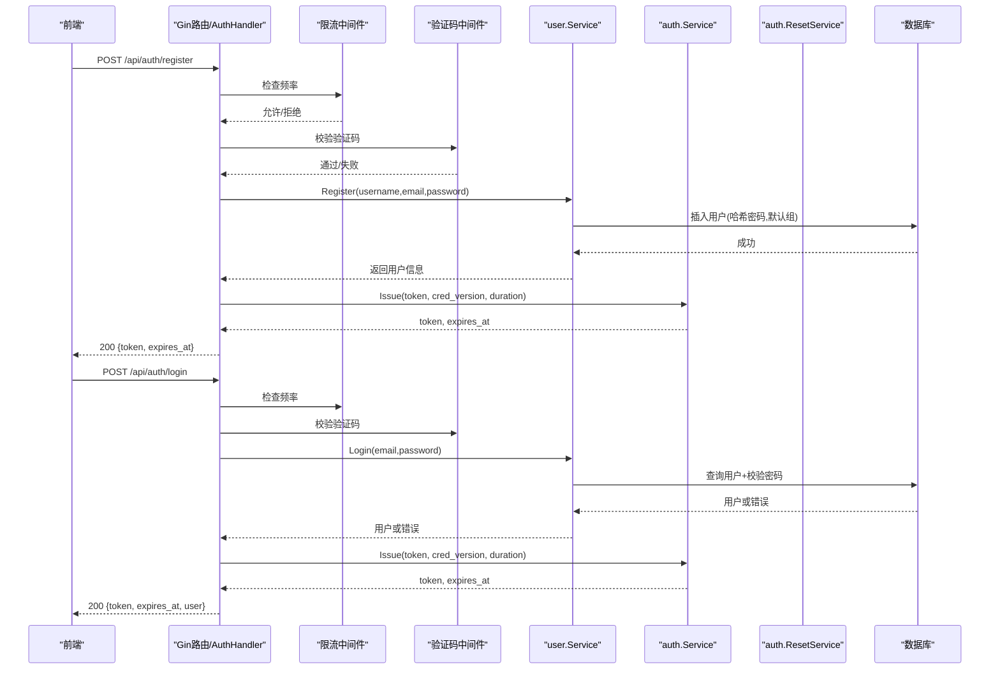
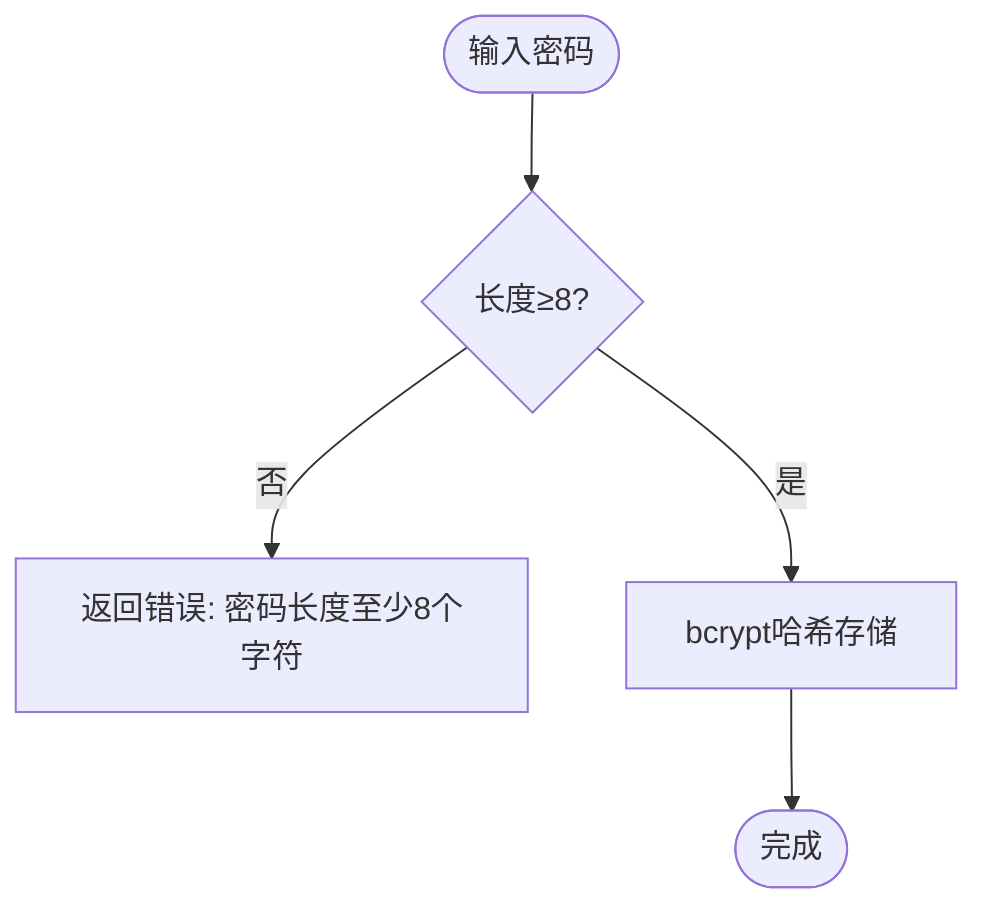
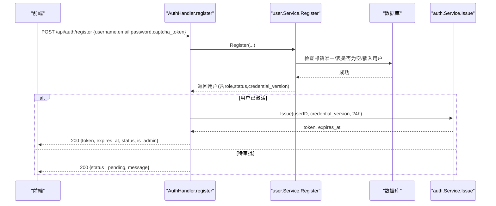
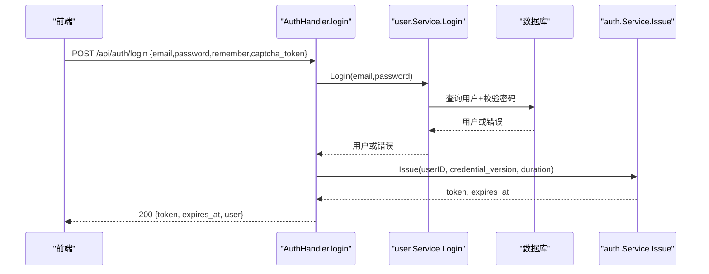
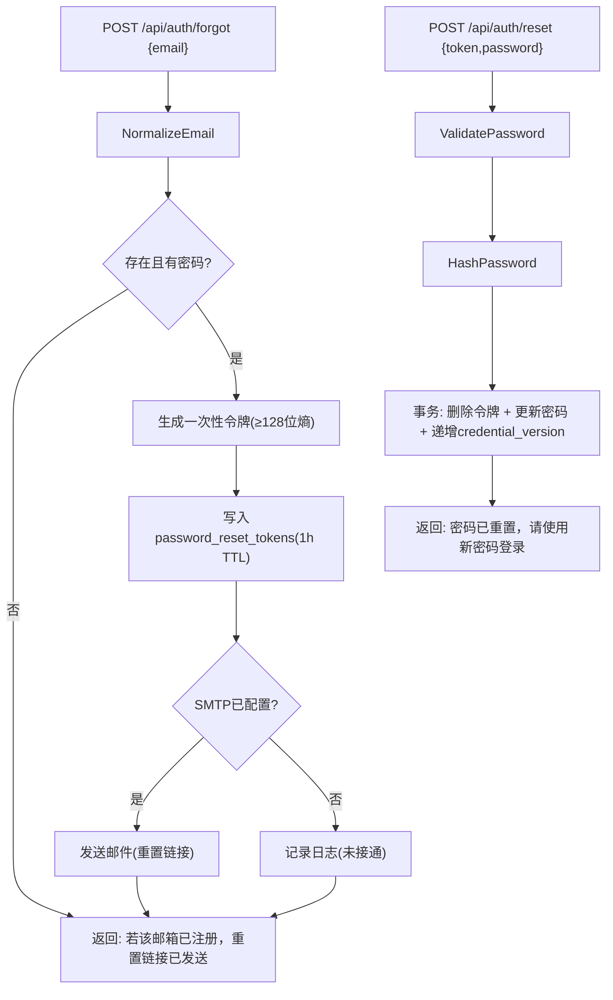
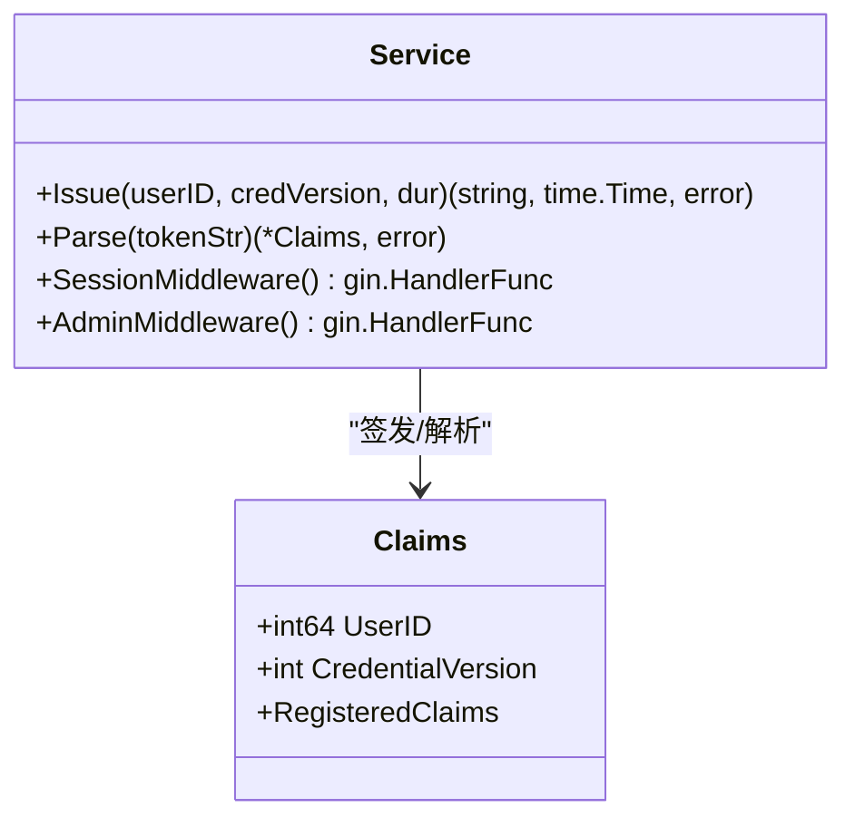
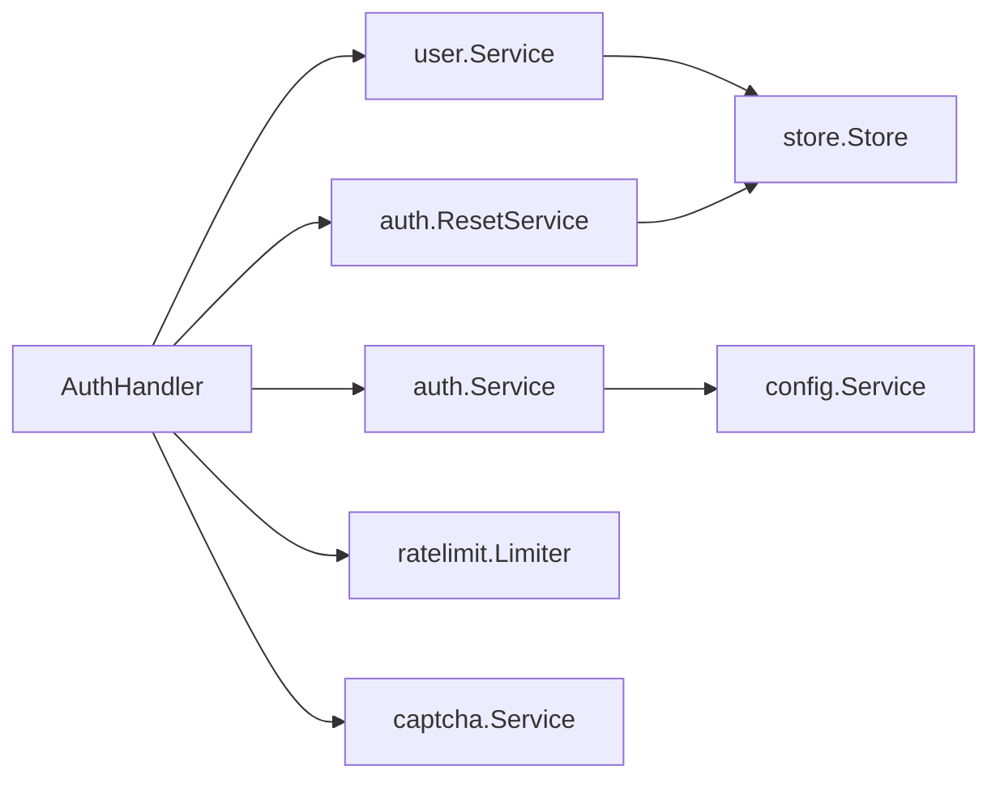

# 本地账号认证

<cite>
**本文引用的文件**
- [backend/internal/auth/auth.go](file://backend/internal/auth/auth.go)
- [backend/internal/auth/reset.go](file://backend/internal/auth/reset.go)
- [backend/internal/server/auth.go](file://backend/internal/server/auth.go)
- [backend/internal/user/user.go](file://backend/internal/user/user.go)
- [backend/internal/ratelimit/ratelimit.go](file://backend/internal/ratelimit/ratelimit.go)
- [backend/internal/captcha/captcha.go](file://backend/internal/captcha/captcha.go)
- [backend/migrations/0002_users.sql](file://backend/migrations/0002_users.sql)
- [backend/migrations/0005_reset_tokens.sql](file://backend/migrations/0005_reset_tokens.sql)
- [frontend/src/api/auth.ts](file://frontend/src/api/auth.ts)
</cite>

## 目录
1. [简介](#简介)
2. [项目结构](#项目结构)
3. [核心组件](#核心组件)
4. [架构总览](#架构总览)
5. [详细组件分析](#详细组件分析)
6. [依赖关系分析](#依赖关系分析)
7. [性能考量](#性能考量)
8. [故障排查指南](#故障排查指南)
9. [结论](#结论)
10. [附录：API 调用示例与安全最佳实践](#附录api-调用示例与安全最佳实践)

## 简介
本系统提供本地账号认证能力，覆盖用户注册、登录、密码重置、会话凭据签发与校验等关键流程。安全方面采用 bcrypt 哈希存储密码、JWT（HS256）作为会话令牌、邮箱规范化与格式校验、验证码与速率限制防护暴力破解、以及凭据版本控制实现会话失效机制。文档将深入解析各模块职责、数据流与控制流，并提供可操作的 API 调用示例与安全建议。

## 项目结构
后端采用分层设计：
- 接入层（server）：定义路由与 HTTP 处理器，组合限流、验证码中间件，调用业务服务。
- 业务层（auth、user、token）：封装认证、用户管理、令牌生命周期等业务逻辑。
- 基础设施（store、config、ratelimit、captcha）：数据库事务、配置读取、速率限制、验证码校验。
- 前端（frontend）：封装认证相关 API 调用，负责 UI 交互与状态管理。

图表来源
- [backend/internal/server/auth.go:25-34](file://backend/internal/server/auth.go#L25-L34)
- [backend/internal/auth/auth.go:87-116](file://backend/internal/auth/auth.go#L87-L116)
- [backend/internal/auth/reset.go:36-47](file://backend/internal/auth/reset.go#L36-L47)
- [backend/internal/user/user.go:25-36](file://backend/internal/user/user.go#L25-L36)
- [backend/internal/ratelimit/ratelimit.go:27-37](file://backend/internal/ratelimit/ratelimit.go#L27-L37)
- [backend/internal/captcha/captcha.go:30-39](file://backend/internal/captcha/captcha.go#L30-L39)

章节来源
- [backend/internal/server/auth.go:25-34](file://backend/internal/server/auth.go#L25-L34)
- [backend/internal/auth/auth.go:87-116](file://backend/internal/auth/auth.go#L87-L116)
- [backend/internal/user/user.go:25-36](file://backend/internal/user/user.go#L25-L36)

## 核心组件
- 认证服务（auth.Service）：提供密码哈希/校验、复杂度校验、邮箱规范化、JWT 签发与解析、会话中间件、管理员角色校验中间件。
- 用户服务（user.Service）：处理注册（含首管理员机制）、登录、用户快照查询、组名查询、重置目标查找。
- 重置服务（auth.ResetService）：生成一次性重置令牌、发送邮件（可选）、完成重置并递增凭据版本。
- 限流服务（ratelimit.Limiter）：按 IP 固定窗口限流，保护注册、登录、找回密码接口。
- 验证码服务（captcha.Service）：支持 reCAPTCHA/Turnstile，按页面开关校验，防止自动化攻击。
- 存储与配置（store.Store、config.Service）：提供事务化 DB 访问与动态配置读取。

章节来源
- [backend/internal/auth/auth.go:30-50](file://backend/internal/auth/auth.go#L30-L50)
- [backend/internal/auth/auth.go:66-116](file://backend/internal/auth/auth.go#L66-L116)
- [backend/internal/user/user.go:82-154](file://backend/internal/user/user.go#L82-L154)
- [backend/internal/auth/reset.go:54-85](file://backend/internal/auth/reset.go#L54-L85)
- [backend/internal/ratelimit/ratelimit.go:40-60](file://backend/internal/ratelimit/ratelimit.go#L40-L60)
- [backend/internal/captcha/captcha.go:41-58](file://backend/internal/captcha/captcha.go#L41-L58)

## 架构总览
认证请求从前端发起，经 Gin 路由进入 AuthHandler，依次经过限流与验证码中间件后交由具体处理器。注册与登录通过 user.Service 完成用户校验与业务处理；认证服务负责 JWT 签发与会话校验；重置流程由 ResetService 完成一次性令牌的生命周期管理。所有敏感操作均使用参数化 SQL 与事务保证一致性与安全性。

图表来源
- [backend/internal/server/auth.go:25-34](file://backend/internal/server/auth.go#L25-L34)
- [backend/internal/server/auth.go:44-91](file://backend/internal/server/auth.go#L44-L91)
- [backend/internal/server/auth.go:99-134](file://backend/internal/server/auth.go#L99-L134)
- [backend/internal/user/user.go:82-154](file://backend/internal/user/user.go#L82-L154)
- [backend/internal/auth/auth.go:98-116](file://backend/internal/auth/auth.go#L98-L116)

## 详细组件分析

### 密码加密与复杂度校验
- 密码哈希：使用 bcrypt 生成哈希值，成本参数为默认强度，确保抗暴力破解。
- 密码校验：比较明文与哈希值，用于登录与重置场景。
- 复杂度规则：统一要求至少 8 个字符，所有本地密码入口一致。

图表来源
- [backend/internal/auth/auth.go:30-50](file://backend/internal/auth/auth.go#L30-L50)

章节来源
- [backend/internal/auth/auth.go:30-50](file://backend/internal/auth/auth.go#L30-L50)

### 邮箱格式验证与规范化
- 规范化：去除首尾空白、转小写，拒绝控制字符，避免 SMTP 头注入。
- 格式校验：必须包含“@”，长度不超过 254，空串拒绝。
- 写入一致性：所有写入入口统一调用规范化函数，确保唯一性约束生效。

章节来源
- [backend/internal/auth/auth.go:52-64](file://backend/internal/auth/auth.go#L52-L64)
- [backend/internal/user/user.go:84-91](file://backend/internal/user/user.go#L84-L91)

### 用户注册流程
- 前置检查：本地登录开关、是否开放自注册或表为空（首管理员）。
- 参数绑定与校验：用户名、邮箱、密码长度限制。
- 业务逻辑：邮箱唯一预查、首管理员免审批直接激活、自动加入默认组、写入哈希密码。
- 响应：激活用户返回 token 与过期时间；待审批用户返回 pending 状态。

图表来源
- [backend/internal/server/auth.go:44-91](file://backend/internal/server/auth.go#L44-L91)
- [backend/internal/user/user.go:82-154](file://backend/internal/user/user.go#L82-L154)
- [backend/internal/auth/auth.go:98-116](file://backend/internal/auth/auth.go#L98-L116)

章节来源
- [backend/internal/server/auth.go:44-91](file://backend/internal/server/auth.go#L44-L91)
- [backend/internal/user/user.go:82-154](file://backend/internal/user/user.go#L82-L154)

### 登录流程与会话凭据签发
- 参数绑定与校验：邮箱、密码、记住我选项。
- 业务校验：本地登录开关、邮箱/密码匹配、账号状态 active。
- 会话签发：根据 remember 选择 24 小时或 7 天有效期，签发 HS256 JWT。
- 响应：返回 token、过期时间与用户基本信息。

图表来源
- [backend/internal/server/auth.go:99-134](file://backend/internal/server/auth.go#L99-L134)
- [backend/internal/user/user.go:170-187](file://backend/internal/user/user.go#L170-L187)
- [backend/internal/auth/auth.go:98-116](file://backend/internal/auth/auth.go#L98-L116)

章节来源
- [backend/internal/server/auth.go:99-134](file://backend/internal/server/auth.go#L99-L134)
- [backend/internal/user/user.go:170-187](file://backend/internal/user/user.go#L170-L187)

### 密码重置流程（一次性令牌）
- 请求重置：规范化邮箱，查找用户（仅对已有密码的用户生成令牌），写入一次性令牌（1 小时 TTL），发送邮件（可选）。
- 完成重置：校验新密码复杂度，哈希存储，删除令牌，递增 credential_version 使现有会话失效。
- 防枚举：无论邮箱是否存在都返回统一提示。

图表来源
- [backend/internal/auth/reset.go:54-85](file://backend/internal/auth/reset.go#L54-L85)
- [backend/internal/auth/reset.go:115-147](file://backend/internal/auth/reset.go#L115-L147)
- [backend/internal/server/auth.go:159-196](file://backend/internal/server/auth.go#L159-L196)

章节来源
- [backend/internal/auth/reset.go:54-85](file://backend/internal/auth/reset.go#L54-L85)
- [backend/internal/auth/reset.go:115-147](file://backend/internal/auth/reset.go#L115-L147)
- [backend/internal/server/auth.go:159-196](file://backend/internal/server/auth.go#L159-L196)

### JWT 令牌生成与验证
- 生成：HS256 签名，载荷包含用户 ID 与凭据版本号，设置签发与过期时间。
- 验证：解析并验签，实时查询用户快照比对 credential_version 与状态 active，否则拒绝。
- 中间件：SessionMiddleware 在受保护端点前执行，AdminMiddleware 叠加角色校验。

图表来源
- [backend/internal/auth/auth.go:66-116](file://backend/internal/auth/auth.go#L66-L116)
- [backend/internal/auth/auth.go:144-192](file://backend/internal/auth/auth.go#L144-L192)

章节来源
- [backend/internal/auth/auth.go:66-116](file://backend/internal/auth/auth.go#L66-L116)
- [backend/internal/auth/auth.go:144-192](file://backend/internal/auth/auth.go#L144-L192)

### 会话中间件与权限控制
- 会话校验：从 Authorization 头提取 Bearer Token，解析并验签，实时查库获取用户快照，比对 credential_version 与状态。
- 权限控制：AdminMiddleware 要求角色为 admin，否则拒绝。
- 上下文注入：将用户 ID 与角色注入到上下文供后续处理器使用。

章节来源
- [backend/internal/auth/auth.go:144-192](file://backend/internal/auth/auth.go#L144-L192)

### 限流与验证码防护
- 限流：按 IP 固定窗口计数，注册 5/min、登录 10/min、找回密码 5/min，超限返回 429 并附带 Retry-After。
- 验证码：支持 reCAPTCHA/Turnstile，按页面开关校验，缺失密钥时跳过并记录警告。

章节来源
- [backend/internal/ratelimit/ratelimit.go:40-60](file://backend/internal/ratelimit/ratelimit.go#L40-L60)
- [backend/internal/captcha/captcha.go:41-58](file://backend/internal/captcha/captcha.go#L41-L58)
- [backend/internal/captcha/captcha.go:108-127](file://backend/internal/captcha/captcha.go#L108-L127)

## 依赖关系分析
- 接入层依赖业务层：AuthHandler 调用 user.Service、auth.Service、auth.ResetService。
- 业务层依赖基础设施：user.Service 与 ResetService 通过 store.Store 进行事务化 DB 访问；auth.Service 依赖 config.Service 获取签名密钥。
- 安全中间件：ratelimit 与 captcha 作为 Gin 中间件链前置，保护敏感接口。

图表来源
- [backend/internal/server/auth.go:25-34](file://backend/internal/server/auth.go#L25-L34)
- [backend/internal/user/user.go:25-36](file://backend/internal/user/user.go#L25-L36)
- [backend/internal/auth/auth.go:87-96](file://backend/internal/auth/auth.go#L87-L96)
- [backend/internal/auth/reset.go:36-47](file://backend/internal/auth/reset.go#L36-L47)

章节来源
- [backend/internal/server/auth.go:25-34](file://backend/internal/server/auth.go#L25-L34)
- [backend/internal/user/user.go:25-36](file://backend/internal/user/user.go#L25-L36)
- [backend/internal/auth/auth.go:87-96](file://backend/internal/auth/auth.go#L87-L96)
- [backend/internal/auth/reset.go:36-47](file://backend/internal/auth/reset.go#L36-L47)

## 性能考量
- 哈希成本：bcrypt 默认成本平衡安全性与性能，生产环境可根据硬件调整。
- 会话校验：每次请求实时查库获取用户快照，避免缓存不一致，但增加 DB 压力；可通过连接池优化与索引提升性能。
- 限流内存：固定窗口桶按分钟清理，避免内存泄漏；在高并发下注意锁粒度与 GC 压力。
- 验证码网络：外部服务调用超时设置为 10 秒，避免阻塞主流程。

[本节为通用指导，不直接分析具体文件]

## 故障排查指南
- 401 未授权：检查 Authorization 头格式、JWT 是否过期、用户状态是否为 active、credential_version 是否匹配。
- 403 权限不足：确认用户角色是否为 admin。
- 429 频率限制：检查当前 IP 在分钟槽内的请求次数，等待 Retry-After 后再试。
- 验证码失败：检查提供商配置、密钥是否正确、前端是否传递 captcha_token。
- 重置令牌无效：确认令牌未过期且未被使用，检查 password_reset_tokens 表记录。

章节来源
- [backend/internal/auth/auth.go:144-192](file://backend/internal/auth/auth.go#L144-L192)
- [backend/internal/ratelimit/ratelimit.go:40-60](file://backend/internal/ratelimit/ratelimit.go#L40-L60)
- [backend/internal/captcha/captcha.go:60-106](file://backend/internal/captcha/captcha.go#L60-L106)
- [backend/internal/auth/reset.go:115-147](file://backend/internal/auth/reset.go#L115-L147)

## 结论
本认证系统通过 bcrypt 哈希、JWT 会话、邮箱规范化、限流与验证码等多重安全措施，构建了健壮的本地账号认证能力。注册与登录流程清晰，密码重置具备一次性令牌与会话失效机制。建议在部署时合理配置验证码与限流阈值，监控 DB 性能与外部服务可用性，确保安全与稳定性。

[本节为总结，不直接分析具体文件]

## 附录：API 调用示例与安全最佳实践

### API 端点与行为
- POST /api/auth/register：注册新用户，返回 token（激活用户）或 pending 状态。
- POST /api/auth/login：登录，返回 token、过期时间与用户信息。
- GET /api/auth/me：获取当前用户信息（需有效会话）。
- POST /api/auth/logout：退出（客户端清除 token）。
- POST /api/auth/forgot：请求重置链接（统一防枚举响应）。
- POST /api/auth/reset：使用一次性令牌重置密码。

章节来源
- [backend/internal/server/auth.go:25-34](file://backend/internal/server/auth.go#L25-L34)
- [backend/internal/server/auth.go:44-91](file://backend/internal/server/auth.go#L44-L91)
- [backend/internal/server/auth.go:99-134](file://backend/internal/server/auth.go#L99-L134)
- [backend/internal/server/auth.go:159-196](file://backend/internal/server/auth.go#L159-L196)

### 前端调用示例（TypeScript）
- 注册：调用 register({ username, email, password, captcha_token })
- 登录：调用 login({ email, password, remember, captcha_token })
- 获取当前用户：调用 me()
- 退出：调用 logout()
- 忘记密码：调用 forgot({ email, captcha_token })
- 重置密码：调用 resetPassword({ token, password })

章节来源
- [frontend/src/api/auth.ts:16-27](file://frontend/src/api/auth.ts#L16-L27)

### 安全最佳实践
- 防止暴力破解：启用验证码与限流，限制每分钟请求次数，必要时引入 IP 黑名单。
- SQL 注入防护：所有查询使用参数化语句，避免字符串拼接；使用事务隔离级别 IMMEDIATE 防止并发问题。
- 密码安全：强制复杂度校验，使用 bcrypt 哈希，禁止明文存储。
- 会话安全：JWT 使用 HS256，定期轮换签名密钥；通过 credential_version 实现会话失效。
- 邮箱安全：规范化邮箱，拒绝控制字符，避免 SMTP 头注入。
- 重置安全：一次性令牌高熵、短 TTL、用后即删；统一响应防止枚举。

章节来源
- [backend/internal/ratelimit/ratelimit.go:40-60](file://backend/internal/ratelimit/ratelimit.go#L40-L60)
- [backend/internal/captcha/captcha.go:60-106](file://backend/internal/captcha/captcha.go#L60-L106)
- [backend/internal/auth/auth.go:30-50](file://backend/internal/auth/auth.go#L30-L50)
- [backend/internal/auth/auth.go:98-116](file://backend/internal/auth/auth.go#L98-L116)
- [backend/internal/auth/reset.go:54-85](file://backend/internal/auth/reset.go#L54-L85)
- [backend/migrations/0002_users.sql:1-17](file://backend/migrations/0002_users.sql#L1-L17)
- [backend/migrations/0005_reset_tokens.sql:1-9](file://backend/migrations/0005_reset_tokens.sql#L1-L9)