# 认证与授权系统

<cite>
**本文引用的文件**
- [backend/internal/auth/auth.go](file://backend/internal/auth/auth.go)
- [backend/internal/auth/reset.go](file://backend/internal/auth/reset.go)
- [backend/internal/server/auth.go](file://backend/internal/server/auth.go)
- [backend/internal/server/oidc.go](file://backend/internal/server/oidc.go)
- [backend/internal/oidc/oidc.go](file://backend/internal/oidc/oidc.go)
- [backend/internal/oidc/flow.go](file://backend/internal/oidc/flow.go)
- [backend/internal/oidc/helpers.go](file://backend/internal/oidc/helpers.go)
- [backend/internal/user/user.go](file://backend/internal/user/user.go)
- [backend/internal/user/admin.go](file://backend/internal/user/admin.go)
- [backend/internal/config/config.go](file://backend/internal/config/config.go)
- [backend/internal/token/token.go](file://backend/internal/token/token.go)
- [backend/migrations/0002_users.sql](file://backend/migrations/0002_users.sql)
- [backend/migrations/0004_oidc.sql](file://backend/migrations/0004_oidc.sql)
- [backend/migrations/1004_tokens.sql](file://backend/migrations/1004_tokens.sql)
</cite>

## 更新摘要
**变更内容**
- 重新组织了认证与会话凭据管理的文档结构
- 增强了JWT令牌管理和会话控制的详细说明
- 优化了OIDC单点登录集成的架构描述
- 完善了用户组与权限模型的实现细节
- 更新了API调用示例和故障排查指南

## 目录
1. [系统概述](#系统概述)
2. [核心架构设计](#核心架构设计)
3. [本地账号认证机制](#本地账号认证机制)
4. [OIDC单点登录集成](#oidc单点登录集成)
5. [JWT令牌与会话管理](#jwt令牌与会话管理)
6. [用户组与权限控制](#用户组与权限控制)
7. [密码重置与安全策略](#密码重置与安全策略)
8. [管理员操作保护](#管理员操作保护)
9. [性能优化与最佳实践](#性能优化与最佳实践)
10. [故障排查与常见问题](#故障排查与常见问题)
11. [API参考文档](#api参考文档)

## 系统概述

本认证与授权系统提供完整的身份验证和访问控制能力，支持本地账号注册登录、OIDC单点登录集成、JWT会话凭据管理、基于用户组的权限控制等功能。系统设计遵循安全优先原则，采用bcrypt密码哈希、HS256签名的JWT令牌、PKCE授权的OIDC流程等现代安全机制。

### 核心特性
- **多模式认证**：支持本地账号和OIDC双通道认证
- **会话安全**：基于JWT的无状态会话管理，支持凭据版本控制
- **权限模型**：基于角色和用户组的细粒度权限控制
- **安全存储**：敏感配置AES-256-GCM加密，密码bcrypt哈希
- **防重放攻击**：OIDC流程使用state和code_verifier双重防护
- **管理员保护**：多重约束防止误操作和权限滥用

## 核心架构设计

系统采用分层架构设计，将认证逻辑按职责分离到不同模块：

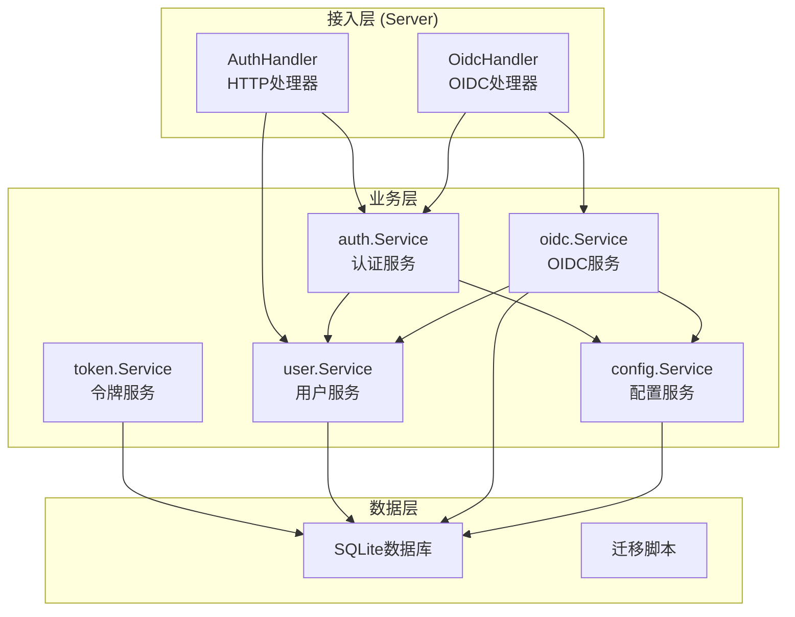

**架构图来源**
- [backend/internal/server/auth.go:16-34](file://backend/internal/server/auth.go#L16-L34)
- [backend/internal/server/oidc.go:13-27](file://backend/internal/server/oidc.go#L13-L27)
- [backend/internal/auth/auth.go:87-96](file://backend/internal/auth/auth.go#L87-L96)

### 关键设计原则
1. **无状态会话**：JWT令牌包含必要信息，服务端不存储会话状态
2. **实时验证**：每次请求都验证用户状态和凭据版本
3. **最小权限**：JWT载荷仅包含用户ID和凭据版本，不包含角色信息
4. **事务一致性**：关键操作使用事务保证数据一致性
5. **错误统一**：标准化错误响应，避免信息泄露

**章节来源**
- [backend/internal/server/auth.go:16-34](file://backend/internal/server/auth.go#L16-L34)
- [backend/internal/server/oidc.go:13-27](file://backend/internal/server/oidc.go#L13-L27)
- [backend/internal/auth/auth.go:87-96](file://backend/internal/auth/auth.go#L87-L96)

## 本地账号认证机制

### 注册流程

本地账号注册流程实现了首管理员机制和安全校验：

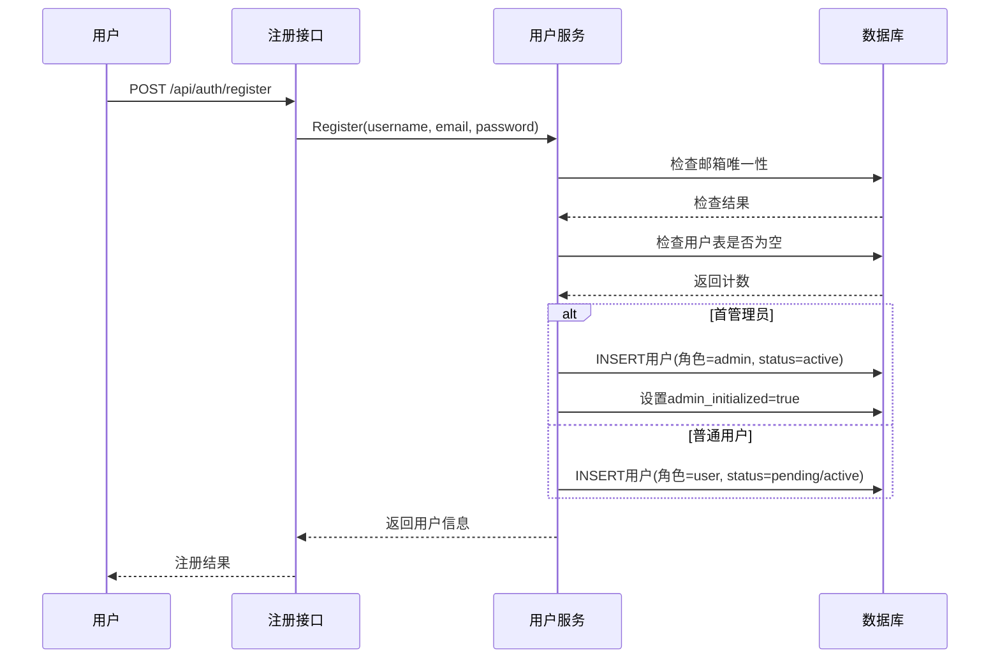

**注册流程图来源**
- [backend/internal/server/auth.go:44-91](file://backend/internal/server/auth.go#L44-L91)
- [backend/internal/user/user.go:82-154](file://backend/internal/user/user.go#L82-L154)

### 登录流程

登录流程实现了统一错误处理和凭据验证：

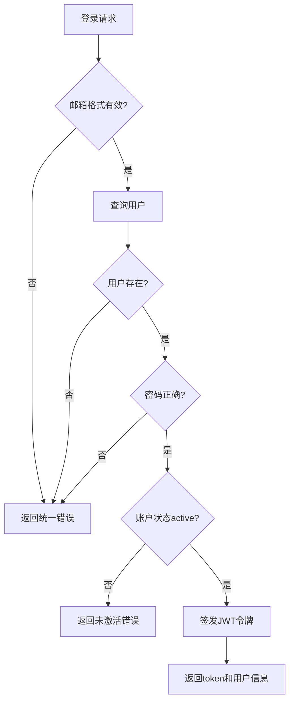

**登录流程图来源**
- [backend/internal/server/auth.go:99-134](file://backend/internal/server/auth.go#L99-L134)
- [backend/internal/user/user.go:170-187](file://backend/internal/user/user.go#L170-L187)

### 安全特性
- **密码复杂度**：至少8个字符，使用bcrypt哈希存储
- **邮箱规范化**：自动trim和转小写，过滤控制字符
- **防枚举攻击**：统一的错误提示，不区分邮箱不存在和密码错误
- **会话时长**：默认24小时，可选"记住我"7天

**章节来源**
- [backend/internal/server/auth.go:44-134](file://backend/internal/server/auth.go#L44-L134)
- [backend/internal/user/user.go:82-187](file://backend/internal/user/user.go#L82-L187)
- [backend/internal/auth/auth.go:30-64](file://backend/internal/auth/auth.go#L30-L64)

## OIDC单点登录集成

### 配置管理

OIDC提供商配置采用JSON格式存储，敏感字段加密处理：

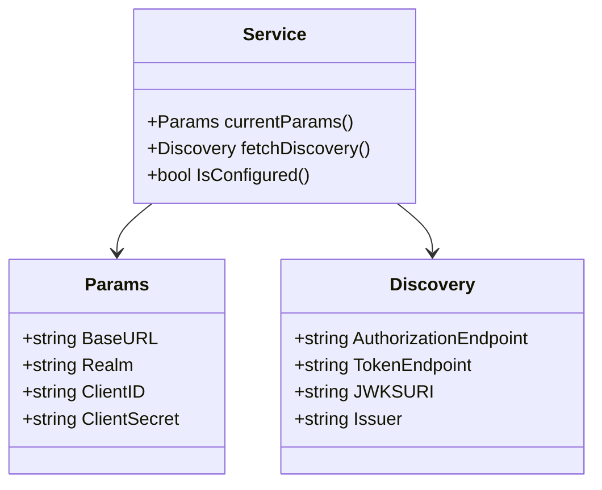

**类图来源**
- [backend/internal/oidc/oidc.go:37-51](file://backend/internal/oidc/oidc.go#L37-L51)
- [backend/internal/oidc/oidc.go:53-73](file://backend/internal/oidc/oidc.go#L53-L73)

### 授权流程

OIDC授权流程实现了PKCE和三重校验机制：

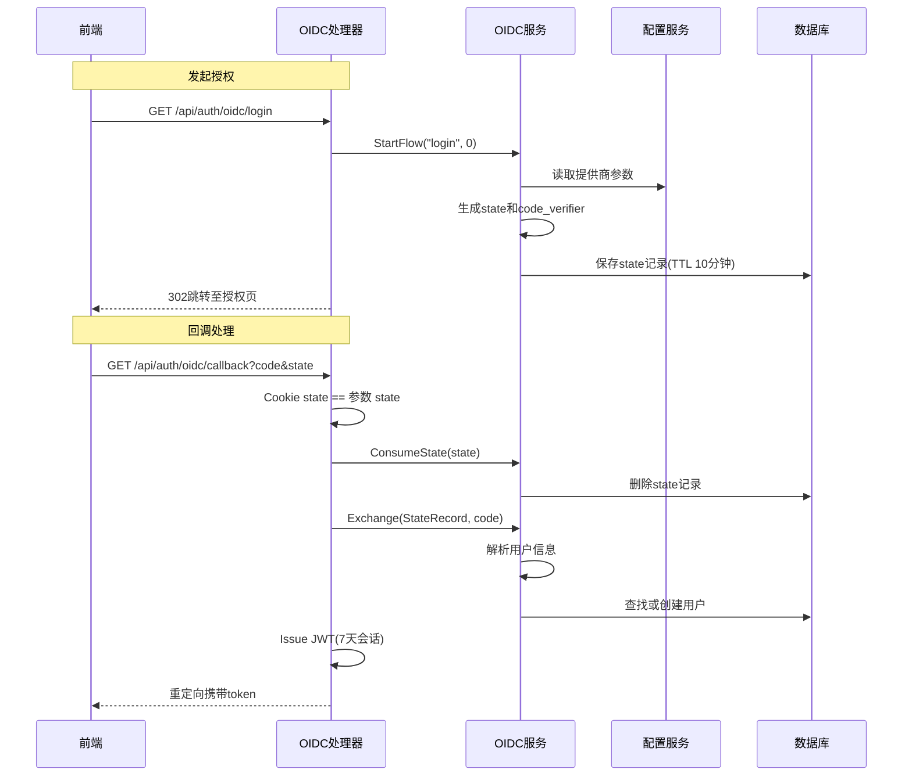

**授权流程图来源**
- [backend/internal/server/oidc.go:31-89](file://backend/internal/server/oidc.go#L31-L89)
- [backend/internal/oidc/flow.go:27-119](file://backend/internal/oidc/flow.go#L27-L119)

### 白名单机制

支持基于claims的白名单匹配，实现自动激活：

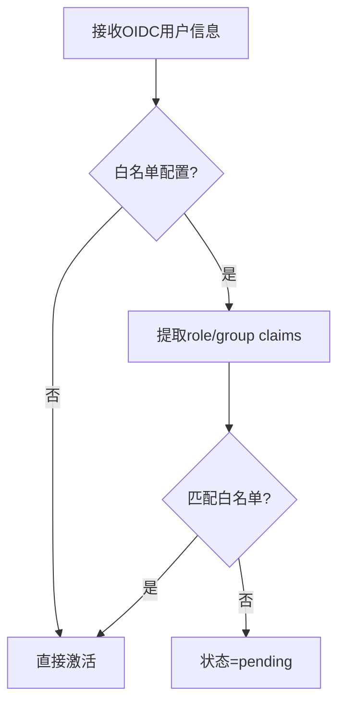

**白名单流程图来源**
- [backend/internal/oidc/oidc.go:214-239](file://backend/internal/oidc/oidc.go#L214-L239)

**章节来源**
- [backend/internal/server/oidc.go:31-89](file://backend/internal/server/oidc.go#L31-L89)
- [backend/internal/oidc/oidc.go:75-239](file://backend/internal/oidc/oidc.go#L75-L239)
- [backend/internal/oidc/flow.go:27-227](file://backend/internal/oidc/flow.go#L27-L227)

## JWT令牌与会话管理

### 令牌结构

JWT令牌采用最小化载荷设计，仅包含必要信息：

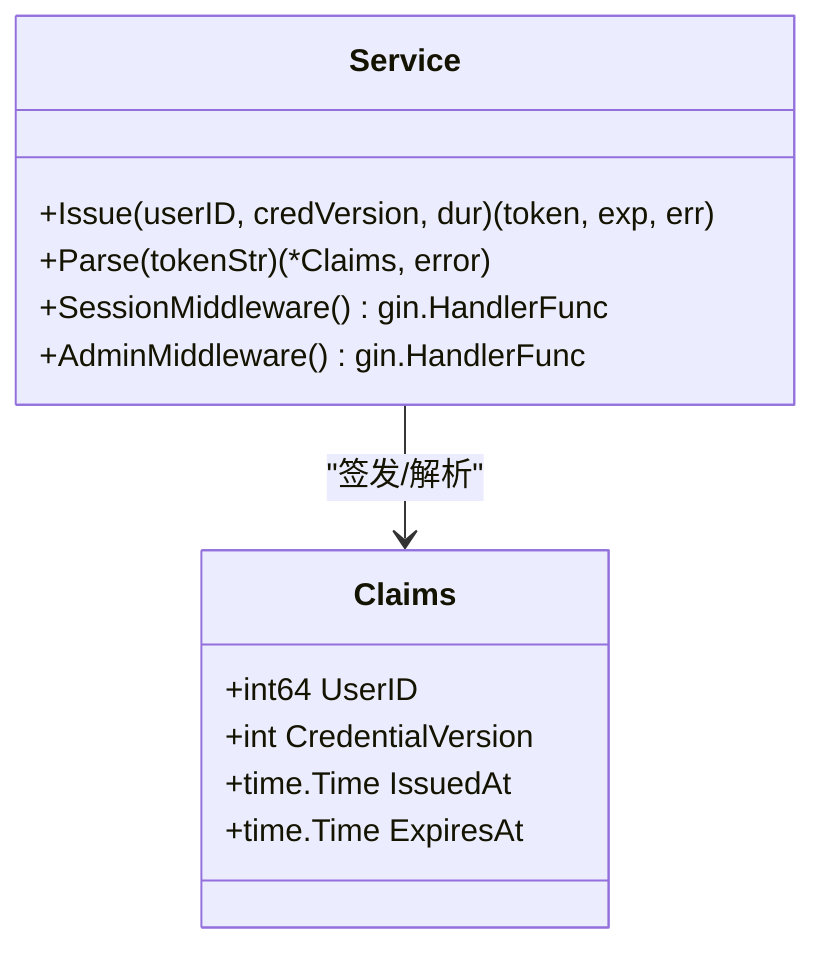

**类图来源**
- [backend/internal/auth/auth.go:66-72](file://backend/internal/auth/auth.go#L66-L72)
- [backend/internal/auth/auth.go:87-135](file://backend/internal/auth/auth.go#L87-L135)

### 会话中间件

会话中间件实现了实时验证机制：

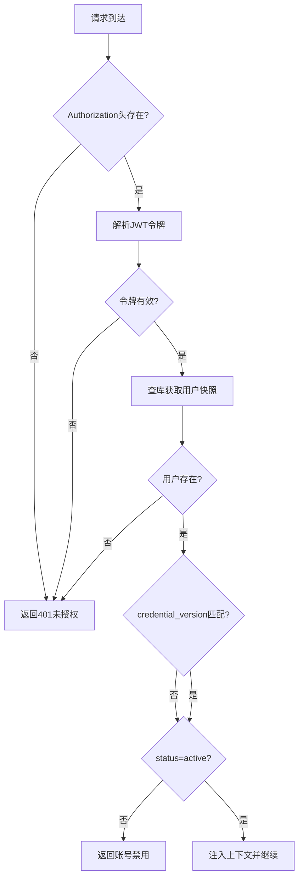

**会话中间件流程图来源**
- [backend/internal/auth/auth.go:144-180](file://backend/internal/auth/auth.go#L144-L180)

### 会话时长策略

不同认证方式采用不同的会话时长策略：

| 认证方式 | 默认时长 | 记住我选项 | 说明 |
|---------|----------|------------|------|
| 本地登录 | 24小时 | 7天 | 用户可选择延长会话 |
| OIDC登录 | 7天 | 无 | 固定会话时长 |
| 自注册 | 24小时 | 无 | 首次登录短会话 |

**章节来源**
- [backend/internal/auth/auth.go:66-193](file://backend/internal/auth/auth.go#L66-L193)
- [backend/internal/server/auth.go:124-134](file://backend/internal/server/auth.go#L124-L134)
- [backend/internal/server/oidc.go:82-88](file://backend/internal/server/oidc.go#L82-L88)

## 用户组与权限控制

### 用户组模型

用户组实现了灵活的订阅分配机制：

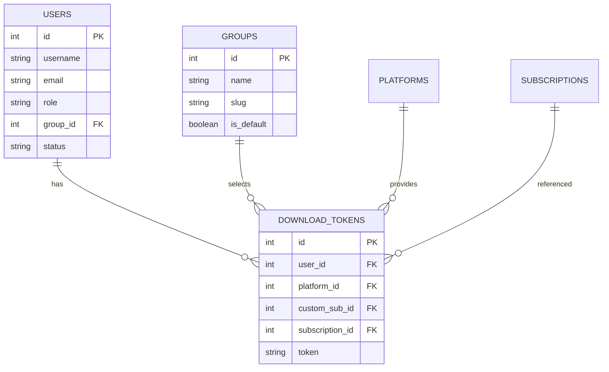

**实体关系图来源**
- [backend/migrations/0002_users.sql:1-17](file://backend/migrations/0002_users.sql#L1-L17)
- [backend/migrations/1004_tokens.sql:4-15](file://backend/migrations/1004_tokens.sql#L4-L15)

### 权限验证流程

权限验证结合了角色检查和组权限控制：

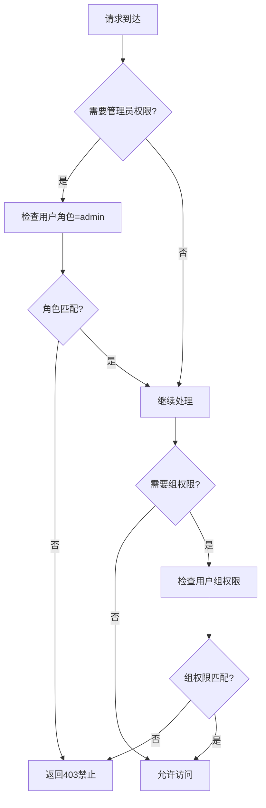

**权限验证流程图来源**
- [backend/internal/auth/auth.go:182-192](file://backend/internal/auth/auth.go#L182-L192)
- [backend/internal/group/group.go:82-141](file://backend/internal/group/group.go#L82-L141)

### 下载Token管理

下载Token实现了三态复用键机制：

| Token类型 | 复用键组成 | 说明 |
|-----------|------------|------|
| 基础Token | user_id + platform_id | 组内订阅共享 |
| 自定义Token | user_id + platform_id + custom_sub_id | 用户自定义订阅 |
| 显式Token | user_id + platform_id + subscription_id | 特定订阅预览 |

**章节来源**
- [backend/internal/group/group.go:51-220](file://backend/internal/group/group.go#L51-L220)
- [backend/internal/token/token.go:48-172](file://backend/internal/token/token.go#L48-L172)

## 密码重置与安全策略

### 重置令牌机制

密码重置采用一次性令牌和TTL控制：

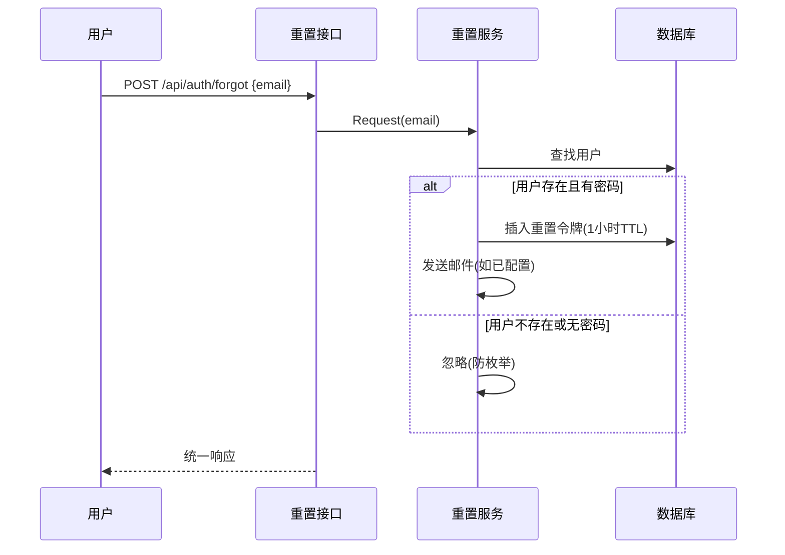

**重置流程图来源**
- [backend/internal/auth/reset.go:54-85](file://backend/internal/auth/reset.go#L54-L85)
- [backend/internal/server/auth.go:159-171](file://backend/internal/server/auth.go#L159-L171)

### 安全策略

系统实施了多层安全策略：

1. **密码安全**
   - bcrypt哈希存储，成本因子DefaultCost
   - 最小长度8个字符
   - 邮箱规范化防止注入攻击

2. **会话安全**
   - HS256签名JWT令牌
   - 凭据版本控制实现强制登出
   - 实时验证用户状态

3. **配置安全**
   - AES-256-GCM加密敏感配置
   - HKDF派生加密密钥
   - 签名密钥缺失时拒绝操作

**章节来源**
- [backend/internal/auth/reset.go:54-148](file://backend/internal/auth/reset.go#L54-L148)
- [backend/internal/config/config.go:220-361](file://backend/internal/config/config.go#L220-L361)

## 管理员操作保护

### 五重保护机制

管理员操作实现了多重保护约束：

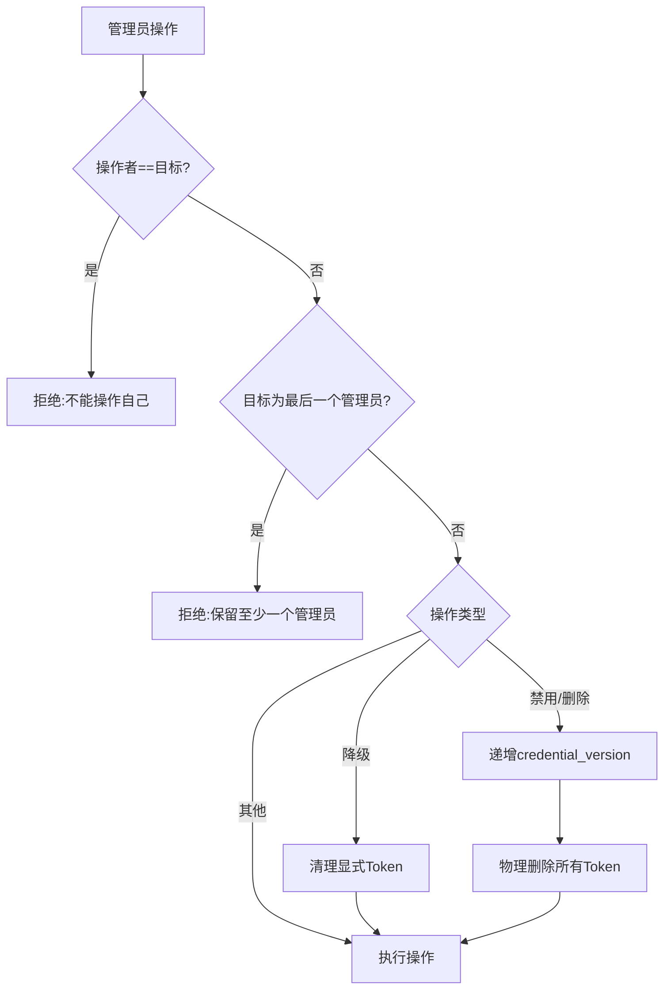

**保护流程图来源**
- [backend/internal/user/admin.go:47-63](file://backend/internal/user/admin.go#L47-L63)
- [backend/internal/user/admin.go:260-297](file://backend/internal/user/admin.go#L260-L297)

### 管理员功能

管理员提供了完整的用户生命周期管理：

| 功能 | 说明 | 安全约束 |
|------|------|----------|
| 创建用户 | 邮箱唯一性检查，默认加入预置组 | 密码复杂度验证 |
| 修改组 | 即时生效，无需清理Token | 组存在性验证 |
| 角色变更 | 禁止对最后一个管理员降级 | 级联清理显式Token |
| 密码重置 | 直接重置或邮件重置链接 | 递增credential_version |
| 禁用启用 | 禁用时清理所有Token | 同一事务中操作 |
| 删除用户 | 级联清理所有关联数据 | 防止删除最后一个管理员 |

**章节来源**
- [backend/internal/user/admin.go:187-569](file://backend/internal/user/admin.go#L187-L569)

## 性能优化与最佳实践

### 性能优化策略

系统采用了多种性能优化技术：

1. **发现文档缓存**
   - OIDC发现文档按base_url+realm缓存
   - 减少外部请求开销
   - 配置变更后自动清除缓存

2. **批量查询优化**
   - 用户列表分页查询，默认20条/页
   - 批量填充自定义订阅，避免N+1查询
   - 使用IN子句批量查询

3. **并发安全**
   - 下载Token使用BEGIN IMMEDIATE事务
   - 先查后建避免重复写入
   - 冲突重试机制处理并发

4. **内存优化**
   - 用户快照接口避免循环依赖
   - 流式处理大数据集
   - 及时释放数据库连接

### 安全最佳实践

1. **密码策略**
   - 使用bcrypt哈希，成本因子适中
   - 最小长度8个字符
   - 邮箱规范化防止注入

2. **会话管理**
   - JWT仅包含必要字段
   - 实时验证用户状态
   - 凭据版本控制实现强制登出

3. **配置安全**
   - 敏感配置AES-256-GCM加密
   - 签名密钥缺失时拒绝操作
   - 定期轮换密钥

4. **输入验证**
   - 所有输入参数长度限制
   - 邮箱格式严格验证
   - 控制字符过滤

**章节来源**
- [backend/internal/oidc/oidc.go:157-212](file://backend/internal/oidc/oidc.go#L157-L212)
- [backend/internal/user/admin.go:102-185](file://backend/internal/user/admin.go#L102-L185)
- [backend/internal/token/token.go:48-88](file://backend/internal/token/token.go#L48-L88)

## 故障排查与常见问题

### 常见错误及解决方案

1. **本地登录失败**
   - 检查"允许本地登录"开关
   - 确认邮箱格式和密码复杂度
   - 查看统一错误提示避免枚举

2. **OIDC回调失败**
   - 核对Cookie state与回调参数state一致
   - 确认state未过期（TTL 10分钟）
   - 检查provider参数与发现文档可达

3. **会话无效或已过期**
   - 检查Authorization头格式
   - 确认签名密钥存在
   - 比对credential_version与用户状态

4. **下载Token问题**
   - 确认复用键正确（user+platform+可选标识互斥）
   - 刷新时需在同一事务删旧建新
   - 检查平台权限和用户组

5. **管理员操作受限**
   - 检查是否对最后一个活跃管理员执行了禁用/删除/降级
   - 确认未对自己执行敏感操作
   - 验证SMTP配置用于邮件重置

### 调试技巧

1. **日志分析**
   - 关注认证相关日志条目
   - 检查错误堆栈信息
   - 监控性能指标

2. **数据库检查**
   - 验证用户状态和角色
   - 检查OIDC state记录
   - 确认Token存在性和有效性

3. **网络调试**
   - 检查OIDC提供商连通性
   - 验证回调地址配置
   - 确认HTTPS证书有效

**章节来源**
- [backend/internal/server/auth.go:99-134](file://backend/internal/server/auth.go#L99-L134)
- [backend/internal/server/oidc.go:42-89](file://backend/internal/server/oidc.go#L42-L89)
- [backend/internal/auth/auth.go:118-180](file://backend/internal/auth/auth.go#L118-L180)
- [backend/internal/token/token.go:125-172](file://backend/internal/token/token.go#L125-L172)
- [backend/internal/user/admin.go:260-463](file://backend/internal/user/admin.go#L260-L463)

## API参考文档

### 认证相关API

#### 本地注册
- **方法**: POST /api/auth/register
- **请求体**: `{ "username": "string", "email": "string", "password": "string" }`
- **响应**: `{ "token": "string", "expires_at": number, "status": "active|pending", "is_admin": boolean }`
- **错误码**: 409邮箱冲突, 400参数错误, 403未开放注册

#### 本地登录
- **方法**: POST /api/auth/login
- **请求体**: `{ "email": "string", "password": "string", "remember": boolean }`
- **响应**: `{ "token": "string", "expires_at": number, "user": { ... } }`
- **错误码**: 401认证失败, 403本地登录关闭

#### 获取当前用户
- **方法**: GET /api/auth/me
- **头部**: `Authorization: Bearer <token>`
- **响应**: `{ "id": number, "username": "string", "email": "string", "role": "admin|user", "group_id": number|null, "status": "active|pending|disabled", "user_source": "local|selfreg|oidc", "group_name": "string" }`

#### 登出
- **方法**: POST /api/auth/logout
- **头部**: `Authorization: Bearer <token>`
- **响应**: `{ "message": "ok" }`

#### 忘记密码
- **方法**: POST /api/auth/forgot
- **请求体**: `{ "email": "string" }`
- **响应**: `{ "message": "若该邮箱已注册，重置链接已发送" }`

#### 重置密码
- **方法**: POST /api/auth/reset
- **请求体**: `{ "token": "string", "password": "string" }`
- **响应**: `{ "message": "密码已重置，请使用新密码登录" }`

### OIDC相关API

#### OIDC登录发起
- **方法**: GET /api/auth/oidc/login
- **响应**: 302跳转至授权页（设置state Cookie）

#### OIDC回调
- **方法**: GET /api/auth/oidc/callback?code=<code>&state=<state>
- **响应**: 302重定向至/login/callback?token=<token>

#### 绑定OIDC身份
- **方法**: POST /api/auth/oidc/bind
- **头部**: `Authorization: Bearer <token>`
- **响应**: `{ "auth_url": "string" }`

#### 测试连接
- **方法**: POST /api/oidc/test
- **请求体**: `{ "provider_type": "keycloak|auth0|generic|mock", "base_url": "string", "realm": "string", "client_id": "string", "client_secret": "string" }`
- **响应**: 测试结果对象

### 管理员API

#### 用户管理
- **获取用户列表**: GET /api/admin/users?page=1&size=20&keyword=search
- **创建用户**: POST /api/admin/users
- **修改用户组**: PUT /api/admin/users/:id/group
- **角色变更**: PUT /api/admin/users/:id/role
- **密码重置**: POST /api/admin/users/:id/reset-password
- **禁用启用**: PUT /api/admin/users/:id/status
- **删除用户**: DELETE /api/admin/users/:id

**章节来源**
- [backend/internal/server/auth.go:25-196](file://backend/internal/server/auth.go#L25-L196)
- [backend/internal/server/oidc.go:19-163](file://backend/internal/server/oidc.go#L19-L163)

## 结论

本认证与授权系统实现了稳健的安全架构，通过本地账号和OIDC双通道认证、JWT会话凭据管理、基于用户组的权限控制、以及完善的密码重置机制，满足了企业级应用的安全需求。

### 核心优势
1. **安全性**：采用现代加密算法和安全协议，防止常见攻击
2. **可扩展性**：模块化设计支持功能扩展和第三方集成
3. **可维护性**：清晰的代码结构和完善的文档
4. **高性能**：优化的查询和缓存策略
5. **用户体验**：简洁的API设计和友好的错误提示

### 部署建议
1. **生产环境**：启用可信OIDC提供商，完善日志审计和监控告警
2. **密钥管理**：定期轮换签名密钥和敏感配置
3. **备份策略**：定期备份数据库和用户数据
4. **监控指标**：关注认证失败率、会话有效期、性能指标
5. **安全审计**：定期进行安全评估和渗透测试

该系统为VPN订阅管理平台提供了可靠的安全基础，确保用户数据和系统资源的安全访问控制。