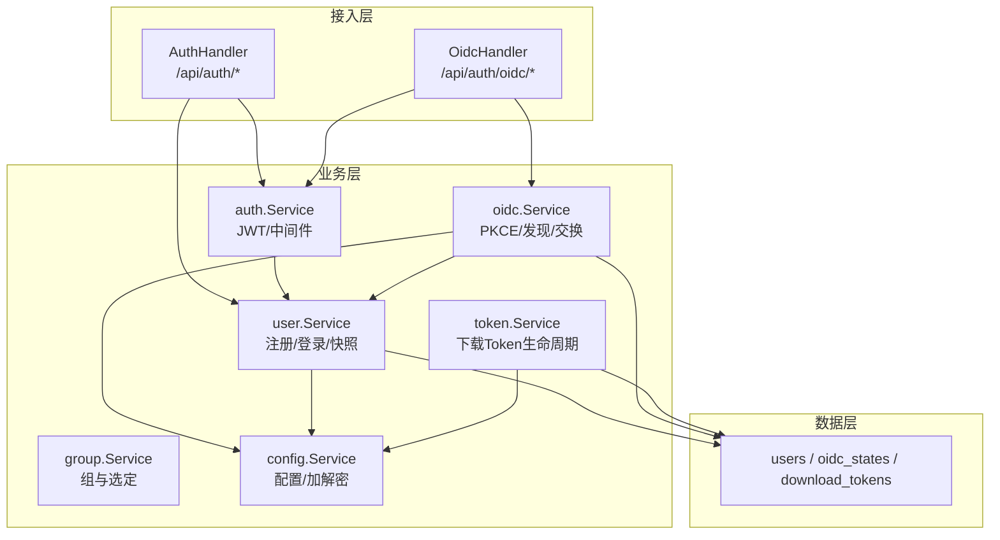
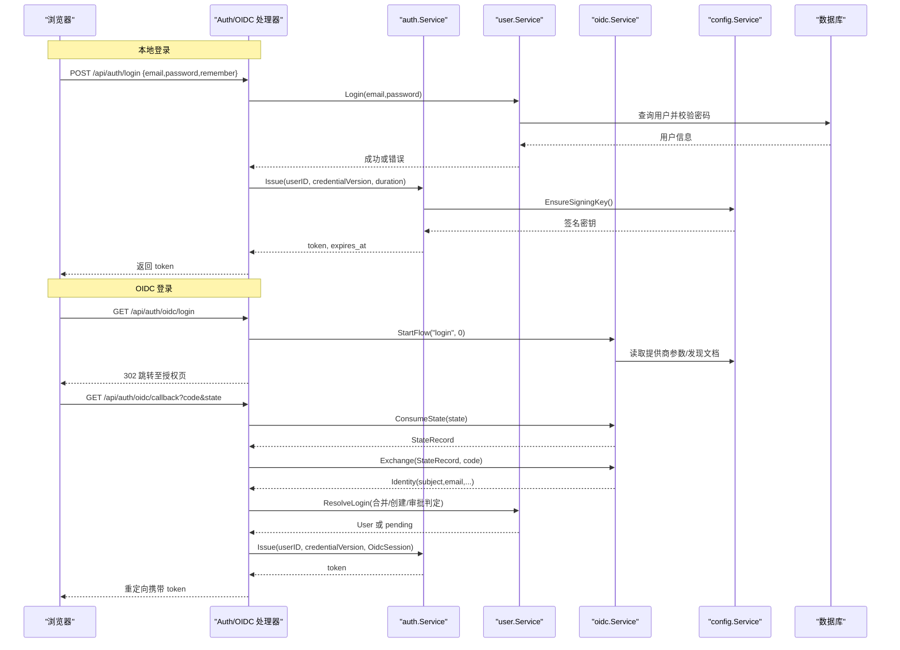
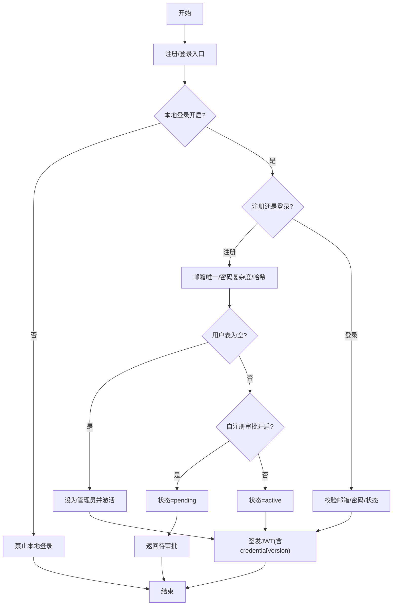
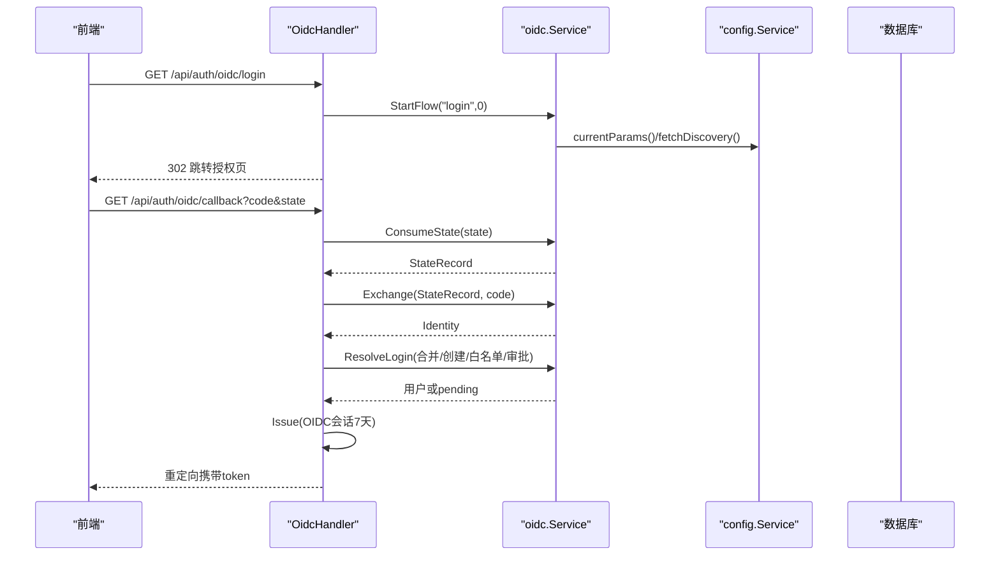
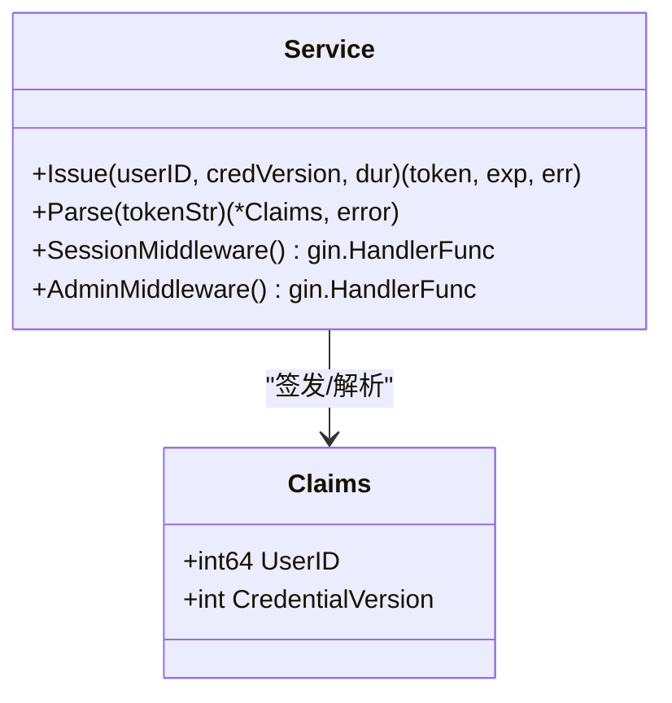
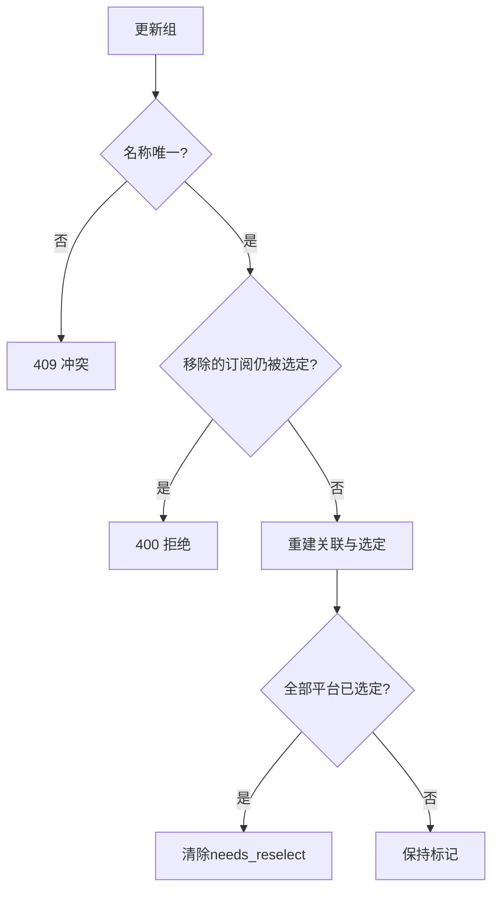
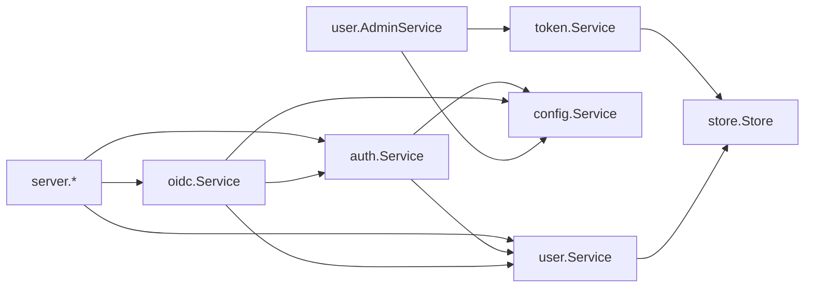

# 认证与授权系统

<cite>
**本文引用的文件**
- [backend/internal/auth/auth.go](file://backend/internal/auth/auth.go)
- [backend/internal/server/auth.go](file://backend/internal/server/auth.go)
- [backend/internal/oidc/oidc.go](file://backend/internal/oidc/oidc.go)
- [backend/internal/oidc/flow.go](file://backend/internal/oidc/flow.go)
- [backend/internal/oidc/helpers.go](file://backend/internal/oidc/helpers.go)
- [backend/internal/server/oidc.go](file://backend/internal/server/oidc.go)
- [backend/internal/user/user.go](file://backend/internal/user/user.go)
- [backend/internal/user/admin.go](file://backend/internal/user/admin.go)
- [backend/internal/user/oidc.go](file://backend/internal/user/oidc.go)
- [backend/internal/config/config.go](file://backend/internal/config/config.go)
- [backend/internal/token/token.go](file://backend/internal/token/token.go)
- [backend/migrations/0002_users.sql](file://backend/migrations/0002_users.sql)
- [backend/migrations/0004_oidc.sql](file://backend/migrations/0004_oidc.sql)
- [backend/migrations/1004_tokens.sql](file://backend/migrations/1004_tokens.sql)
</cite>

## 目录
1. [简介](#简介)
2. [项目结构](#项目结构)
3. [核心组件](#核心组件)
4. [架构总览](#架构总览)
5. [详细组件分析](#详细组件分析)
6. [依赖关系分析](#依赖关系分析)
7. [性能与安全考量](#性能与安全考量)
8. [故障排查指南](#故障排查指南)
9. [结论](#结论)
10. [附录：API 调用示例](#附录api-调用示例)

## 简介
本系统提供完整的认证与授权能力，涵盖本地账号注册/登录、OIDC 单点登录集成、JWT 会话凭据管理、基于用户组与角色的权限控制，以及下载 Token 的生命周期管理。系统设计强调安全与可运维性：密码使用 bcrypt 哈希存储；会话凭据采用 HS256 签名的 JWT，并在每次请求时实时校验用户状态与凭据版本；OIDC 流程支持 PKCE、白名单激活与待审批机制；敏感配置（如 OIDC Client Secret）以 AES-256-GCM 加密落库；管理员操作具备多重保护约束。

## 项目结构
后端按领域分层组织：
- 接入层（server）：HTTP 路由与处理器，负责参数校验、限流、验证码、错误映射。
- 业务层（auth/oidc/user/group/token/config）：实现认证、OIDC、用户、组、令牌、配置等核心逻辑。
- 数据层（store + migrations）：通过迁移脚本维护 SQLite 表结构，服务层通过 store 访问数据库。

图表来源
- [backend/internal/server/auth.go:25-34](file://backend/internal/server/auth.go#L25-L34)
- [backend/internal/server/oidc.go:19-27](file://backend/internal/server/oidc.go#L19-L27)
- [backend/internal/auth/auth.go:87-116](file://backend/internal/auth/auth.go#L87-L116)
- [backend/internal/user/user.go:82-154](file://backend/internal/user/user.go#L82-L154)
- [backend/internal/oidc/flow.go:27-62](file://backend/internal/oidc/flow.go#L27-L62)
- [backend/internal/config/config.go:220-280](file://backend/internal/config/config.go#L220-L280)
- [backend/migrations/0002_users.sql:1-17](file://backend/migrations/0002_users.sql#L1-L17)
- [backend/migrations/0004_oidc.sql:1-9](file://backend/migrations/0004_oidc.sql#L1-L9)
- [backend/migrations/1004_tokens.sql:4-15](file://backend/migrations/1004_tokens.sql#L4-L15)

章节来源
- [backend/internal/server/auth.go:25-34](file://backend/internal/server/auth.go#L25-L34)
- [backend/internal/server/oidc.go:19-27](file://backend/internal/server/oidc.go#L19-L27)

## 核心组件
- 认证与会话（auth）
  - 密码哈希与校验、邮箱规范化、复杂度校验。
  - JWT 签发与解析（HS256），会话中间件在每次请求时实时查库校验用户状态与凭据版本。
  - 管理员角色中间件用于叠加鉴权。
- 用户服务（user）
  - 自注册与首管理员机制、登录校验、用户快照查询。
  - 管理员用户管理：创建、改组、角色变更、禁用/启用、密码重置、删除等，含多重保护。
- OIDC 服务（oidc）
  - 提供商参数管理、发现文档获取与缓存、PKCE 授权流、回调处理、身份交换、白名单匹配、模拟模式。
- 令牌服务（token）
  - 下载 Token 的三态复用键、刷新轮替、级联清理；分享/规则 Token 的创建与轮替。
- 配置服务（config）
  - 系统配置读写、敏感值 AES-256-GCM 加解密、签名密钥生成与派生。

章节来源
- [backend/internal/auth/auth.go:22-193](file://backend/internal/auth/auth.go#L22-L193)
- [backend/internal/user/user.go:82-202](file://backend/internal/user/user.go#L82-L202)
- [backend/internal/user/admin.go:187-463](file://backend/internal/user/admin.go#L187-L463)
- [backend/internal/oidc/oidc.go:23-239](file://backend/internal/oidc/oidc.go#L23-L239)
- [backend/internal/oidc/flow.go:27-259](file://backend/internal/oidc/flow.go#L27-L259)
- [backend/internal/token/token.go:48-172](file://backend/internal/token/token.go#L48-L172)
- [backend/internal/config/config.go:220-361](file://backend/internal/config/config.go#L220-L361)

## 架构总览
下图展示从浏览器到后端的完整认证链路，包括本地登录与 OIDC 两种路径，以及会话中间件的统一鉴权。

图表来源
- [backend/internal/server/auth.go:99-134](file://backend/internal/server/auth.go#L99-L134)
- [backend/internal/server/oidc.go:31-89](file://backend/internal/server/oidc.go#L31-L89)
- [backend/internal/oidc/flow.go:27-119](file://backend/internal/oidc/flow.go#L27-L119)
- [backend/internal/oidc/flow.go:132-227](file://backend/internal/oidc/flow.go#L132-L227)
- [backend/internal/auth/auth.go:98-135](file://backend/internal/auth/auth.go#L98-L135)
- [backend/internal/config/config.go:294-313](file://backend/internal/config/config.go#L294-L313)

## 详细组件分析

### 本地账号认证与会话
- 注册流程
  - 入口可见性受“允许本地登录”和“允许自注册/空表例外”控制。
  - 邮箱规范化与唯一性校验；密码复杂度≥8；bcrypt 哈希存储。
  - 首管理员机制：当用户表为空时，首个注册用户自动成为管理员且直接激活。
  - 若开启自注册审批且非首管理员，则状态为 pending。
- 登录流程
  - 邮箱+密码校验，失败统一提示防枚举；仅 active 账户可登录。
  - 根据 remember 选择会话时长（24 小时或 7 天）。
  - 签发 JWT（HS256），包含 userID 与 credentialVersion。
- 会话中间件
  - 每次请求解析 Authorization: Bearer <token>，验签并解析 claims。
  - 实时查库取用户快照，比对 credentialVersion 与 status=active。
  - 将用户 ID 与角色注入上下文供后续中间件/处理器使用。
- 管理员中间件
  - 检查上下文中的角色是否为 admin，否则拒绝。

图表来源
- [backend/internal/server/auth.go:44-91](file://backend/internal/server/auth.go#L44-L91)
- [backend/internal/server/auth.go:99-134](file://backend/internal/server/auth.go#L99-L134)
- [backend/internal/user/user.go:82-154](file://backend/internal/user/user.go#L82-L154)
- [backend/internal/auth/auth.go:144-180](file://backend/internal/auth/auth.go#L144-L180)

章节来源
- [backend/internal/server/auth.go:44-134](file://backend/internal/server/auth.go#L44-L134)
- [backend/internal/user/user.go:82-187](file://backend/internal/user/user.go#L82-L187)
- [backend/internal/auth/auth.go:30-135](file://backend/internal/auth/auth.go#L30-L135)

### OIDC 单点登录集成
- 配置管理
  - 提供商类型与参数（base_url/realm/client_id/client_secret）以 JSON 形式存储，client_secret 加密落库。
  - 发现文档带缓存（key = base_url + realm），减少外部请求。
- 授权流程
  - StartFlow 生成 state（≥128 位）与 code_verifier（PKCE S256），持久化 state 记录（TTL 10 分钟）。
  - 构造授权 URL 并 302 跳转；回调时三重校验（Cookie state == 参数 state == 存储记录存在且未过期）。
  - Exchange 用 code + verifier 换取 id_token，解析 subject/email/username/role/group 等声明。
- 用户合并与激活
  - 按 subject 查找用户；不存在则创建新用户（同样支持首管理员机制）。
  - 白名单匹配：可从 claims 中按路径提取 role/group 并与配置集合比较，命中即激活。
  - 待审批：若未命中白名单且需审批，则状态为 pending。
- 会话签发
  - OIDC 登录固定 7 天会话，无记住我选项。

图表来源
- [backend/internal/server/oidc.go:31-89](file://backend/internal/server/oidc.go#L31-L89)
- [backend/internal/oidc/flow.go:27-119](file://backend/internal/oidc/flow.go#L27-L119)
- [backend/internal/oidc/flow.go:132-227](file://backend/internal/oidc/flow.go#L132-L227)
- [backend/internal/oidc/oidc.go:75-155](file://backend/internal/oidc/oidc.go#L75-L155)
- [backend/internal/oidc/oidc.go:214-239](file://backend/internal/oidc/oidc.go#L214-L239)

章节来源
- [backend/internal/server/oidc.go:31-89](file://backend/internal/server/oidc.go#L31-L89)
- [backend/internal/oidc/flow.go:27-227](file://backend/internal/oidc/flow.go#L27-L227)
- [backend/internal/oidc/oidc.go:75-239](file://backend/internal/oidc/oidc.go#L75-L239)

### JWT 令牌管理与会话控制
- 签发
  - 使用 HS256 签名，载荷仅包含 userID 与 credentialVersion，避免将角色/组放入令牌。
  - 确保签名密钥存在（缺失则生成），保证一致性。
- 解析与校验
  - 解析时强制算法为 HMAC，使用当前签名密钥验证。
  - 每次请求实时查库比对 credentialVersion 与 status，防止旧令牌继续生效。
- 会话时长
  - 本地登录：默认 24 小时，勾选“记住我”为 7 天。
  - OIDC 登录：固定 7 天。
- 登出
  - 服务端无会话存储，登出为客户端语义（前端清除本地 token）。

图表来源
- [backend/internal/auth/auth.go:66-135](file://backend/internal/auth/auth.go#L66-L135)
- [backend/internal/auth/auth.go:144-193](file://backend/internal/auth/auth.go#L144-L193)

章节来源
- [backend/internal/auth/auth.go:66-193](file://backend/internal/auth/auth.go#L66-L193)

### 用户组与权限模型
- 用户组
  - 组名全局唯一，slug 自动生成；支持每平台选定订阅（selections）。
  - 更新组时校验取消关联的订阅是否仍被选定，防止悬空选定。
  - 删除组时用户迁入默认组，关联/选定由外键级联清理。
- 权限控制
  - 角色：admin/user，通过 AdminMiddleware 限制管理端点。
  - 组：用户归属组决定其可使用的订阅范围；组内订阅与平台选定共同决定资源分发。
  - 下载 Token：按 user+platform+可选标识（custom_sub_id 或 subscription_id）三态复用键生成，避免重复。

图表来源
- [backend/internal/group/group.go:82-141](file://backend/internal/group/group.go#L82-L141)

章节来源
- [backend/internal/group/group.go:51-220](file://backend/internal/group/group.go#L51-L220)
- [backend/internal/token/token.go:48-172](file://backend/internal/token/token.go#L48-L172)

### 管理员用户管理
- 创建用户：邮箱唯一、密码复杂度、默认加入预置组、直接激活。
- 改组：即时生效，无需清理 Token（实时解析跟随）。
- 角色变更：禁止对最后一个活跃管理员降级；降级时级联清显式订阅 Token。
- 密码重置：直接重置（递增 credentialVersion 使所有会话失效）或邮件重置链接。
- 禁用/启用：禁用同事务递增 credentialVersion 并物理删除全部 Token。
- 删除用户：级联清理 Token、自定义订阅及版本文件；禁止删除最后一个活跃管理员。

章节来源
- [backend/internal/user/admin.go:187-569](file://backend/internal/user/admin.go#L187-L569)

## 依赖关系分析
- 模块耦合
  - server 层依赖 auth/user/oidc/config 等服务，职责单一，便于测试与替换。
  - auth 依赖 config（签名密钥）与 user（快照接口），避免循环依赖。
  - oidc 依赖 config（配置/加密）、user（用户查建/合并）、auth（会话签发）。
  - token 依赖 store 进行事务操作，与 user/admin 在禁用/降级时联动清理。
- 外部依赖
  - 数据库：SQLite，通过迁移脚本维护 users、oidc_states、download_tokens 等表。
  - HTTP 客户端：用于 OIDC 发现文档与 token 端点通信。

图表来源
- [backend/internal/server/auth.go:25-34](file://backend/internal/server/auth.go#L25-L34)
- [backend/internal/server/oidc.go:19-27](file://backend/internal/server/oidc.go#L19-L27)
- [backend/internal/auth/auth.go:87-116](file://backend/internal/auth/auth.go#L87-L116)
- [backend/internal/oidc/oidc.go:53-73](file://backend/internal/oidc/oidc.go#L53-L73)
- [backend/internal/token/token.go:19-27](file://backend/internal/token/token.go#L19-L27)

章节来源
- [backend/internal/server/auth.go:25-34](file://backend/internal/server/auth.go#L25-L34)
- [backend/internal/server/oidc.go:19-27](file://backend/internal/server/oidc.go#L19-L27)
- [backend/internal/auth/auth.go:87-116](file://backend/internal/auth/auth.go#L87-L116)
- [backend/internal/oidc/oidc.go:53-73](file://backend/internal/oidc/oidc.go#L53-L73)
- [backend/internal/token/token.go:19-27](file://backend/internal/token/token.go#L19-L27)

## 性能与安全考量
- 性能
  - OIDC 发现文档缓存（按 base_url + realm），降低外部请求开销。
  - 用户列表分页与批量填充自定义订阅，避免 N+1 查询。
  - 下载 Token 复用键与事务内先查后建，减少并发冲突与重复写入。
- 安全
  - 密码使用 bcrypt 哈希；邮箱规范化与控制字符过滤，防 SMTP 头注入。
  - JWT 仅含必要字段，角色/组不放入令牌，每次请求实时查库校验。
  - 敏感配置（如 OIDC Client Secret）AES-256-GCM 加密落库，签名密钥缺失时拒绝操作。
  - OIDC 流程使用 PKCE 与 state TTL，回调三重校验防重放。
  - 管理员操作多重保护：禁止自操作、保留至少一个活跃管理员、禁用同事务递增凭证版本并清理 Token。

[本节为通用指导，不直接分析具体文件]

## 故障排查指南
- 本地登录失败
  - 检查“允许本地登录”开关；确认邮箱格式与密码复杂度；查看统一错误提示避免枚举。
  - 参考：[backend/internal/server/auth.go:99-134](file://backend/internal/server/auth.go#L99-L134)、[backend/internal/user/user.go:170-187](file://backend/internal/user/user.go#L170-L187)
- OIDC 回调失败
  - 核对 Cookie state 与回调参数 state 一致；确认 state 未过期；检查 provider 参数与发现文档可达。
  - 参考：[backend/internal/server/oidc.go:42-89](file://backend/internal/server/oidc.go#L42-L89)、[backend/internal/oidc/flow.go:70-119](file://backend/internal/oidc/flow.go#L70-L119)
- 会话无效或已过期
  - 检查 Authorization 头格式；确认签名密钥存在；比对 credentialVersion 与用户状态。
  - 参考：[backend/internal/auth/auth.go:118-180](file://backend/internal/auth/auth.go#L118-L180)
- 下载 Token 问题
  - 确认复用键正确（user+platform+可选标识互斥）；刷新时需在同一事务删旧建新。
  - 参考：[backend/internal/token/token.go:48-172](file://backend/internal/token/token.go#L48-L172)
- 管理员操作受限
  - 检查是否对最后一个活跃管理员执行了禁用/删除/降级；确认未对自己执行敏感操作。
  - 参考：[backend/internal/user/admin.go:260-463](file://backend/internal/user/admin.go#L260-L463)

章节来源
- [backend/internal/server/auth.go:99-134](file://backend/internal/server/auth.go#L99-L134)
- [backend/internal/server/oidc.go:42-89](file://backend/internal/server/oidc.go#L42-L89)
- [backend/internal/oidc/flow.go:70-119](file://backend/internal/oidc/flow.go#L70-L119)
- [backend/internal/auth/auth.go:118-180](file://backend/internal/auth/auth.go#L118-L180)
- [backend/internal/token/token.go:48-172](file://backend/internal/token/token.go#L48-L172)
- [backend/internal/user/admin.go:260-463](file://backend/internal/user/admin.go#L260-L463)

## 结论
本系统实现了稳健的认证与授权体系：本地账号与 OIDC 双通道登录、JWT 会话凭据与实时校验、基于用户组与角色的权限控制、以及下载 Token 的全生命周期管理。通过严格的密码策略、敏感配置加密、PKCE 与 state 防护、管理员多重保护等机制，系统在安全性与可运维性方面达到生产可用标准。建议在生产环境启用可信 OIDC 提供商、完善日志审计与监控告警，并定期轮换签名密钥与敏感配置。

[本节为总结性内容，不直接分析具体文件]

## 附录：API 调用示例
以下为典型 API 调用示例（JSON 请求体与响应字段说明），请结合前端实际实现调整。

- 本地注册
  - 方法：POST /api/auth/register
  - 请求体：{ "username": "string", "email": "string", "password": "string" }
  - 响应：{ "token": "string", "expires_at": number, "status": "active|pending", "is_admin": boolean }
  - 参考：[backend/internal/server/auth.go:44-91](file://backend/internal/server/auth.go#L44-L91)
- 本地登录
  - 方法：POST /api/auth/login
  - 请求体：{ "email": "string", "password": "string", "remember": boolean }
  - 响应：{ "token": "string", "expires_at": number, "user": { ... } }
  - 参考：[backend/internal/server/auth.go:99-134](file://backend/internal/server/auth.go#L99-L134)
- 获取当前用户
  - 方法：GET /api/auth/me
  - 头部：Authorization: Bearer <token>
  - 响应：{ "id": number, "username": "string", "email": "string", "role": "admin|user", "group_id": number|null, "status": "active|pending|disabled", "user_source": "local|selfreg|oidc", "group_name": "string" }
  - 参考：[backend/internal/server/auth.go:136-152](file://backend/internal/server/auth.go#L136-L152)
- 登出（客户端语义）
  - 方法：POST /api/auth/logout
  - 头部：Authorization: Bearer <token>
  - 响应：{ "message": "ok" }
  - 参考：[backend/internal/server/auth.go:154-157](file://backend/internal/server/auth.go#L154-L157)
- 忘记密码
  - 方法：POST /api/auth/forgot
  - 请求体：{ "email": "string" }
  - 响应：{ "message": "若该邮箱已注册，重置链接已发送" }
  - 参考：[backend/internal/server/auth.go:159-171](file://backend/internal/server/auth.go#L159-L171)
- 重置密码
  - 方法：POST /api/auth/reset
  - 请求体：{ "token": "string", "password": "string" }
  - 响应：{ "message": "密码已重置，请使用新密码登录" }
  - 参考：[backend/internal/server/auth.go:173-196](file://backend/internal/server/auth.go#L173-L196)
- OIDC 登录发起
  - 方法：GET /api/auth/oidc/login
  - 响应：302 跳转至授权页（设置 state Cookie）
  - 参考：[backend/internal/server/oidc.go:31-40](file://backend/internal/server/oidc.go#L31-L40)
- OIDC 回调
  - 方法：GET /api/auth/oidc/callback?code=<code>&state=<state>
  - 响应：302 重定向至 /login/callback?token=<token>
  - 参考：[backend/internal/server/oidc.go:42-89](file://backend/internal/server/oidc.go#L42-L89)
- 绑定 OIDC 身份（需会话）
  - 方法：POST /api/auth/oidc/bind
  - 头部：Authorization: Bearer <token>
  - 响应：{ "auth_url": "string" }
  - 参考：[backend/internal/server/oidc.go:127-139](file://backend/internal/server/oidc.go#L127-L139)
- 测试连接（不落库）
  - 方法：POST /api/oidc/test
  - 请求体：{ "provider_type": "keycloak|auth0|generic|mock", "base_url": "string", "realm": "string", "client_id": "string", "client_secret": "string" }
  - 响应：测试结果对象
  - 参考：[backend/internal/server/oidc.go:141-163](file://backend/internal/server/oidc.go#L141-L163)

章节来源
- [backend/internal/server/auth.go:44-196](file://backend/internal/server/auth.go#L44-L196)
- [backend/internal/server/oidc.go:31-163](file://backend/internal/server/oidc.go#L31-L163)