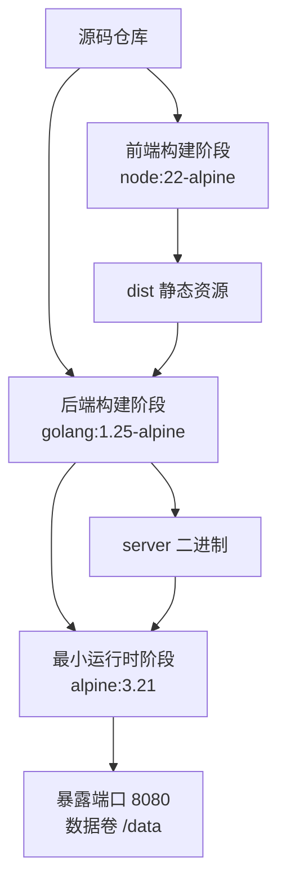
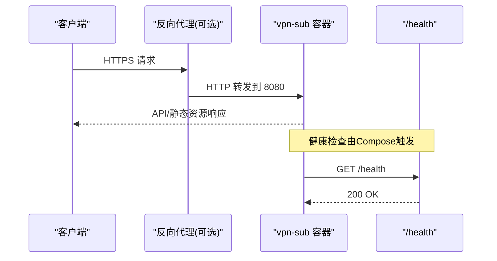
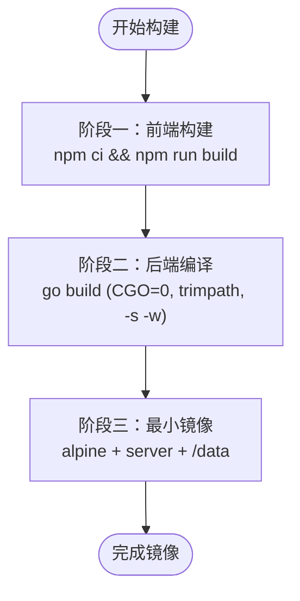
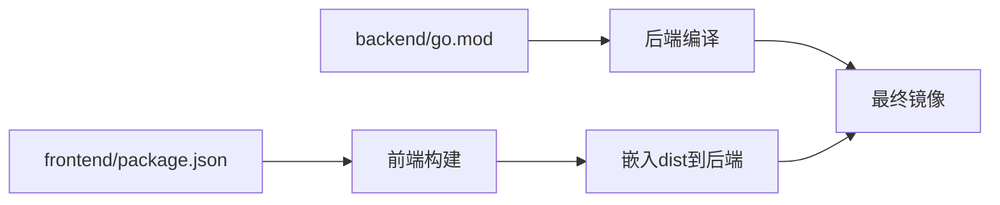

# Docker容器化部署

<cite>
**本文引用的文件**
- [Dockerfile](file://Dockerfile)
- [docker-compose.yml](file://docker-compose.yml)
- [docker-compose.yml.example](file://docker-compose.yml.example)
- [.github/workflows/docker-build.yml](file://.github/workflows/docker-build.yml)
- [backend/go.mod](file://backend/go.mod)
- [frontend/package.json](file://frontend/package.json)
- [backend/web/web.go](file://backend/web/web.go)
- [frontend/vite.config.ts](file://frontend/vite.config.ts)
- [README.md](file://README.md)
- [backend/cmd/server/main.go](file://backend/cmd/server/main.go)
</cite>

## 目录
1. [简介](#简介)
2. [项目结构](#项目结构)
3. [核心组件](#核心组件)
4. [架构总览](#架构总览)
5. [详细组件分析](#详细组件分析)
6. [依赖关系分析](#依赖关系分析)
7. [性能与镜像优化](#性能与镜像优化)
8. [故障排查指南](#故障排查指南)
9. [结论](#结论)
10. [附录](#附录)

## 简介
本文件面向生产与开发环境，提供该项目的完整Docker容器化部署说明。重点包括：
- 多阶段构建：前端构建、后端静态编译、最小运行时镜像
- Dockerfile每步作用与环境配置（Node.js、Go、Alpine）
- docker-compose编排：数据卷、端口映射、环境变量
- 生产与开发差异、常见问题与解决方案

## 项目结构
- 前端：Vue3 + Vite，产物通过后端嵌入静态资源
- 后端：Go + Gin，使用嵌入式SQLite，单二进制运行
- 容器：三阶段构建，最终仅包含可执行与必要系统工具，非root运行，数据持久化到卷

图表来源
- [Dockerfile:1-31](file://Dockerfile#L1-L31)

章节来源
- [Dockerfile:1-31](file://Dockerfile#L1-L31)
- [backend/web/web.go:1-8](file://backend/web/web.go#L1-L8)
- [frontend/vite.config.ts:1-25](file://frontend/vite.config.ts#L1-L25)

## 核心组件
- 前端构建阶段：基于Node镜像安装依赖并打包为静态资源
- 后端构建阶段：下载Go模块、复制前端产物、CGO关闭的静态编译
- 运行时阶段：Alpine基础镜像，创建非root用户，拷贝二进制，声明数据卷与端口，设置入口

章节来源
- [Dockerfile:1-31](file://Dockerfile#L1-L31)
- [backend/go.mod:1-50](file://backend/go.mod#L1-L50)
- [frontend/package.json:1-37](file://frontend/package.json#L1-L37)

## 架构总览
容器内运行单一服务进程，同时提供API与静态页面；所有数据落盘于/data目录；健康检查通过内置/health端点；可通过反向代理接入HTTPS与域名。

图表来源
- [docker-compose.yml:1-28](file://docker-compose.yml#L1-L28)
- [docker-compose.yml.example:1-41](file://docker-compose.yml.example#L1-L41)
- [README.md:165-204](file://README.md#L165-L204)

## 详细组件分析

### 多阶段构建详解（Dockerfile）
- 阶段一：前端构建
  - 使用 node:22-alpine
  - 复制包清单并安装依赖
  - 复制源码并执行构建，输出至 dist
- 阶段二：后端静态编译
  - 使用 golang:1.25-alpine
  - 下载Go模块缓存
  - 将阶段一的dist复制到后端web/dist，供embed嵌入
  - 以CGO_ENABLED=0、GOOS=linux进行静态编译，剥离符号与调试信息
- 阶段三：最小运行时
  - 使用 alpine:3.21
  - 创建应用组与非root用户
  - 拷贝server二进制
  - 初始化/data目录并授权
  - 声明VOLUME /data，EXPOSE 8080
  - 以非root用户启动，ENTRYPOINT指向server

图表来源
- [Dockerfile:1-31](file://Dockerfile#L1-L31)

章节来源
- [Dockerfile:1-31](file://Dockerfile#L1-L31)
- [backend/web/web.go:1-8](file://backend/web/web.go#L1-L8)

### 环境变量与运行模式
- APP_MODE：dev/prod，影响数据库文件与功能开关
- LOG_LEVEL：日志级别
- LOG_FORMAT：console/json
- PORT：监听端口（默认8080）
- TRUST_PROXY：auto/on/off，控制是否信任X-Forwarded-*头
- RESET_ADMIN_PASSWORD：应急恢复标志

这些变量在程序启动时读取，用于初始化日志、路由、限流策略等。

章节来源
- [README.md:194-204](file://README.md#L194-L204)
- [backend/cmd/server/main.go:24-37](file://backend/cmd/server/main.go#L24-L37)

### 数据持久化与存储
- 统一数据卷 /data，包含数据库文件与上传的资源
- 容器内预建/data并授权给非root用户
- 升级或迁移只需挂载同一卷即可保留全部数据

章节来源
- [Dockerfile:20-31](file://Dockerfile#L20-L31)
- [docker-compose.yml:10-12](file://docker-compose.yml#L10-L12)
- [docker-compose.yml.example:17-19](file://docker-compose.yml.example#L17-L19)

### 端口与健康检查
- 暴露8080端口
- Compose中定义健康检查，调用wget访问/health
- 生产建议绑定回环地址，由外部反代处理TLS与域名

章节来源
- [Dockerfile:28-30](file://Dockerfile#L28-L30)
- [docker-compose.yml:6-9,19-24:6-9](file://docker-compose.yml#L6-L9)
- [docker-compose.yml.example:12-16,32-37:12-16](file://docker-compose.yml.example#L12-L16)
- [README.md:167-192](file://README.md#L167-L192)

### CI/CD与镜像发布
- GitHub Actions在推送v*标签或手动触发时构建并推送到ghcr.io
- 使用buildx与metadata-action生成语义化版本与sha标签
- 支持latest与分支特定标签

章节来源
- [.github/workflows/docker-build.yml:1-53](file://.github/workflows/docker-build.yml#L1-L53)

## 依赖关系分析
- 前端依赖：package.json中的Vue生态与构建工具
- 后端依赖：Go模块管理，Gin框架、JWT、SQLite驱动等
- 构建期依赖与运行期解耦：前端仅在构建阶段需要Node环境，后端仅依赖静态编译后的二进制

图表来源
- [frontend/package.json:1-37](file://frontend/package.json#L1-L37)
- [backend/go.mod:1-50](file://backend/go.mod#L1-L50)
- [Dockerfile:1-31](file://Dockerfile#L1-L31)

章节来源
- [frontend/package.json:1-37](file://frontend/package.json#L1-L37)
- [backend/go.mod:1-50](file://backend/go.mod#L1-L50)

## 性能与镜像优化
- 前端构建缓存：先复制package.json与lock文件再安装依赖，利用层缓存加速
- 后端静态编译：CGO_ENABLED=0避免动态链接库，GOOS=linux确保目标平台一致，-trimpath去除路径信息，-s -w剥离符号与调试信息减小体积
- 最小运行时：仅Alpine基础镜像+二进制+必要工具，非root运行提升安全性
- 健康检查：轻量wget探测，不触发重启逻辑

章节来源
- [Dockerfile:1-31](file://Dockerfile#L1-L31)
- [backend/go.mod:1-50](file://backend/go.mod#L1-L50)

## 故障排查指南
- 无法访问/health
  - 检查端口映射是否正确（8080）
  - 确认健康检查命令可用（Alpine自带wget）
  - 若使用反向代理，确保转发正确且未拦截/health
- 数据丢失风险
  - 确认已挂载数据卷到/data
  - 升级前备份数据卷或使用面板“备份下载”
- 管理员密码遗忘
  - 设置环境变量RESET_ADMIN_PASSWORD="1"并重启容器
  - 查看容器日志获取一次性操作码，完成后移除变量并重启
- 公网直连安全风险
  - 建议使用反向代理承载TLS，并将端口仅绑定回环地址
  - 合理设置TRUST_PROXY策略，防止伪造IP绕过限流

章节来源
- [docker-compose.yml:19-24](file://docker-compose.yml#L19-L24)
- [docker-compose.yml.example:19-30](file://docker-compose.yml.example#L19-L30)
- [README.md:205-218](file://README.md#L205-L218)

## 结论
本项目采用三阶段Docker构建，将前端静态资源嵌入后端二进制，最终镜像极小且安全。通过数据卷实现零侵入持久化，配合健康检查与CI/CD，适合快速上线与持续交付。生产环境推荐反向代理+回环端口绑定，开发环境可直接暴露端口以便调试。

## 附录

### docker-compose关键项说明
- build/image：本地构建或直接拉取ghcr.io镜像
- ports：方式A绑定回环（推荐），方式B直接暴露（仅限可信内网）
- volumes：单一数据卷vpn-data挂载到/data
- environment：APP_MODE、LOG_LEVEL、LOG_FORMAT、TRUST_PROXY、RESET_ADMIN_PASSWORD
- restart：unless-stopped保证自动重启
- healthcheck：基于wget探测/health

章节来源
- [docker-compose.yml:1-28](file://docker-compose.yml#L1-L28)
- [docker-compose.yml.example:1-41](file://docker-compose.yml.example#L1-L41)

### 生产与开发差异
- 开发
  - APP_MODE=dev，日志级别debug便于定位问题
  - 可直接暴露8080端口进行局域网访问
- 生产
  - APP_MODE=prod，日志级别info或warn
  - 绑定回环端口，由Nginx等反代处理TLS与域名
  - 合理设置TRUST_PROXY策略，结合日志采集格式json

章节来源
- [docker-compose.yml.example:19-30](file://docker-compose.yml.example#L19-L30)
- [README.md:167-204](file://README.md#L167-L204)