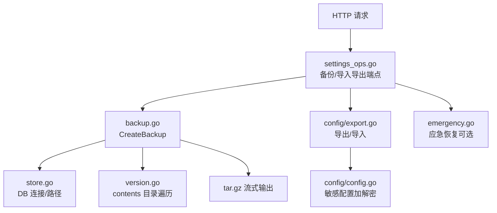
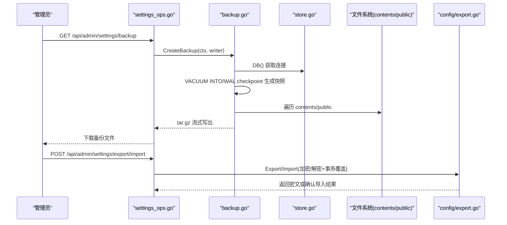
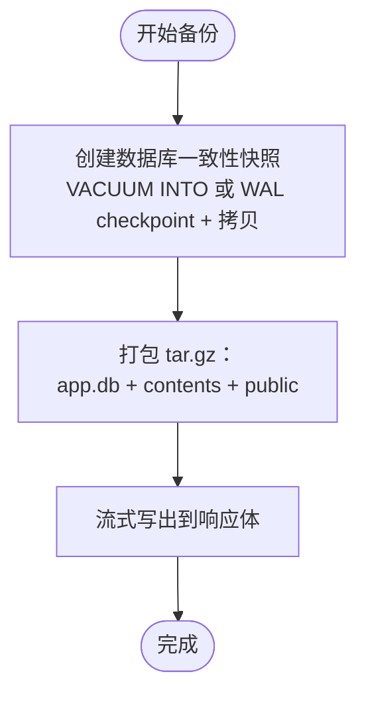
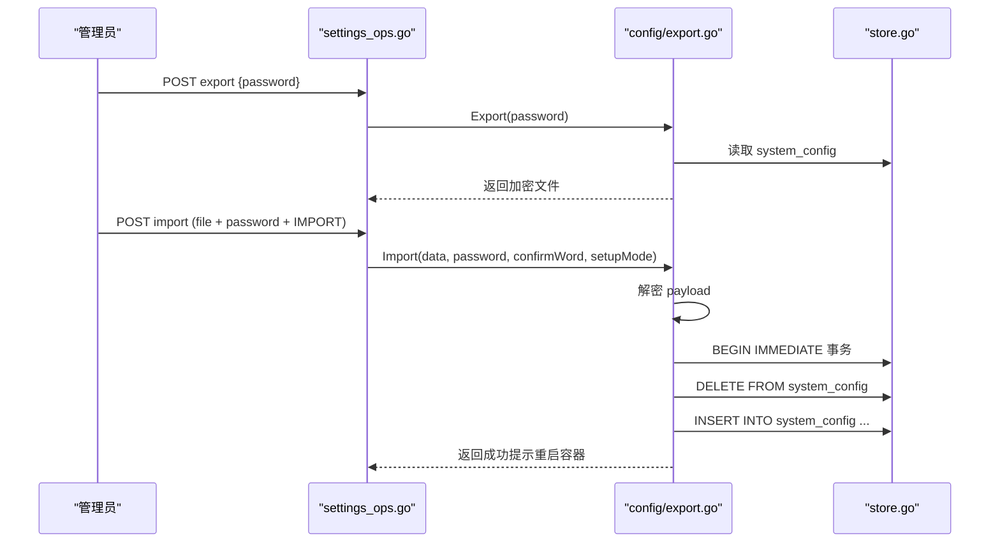
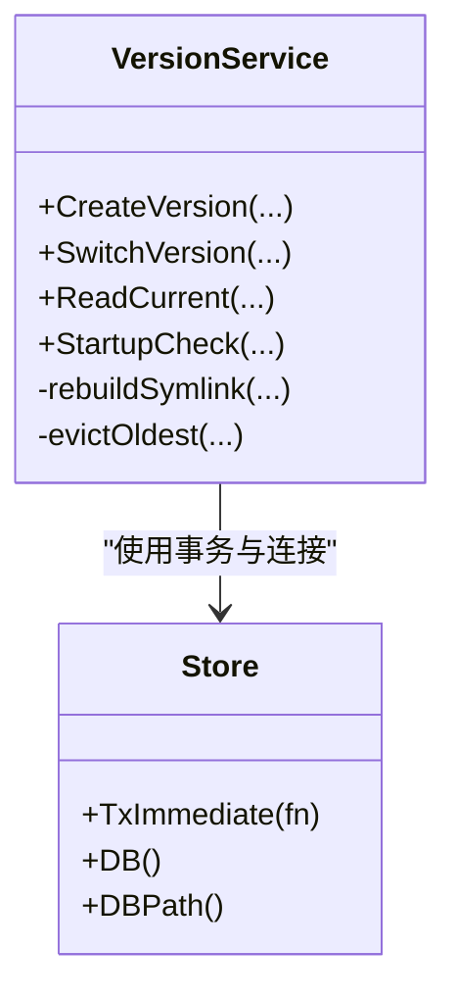
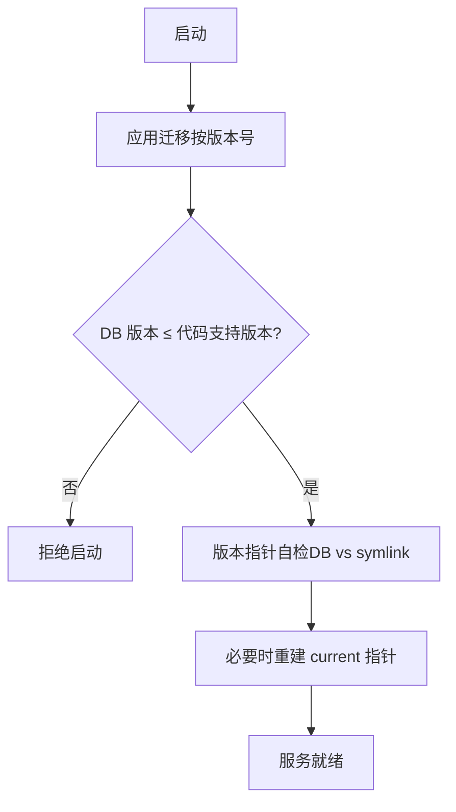
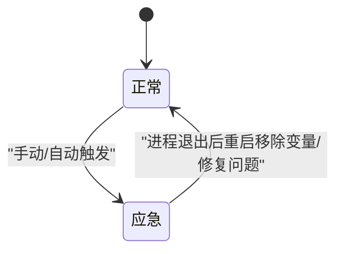
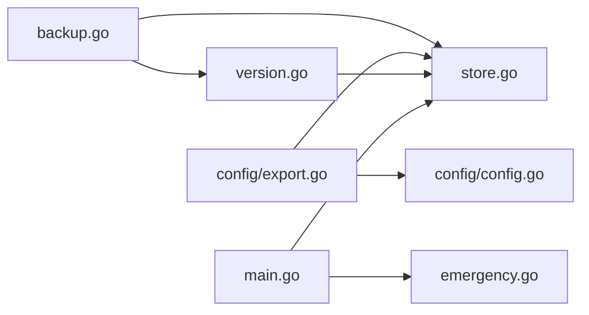

# 备份与恢复

<cite>
**本文引用的文件**
- [backend/internal/backup/backup.go](file://backend/internal/backup/backup.go)
- [backend/internal/server/settings_ops.go](file://backend/internal/server/settings_ops.go)
- [backend/internal/config/export.go](file://backend/internal/config/export.go)
- [backend/internal/config/config.go](file://backend/internal/config/config.go)
- [backend/internal/store/store.go](file://backend/internal/store/store.go)
- [backend/internal/version/version.go](file://backend/internal/version/version.go)
- [backend/cmd/server/main.go](file://backend/cmd/server/main.go)
- [backend/migrations/embed.go](file://backend/migrations/embed.go)
- [backend/internal/cron/cleanup.go](file://backend/internal/cron/cleanup.go)
- [backend/internal/emergency/emergency.go](file://backend/internal/emergency/emergency.go)
</cite>

## 目录
1. [简介](#简介)
2. [项目结构](#项目结构)
3. [核心组件](#核心组件)
4. [架构总览](#架构总览)
5. [详细组件分析](#详细组件分析)
6. [依赖关系分析](#依赖关系分析)
7. [性能考虑](#性能考虑)
8. [故障排查指南](#故障排查指南)
9. [结论](#结论)
10. [附录](#附录)

## 简介
本文件面向运维与研发，系统化阐述本项目的数据备份与恢复策略，覆盖：
- SQLite 数据库的一致性快照与备份机制
- 文件存储（版本内容、站点资源）的打包与恢复
- 配置文件的版本化导出/导入与加密保护
- 自动备份任务建议、增量备份策略、异地容灾方案
- 数据恢复流程、灾难恢复计划、一致性保证措施
- 备份文件加密存储、传输安全、访问控制等安全考量
- 备份验证、完整性检查、恢复演练等运维最佳实践

## 项目结构
本项目在后端模块中实现了完整的备份与恢复能力：
- 备份服务：对 SQLite 进行一致性快照，并将数据库快照、版本内容目录、站点资源目录打包为 tar.gz 供下载。
- 配置导出/导入：仅生产模式可用，使用 Argon2id + AES-256-GCM 加密配置文件；导入时事务内严格整体覆盖。
- 版本管理：以 DB 记录为准维护“当前”指针，符号链接仅作组织，启动自检重建。
- 迁移框架：嵌入 SQL 迁移，按版本号有序执行，拒绝回滚运行。
- 应急恢复：支持手动或自动触发应急模式，提供重置管理员密码与重新初始化能力。

图表来源
- [backend/internal/server/settings_ops.go:28-38](file://backend/internal/server/settings_ops.go#L28-L38)
- [backend/internal/backup/backup.go:31-64](file://backend/internal/backup/backup.go#L31-L64)
- [backend/internal/config/export.go:66-133](file://backend/internal/config/export.go#L66-L133)
- [backend/internal/config/config.go:220-280](file://backend/internal/config/config.go#L220-L280)
- [backend/internal/version/version.go:115-123](file://backend/internal/version/version.go#L115-L123)
- [backend/internal/emergency/emergency.go:26-34](file://backend/internal/emergency/emergency.go#L26-L34)

章节来源
- [backend/internal/server/settings_ops.go:28-38](file://backend/internal/server/settings_ops.go#L28-L38)
- [backend/internal/backup/backup.go:31-64](file://backend/internal/backup/backup.go#L31-L64)
- [backend/internal/config/export.go:66-133](file://backend/internal/config/export.go#L66-L133)
- [backend/internal/version/version.go:115-123](file://backend/internal/version/version.go#L115-L123)
- [backend/internal/emergency/emergency.go:26-34](file://backend/internal/emergency/emergency.go#L26-L34)

## 核心组件
- 备份服务（backup.Service）
  - 通过 VACUUM INTO 或 WAL checkpoint + 拷贝实现一致性快照
  - 将 app.db、contents、public 打包为 tar.gz 流式输出
- 配置导出/导入（config.ExportService）
  - 导出：收集 system_config、站点信息并加密
  - 导入：校验格式/版本，事务内严格整体覆盖，写入 ICON 文件
- 配置服务（config.Service）
  - 敏感配置键 AES-256-GCM 加解密，密钥由签名密钥经 HKDF 派生
- 存储层（store.Store）
  - 单写者模型、WAL 模式、迁移框架、BEGIN IMMEDIATE 事务
- 版本管理（version.Service）
  - 版本文件落盘、DB 记录当前版本、符号链接原子切换、启动自检重建
- 应急恢复（emergency.Service）
  - 手动/自动触发、一次性操作码、重置管理员密码、重新初始化

章节来源
- [backend/internal/backup/backup.go:31-79](file://backend/internal/backup/backup.go#L31-L79)
- [backend/internal/config/export.go:66-187](file://backend/internal/config/export.go#L66-L187)
- [backend/internal/config/config.go:220-280](file://backend/internal/config/config.go#L220-L280)
- [backend/internal/store/store.go:31-57](file://backend/internal/store/store.go#L31-L57)
- [backend/internal/version/version.go:125-180](file://backend/internal/version/version.go#L125-L180)
- [backend/internal/emergency/emergency.go:26-34](file://backend/internal/emergency/emergency.go#L26-L34)

## 架构总览
备份与恢复涉及三层：接入层（HTTP 端点）、业务层（备份/配置/版本/应急）、数据层（SQLite + 文件系统）。

图表来源
- [backend/internal/server/settings_ops.go:28-38](file://backend/internal/server/settings_ops.go#L28-L38)
- [backend/internal/backup/backup.go:31-64](file://backend/internal/backup/backup.go#L31-L64)
- [backend/internal/config/export.go:66-187](file://backend/internal/config/export.go#L66-L187)

## 详细组件分析

### 备份服务（SQLite 一致性快照 + 文件打包）
- 一致性快照
  - 首选 VACUUM INTO 生成一致快照；若驱动不支持则降级为 PRAGMA wal_checkpoint(FULL) 后拷贝主文件
  - 确保不阻断正常服务，快照临时文件位于系统临时目录
- 打包范围
  - app.db（快照）
  - contents（版本文件，含符号链接 current 指向当前版本）
  - public（站点资源/安装包）
- 流式输出
  - 使用 gzip + tar 流式写出，避免大文件内存占用

图表来源
- [backend/internal/backup/backup.go:31-79](file://backend/internal/backup/backup.go#L31-L79)

章节来源
- [backend/internal/backup/backup.go:31-79](file://backend/internal/backup/backup.go#L31-L79)

### 配置导出/导入（加密与整体覆盖）
- 导出
  - 仅生产模式可用
  - 读取 system_config、站点名称与图标，序列化为 JSON
  - 使用 Argon2id 派生密钥 + AES-256-GCM 加密，输出 salt ‖ nonce ‖ 密文
- 导入
  - 校验格式与版本（format_version 不匹配仅警告）
  - 事务内严格整体覆盖：先清空 system_config，再批量写入
  - 未配置状态导入时同事务预置默认组与平台
  - 事务提交后写入站点图标文件，更新图标 URL 与版本号

图表来源
- [backend/internal/server/settings_ops.go:56-139](file://backend/internal/server/settings_ops.go#L56-L139)
- [backend/internal/config/export.go:66-187](file://backend/internal/config/export.go#L66-L187)

章节来源
- [backend/internal/config/export.go:66-187](file://backend/internal/config/export.go#L66-L187)
- [backend/internal/server/settings_ops.go:56-139](file://backend/internal/server/settings_ops.go#L56-L139)

### 版本管理与符号链接一致性
- 版本文件存储于 dataDir/contents/{ownerType}/{ownerID}/v{n}
- 当前版本指针以 DB 记录为准，符号链接 current 仅作组织
- 切换版本时原子替换符号链接（current.tmp → current），同时更新 DB 时间戳
- 启动自检：若 DB 当前版本与符号链接不一致，则以 DB 为准重建符号链接

图表来源
- [backend/internal/version/version.go:125-180](file://backend/internal/version/version.go#L125-L180)
- [backend/internal/version/version.go:218-264](file://backend/internal/version/version.go#L218-L264)
- [backend/internal/version/version.go:438-484](file://backend/internal/version/version.go#L438-L484)
- [backend/internal/store/store.go:147-164](file://backend/internal/store/store.go#L147-L164)

章节来源
- [backend/internal/version/version.go:125-180](file://backend/internal/version/version.go#L125-L180)
- [backend/internal/version/version.go:218-264](file://backend/internal/version/version.go#L218-L264)
- [backend/internal/version/version.go:438-484](file://backend/internal/version/version.go#L438-L484)

### 迁移框架与启动自检
- 迁移文件嵌入二进制，按文件名前缀版本号升序执行
- 每条迁移与其版本记录在同一事务内写入，失败即拒绝启动
- 数据库 schema 版本高于代码支持版本时拒绝启动（禁止降级运行）
- 启动时执行版本指针自检，必要时重建符号链接

图表来源
- [backend/internal/store/store.go:62-128](file://backend/internal/store/store.go#L62-L128)
- [backend/internal/version/version.go:438-484](file://backend/internal/version/version.go#L438-L484)
- [backend/migrations/embed.go:1-8](file://backend/migrations/embed.go#L1-L8)

章节来源
- [backend/internal/store/store.go:62-128](file://backend/internal/store/store.go#L62-L128)
- [backend/migrations/embed.go:1-8](file://backend/migrations/embed.go#L1-L8)

### 应急恢复模式（灾难恢复最后手段）
- 触发条件
  - 手动：设置环境变量 RESET_ADMIN_PASSWORD
  - 自动：数据库损坏（integrity_check 失败）或关键配置损坏（configured=true 但签名密钥缺失）
- 能力分级
  - 重置管理员密码：仅手动触发且数据库可读时可用
  - 重新初始化：无论何种触发均可用（库不可读时删除文件重建空库）
- 一次性操作码
  - 每次进入应急模式生成 8 位操作码，输出至日志，提交即消耗失效

图表来源
- [backend/internal/emergency/emergency.go:26-34](file://backend/internal/emergency/emergency.go#L26-L34)
- [backend/cmd/server/main.go:40-75](file://backend/cmd/server/main.go#L40-L75)

章节来源
- [backend/internal/emergency/emergency.go:26-34](file://backend/internal/emergency/emergency.go#L26-L34)
- [backend/cmd/server/main.go:40-75](file://backend/cmd/server/main.go#L40-L75)

## 依赖关系分析
- 备份服务依赖 store 获取数据库连接与路径，依赖 version 的 contents 目录结构约定
- 配置导出/导入依赖 config 的敏感配置加解密与 system_config 表
- 版本管理依赖 store 的事务与 BEGIN IMMEDIATE 语义
- 迁移框架依赖 embed 的 SQL 文件集合
- 应急恢复依赖 main 的启动分支与 server 中间件（503 拦截）

图表来源
- [backend/internal/backup/backup.go:31-64](file://backend/internal/backup/backup.go#L31-L64)
- [backend/internal/config/export.go:66-187](file://backend/internal/config/export.go#L66-L187)
- [backend/internal/version/version.go:125-180](file://backend/internal/version/version.go#L125-L180)
- [backend/cmd/server/main.go:40-75](file://backend/cmd/server/main.go#L40-L75)

章节来源
- [backend/internal/backup/backup.go:31-64](file://backend/internal/backup/backup.go#L31-L64)
- [backend/internal/config/export.go:66-187](file://backend/internal/config/export.go#L66-L187)
- [backend/internal/version/version.go:125-180](file://backend/internal/version/version.go#L125-L180)
- [backend/cmd/server/main.go:40-75](file://backend/cmd/server/main.go#L40-L75)

## 性能考虑
- 备份过程流式压缩与写出，避免大文件内存峰值
- SQLite 单写者模型 + busy_timeout 降低并发写冲突
- 版本切换使用原子符号链接替换，减少锁竞争
- 迁移串行执行，避免并发迁移导致的不一致
- 访问日志定期清理，防止磁盘增长影响备份体积

章节来源
- [backend/internal/backup/backup.go:39-64](file://backend/internal/backup/backup.go#L39-L64)
- [backend/internal/store/store.go:31-57](file://backend/internal/store/store.go#L31-L57)
- [backend/internal/version/version.go:218-264](file://backend/internal/version/version.go#L218-L264)
- [backend/internal/store/store.go:62-128](file://backend/internal/store/store.go#L62-L128)
- [backend/internal/cron/cleanup.go:10-38](file://backend/internal/cron/cleanup.go#L10-L38)

## 故障排查指南
- 备份失败
  - 检查数据库连接与 WAL 模式是否正常
  - 查看 VACUUM INTO 是否受驱动版本限制，必要时走 WAL checkpoint 降级路径
  - 确认 contents/public 目录存在性与权限
- 配置导入失败
  - 确认导出密码正确、文件格式有效
  - 检查 format_version 兼容性（不匹配仅警告）
  - 事务失败会整体回滚，不会部分写入
- 版本指针不一致
  - 启动自检会自动重建 current 符号链接
  - 如仍异常，检查 versions 表与 contents 目录对应关系
- 应急模式
  - 从运行日志获取一次性操作码
  - 根据触发原因选择重置管理员密码或重新初始化
  - 完成后移除环境变量并重启容器

章节来源
- [backend/internal/backup/backup.go:67-79](file://backend/internal/backup/backup.go#L67-L79)
- [backend/internal/config/export.go:135-187](file://backend/internal/config/export.go#L135-L187)
- [backend/internal/version/version.go:438-484](file://backend/internal/version/version.go#L438-L484)
- [backend/internal/emergency/emergency.go:26-34](file://backend/internal/emergency/emergency.go#L26-L34)

## 结论
本项目提供了完整的数据备份与恢复能力：
- 数据库层面：基于 SQLite 的一致性快照，兼容不同驱动版本
- 文件层面：版本内容与站点资源统一打包，保留符号链接
- 配置层面：生产模式下的加密导出/导入，事务内严格整体覆盖
- 恢复层面：启动自检与应急模式双重保障，确保快速恢复
- 安全层面：敏感配置加密、导出文件强加密、访问控制与限流
- 运维层面：建议结合定时任务、增量策略与异地容灾，提升 RPO/RTO

## 附录

### 自动备份任务配置建议
- 频率：每日一次全量备份，业务低峰期执行
- 方式：调用 GET /api/admin/settings/backup 下载 tar.gz
- 存储：备份文件上传至对象存储（如 S3/OSS），保留策略按合规要求设定
- 通知：备份成功/失败通知（邮件/IM）

### 增量备份策略建议
- 基于 WAL 的增量：利用 SQLite WAL 模式，配合外部工具（如 restic/rclone）增量同步 dataDir
- 版本级增量：仅当版本文件变更时同步 contents 目录
- 配置增量：仅在 system_config 变更时触发配置导出

### 异地容灾方案
- 多地域对象存储复制（跨区域复制）
- 定期将备份文件同步至异地存储桶
- 跨域健康检查与告警

### 数据恢复流程
- 停止服务或进入应急模式
- 解压 tar.gz 至目标 dataDir
- 启动服务，迁移框架自动应用，版本指针自检重建
- 如需恢复配置，使用配置导入功能（需密码与确认词）

### 灾难恢复计划
- 触发条件：数据库损坏、关键配置丢失、误删数据
- 步骤：
  - 评估影响范围与 RTO/RPO
  - 优先恢复数据库与版本文件
  - 其次恢复配置（导入加密配置）
  - 验证服务可用性
  - 回滚策略：保留最近 N 份备份，支持回退

### 数据一致性保证措施
- SQLite WAL 模式 + busy_timeout
- 备份前一致性快照（VACUUM INTO 或 WAL checkpoint）
- 版本切换原子替换符号链接
- 迁移事务原子性，拒绝半迁移状态
- 启动自检重建符号链接

### 安全考虑
- 备份文件：tar.gz 可进一步加密（如 gpg）后再传输/存储
- 传输安全：HTTPS 强制，限制管理员访问
- 访问控制：仅管理员可调用备份/导入导出接口
- 敏感配置：AES-256-GCM 加密存储，导出文件强加密（Argon2id + AES-GCM）

### 备份验证与完整性检查
- 解压校验：解压 tar.gz 并校验 app.db 可打开
- 数据库完整性：PRAGMA integrity_check
- 版本一致性：对比 DB 当前版本与 contents 目录
- 配置一致性：导入测试环境比对 key/value

### 恢复演练
- 定期演练：每季度至少一次
- 场景：数据库损坏、配置丢失、误删数据
- 记录：RTO/RPO、问题与改进项
- 自动化：脚本化恢复流程，减少人为错误