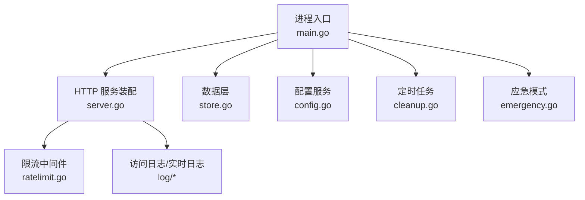
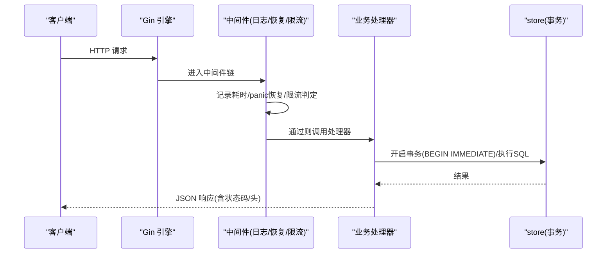
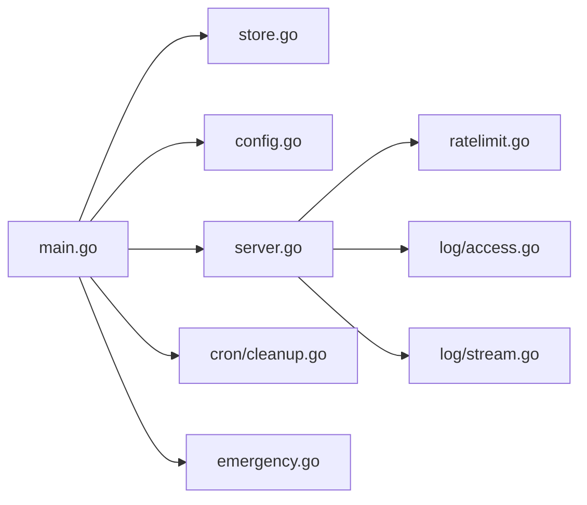

# 性能调优

<cite>
**本文引用的文件**
- [backend/cmd/server/main.go](file://backend/cmd/server/main.go)
- [backend/internal/store/store.go](file://backend/internal/store/store.go)
- [backend/internal/config/config.go](file://backend/internal/config/config.go)
- [backend/internal/ratelimit/ratelimit.go](file://backend/internal/ratelimit/ratelimit.go)
- [backend/internal/emergency/emergency.go](file://backend/internal/emergency/emergency.go)
- [backend/internal/server/server.go](file://backend/internal/server/server.go)
- [backend/internal/log/access.go](file://backend/internal/log/access.go)
- [backend/internal/log/stream.go](file://backend/internal/log/stream.go)
- [backend/internal/cron/cleanup.go](file://backend/internal/cron/cleanup.go)
- [docker-compose.yml](file://docker-compose.yml)
</cite>

## 目录
1. [简介](#简介)
2. [项目结构](#项目结构)
3. [核心组件](#核心组件)
4. [架构总览](#架构总览)
5. [详细组件分析](#详细组件分析)
6. [依赖关系分析](#依赖关系分析)
7. [性能考量与优化建议](#性能考量与优化建议)
8. [故障排查指南](#故障排查指南)
9. [结论](#结论)
10. [附录](#附录)

## 简介
本指南面向该 VPN 订阅管理系统的 Go 后端，聚焦生产可用的性能调优策略：内存管理、并发模型、数据库（SQLite）连接与事务、限流与缓存、日志与监控指标、应急模式、以及部署层面的负载均衡/CDN/静态资源优化。内容基于代码库现有实现进行提炼与扩展建议，确保可落地且与系统行为一致。

## 项目结构
- 入口与启动流程：main 负责环境变量解析、日志初始化、数据库打开与迁移、服务装配、优雅退出与应急模式分支。
- 数据层：store 封装 SQLite 打开、WAL/外键/busy_timeout、版本化迁移、BEGIN IMMEDIATE 事务。
- 配置层：config 提供 system_config 读写、敏感字段加密、运行时类型读取。
- 接入层：server 装配 Gin 引擎、中间件、路由、健康检查、静态资源、应急模式路由。
- 安全与防护：ratelimit 按 IP 固定窗口限流；emergency 提供应急恢复能力。
- 可观测性：access 访问日志、stream 实时日志流（SSE）、cron 定时清理。

图表来源
- [backend/cmd/server/main.go:24-99](file://backend/cmd/server/main.go#L24-L99)
- [backend/internal/server/server.go:63-157](file://backend/internal/server/server.go#L63-L157)
- [backend/internal/store/store.go:31-52](file://backend/internal/store/store.go#L31-L52)
- [backend/internal/config/config.go:57-111](file://backend/internal/config/config.go#L57-L111)
- [backend/internal/ratelimit/ratelimit.go:27-60](file://backend/internal/ratelimit/ratelimit.go#L27-L60)
- [backend/internal/log/access.go:16-25](file://backend/internal/log/access.go#L16-L25)
- [backend/internal/log/stream.go:16-20](file://backend/internal/log/stream.go#L16-L20)
- [backend/internal/cron/cleanup.go:10-29](file://backend/internal/cron/cleanup.go#L10-L29)
- [backend/internal/emergency/emergency.go:50-66](file://backend/internal/emergency/emergency.go#L50-L66)

章节来源
- [backend/cmd/server/main.go:24-99](file://backend/cmd/server/main.go#L24-L99)
- [backend/internal/server/server.go:63-157](file://backend/internal/server/server.go#L63-L157)

## 核心组件
- 数据库与事务：WAL + 单写者模型 + busy_timeout + BEGIN IMMEDIATE，避免并发写冲突，保证读多写少场景稳定。
- 配置与敏感信息：system_config 表存储，敏感字段 AES-256-GCM 加密，支持事务内加解密。
- 限流：按 IP 固定窗口（分钟槽），阈值从配置实时读取，超限返回 429 + Retry-After。
- 日志与监控：请求级耗时记录、访问日志分页查询与自动清理、SSE 实时日志流（环形缓冲+短期 Token+连接上限）。
- 应急模式：自动/手动触发，能力分级（重置管理员密码或重新初始化），一次性操作码防重放。

章节来源
- [backend/internal/store/store.go:31-52](file://backend/internal/store/store.go#L31-L52)
- [backend/internal/config/config.go:57-111](file://backend/internal/config/config.go#L57-L111)
- [backend/internal/ratelimit/ratelimit.go:27-60](file://backend/internal/ratelimit/ratelimit.go#L27-L60)
- [backend/internal/log/access.go:41-92](file://backend/internal/log/access.go#L41-L92)
- [backend/internal/log/stream.go:16-20](file://backend/internal/log/stream.go#L16-L20)
- [backend/internal/emergency/emergency.go:50-66](file://backend/internal/emergency/emergency.go#L50-L66)

## 架构总览
下图展示请求进入后的关键处理路径：Gin 中间件（日志/恢复/限流）→ 业务处理器 → store 事务 → 响应。应急模式下仅注册最小可用端点并拦截业务 API。

图表来源
- [backend/internal/server/server.go:211-237](file://backend/internal/server/server.go#L211-L237)
- [backend/internal/store/store.go:147-164](file://backend/internal/store/store.go#L147-L164)
- [backend/internal/ratelimit/ratelimit.go:40-60](file://backend/internal/ratelimit/ratelimit.go#L40-L60)

## 详细组件分析

### 数据库与连接池（SQLite 单写者 + WAL）
- 单写者模型：SetMaxOpenConns(1)，配合 PRAGMA busy_timeout=5000，规避并发写 busy。
- WAL 模式：提升读并发与崩溃恢复能力。
- 事务：TxImmediate 使用 BEGIN IMMEDIATE，先读后写串行化，避免竞态。
- 迁移：版本化迁移，失败拒绝启动，防止半迁移状态。

优化要点
- 保持单写者模型不变，避免引入多连接导致写冲突。
- 合理设置 busy_timeout，结合慢查询定位热点写入。
- 对高频读路径减少 JOIN 与子查询，必要时在应用层聚合。
- 定期备份与一致性快照（已内置 backup API 逻辑）。

章节来源
- [backend/internal/store/store.go:31-52](file://backend/internal/store/store.go#L31-L52)
- [backend/internal/store/store.go:147-164](file://backend/internal/store/store.go#L147-L164)
- [backend/internal/store/store.go:62-128](file://backend/internal/store/store.go#L62-L128)

### 限流与防滥用
- 维度：按 IP（受 TRUST_PROXY 影响）；粒度：每分钟槽。
- 阈值：登录/注册/找回密码/下载独立可配，修改立即生效。
- 响应：429 + Retry-After，便于客户端退避。

优化要点
- NAT/反代共享 IP 场景提高阈值或调整 TRUST_PROXY。
- 针对下载接口可结合 CDN/反向代理做二级限流。
- 监控 429 比例，评估是否需动态限流或白名单。

章节来源
- [backend/internal/ratelimit/ratelimit.go:17-60](file://backend/internal/ratelimit/ratelimit.go#L17-L60)
- [backend/internal/server/server.go:197-209](file://backend/internal/server/server.go#L197-L209)

### 配置与敏感信息
- 配置键：运行模式、日志级别、限流阈值等，支持 GetInt/GetBool/JSON 数组。
- 敏感字段：AES-256-GCM 加密落库，事务内派生密钥解密。
- 运行时切换：日志级别可热切换，限流阈值每次请求读取。

优化要点
- 将频繁读取的配置考虑应用层短缓存（注意一致性要求）。
- 导出/导入时注意签名密钥变化导致会话失效的语义。

章节来源
- [backend/internal/config/config.go:57-111](file://backend/internal/config/config.go#L57-L111)
- [backend/internal/config/config.go:220-280](file://backend/internal/config/config.go#L220-L280)
- [backend/internal/config/admin.go:489-529](file://backend/internal/config/admin.go#L489-L529)

### 日志与监控指标
- 请求日志：方法/路径/状态/耗时，统一脱敏。
- 访问日志：按日期范围分页查询，90 天自动清理。
- 实时日志流：环形缓冲（最近 500 条），SSE 推送，短期 Token 认证，全局 8 连接上限。

优化要点
- 在高吞吐下关注日志落库 I/O，必要时分离访问日志到外部存储。
- 控制 SSE 连接数与缓冲大小，避免过多长连接占用资源。
- 利用请求耗时与 429/5xx 比率识别瓶颈与异常。

章节来源
- [backend/internal/server/server.go:211-237](file://backend/internal/server/server.go#L211-L237)
- [backend/internal/log/access.go:41-92](file://backend/internal/log/access.go#L41-L92)
- [backend/internal/log/stream.go:16-20](file://backend/internal/log/stream.go#L16-L20)
- [backend/internal/cron/cleanup.go:10-29](file://backend/internal/cron/cleanup.go#L10-L29)

### 应急模式
- 触发：环境变量手动触发；数据库损坏/不可读；关键配置缺失。
- 能力分级：仅重置管理员密码（需 DB 可读）或重新初始化（全清重建）。
- 一次性操作码：生成于进程内存，提交即消耗并重新生成，防重放。

优化要点
- 应急模式仅暴露最小端点，降低攻击面。
- 重新初始化后重启进入正常 Setup，确保数据一致性。

章节来源
- [backend/internal/emergency/emergency.go:50-66](file://backend/internal/emergency/emergency.go#L50-L66)
- [backend/internal/emergency/emergency.go:91-116](file://backend/internal/emergency/emergency.go#L91-L116)
- [backend/internal/emergency/emergency.go:188-212](file://backend/internal/emergency/emergency.go#L188-L212)

## 依赖关系分析
- main 依赖 store/config/server/emergency/log/cron，形成“启动→装配→运行”的单向依赖。
- server 依赖 ratelimit/auth/setup/oidc/version/subscription/group/token/download/custom/share/rule/user/mail/approval 等服务，体现模块化装配。
- log 模块解耦为 access/stream，避免与 store 循环依赖。

图表来源
- [backend/cmd/server/main.go:12-22](file://backend/cmd/server/main.go#L12-L22)
- [backend/internal/server/server.go:4-38](file://backend/internal/server/server.go#L4-L38)

章节来源
- [backend/cmd/server/main.go:12-22](file://backend/cmd/server/main.go#L12-L22)
- [backend/internal/server/server.go:4-38](file://backend/internal/server/server.go#L4-L38)

## 性能考量与优化建议

### 内存管理
- 环形缓冲：限制为 500 条，满覆盖最旧；容量超过 4 倍缓冲大小时紧凑化，防止内存缓慢膨胀。
- 限流桶：按分钟槽清理过期键，避免无限增长。
- 短期 Token：5 分钟 TTL，未使用自动回收。

实践建议
- 监控进程 RSS/GC 频率，若持续增长，检查是否有未释放的 map/slice。
- 在高并发 SSE 场景，确认连接上限与消费速度匹配，避免堆积。

章节来源
- [backend/internal/log/stream.go:30-58](file://backend/internal/log/stream.go#L30-L58)
- [backend/internal/ratelimit/ratelimit.go:62-71](file://backend/internal/ratelimit/ratelimit.go#L62-L71)
- [backend/internal/log/stream.go:130-142](file://backend/internal/log/stream.go#L130-L142)

### 并发处理
- SQLite 单写者模型：SetMaxOpenConns(1) 避免写竞争；读并发由 WAL 受益。
- 事务串行化：BEGIN IMMEDIATE 用于“先读后写”场景，避免脏读与竞态。
- 中间件无锁快速路径：限流使用互斥锁保护计数，但临界区极小。

实践建议
- 热点写路径尽量合并为批量事务，减少事务次数。
- 对只读查询可考虑应用层缓存（如站点信息、平台模板），降低 DB 压力。

章节来源
- [backend/internal/store/store.go:31-52](file://backend/internal/store/store.go#L31-L52)
- [backend/internal/store/store.go:147-164](file://backend/internal/store/store.go#L147-L164)
- [backend/internal/ratelimit/ratelimit.go:40-60](file://backend/internal/ratelimit/ratelimit.go#L40-L60)

### 数据库查询优化
- 索引与查询：访问日志按 created_at 排序分页，注意范围查询与 LIMIT/OFFSET 的性能。
- 清理策略：90 天自动清理，避免历史数据膨胀。
- 备份：在线一致性快照，不阻断服务。

实践建议
- 对高频查询增加必要索引（如 users.username、access_logs.created_at）。
- 避免在大结果集上多次扫描，采用分页与投影列。

章节来源
- [backend/internal/log/access.go:41-92](file://backend/internal/log/access.go#L41-L92)
- [backend/internal/cron/cleanup.go:31-37](file://backend/internal/cron/cleanup.go#L31-L37)

### 限流配置
- 默认阈值：登录 10/min、注册 5/min、找回密码 5/min、下载 20/min。
- 维度：IP（受 TRUST_PROXY 影响）；窗口：分钟槽。
- 响应：429 + Retry-After。

实践建议
- NAT/反代共享 IP 场景提高阈值或改用更细粒度限流（如用户维度）。
- 结合 WAF/网关做分布式限流，应对多实例横向扩展。

章节来源
- [backend/internal/ratelimit/ratelimit.go:17-23](file://backend/internal/ratelimit/ratelimit.go#L17-L23)
- [backend/internal/ratelimit/ratelimit.go:40-60](file://backend/internal/ratelimit/ratelimit.go#L40-L60)
- [backend/internal/server/server.go:197-209](file://backend/internal/server/server.go#L197-L209)

### 缓存策略
- 静态资源：/public 可缓存供 CDN；/assets immutable；订阅/规则/分享下载禁止缓存。
- 配置缓存：部分启动时缓存（前端地址/回调地址），修改需重启生效。

实践建议
- 在反代/CDN 层设置合适的 Cache-Control/ETag，缩短首屏与图标加载时间。
- 对热点配置（如站点信息）可在应用层短缓存，注意一致性。

章节来源
- [Design1.md:349-369](file://Design1.md#L349-L369)

### 连接池调优
- SQLite 单写者：保持 SetMaxOpenConns(1)，busy_timeout 适度增大以容忍短暂阻塞。
- 事务：优先使用 TxImmediate 保证“读→判定→写”原子性。

实践建议
- 监控 busy_timeout 超时率，过高说明写竞争严重，需拆分写入或批量化。
- 避免在事务中执行长时间 I/O。

章节来源
- [backend/internal/store/store.go:31-52](file://backend/internal/store/store.go#L31-L52)
- [backend/internal/store/store.go:147-164](file://backend/internal/store/store.go#L147-L164)

### 紧急模式的使用场景与配置
- 触发条件：数据库损坏/不可读、关键配置缺失、环境变量手动触发。
- 能力分级：DB 可读时可重置管理员密码；否则仅能重新初始化。
- 一次性操作码：进程内存维护，提交即消耗并重新生成。

实践建议
- 在生产环境保留应急入口，但严格限制访问（仅应急模式暴露）。
- 重新初始化后重启进入 Setup，确保数据一致性。

章节来源
- [backend/internal/emergency/emergency.go:50-66](file://backend/internal/emergency/emergency.go#L50-L66)
- [backend/internal/emergency/emergency.go:91-116](file://backend/internal/emergency/emergency.go#L91-L116)
- [backend/internal/emergency/emergency.go:188-212](file://backend/internal/emergency/emergency.go#L188-L212)

### 负载均衡配置
- 当前为单容器单实例；如需水平扩展，需在反代层做请求分发。
- 注意会话与配置一致性：导入配置会替换签名密钥导致会话失效。

实践建议
- 使用有状态会话时，确保同一用户请求路由到同一实例，或使用外部会话存储。
- 配置中心与数据卷共享，保证多实例一致性。

章节来源
- [docker-compose.yml:1-28](file://docker-compose.yml#L1-L28)

### CDN 集成与静态资源优化
- /public 可缓存：站点 ICON、安装包等适合 CDN 缓存。
- /assets immutable：构建产物哈希化，浏览器强缓存。
- 下载接口禁止缓存：订阅/规则/分享下载需最新内容。

实践建议
- 在 CDN 层设置合理的 TTL 与缓存键（包含版本号）。
- 对大文件启用分块下载与断点续传（由反代/CDN 支持）。

章节来源
- [Design1.md:349-369](file://Design1.md#L349-L369)

### 压力测试方法与步骤
- 工具选择：wrk、vegeta、ab 等，模拟高并发登录/注册/下载。
- 指标采集：QPS、P95/P99 延迟、错误率（429/5xx）、CPU/内存/GC。
- 基线对比：不同限流阈值、日志级别、WAL 参数下的表现。

实践建议
- 逐步加压，观察拐点；关注 SQLite busy_timeout 与磁盘 I/O。
- 结合访问日志与请求日志分析热点路径。

[本节为通用指导，无需特定文件引用]

### 性能瓶颈识别
- 慢查询：通过访问日志与 SQL 执行计划定位。
- 限流热点：429 比例升高，检查 IP 分布与阈值。
- 日志开销：SSE 连接数与缓冲丢弃率。

实践建议
- 开启 debug 日志临时诊断，生产关闭以减少开销。
- 对热点接口增加埋点（耗时、命中率）。

章节来源
- [backend/internal/server/server.go:211-237](file://backend/internal/server/server.go#L211-L237)
- [backend/internal/log/stream.go:166-180](file://backend/internal/log/stream.go#L166-L180)

### 性能监控指标分析
- 请求级：方法/路径/状态/耗时。
- 访问日志：按日期范围查询，统计成功率与失败原因。
- 实时日志：SSE 推送，便于调试与对接 WAF。

实践建议
- 将日志接入集中式日志系统，建立告警规则（如 5xx 突增、429 占比）。
- 结合系统指标（CPU/内存/磁盘 I/O）综合判断瓶颈。

章节来源
- [backend/internal/server/server.go:211-237](file://backend/internal/server/server.go#L211-L237)
- [backend/internal/log/access.go:41-92](file://backend/internal/log/access.go#L41-L92)
- [backend/internal/log/stream.go:16-20](file://backend/internal/log/stream.go#L16-L20)

## 故障排查指南
- 启动失败：检查数据库打开/迁移失败分支，自动进入应急模式。
- 限流误伤：核对 TRUST_PROXY 策略与共享 IP 场景。
- 日志堆积：检查 SSE 连接上限与消费者速度。
- 应急模式：查看操作码日志，按能力分级执行重置或重新初始化。

章节来源
- [backend/cmd/server/main.go:40-59](file://backend/cmd/server/main.go#L40-L59)
- [backend/internal/server/server.go:160-193](file://backend/internal/server/server.go#L160-L193)
- [backend/internal/ratelimit/ratelimit.go:40-60](file://backend/internal/ratelimit/ratelimit.go#L40-L60)
- [backend/internal/log/stream.go:166-180](file://backend/internal/log/stream.go#L166-L180)
- [backend/internal/emergency/emergency.go:91-116](file://backend/internal/emergency/emergency.go#L91-L116)

## 结论
该系统在 SQLite 单写者+WAL 的基础上，提供了稳定的并发与一致性保障；通过灵活的限流、可观测的日志体系与完善的应急模式，满足中小规模生产场景。性能调优应围绕数据库事务、限流阈值、日志与缓存策略展开，并结合部署层的负载均衡与 CDN 优化，持续提升吞吐与稳定性。

## 附录
- 环境变量：APP_MODE、LOG_LEVEL、TRUST_PROXY、PORT、DATA_DIR、RESET_ADMIN_PASSWORD。
- 健康检查：/health 在应急模式返回 503，正常模式用于存活探测。

章节来源
- [backend/cmd/server/main.go:24-36](file://backend/cmd/server/main.go#L24-L36)
- [docker-compose.yml:12-24](file://docker-compose.yml#L12-L24)
- [backend/internal/server/server.go:160-193](file://backend/internal/server/server.go#L160-L193)