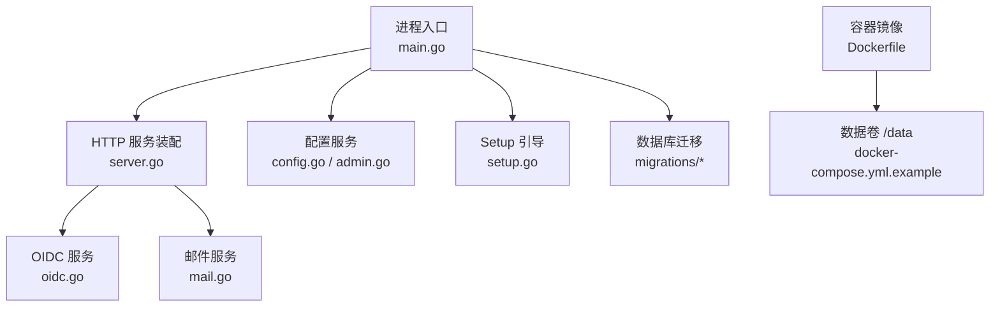
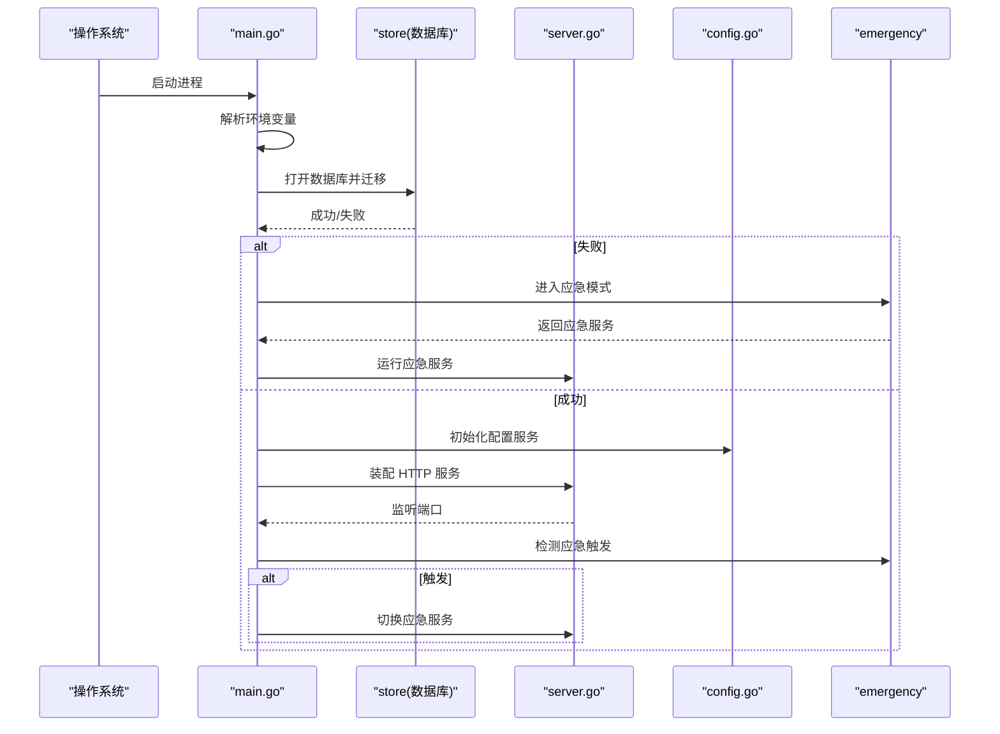
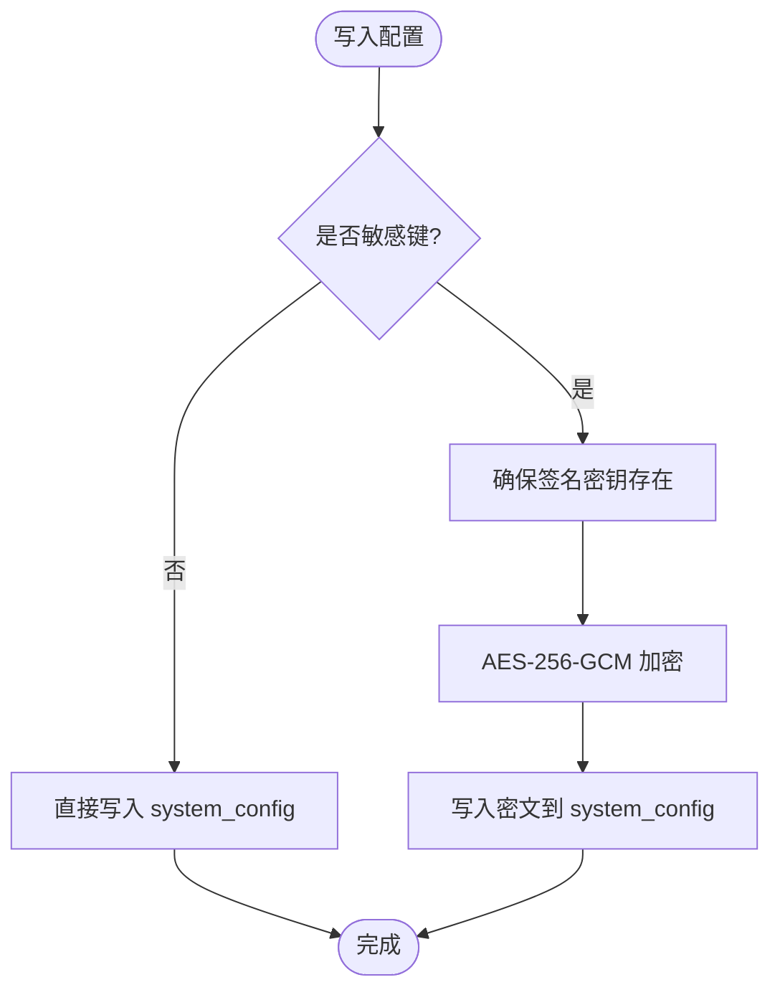
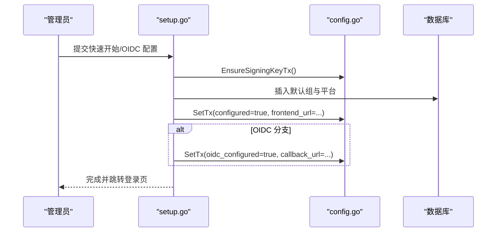
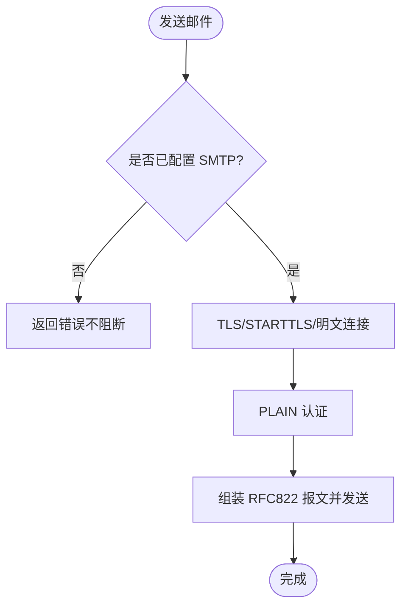
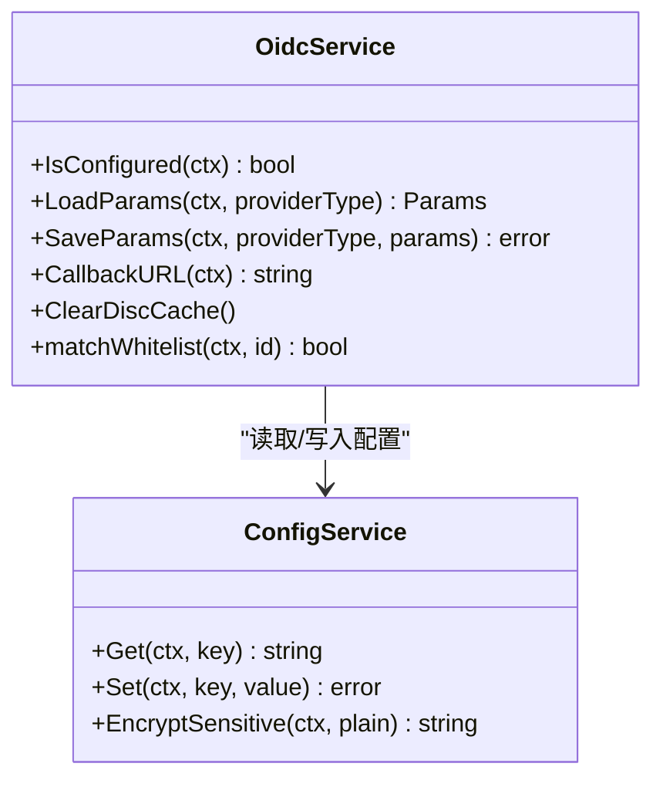
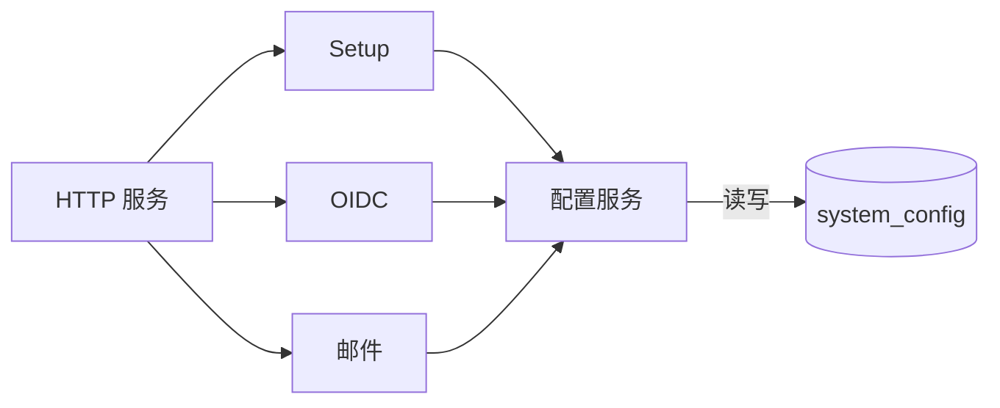

# 环境配置管理

<cite>
**本文引用的文件**
- [backend/cmd/server/main.go](file://backend/cmd/server/main.go)
- [backend/internal/config/config.go](file://backend/internal/config/config.go)
- [backend/internal/config/admin.go](file://backend/internal/config/admin.go)
- [backend/internal/setup/setup.go](file://backend/internal/setup/setup.go)
- [backend/internal/mail/mail.go](file://backend/internal/mail/mail.go)
- [backend/internal/oidc/oidc.go](file://backend/internal/oidc/oidc.go)
- [backend/internal/server/server.go](file://backend/internal/server/server.go)
- [backend/migrations/0001_init.sql](file://backend/migrations/0001_init.sql)
- [Dockerfile](file://Dockerfile)
- [docker-compose.yml.example](file://docker-compose.yml.example)
</cite>

## 目录
1. [简介](#简介)
2. [项目结构](#项目结构)
3. [核心组件](#核心组件)
4. [架构总览](#架构总览)
5. [详细组件分析](#详细组件分析)
6. [依赖关系分析](#依赖关系分析)
7. [性能与安全调优](#性能与安全调优)
8. [故障排查指南](#故障排查指南)
9. [结论](#结论)
10. [附录：环境变量与配置清单](#附录环境变量与配置清单)

## 简介
本指南面向部署与维护人员，系统化说明本系统的环境变量、运行时配置项、敏感信息保护策略以及不同环境的最佳实践。内容覆盖数据库连接、邮件服务、OIDC 认证、安全参数调优等关键配置，并提供开发、测试、生产的示例与注意事项。

## 项目结构
后端以 Go 实现，启动时读取环境变量完成日志、模式、端口、代理信任策略、数据目录等初始化；通过迁移脚本创建并维护数据库 schema；所有业务配置（含敏感字段）统一持久化在 system_config 表中，由配置服务提供读写与加解密能力。前端静态资源随二进制一起发布，容器内暴露 8080 端口，默认仅绑定回环地址，推荐由外部反代承担 TLS 与域名接入。

图表来源
- [backend/cmd/server/main.go:24-99](file://backend/cmd/server/main.go#L24-L99)
- [backend/internal/server/server.go:62-157](file://backend/internal/server/server.go#L62-L157)
- [backend/internal/config/config.go:24-46](file://backend/internal/config/config.go#L24-L46)
- [backend/internal/setup/setup.go:41-141](file://backend/internal/setup/setup.go#L41-L141)
- [backend/internal/oidc/oidc.go:23-33](file://backend/internal/oidc/oidc.go#L23-L33)
- [backend/internal/mail/mail.go:19-35](file://backend/internal/mail/mail.go#L19-L35)
- [backend/migrations/0001_init.sql:7-12](file://backend/migrations/0001_init.sql#L7-L12)
- [Dockerfile:19-30](file://Dockerfile#L19-L30)
- [docker-compose.yml.example:17-31](file://docker-compose.yml.example#L17-L31)

章节来源
- [backend/cmd/server/main.go:24-99](file://backend/cmd/server/main.go#L24-L99)
- [backend/internal/server/server.go:62-157](file://backend/internal/server/server.go#L62-L157)
- [backend/migrations/0001_init.sql:7-12](file://backend/migrations/0001_init.sql#L7-L12)
- [Dockerfile:19-30](file://Dockerfile#L19-L30)
- [docker-compose.yml.example:17-31](file://docker-compose.yml.example#L17-L31)

## 核心组件
- 配置服务：集中管理 system_config 键值对，支持布尔/整数/JSON 数组类型读取，敏感字段自动加密落库并在读取时解密。
- Setup 引导：首次部署时生成签名密钥、预置默认组与平台、推导前端地址并标记已配置。
- OIDC 服务：提供商参数独立存储、发现文档缓存、回调地址推导、白名单与审批开关。
- 邮件服务：SMTP 配置、TLS/STARTTLS、启用范围控制、模板发送。
- HTTP 服务：基于 Gin 的中间件链，限流、日志、信任代理、健康检查、应急模式。

章节来源
- [backend/internal/config/config.go:24-46](file://backend/internal/config/config.go#L24-L46)
- [backend/internal/setup/setup.go:41-141](file://backend/internal/setup/setup.go#L41-L141)
- [backend/internal/oidc/oidc.go:23-33](file://backend/internal/oidc/oidc.go#L23-L33)
- [backend/internal/mail/mail.go:19-35](file://backend/internal/mail/mail.go#L19-L35)
- [backend/internal/server/server.go:62-157](file://backend/internal/server/server.go#L62-L157)

## 架构总览
启动流程与环境变量解析：
- main 读取 APP_MODE、LOG_LEVEL、LOG_FORMAT、PORT、TRUST_PROXY、DATA_DIR、RESET_ADMIN_PASSWORD。
- 根据 APP_MODE 选择数据库文件名，打开 store 并执行迁移。
- 初始化配置服务、版本组件、HTTP 服务，注册路由与中间件。
- 检测应急触发条件（数据库损坏/关键配置损坏/手动），必要时进入应急模式。

图表来源
- [backend/cmd/server/main.go:24-99](file://backend/cmd/server/main.go#L24-L99)
- [backend/internal/server/server.go:160-193](file://backend/internal/server/server.go#L160-L193)

章节来源
- [backend/cmd/server/main.go:24-99](file://backend/cmd/server/main.go#L24-L99)

## 详细组件分析

### 配置服务与敏感信息保护
- 配置键：包括系统模式、日志级别、本地登录开关、自注册开关、管理员初始化标记、前端地址、回调地址等。
- 敏感键机制：通过 RegisterSensitive 登记后，写入时自动使用 AES-256-GCM 加密（密钥由签名密钥经 HKDF-SHA256 派生），读取时自动解密；若解密失败则报错，防止静默使用损坏数据。
- 事务内操作：提供 GetTx/SetTx/EncryptWithTx/GetSigningKeyTx 等方法，确保 Setup/OIDC Setup 等多键原子写入。
- 签名密钥：缺失时自动生成 32 字节随机值并落库；用于派生配置加密密钥。

图表来源
- [backend/internal/config/config.go:94-111](file://backend/internal/config/config.go#L94-L111)
- [backend/internal/config/config.go:220-280](file://backend/internal/config/config.go#L220-L280)
- [backend/internal/config/config.go:294-313](file://backend/internal/config/config.go#L294-L313)

章节来源
- [backend/internal/config/config.go:24-46](file://backend/internal/config/config.go#L24-L46)
- [backend/internal/config/config.go:94-111](file://backend/internal/config/config.go#L94-L111)
- [backend/internal/config/config.go:220-280](file://backend/internal/config/config.go#L220-L280)
- [backend/internal/config/config.go:294-313](file://backend/internal/config/config.go#L294-L313)

### 首次部署与 Setup
- 快速开始：生成签名密钥、预置默认组与三个默认平台、设置 configured 与 frontend_url。
- 高级配置（OIDC）：保存提供商参数（Secret 加密）、预置数据、设置 oidc_configured、configured、frontend_url、callback_url。
- 前端地址推导：优先取 X-Forwarded-Host（受 TRUST_PROXY 策略控制），否则取 Host；scheme 按 X-Forwarded-Proto 或 TLS 状态推导。

图表来源
- [backend/internal/setup/setup.go:41-141](file://backend/internal/setup/setup.go#L41-L141)
- [backend/internal/setup/setup.go:159-172](file://backend/internal/setup/setup.go#L159-L172)

章节来源
- [backend/internal/setup/setup.go:41-141](file://backend/internal/setup/setup.go#L41-L141)
- [backend/internal/setup/setup.go:159-172](file://backend/internal/setup/setup.go#L159-L172)

### 邮件服务配置
- 配置键：smtp_host、smtp_port、smtp_user、smtp_password（敏感加密）、smtp_from、smtp_tls、smtp_enabled_scopes（JSON 数组）。
- 行为：未配置或发送失败不阻断主流程；支持 TLS 直连与 STARTTLS 升级；发件人缺省取账号；头注入防护。
- 启用范围：password_reset、approval_notify、welcome，通过 JSON 数组控制。

图表来源
- [backend/internal/mail/mail.go:19-35](file://backend/internal/mail/mail.go#L19-L35)
- [backend/internal/mail/mail.go:52-139](file://backend/internal/mail/mail.go#L52-L139)

章节来源
- [backend/internal/mail/mail.go:19-35](file://backend/internal/mail/mail.go#L19-L35)
- [backend/internal/mail/mail.go:52-139](file://backend/internal/mail/mail.go#L52-L139)

### OIDC 认证配置
- 配置键：oidc_provider_type、oidc_configured、oidc_approval、oidc_whitelist；各提供商参数以 JSON 存于独立键（client_secret 单独加密）。
- 回调地址：frontend_url + "/api/auth/oidc/callback"。
- 发现文档：带缓存，Keycloak 需 Realm，Auth0 无 Realm；模拟模式无需真实提供商。
- 白名单：可配置 Role/Group Claim 路径与取值列表，任一命中即激活新用户。

图表来源
- [backend/internal/oidc/oidc.go:23-33](file://backend/internal/oidc/oidc.go#L23-L33)
- [backend/internal/oidc/oidc.go:75-155](file://backend/internal/oidc/oidc.go#L75-L155)
- [backend/internal/oidc/oidc.go:157-212](file://backend/internal/oidc/oidc.go#L157-L212)
- [backend/internal/oidc/oidc.go:214-239](file://backend/internal/oidc/oidc.go#L214-L239)
- [backend/internal/config/config.go:94-111](file://backend/internal/config/config.go#L94-L111)

章节来源
- [backend/internal/oidc/oidc.go:23-33](file://backend/internal/oidc/oidc.go#L23-L33)
- [backend/internal/oidc/oidc.go:75-155](file://backend/internal/oidc/oidc.go#L75-L155)
- [backend/internal/oidc/oidc.go:157-212](file://backend/internal/oidc/oidc.go#L157-L212)
- [backend/internal/oidc/oidc.go:214-239](file://backend/internal/oidc/oidc.go#L214-L239)

### HTTP 服务与信任代理
- 信任代理策略 TRUST_PROXY：auto/on/off，影响 X-Forwarded-* 可信性判定与前端地址推导。
- 端口 PORT：默认 8080。
- 健康检查：/health 正常模式返回可用，应急模式返回 503。
- 日志：LOG_LEVEL、LOG_FORMAT 控制输出格式与级别；面板可运行时调整日志级别。

章节来源
- [backend/internal/server/server.go:62-157](file://backend/internal/server/server.go#L62-L157)
- [backend/internal/server/server.go:160-193](file://backend/internal/server/server.go#L160-L193)
- [backend/cmd/server/main.go:24-99](file://backend/cmd/server/main.go#L24-L99)

## 依赖关系分析
- 配置服务依赖 store.Store 访问 system_config 表；敏感字段加密依赖签名密钥。
- Setup 依赖配置服务与 slug 生成器，事务内写入预置数据。
- OIDC 依赖配置服务与用户/认证服务，发现文档缓存提升性能。
- 邮件服务依赖配置服务，发送失败不阻断主流程。
- HTTP 服务装配串联上述服务，并通过中间件实现限流、日志、信任代理等。

图表来源
- [backend/internal/config/config.go:24-46](file://backend/internal/config/config.go#L24-L46)
- [backend/internal/setup/setup.go:41-141](file://backend/internal/setup/setup.go#L41-L141)
- [backend/internal/oidc/oidc.go:23-33](file://backend/internal/oidc/oidc.go#L23-L33)
- [backend/internal/mail/mail.go:19-35](file://backend/internal/mail/mail.go#L19-L35)
- [backend/internal/server/server.go:62-157](file://backend/internal/server/server.go#L62-L157)

章节来源
- [backend/internal/config/config.go:24-46](file://backend/internal/config/config.go#L24-L46)
- [backend/internal/setup/setup.go:41-141](file://backend/internal/setup/setup.go#L41-L141)
- [backend/internal/oidc/oidc.go:23-33](file://backend/internal/oidc/oidc.go#L23-L33)
- [backend/internal/mail/mail.go:19-35](file://backend/internal/mail/mail.go#L19-L35)
- [backend/internal/server/server.go:62-157](file://backend/internal/server/server.go#L62-L157)

## 性能与安全调优
- 日志级别：生产建议 info/warn；调试阶段可使用 debug。
- 信任代理：公网直连建议 off；容器化反代/内网反代建议 auto；多跳前置反代可用 on。
- 端口与网络：默认 8080，生产建议仅绑定回环并由反代处理 TLS。
- 数据目录：DATA_DIR 指向持久化卷，包含数据库与静态资源。
- 限流：登录/注册/忘记密码/下载均可配置速率限制，避免暴力破解与滥用。
- 验证码：可选 reCAPTCHA/Turnstile，注意公网可达要求。
- 调试模式：debug_mode 开启后 5xx 返回内部详情，生产默认关闭。

章节来源
- [backend/internal/config/admin.go:471-527](file://backend/internal/config/admin.go#L471-L527)
- [backend/internal/server/server.go:62-157](file://backend/internal/server/server.go#L62-L157)
- [backend/cmd/server/main.go:24-99](file://backend/cmd/server/main.go#L24-L99)

## 故障排查指南
- 数据库损坏/迁移失败：自动进入应急模式，仅开放系统状态/站点信息/应急端点/静态资源，业务 API 返回 503。
- 应急恢复：可通过 RESET_ADMIN_PASSWORD 环境变量触发一次性救援流程；完成后移除变量并重启。
- 健康检查：/health 在应急模式返回 503，用于编排层状态展示。
- 日志：实时日志流与访问日志查询，便于定位问题。

章节来源
- [backend/cmd/server/main.go:40-75](file://backend/cmd/server/main.go#L40-L75)
- [backend/internal/server/server.go:160-193](file://backend/internal/server/server.go#L160-L193)

## 结论
本系统通过统一的配置服务与敏感信息加密机制，将数据库连接、邮件服务、OIDC 认证、安全参数等关键配置集中管理，并提供完善的 Setup 引导与应急恢复能力。结合环境变量与 Docker 部署方式，可在开发、测试、生产环境中快速落地并保障安全性与可运维性。

## 附录：环境变量与配置清单

### 环境变量（启动时读取）
- APP_MODE：dev|prod，默认 prod。决定运行模式与数据库文件名。
- LOG_LEVEL：info|debug|warn|error，默认 info。
- LOG_FORMAT：console|json，默认 console。
- PORT：服务监听端口，默认 8080。
- TRUST_PROXY：auto|on|off，默认 auto。控制转发头可信性与前端地址推导。
- DATA_DIR：数据目录，默认 ./data。容器内映射为 /data。
- RESET_ADMIN_PASSWORD：设置后启动即进入应急模式，用于管理员密码救援。

章节来源
- [backend/cmd/server/main.go:24-37](file://backend/cmd/server/main.go#L24-L37)
- [backend/cmd/server/main.go:40-75](file://backend/cmd/server/main.go#L40-L75)
- [docker-compose.yml.example:19-31](file://docker-compose.yml.example#L19-L31)

### 系统配置键（system_config）
- 基础：configured、signing_key、log_level、app_mode。
- 认证：allow_local_login、allow_selfreg、selfreg_approval、admin_initialized。
- 前端与回调：frontend_url、callback_url。
- OIDC：oidc_provider_type、oidc_configured、oidc_approval、oidc_whitelist；各提供商参数键 oidc_params_{keycloak|auth0|generic|mock}。
- 验证码：captcha_provider、captcha_site_key、captcha_secret_key、captcha_pages。
- 速率限制：ratelimit_login、ratelimit_register、ratelimit_forgot、ratelimit_download。
- 站点信息：site_name、site_icon_url、site_icon_version。
- 公告与页脚：announcement、login_announcement、login_footer。
- 调试：debug_mode。

章节来源
- [backend/internal/config/config.go:24-37](file://backend/internal/config/config.go#L24-L37)
- [backend/internal/config/admin.go:31-49](file://backend/internal/config/admin.go#L31-L49)
- [backend/internal/config/admin.go:392-452](file://backend/internal/config/admin.go#L392-L452)
- [backend/internal/config/admin.go:471-527](file://backend/internal/config/admin.go#L471-L527)

### 邮件服务配置键
- smtp_host、smtp_port、smtp_user、smtp_password（敏感加密）、smtp_from、smtp_tls、smtp_enabled_scopes（JSON 数组：password_reset|approval_notify|welcome）。

章节来源
- [backend/internal/mail/mail.go:19-35](file://backend/internal/mail/mail.go#L19-L35)
- [backend/internal/mail/mail.go:52-139](file://backend/internal/mail/mail.go#L52-L139)

### 数据库与迁移
- schema_migrations：记录迁移版本。
- system_config：承载全部系统配置（含签名密钥、认证参数、开关等）。

章节来源
- [backend/migrations/0001_init.sql:1-12](file://backend/migrations/0001_init.sql#L1-L12)

### 部署环境与最佳实践
- 开发（dev）：APP_MODE=dev，数据库文件 app-dev.db；可启用模拟 OIDC；日志级别可调至 debug。
- 测试（test）：建议使用独立数据卷与数据库文件；开启必要验证码与邮件范围；TRUST_PROXY=auto（内网反代）。
- 生产（prod）：APP_MODE=prod；仅绑定回环端口；外部反代负责 TLS；TRUST_PROXY=auto 或 on（视反代拓扑）；关闭 debug_mode；合理配置限流与验证码；启用邮件通知范围。

章节来源
- [docker-compose.yml.example:5-31](file://docker-compose.yml.example#L5-L31)
- [Dockerfile:19-30](file://Dockerfile#L19-L30)
- [backend/internal/config/admin.go:471-527](file://backend/internal/config/admin.go#L471-L527)

### 敏感信息安全管理
- 加密方案：AES-256-GCM，密钥由签名密钥经 HKDF-SHA256 派生；密文 base64url(nonce||ciphertext)。
- 敏感键登记：smtp_password、OIDC Client Secret 等通过 RegisterSensitive 登记后自动加密。
- 导出导入：支持配置导出/导入（含签名密钥），导入时事务内写入，避免重复生成。
- 密钥管理建议：
  - 生产环境使用外部密钥管理服务（如 KMS）托管签名密钥，定期轮换并评估历史密文重加密策略。
  - 备份数据卷时需确保签名密钥与密文一致，否则无法解密敏感配置。
  - 禁止将明文密钥与密文一同提交至代码仓库或日志中。

章节来源
- [backend/internal/config/config.go:220-280](file://backend/internal/config/config.go#L220-L280)
- [backend/internal/config/config.go:294-313](file://backend/internal/config/config.go#L294-L313)
- [backend/internal/config/config.go:335-360](file://backend/internal/config/config.go#L335-L360)
- [backend/internal/config/admin.go:91-106](file://backend/internal/config/admin.go#L91-L106)
- [backend/internal/oidc/oidc.go:113-144](file://backend/internal/oidc/oidc.go#L113-L144)