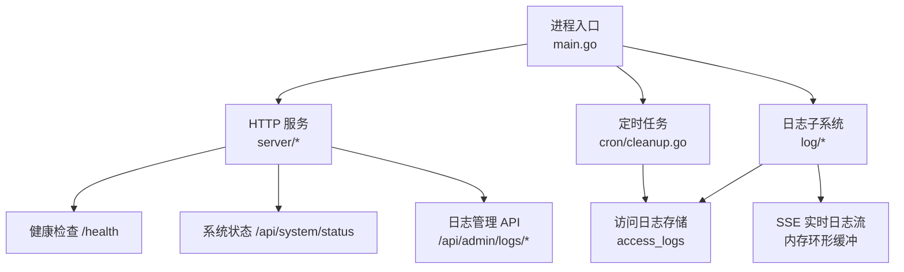
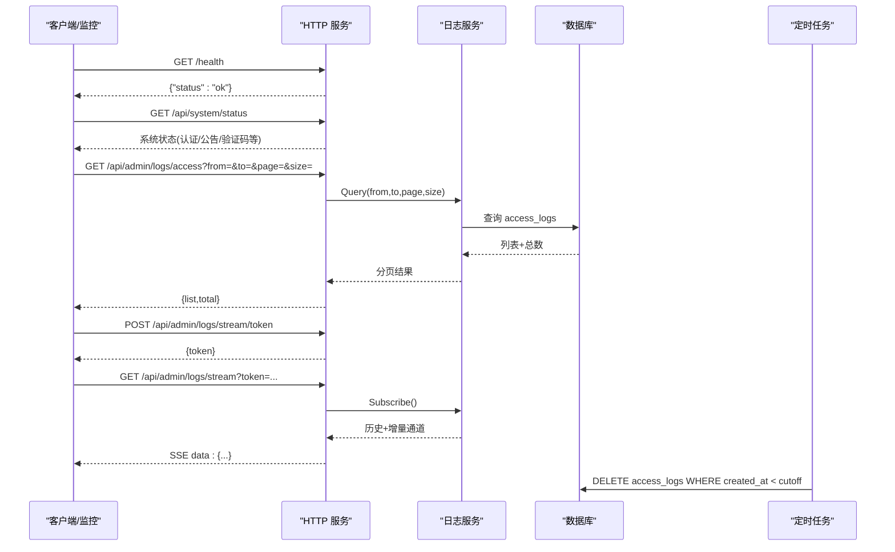
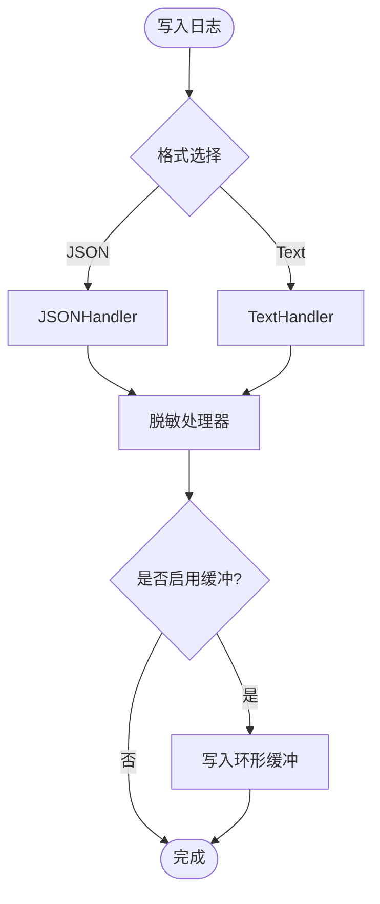
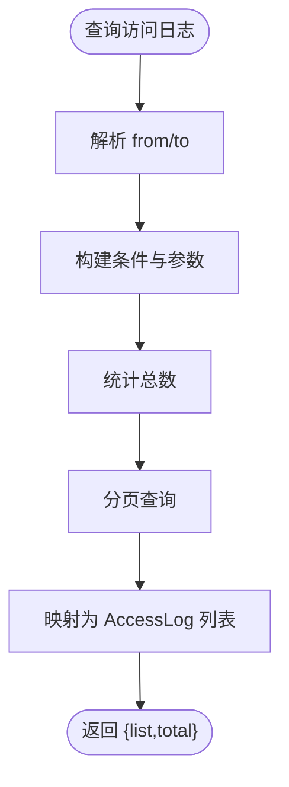
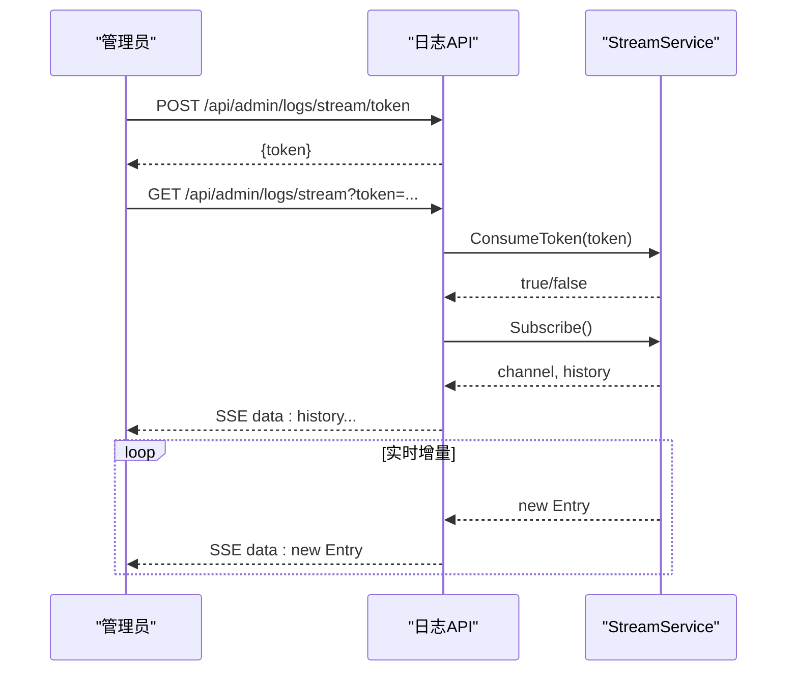
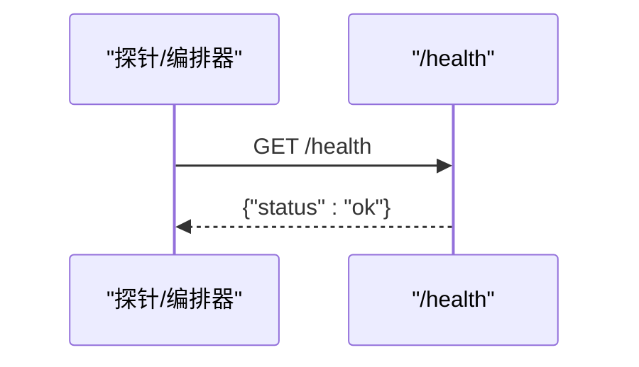
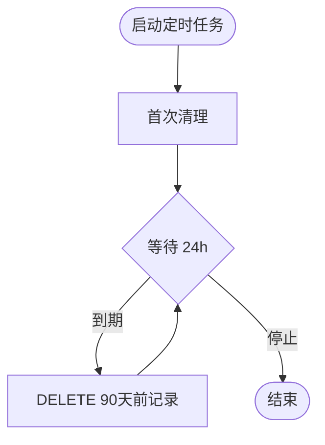
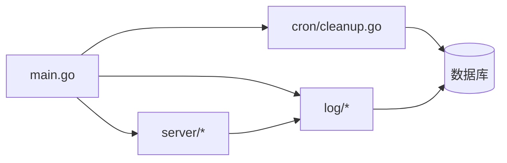

# 监控与告警

<cite>
**本文引用的文件**
- [backend/cmd/server/main.go](file://backend/cmd/server/main.go)
- [backend/internal/log/log.go](file://backend/internal/log/log.go)
- [backend/internal/log/access.go](file://backend/internal/log/access.go)
- [backend/internal/log/stream.go](file://backend/internal/log/stream.go)
- [backend/internal/server/health.go](file://backend/internal/server/health.go)
- [backend/internal/server/status.go](file://backend/internal/server/status.go)
- [backend/internal/server/log.go](file://backend/internal/server/log.go)
- [backend/internal/cron/cleanup.go](file://backend/internal/cron/cleanup.go)
- [docker-compose.yml](file://docker-compose.yml)
- [Design1.md](../../../../../docs/reports/Design/Design1.md)
</cite>

## 目录
1. [简介](#简介)
2. [项目结构](#项目结构)
3. [核心组件](#核心组件)
4. [架构总览](#架构总览)
5. [详细组件分析](#详细组件分析)
6. [依赖关系分析](#依赖关系分析)
7. [性能考量](#性能考量)
8. [故障排查指南](#故障排查指南)
9. [结论](#结论)
10. [附录](#附录)

## 简介
本指南面向运维与平台团队，提供基于当前代码库的“系统监控与告警”落地方案。内容覆盖：
- 应用日志收集（结构化日志、脱敏、运行时级别切换）
- 访问日志分析（按日期范围分页查询、清空、90 天自动清理）
- 错误日志监控（分级输出、SSE 实时流）
- 健康检查端点使用（/health）
- 性能指标与资源使用监控（Prometheus 集成建议、Grafana 仪表板建议、告警规则建议）
- 日志轮转、日志聚合、异常检测等高级监控能力
- 可视化展示与告警通知配置思路

说明：本项目未内置 Prometheus/Grafana 采集器或告警引擎，但已具备完善的日志与状态接口，便于外部可观测性栈接入。

## 项目结构
后端采用 Go + Gin 框架，模块化组织在 internal 下；启动入口负责环境变量解析、日志初始化、数据库迁移、路由装配与优雅退出。日志子系统提供结构化日志、访问日志持久化、SSE 实时日志流；服务端暴露健康检查与系统状态接口；定时任务负责访问日志定期清理。

图表来源
- [backend/cmd/server/main.go:24-99](file://backend/cmd/server/main.go#L24-L99)
- [backend/internal/server/health.go:9-16](file://backend/internal/server/health.go#L9-L16)
- [backend/internal/server/status.go:22-29](file://backend/internal/server/status.go#L22-L29)
- [backend/internal/server/log.go:21-30](file://backend/internal/server/log.go#L21-L30)
- [backend/internal/log/access.go:16-25](file://backend/internal/log/access.go#L16-L25)
- [backend/internal/log/stream.go:117-128](file://backend/internal/log/stream.go#L117-L128)
- [backend/internal/cron/cleanup.go:10-29](file://backend/internal/cron/cleanup.go#L10-L29)

章节来源
- [backend/cmd/server/main.go:24-99](file://backend/cmd/server/main.go#L24-L99)
- [docker-compose.yml:19-24](file://docker-compose.yml#L19-L24)

## 核心组件
- 结构化日志与脱敏：支持 console/JSON 双格式、运行时级别切换、token 参数脱敏、可选环形缓冲用于 SSE 推送。
- 访问日志：按日期范围分页查询、清空；90 天自动清理。
- 实时日志流：一次性短期 Token 鉴权、全局连接上限、历史+增量推送。
- 健康检查：/health 返回运行状态；应急模式可扩展为 503。
- 系统状态：公开端点返回认证、验证码、公告等系统信息。
- 定时任务：每日清理超过 90 天的访问日志。

章节来源
- [backend/internal/log/log.go:21-57](file://backend/internal/log/log.go#L21-L57)
- [backend/internal/log/access.go:41-101](file://backend/internal/log/access.go#L41-L101)
- [backend/internal/log/stream.go:16-20](file://backend/internal/log/stream.go#L16-L20)
- [backend/internal/server/health.go:9-16](file://backend/internal/server/health.go#L9-L16)
- [backend/internal/server/status.go:39-77](file://backend/internal/server/status.go#L39-L77)
- [backend/internal/cron/cleanup.go:10-37](file://backend/internal/cron/cleanup.go#L10-L37)

## 架构总览
下图展示了从请求到日志落库、SSE 推送、健康检查与系统状态的完整链路，以及定时清理任务的协作关系。

图表来源
- [backend/internal/server/health.go:11-16](file://backend/internal/server/health.go#L11-L16)
- [backend/internal/server/status.go:22-29](file://backend/internal/server/status.go#L22-L29)
- [backend/internal/server/log.go:32-61](file://backend/internal/server/log.go#L32-L61)
- [backend/internal/log/access.go:41-101](file://backend/internal/log/access.go#L41-L101)
- [backend/internal/log/stream.go:166-180](file://backend/internal/log/stream.go#L166-L180)
- [backend/internal/cron/cleanup.go:31-37](file://backend/internal/cron/cleanup.go#L31-L37)

## 详细组件分析

### 应用日志收集与脱敏
- 支持 JSON/文本两种输出格式，默认输出到 stdout，便于容器日志采集。
- 运行时日志级别可通过配置键动态切换，立即生效。
- 对消息与属性中的 token 查询参数进行脱敏，避免敏感信息泄露。
- 可选环形缓冲，将日志同时写入内存，供 SSE 实时推送。

图表来源
- [backend/internal/log/log.go:40-57](file://backend/internal/log/log.go#L40-L57)
- [backend/internal/log/log.go:62-117](file://backend/internal/log/log.go#L62-L117)
- [backend/internal/log/stream.go:41-58](file://backend/internal/log/stream.go#L41-L58)

章节来源
- [backend/internal/log/log.go:21-57](file://backend/internal/log/log.go#L21-L57)
- [backend/internal/log/log.go:62-117](file://backend/internal/log/log.go#L62-L117)
- [backend/internal/log/stream.go:41-58](file://backend/internal/log/stream.go#L41-L58)

### 访问日志分析与清理
- 支持按 from/to 日期范围查询，后端分页，默认每页 20 条，最大 100 条。
- 支持清空全部访问日志（二次确认由前端负责）。
- 定时任务每天清理 90 天前的访问日志，防止数据膨胀。

图表来源
- [backend/internal/log/access.go:41-92](file://backend/internal/log/access.go#L41-L92)

章节来源
- [backend/internal/log/access.go:41-101](file://backend/internal/log/access.go#L41-L101)
- [backend/internal/cron/cleanup.go:10-37](file://backend/internal/cron/cleanup.go#L10-L37)

### 实时日志流（SSE）
- 通过一次性短期 Token 鉴权，避免会话凭据进入代理日志。
- 连接建立后先推送历史，再推送增量；连接断开自动清理。
- 全局并发订阅上限控制，防止资源耗尽。

图表来源
- [backend/internal/server/log.go:53-103](file://backend/internal/server/log.go#L53-L103)
- [backend/internal/log/stream.go:130-180](file://backend/internal/log/stream.go#L130-L180)

章节来源
- [backend/internal/server/log.go:21-30](file://backend/internal/server/log.go#L21-L30)
- [backend/internal/server/log.go:53-103](file://backend/internal/server/log.go#L53-L103)
- [backend/internal/log/stream.go:16-20](file://backend/internal/log/stream.go#L16-L20)
- [backend/internal/log/stream.go:130-180](file://backend/internal/log/stream.go#L130-L180)

### 健康检查与系统状态
- /health 返回 200 与状态对象，可用于容器健康检查与负载均衡探测。
- /api/system/status 公开返回系统配置相关状态（如认证方式、验证码、公告等），便于前端渲染与外部探针判断。

图表来源
- [backend/internal/server/health.go:9-16](file://backend/internal/server/health.go#L9-L16)
- [docker-compose.yml:19-24](file://docker-compose.yml#L19-L24)

章节来源
- [backend/internal/server/health.go:9-16](file://backend/internal/server/health.go#L9-L16)
- [backend/internal/server/status.go:22-29](file://backend/internal/server/status.go#L22-L29)
- [docker-compose.yml:19-24](file://docker-compose.yml#L19-L24)

### 定时任务：访问日志清理
- 启动即执行一次清理，随后每 24 小时执行一次，删除 90 天前的记录。
- 失败时记录错误日志，不影响主流程。

图表来源
- [backend/internal/cron/cleanup.go:10-37](file://backend/internal/cron/cleanup.go#L10-L37)

章节来源
- [backend/internal/cron/cleanup.go:10-37](file://backend/internal/cron/cleanup.go#L10-L37)

## 依赖关系分析
- main.go 负责初始化日志、数据库、服务装配与信号处理，并启动访问日志清理任务。
- server 层注册健康检查、系统状态、日志管理等 HTTP 端点。
- log 层提供结构化日志、访问日志持久化、SSE 实时流。
- cron 层依赖数据库执行清理。

图表来源
- [backend/cmd/server/main.go:24-99](file://backend/cmd/server/main.go#L24-L99)
- [backend/internal/server/log.go:21-30](file://backend/internal/server/log.go#L21-L30)
- [backend/internal/log/access.go:16-25](file://backend/internal/log/access.go#L16-L25)
- [backend/internal/cron/cleanup.go:10-29](file://backend/internal/cron/cleanup.go#L10-L29)

章节来源
- [backend/cmd/server/main.go:24-99](file://backend/cmd/server/main.go#L24-L99)
- [backend/internal/server/log.go:21-30](file://backend/internal/server/log.go#L21-L30)
- [backend/internal/log/access.go:16-25](file://backend/internal/log/access.go#L16-L25)
- [backend/internal/cron/cleanup.go:10-29](file://backend/internal/cron/cleanup.go#L10-L29)

## 性能考量
- 日志输出采用标准库 slog，支持 JSON/文本双格式，适合容器化部署与外部日志采集。
- 环形缓冲固定容量，满后覆盖最旧条目，避免内存无限增长；消费慢则丢弃，保证日志管道不阻塞。
- SSE 连接数限制为全局上限，防止过多长连接影响服务性能。
- 访问日志查询支持分页与大小上限，避免大结果集拖垮数据库。
- 定时清理任务每日执行，降低长期存储压力。

[本节为通用性能讨论，不直接分析具体文件]

## 故障排查指南
- 健康检查失败：检查 /health 响应与容器 healthcheck 配置，确认端口与反代转发正确。
- 无法获取系统状态：核对 /api/system/status 返回字段，确认认证、验证码、公告等配置项。
- 日志级别不生效：确认配置键与运行时切换逻辑，确保日志服务已注入新级别。
- SSE 连接被拒绝：检查一次性 Token 是否有效且未过期，确认连接数未达上限。
- 访问日志未清理：查看定时任务日志，确认数据库连接与 SQL 执行成功。

章节来源
- [backend/internal/server/health.go:9-16](file://backend/internal/server/health.go#L9-L16)
- [backend/internal/server/status.go:39-77](file://backend/internal/server/status.go#L39-L77)
- [backend/internal/log/log.go:21-57](file://backend/internal/log/log.go#L21-L57)
- [backend/internal/server/log.go:63-103](file://backend/internal/server/log.go#L63-L103)
- [backend/internal/cron/cleanup.go:31-37](file://backend/internal/cron/cleanup.go#L31-L37)

## 结论
本项目提供了完善的应用日志、访问日志、SSE 实时日志与健康检查能力，可作为外部可观测性栈的基础。结合容器编排的健康检查与日志采集，即可快速搭建监控与告警体系。对于 Prometheus 指标与 Grafana 可视化，建议通过侧车或独立采集器对接 stdout 与 /health 等接口，并在现有日志基础上扩展自定义指标上报。

[本节为总结性内容，不直接分析具体文件]

## 附录

### 监控与告警落地建议（基于现有能力）
- 日志采集
  - 采集 stdout 结构化日志（JSON 模式），集中到日志平台（如 ELK/Loki）。
  - 利用 token 脱敏保障安全。
- 访问日志分析
  - 通过 /api/admin/logs/access 拉取访问日志，结合时间窗口做趋势分析。
  - 关注 fail_reason 与 status 字段定位问题。
- 实时日志流
  - 通过 /api/admin/logs/stream 订阅实时日志，用于排障与审计。
- 健康检查
  - 使用 /health 作为存活探针；编排层可据此重启或摘除实例。
- 指标与告警（建议）
  - 在业务关键路径增加自定义指标（如请求量、错误率、耗时分位），以 Prometheus 格式暴露。
  - 基于 /health 与指标设置告警规则（例如连续 N 次失败触发告警）。
  - 使用 Grafana 展示仪表盘（QPS、错误率、P95/P99 延迟、资源使用）。
- 日志轮转与聚合
  - 容器 stdout 由日志驱动负责轮转；也可配合 sidecar 聚合至统一平台。
- 异常检测
  - 基于日志关键字（如 error、panic、超时）与指标阈值组合告警。
  - 对访问日志中 fail_reason 进行聚类分析，识别异常模式。

[本节为概念性指导，不直接分析具体文件]