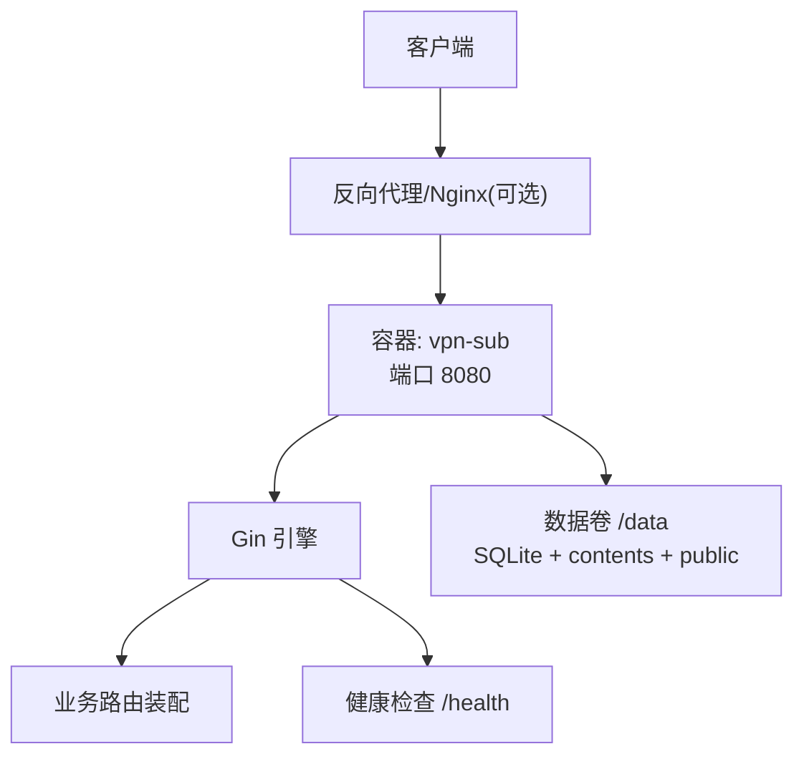
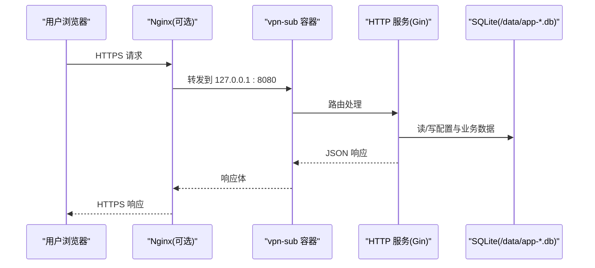
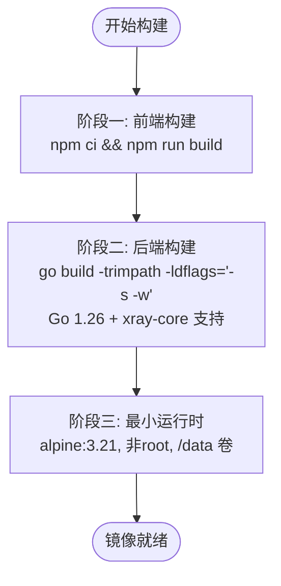
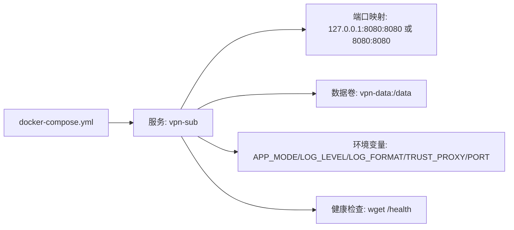
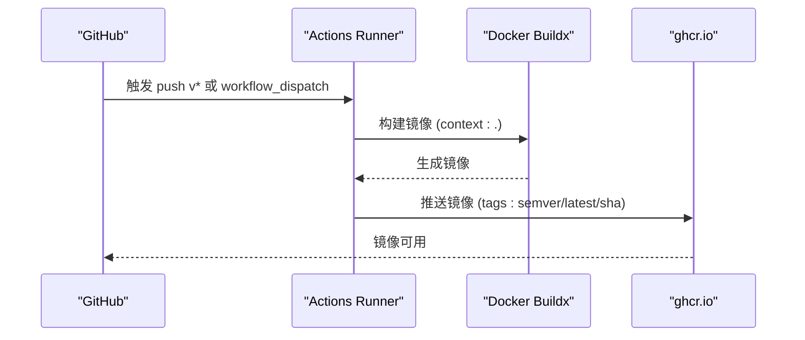
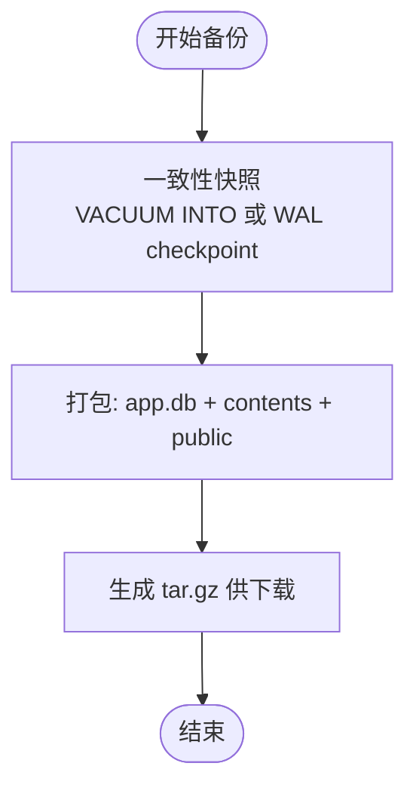
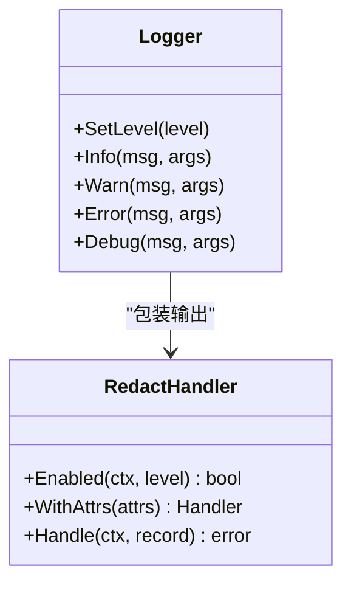
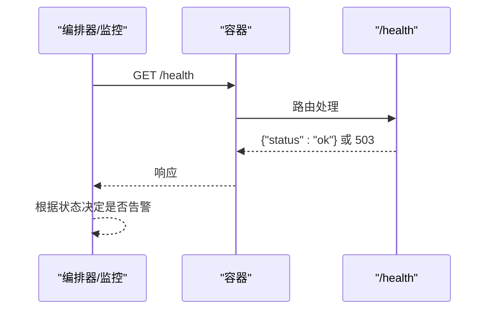
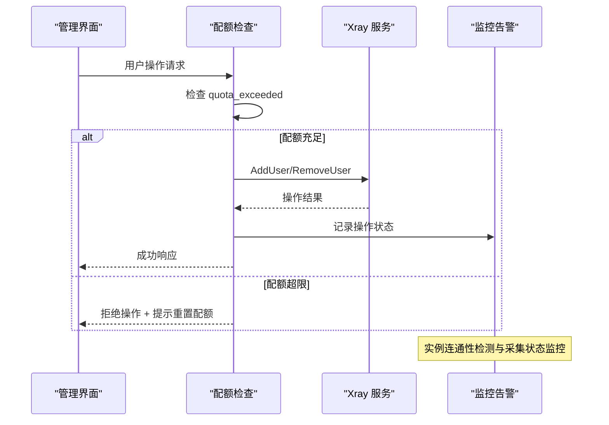
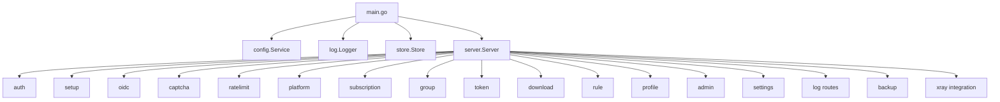

# 部署与运维

<cite>
**本文引用的文件**
- [Dockerfile](file://Dockerfile)
- [docker-compose.yml](file://docker-compose.yml)
- [docker-compose.yml.example](file://docker-compose.yml.example)
- [.github/workflows/docker-build.yml](file://.github/workflows/docker-build.yml)
- [backend/cmd/server/main.go](file://backend/cmd/server/main.go)
- [backend/internal/server/server.go](file://backend/internal/server/server.go)
- [backend/internal/server/health.go](file://backend/internal/server/health.go)
- [backend/internal/log/log.go](file://backend/internal/log/log.go)
- [backend/internal/config/config.go](file://backend/internal/config/config.go)
- [backend/internal/backup/backup.go](file://backend/internal/backup/backup.go)
- [backend/internal/ratelimit/ratelimit.go](file://backend/internal/ratelimit/ratelimit.go)
- [backend/internal/cron/cleanup.go](file://backend/internal/cron/cleanup.go)
- [backend/go.mod](file://backend/go.mod)
- [Design2.md](file://Design2.md)
- [README.md](file://README.md)
</cite>

## 更新摘要
**变更内容**
- 高级模式操作程序：关闭时执行尽力而为的 RemoveUser 清理，确保 Xray 侧账号一致性
- 公共节点配置：is_public=1 的节点对所有组自动可见，无需显式分配
- 增强监控：Xray 实例连通性检测、采集状态告警、同步状态可视化
- Go 版本升级至 1.26，支持 xray-core 模块集成
- 配额管理：用户流量配额检查、预验证机制、超限自动移除

## 目录
1. [简介](#简介)
2. [项目结构](#项目结构)
3. [核心组件](#核心组件)
4. [架构总览](#架构总览)
5. [详细组件分析](#详细组件分析)
6. [依赖关系分析](#依赖关系分析)
7. [性能考虑](#性能考虑)
8. [故障排查指南](#故障排查指南)
9. [结论](#结论)
10. [附录：配置与最佳实践](#附录配置与最佳实践)

## 简介
本指南面向生产与开发环境的容器化部署、CI/CD 流水线、环境变量与数据持久化、日志与监控告警、HTTPS 与反向代理、负载均衡、备份恢复、性能调优、安全加固等运维要点。内容基于仓库中的 Dockerfile、Compose 模板、Go 后端启动流程、健康检查、日志系统、配置服务、备份实现与 CI/CD 工作流，提供可直接落地的步骤与最佳实践。

**更新** 本项目已升级至 Go 1.26，支持 Xray-core 集成，新增高级模式操作程序（包括关闭时的尽力而为清理）、公共节点配置和增强的 Xray 实例连接监控能力。

## 项目结构
- 单镜像多阶段构建：前端静态资源在构建期嵌入 Go 二进制，运行时仅暴露单一 HTTP 服务。
- 数据持久化：通过 /data 卷承载 SQLite 数据库、版本内容与站点资源。
- 运行模式：APP_MODE=dev|prod；LOG_LEVEL/LOG_FORMAT 控制日志输出；TRUST_PROXY 控制真实 IP 解析策略；PORT 监听端口。
- 健康检查：/health 公开端点，用于编排层探测。
- 应急模式：数据库损坏或迁移失败时自动降级为最小可用能力（状态/站点信息/应急端点）。

**图表来源**
- [Dockerfile:1-31](file://Dockerfile#L1-L31)
- [docker-compose.yml:1-28](file://docker-compose.yml#L1-L28)
- [backend/internal/server/server.go:62-158](file://backend/internal/server/server.go#L62-L158)
- [backend/internal/server/health.go:9-16](file://backend/internal/server/health.go#L9-L16)

**章节来源**
- [Dockerfile:1-31](file://Dockerfile#L1-L31)
- [docker-compose.yml:1-28](file://docker-compose.yml#L1-L28)
- [README.md:65-145](file://README.md#L65-L145)

## 核心组件
- 启动入口与环境变量：读取 APP_MODE、LOG_LEVEL、LOG_FORMAT、PORT、TRUST_PROXY、DATA_DIR、RESET_ADMIN_PASSWORD，完成日志初始化、数据库迁移、服务装配与优雅退出。
- HTTP 服务装配：统一中间件链（请求日志、panic 恢复、信任代理策略），按域注册路由（认证、Setup、OIDC、平台、订阅、用户组、Token、下载、规则、个人中心、管理面板、设置、日志查看、备份导出等）。
- 健康检查：/health 返回状态，应急模式下返回 503。
- 日志系统：分级、console/json 双格式、token 脱敏、运行时切换级别并持久化。
- 配置服务：system_config 表驱动，敏感字段 AES-256-GCM 加密存储，支持事务内读写与签名密钥派生。
- 备份服务：一致性快照（VACUUM INTO 或 WAL checkpoint）+ 打包 contents/public，不阻断服务。
- 速率限制：按 IP 固定窗口计数，阈值可实时调整，超限返回 429 与 Retry-After。
- **Xray 集成**：Go 1.26 支持 xray-core 模块，提供 gRPC 管理接口，支持用户同步、流量统计、配额管理等高级功能。

**章节来源**
- [backend/cmd/server/main.go:24-99](file://backend/cmd/server/main.go#L24-L99)
- [backend/internal/server/server.go:62-158](file://backend/internal/server/server.go#L62-L158)
- [backend/internal/server/health.go:9-16](file://backend/internal/server/health.go#L9-L16)
- [backend/internal/log/log.go:21-57](file://backend/internal/log/log.go#L21-L57)
- [backend/internal/config/config.go:24-111](file://backend/internal/config/config.go#L24-L111)
- [backend/internal/backup/backup.go:30-79](file://backend/internal/backup/backup.go#L30-L79)
- [backend/internal/ratelimit/ratelimit.go:17-59](file://backend/internal/ratelimit/ratelimit.go#L17-59)

## 架构总览
应用以单容器形态运行，包含 API 与静态资源；数据全部持久化到 /data 卷。生产环境建议将容器端口绑定至回环地址，由外部 Nginx 承担 TLS 终止与域名接入；也可在内网直连暴露端口（注意明文风险）。

**图表来源**
- [docker-compose.yml.example:5-37](file://docker-compose.yml.example#L5-L37)
- [backend/internal/server/server.go:62-158](file://backend/internal/server/server.go#L62-L158)
- [backend/cmd/server/main.go:40-66](file://backend/cmd/server/main.go#L40-L66)

## 详细组件分析

### 容器化与镜像构建
- 多阶段构建：Node 构建前端产物 → Go 静态编译（CGO_ENABLED=0）→ Alpine 最小运行时。
- 非 root 运行：创建 app 用户，仅暴露 /data 卷与 8080 端口。
- 环境变量：DATA_DIR=/data；默认端口 8080。
- **Go 版本升级**：构建阶段使用 golang:1.26-alpine，支持 xray-core 模块集成。

**图表来源**
- [Dockerfile:1-31](file://Dockerfile#L1-L31)

**章节来源**
- [Dockerfile:1-31](file://Dockerfile#L1-L31)

### 运行环境与 Compose
- 开发环境：使用本地构建，开启 debug 日志，便于调试。
- 生产环境：使用预构建镜像，绑定回环地址，配合外部反代；设置 APP_MODE=prod、LOG_LEVEL=info、LOG_FORMAT=json（便于采集）。
- 数据持久化：单一数据卷 /data，包含数据库、版本内容与站点资源。
- 健康检查：wget 探测 /health，interval/timeout/retries 合理配置。

**图表来源**
- [docker-compose.yml:1-28](file://docker-compose.yml#L1-L28)
- [docker-compose.yml.example:5-37](file://docker-compose.yml.example#L5-L37)

**章节来源**
- [docker-compose.yml:1-28](file://docker-compose.yml#L1-L28)
- [docker-compose.yml.example:1-41](file://docker-compose.yml.example#L1-L41)
- [README.md:65-145](file://README.md#L65-L145)

### CI/CD 流水线（GitHub Actions）
- 触发条件：推送 v* 标签或手动触发 workflow_dispatch。
- 镜像元数据：semver tag、latest（仅默认分支）、sha。
- 认证与推送：使用 GITHUB_TOKEN 登录 ghcr.io 并推送镜像。

**图表来源**
- [.github/workflows/docker-build.yml:11-52](file://.github/workflows/docker-build.yml#L11-L52)

**章节来源**
- [.github/workflows/docker-build.yml:1-53](file://.github/workflows/docker-build.yml#L1-L53)

### 环境变量与配置
- 关键环境变量：
  - APP_MODE：dev|prod（决定数据库文件与功能差异）
  - LOG_LEVEL：debug|info|warn|error（初始值，面板可运行时切换）
  - LOG_FORMAT：console|json（接入日志采集系统推荐 json）
  - PORT：监听端口（默认 8080）
  - TRUST_PROXY：auto|on|off（真实客户端 IP 解析策略）
  - DATA_DIR：数据目录（默认 ./data，容器内 /data）
  - RESET_ADMIN_PASSWORD：应急恢复开关（一次性操作码见日志）
- 配置持久化：系统配置存储在 system_config 表，敏感字段加密存储；面板可在线修改限流、日志级别等。

**章节来源**
- [backend/cmd/server/main.go:24-41](file://backend/cmd/server/main.go#L24-L41)
- [backend/internal/config/config.go:24-111](file://backend/internal/config/config.go#L24-L111)
- [README.md:194-218](file://README.md#L194-L218)

### 数据持久化与备份恢复
- 数据位置：/data 卷包含 SQLite 数据库、contents（版本文件）、public（站点资源）。
- 备份：通过备份服务进行一致性快照（优先 VACUUM INTO，否则 WAL checkpoint 后拷贝），打包 tar.gz 供下载；不阻断正常服务。
- 恢复：将备份解包到数据卷对应路径；启动后自检以 DB 为准重建符号链接。

**图表来源**
- [backend/internal/backup/backup.go:30-79](file://backend/internal/backup/backup.go#L30-L79)

**章节来源**
- [backend/internal/backup/backup.go:1-138](file://backend/internal/backup/backup.go#L1-L138)
- [README.md:133-145](file://README.md#L133-L145)

### 日志管理与实时监控
- 日志格式：console/json；token 查询参数自动脱敏。
- 运行时切换：面板修改日志级别立即生效并持久化；同时影响实时日志流。
- 访问日志：记录方法、路径、状态码、耗时；定期清理（90 天）。
- **审计跟踪**：新增全面的审计日志记录，包括用户操作、配置变更、Xray 交互等关键事件。

**图表来源**
- [backend/internal/log/log.go:21-57](file://backend/internal/log/log.go#L21-L57)
- [backend/internal/log/log.go:62-118](file://backend/internal/log/log.go#L62-L118)

**章节来源**
- [backend/internal/log/log.go:1-118](file://backend/internal/log/log.go#L1-L118)
- [backend/cmd/server/main.go:33-38](file://backend/cmd/server/main.go#L33-L38)

### 监控与告警
- 健康检查：/health 公开端点；编排层可通过 healthcheck 探测；应急模式返回 503。
- 指标采集：建议结合 Prometheus/Grafana 对网关与容器进行基础指标采集（CPU/内存/网络/磁盘）。
- 告警策略：基于健康检查失败、错误率上升、磁盘空间不足等阈值触发告警。
- **Xray 实例监控**：新增实例连通性检测、采集状态告警、同步状态可视化展示。

**图表来源**
- [backend/internal/server/health.go:9-16](file://backend/internal/server/health.go#L9-L16)
- [docker-compose.yml:19-24](file://docker-compose.yml#L19-L24)

**章节来源**
- [backend/internal/server/health.go:1-17](file://backend/internal/server/health.go#L1-L17)
- [docker-compose.yml:19-24](file://docker-compose.yml#L19-L24)

### HTTPS 与反向代理
- 公网部署：容器端口绑定 127.0.0.1:8080，由 Nginx 承担 TLS 终止与域名接入；需设置 Host、X-Forwarded-For、X-Forwarded-Proto。
- 局域网直连：直接暴露 8080 端口（仅限可信内网，注意明文传输风险）。
- OIDC 回调：要求公网可达的 HTTPS 域名；若换域名/端口，需重启容器使前端地址与回调地址缓存生效。

**章节来源**
- [README.md:165-193](file://README.md#L165-L193)
- [docker-compose.yml.example:11-16](file://docker-compose.yml.example#L11-L16)

### 负载均衡方案
- 水平扩展：由于 SQLite 为嵌入式文件数据库，不建议多实例共享同一数据卷；如需高可用，建议使用独立数据库或分片策略。
- 会话与凭据：凭据版本递增会失效旧会话；导入配置替换签名密钥也会使会话失效。
- 流量分发：可在网关层做健康检查与权重分配；避免将同一会话路由到不同实例导致状态不一致。

### 安全加固
- 最小权限：容器以非 root 用户运行；仅暴露必要端口。
- 信任代理：TRUST_PROXY=off（直连场景）防止伪造 X-Forwarded-* 绕过限流；auto/on 适用于受控反代环境。
- 敏感配置：SMTP 密码、OIDC Client Secret 等敏感字段加密存储；面板 GET 返回脱敏值。
- 验证码：reCAPTCHA/Turnstile 可选启用，防自动化攻击。
- 速率限制：登录/注册/找回密码/下载按 IP 限流，超限返回 429 与 Retry-After。
- **配额管理**：新增用户配额检查和预验证机制，防止超额使用。

**章节来源**
- [Dockerfile:21-30](file://Dockerfile#L21-L30)
- [backend/internal/server/server.go:197-208](file://backend/internal/server/server.go#L197-L208)
- [backend/internal/config/config.go:39-111](file://backend/internal/config/config.go#L39-L111)
- [backend/internal/ratelimit/ratelimit.go:17-59](file://backend/internal/ratelimit/ratelimit.go#L17-59)

### Xray 集成与高级模式操作
- **Go 版本升级**：项目升级至 Go 1.26，支持 xray-core 模块集成。
- **gRPC 管理接口**：通过 xray-core command 包提供用户管理、流量统计等功能。
- **高级模式操作程序**：
  - **关闭时清理**：当高级模式关闭时，执行尽力而为的 RemoveUser 清理，确保 Xray 侧账号与面板状态一致
  - **公共节点配置**：is_public=1 的节点对所有组自动可见，无需显式分配，简化节点管理
  - **增强监控**：Xray 实例连通性检测、采集状态告警、同步状态可视化展示
- **配额执行机制**：实现用户流量配额检查，超限自动移除 Xray 账号。
- **预检查机制**：所有 AddUser 类操作前检查用户配额状态，超限用户阻止推送。
- **并发控制**：Xray API 调用采用串行执行，避免并发冲突。
- **错误处理增强**：改进 Xray API 调用错误处理，支持幂等操作。

**图表来源**
- [Design2.md:208-214](file://Design2.md#L208-L214)
- [Design2.md:278-286](file://Design2.md#L278-L286)
- [Design2.md:333-350](file://Design2.md#L333-L350)

**章节来源**
- [Design2.md:208-214](file://Design2.md#L208-L214)
- [Design2.md:278-286](file://Design2.md#L278-L286)
- [Design2.md:333-350](file://Design2.md#L333-L350)

## 依赖关系分析
- 启动入口依赖配置、日志、存储、用户、版本、服务器等模块。
- HTTP 服务装配依赖认证、Setup、OIDC、验证码、限流、平台、订阅、用户组、Token、下载、规则、个人中心、管理面板、设置、日志查看、备份导出等服务。
- 配置服务依赖存储与日志；备份服务依赖存储与数据目录；日志服务提供结构化输出与脱敏。
- **新增依赖**：xray-core 模块提供 gRPC 管理接口，支持用户同步和流量统计。

**图表来源**
- [backend/cmd/server/main.go:12-22](file://backend/cmd/server/main.go#L12-L22)
- [backend/internal/server/server.go:62-158](file://backend/internal/server/server.go#L62-L158)

**章节来源**
- [backend/cmd/server/main.go:12-22](file://backend/cmd/server/main.go#L12-L22)
- [backend/internal/server/server.go:62-158](file://backend/internal/server/server.go#L62-L158)

## 性能考虑
- 构建优化：CGO_ENABLED=0、-trimpath、-ldflags="-s -w" 减小镜像体积与启动开销。
- 日志级别：生产环境使用 info/warn；仅在排查问题时临时提升为 debug。
- 日志格式：接入日志采集系统时使用 json 格式，便于聚合与分析。
- 速率限制：根据 NAT/反代共享 IP 场景调整阈值，避免误伤。
- 数据卷：确保 /data 所在磁盘具备足够 IOPS 与容量；定期备份与监控。
- **Xray 并发控制**：串行执行 Xray API 调用，避免并发冲突导致的请求丢弃。
- **高级模式性能**：关闭时的尽力而为清理操作异步执行，不阻塞主流程。

## 故障排查指南
- 启动失败：检查 APP_MODE、PORT、TRUST_PROXY、DATA_DIR 是否正确；查看容器日志定位错误。
- 数据库损坏/迁移失败：自动进入应急模式，仅开放状态/站点信息/应急端点；通过面板或日志获取操作码执行救援。
- 无法登录：确认至少一种认证方式可用（本地登录或 OIDC）；如导入配置替换签名密钥，需重启容器并重新登录。
- 限流拦截：检查 TRUST_PROXY 策略与当前 IP 解析；必要时提高限流阈值。
- 备份失败：确认 SQLite 驱动支持 VACUUM INTO；否则走 WAL checkpoint 降级路径。
- **Xray 连接问题**：检查 gRPC 连接配置、IP 白名单设置；查看 Xray 服务状态和日志。
- **配额相关问题**：检查用户配额设置、流量统计是否正常；查看配额检查日志。
- **高级模式问题**：检查高级模式开关状态、Xray 实例连通性、公共节点配置是否正确。

**章节来源**
- [backend/cmd/server/main.go:40-75](file://backend/cmd/server/main.go#L40-L75)
- [backend/internal/server/server.go:160-193](file://backend/internal/server/server.go#L160-L193)
- [backend/internal/backup/backup.go:67-79](file://backend/internal/backup/backup.go#L67-L79)
- [README.md:205-218](file://README.md#L205-L218)

## 结论
本指南基于仓库实际代码与配置，提供了从容器化构建、Compose 部署、CI/CD 流水线到环境变量、数据持久化、日志与监控、HTTPS 与反向代理、备份恢复、性能与安全等方面的完整运维方案。遵循本文步骤与最佳实践，可实现稳定、安全、易维护的生产级部署。

**更新** 新增的高级模式操作程序、公共节点配置和增强的 Xray 实例监控功能，进一步提升了系统的管理能力、用户体验和运维效率。

## 附录：配置与最佳实践

### 环境变量参考
- APP_MODE：dev|prod（默认 prod）
- LOG_LEVEL：debug|info|warn|error（默认 info）
- LOG_FORMAT：console|json（默认 console）
- PORT：8080（默认）
- TRUST_PROXY：auto|on|off（默认 auto）
- DATA_DIR：./data（默认，容器内 /data）
- RESET_ADMIN_PASSWORD：应急恢复开关（按需启用）

**章节来源**
- [backend/cmd/server/main.go:24-41](file://backend/cmd/server/main.go#L24-L41)
- [README.md:194-218](file://README.md#L194-L218)

### 反向代理示例（Nginx）
- 绑定回环地址：127.0.0.1:8080
- 设置 Host、X-Forwarded-For、X-Forwarded-Proto
- 配置 SSL 证书与域名

**章节来源**
- [README.md:165-193](file://README.md#L165-L193)

### 健康检查与编排
- healthcheck 命令：wget -qO- http://127.0.0.1:8080/health
- interval/timeout/retries 合理配置，仅作状态展示

**章节来源**
- [docker-compose.yml:19-24](file://docker-compose.yml#L19-L24)
- [backend/internal/server/health.go:9-16](file://backend/internal/server/health.go#L9-L16)

### 备份与恢复
- 备份：面板"备份下载"生成 tar.gz（含数据库快照与内容文件）
- 恢复：解包到数据卷对应路径；启动后自检以 DB 为准重建

**章节来源**
- [backend/internal/backup/backup.go:30-79](file://backend/internal/backup/backup.go#L30-L79)
- [README.md:133-145](file://README.md#L133-L145)

### 安全与限流
- TRUST_PROXY=off（直连场景）防止伪造头绕过限流
- 限流阈值可按场景调整；超限返回 429 与 Retry-After
- 敏感配置加密存储；面板 GET 返回脱敏值

**章节来源**
- [backend/internal/server/server.go:197-208](file://backend/internal/server/server.go#L197-L208)
- [backend/internal/ratelimit/ratelimit.go:17-59](file://backend/internal/ratelimit/ratelimit.go#L17-59)
- [backend/internal/config/config.go:39-111](file://backend/internal/config/config.go#L39-L111)

### Xray 集成配置
- **Go 版本要求**：需要 Go 1.26 或更高版本
- **Xray 服务配置**：启用 `policy.statsUserUplink/Downlink` 以支持流量统计
- **连接安全**：通过 IP 白名单保护 gRPC 接口
- **配额管理**：配置用户配额和组默认配额
- **并发控制**：Xray API 调用采用串行执行，避免并发冲突
- **高级模式配置**：启用高级模式以解锁 Xray 实例管理、公共节点配置和增强监控功能
- **公共节点设置**：设置 is_public=1 的节点对所有组自动可见
- **监控告警**：配置 Xray 实例连通性检测和采集状态告警

**章节来源**
- [backend/go.mod:3](file://backend/go.mod#L3)
- [Design2.md:208-214](file://Design2.md#L208-L214)
- [Design2.md:333-350](file://Design2.md#L333-L350)