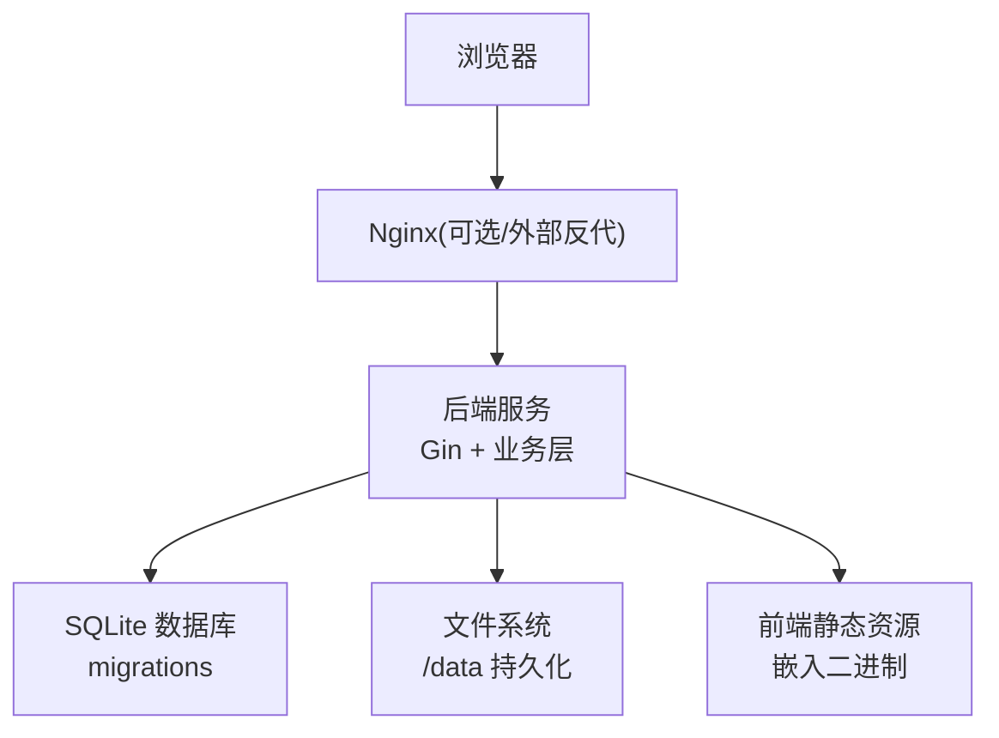
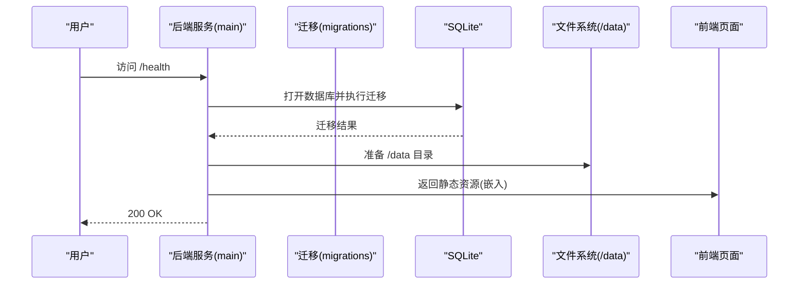
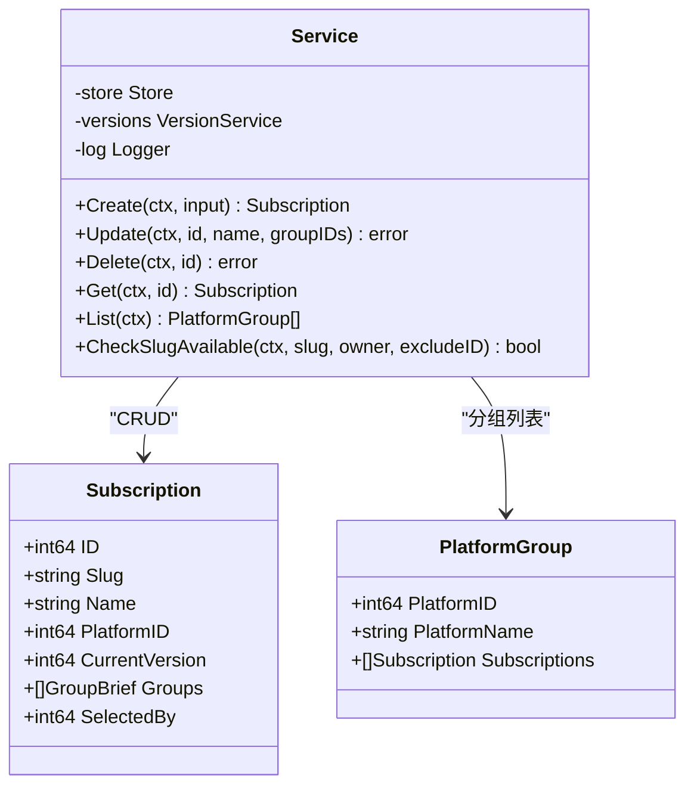
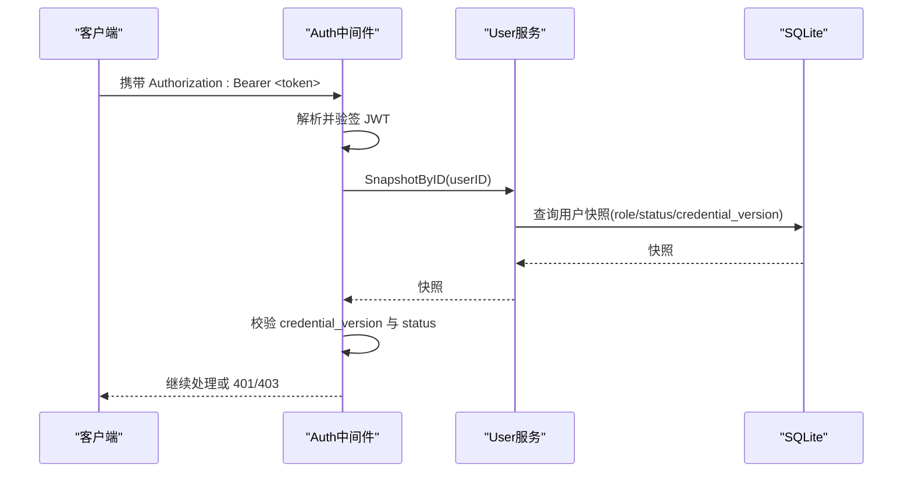
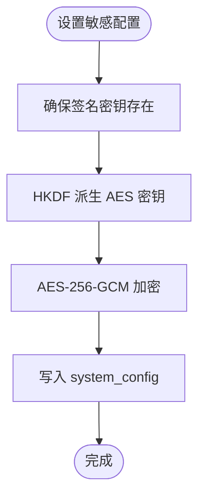
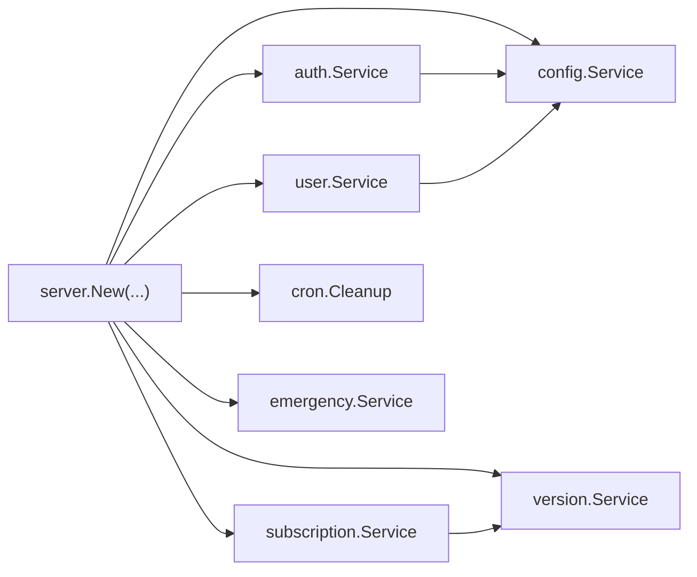

# 项目概述

<cite>
**本文引用的文件**
- [README.md](file://README.md)
- [main.go](file://backend/cmd/server/main.go)
- [Dockerfile](file://Dockerfile)
- [docker-compose.yml](file://docker-compose.yml)
- [subscription.go](file://backend/internal/subscription/subscription.go)
- [auth.go](file://backend/internal/auth/auth.go)
- [config.go](file://backend/internal/config/config.go)
- [user.go](file://backend/internal/user/user.go)
- [index.ts](file://frontend/src/router/index.ts)
- [HomeView.vue](file://frontend/src/views/HomeView.vue)
- [SubscriptionsView.vue](file://frontend/src/views/admin/SubscriptionsView.vue)
- [0001_init.sql](file://backend/migrations/0001_init.sql)
</cite>

## 目录
1. [简介](#简介)
2. [项目结构](#项目结构)
3. [核心组件](#核心组件)
4. [架构总览](#架构总览)
5. [详细组件分析](#详细组件分析)
6. [依赖关系分析](#依赖关系分析)
7. [性能与可扩展性](#性能与可扩展性)
8. [故障排查指南](#故障排查指南)
9. [结论](#结论)
10. [附录：部署与使用](#附录部署与使用)

## 简介
本项目是一个自托管、轻量、一键部署的 VPN 订阅分发面板，解决团队在 VPN 订阅管理中的痛点：管理员上传一次配置，成员即可通过“一键导入”自动完成客户端配置，长期有效的订阅链接让客户端定时拉取最新配置，无需重复登录或手动复制粘贴。系统采用 Go + Vue 3 + SQLite + Docker 技术栈，提供订阅集中管理、认证权限、面板配置中心、分享与版本管理等能力，适合家庭、公司内网或公网环境快速部署。

## 项目结构
- 后端（Go）：HTTP 服务、业务逻辑、数据库迁移、静态资源嵌入、应急模式等
- 前端（Vue 3）：用户首页、管理面板、路由守卫、API 封装
- 容器化：多阶段构建，单容器运行，数据卷持久化
- 文档与示例：README、Docker Compose 示例、工作流

图表来源
- [main.go:24-98](file://backend/cmd/server/main.go#L24-L98)
- [Dockerfile:1-31](file://Dockerfile#L1-L31)
- [0001_init.sql:1-13](file://backend/migrations/0001_init.sql#L1-L13)

章节来源
- [README.md:221-227](file://README.md#L221-L227)
- [Dockerfile:1-31](file://Dockerfile#L1-L31)
- [docker-compose.yml:1-28](file://docker-compose.yml#L1-L28)

## 核心组件
- 订阅池管理：按平台维护订阅，支持文件上传与文本编辑，保留历史版本，可回滚；支持关联用户组与选定默认订阅
- 认证与权限：本地账号与 OIDC 双认证并存；会话凭据校验、角色鉴权、访问日志
- 面板配置中心：可视化开关认证、验证码、SMTP、站点信息、速率限制、日志级别、备份下载等
- 一键导入与长期链接：成员登录后看到分配给自己的订阅，点击一键导入自动唤起客户端；复制链接长期有效，客户端定时拉取
- 分享与规则：独立分享订阅不绑定用户；分流规则公开可访问
- 应急模式：数据库损坏或关键配置异常时进入应急模式，提供状态查询与恢复入口

章节来源
- [subscription.go:28-84](file://backend/internal/subscription/subscription.go#L28-L84)
- [auth.go:22-96](file://backend/internal/auth/auth.go#L22-L96)
- [config.go:24-55](file://backend/internal/config/config.go#L24-L55)
- [HomeView.vue:53-107](file://frontend/src/views/HomeView.vue#L53-L107)
- [main.go:108-126](file://backend/cmd/server/main.go#L108-L126)

## 架构总览
系统采用前后端分离但统一容器部署的模式：前端构建产物嵌入到后端二进制中，由后端同时提供 API 与静态资源。启动流程包括环境变量解析、日志初始化、数据库迁移、服务装配、健康检查与优雅退出。

图表来源
- [main.go:24-98](file://backend/cmd/server/main.go#L24-L98)
- [Dockerfile:19-31](file://Dockerfile#L19-L31)

章节来源
- [main.go:24-98](file://backend/cmd/server/main.go#L24-L98)
- [docker-compose.yml:19-24](file://docker-compose.yml#L19-L24)

## 详细组件分析

### 订阅池与服务层
- 功能要点：创建/更新/删除订阅；跨四类资源全局唯一标识校验；按平台分组列表；关联用户组；级联删除（版本文件、Token、组关联）；首版本内容创建失败回滚
- 数据结构：Subscription、PlatformGroup、CreateInput；包含当前版本、关联组、被多少组选定计数
- 复杂度：列表查询为 O(N) 聚合；删除涉及事务与文件 IO，注意失败降级与日志记录
- 优化点：批量写入关联表、延迟删除大文件、避免频繁磁盘 IO

图表来源
- [subscription.go:28-84](file://backend/internal/subscription/subscription.go#L28-L84)
- [subscription.go:165-231](file://backend/internal/subscription/subscription.go#L165-L231)
- [subscription.go:276-332](file://backend/internal/subscription/subscription.go#L276-L332)

章节来源
- [subscription.go:28-84](file://backend/internal/subscription/subscription.go#L28-L84)
- [subscription.go:165-231](file://backend/internal/subscription/subscription.go#L165-L231)
- [subscription.go:276-332](file://backend/internal/subscription/subscription.go#L276-L332)

### 认证与会话中间件
- 功能要点：密码哈希与校验、邮箱规范化、JWT 签发与解析、会话中间件实时查库校验用户快照、管理员角色中间件
- 安全设计：凭据仅含 user_id 与 credential_version，禁止缓存角色/组；每次请求实时查库比对，确保状态变更即时生效
- 复杂度：鉴权路径 O(1) 解析 + O(1) 查库；密码强度校验固定成本

图表来源
- [auth.go:66-96](file://backend/internal/auth/auth.go#L66-L96)
- [auth.go:144-192](file://backend/internal/auth/auth.go#L144-L192)

章节来源
- [auth.go:22-96](file://backend/internal/auth/auth.go#L22-L96)
- [auth.go:144-192](file://backend/internal/auth/auth.go#L144-L192)

### 配置中心与敏感数据保护
- 功能要点：基于 system_config 键值存储；敏感配置 AES-256-GCM 加密落库；HKDF 派生密钥；事务内读写；布尔/整数/JSON 数组类型化读取
- 安全设计：签名密钥缺失时拒绝签发；密文无法解密直接报错，防止静默使用损坏数据
- 复杂度：加解密固定成本；配置读取 O(1)

图表来源
- [config.go:220-280](file://backend/internal/config/config.go#L220-L280)
- [config.go:294-361](file://backend/internal/config/config.go#L294-L361)

章节来源
- [config.go:24-55](file://backend/internal/config/config.go#L24-L55)
- [config.go:220-280](file://backend/internal/config/config.go#L220-L280)
- [config.go:294-361](file://backend/internal/config/config.go#L294-L361)

### 用户注册与首管理员机制
- 功能要点：邮箱唯一预查、空表判定、首管理员免审批激活、自动加入默认组、同事务原子写入、欢迎邮件发送（可选）
- 复杂度：注册路径 O(1) 写库；并发下通过 IMMEDIATE 事务串行化避免冲突
- 边界：待审批用户不可登录；非 active 状态统一提示

章节来源
- [user.go:82-154](file://backend/internal/user/user.go#L82-L154)
- [user.go:170-214](file://backend/internal/user/user.go#L170-L214)

### 前端路由与守卫
- 功能要点：公开页、用户端与管理端路由；紧急模式强制跳转；未配置引导 Setup；登录态与管理员角色双重校验
- 体验：顶部进度条、懒加载、错误兜底不阻断

章节来源
- [index.ts:1-72](file://frontend/src/router/index.ts#L1-L72)
- [index.ts:96-129](file://frontend/src/router/index.ts#L96-L129)

### 用户首页与一键导入
- 功能要点：平台卡片网格、公告展示、一键导入（唤起客户端）、复制链接、刷新 Token、下载客户端
- 交互：绑定类 Token 复制时警示勿分享；未分配时隐藏操作按钮

章节来源
- [HomeView.vue:27-107](file://frontend/src/views/HomeView.vue#L27-L107)
- [HomeView.vue:114-200](file://frontend/src/views/HomeView.vue#L114-L200)

### 订阅管理界面
- 功能要点：按平台分组展示、新建/编辑/删除、关联用户组、版本管理入口、创建成功引导
- 交互：TriStateList 空态提示、Collapse 展开控制、Tag 显示版本与组

章节来源
- [SubscriptionsView.vue:18-92](file://frontend/src/views/admin/SubscriptionsView.vue#L18-L92)
- [SubscriptionsView.vue:116-188](file://frontend/src/views/admin/SubscriptionsView.vue#L116-L188)

## 依赖关系分析
- 后端模块耦合：server 装配各业务服务（auth、user、subscription、config、version、cron、emergency），通过接口注入回调避免循环依赖
- 数据层：store 提供事务与连接管理；migrations 保证幂等升级
- 前端模块：router 依赖 stores（auth、system）与 api 封装；视图调用对应 API 模块

图表来源
- [main.go:77-91](file://backend/cmd/server/main.go#L77-L91)
- [subscription.go:28-41](file://backend/internal/subscription/subscription.go#L28-L41)
- [auth.go:87-96](file://backend/internal/auth/auth.go#L87-L96)
- [user.go:25-36](file://backend/internal/user/user.go#L25-L36)

章节来源
- [main.go:77-91](file://backend/cmd/server/main.go#L77-L91)

## 性能与可扩展性
- 数据库：SQLite 嵌入式存储，零 CGO 驱动，适合单机与轻量场景；通过事务与索引优化常见查询
- 文件 IO：版本文件与下载 Token 的删除在事务后异步进行，失败记日志不阻断主流程
- 并发：注册与关键写入使用 IMMEDIATE 事务串行化，避免竞态条件
- 扩展建议：如需横向扩展，可将 SQLite 替换为 PostgreSQL/MySQL，并引入缓存层（如 Redis）减少热点读压力

[本节为通用指导，不直接分析具体文件]

## 故障排查指南
- 应急模式：数据库损坏或迁移失败时自动进入应急模式，仅暴露状态与恢复端点；可通过环境变量 RESET_ADMIN_PASSWORD 触发管理员密码救援
- 健康检查：docker-compose healthcheck 探测 /health，用于编排与健康展示
- 日志：支持 console/json 格式，环形缓冲最近 500 条，便于问题定位
- 常见问题：成员看不到订阅需确认组分配；客户端导入后不更新需检查客户端策略；迁移服务器需导出加密配置文件并在新环境导入

章节来源
- [main.go:40-75](file://backend/cmd/server/main.go#L40-L75)
- [main.go:108-126](file://backend/cmd/server/main.go#L108-L126)
- [docker-compose.yml:19-24](file://docker-compose.yml#L19-L24)
- [README.md:165-218](file://README.md#L165-L218)

## 结论
本系统以“订阅集中管理 + 一键导入”为核心，结合认证权限与面板配置中心，显著降低 VPN 订阅分发与维护成本。通过 Go + Vue 3 + SQLite + Docker 的技术组合，实现单容器部署、数据持久化与高可用运维。目标用户涵盖家庭网络、中小企业团队与需要快速搭建订阅分发的个人用户。

[本节为总结性内容，不直接分析具体文件]

## 附录：部署与使用
- 一键部署：使用 docker-compose 拉起服务，端口映射与数据卷挂载；首次访问进入 Setup 引导
- 日常使用：管理员上传订阅并分配组；成员登录后一键导入或复制链接
- 备份与升级：面板内下载备份；升级镜像不影响数据
- 高级运维：公网 HTTPS 接入、环境变量配置、应急恢复、数据存储位置说明

章节来源
- [README.md:65-145](file://README.md#L65-L145)
- [README.md:165-218](file://README.md#L165-L218)
- [docker-compose.yml:1-28](file://docker-compose.yml#L1-L28)