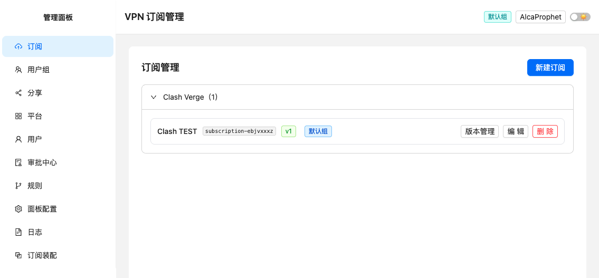
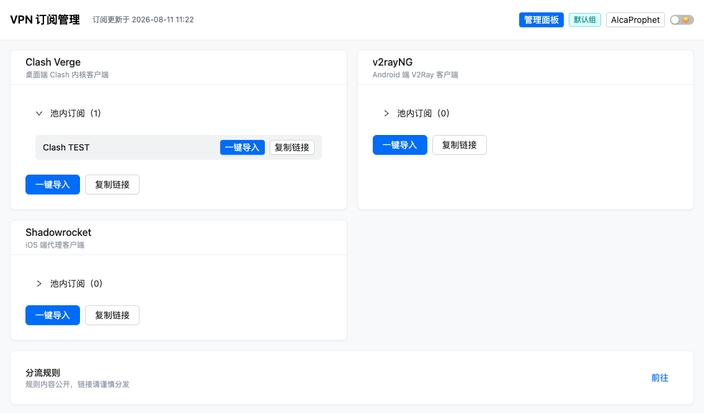
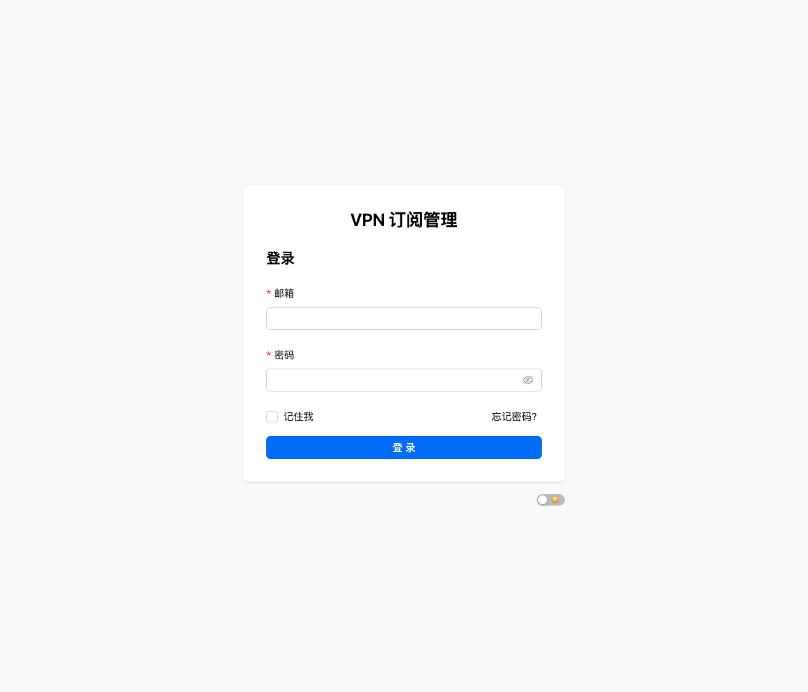
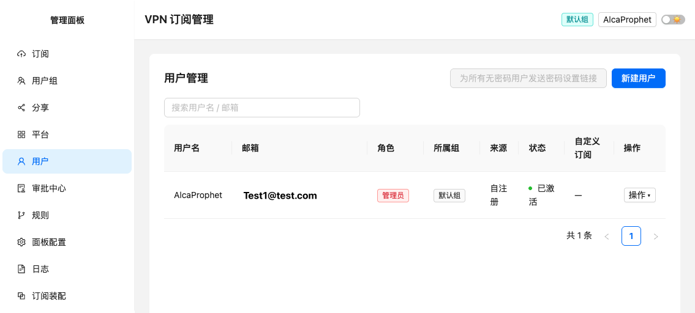
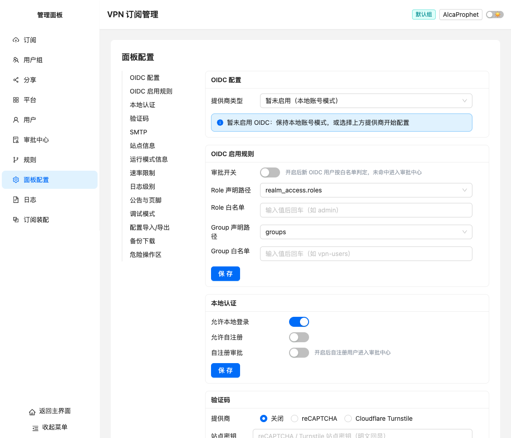
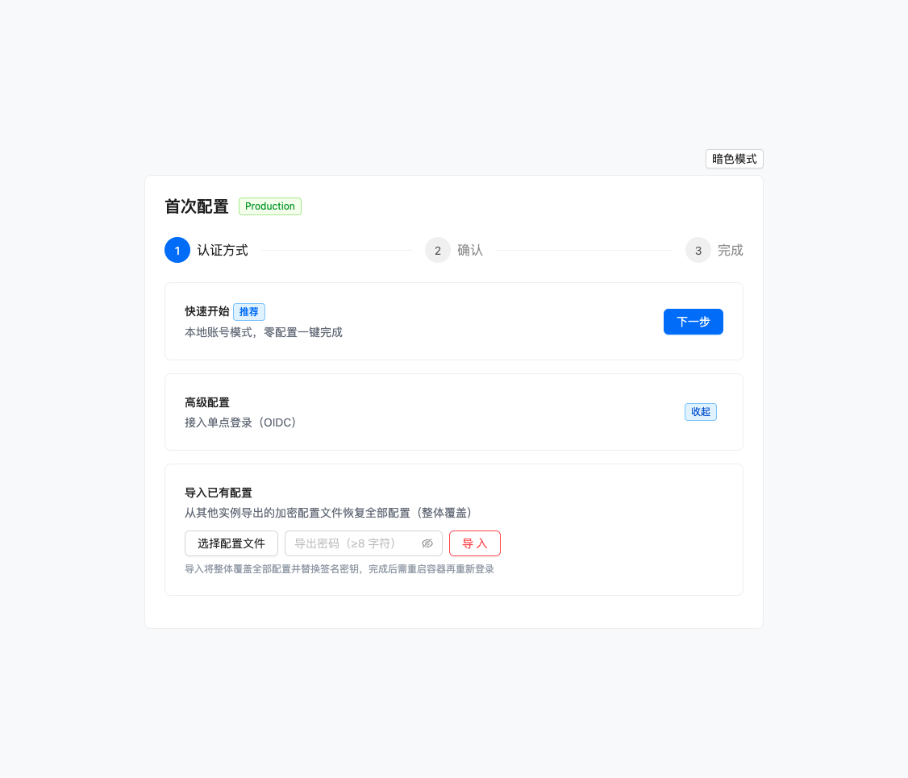
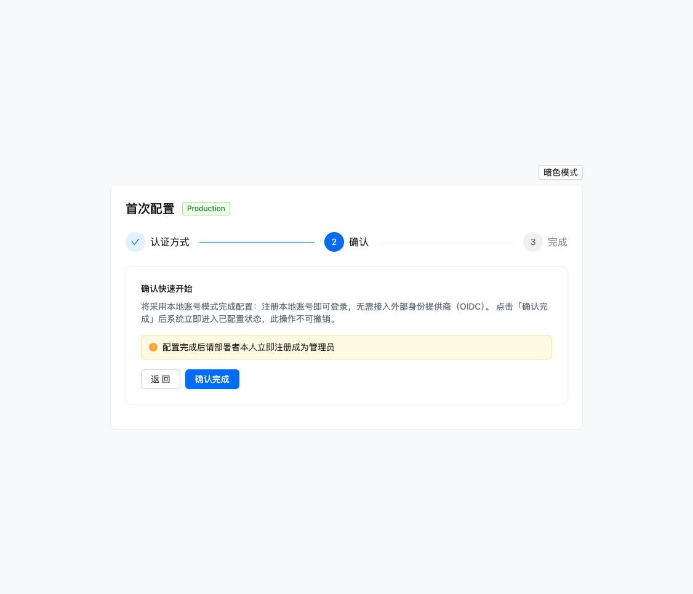
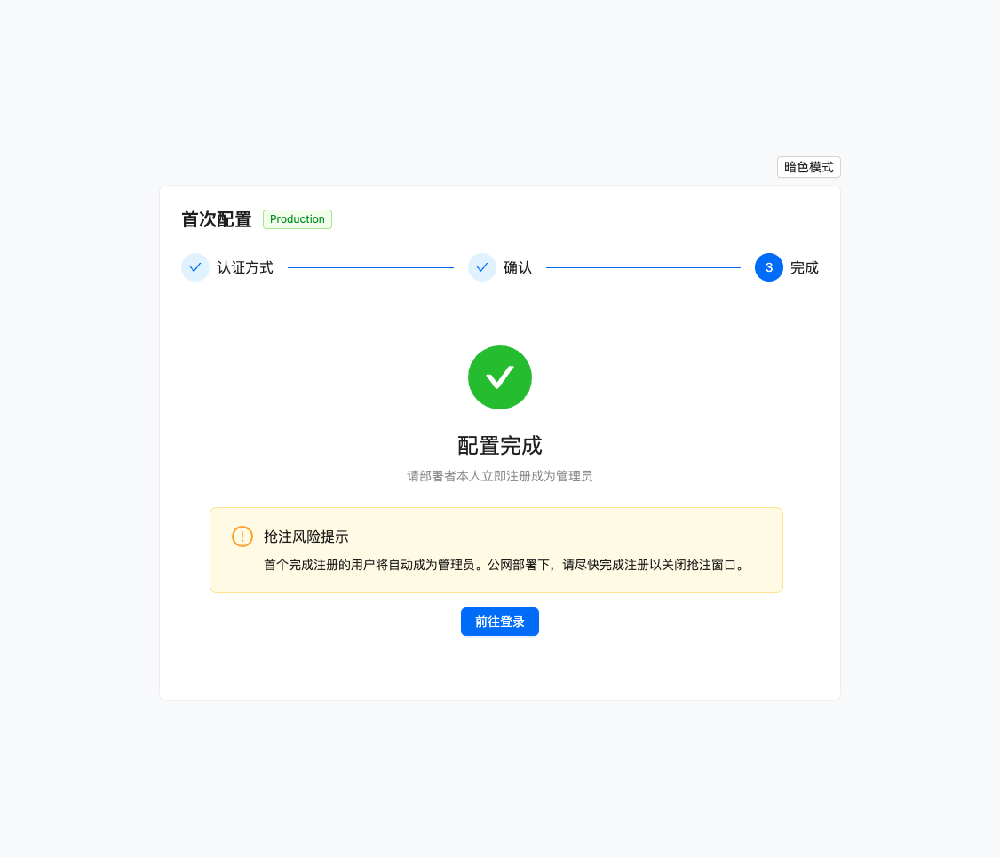

# VPN 订阅管理系统

<p align="center">
  <b>自托管 · 轻量 · 一键部署</b> —— 给团队用的 VPN 订阅分发面板，一个容器搞定全部。
</p>

<p align="center">
  
  
  
  
  
</p>

> 简单说：把订阅链接「集中管理、一键分发」的网页工具。管理员上传一次订阅配置，成员打开网页点一下「一键导入」，客户端（Clash / v2rayNG / Shadowrocket 等）自动完成配置，再也不用手动复制粘贴。

---

## 目录

- [功能特性](#功能特性)
- [快速开始（一键部署）](#快速开始一键部署)
- [日常使用](#日常使用)
- [备份与升级](#备份与升级)
- [常见问题 FAQ](#常见问题-faq)
- [高级运维](#高级运维)
- [技术栈](#技术栈)
- [本地部署与开发](#本地部署与开发)

---

## 功能特性

### 📦 订阅集中管理

按平台（Clash Verge / v2rayNG / Shadowrocket…）维护订阅池，支持**文件上传**与**文本编辑**两种方式创建订阅，每份保留最多 **5 个历史版本**，可随时预览、切换、回滚。



### 🔗 一键导入与长期链接

成员登录主页即可看到分配给自己的订阅，点「**一键导入**」自动唤起客户端，或「**复制链接**」手动粘贴。链接**长期有效**，客户端定时自动拉取最新配置——管理员更新一次，全员即时生效，无需重新登录。



### 🔐 认证与权限

- **双认证并存**：本地账号（邮箱 + 密码）与 OIDC 单点登录（Keycloak / Auth0 / 通用 OIDC）
- **用户组分发**：订阅按组分配，还可为「特定用户 + 特定平台」单独上传自定义订阅覆盖
- **独立分享订阅**：不绑定用户的公开链接，适合临时访客，可随时刷新 / 吊销
- **完整访问日志**：记录全部下载请求，保留 90 天自动清理

登录页 | 用户管理
:---:|:---:
 | 

### ⚙️ 面板配置中心

认证开关、验证码（reCAPTCHA / Turnstile）、SMTP 邮件、站点名称与 ICON、速率限制、日志级别、公告页脚、**一键备份下载**……全部在面板可视化配置，无需改任何配置文件。



---

## 快速开始（一键部署）

> ⏱️ 全程大约 5 分钟。前提：已安装 Docker（含 Docker Compose）。

### 第 1 步：一键启动（ghcr.io 预构建镜像）

新建 `docker-compose.yml`，粘贴以下内容：

```yaml
services:
  vpn-sub:
    image: ghcr.io/alcaprophet/vpnmanagement:latest   # 官方预构建镜像，秒级拉取
    ports:
      - "8080:8080"
    volumes:
      - vpn-data:/data          # 全部数据持久化到数据卷
    restart: unless-stopped

volumes:
  vpn-data:
```

启动：

```bash
docker compose up -d
```

> 极简方式（不想用 compose 时）：`docker run -d --name vpn-sub -p 8080:8080 -v vpn-data:/data ghcr.io/alcaprophet/vpnmanagement:latest`

### 第 2 步：完成首次配置

浏览器访问 **http://服务器IP:8080**（本机则访问 http://localhost:8080），自动进入 Setup 引导，只需 3 步：

**① 选择「快速开始」（推荐，零配置）**



**② 确认使用本地账号模式**



**③ 配置完成，前往登录**



### 第 3 步：注册管理员账号

点击「前往登录」→ 注册（用户名 / 邮箱 / 密码）→ 完成。**第一个注册的用户自动成为管理员**，请部署者本人立即注册。

---

## 日常使用

### 管理员：上传订阅

1. 右上角「**管理面板**」→「订阅」→「新建订阅」
2. 选择平台 → 上传订阅配置文件（或粘贴文本）→ 分配用户组 → 保存

> 更新配置：编辑该订阅重新上传即可生成新版本，「版本管理」里可随时回滚（最多保留 5 个）。

### 成员：一键导入订阅

1. 打开系统网址 → 登录
2. 找到对应平台的订阅卡片 → 点击「**一键导入**」（自动唤起已安装的客户端），或「**复制链接**」在客户端粘贴导入

---

## 备份与升级

### 备份

「管理面板」→「面板配置」→「**备份下载**」→ 点击「下载备份（tar.gz）」，包含数据库一致性快照与全部文件。

### 升级

```bash
docker compose pull && docker compose up -d
```

数据全部保存在数据卷中，升级不影响任何数据。

---

## 常见问题 FAQ

**Q：成员看不到订阅？**
订阅需与用户所属的用户组关联；若平台订阅「未分配」，请联系管理员在「订阅」页分配用户组。

**Q：能对外开放分享链接吗？**
可以。「管理面板」→「分享」创建独立分享订阅，链接不绑定用户，支持随时刷新 / 吊销。

**Q：客户端导入后订阅不更新？**
订阅链接长期有效，Clash 等客户端会按自身策略定时拉取，也可手动「更新订阅」。

**Q：想换服务器 / 迁移？**
「面板配置」→「配置导入/导出」导出加密配置文件，新服务器 Setup 页选择「导入已有配置」即可整体迁移。

---

## 高级运维

### 公网 HTTPS 接入（可选）

需要域名 + HTTPS（OIDC 单点登录与验证码功能依赖公网可达的 HTTPS 域名）。将容器端口改为仅绑定回环地址，由外部 Nginx 反向代理承接 TLS：

```yaml
# docker-compose.yml
ports:
  - "127.0.0.1:8080:8080"
```

```nginx
# Nginx 配置示例
server {
    listen 443 ssl;
    server_name vpn.example.com;
    ssl_certificate     /path/to/fullchain.pem;
    ssl_certificate_key /path/to/privkey.pem;

    location / {
        proxy_pass http://127.0.0.1:8080;
        proxy_set_header Host $host;
        proxy_set_header X-Forwarded-For $proxy_add_x_forwarded_for;
        proxy_set_header X-Forwarded-Proto $scheme;
    }
}
```

### 环境变量

| 变量 | 默认值 | 说明 |
|------|--------|------|
| `APP_MODE` | `prod` | `dev` / `prod`（决定数据库文件与功能差异） |
| `LOG_LEVEL` | `info` | `debug` / `info` / `warn` / `error` |
| `LOG_FORMAT` | `console` | `console` / `json` |
| `PORT` | `8080` | 监听端口 |
| `TRUST_PROXY` | `auto` | `auto` / `on` / `off`，真实客户端 IP 解析策略 |
| `RESET_ADMIN_PASSWORD` | — | 应急恢复：管理员密码救援 |

### 应急恢复（管理员密码救援）

忘记管理员密码时，在 `docker-compose.yml` 中设置 `RESET_ADMIN_PASSWORD: "1"` 并重启容器，操作码见容器日志：

```bash
docker compose logs vpn-sub | grep 操作码
```

重置完成后**移除该变量并重启**恢复正常服务。

### 数据存储

全部持久化数据存放在 Docker 数据卷 `vpn-data` 中，删除容器不会丢失；备份请使用面板「备份下载」。

---

## 技术栈

- **后端**：Go 1.25 + Gin + SQLite（纯 Go 零 CGO 驱动，嵌入式存储，无需外部数据库）
- **前端**：Vue 3 + Vite + Ant Design Vue + Tailwind CSS
- **部署**：单容器（API + 前端页面 + 静态资源一体），多阶段构建，非 root 运行，数据卷持久化
- **CI/CD**：GitHub Actions 自动构建并推送 Docker 镜像（打 `v*` 标签触发）

---

## 本地部署与开发

### 从源码构建

```bash
git clone https://github.com/AlcaProphet/VPN-Subscription-Management.git
cd VPN-Subscription-Management
docker compose up -d --build
```

> 首次构建需要几分钟（前端打包 + 后端静态编译）；日常使用建议直接用预构建镜像（见快速开始）。

### 局域网直连部署

适合家庭 / 公司内网：compose 中 `ports` 保持 `"8080:8080"` 直接暴露即可，浏览器访问 `http://服务器IP:8080`。

> ⚠️ 直连模式凭据为明文传输，**仅限可信内网**；公网请使用预构建镜像 + 反向代理（见高级运维）。

### 本地开发

- 后端：`cd backend && go run ./cmd/server`（内嵌前端产物，仅 API）
- 前端：`cd frontend && npm run dev`（Vite dev server 代理 `/api` 到 `127.0.0.1:8080`）

构建验证：

| 场景 | 命令 |
|------|------|
| 后端编译 / 检查 / 测试 | `cd backend && go build ./... && go vet ./... && go test ./...` |
| 前端构建 | `cd frontend && npm run build` |

---

## 许可证

本项目为自托管开源项目，详情见仓库 LICENSE 文件。
