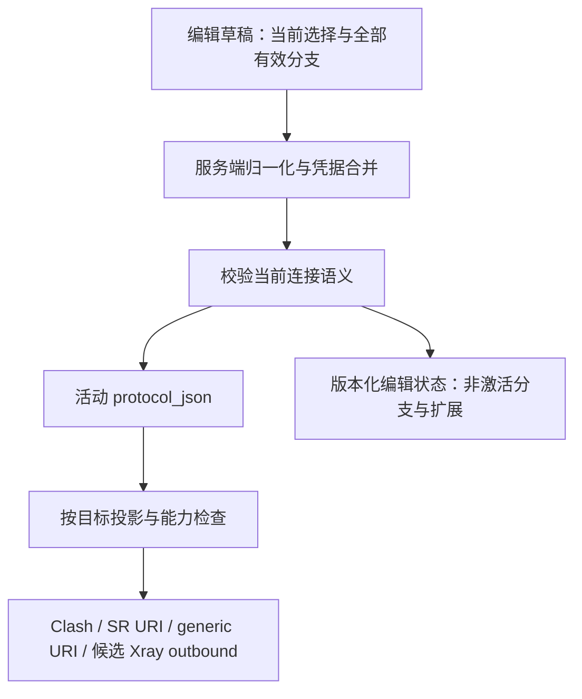

# Node-Editor-Improvement-Directions.md — 当前节点编辑设计改进方向

> **文档定位：** 面向后续产品与技术决策的分析文档，承接 [Node-Editor-Design-Research.md](Node-Editor-Design-Research.md)，参照 Design 模板组织现状、候选方案、决策与验证边界；存放于 Reference，不替代现行 Design，不授权代码构建。
> **核验基线：** 2026-09-02，仓库提交 `9d27bc8`，分析开始时工作区干净。项目事实以本轮静态代码检查为准；外部资料为当日查阅的官方文档及指定版本源码。本轮未启动服务、未做客户端连接实验，也未执行构建或单元测试。
> **状态约定：** 【已确认方向】来自原研究记录；【代码事实】来自当前仓库；【外部事实】附在线来源；【分析判断】是由证据推导的结论；【建议／待决策】均未成为实施要求。
> **范围：** 手工节点编辑体验及其保存、导入、装配和输出的一致性。Xray 来源节点仍由实例检测维护；独立 Xray 客户端输出是后续候选能力。

---

## 一、核心判断与改进优先级

当前最值得改进的是：**让用户清楚当前连接组合，让系统准确保存这个选择，并保证实际产物只表达当前有效配置。** 现有六分区、后端协议注册表和递归对象编辑器可以继续使用；下一轮应补齐状态与输出语义，然后调整界面组织。

仅增加折叠、把字段隐藏起来，会留下“看起来是 TLS，链接实际仍输出 REALITY”“表单能选 WS，链接却没有 WS 参数”等问题。表单、持久化与输出适配需要作为一个完整改进方向评估。

| 优先级 | 改进方向 | 用户收益 | 主要前置条件 |
|---|---|---|---|
| P0 | 明确当前选择、隐藏值与实际输出的关系 | 切换后能恢复，保存后不会改变连接含义 | 持久化状态与兼容策略决策 |
| P0 | 以实际产物校准能力和校验 | 避免保存了无法正确导出的配置 | 核对字段级输出与目标版本 |
| P1 | 按当前组合展示连接表单 | 常用编辑不必遍历协议字段全集 | 条件元数据与协议分组 |
| P1 | 完善默认值、凭据和错误定位 | 能区分未设置、已保存、当前无效与输入错误 | API 与字段值语义收口 |
| P1 | 明确结构化编辑和 JSON 的边界 | 高级修改可控，未知参数不被无提示覆盖 | 单一编辑状态与局部提交规则 |
| P2 | 扩展协议专用子表单和目标预览 | 更多协议可用，跨客户端差异可解释 | 前述基础模型稳定 |
| P3 | 增加独立 Xray 客户端适配器 | 输出经过验证的 Xray outbound | 单独确认目标版本与产品范围 |

这里的优先级是设计依赖，不是 Build Step，也不表示需要一次性交付全部能力。

### 1.1 应延续的研究方向

原研究已经记录：允许增加独立 Xray target adapter；同协议切换时保留隐藏值、只输出当前激活值；条件模型需要覆盖更多协议；复杂扩展进入高级或兼容区域。这些方向继续作为本文输入。

但它们尚未确定数据库/API 形状、协议清单增量、目标版本和硬校验强度。“需要拓展更多协议”首先可以落实为让现有 19 个协议获得正确的条件表单，不宜直接解释为新增某个协议已经获批。

### 1.2 与现行设计的差异必须显式保留

| 现行基线 | 本文候选变化 | 处理方式 |
|---|---|---|
| [Design2-UI §6.2](../reports/Design/Design2-UI.md)：顶层 bool 集中在独立开关区 | 按语义归属分区，在区内集中开关 | 属于设计调整，待用户选择；不把 Issue12 的头部规则自动套用到节点 |
| Design2-UI §6.2：切换协议清空参数 | 可考虑同次编辑内按协议保留草稿 | 跨协议策略单独决策；同协议传输切换不受此清空规则直接约束 |
| [Build15](../reports/Build/Build15.md)：当轮保持 `protocol_json` 与数据库 schema 不变 | 为隐藏值和当前状态增加独立编辑状态 | 是新增设计范围，不能继续承诺零后端改动、零迁移 |
| [Design3](../../Design3.md)：规则素材改造不重定义节点 | 研究节点专用能力模型 | 后续另行承接节点增量设计，不扩写规则能力注册表的职责 |
| Design2-UI 描述服务端错误按字段路径回显 | 当前 `NodesView.save()` 统一调用 `Notify.error` | 记录设计与代码落差；本轮不改文档基线、不宣称已实现字段定位 |

---

## 二、代码现状与改进依据

### 2.1 已有能力应保留

- `NodesView.vue` 已使用桌面 920px Modal、移动端全屏 Drawer，具备基本信息、认证、传输、安全、开关、高级六区。
- `FieldSchema` 由后端下发，包含分区、固定对象、Map、对象数组和递归属性；不需要再在前端建立完整协议字段副本。
- `ProtocolFieldEditor.vue` 已支持结构化对象、未知键提示和对象级 JSON，不必重新实现一个全新的编辑平台。
- 节点服务已有凭据加密、脱敏和留空保留机制；节点名称和 manual/xray 来源边界明确。
- 装配已有预览、跳过项和自包含 Clash 渲染计划，可作为目标回执与版本兼容的接入点。

以上是当前代码事实；Build15 已完成分区与递归编辑，本次建议以这些能力为起点。定位见第十二章 C1～C9。

### 2.2 本轮确认的关键缺口

| 编号 | 代码事实 | 对改进方向的含义 |
|---|---|---|
| F01 | `sectionFields()` 仅按静态 `section` 分组；schema 没有激活条件 | WS/gRPC/REALITY 对象不能按当前组合统一显隐 |
| F02 | `fieldSection()` 优先把 bool 归入 `switches` | 控件类型决定信息位置，协议含义退居其次 |
| F03 | `clashProxy()` 经 `normalizeClashFields()` 后遍历全部参数；后者只做顶层列表归一化 | UI 隐藏不会阻止旧传输对象或编辑元数据进入 Clash 输出 |
| F04 | VLESS 的 SR/generic 输出以 `reality-opts` 是否为对象判定 REALITY，空对象也符合；其判断优先于 `tls` | 只改 `tls` 或隐藏 REALITY 面板不能可靠切回普通 TLS |
| F05 | Trojan schema 可选择多种传输；`srLink()` 的 Trojan 分支只写凭据、SNI、ALPN、证书跳过项；generic 复用该分支 | 协议级 `sr=true/generic=true` 不代表当前组合完整输出；WS/gRPC 参数在这些分支未输出 |
| F06 | VLESS 同时声明 `ws-opts` 和旧顶层 `ws-path/ws-headers`；链接输出读取 `ws-opts` | 必须明确规范路径、别名优先级和冲突提示 |
| F07 | 创建时加密函数复制整个输入；更新时 `mergeSensitive()` 只保留 schema 声明的顶层键 | 顶层未知键的创建/更新语义不一致，不能把嵌套未知键保留等同于整体无损 |
| F08 | `validateProtocolFields()` 为静态必填与类型检查；`select` 只验证字符串；未验证枚举成员、数值范围或传输组合 | 后端可接受 UI 菜单之外的值；新条件模型需要真正的服务端校验 |
| F09 | 数字和 Select 用 `field.default` 回显但不一定写入草稿；普通文本不使用相同默认逻辑；列表输入仍写逗号字符串 | 用户看到的默认值、保存字段与目标默认值可能不同；嵌套列表也未统一归一化 |
| F10 | 更新先执行“允许敏感字段空值”的校验，再合并旧凭据，合并后未重新验证必填 | 新协议或新认证分支没有旧凭据时，也不能一概把空输入认定为可保留 |
| F11 | WireGuard Peer 的 `pre-shared-key` 在 UI 标为 password，但协议敏感清单只列顶层私钥/PSK；`GetPath/SetPath` 只遍历 map | 输入框遮掩不等于数组内密钥已加密、脱敏；数组凭据路径应纳入设计核查 |
| F12 | manual Clash 条目冻结在 `ClashPlan.ManualProxies`，下载时另行注入动态 Xray 节点 | 改节点不等于重写已生成版本；新输出策略不能无版本区分地改解释所有历史产物 |

F04、F05、F07、F10、F11 是静态路径推导；本轮没有使用真实节点验证连接失败或敏感数据暴露。它们足以确定后续设计与测试重点，但不作为已经复现、修复或验收的 Issue 闭环。

### 2.3 原研究中需要收窄的结论

| 原研究候选 | 本轮证据或分析 | 本文建议 |
|---|---|---|
| WS Path 可作为统一条件必填 | Xray WS 文档明确默认路径为 `/` | 区分省略与无效；提示对端匹配，不跨目标一律要求手填。[官方 WS 文档](https://xtls.github.io/en/config/transports/websocket.html) |
| REALITY 公钥和 Short ID 一起必填 | Xray 允许服务端 `shortIds` 包含空字符串，此时客户端 Short ID 可为空 | 公钥按目标要求检查；Short ID 校验格式并说明空值条件，不一律拒绝空值。[官方 REALITY 文档](https://xtls.github.io/en/config/transports/reality.html) |
| gRPC ServiceName 可由单个 Issue 推为必填 | 官方说明需与服务端匹配，未提供“所有目标必须非空”的统一结论 | 缺失给对端匹配提示；硬错误需固定目标源码或运行用例支持。[官方 gRPC 文档](https://xtls.github.io/en/config/transports/grpc.html) |
| `security` 可以只作为临时虚拟字段 | 保留 REALITY 对象后，TLS 与 REALITY 可能具有相同存储形状 | 必须有可持久化、可恢复的当前选择，或将非激活对象移入独立保存区；详见第四章 |
| TLS/REALITY 共用证书校验区域 | 两者认证语义不同，不能从相似字段名推导所有选项通用 | REALITY 显示其目标所需身份参数；证书跳过选项仅在对应 TLS 能力成立时提供。[Mihomo TLS 文档](https://wiki.metacubex.one/en/config/proxies/tls/) |
| 表单三态可跨协议复用 | Trojan 当前没有 `tls` 开关；QUIC、插件、隧道各有专用语义 | 复用组件，安全选项集合由协议与目标能力决定 |

---

## 三、界面改进：围绕当前连接组合组织

### 3.1 推荐的信息层级

建议延续现有编辑浮层，先验证以下结构能否降低滚动与查找成本；暂不把节点编辑改成多步向导或独立配置 IDE。

```text
编辑节点                           当前组合：VLESS · WS · TLS

基础与认证                         默认展开
  协议、名称、服务器、端口、当前认证凭据

连接方式                           默认展开
  传输选择 → 当前传输参数
  安全选择 → 当前安全参数
  当前组合的常用开关

兼容与性能                         默认折叠
  标题显示：已设置项数 / 警告数
  TFO、MPTCP、SMux、旧版与协议扩展

高级数据与目标检查                 默认折叠
  未识别参数 / 非激活参数摘要 / 局部 JSON
  当前目标可输出内容及差异

取消                              保存
```

【建议】基础区内可以保留“身份”和“认证”两个小标题，避免合并后变成新的长字段列表。服务器、端口、凭据、传输、安全这条阅读顺序应在手机端保持一致。

高级区域含已配置项时，即使折叠也显示摘要；发生错误时自动展开并定位。必需字段不能因“高级”标签而不可发现。

### 3.2 区分三种状态

| 状态 | 示例 | 保存、校验和输出 |
|---|---|---|
| 折叠但有效 | 已启用的 SMux 面板收起 | 继续校验、继续参与输出 |
| 当前不激活 | `network=grpc` 时的 WS 参数 | 保留有效数据；不做当前连接的必填校验，不输出 |
| 对当前目标无法表达 | WS 自定义 Header 不能被某个 URI 映射完整承载 | 保留；给目标差异回执，不能静默算作完整支持 |

“不可见”不是输出过滤规则。前端还可能因为折叠或屏幕布局隐藏字段，后端不应根据这些展示状态决定连接含义。

### 3.3 控件与标签

- 传输、安全、插件、认证模式采用明确的选择控件。只展示该协议的合理选项；当前旧值不在新清单时显示为“旧配置／待核验”，不自动改成第一项。
- 将“协议内部加密”“外层安全”“客户端指纹”“证书指纹”分别命名。VMess Cipher 不与 TLS 混为一个“加密方式”；REALITY 公钥也不因 Xray 字段叫 `password` 而在 UI 改名为密码。
- 常用 bool 保持左说明、右 Switch；是否从独立开关区改为区内开关，保留为 D1 决策。
- ALPN、Allowed IPs 等使用可增删列表，Headers 使用键值行；顺序和类型有意义时必须保留。手机端标签和值上下排列，不强制三列横向表格。
- 证书、私钥和 OpenVPN 配置使用适合多行的专用输入；不要求用户在单行 Input 中维护配置全文。完整配置可能内嵌密钥，不能因字段类型是 text 就默认可明文回显或存储。
- 每个字段关联 label、帮助和错误；区标题若可折叠，应支持键盘操作并暴露展开状态。参照 [W3C Accordion](https://www.w3.org/WAI/ARIA/apg/patterns/accordion/)；不以增加一个全局表单库作为前提。

### 3.4 预设只承担显式预填

保留原研究中的个人 VLESS/VMess 模板作为快速预设候选，但由用户主动应用。预设应展示将修改哪些字段；服务器、UUID、密码和公钥等连接信息仍需填写或导入。

预设值、协议缺省值、目标客户端缺省值是三个来源。界面需说明“使用默认／显式设置”；不能因页面打开、折叠或切换 JSON，就把所有回显默认值写入节点。

---

## 四、数据改进：保存状态与输出状态必须分清

### 4.1 为什么单一虚拟安全字段不够

假设一个节点曾使用 REALITY，保存了 `reality-opts`。用户切换到 TLS，同时按照已确认方向保留隐藏参数：

```text
状态 A：当前 REALITY，tls=true，保留 reality-opts
状态 B：当前 TLS，    tls=true，保留 reality-opts
```

若保存数据只有后两项，重新打开时无法区分 A/B。当前 VLESS 链接逻辑还会把 B 按 REALITY 输出。这个问题不能靠前端 `visible_if` 解决。

同样，TUIC v4/v5 或插件切换保留旧凭据后，也不能再仅以“某个字段存在”猜测当前认证方式。

### 4.2 三种存储路线比较

| 路线 | 优点 | 代价与限制 | 评价 |
|---|---|---|---|
| A：单个 `protocol_json` 存全集，另加状态标记 | 读写入口集中，旧字段路径变化较少 | 所有旧输出器都必须识别并过滤元数据和非激活字段；未知键兼容易混杂 | 可行备选，不能只靠 UI 约定 |
| B：保留活动 `protocol_json`，独立保存编辑状态与非激活分支 | 当前输出对象与可恢复数据职责清楚，旧输出器较易隔离 | 需 DTO/持久化增量、同事务保存、凭据与版本处理 | **推荐继续设计** |
| C：全面改为中立节点模型，再重写全部适配器 | 长期语义统一，跨目标扩展空间大 | 迁移、导入、加密、历史产物和适配器改动面最大 | 暂不作为首轮路线 |

【建议／待决策 D2】优先 B。此处的独立状态可以是版本化 JSON 字段或关联存储，具体 DDL 不在本文决定。它应保存必要的当前选择、非激活配置和扩展归属，不复制一份完整活动配置，也不保存展开状态等纯界面偏好。

建议的数据职责如下，名称仅作概念说明：



D/E 应作为同一个节点修订原子保存；目标输出只消费活动投影。即使采用 B，适配器仍需要字段映射和目标能力过滤，因为活动配置中的某个高级功能仍可能无法在 URI 中表达。

### 4.3 隐藏值保留的精确定义

| 操作 | 建议行为 |
|---|---|
| WS → gRPC → WS | 恢复上次有效 WS 数据；期间 WS 参数不输出 |
| REALITY → TLS → 关闭后重开 | 当前仍为 TLS；REALITY 配置可恢复，但不会重新激活 |
| 折叠 TLS 面板 | 不改变 TLS 是否激活 |
| 非激活分支缺少连接必填项 | 不阻止当前分支保存 |
| 非激活分支包含非法 JSON 草稿 | 无效文本暂存在当前编辑会话；提示修正或放弃，不作为有效配置持久化 |
| 更换插件／认证版本 | 旧分支数据可保留；活动凭据只属于明确选择的分支 |
| 切换协议 | 延续当前清空规则，或新增会话内恢复，另由 D3 决策；不得借同协议保留方向擅改 |

保存层仍要检查 JSON 形状、敏感字段处理和数据版本。这些属于存储完整性；“非激活不校验”应限定为不执行当前连接的业务必填与组合校验。

### 4.4 兼容与迁移原则

1. 旧节点第一次读取采用明确的 legacy 解码规则；不要依据官方最新文档静默重写其安全、网络或默认值。存在歧义时展示原值、解释推断并让用户在编辑保存时明确选择。
2. WS 采用 `ws-opts` 作为规范路径候选；旧顶层别名只作兼容输入。新旧值冲突时显示差异，不能无提示选一边。
3. 新 UI 无修改保存应保持节点的有效连接含义；用户显式保存的归一化变化应可解释。GET 请求不承担数据库迁移写入。
4. 旧 API 调用方缺少编辑状态时的 PUT 语义需明确：是按旧格式整替换，还是保留既有非激活区。必须防止把旧状态错误合并到新协议；具体兼容方式属于 D2 的契约决策。
5. URI 导入和表单创建使用同一归一化与校验入口，避免导入绕过状态模型；导入回执仍保留逐行结果。
6. `protocol_json` 的活动字段和非激活状态须在同一事务内更新，防止半更新；不把客户端传来的“已验证”标志当作服务端事实。

---

## 五、条件模型与校验方向

### 5.1 扩展现有 schema，但不让它成为通用编程语言

建议复用现有 `FieldSchema`，增加少量声明式能力。下面是概念职责，不是最终 API 命名：

| 概念 | 解决的问题 | 边界 |
|---|---|---|
| 连接状态 | 当前协议、传输、安全、认证版本、插件 | 持久化语义，不由对象存在与否临时猜测 |
| `active_when` | 当前节点是否使用这个字段 | 服务端校验和输出投影共享依据 |
| `required_when` | 激活后是否必须有有效值 | 与“字段展示在首屏”分开 |
| 展示分组／优先级 | 字段放哪、默认是否展开 | 不参与输出决策 |
| 类型、枚举、范围、格式 | 值是否合法 | 由后端最终验证，前端提前反馈 |
| 缺省／显式值语义 | 省略、false、0、空串的差别 | 不统一当作“未填写” |
| 规范路径与旧别名 | 旧节点能否无损载入 | 冲突需显示，不能静默覆盖 |
| 目标能力 | 给定组合能否被具体适配器表达 | 与普通字段类型分开维护 |

JSON Schema 已提供 `if/then/else` 和依赖校验思想，但它本身不负责表单显隐、隐藏值保存或多目标输出。可以借鉴其表达方式，首轮仍保持项目可审计的小型条件集合，例如等于、属于、全部满足；不引入任意脚本求值或重型表单框架。[JSON Schema 条件校验](https://json-schema.org/understanding-json-schema/reference/conditionals)

前端与 Go 后端共用的是规则数据与测试样本，而非假装共用同一语言函数。协议注册表输出字段规则；后端服务拥有最终判定；适配器提供目标限制。三者必须通过同一批组合语料核验，避免重复硬编码出三套规则。

### 5.2 推荐的验证次序

```text
解析输入形状
  → 读取已有节点与凭据存在状态
  → 规范化别名、列表及明确的当前选择
  → 合并“保留／替换／清除”凭据操作
  → 校验活动连接的凭据、字段值和组合
  → 保存活动配置与有效非激活分支
  → 在预览／生成时对目标投影再次检查
```

关键区别在于：编辑时“空输入”只能在确有同一语义凭据可保留时通过。跨协议同名 `password` 不自动代表同一个凭据；新启用分支没有历史凭据时仍需要填写。

### 5.3 将错误分为三类

| 类别 | 例子 | 建议反馈 |
|---|---|---|
| 无法保存 | 端口越界、类型错误、活动分支缺必要凭据、明确非法组合 | 字段错误＋表单摘要，定位到具体路径 |
| 可以保存但当前目标无法正确生成 | 必需传输参数会在目标输出中丢失 | 编辑时显示差异；生成前阻止或明确剔除该节点，不能生成后仍标“完整支持” |
| 风险或待核验 | ServiceName 与服务端是否一致、客户端版本未知、可选性能字段不支持 | 不伪装成绝对必填；说明影响和需要核验的条件 |

【建议／待决策 D4】只有目标特定的确定规则才升级为硬错误。未知远端配置不能靠表单推断。WS 路径、Short ID、SNI 等都应按“是否有合法缺省、是否必须与服务端一致、当前目标如何处理”分别判断。

服务端返回结构化字段路径和稳定错误码比让前端解析中文错误字符串更合适；可保留通用 `message` 兼容现有调用。显示层应展开所属区，聚焦首个错误，并给出修正方法。[W3C 表单错误通知](https://www.w3.org/WAI/tutorials/forms/notifications/)

当前 `invalidProtocolPaths` 是事件驱动集合。未来条件组件卸载、删除数组项或更换协议后，需要重建／清理对应有效性状态，防止已经隐藏或删除的路径永久阻止保存；不能简单通过清空全部错误来提交尚未应用的 JSON。

---

## 六、多协议改进范围

### 6.1 先覆盖现有协议的不同结构

下表覆盖当前 19 个 manual 协议；分组仅用于复用交互，不代表组内协议具有相同 wire format 或相同目标支持范围。

| 协议 | 条件表单的主要驱动 | 候选改进重点 |
|---|---|---|
| VLESS、VMess、Trojan | 传输、安全、协议特有能力 | 当前传输对象显隐；Flow/Cipher 分开；不强制共享同一安全选项集 |
| Shadowsocks | Cipher、插件 | 选择插件后展示该插件字段；禁止把全部插件参数当成同一套自由文本 |
| Hysteria、Hysteria2 | 各自认证、混淆、端口与带宽模型 | 保持独立协议入口；混淆凭据随混淆方式激活 |
| TUIC | v4 Token 或 v5 UUID＋密码 | 显式认证版本选择、互斥输出、旧节点识别 |
| WireGuard | 单 Peer／多 Peer、密钥、地址 | Peer 对象列表、地址类型、数组凭据和目标表达能力 |
| MASQUE | 当前实现的密钥与隧道参数 | 单独核验，不因形似 WireGuard 就共享必填规则 |
| HTTP、SOCKS5 | 无认证／账号认证、目标 TLS 能力 | 认证字段按模式显示；TLS 选项按目标确认 |
| SSH | 密码／私钥及口令 | 条件凭据、Host Key、适合多行的私钥输入 |
| AnyTLS | TLS 身份及会话参数 | 常用认证首屏，会话调优折叠；客户端证书内容单独处理 |
| Snell、Mieru、ShadowQUIC、TrustTunnel、Tailscale | 各协议版本／认证／传输字段 | 保留专用小表单；资料不足的字段先显示“待核验”能力 |
| OpenVPN | 客户端配置全文 | 多行编辑、配置校验、内嵌凭据保护；不伪造不完整通用传输表单 |

外部资料支持按协议分支建模：Mihomo 为 Shadowsocks 各插件分别给出不同参数结构；TUIC 明确要求 v4/v5 凭据互斥；Hysteria 2 将混淆作为独立条件配置。它们支持条件子表单方向，但不意味着需要把官方新增选项全部加入本项目。[Mihomo Shadowsocks](https://wiki.metacubex.one/en/config/proxies/ss/)、[Mihomo TUIC](https://wiki.metacubex.one/en/config/proxies/tuic/)、[Hysteria 2 客户端配置](https://v2.hysteria.network/docs/advanced/Full-Client-Config/)

### 6.2 首批建议选取的代表场景

建议用 VLESS、VMess、Trojan、Shadowsocks 四个协议检验第一轮模型：前三者覆盖传输／安全与输出差异，Shadowsocks 检验插件条件是否被错误套成 VLESS 模型。TUIC 与 WireGuard 分别作为认证互斥、数组凭据设计的必备校验样本。

第一批界面覆盖哪些协议属于 D5 决策。其余协议可以暂时继续使用原有 schema，但不能把未升级协议标记为完成了新条件校验。

### 6.3 需优先核对的协议细节

- **VLESS：** 当前 generic 分支固定写入 `encryption=none`。编辑器若允许填写其他加密值，必须报告当前输出无法保留；不能只把该字段放进高级区后继续标为支持。
- **VMess：** Cipher 与外层安全独立；现有 `alterId` 保留为兼容参数候选。REALITY 是否开放、何种组合开放，需要目标支持证据，不从 VLESS 推断。
- **Trojan：** 当前菜单含 `http/h2/xhttp`，而当日 Mihomo Trojan 文档只明确列出 WS/gRPC，其余值按 TCP 处理。应固定客户端版本核对解析器后再定菜单；现有链接分支遗漏传输参数的问题应单独处理。[Mihomo Trojan](https://wiki.metacubex.one/en/config/proxies/trojan/)
- **XHTTP：** 项目 schema 使用 `none/auto/packet-up/stream-up`，当日 Mihomo 文档列出 `auto/stream-one/stream-up/packet-up`。候选做法是区分“未指定”与实际 Mode，按目标版本提供枚举；不要把旧值直接自动改写。[Mihomo 传输配置](https://wiki.metacubex.one/en/config/proxies/transport/)
- **TUIC：** 当前 Token、UUID、密码均可留空且无互斥规则，链接分支使用 UUID＋密码形态；v4/v5 应分别验证，不能仅通过协议级可导出标记放行。

---

## 七、目标能力与输出预览

### 7.1 能力描述至少落实到组合与字段

当前 `LinkMapping` 的 SR/generic 布尔值适合协议级粗筛，`Params` 也不能证明实际分支完整输出。建议能力记录至少回答：哪个适配器、哪类客户端版本、哪个协议组合、哪些字段可表达，以及结论依据。

| 状态 | 含义 | 用户侧建议呈现 |
|---|---|---|
| 完整支持 | 当前活动连接语义全部表达 | 当前组合可输出 |
| 等价转换 | 字段名／结构改变，连接语义保留 | 可输出；详情中说明转换 |
| 部分支持 | 可选能力丢失或改变 | 点明具体字段与影响 |
| 不支持 | 核心认证、传输或安全无法表达 | 阻止该目标生成，或明确剔除节点 |
| 未验证 | 缺少目标版本或真实客户端证据 | 待核验；不能显示成功徽标 |

例如 `trojan + ws` 在当前链接代码中不应判为“完整支持”，即使该客户端本身可能支持 Trojan WS。**目标客户端支持、项目适配器已实现、实际客户端验证通过，是三个独立维度。**

### 7.2 generic 不是一个具体客户端

generic 当前是项目的 URI 输出约定，不代表所有接受 URI 的客户端使用同一规范。SR 原生链接与 generic 分支也有不同编码和参数方式，不能合并成一个“标准链接”能力。

建议基于既有 [Node-Link-Standards.md](Node-Link-Standards.md) 保留映射来源，再补指定客户端版本的验证记录。本文未重新验证 Shadowrocket 的全部私有参数；相关组合应保持“项目实现证据／客户端待核验”的标注。

### 7.3 输出预览应回答的实际问题

【建议／待决策 D6】编辑器高级区增加轻量的目标检查，默认只显示当前差异，详细产物按需展开：

```text
当前组合：Trojan · WS · TLS
Mihomo：待按目标版本验证
SR URI：当前适配器未输出 network / ws-opts，无法完整表达
generic URI：复用相同分支，存在相同限制
```

预览应复用实际适配器；不允许前端另写一份“看上去正确”的 JSON 生成器。编辑已有节点时由服务端合并已有凭据，向浏览器返回脱敏结果和“凭据已配置”状态；脱敏文本明确不能直接用作客户端配置。

新能力不应要求用户每次都选择全部目标才能保存节点。编辑时展示可保存的连接状态，装配时按所选目标执行强校验；必要参数丢失与可选调优丢失需区别处理。

### 7.4 历史版本与动态节点

当前 manual 节点在生成时进入版本产物与 Clash 自包含计划，Xray 节点在下载时按用户动态注入。因此：

- 新建／重新装配的版本采用新活动投影和目标回执。
- 已发布 manual 快照不应因为节点编辑或能力表更新而被静默重写。UI 可说明“节点已更新，已有订阅版本需重新装配”。
- 新旧计划的解释规则需要版本边界；新 profile 不能强加给全部旧快照。
- 动态 Xray 节点也要核对共享输出路径，但其配置所有权仍属于实例检测，不能从本次手工编辑改造推导出“允许编辑 Xray 来源节点”。
- 覆盖层可能进一步改变最终产物；节点检查是局部检查，不能取代装配后的最终检查。

---

## 八、凭据、未知参数与高级 JSON

### 8.1 凭据状态应从输入值中分离

建议展示“未配置／已保存／待替换”，继续保留编辑空输入不改旧凭据的便利；若确需删除，可选凭据提供明确清除动作，必需凭据则必须同时满足当前认证模式。

这需要区分三个操作：保留、替换、清除。不能让 `""` 同时代表三者，也不能将 `<已隐藏>` 作为真实密码重新保存。确认到哪一级开放清除动作，属于 D7 决策。

数组凭据需要稳定身份：Peer 删除／重排后，不能按旧数组索引合并到另一个 Peer。可在编辑状态中维护稳定条目标识，或设计显式凭据操作引用；采用哪种形状需要后续契约评审。

加密、脱敏、编辑合并和输出解密应覆盖同一组敏感路径，包含非激活分支、对象数组和可能内嵌密钥的配置全文。REALITY 公钥不是服务端私钥；客户端合法 mTLS 私钥又不同于从服务端配置误抄的私钥，两者不能混为一个“禁止私钥字段”的规则。

### 8.2 未知参数分层保留

| 参数来源 | 保存建议 | 输出建议 |
|---|---|---|
| 已知活动字段 | 按 schema 保存 | 按适配器能力表达 |
| 已知非激活字段 | 保存在可恢复分支 | 不进入当前产物 |
| 已知对象下的扩展键 | 保留原值和结构，标记未识别 | 明确目标归属且父对象激活时才考虑透传；不能宣称已验证 |
| 无法归属的顶层键 | 单独列出，避免更新丢失 | 新增参数不默认向所有目标广播；给出目标与影响选择 |
| 服务端专用配置 | 作为导入诊断提示 | 不进入普通客户端节点输出 |

【建议／待决策 D8】采用“保留数据，显式界定目标”的路线。对已经由旧版本透传的扩展键，需要先做产物差异提示与兼容策略，不能在后台升级时一律删除。新增未知字段也不能绕过敏感信息处理直接明文保存。

### 8.3 JSON 编辑保持单一生效来源

建议第一轮保留对象级 JSON，新增分区 JSON 时必须说明作用域。完整 target JSON 优先只读预览，不同时成为另一份可编辑真值。

交互上建议采用“局部 JSON 草稿 → 校验 → 应用本区”模式：进入 JSON 时复制当前有效值；编辑未完成时不反向覆盖结构化状态；应用成功后统一回填；取消恢复应用前数据。父区 JSON 开启时，不允许子对象另一份未提交草稿同时写同一范围。

整个节点保存前必须明确处理未应用草稿；不能无声提交旧对象，也不能把格式错误当作“隐藏数据”保存。去掉非敏感可选字段应有“恢复未设置”的语义，避免输入清空被强制写成 `0`、`false` 或空字符串。

---

## 九、独立 Xray 输出的范围建议

原研究已确认可以增加独立适配器。建议首期边界是：**将一个有效客户端连接描述转换为指定版本的 Xray outbound，并返回转换差异。**

完整 Xray 配置的 DNS、路由、inbounds、多个 outbounds 组织，以及 Xray 服务端部署和账号管理，都需要另外的产品设计。反向导入任意 Xray JSON 也不能从“支持导出”自动推导。

### 9.1 版本应固定，不能直接追随在线文档

【代码事实】项目 `go.mod` 固定 `xray-core v1.260327.0`，它首先服务现有 Xray 集成，不等于用户客户端版本。

【外部事实】当日在线 Transport 文档使用 `streamSettings.method`；固定版本源码的 `StreamConfig` 使用 `json:"network"`，并含 `rawSettings/tcpSettings` 等兼容结构。REALITY 相关源码也同时声明 `password/publicKey`。这说明当前文档、历史样本和项目依赖不能被当成同一个输出契约。[Xray 当前 Transport 文档](https://xtls.github.io/en/config/transport.html)、[v1.260327.0 配置解析源码](https://github.com/XTLS/Xray-core/blob/v1.260327.0/infra/conf/transport_internet.go)

【建议／待决策 D9】首期选择一个明确版本或有限能力 profile，用该版本解析器与测试证明输出可接受；普通用户不必先选几十个版本。是否将当前项目依赖版本作为第一条基线，仍需确认，不能仅因已依赖它就认定合理。

### 9.2 适配器不能做的隐式转换

- 不把 Mihomo `smux` 直接改名为 Xray `mux`；协议和行为相同须另有证据。
- 不把 H2、HTTP、SplitHTTP、HTTPUpgrade、XHTTP 当作任意可互换的传输别名。
- 不将服务端 REALITY `target/privateKey` 映射到客户端公钥配置。
- 不因 Xray 支持某组合，就认为 Mihomo 或 SR 也支持同组合。
- 不把单个 outbound 预览标为可直接启动的完整 Xray 配置。

---

## 十、影响范围与建议推进顺序

### 10.1 影响评估

| 受影响模块／文档 | 可能变化 | 控制方式 |
|---|---|---|
| `NodesView`、`ProtocolFieldEditor`、节点 API 类型 | 条件分区、凭据状态、错误定位、JSON 草稿 | 复用现有载体，节点内先验证；共享组件不无条件改变其他表单 |
| 节点注册表与节点服务 | 条件规则、状态保存、递归归一化与合并 | 后端为最终事实源；状态和凭据原子保存 |
| URI 解析／批量导入 | 进入统一规范化流程 | 保持逐行回执；不把无法识别的参数误判为已支持 |
| Clash 与链接适配器 | 活动字段投影、组合能力、目标回执 | 输出从同一规范化输入生成；保持稳定名称引用 |
| 装配蓝图、渲染计划、下载 | 新旧 profile／计划解释边界 | 历史快照不静默重写；区分 manual 与动态 Xray |
| 数据迁移、备份恢复 | 如采用独立状态，需覆盖新数据 | 当前配置导出不等于完整 manual 节点备份；先核对实际恢复路径，不擅自扩大导出格式 |
| 现有测试与新验收语料 | 状态往返、字段投影、凭据、移动布局 | 检验连接语义，不只截图或断言字段存在 |
| Design／Build／Issue | 新设计结论、分步构建、确认后的问题闭环 | 本轮仅新增 Reference；获批后按职责分别承接 |

### 10.2 推荐的设计阶段

| 阶段 | 应产出的可评审结果 | 进入下一阶段前需要解决什么 |
|---|---|---|
| A：状态与兼容 | 活动／非激活样例，DTO 草案，旧节点迁移示例 | D2、D3、D7、D8；证明保存重开不丢状态 |
| B：能力与校验 | 首批协议组合表、目标字段清单、正反例 | D4、D5；证明规则不误杀合法缺省 |
| C：交互规格 | 桌面／移动布局、折叠与错误定位、JSON 应用流程 | D1、D6；说明每次切换对数据的影响 |
| D：实施准备 | 正式增量 Design 与分步 Build | A～C 已决策、影响范围明确，才进入构建 |
| E：扩展目标 | 更多协议与独立 Xray adapter 的独立方案 | D9；固定版本并通过适配器验收 |

界面示意可以提前绘制；但“保留隐藏值”的功能不能在没有服务端状态与输出投影时提前标记为交付。

---

## 十一、待决策清单与后续验收标准

### 11.1 建议集中确认的设计选择

以下全部是本次分析的建议，尚未执行。讨论可以先确认 D2／D4／D5，再确认交互和扩展范围，不必一次决定全部事项。

| 编号 | 推荐方案 | 备选及代价 | 决策影响 |
|---|---|---|---|
| D1 开关布局 | 按语义分区、区内集中 | 保留独立全局开关区：变动较小，但查找与当前组合关系较弱 | 需调整 Design2-UI §6.2 |
| D2 保存模型 | 活动 `protocol_json`＋独立编辑状态 | 单 JSON 全集＋元数据：旧输出器过滤压力较大；全中立模型：迁移范围大 | API、数据库、凭据与历史兼容 |
| D3 跨协议切换 | 首轮保持整体重填，可用提示说明会重置；同协议切换保留 | 会话内分协议草稿：体验更好，但凭据恢复和未保存状态更复杂 | 改变既有协议切换语义需单独确认 |
| D4 校验强度 | 确定性错误阻止，远端匹配与版本未知给提示 | 宽松仅警告：可能生成坏配置；统一严格必填：会拒绝合法缺省 | 保存与生成两级错误契约 |
| D5 首批协议 | VLESS／VMess／Trojan／SS，附 TUIC／WG 设计验例 | 一次覆盖 19 个：验收面更大；只做 VLESS：无法证明可复用 | 首次实施范围 |
| D6 目标预览 | 按需打开脱敏检查，复用服务端实际适配器 | 只在装配提示：改动较小，问题发现较晚 | 是否新增节点检查接口 |
| D7 凭据语义 | 保留／替换／可选清除，按分支和条目身份合并 | 保持空串隐式保留：兼容简单，但无法明确删除，复杂分支易混淆 | 敏感字段 API 及历史客户端兼容 |
| D8 未知参数 | 保留并标注目标与来源，兼容旧透传需差异提示 | 全量透传：容易语义污染；全部拒绝：会损失已有扩展 | 高级 JSON 和迁移策略 |
| D9 Xray 范围 | 独立 outbound 导出＋固定验证 profile | 全配置编辑／反向导入：需要额外模型与产品流程 | 单独立项，不并入首轮节点 UI |

### 11.2 应验证的行为，而非只检查控件数量

| 场景 | 期望结果 |
|---|---|
| VLESS WS → gRPC → 保存 → 重开 → WS | gRPC 保持当前状态；WS 恢复旧值；各自产物仅含活动参数 |
| REALITY → TLS → 保存 → 重开 | 普通 TLS 不被残留公钥或空 `reality-opts` 重新激活 |
| 收起已启用的高级对象 | 折叠不改变有效值、校验或输出 |
| WS Path 省略；REALITY Short ID 为空 | 按指定目标的合法缺省规则处理，不统一误报必填 |
| Trojan WS/gRPC 输出到 SR/generic | 必需传输字段完整表达，或明确报告不支持；不能成功但无声遗漏 |
| TUIC v4/v5 切换 | 保存可恢复旧认证分支；当前输出只出现选定版本凭据 |
| WireGuard 多 Peer 删除／重排 | 凭据不丢、不串到其他 Peer；读 API 脱敏、存储加密 |
| 更新时新认证分支没有历史凭据 | 不因编辑模式就接受空凭据 |
| 新旧 WS 别名冲突 | 显示冲突并按已确认策略处理，无静默覆盖 |
| 顶层未知键、嵌套数组、列表往返 | 合法扩展不因打开／保存丢失；字符串／数组类型转换受控 |
| 默认值未触碰；显式 false／0；恢复未设置 | 三者在界面、存储、输出中含义一致 |
| 非法 JSON 后切换传输／删除对象 | 有明确未应用草稿处理；无旧值静默提交、无残留错误死锁 |
| 节点编辑后下载既有版本 | manual 快照保持原版本语义；重新装配才生成新产物 |
| 目标版本未知或能力未实现 | 显示未验证／不支持，不从菜单存在推断成功 |
| 桌面、手机、键盘操作 | 长配置不横向溢出；保存可达；错误区展开且焦点可达 |

如果后续获批构建，至少执行对应前后端编译和测试，后端遵循 `go build ./...`、`go vet ./...`、`go test ./...`，前端执行现有测试命令及 `npm run build`，并做 `git diff --check`。涉及界面的阶段补桌面／移动 DOM 或浏览器验证；适配器阶段补固定客户端版本的解析与最小连接实验。

本轮未执行这些验收，不将已有单元测试名称或官方示例当作新方案已验证的证据。只读分析可以确定静态路径和设计约束，目标客户端连接能力还需后续实验。

---

## 十二、证据索引与资料适用边界

### 12.1 项目代码与设计

下列定位基于 `9d27bc8`；函数名与章节比未来可能变化的行号更稳定。

| 索引 | 文件／定位 | 支持的结论 |
|---|---|---|
| C1 | [NodesView.vue](../../frontend/src/views/admin/NodesView.vue)：`sectionFields`、`updateProtocol`、`openEdit`、`save`、表单模板 | 静态分区、协议切换、通用错误通知、920px 载体 |
| C2 | [ProtocolFieldEditor.vue](../../frontend/src/components/ProtocolFieldEditor.vue)：`updateJSON`、`setChild`、`setListChild`、scalar 模板 | 递归编辑、JSON 更新方式、默认值、列表与路径状态 |
| C3 | [registry.go](../../backend/internal/node/registry.go)：`FieldSchema`、`fieldSection`、`ManualProtocols`、`wireGuardPeers`；[node.ts](../../frontend/src/api/node.ts) | 19 协议、静态元数据、敏感字段清单、API 形状 |
| C4 | [node.go](../../backend/internal/node/node.go)：`CreateManual`、`UpdateManual`、`GetPath`、`mergeSensitive`、`validateProtocolFields` | 创建／更新差异、凭据合并、递归验证及其限制 |
| C5 | [render_clash.go](../../backend/internal/assembly/render_clash.go)：`clashProxy`、`normalizeClashFields` | 参数全量复制、列表归一化范围 |
| C6 | [links.go](../../backend/internal/assembly/links/links.go)：`srLink`、`genericLink`、`transportValues`、`realityOpts` | VLESS REALITY 判定、Trojan 传输缺口、generic 映射 |
| C7 | [validate.go](../../backend/internal/assembly/validate.go)：`hasLinkableNode`；[render_sr.go](../../backend/internal/assembly/render_sr.go)：`renderSrSubs` | 协议级能力判断与跳过节点回执 |
| C8 | [clash_plan.go](../../backend/internal/assembly/clash_plan.go)：`ClashPlan`、`RenderClashPlan`；[render.go](../../backend/internal/server/render.go)：`renderUserSubscription` | manual 冻结快照与动态 Xray 下载边界 |
| C9 | [uri_import.go](../../backend/internal/node/uri_import.go)；[uriparse.go](../../backend/internal/uriparse/uriparse.go)；[export.go](../../backend/internal/config/export.go)：`ExportPayload` | URI 输入与现有配置导出范围 |
| C10 | [FormOverlay.vue](../../frontend/src/components/FormOverlay.vue)、[FormSection.vue](../../frontend/src/components/FormSection.vue) | 复用载体、焦点基础与静态分区能力 |
| C11 | [node_test.go](../../backend/internal/node/node_test.go)、[nodes-view.spec.ts](../../frontend/tests/nodes-view.spec.ts)、[protocol-field-editor.spec.ts](../../frontend/tests/protocol-field-editor.spec.ts)、[links_test.go](../../backend/internal/assembly/links/links_test.go) | 已有测试入口；本轮仅阅读，没有重新运行 |
| C12 | [go.mod](../../backend/go.mod) | 项目当前 Xray 库依赖版本 |
| D-Base | [Design2-UI §6](../reports/Design/Design2-UI.md)、[Build15](../reports/Build/Build15.md)、[Design3](../../Design3.md)、[Issue12](../../Issue12.md) | 节点既有基线、已完成分区改造及头部改造的范围边界 |
| R-Base | [Node-Editor-Design-Research.md](Node-Editor-Design-Research.md)、[Node-Link-Standards.md](Node-Link-Standards.md) | 已确认研究方向、原候选方案与历史 URI 证据；不代替当前实现 |

### 12.2 外部资料使用原则

本文在相关结论旁直接列出官方链接，查阅日期为 2026-09-02。Mihomo／Xray 在线文档用于发现语义与版本差异，W3C 用于交互可访问性，JSON Schema 用于条件声明思路；它们都不直接决定项目必须采用某个库或最新字段。

固定 Xray 版本源码只用于核对该版本字段；当前依赖不代表部署端版本。Shadowrocket 私有映射和未研究协议不提供无证据的“全部支持”承诺。原研究中的开源 UI 案例、单个连接 Issue 和样例数量不作为硬校验规范。

---

## 变更记录

| 版本 | 日期 | 说明 |
|---|---|---|
| v1.0 | 2026-09-02 | 基于当前代码、既有研究与官方资料，新增状态／输出一致性、条件表单、凭据与 JSON、多协议能力、版本兼容方向；列出九项待决策内容与后续验收标准。仅分析，无代码改动。 |
